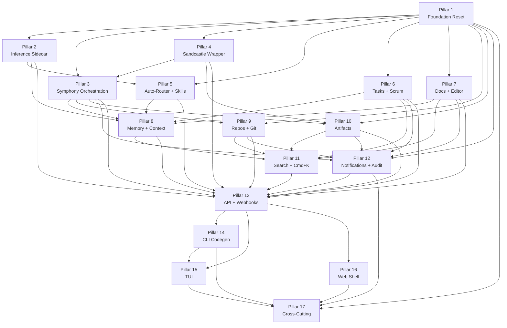

# Fulcrum Agent-OS — Master Execution Plan

## Linkage chain (top of file)

- Vision: `.scratch/agent-os-vision/VISION-GAPS.md`
- Requirements: `.scratch/agent-os-vision/REQUIREMENTS.md`
- Decisions: `.scratch/agent-os-vision/DECISIONS.md`
- PRDs: `.scratch/agent-os-vision/prds/0X-*.md` (17 pillars)
- Per-pillar issues: `.scratch/agent-os-vision/0X-<slug>/issues/`

---

## Vision summary

> Fulcrum is a local-first Agent OS — a Jira+Confluence-class product where human and AI agent work share identical projects, tasks, repos, docs, memory, and artifacts with no distinction between "AI project" and "human project." Interactive kanban/scrum boards, burndown charts, per-project reporting, memory and context management, orchestration with auto-assignment to CLI agents, and a skills system synced from mattpocock/skills. Full multi-user / accounts / collaboration / SaaS is designed and built from day one; default install runs entirely local, single auto-created user, no auth prompts, no network calls. Web+APIs primary, full CLI second, fully featured TUI last — all three shipped to feature parity at release.

---

## Foundational constraints

- **C1 — Online features shipped but disabled by default.** Every online-touching feature is designed, broken down, implemented, tested, and shipped behind `FULCRUM_FEATURES=<flag>`. Default is OFF. "MVP," "phase 2," "later" language is banned.
- **C2 — Local-only default; SaaS schema-ready from day 1.** Local mode = synthetic org `00000000-0000-0000-0000-000000000001` + auto-created `admin@local` user. Schema carries `org_id` + `user_id` everywhere. Composite `(org_id, sort_col)` indexes on every tenant-scoped table. SaaS mode flips `DATABASE_URL`; zero schema rewrites.
- **C3 — Research → recommend → plan → grill → break-down → execute, every domain.** Recommendations in `.scratch/agent-os-vision/research/`. Every pillar PRD carries failure gates and 2nd/3rd fallbacks.
- **C4 — Three surfaces, all shipped — Web+APIs primary, full CLI, full TUI.** All business logic behind tRPC. Surfaces: SvelteKit web UI, external REST+OpenAPI (`FULCRUM_FEATURES=public-api`), CLI via tRPC codegen (`--json` everywhere), OpenTUI in-process.
- **C5 — "Out of scope" framing is BANNED for any feature ever mentioned.** Every PRD's out-of-scope section restricted to: (1) items genuinely not in user's ask, or (2) cross-references to features owned by another named pillar. Anything mentioned in the verbatim ask lives in always-on or gated — never deferred.

---

## 17 Pillars at a glance

| # | Name | PRD path | Issues path | Issues | Always-on mix | Blocked-by |
|---|---|---|---|---|---|---|
| 1 | Foundation Reset | `prds/01-foundation-reset.md` | `01-foundation-reset/issues/` | 18 | Auth/tenancy/flags/tRPC skeleton always-on; casbin/pgvector/SaaS-auth gated | — |
| 2 | Inference Sidecar | `prds/02-inference-sidecar.md` | `02-inference-sidecar/issues/` | 14 | Embedded model + Unix socket always-on; Ollama/LM Studio/OpenAI-compat gated | 1 |
| 3 | Symphony Orchestration | `prds/03-symphony-orchestration.md` | `03-symphony-orchestration/issues/` | 22 | Poll loop + tracker adapter + conformance suite always-on; Linear/SSE/SSH gated | 1, 4 |
| 4 | Sandcastle Wrapper | `prds/04-sandcastle-wrapper.md` | `04-sandcastle-wrapper/issues/` | 17 | noSandbox + agent profiles + transcript capture always-on; Docker/Podman/Vercel/Daytona/Modal/E2B gated | 1 |
| 5 | Auto-Router + Skills | `prds/05-router-and-skills.md` | `05-router-and-skills/issues/` | 24 | json-rules-engine tier1/2 + skills loader + upstream sync always-on; LLM Haiku fallback gated | 1, 2 |
| 6 | Tasks + Scrum | `prds/06-tasks-and-scrum.md` | `06-tasks-and-scrum/issues/` | 28 | Full task CRUD + sprints + burndown + custom fields + saved views always-on; LLM sprint summary gated | 1 |
| 7 | Docs + Block Editor | `prds/07-docs-editor-collab.md` | `07-docs-editor-collab/issues/` | 25 | TipTap + doc trees + frontmatter + version history always-on; Yjs/Hocuspocus real-time collab gated | 1 |
| 8 | Memory + Context Engine | `prds/08-memory-context-engine.md` | `08-memory-context-engine/issues/` | 19 | Heuristic extractor + FTS retriever + context assembler always-on; pgvector hybrid + LLM extract gated | 1, 2, 3, 5, 6, 7 |
| 9 | Repos + Git Supervision | `prds/09-repos-git-supervision.md` | `09-repos-git-supervision/issues/` | 18 | chokidar local watcher + on-demand remote sync + multi-repo dashboard always-on | 1, 3 |
| 10 | Artifacts + Lifecycle | `prds/10-artifacts.md` | `10-artifacts/issues/` | 15 | Harvest pipeline + storage + retention always-on; LLM narration gated | 1, 3, 4 |
| 11 | Search + Facets + Cmd+K | `prds/11-search-and-discovery.md` | `11-search-and-discovery/issues/` | 18 | PGlite FTS + Orama + facets + saved searches + cmd+K always-on; semantic/pgvector search gated | 1, 6, 7, 8, 9, 10 |
| 12 | Notifications + Audit | `prds/12-notifications-activity-audit.md` | `12-notifications-activity-audit/issues/` | 22 | In-app feed + rules engine always-on; SMTP/webhook/Slack/Discord gated | 1, 3, 6, 7, 9, 10 |
| 13 | API + Webhooks | `prds/13-api-and-webhooks.md` | `13-api-and-webhooks/issues/` | 17 | tRPC consolidated router always-on; Hono OpenAPI + outbound webhooks + connectors gated | 1, 2–12 |
| 14 | CLI Codegen | `prds/14-cli-codegen.md` | `14-cli-codegen/issues/` | 13 | Full codegen + `--json` everywhere + single binary always-on | 1, 13, 2–12 |
| 15 | TUI | `prds/15-tui.md` | `15-tui/issues/` | 19 | Full OpenTUI feature parity; ratatui fallback if OpenTUI immature | 1, 13, 14, 2–12 |
| 16 | Web Shell Rebuild | `prds/16-web-shell-rebuild.md` | `16-web-shell-rebuild/issues/` | 28 | Full SvelteKit app consuming all pillars always-on; Tauri/PWA gated | 1–13 |
| 17 | Cross-Cutting Platform | `prds/17-cross-cutting-platform.md` | `17-cross-cutting-platform/issues/` | 22 | Secrets/backup/crash-log/theming/i18n/telemetry/feature-flag rollout always-on core; remote reporters/vault/experiments gated | 1, 12, 13, 14, 15, 16 |

**Total: 339 issues across 17 pillars**

---

## Dependency DAG

### Why each major blocking edge exists

**P1 → everything**: Foundation seeds the DB schema, auth session, tRPC context, feature-flag registry, and binary entrypoint. Every pillar calls `isEnabled()`, reads `orgId` from tRPC context, and runs migrations on top of Pillar 1's migration chain. Without it, no other migration can run safely.

**P4 → P3 (Sandcastle blocks Symphony)**: Symphony's orchestrator dispatches tasks via the `AgentRunRequest` / `AgentRunResult` interface that Pillar 4 defines. The `before_run` and `after_run` hooks — central to Symphony's state machine — call Sandcastle's `createWorktree()` and `copyFileOut()`. Pillar 3 cannot close integration tests without Pillar 4 present.

**P2 → P5 (Inference blocks Router)**: The LLM fallback tier (json-rules-engine returns no match → call `inference.generate()` for agent selection) is gated but ships. Pillar 5's `auto-assign.ts` imports `src/inference/client.ts`. Even with the `router-llm` flag OFF by default, the import must resolve — requiring P2's TS client module to exist.

**P8 (Memory) depends on P3, P5, P6, P7**: Context assembly (`src/context/assemble.ts`) pulls four slices: (1) memory rows via retriever, (2) linked docs from Pillar 7 wikilinks, (3) recent transcripts from Pillar 3 runs, (4) skill prompts from Pillar 5 skills registry. Without stable event contracts from P3/P6/P7 (agent-run transcript path, task description, doc save event), the heuristic extractor's fixture tests can't run.

**P11 (Search) depends on P6, P7, P8, P9, P10**: The unified `search_documents` table is only meaningful once entities exist. Each entity-owning pillar writes indexer hooks. The FTS ranking test requires fixture rows from at least tasks, docs, and memories. Running P11 before these pillars produce rows would make the facet and ranking tests vacuous.

**P13 → P14 (API blocks CLI Codegen)**: The codegen script reads the `AppRouter` TypeScript type exported from Pillar 13's consolidated router. If procedure signatures are still changing (sub-routers from Pillars 2–12 still landing), snapshot divergences break the codegen CI gate. P13 must seal the `AppRouter` type before P14 can lock its snapshot.

**P13 → P16 (API blocks Web Shell)**: The web shell's SvelteKit routes use `createTRPCClient` with the `AppRouter` type. Without a sealed router from P13, the web's TypeScript compilation is blocked and Playwright e2e tests cannot run.

---

## Critical path

**Longest dependency chain:** P1 → P4 → P3 → P8 → P11 → P13 → P14 → P15

Length: 8 pillars. Every link in this chain is blocking sequential work:
- P4 must exist before P3's integration tests pass (Sandcastle dispatch + harvest).
- P3 must emit `after_run` transcript before P8's heuristic extractor can be tested end-to-end.
- P8's context assembler must be stable before P11's search bundle includes memory context.
- P11's `search.query` procedure must exist before P13 can seal the `AppRouter` type.
- Sealed `AppRouter` is the prerequisite for P14 codegen and P15 TUI in-process caller.

**Parallel lanes running while critical path is in flight:**

- Lane A (independent of P3/P8 after P1): P5 (router + skills), P6 (tasks + scrum), P7 (docs + editor), P9 (repos).
- Lane B (after P3+P4 prerequisites land): P10 (artifacts) — needs Sandcastle `copyFileOut()` and Symphony `after_run`.
- Lane C (after entity event streams stabilize): P12 (notifications) — reads events from P6, P7, P9, P10.
- Lane D (after P13 seals `AppRouter`): P16 (web shell) — overlaps with P14 + P15.
- Lane E (cross-cutting): P17 slices run as soon as each owning surface is stable.

---

## Continuous execution lanes

Execution is one continuous dependency queue from current state to final release.
Old milestone labels are obsolete for execution. They remain only as historical
planning context in older logs. The orchestrator keeps up to 6 implementation slots and
up to 6 opposite-runtime review slots active until all issues are complete.

**Queue rules:**
- Dispatch an issue only when every `Blocked-by:` issue is `Status: completed`.
- Refill a freed implementation slot immediately; do not wait for a six-issue batch or a pillar boundary.
- Prioritize critical-path blockers, then issues that unlock most downstream work, then lowest-completion pillars.
- A CI failure gets a debug slot; unrelated safe work continues if the failing surface is isolated.
- HITL pauses only the blocked issue and its dependents; all other dispatchable work continues.

**Mandatory cross-runtime loop (D6):**
- Claude implementer → Codex reviewer.
- Codex implementer → Claude reviewer.
- No same-runtime final approval. No orchestrator self-review.
- A completed issue without logged opposite-runtime approval is review debt and must be backfilled before new implementation capacity is filled.

**Lane 0 — Bootstrapping / active baseline**
Read artifacts; verify toolchain (Bun ≥ 1.3.10 pinned for Stage-3 decorators per C8, Rust stable, PGlite file-backed via `mikro-orm-pglite`, MikroORM v7 ES-decorator mode per C7, needle-di Stage-3 DI per C8); confirm `bun run ci` green; install missing dev deps only when an issue requires them.

**No-plaintext-SQL guarantee (C6):** all schema changes ship as MikroORM migration classes at `src/db/migrations/Migration<timestamp>.ts` auto-generated from entity decorator diffs. Hand-written `.sql` files are forbidden in repo (test fixtures excepted). Tagged-template SQL outside ORM-generated migration class files is forbidden. Reviewer enforces.

**Lane 1 — Foundation spine**
Pillar 1 must complete before most downstream domain work. Highest-risk items: Better-Auth v1 PGlite adapter, `assertPermission` middleware + lint rule, and tRPC core router + Zod schema folder scaffold.

**Lane 2 — Inference + orchestration primitives**
Pillar 2 and early Pillar 3 issues proceed as soon as P1 prerequisites are present. Highest-risk items: Rust inference workspace cross-compilation, Symphony conformance RED-first coverage, and Unix socket JSON-RPC burst stability.

**Lane 3 — Current broad product lanes**
P4, P5, P6, P7, P9, P10, and remaining P3 run continuously with dependency ordering:
- P4 (Sandcastle) unlocks P3 integration and P10 harvest.
- P5 (Router + Skills), P6 (Tasks + Scrum), P7 (Docs + Editor), and P9 (Repos) run independently after P1.
- P7 TipTap Svelte-5 binding spike is a HITL gate for dependent editor issues only.
- P10 starts as soon as P3 + P4 provide required run/artifact hooks.

Highest-risk items: TipTap binding compatibility, Symphony `after_run` → Sandcastle `copyFileOut()` → artifact harvest, and P6 metrics cache / burndown correctness.

**Lane 4 — Memory, search, notifications**
P8 starts when P3/P5/P6/P7 event contracts are stable. P11 starts when entity pillars can emit `search_documents`. P12 starts when event streams from P3/P6/P7/P9/P10 are stable. Highest-risk items: token-budget context truncation, Orama incremental search latency, notification fan-out volume.

**Lane 5 — API, CLI, TUI, web shell, cross-cutting**
P13 seals `AppRouter`; P14, P15, and P16 proceed after that seal; P17 slices run as each dependent surface stabilizes. Highest-risk items: compiled binary size, OpenTUI maturity gate, and SvelteKit shell teardown/build stability.

**Final integration lane**
Cross-pillar e2e runs continuously as surfaces become available and as a final release gate: create-project → create-task → dispatch-agent → run-completes → artifact-appears-in-search → notification-fires → audit-log-has-event. Performance budgets, `fulcrum doctor --json`, release binary size, startup time, branch review, merge, push, and tag are final finish-line gates.

---

## Issue ordering by dependency lane

| Pillar | Issues dir | Count | HITL | AFK | Notes |
|---|---|---|---|---|---|
| 1 | `01-foundation-reset/issues/` | 18 | 1 | 17 | HITL: passkey UX sign-off before Playwright auth lock-in |
| 2 | `02-inference-sidecar/issues/` | 14 | 0 | 14 | POC gate: Rust ARM64 compile must pass before P2.04+ |
| 3 | `03-symphony-orchestration/issues/` | 22 | 0 | 22 | Conformance suite must go RED before any GREEN implementation |
| 4 | `04-sandcastle-wrapper/issues/` | 17 | 0 | 17 | `noSandbox` e2e must pass before Docker/cloud providers land |
| 5 | `05-router-and-skills/issues/` | 24 | 0 | 24 | json-rules-engine tier1/2 must pass before LLM tier3 even wired |
| 6 | `06-tasks-and-scrum/issues/` | 28 | 0 | 28 | Schema issues first; burndown last (depends on metrics_cache) |
| 7 | `07-docs-editor-collab/issues/` | 25 | 1 | 24 | HITL: TipTap Svelte5 spike (#02) must clear before any extension issues |
| 8 | `08-memory-context-engine/issues/` | 19 | 0 | 19 | Heuristic extractor before embeddings (gated); context assembler last |
| 9 | `09-repos-git-supervision/issues/` | 18 | 0 | 18 | Local watcher before remote on-demand sync |
| 10 | `10-artifacts/issues/` | 15 | 0 | 15 | Storage backend before harvest pipeline; retention pruner last |
| 11 | `11-search-and-discovery/issues/` | 18 | 0 | 18 | FTS query first; Orama incremental; cmd+K last (needs all entity indexers) |
| 12 | `12-notifications-activity-audit/issues/` | 22 | 0 | 22 | Fan-out worker before channel dispatchers; audit query UI last |
| 13 | `13-api-and-webhooks/issues/` | 17 | 0 | 17 | tRPC consolidation first; OpenAPI/webhooks after all sub-routers stable |
| 14 | `14-cli-codegen/issues/` | 13 | 0 | 13 | Codegen scaffold → snapshot gate → binary compile → cross-targets |
| 15 | `15-tui/issues/` | 19 | 0 | 19 | Foundation + global widgets first; domain screens after domain pillars stable |
| 16 | `16-web-shell-rebuild/issues/` | 28 | 0 | 28 | v0 teardown first; shell + auth routes; domain routes last |
| 17 | `17-cross-cutting-platform/issues/` | 22 | 1 | 21 | HITL: governance file review (GOVERNANCE.md, SECURITY.md, CODE_OF_CONDUCT.md) |

**HITL items that MUST clear before dependent work proceeds:**
- P1 HITL (passkey UX) — must resolve before Playwright auth suite is locked.
- P7 HITL (TipTap spike) — must resolve before any dependent P7 extension issue starts; 24 downstream issues depend on the compat verdict.
- P17 HITL (governance files) — must resolve before release pipeline; SECURITY.md must ship before any public binary is released.

---

## Cross-pillar coordination items

### AppRouter type stability
- **Owner:** Pillar 13 (API + Webhooks)
- **Registers:** Pillars 2–12 each provide one domain sub-router merged here
- **Consumers:** Pillar 14 (codegen reads `AppRouter` type), Pillar 15 (TUI in-process caller), Pillar 16 (web `createTRPCClient`)
- **Freeze by:** P13 `AppRouter` seal issue completion. Sub-routers from P2–P12 must finalize procedure signatures before P13 seals. Any post-freeze procedure add requires a P13 amendment issue.

### Edge-type registry
- **Owner:** Pillar 1 (Foundation) — `edges` table DDL + canonical `kind` values documented in Foundation PRD "Entity Relationship Graph" subsection
- **Registers:** Pillar 7 (`doc→wikilink→doc`, `doc→references→task`), Pillar 8 (`memory→about→doc`, `memory→extracted_from→agent_run`), Pillar 10 (`artifact→generated_by→agent_run`)
- **Freeze by:** P1 edge registry issue completion. New `kind` values must ship via PRD addendum + migration, not free-form strings.

### Event payload schemas registry
- **Owner:** Pillar 1 (Foundation) — `events` table DDL; `events.payload` validated on write via per-event Zod schema registered at module init
- **Registers:** Every pillar emitting events registers its Zod payload schema in `src/events/schemas/<domain>.ts`
- **Freeze by:** Per emitting pillar as its event-producing issue completes. P12 (Notifications) depends on stable schemas from all entity pillars — entity event schemas must be stable before P12 fan-out worker.

### Feature-flag registration
- **Owner:** Pillar 1 (Foundation) — `feature_flags` table + `src/flags/registry.ts`; flag names frozen per D5 (lowercase-with-hyphens)
- **Registers:** Every pillar adds its gated flags at module init; full registry documented in `src/flags/registry.ts`
- **Freeze by:** P1 feature-flag registry completion for all known flag names. New flags require Foundation PRD addendum.

### Doctor extension registration
- **Owner:** Pillar 14 (CLI Codegen) — aggregates all `src/doctor/checks/<domain>.ts` modules; `fulcrum doctor --json` runs all registered checks
- **Registers:** Every pillar contributes a `src/doctor/checks/<pillar>.ts` module with Zod-validated check results
- **Freeze by:** Each pillar's doctor-check issue completion. Pillar 14 wires the aggregator; final integration validates all checks pass together.

### Search indexer hooks
- **Owner:** Pillar 11 (Search) — `search_documents` table + `upsert(entityId)` indexer interface
- **Registers:** Pillar 6 (tasks), Pillar 7 (docs), Pillar 8 (memories), Pillar 9 (repos), Pillar 10 (artifacts), Pillar 3 (agent runs) each call the indexer hook on create/update
- **Freeze by:** P11 search indexer hook issue completion. Indexer hook signature must be stable before P11 ships; entity pillars call it; P11 implements it.

### Keybinding registry
- **Owner:** Pillar 14 (CLI Codegen) — `src/keybindings/schema.ts` Zod enum of canonical actions
- **Consumers:** Pillar 16 (Web hotkey handler), Pillar 15 (TUI help pane), `fulcrum --help` banner
- **Freeze by:** P14 keybinding registry issue completion. Schema must be stable before P15 TUI help pane and P16 hotkey wiring land.

### Theme contract
- **Owner:** Pillar 17 (Cross-Cutting) — `useTheme()` composable + CSS var generation + `tenant_settings` reads
- **Consumers:** Pillar 16 (Web shell `+layout.svelte` injects CSS vars), Pillar 15 (TUI theme engine)
- **Freeze by:** P17 theme contract issue completion. P16 and P15 must not hard-code CSS vars before P17 theme contract is locked.

---

## Continuous quality gates

**TDD discipline (all issues):** Every issue follows RED test → GREEN implementation → REFACTOR. No implementation starts without a failing test. Codegen-produced code is exempt from TDD but must have snapshot + type-check gate.

**`bun run ci` composition (target: 9/9 green continuously, grows as gates land):**
1. `biome:lint` — type-check + lint
2. `vitest:unit` — unit tests
3. `bun:integration` — DB integration (PGlite + PostgreSQL)
4. `playwright:e2e` — auth, critical flows
5. `cargo:test` — Rust inference workspace once inference lane lands
6. `symphony:conformance` — conformance suite once orchestration lane lands
7. `web:build` — SvelteKit type-check + build once web shell lane lands
8. `codegen:snapshot` — CLI codegen snapshot gate once codegen lane lands
9. `doctor:check` — `fulcrum doctor --json` exits 0 as checks accumulate

**Milestone gates:**
- Foundation: `bun run ci` core gates green; `fulcrum init` seeds org + user; `auth.whoami --json` correct.
- Inference/orchestration: `cargo:test` + `symphony:conformance`; inference binary runs on macOS + Linux; conformance test 0 REQUIRED failures.
- Entity lanes: all entity CRUD tRPC procedures type-check; `fulcrum task create --json` returns typed payload; TipTap loads in browser smoke test.
- Memory/search/notifications: `search.query` returns ranked results across 5 entity kinds; notification fan-out tested at 100-event burst; memory heuristic extractor produces rows from fixture transcript.
- Surface lanes: `web:build` + `codegen:snapshot`; `fulcrum --version` exits 0 from compiled binary; TUI launches without error on macOS + Linux; all Playwright domain e2e tests green.
- Final: all CI gates green; `fulcrum doctor --json` all-subsystems pass; cross-pillar e2e < 30s; release pipeline cross-compiles 5 targets.

---

## Risk register (top 10)

| # | Risk | Source PRD | Probability | Impact | Mitigation | Early-warning signal |
|---|---|---|---|---|---|---|
| R1 | Better-Auth v1 PGlite adapter breaks on WASM foreign keys | P1 | Medium | Critical (blocks all auth) | Spike P1.06 with FK constraint round-trip test day 1; fallback: Auth.js v5 (same schema) | `bun test src/auth` fails on FK cascade |
| R2 | TipTap + Svelte 5 runes incompatibility | P7 | Medium | High (blocks all editor features) | HITL spike is issue #02 of P7; must clear before P7.03+; fallback: Tipex → Milkdown chain | TipTap HITL spike verdict in `docs/adrs/` |
| R3 | `fastembed-rs` ONNX link fails on macOS ARM64 | P2 | Medium | Medium (blocks embeddings flag) | POC run before any embedding consumers built; fallback: `candle` embeddings | `cargo build --release` exit non-zero on ARM64 |
| R4 | `bun build --compile` binary > 150 MB | P14 | Low-Medium | Medium (forces binary split) | Size check in P14.11; measure after most domain code lands | Binary size > 130 MB warn threshold triggers |
| R5 | OpenTUI maturity insufficient for full TUI parity | P15 | Medium | High (forces ratatui Rust fallback) | Evaluate OpenTUI against P15 screen list as soon as P15 prerequisites are stable; decision before full TUI buildout | OpenTUI hello-world + 2 screens POC fails |
| R6 | Symphony SPEC.md breaking revision mid-execution | P3 | Low | High (conformance suite fails) | Daily sync job + drift report; conformance suite RED on breaking change immediately | `scripts/gen-conformance-trace.ts` hash diverges |
| R7 | `candle` Metal backend GPU OOM on M-series Macs | P2 | Low-Medium | Low (CPU fallback OK) | Launch with `--no-metal` by default; Metal opt-in via `FULCRUM_INFERENCE_METAL=1`; doctor warns | `inference.health` returns `status:'degraded'` |
| R8 | graphile-worker advisory lock contention at scale | P3, P12 | Low | Medium (fan-out latency) | Load-test with 1000-event burst before accepting notification fan-out; fallback: `pg-boss` | Notification fan-out > 5s p95 |
| R9 | PGlite file-backed mode data corruption under Bun hot-reload | P1 | Low | Critical (data loss) | Always use `--no-hot-reload` for `fulcrum web`; test file persistence across restart during foundation lane | Doctor `foundation.schema-version` fails after restart |
| R10 | `@ai-hero/sandcastle` v0.5.6 Effect TS peer dep conflicts | P4 | Low-Medium | Medium (sandcastle unusable) | Pin exact version; isolate Effect imports to `sandbox-runner.ts` boundary; fallback: `Bun.spawn` + `simple-git` | `bun install` peer dep resolution errors |

---

## Execution policy

**Per-issue TDD-first:** Every implementer starts by writing a failing test (`RED`) before any implementation code. No PR is mergeable without the test existing. Codegen-output files are exempt from TDD but require snapshot-gate test.

**Subagent dispatch model:**
- Continuous queue: up to 6 implementation subagents and up to 6 opposite-runtime review subagents active whenever dependencies allow.
- Partition by file ownership to avoid collisions: each subagent owns one pillar's `src/<domain>/` directory.
- Claude implementation requires Codex review; Codex implementation requires Claude review. Same-runtime approval does not count.
- After each subagent reports complete: run `git status` + `git diff --stat`, focused tests, and `bun run ci` when shared contracts/migrations changed before accepting result.
- Cross-pillar integration points (event schemas, `AppRouter` merge, search indexer hooks): coordinated by the orchestrating agent, not delegated to subagents.

**Cross-pillar items frozen via PRD addendum:** No cross-pillar contract (edge types, event schemas, flag names, keybinding actions) changes after its owning freeze issue without:
1. Adding an issue to the owning pillar's `issues/` directory.
2. Updating the owning PRD with a dated addendum section.
3. Updating `DECISIONS.md` with the new decision.

**Master-plan updates:** This file is updated only when `DECISIONS.md` is updated first. No code change triggers a MASTER-PLAN update without a corresponding DECISIONS.md entry.

---

## Open follow-up streams (from EXTRA-GAPS.md, not in current 17-pillar scope)

- **Mobile (React Native / Capacitor over tRPC):** Captured for follow-up vision pass; not in current 17-pillar scope. tRPC API (`FULCRUM_FEATURES=public-api`) provides the surface; mobile shell is a separate initiative.
- **Enterprise SSO (WorkOS / Authelia / SAML / SCIM):** Captured for follow-up vision pass; not in current 17-pillar scope. Better-Auth `saas-auth` flag is the extension point.
- **Plugin system for user-defined agent types:** Captured for follow-up vision pass; agent profile registry in P4 is the extension point; plugin loading mechanism is a separate initiative.
- **Model-cost accounting and budget enforcement:** Captured for follow-up vision pass; `agent_runs.cost_usd` column exists in schema; cost reporting UI and budget gates are a separate initiative.
- **Migration downgrade strategy (paired `Migration<timestamp>.down()` methods):** Captured for follow-up vision pass; MikroORM auto-emits both `up()` and `down()` methods on every generated migration class, but the downgrade-from-current execution plan uses up-only migrations operationally; downgrade tooling (running `down()` against a target version + lossy-write protections) is a separate initiative post-v1.0 needed before SaaS multi-tenant launch.

---

## Checklist for the user before execution starts

- [ ] Sign off on `REQUIREMENTS.md` (all 17 pillars, cross-cutting requirements, stack decisions)
- [ ] Sign off on `DECISIONS.md` (all Q-IDs locked: Q1–Q38 + A1/A2/A4/A6 + C1–C5 + D1/D3/D4/D5)
- [ ] Sign off on per-pillar PRDs (`prds/01-*.md` through `prds/17-*.md`) — each PRD's "Acceptance criteria" section reviewed
- [ ] Sign off on issue breakdown per pillar (339 issues total across 17 `*/issues/` directories)
- [ ] Confirm execution policy: TDD-first (RED before GREEN) + continuous subagent dispatch (up to 6 implementation slots + 6 opposite-runtime review slots) + cross-pillar freeze via PRD addendum
- [ ] Confirm release cadence + v1.0 readiness criteria: all 17 pillars shipped + `bun run ci` 9/9 green + `fulcrum doctor --json` all-subsystems pass + 90-day bug-bash window per `VERSIONING.md`

---

## Status

ready-for-execution
