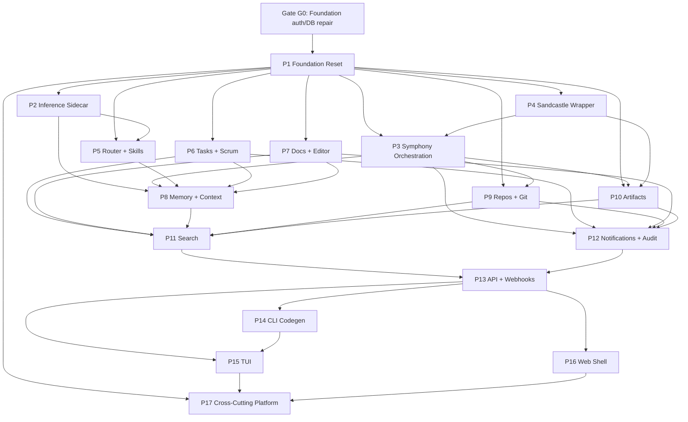

# Fulcrum Agent-OS Task DAG + Parallelization Gates

> **For agentic workers:** REQUIRED PRE-FLIGHT: read this file before claiming work from `.scratch/agent-os-vision/*/issues/*.md`. Parallelism is allowed only when dependency, write-set, and convergence-gate checks pass.

**Goal:** Preserve parallel implementation speed without letting shared schema, auth, router, or migration surfaces drift.

**Architecture:** Existing issue `Blocked-by:` frontmatter remains the source dependency DAG. This file adds execution lanes, write-set conflict rules, agent role boundaries, and convergence gates so independent leaves can run in parallel while shared contracts converge deliberately. Full closure scheduling lives in `TASK-BUNDLES.md` and `TASK-DAG-FULL.json`.

**Tech Stack:** Bun, MikroORM v7 decorator entities, PGlite/Postgres migrations, SvelteKit, tRPC, Rust inference sidecar, local git worktrees.

---

## Operating Rules

1. **WIP limit by risk surface.** At most one active writer may touch each protected surface: `src/db/migrations`, `src/db/entities`, `src/auth`, `src/permissions`, `src/trpc/middleware.ts`, `src/server/trpc/routers`, generated CLI/TUI surface contracts, and migration snapshots.
2. **Concurrency is conditional.** Target worker count is an upper bound, not a mandate. Fill only slots whose write sets are disjoint and whose dependencies are green.
3. **Leaves run in parallel; convergence gates review bundles.** Do not full-CI every leaf. Do run bundle tests and reviews when multiple leaves meet a shared contract.
4. **Every claimed issue gets a write set.** If write set cannot be named before dispatch, the issue is not dispatchable.
5. **Green slices commit quickly.** Worker output must be a focused green commit in its worktree or an explicit blocked report. Dirty long-lived branches count as WIP and reduce capacity.
6. **Review earlier for high-risk surfaces.** Auth, permissions, migration, public API, data import/export, and shell-out changes get plan or early-diff review before large implementation continues.
7. **Full CI only at convergence/release gates.** Leaf verification uses focused tests. `bun run ci` is reserved for shared contract joins, final merge, and release.
8. **Stop-loss timer.** If a leaf exceeds 90 minutes without focused green tests, pause that lane and classify the delay: unclear acceptance, bad dependency, wrong owner, tool failure, or hidden shared contract.

---

## Task Record

Every dispatchable task must have this shape in the orchestrator prompt or issue ledger:

```md
id:
goal:
depends_on:
owner_agent:
runtime:
write_set:
read_set:
shared_contracts:
acceptance_tests:
cheap_checks:
convergence_gate:
risk:
stop_loss:
```

Minimum required fields before dispatch: `id`, `depends_on`, `owner_agent`, `write_set`, `acceptance_tests`, `convergence_gate`, `risk`.

---

## Full Closure Scheduler

Authoritative full-closure artifacts:

- `TASK-DAG-FULL.json`: machine-readable graph for all 341 issues, including dependencies, reverse blockers, inferred risk surface, write set, required tests, bundle id, and current dispatchability.
- `TASK-BUNDLES.md`: human-readable bundle plan. Use this for orchestration. It groups related issues that should often be handled by one agent because shared context is cheaper than parallel merge coordination.

Dispatch order:

1. Choose from `TASK-BUNDLES.md`, not raw issue count.
2. Prefer one agent for a multi-issue bundle when issues share topic, files, or contract.
3. Split a bundle only when write sets are truly disjoint and no protected surface is shared.
4. Run convergence gates at bundle boundaries and cross-bundle dependency joins.

If this file and `TASK-BUNDLES.md` differ, `TASK-BUNDLES.md` wins for current state and bundle membership; this file wins for safety policy.

---

## Dependency Hierarchy



`G0` is explicit because current P1 repair touches auth, permissions, migrations, seed, doctor checks, and tRPC context. No other writer should touch those surfaces until G0 lands or is abandoned.

---

## Parallelization Matrix

| Surface | Max writers | Parallel-safe with | Never parallel with |
|---|---:|---|---|
| Migration/entity/snapshot | 1 | Read-only research, UI-only work | Any other migration/entity/snapshot writer |
| Auth/session/seed | 1 | Rust inference, docs-only, isolated web SSR tests | Permissions, tRPC context, user entities |
| Permissions/Casbin | 1 | Rust inference, isolated docs editor UI | Auth adapter, tRPC middleware, feature flags |
| tRPC router namespace | 1 per namespace | Different router namespace after shared context sealed | `src/trpc/middleware.ts`, shared context/container changes |
| CLI command group | 1 per command group | Sealed router/backend contracts | Active router signature changes |
| TUI screen group | 1 per screen group | Sealed router/backend contracts | Active router signature changes |
| Web route group | 1 per route group | Sealed API and isolated component trees | Shared layout/theme/auth hooks |
| Rust inference sidecar | 2 | Web/docs/auth if no generated API touched | TS inference protocol/client changes without gate |
| Docs/research/review | 6+ | Any implementation lane if read-only | Same files as writer unless assigned review |

---

## Gate Types

### Leaf Checkpoint

Run before a worker reports DONE.

Required:
- Focused RED evidence, then focused GREEN evidence.
- `git status --short` in worker worktree.
- `git diff --stat` and touched file list.
- `bun run lint` when TS/Svelte changed.
- Relevant cargo test when Rust changed.

No full CI unless the leaf changed a protected surface.

### Contract Gate

Run when a shared contract changes.

Triggers:
- Migration/entity/snapshot change.
- Auth/session/permission/context change.
- tRPC router type or exported schema change.
- CLI/TUI generated surface change.
- Rust/TS inference protocol change.

Required:
- Bundle focused tests across every consumer.
- Opposite-runtime review.
- `semgrep --config auto` for auth, permissions, deserialization, SQL-ish migration services, shell-out, and public endpoints.
- `gitleaks detect --staged` if env/config/secrets/CI/dependencies changed.

### Integration Gate

Run when related leaves form a user-visible slice.

Required:
- All leaf checkpoints green.
- Bundle test command named in gate record.
- One integrator owns merge conflicts and status flips.
- Review findings resolved or explicitly parked with issue IDs.

### Release Gate

Run before merge to the main execution branch.

Required:
- `bun run ci`
- `git diff --check`
- `git status --short`
- Review debt count = 0 for included surfaces.
- Execution log entry with tests, review provenance, commit SHAs, and any known residual risk.

---

## Agent Roles

| Role | Writes code? | Responsibility |
|---|---:|---|
| Orchestrator | Yes, only integration fixes | Select DAG leaves, assign write sets, enforce WIP, run gates, merge |
| Research agent | No | Summarize options, prior art, local code patterns, docs |
| Contract/test agent | Usually tests only | Define acceptance tests and shared contract fixtures |
| Implementer | Yes | Own exact write set and focused tests |
| Reviewer | No | Opposite-runtime review at contract/integration gates |
| Integrator | Yes | Merge safe leaves, fix join conflicts, run bundle verification |

One person can hold multiple roles sequentially, but not inside the same gate approval. Implementer cannot be final reviewer for their own gate.

---

## Dispatch Algorithm

1. Parse all issues and normalize status aliases: `needs-review` = `integration-review`.
2. Build dependency graph from `Blocked-by:`.
3. Mark leaves dispatchable only when dependencies are `implemented` or `completed`.
4. Assign each leaf a write set from issue body and current code map.
5. Remove any leaf whose write set intersects active WIP or active gate.
6. Rank remaining leaves:
   - Critical path first.
   - Unlocks most blocked tasks.
   - Highest risk earlier if dependency-safe, so review happens early.
   - Lowest completion pillar only as tie-breaker.
7. Dispatch up to the safe capacity from the matrix, not the theoretical capacity.
8. When a worker returns, run leaf checkpoint.
9. If enough leaves converge, run contract/integration gate before downstream work uses the contract.
10. Commit, merge, and update issue statuses only after gate passes.

---

## Current Convergence Queue

Snapshot from `TASK-BUNDLES.md` generated on 2026-05-02:

- `completed`: 27
- `implemented`: 17
- `integration-review`: 15
- `in-progress`: 4
- `ready-for-agent`: 278
- `bundles`: 154 total; 114 ready-for-agent, 14 implemented, 8 integration-review, 4 in-progress, 11 mixed, 3 completed
- `safe_to_dispatch_now`: 2 low-risk memory/docs bundles while the active protected gate is open
- P1 repair worktree: `/Users/mkh/.config/superpowers/worktrees/fulcrum/agent-os-p1-gate-repair`
- P1 repair verification: `bun run ci` passed in repair worktree, but branch is still uncommitted/unmerged.

### G0 - Foundation Auth/DB/Permissions Repair

Risk: high.

Freeze:
- All migration/entity/snapshot writers.
- Auth, permissions, tRPC middleware/context, feature flag registry, seed, doctor/migrator writers.

Inputs:
- `01-foundation-reset/issues/01-schema-auth-migration.md`
- `01-foundation-reset/issues/02-events-org-id-backfill.md`
- `01-foundation-reset/issues/03-composite-indexes-and-flag-stub-tables.md`
- `01-foundation-reset/issues/04-local-org-seed-and-init.md`
- `01-foundation-reset/issues/05-better-auth-integration.md`
- `01-foundation-reset/issues/07-feature-flag-registry.md`
- `01-foundation-reset/issues/10-cli-auth-and-flags-verbs.md`
- `01-foundation-reset/issues/11-web-login-signup-logout-pages.md`
- `01-foundation-reset/issues/12-web-invitation-accept-and-user-management-ui.md`
- `01-foundation-reset/issues/14-saas-auth-gated-oauth-and-email-otp.md`
- `01-foundation-reset/issues/15-tui-base-shell-and-auth-flags-screens.md`
- `01-foundation-reset/issues/16-casbin-policies-gated-flag.md`
- `01-foundation-reset/issues/17-zod-schemas-and-trpc-domain-stubs.md`
- `01-foundation-reset/issues/18-test-infrastructure-baseline-and-ci.md`
- `01-foundation-reset/issues/19-migration-up-down-versioning.md`

Gate commands:

```bash
bun test tests/auth/better-auth-integration.test.ts tests/permissions/casbin-adapter.test.ts tests/trpc/flags.test.ts tests/db/migrator-service.test.ts
bun run lint
semgrep --config auto src/auth src/permissions src/server/trpc/routers/flags.ts src/trpc/middleware.ts src/db/seed.ts src/db/migrator-service.ts src/db/doctor-checks.ts src/db/migrations/Migration20260501104413_auth.ts src/db/migrations/Migration20260502101000_user_email_verified.ts
bun run ci
git diff --check
```

Exit criteria:
- Commit P1 repair.
- Fast-forward merge into `plan/agent-os-vision` if main worktree is clean.
- Status ledger moved from `integration-review` to `completed` only after review debt is resolved.

### G1 - Inference Models + Embed Contract

Risk: medium.

Inputs:
- `02-inference-sidecar/issues/05-embed-operation.md`
- `02-inference-sidecar/issues/06-models-registry-pull-list-rm.md`

Parallel-safe while G0 active:
- Rust-only review/research.
- No tRPC/web settings edits until G0 lands, because auth/context hooks are in flux.

Gate commands:

```bash
cargo test --manifest-path inference/Cargo.toml --workspace
bun test src/cli/inference.test.ts src/server/trpc/routers/__tests__/inference.test.ts src/web/src/routes/settings/inference/page.svelte.test.ts
```

### G2 - Symphony Dispatch Core

Risk: high.

Inputs:
- `03-symphony-orchestration/issues/06-state-machine-claim-lock.md`
- `03-symphony-orchestration/issues/09-lifecycle-hooks.md`
- `03-symphony-orchestration/issues/10-retry-backoff-stall-detection.md`

Blocked until:
- `03-symphony-orchestration/issues/10-retry-backoff-stall-detection.md` exits `in-progress`.
- G0 lands if any event/auth/context fixture touches shared DB setup.

Gate commands:

```bash
bun test tests/symphony/orchestrator-claim-lock.test.ts tests/symphony/tracker-fetch-candidate-issues.test.ts tests/symphony/workspace.test.ts tests/symphony/prompt.test.ts tests/cli/symphony.test.ts
```

### G3 - Router + Skills Runtime

Risk: medium.

Inputs:
- `05-router-and-skills/issues/01-routing-rules-schema-migration.md`
- `05-router-and-skills/issues/05-routing-telemetry.md`
- `05-router-and-skills/issues/11-pglite-listen-hot-reload.md`
- `05-router-and-skills/issues/14-skills-upstream-sync.md`

Blocked until:
- G0 lands for migration snapshot stability.

Gate commands:

```bash
bun test src/router/rules-engine.test.ts src/router/auto-assign.test.ts tests/skills/loader.test.ts tests/db/migrations/routing-rules.test.ts tests/db/migrations/skills-schema.test.ts
```

### G4 - Product Schema Pack

Risk: high.

Inputs:
- `06-tasks-and-scrum/issues/01-tasks-schema-extension.md`
- `06-tasks-and-scrum/issues/02-sprints-schema.md`
- `06-tasks-and-scrum/issues/04-saved-views-schema.md`
- `07-docs-editor-collab/issues/01-docs-schema-foundation.md`
- `07-docs-editor-collab/issues/04-doc-template-seeds.md`
- `08-memory-context-engine/issues/01-schema-migration-core.md`

Blocked until:
- G0 lands.
- `07-docs-editor-collab/issues/04-doc-template-seeds.md` exits `in-progress`.
- No other migration writer is active.

Gate commands:

```bash
bun test tests/db/migrations/tasks-schema-extension.test.ts tests/db/migrations/sprints-schema.test.ts tests/db/migrations/saved-views.test.ts tests/db/migrations/docs-schema-foundation.test.ts tests/db/migrations/docs-related-tables.test.ts tests/db/migrations/memory-context-core.test.ts
bun run lint
```

### G5 - Cross-Cutting Secrets/Platform

Risk: high.

Inputs:
- `17-cross-cutting-platform/issues/02-secrets-keyring-and-vault.md`

Blocked until:
- G0 lands if it touches auth/user/org fixtures.
- P17 worker returns focused green commit with dependency additions justified.

Gate commands:

```bash
bun test tests/platform/secrets*.test.ts tests/trpc/*secrets*.test.ts
bun run lint
semgrep --config auto src/platform src/server/trpc src/db/entities
gitleaks detect --staged
```

### G6 - TUI Foundation

Risk: medium.

Inputs:
- `15-tui/issues/01-tui-foundation-launcher.md`

Parallel-safe while G0 active only if:
- It avoids auth, permissions, migrations, and router signature changes.
- It owns isolated TUI files and fixtures.

Gate commands:

```bash
bun test tests/tui/**/*.test.ts src/tui/**/*.test.ts
bun run lint
```

---

## Resume File Patch Rule

`RESUME.md` may keep the high-throughput goal, but every dispatch must now cite this file and obey the matrix above. If `RESUME.md` says fill capacity and this file says a surface is frozen, this file wins for dispatch safety.
