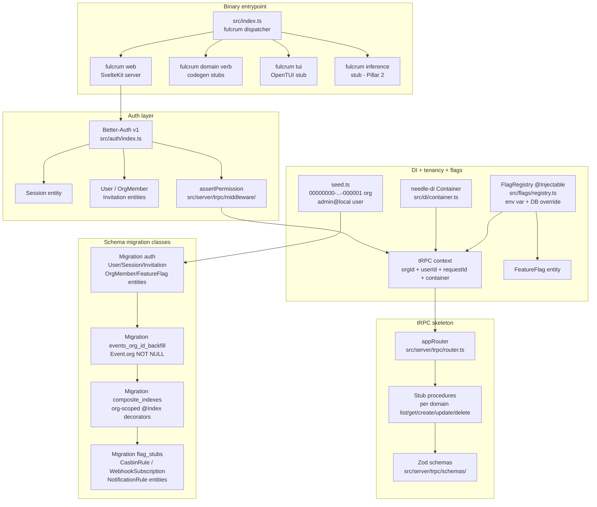
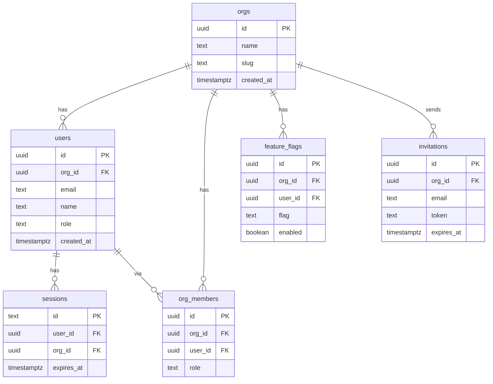

# PRD 1: Foundation Reset

## Status
ready-for-plan-breakdown

## Linkage chain
- Vision: `.scratch/agent-os-vision/VISION-GAPS.md` rows: "Schema for future SaaS without rewrite" (❌), "Multi-user / accounts / collaboration / SaaS" (❌), "Default local-only run mode" (✅ partial)
- Requirements: `.scratch/agent-os-vision/REQUIREMENTS.md` Pillar 1 section
- Decisions: C1 (online behind flags), C2 (local-default, SaaS-schema-ready), C4 (three surfaces), C6 (no plaintext SQL — Tier C lenient), C7 (MikroORM v7 stack), C8 (needle-di Stage-3 DI), C9 (schema artifact paths), Q21 (auth bootstrap → auto-create admin@local), Q22 (composite org_id indexes now), Q23 (events.org_id backfill), Q-permissions (Better-Auth org plugin + casbin gated), Q-flag-granularity (per-feature flags), A1 (toolchain SLA owns here), A2 (doctor coverage per pillar), A6 (tRPC API contract: Pillar 1 freezes skeleton), D4 (default local org UUID documented), D5 (flag naming: lowercase-with-hyphens)
- Docs: Better-Auth v1 README (`https://better-auth.com/docs`), PGlite docs (`https://pglite.dev`), tRPC v11 RFC (`https://trpc.io/docs/v11`), node-casbin README (`https://github.com/casbin/node-casbin`), MikroORM v7 docs (`https://mikro-orm.io/docs`), needle-di docs (`https://needle-di.io`)

## Vision
Lay the schema/auth/tenancy/flag-system/binary-entrypoint floor that every subsequent pillar builds on — so Pillars 2–16 never need a schema rewrite, a migration backfill, or a second auth system. Directly addresses the user's ask for "full accounts/multi-user/collaboration even SaaS, but default mode and run mode is local only for now" and C2's mandate that "SaaS schema-ready from day 1".

## Stack

Per C6 (no plaintext SQL, Tier C lenient), C7 (MikroORM v7), C8 (needle-di Stage-3), C9 (schema artifact paths):
- ORM: `@mikro-orm/core` v7.x with ES Stage-3 decorators (`@mikro-orm/decorators/es`). Driver: `mikro-orm-pglite` (local) or `@mikro-orm/postgresql` (SaaS) selected from `DATABASE_URL` in `src/db/mikro-orm.config.ts`.
- DI: `@needle-di/core` v1.x (Stage-3 TC39 decorators, `Symbol.metadata`, no `reflect-metadata`). `@Injectable()` services + constructor `inject(Dep)`. Single `Container` per process exposed via SvelteKit `event.locals.container`, tRPC `ctx.container`, CLI handler context, and TUI startup.
- Migrations: `@mikro-orm/migrations` snapshot-based generator. Migration classes auto-emitted at `src/db/migrations/Migration<timestamp>.ts` from entity decorator diffs; never hand-written DDL outside those classes.
- Entities: `src/db/entities/<domain>/<EntityName>.ts` (one class per file).
- Repositories: `src/db/repositories/<domain>/<EntityName>Repository.ts` (extends `EntityRepository<T>`, registered as `@Injectable()`).
- Module composition: `src/db/db.module.ts` wires `EntityManager` + repositories as needle-di injectables.

## Out-of-scope
- Actual feature implementations beyond stubs (orchestration, editor, sprints, burndown, memory engine — those are Pillars 3–16). Not in user's verbatim ask for this pillar specifically; each is owned by its named pillar.
- Real-time collaboration server (Hocuspocus/Yjs) — Owned by the Collab pillar (Pillar 12); this pillar seeds the entity columns (`DocSession`, `Presence`) and wires the `real-time-collab-server` flag stub only.
- OpenAPI external REST surface — Owned by Pillar 13 (API Gateway); flag `public-api` is registered in the flag registry here but the Hono mount and OpenAPI 3.1 spec live in Pillar 13.
- Casbin ABAC implementation — Owned by Pillar 5 (Permissions); this pillar ships the `CasbinRule` entity (auto-emitted into the auth migration class) and the `casbin-policies` flag stub so Pillar 5 can wire in-process `node-casbin` (via `FulcrumCasbinAdapter`) without a schema migration. Flag plumbing is always-on here; evaluation logic is Pillar 5.

## Always-on features

- **Synthetic local org seed** — `src/db/seed.ts` uses `em.create(Org, {...})` + `em.persistAndFlush(...)` to insert org `00000000-0000-0000-0000-000000000001` + user `admin@local` + session on `fulcrum init`; no prompt. Consumed by `fulcrum init` (CLI), TUI first-boot, SvelteKit `+layout.server.ts`.
- **`User` / `OrgMember` / `Session` / `Invitation` entities** — Better-Auth schema, auto-generated migration class (auth tables) under `src/db/migrations/`. tRPC context carries `{ orgId, userId }` from session on every call.
- **`current_org_id()` context helper** — `src/db/context.ts` `getOrgId(session)`: single path for all procedures and server actions; no ad-hoc extraction.
- **`org_id NOT NULL` backfill** — auto-generated migration class (events `org_id` backfill): adds `org_id` to `Event` entity, backfills default-org UUID via `em.nativeUpdate` inside the migration class body, sets NOT NULL via property decorator on next snapshot.
- **Composite `(org_id, …)` indexes** — auto-generated migration class (composite indexes): `@Index({ properties: ['org', 'project', 'status'] })` and similar decorators on `Task`, `Document`, `Memory`, `AgentRun`, `Event`, `Artifact`, `Repo`, `Job`, `SearchDocument` entities. Enables Postgres RLS + PGlite query planner.
- **Feature-flag registry** — `src/flags/registry.ts` exports `@Injectable()` `FlagRegistry` with `isEnabled(flag: FeatureFlag): boolean` reading from `FULCRUM_FEATURES` env var (comma-separated) and from `FeatureFlag` entity (override per-org per-user). Flag names: `router-llm`, `embeddings`, `memory-llm-extract`, `saas-auth`, `real-time-collab-server`, `external-llm-provider`, `public-api`, `outbound-webhooks`, `notify-email`, `notify-webhook`, `notify-slack`, `casbin-policies`, `pgvector`, `connector-linear`, `symphony-ssh-worker`, `symphony-http-api`. Default = all OFF. Web: exposed via tRPC `flags.list`. CLI: `fulcrum flags list [--json]`. TUI: flags screen in settings panel.
- **tRPC v11 core router** — `src/server/trpc/index.ts` + `src/server/trpc/context.ts`. Every domain procedure registered here. SvelteKit adapts via `@trpc/server/adapters/fetch`. CLI reads via in-process call (no HTTP round-trip). TUI reads same in-process. `ctx.container` exposes the needle-di container for service resolution inside handlers.
- **Zod schema folder** — `src/server/trpc/schemas/` holds one Zod file per domain (tasks, docs, memories, runs, etc.). Auto-referenced by CLI codegen and tRPC router.
- **`fulcrum` binary entrypoint scaffold** — `src/index.ts` dispatcher: `fulcrum` (help), `fulcrum tui` (stub), `fulcrum web` (SvelteKit server), `fulcrum inference` (stub). Built via `bun build --compile`; stubs exit 0 until filled by later pillars.
- **Audit log columns** — `Event.org` `@ManyToOne` NOT NULL post-backfill; `Event.user` `@ManyToOne({ nullable: true })` (system events have no user). Every surface's activity feed reads this.
- **Test infrastructure baseline** — expand `vitest.config.ts` to `src/server/trpc/**/*.test.ts`; add `tests/auth/` Playwright suite; `bun run ci` runs Vitest + Bun test + Playwright.
- **Permission fail-closed** — `src/server/trpc/middleware/assertPermission.ts` on every mutation; missing role → `FORBIDDEN`; Better-Auth `hasPermission()` resolves.

## Gated features (online or feature-flagged)

| Feature | Flag | Activates |
|---|---|---|
| SaaS auth providers (OAuth Google/GitHub, magic-link, email OTP) | `saas-auth` | Better-Auth social + email plugins enabled; login screen shows OAuth buttons; `fulcrum web` reads `BETTER_AUTH_SECRET` + provider env vars |
| Casbin policy engine | `casbin-policies` | `node-casbin` in-process via `FulcrumCasbinAdapter` (custom needle-di-injectable adapter implementing the 5-method node-casbin adapter interface against `EntityRepository<CasbinRule>`); `CasbinRule` entity registered (table emitted by the auth migration class); `assertPermission()` evaluates Casbin model before Better-Auth org-plugin check |
| pgvector extension | `pgvector` | `pgvector/mikro-orm` `VectorType` registered with explicit `length` per property; extension creation declared via decorator-bound DDL string in the embeddings migration class; HNSW `@Index({ expression: ... })` activated; writes enabled in memory/search pipelines |
| Real-time collab server | `real-time-collab-server` | Hocuspocus server spawned in-process; Yjs provider wired to doc editor; presence cursors active |
| External LLM provider | `external-llm-provider` | `openai-compatible` backend available in inference client; `FULCRUM_INFERENCE_URL` + `FULCRUM_INFERENCE_API_KEY` respected |
| Public REST API | `public-api` | Hono `@hono/zod-openapi` wrapper mounted at `/api/v1`; OpenAPI 3.1 spec served at `/api/v1/openapi.json` |
| Outbound webhooks | `outbound-webhooks` | `WebhookSubscription` entity active; dispatcher job enqueued on every event; retry budget + signing secret applied |
| Email notifications | `notify-email` | SMTP config read; `NotificationRule` entity rows evaluated on events; email channel dispatched |
| Webhook notifications | `notify-webhook` | Same as above; webhook channel dispatched |
| Slack notifications | `notify-slack` | Same as above; Slack incoming webhook dispatched |

## Tech stack

| Layer | Pick | Rationale | Failure gate → action |
|---|---|---|---|
| ORM | MikroORM v7 (`@mikro-orm/core`, MIT) | Class-driven entities (decorators), repository pattern, snapshot migrations, native pgvector + FTS support, identical API on PGlite + Postgres | If `mikro-orm-pglite` community driver fails Gate-1 spike (Date round-trip, FK cascading, transaction rollback, schema-generator on PGlite WASM) → 2nd choice TypeORM (lose FTS until pgvector-FTS maturity); 3rd choice Kysely + custom decorator wrapper (loses NestJS aesthetic) |
| DI | needle-di v1.x (`@needle-di/core`, MIT) | 7 KB bundled, Stage-3 TC39 decorators, no `reflect-metadata`, tested on Bun 1.3.13; identical container shared across SvelteKit / tRPC / CLI / TUI | If decorator mode breaks under Bun 1.3.x → 2nd choice inversify v8.1 (legacy decorators, auto-bundles `reflect-metadata/lite`); 3rd choice `@nestjs/core` standalone `createApplicationContext` |
| Auth | Better-Auth v1 (MIT, ~28k stars) | SQLite + Postgres adapters; org/teams/sessions/passkey/invitation plugins; SvelteKit native handler; no sidecar | If org plugin breaks on PGlite adapter → fallback Auth.js v5 (ISC, SvelteKit adapter, SQLite driver-adapter) |
| Org RBAC | Better-Auth `organization` plugin | Bundled; owner/admin/member/guest roles; `hasPermission()` evaluates inline | If roles too coarse before SaaS launch → add `node-casbin` in-process behind `casbin-policies` flag |
| Tenancy pattern | Shared schema, `org_id` everywhere via `@ManyToOne(() => Org)` decorators | Single migration class set; SQLite + Postgres identical; local → SaaS = change adapter env var | If regulatory isolation required per tenant → per-tenant Postgres schema (Pattern B) for that org only |
| tRPC | v11 (MIT, ~36k stars) | Native Fetch API; zero adapter; end-to-end types; Bun-native | If tRPC v11 breaks SvelteKit form action integration → Hono + `@hono/zod-openapi` as internal router |
| Binary bundler | `bun build --compile` | Single static binary; no Node runtime install | If binary size exceeds 150 MB → split CLI + web into two binaries, shared package |
| Test runner | Vitest + Bun test + Playwright | Already in repo; Vitest for unit, Bun test for integration, Playwright for e2e | No fallback needed; all MIT |
| Feature flags | Env var + entity-backed table | Zero dependency; no LaunchDarkly; per-org override stored on `FeatureFlag` entity rows | If `FeatureFlag` entity grows complex → add `@openfeature/server-sdk` (Apache-2.0) as evaluation engine |

## Schema changes

All schema mutations land via auto-generated MikroORM migration classes under `src/db/migrations/Migration<timestamp>.ts`. Each migration class is emitted by `mikro-orm migration:create` from entity decorator diffs; the human-readable slug below names the diff intent only.

### Auth migration class (slug: `auth`) — entities under `src/db/entities/auth/`

```typescript
// src/db/entities/auth/User.ts
@Entity({ tableName: 'users' })
@Index({ properties: ['org', 'email'], name: 'idx_users_org' })
@Unique({ properties: ['org', 'email'] })
export class User {
  @PrimaryKey({ type: 'uuid', defaultRaw: 'gen_random_uuid()' })
  id!: string;

  @ManyToOne(() => Org, { fieldName: 'org_id' })
  org!: Org;

  @Property()
  email!: string;

  @Property({ nullable: true })
  name?: string;

  @Property({ nullable: true, fieldName: 'avatar_url' })
  avatarUrl?: string;

  @Enum({ items: ['owner', 'admin', 'member', 'guest'], default: 'member' })
  role: 'owner' | 'admin' | 'member' | 'guest' = 'member';

  @Property({ fieldName: 'created_at', defaultRaw: 'now()' })
  createdAt!: Date;

  @Property({ fieldName: 'updated_at', defaultRaw: 'now()', onUpdate: () => new Date() })
  updatedAt!: Date;
}

// src/db/entities/auth/Session.ts
@Entity({ tableName: 'sessions' })
@Index({ properties: ['user', 'expiresAt'], name: 'idx_sessions_user' })
export class Session {
  @PrimaryKey({ type: 'text' })
  id!: string;

  @ManyToOne(() => User, { fieldName: 'user_id', deleteRule: 'cascade' })
  user!: User;

  @ManyToOne(() => Org, { fieldName: 'org_id' })
  org!: Org;

  @ManyToOne(() => Org, { fieldName: 'active_organization_id', nullable: true })
  activeOrganization?: Org;

  @Property({ fieldName: 'expires_at' })
  expiresAt!: Date;

  @Property({ nullable: true, fieldName: 'ip_address' })
  ipAddress?: string;

  @Property({ nullable: true, fieldName: 'user_agent' })
  userAgent?: string;

  @Property({ fieldName: 'created_at', defaultRaw: 'now()' })
  createdAt!: Date;
}

// src/db/entities/auth/Invitation.ts
@Entity({ tableName: 'invitations' })
@Index({ properties: ['org', 'email'], name: 'idx_invitations_org_email' })
export class Invitation {
  @PrimaryKey({ type: 'uuid', defaultRaw: 'gen_random_uuid()' })
  id!: string;

  @ManyToOne(() => Org, { fieldName: 'org_id' })
  org!: Org;

  @Property()
  email!: string;

  @Property({ default: 'member' })
  role: string = 'member';

  @Property({ unique: true })
  token!: string;

  @ManyToOne(() => User, { fieldName: 'invited_by', nullable: true })
  invitedBy?: User;

  @Property({ nullable: true, fieldName: 'accepted_at' })
  acceptedAt?: Date;

  @Property({ fieldName: 'expires_at' })
  expiresAt!: Date;

  @Property({ fieldName: 'created_at', defaultRaw: 'now()' })
  createdAt!: Date;
}

// src/db/entities/auth/OrgMember.ts
@Entity({ tableName: 'org_members' })
@Index({ properties: ['org', 'user'], name: 'idx_org_members_org' })
@Index({ properties: ['user'], name: 'idx_org_members_user' })
@Unique({ properties: ['org', 'user'] })
export class OrgMember {
  @PrimaryKey({ type: 'uuid', defaultRaw: 'gen_random_uuid()' })
  id!: string;

  @ManyToOne(() => Org, { fieldName: 'org_id' })
  org!: Org;

  @ManyToOne(() => User, { fieldName: 'user_id' })
  user!: User;

  @Property({ default: 'member' })
  role: string = 'member';

  @Property({ fieldName: 'joined_at', defaultRaw: 'now()' })
  joinedAt!: Date;
}

// src/db/entities/auth/FeatureFlag.ts
@Entity({ tableName: 'feature_flags' })
@Index({ properties: ['org', 'flag'], name: 'idx_feature_flags_org' })
@Unique({ properties: ['org', 'user', 'flag'] })
export class FeatureFlag {
  @PrimaryKey({ type: 'uuid', defaultRaw: 'gen_random_uuid()' })
  id!: string;

  @ManyToOne(() => Org, { fieldName: 'org_id', nullable: true })
  org?: Org;

  @ManyToOne(() => User, { fieldName: 'user_id', nullable: true })
  user?: User;

  @Property()
  flag!: string;

  @Property({ default: false })
  enabled: boolean = false;

  @Property({ fieldName: 'created_at', defaultRaw: 'now()' })
  createdAt!: Date;
}
```

### Events `org_id` backfill migration class (slug: `events_org_id_backfill`, per Q23)

Body of `Migration<timestamp>.up()` (auto-generated by `mikro-orm migration:create` after adding `@ManyToOne(() => Org)` to `Event` entity, then hand-injecting the backfill `em.nativeUpdate` between the column-add and the NOT NULL flip — the only sanctioned `addSql` carve-out per C6):

```typescript
export class Migration20260501XXXX extends Migration {
  override async up(): Promise<void> {
    // 1. Auto-emitted: add nullable org_id column + new indexes
    this.addSql(`alter table "events" add column "org_id" uuid;`);
    this.addSql(`alter table "events" add column "user_id" uuid;`);

    // 2. Backfill via EM call (sanctioned mid-migration data fix)
    const em = this.getEntityManager();
    await em.nativeUpdate('Event', { org: null }, { org: '00000000-0000-0000-0000-000000000001' });

    // 3. Auto-emitted: NOT NULL flip + FK + composite indexes
    this.addSql(`alter table "events" alter column "org_id" set not null;`);
    this.addSql(`alter table "events" add constraint "events_org_id_fk" foreign key ("org_id") references "orgs" ("id");`);
    this.addSql(`drop index if exists "idx_events_subject";`);
    this.addSql(`create index "idx_events_org_created" on "events" ("org_id", "created_at" desc);`);
    this.addSql(`create index "idx_events_subject" on "events" ("org_id", "subject_kind", "subject_id", "created_at" desc);`);
  }
}
```

After this migration the `Event` entity declares `@ManyToOne(() => Org, { fieldName: 'org_id' }) org!: Org;` + `@ManyToOne(() => User, { fieldName: 'user_id', nullable: true }) user?: User;` + the index decorators above; subsequent snapshots are clean.

### Composite indexes migration class (slug: `composite_indexes`, per Q22)

Auto-emitted from index decorators added to existing entities. No `addSql` body — pure decorator diff:

```typescript
// On Task entity
@Index({ properties: ['org', 'project', 'status'], name: 'idx_tasks_org_project_status' })
@Index({ properties: ['org', 'updatedAt'], name: 'idx_tasks_org_updated', expression: '("org_id", "updated_at" desc)' })

// On Document entity
@Index({ properties: ['org', 'project', 'kind'], name: 'idx_documents_org_project_kind' })
@Index({ properties: ['org', 'updatedAt'], name: 'idx_documents_org_updated', expression: '("org_id", "updated_at" desc)' })

// On Memory entity
@Index({ properties: ['org', 'project'], name: 'idx_memories_org_project' })

// On AgentRun entity
@Index({ properties: ['org', 'project', 'status'], name: 'idx_runs_org_project_status' })

// On Artifact entity
@Index({ properties: ['org', 'run'], name: 'idx_artifacts_org_run' })

// On Repo entity
@Index({ properties: ['org', 'project'], name: 'idx_repos_org_project' })

// On Job entity
@Index({ properties: ['org', 'queue', 'status', 'availableAt'], name: 'idx_jobs_org_queue' })

// On SearchDocument entity
@Index({ properties: ['org', 'sourceKind'], name: 'idx_search_docs_org_kind' })
```

### Flag-stub migration class (slug: `flag_stubs`) — entities under `src/db/entities/flags/`

Creates `CasbinRule` (consumed by Pillar 5 / `casbin-policies` flag), `WebhookSubscription` (Pillar 13 / `outbound-webhooks` flag), `NotificationRule` (Pillar 12 / notification flags). All three entities + tables are emitted by the migration class; rows are written only by the owning pillar at runtime when its flag is on.

```typescript
@Entity({ tableName: 'casbin_rule' })
@Index({ properties: ['ptype'], name: 'idx_casbin_ptype' })
export class CasbinRule {
  @PrimaryKey({ type: 'uuid', defaultRaw: 'gen_random_uuid()' }) id!: string;
  @Property() ptype!: string;
  @Property({ nullable: true }) v0?: string;
  @Property({ nullable: true }) v1?: string;
  @Property({ nullable: true }) v2?: string;
  @Property({ nullable: true }) v3?: string;
  @Property({ nullable: true }) v4?: string;
  @Property({ nullable: true }) v5?: string;
}

@Entity({ tableName: 'webhook_subscriptions' })
@Index({ properties: ['org', 'enabled'], name: 'idx_webhooks_org' })
export class WebhookSubscription {
  @PrimaryKey({ type: 'uuid', defaultRaw: 'gen_random_uuid()' }) id!: string;
  @ManyToOne(() => Org, { fieldName: 'org_id' }) org!: Org;
  @Property() url!: string;
  @Property({ fieldName: 'event_pattern' }) eventPattern!: string;
  @Property() secret!: string;
  @Property({ default: true }) enabled: boolean = true;
  @Property({ fieldName: 'created_at', defaultRaw: 'now()' }) createdAt!: Date;
}

@Entity({ tableName: 'notification_rules' })
@Index({ properties: ['org', 'user'], name: 'idx_notif_rules_user' })
export class NotificationRule {
  @PrimaryKey({ type: 'uuid', defaultRaw: 'gen_random_uuid()' }) id!: string;
  @ManyToOne(() => Org, { fieldName: 'org_id' }) org!: Org;
  @ManyToOne(() => User, { fieldName: 'user_id' }) user!: User;
  @Property({ fieldName: 'event_pattern' }) eventPattern!: string;
  @Property({ type: 'array', default: ['in-app'] }) channels: string[] = ['in-app'];
  @Property({ default: true }) enabled: boolean = true;
  @Property({ fieldName: 'created_at', defaultRaw: 'now()' }) createdAt!: Date;
}
```

## Surfaces

**Web (SvelteKit)**
- `src/web/src/routes/auth/login/+page.svelte` — passkey + email/password login form; OAuth buttons rendered when `saas-auth` flag on; "Forgot password" link rendered when email OTP enabled.
- `src/web/src/routes/auth/signup/+page.svelte` — new-account registration form (name + email + password); passkey enrollment inline; active only when `saas-auth` flag on (local-only mode auto-creates the default user on `fulcrum init`).
- `src/web/src/routes/auth/invite/[token]/+page.svelte` — invitation-accept page: validates token, creates user account (or logs in), redirects to dashboard; always-on (invitation tokens are issued by the CLI and web admin).
- `src/web/src/routes/settings/users/+page.svelte` — admin user-management UI: list org members, invite by email, change role, remove member. Accessible only to `owner`/`admin` roles via `assertPermission`.
- `src/web/src/routes/auth/logout/+server.ts` — POST handler clears session.
- `src/web/src/hooks.server.ts` — Better-Auth `auth.handler` + session injection into `event.locals`; instantiates the needle-di `Container` at app start and exposes it via `event.locals.container`.
- `src/web/src/lib/trpc.ts` — client-side tRPC proxy.
- `src/web/src/routes/settings/flags/+page.svelte` — feature-flag toggle UI (reads `flags.list`, calls `flags.set`).

**CLI (`fulcrum` subcommands)**
- `fulcrum init` — seeds synthetic local org + admin user + session via `em.persistAndFlush`; idempotent.
- `fulcrum auth whoami [--json]` — prints current user + org.
- `fulcrum auth login [--passkey | --password]` — interactive or `--non-interactive` for scripts.
- `fulcrum auth logout` — invalidates session.
- `fulcrum auth invite <email> [--role member|admin|guest]` — creates invitation row + prints token.
- `fulcrum flags list [--json]` — prints all flags + current state.
- `fulcrum flags set <flag> <on|off>` — upserts `FeatureFlag` row via repository call.

**TUI (OpenTUI)**
- Settings → Auth screen: show current user, org, passkey enrollment status.
- Settings → Feature Flags screen: toggle list with descriptions.
- Status bar: org name + user email always visible.

**API (tRPC procedures)**
- `auth.whoami` → `{ userId, orgId, email, role }`
- `auth.invite(email, role)` → `{ invitationId, token }`
- `auth.acceptInvite(token)` → `{ userId, orgId }` (validates token, creates or links user)
- `flags.list()` → `FeatureFlag[]` with `{ name, enabled, description }`
- `flags.set(flag, enabled)` → `{ ok }`
- `orgs.get()` → org row
- `orgs.update(name)` → org row
- `orgs.members.list()` → `OrgMember[]` (admin/owner only)
- `orgs.members.updateRole(userId, role)` → `{ ok }` (owner only)
- `orgs.members.remove(userId)` → `{ ok }` (owner/admin only)

## Technical design

### Architecture



### Sequence: fulcrum init + first authenticated request

```mermaid
sequenceDiagram
    participant User
    participant CLI as fulcrum init
    participant Seed as seed.ts (EM)
    participant ORM as MikroORM EntityManager
    participant DB as PGlite
    participant Auth as Better-Auth
    participant TRPC as tRPC context

    User->>CLI: fulcrum init
    CLI->>ORM: migrator.up() — apply migration classes auth → backfill → indexes → stubs
    ORM->>DB: schema synchronized
    DB-->>ORM: ok
    ORM-->>CLI: ok
    CLI->>Seed: ensureDefaultOrg()
    Seed->>ORM: em.upsert(Org, {id:'00000000-...-000001', name:'Local'})
    Seed->>ORM: em.upsert(User, {email:'admin@local', role:'owner', org})
    Seed->>ORM: em.create(Session, {...}); em.persistAndFlush(...)
    ORM->>DB: INSERT (via ORM)
    DB-->>ORM: done
    ORM-->>CLI: done
    CLI-->>User: Fulcrum initialized (org local, user admin@local)

    Note over User,TRPC: Subsequent request
    User->>TRPC: any mutation via web/CLI/TUI
    TRPC->>Auth: getSession(request)
    Auth->>ORM: sessionRepo.findOne({id: ...})
    ORM->>DB: (typed query)
    DB-->>ORM: row
    ORM-->>Auth: Session entity
    Auth-->>TRPC: {userId, orgId}
    TRPC->>TRPC: assertPermission(role, action)
    alt permission denied
        TRPC-->>User: TRPCError FORBIDDEN
    else ok
        TRPC->>ORM: repository call from procedure
        ORM->>DB: typed query
        DB-->>ORM: rows
        ORM-->>TRPC: entities
        TRPC-->>User: typed response
    end
```

### ERD (core entities this pillar adds)



### Migration architecture

Ref: DECISIONS.md A3 + C6/C7/C9 locks.

Every schema mutation lands as a single auto-generated `Migration<timestamp>` class under `src/db/migrations/`. Forward path is `migrator.up()`; reversal path is `migrator.down()` on the same class — both methods generated by `mikro-orm migration:create` from snapshot diffs. Where the down is lossless, MikroORM emits the inverse decorator-derived DDL automatically. Where lossy (e.g., column drop with data), the migration class overrides `down()` to throw unless `--force` is passed; a warning row is written to `events` (verb=`migration.down-lossy-forced`) by the migrator wrapper.

Schema version is tracked by MikroORM's built-in migrations table (`mikro_orm_migrations`), which carries `(name, executed_at)` per applied class. Fulcrum extends this with a sibling `SchemaMigration` entity that mirrors `mikro_orm_migrations` and adds `checksum text` + `direction text CHECK in 'up'|'down'` for our doctor checks:

```typescript
@Entity({ tableName: 'schema_migrations' })
export class SchemaMigration {
  @PrimaryKey()
  version!: number;

  @Property()
  name!: string;

  @Property({ fieldName: 'applied_at', defaultRaw: 'now()' })
  appliedAt!: Date;

  @Property()
  checksum!: string;

  @Enum({ items: ['up', 'down'] })
  direction!: 'up' | 'down';
}
```

`fulcrum db migrate [--target-version <N>] [--force]` — wraps `MikroORM.getMigrator().up({ to: 'Migration<timestamp>' })` / `.down({ to: ... })`, validates SHA-256 checksums of `Migration<timestamp>.ts` source files against stored checksums, then calls migrator until `<N>` is reached. Without `--target-version`, runs `migrator.up()` to apply all pending classes.

`fulcrum db status [--json]` — prints current version (from `SchemaMigration` repository), pending classes (from `migrator.getPendingMigrations()`), and any checksum mismatches.
`fulcrum db history [--json]` — `schemaMigrationRepo.findAll({ orderBy: { appliedAt: 'asc' } })`.

Pre-startup compat check (run by `fulcrum init` and `fulcrum web` on boot):
- Reads `await schemaMigrationRepo.count()` + max `version`.
- Compares to the binary's max known migration version (compiled in as a constant generated from `src/db/migrations/` filenames at build time).
- If DB version > binary's known max: binary refuses to start and emits `foundation.migration-version-ahead` doctor failure with recovery hint `fulcrum db migrate` (upgrade binary or downgrade DB).

Web surface: `/settings/database/migrations` — history table showing version, name, applied_at, direction, checksum status; target-version picker.
CLI: `fulcrum db migrate [--target-version <N>] [--force]`, `fulcrum db status`, `fulcrum db history`.
TUI: Settings → Database → Migrations screen.

### Error model

| Error code | Description | Propagated to | Recovery action |
|---|---|---|---|
| `FORBIDDEN` | `assertPermission` fails — wrong role or unauthenticated | tRPC `TRPCError`; REST 403 when `public-api` ON | Re-login or request role upgrade from org owner |
| `UNAUTHORIZED` | Session missing or expired | Better-Auth handler; SvelteKit redirect to `/auth/login` | User re-authenticates; `fulcrum auth login` on CLI |
| `MIGRATION_FAILED` | PGlite/PostgreSQL migration class throws | `fulcrum init` exits non-zero | `fulcrum db migrate --target-version X`; check disk space and PGlite path |
| `migration.checksum-mismatch` | On-disk migration class file checksum differs from `SchemaMigration.checksum` | `fulcrum db migrate` exits non-zero | Restore original migration class file; do not edit applied migrations |
| `migration.down-lossy-without-force` | Down migration would destroy data and `--force` not passed | `fulcrum db migrate` exits non-zero | Pass `--force` if data loss is acceptable; restore from backup otherwise |
| `migration.target-version-out-of-range` | `--target-version N` is negative or exceeds max known version | `fulcrum db migrate` exits non-zero | Check `fulcrum db status` for valid version range |
| `FLAG_INVALID` | Flag name fails `^[a-z][a-z0-9-]*$` Zod regex | `flags.set` tRPC `BAD_REQUEST` | Use lowercase-hyphen flag name per D5 |
| `ORG_COLLISION` | SaaS instance created with reserved UUID `00000000-…-000001` | org-create tRPC `BAD_REQUEST` | Use any other UUID; well-known UUID is reserved per D4 |
| `SCHEMA_VALIDATION` | Zod parse fails on procedure input | tRPC `BAD_REQUEST`; REST 422 | Fix input shape per Zod error map |

### Observability

OTel spans (no-op locally until exporter set):
- `fulcrum.init` — span on `fulcrum init`; attributes: `migrations_run`, `seed_applied`.
- `fulcrum.trpc.auth.whoami`, `fulcrum.trpc.flags.set` — per procedure via middleware (Pillar 13 wires full OTel).
- `fulcrum.db.migrate` — span per migration class; `migration_id` attribute.

Log fields (structured JSON, `pino`): `requestId`, `orgId`, `userId`, `procedure`, `durationMs`, `migrationId`, `error?`.

Events emitted (to `Event` entity via `eventRepo`): `user.created`, `session.created`, `invitation.created`, `flag.changed`.

### Performance budgets

| Operation | p50 target | p95 target |
|---|---|---|
| `fulcrum init` (fresh install, all migration classes) | <2s | <5s |
| Migrator `up()` (auth → backfill → indexes → stubs) on PGlite | <500ms | <1s |
| `assertPermission` middleware overhead | <1ms | <3ms |
| Feature flag lookup (in-process TTL cache hit) | <0.1ms | <1ms |
| Feature flag lookup (DB fallback via repo, cache miss) | <5ms | <20ms |
| tRPC context construction per request | <2ms | <5ms |
| `fulcrum auth whoami --json` | <50ms | <150ms |

## Doctor integration

### Checks added to `fulcrum doctor`

Registered in `src/doctor/checks/foundation.ts` (each check is a `@Injectable()` class resolved via needle-di and uses entity repositories — no raw SQL):

1. **`foundation.schema-version`** — `await schemaMigrationRepo.findOne({}, { orderBy: { version: 'desc' } })`; asserts max version equals the binary's compiled-in max known version; warn on version behind, fail if DB version ahead of binary.
1b. **`foundation.migration-checksums`** — for every row from `schemaMigrationRepo.findAll()`, verifies on-disk file SHA-256 matches stored checksum; fail on any mismatch.
2. **`foundation.default-org`** — `await orgRepo.findOne({ id: '00000000-0000-0000-0000-000000000001' })`; fail = `fulcrum init` not run.
3. **`foundation.admin-user`** — `await userRepo.findOne({ email: 'admin@local' })`; warn if missing on local installs.
4. **`foundation.composite-indexes`** — `em.getConnection().execute('explain ' + qb.getQuery())` for a `taskRepo.find({ org: id })` query; asserts plan uses Index Scan. (Sanctioned `addSql`-style escape hatch under C6 — diagnostic only, never in production hot path.)
5. **`foundation.feature-flag-registry`** — `flagRegistry.isEnabled('router-llm')` completes without throw.
6. **`foundation.org-id-not-null`** — `await eventRepo.count({ org: null })`; fail if > 0.
7. **`foundation.saas-uuid-collision`** (checked when `saas-auth` ON) — `await orgRepo.count({ id: '00000000-0000-0000-0000-000000000001', name: { $ne: 'local' } })`; fail if > 0.
8. **`foundation.binary-entrypoint`** — `fulcrum --help` exits 0.
9. **`foundation.trpc-router`** — in-process call to `auth.whoami` resolves within 200ms.
10. **`foundation.toolchain-sla`** — Bun version ≥ pinned version in `package.json engines`.

### JSON output shape (Zod schema)

```typescript
const DoctorFoundationCheck = z.object({
  subsystem: z.literal('foundation'),
  checks: z.array(z.object({
    id: z.string(),           // e.g. 'foundation.schema-version', 'foundation.default-org'
    status: z.enum(['pass', 'warn', 'fail', 'skip']),
    message: z.string(),
    durationMs: z.number().optional(),
    metadata: z.record(z.unknown()).optional(),
  })),
  ok: z.boolean(),
});
```

### Failure recovery guidance

- `foundation.schema-version fail` → run `fulcrum db migrate`; check `FULCRUM_HOME` path.
- `foundation.default-org fail` → run `fulcrum init`; idempotent, safe to re-run.
- `foundation.composite-indexes fail` → run `fulcrum db migrate --run-index-rebuild`; or recreate the index from the entity decorator after fixing the diff.
- `foundation.feature-flag-registry fail` → check `FULCRUM_HOME/db` writable; `fulcrum flags list` to diagnose.
- `foundation.org-id-not-null fail` → run the `events_org_id_backfill` migration class; check events table for pre-migration rows.
- `foundation.trpc-router fail` → `fulcrum web` restart; check port 5173 collision.
- `foundation.toolchain-sla fail` → `mise install` to sync pinned Bun version.

## Dependencies
None — this is Pillar 1, the floor. All later pillars depend on it.


## Issues breakdown

**P1.1 — Auth migration class (entities under `src/db/entities/auth/`)**
- Owner: `src/db/entities/auth/{User,Session,Invitation,OrgMember,FeatureFlag}.ts`, `src/db/migrations/Migration<timestamp>_auth.ts`, `src/db/seed.ts`
- RED: assert `User`, `Session`, `Invitation`, `OrgMember`, `FeatureFlag` entity classes load via `em.getMetadata()`; round-trip `em.create / em.persistAndFlush / em.findOne` succeeds for each; index/unique decorators reflected in metadata.
- GREEN: entities decorated; migration class auto-emitted via `mikro-orm migration:create`; seed creates synthetic local org + admin user via `em.persistAndFlush`.

**P1.2 — Events org_id backfill migration class**
- Owner: `src/db/entities/Event.ts` (decorator update), `src/db/migrations/Migration<timestamp>_events_org_id_backfill.ts`
- RED: every row from `eventRepo.findAll()` has non-null `org` after migration; existing rows carry well-known local org UUID.
- GREEN: `@ManyToOne(() => Org)` added to `Event`; auto-generated migration body extended with `em.nativeUpdate` backfill between column-add and NOT NULL flip.

**P1.3 — Composite indexes migration class**
- Owner: `src/db/entities/**` decorator updates, `src/db/migrations/Migration<timestamp>_composite_indexes.ts`
- RED: EXPLAIN on a `taskRepo.find({ org, project, status })` QueryBuilder query shows Index Scan.
- GREEN: `@Index({ properties: [...] })` decorators added to all tenant-scoped entities; auto-generated migration class applied; explain test green.

**P1.4 — Flag-stub migration class**
- Owner: `src/db/entities/flags/{CasbinRule,WebhookSubscription,NotificationRule}.ts`, `src/db/migrations/Migration<timestamp>_flag_stubs.ts`
- RED: `casbinRuleRepo.count() === 0`, `webhookSubscriptionRepo.count() === 0`, `notificationRuleRepo.count() === 0` after migration; `em.getMetadata()` reports each entity registered.
- GREEN: entities + migration class auto-generated; tables populated only when flags enabled by later pillars.

**P1.5 — Feature-flag registry**
- Owner: `src/flags/registry.ts` (`@Injectable() FlagRegistry`)
- RED: `flagRegistry.isEnabled('router-llm')` false by default; true when env var set; `FeatureFlag` repo row override wins over env.
- GREEN: env-parse + repo lookup via `featureFlagRepo` + 60s in-process TTL cache.

**P1.6 — Better-Auth integration**
- Owner: `src/auth/index.ts`, `src/web/src/hooks.server.ts`
- RED: Playwright — login form → dashboard redirect; `auth.whoami` returns correct user.
- GREEN: SQLite/PGlite adapter (resolves to MikroORM EM under the hood) + org plugin + passkey plugin + SvelteKit handler; session in `event.locals`; needle-di `Container` instantiated and exposed via `event.locals.container`.

**P1.7 — tRPC core router + context**
- Owner: `src/server/trpc/index.ts`, `src/server/trpc/context.ts`, `src/server/trpc/middleware/assertPermission.ts`
- RED: mutation without session → `FORBIDDEN`; `ctx.orgId` + `ctx.userId` populated from session; `ctx.container` resolves `EntityManager`.
- GREEN: `createContext` from Better-Auth session + needle-di container; `assertPermission` on all mutations.

**P1.8 — Binary entrypoint scaffold**
- Owner: `src/index.ts`, `package.json`
- RED: `fulcrum --help` exits 0; each subcommand stub exits 0; `bun build --compile` succeeds.
- GREEN: dispatcher wired; ci script includes compile step.

**P1.9 — Auth + flags CLI verbs**
- Owner: `src/cli/auth.ts`, `src/cli/flags.ts`
- RED: `fulcrum auth whoami --json` returns typed payload; `fulcrum flags set router-llm on` + `list` shows updated state.
- GREEN: CLI verbs via in-process tRPC; `--json` on every command.

**P1.10 — TUI auth + flags screens**
- Owner: TUI settings (OpenTUI)
- RED: smoke test opens settings; auth screen + flags toggle list render without crash.
- GREEN: OpenTUI screens reading `auth.whoami` + `flags.list`.

**P1.11 — Test infrastructure baseline**
- Owner: `vitest.config.ts`, `playwright.config.ts`, `package.json`
- RED: `bun run ci` fails if unit, tRPC, or Playwright auth tests fail.
- GREEN: configs expanded; `bun run ci` aggregates all three test layers.

## Failure gates

| Gate condition | Action |
|---|---|
| Better-Auth PGlite adapter throws on composite key | Pin version; fall back to Auth.js v5 (same entities, same column names) |
| `mikro-orm-pglite` driver fails Gate-1 spike on PGlite WASM | Switch to TypeORM (lose FTS until pgvector-FTS maturity); 3rd choice Kysely + custom decorator wrapper |
| needle-di Stage-3 decorators break under Bun 1.3.x | Switch to inversify v8.1 (legacy decorators + reflect-metadata/lite); 3rd choice `@nestjs/core` standalone container |
| tRPC v11 + Bun `--compile` incompatible | Switch to Hono + `@hono/zod-openapi`; keep Zod schemas + needle-di container unchanged |
| Binary > 150 MB | Split `fulcrum-cli` + `fulcrum-web`; shared `@fulcrum/core` |
| Migrator fails on PGlite WASM | Pin `mikro-orm-pglite` version; reduce migration to incremental classes; verify decorator-derived DDL on PGlite SQL dialect |
| `node-casbin` ARM64 binding fails | Use `casbin-wasm` build; same policy API; `FulcrumCasbinAdapter` unchanged |

## Acceptance criteria

- `bun run ci` passes: unit + tRPC procedure + Playwright auth e2e tests all green.
- `fulcrum init` on clean `FULCRUM_HOME` seeds org + user + session via repository calls; `fulcrum auth whoami --json` returns correct payload; TUI status bar shows org name.
- All three surfaces parity: web login form, `fulcrum auth login` CLI, and TUI auth screen all resolve the same authenticated state from the same Better-Auth session entity.
- `Event.org` non-null on every row from `eventRepo.findAll()`; EXPLAIN on a `eventRepo.find({ org }, { orderBy: { createdAt: 'desc' }, limit: 50 })` QueryBuilder query shows Index Scan.
- `flagRegistry.isEnabled('router-llm')` false on fresh install; true after `fulcrum flags set router-llm on`; `--json` list reflects updated state.
- `assertPermission` blocks unauthenticated mutations with `FORBIDDEN` on every procedure in this pillar.
- Migration classes (auth → events_org_id_backfill → composite_indexes → flag_stubs) run idempotently on both PGlite (via `mikro-orm-pglite`) and PostgreSQL (via `@mikro-orm/postgresql`).
