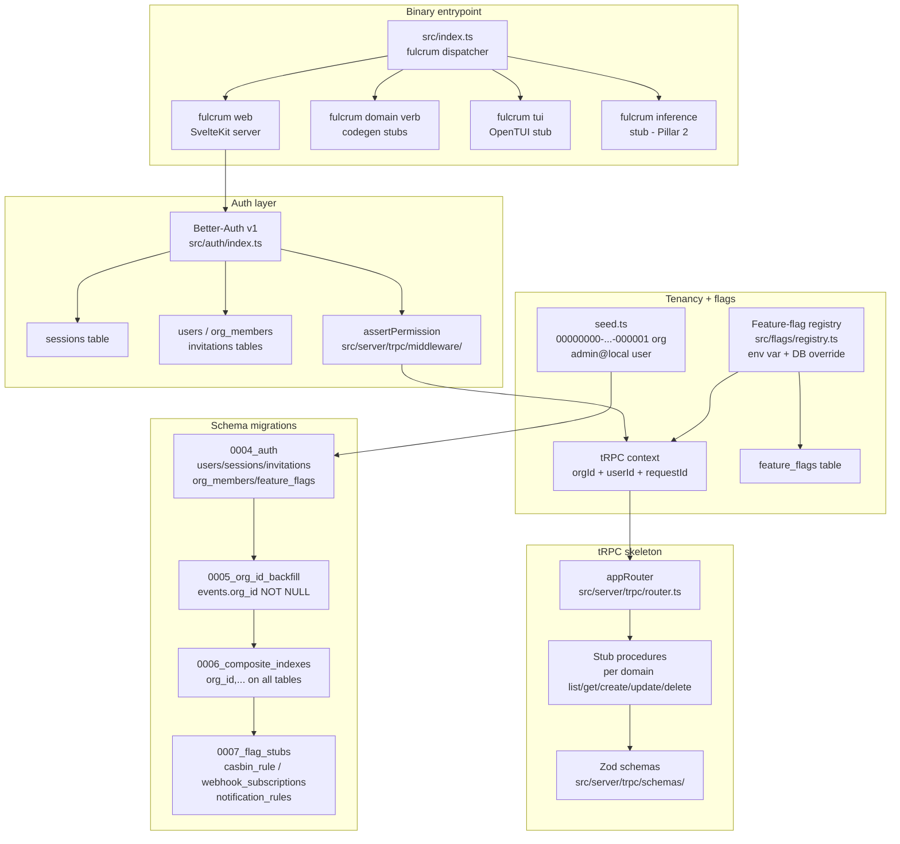
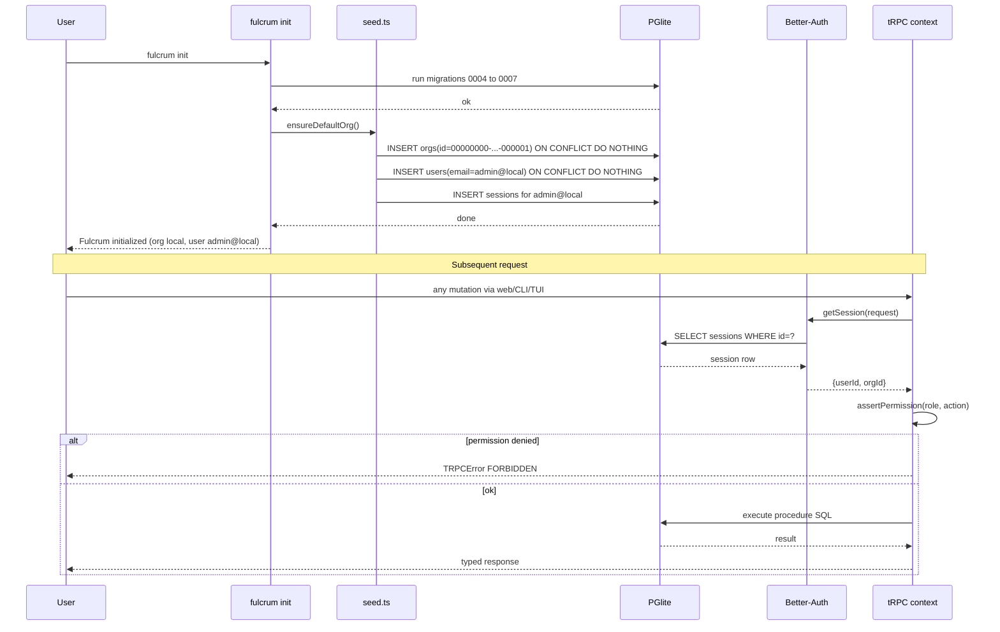
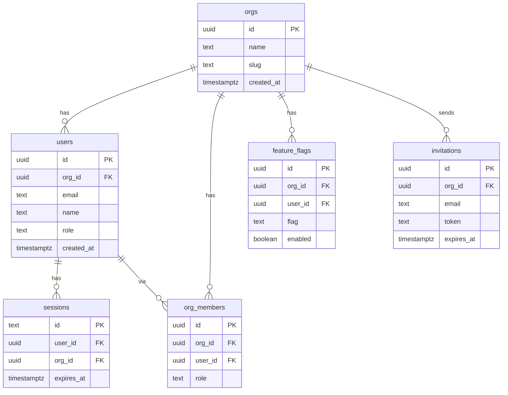

# PRD 1: Foundation Reset

## Status
ready-for-plan-breakdown

## Linkage chain
- Vision: `.scratch/agent-os-vision/VISION-GAPS.md` rows: "Schema for future SaaS without rewrite" (❌), "Multi-user / accounts / collaboration / SaaS" (❌), "Default local-only run mode" (✅ partial)
- Requirements: `.scratch/agent-os-vision/REQUIREMENTS.md` Pillar 1 section
- Decisions: C1 (online behind flags), C2 (local-default, SaaS-schema-ready), C4 (three surfaces), Q21 (auth bootstrap → auto-create admin@local), Q22 (composite org_id indexes now), Q23 (events.org_id backfill), Q-permissions (Better-Auth org plugin + casbin gated), Q-flag-granularity (per-feature flags), A1 (toolchain SLA owns here), A2 (doctor coverage per pillar), A6 (tRPC API contract: Pillar 1 freezes skeleton), D4 (default local org UUID documented), D5 (flag naming: lowercase-with-hyphens)
- Docs: Better-Auth v1 README (`https://better-auth.com/docs`), PGlite docs (`https://pglite.dev`), tRPC v11 RFC (`https://trpc.io/docs/v11`), node-casbin README (`https://github.com/casbin/node-casbin`)

## Vision
Lay the schema/auth/tenancy/flag-system/binary-entrypoint floor that every subsequent pillar builds on — so Pillars 2–16 never need a schema rewrite, a migration backfill, or a second auth system. Directly addresses the user's ask for "full accounts/multi-user/collaboration even SaaS, but default mode and run mode is local only for now" and C2's mandate that "SaaS schema-ready from day 1".

## Out-of-scope
- Actual feature implementations beyond stubs (orchestration, editor, sprints, burndown, memory engine — those are Pillars 3–16). Not in user's verbatim ask for this pillar specifically; each is owned by its named pillar.
- Real-time collaboration server (Hocuspocus/Yjs) — Owned by the Collab pillar (Pillar 12); this pillar seeds the schema columns (`doc_sessions`, `presence`) and wires the `real-time-collab-server` flag stub only.
- OpenAPI external REST surface — Owned by Pillar 13 (API Gateway); flag `public-api` is registered in the flag registry here but the Hono mount and OpenAPI 3.1 spec live in Pillar 13.
- Casbin ABAC implementation — Owned by Pillar 5 (Permissions); this pillar ships the `casbin_rule` table migration (0007) and the `casbin-policies` flag stub so Pillar 5 can wire in-process `node-casbin` without a schema migration. Flag plumbing is always-on here; evaluation logic is Pillar 5.

## Always-on features

- **Synthetic local org seed** — `src/db/seed.ts` inserts org `00000000-0000-0000-0000-000000000001` + user `admin@local` + session on `fulcrum init`; no prompt. Consumed by `fulcrum init` (CLI), TUI first-boot, SvelteKit `+layout.server.ts`.
- **`users` / `org_members` / `sessions` / `invitations` tables** — Better-Auth schema, migration `0004_auth`. tRPC context carries `{ orgId, userId }` from session on every call.
- **`current_org_id()` context helper** — `src/db/context.ts` `getOrgId(session)`: single path for all procedures and server actions; no ad-hoc extraction.
- **`org_id NOT NULL` backfill** — migration `0005_org_id_backfill`: adds `org_id` to `events`, backfills default-org UUID, sets NOT NULL.
- **Composite `(org_id, …)` indexes** — `0006_composite_indexes`: tasks, documents, memories, agent_runs, events, artifacts, repos, jobs, search_documents. Enables Postgres RLS + PGlite query planner.
- **Feature-flag registry** — `src/flags/registry.ts` exports `isEnabled(flag: FeatureFlag): boolean` reading from `FULCRUM_FEATURES` env var (comma-separated) and from `feature_flags` DB table (override per-org per-user). Flag names: `router-llm`, `embeddings`, `memory-llm-extract`, `saas-auth`, `real-time-collab-server`, `external-llm-provider`, `public-api`, `outbound-webhooks`, `notify-email`, `notify-webhook`, `notify-slack`, `casbin-policies`, `pgvector`, `connector-linear`, `symphony-ssh-worker`, `symphony-http-api`. Default = all OFF. Web: exposed via tRPC `flags.list`. CLI: `fulcrum flags list [--json]`. TUI: flags screen in settings panel.
- **tRPC v11 core router** — `src/server/trpc/index.ts` + `src/server/trpc/context.ts`. Every domain procedure registered here. SvelteKit adapts via `@trpc/server/adapters/fetch`. CLI reads via in-process call (no HTTP round-trip). TUI reads same in-process.
- **Zod schema folder** — `src/server/trpc/schemas/` holds one Zod file per domain (tasks, docs, memories, runs, etc.). Auto-referenced by CLI codegen and tRPC router.
- **`fulcrum` binary entrypoint scaffold** — `src/index.ts` dispatcher: `fulcrum` (help), `fulcrum tui` (stub), `fulcrum web` (SvelteKit server), `fulcrum inference` (stub). Built via `bun build --compile`; stubs exit 0 until filled by later pillars.
- **Audit log columns** — `events.org_id` NOT NULL post-backfill; `events.user_id` nullable (system events have no user). Every surface's activity feed reads this.
- **Test infrastructure baseline** — expand `vitest.config.ts` to `src/server/trpc/**/*.test.ts`; add `tests/auth/` Playwright suite; `bun run ci` runs Vitest + Bun test + Playwright.
- **Permission fail-closed** — `src/server/trpc/middleware/assertPermission.ts` on every mutation; missing role → `FORBIDDEN`; Better-Auth `hasPermission()` resolves.

## Gated features (online or feature-flagged)

| Feature | Flag | Activates |
|---|---|---|
| SaaS auth providers (OAuth Google/GitHub, magic-link, email OTP) | `saas-auth` | Better-Auth social + email plugins enabled; login screen shows OAuth buttons; `fulcrum web` reads `BETTER_AUTH_SECRET` + provider env vars |
| Casbin policy engine | `casbin-policies` | `node-casbin` in-process; `casbin_rule` table created; `assertPermission()` evaluates Casbin model before Better-Auth org-plugin check |
| pgvector extension | `pgvector` | `CREATE EXTENSION IF NOT EXISTS vector` in migration stub; embedding columns activated; HNSW index created; writes enabled in memory/search pipelines |
| Real-time collab server | `real-time-collab-server` | Hocuspocus server spawned in-process; Yjs provider wired to doc editor; presence cursors active |
| External LLM provider | `external-llm-provider` | `openai-compatible` backend available in inference client; `FULCRUM_INFERENCE_URL` + `FULCRUM_INFERENCE_API_KEY` respected |
| Public REST API | `public-api` | Hono `@hono/zod-openapi` wrapper mounted at `/api/v1`; OpenAPI 3.1 spec served at `/api/v1/openapi.json` |
| Outbound webhooks | `outbound-webhooks` | `webhook_subscriptions` table active; dispatcher job enqueued on every event; retry budget + signing secret applied |
| Email notifications | `notify-email` | SMTP config read; `notification_rules` evaluated on events; email channel dispatched |
| Webhook notifications | `notify-webhook` | Same as above; webhook channel dispatched |
| Slack notifications | `notify-slack` | Same as above; Slack incoming webhook dispatched |

## Tech stack

| Layer | Pick | Rationale | Failure gate → action |
|---|---|---|---|
| Auth | Better-Auth v1 (MIT, ~28k stars) | SQLite + Postgres adapters; org/teams/sessions/passkey/invitation plugins; SvelteKit native handler; no sidecar | If org plugin breaks on PGlite adapter → fallback Auth.js v5 (ISC, SvelteKit adapter, SQLite driver-adapter) |
| Org RBAC | Better-Auth `organization` plugin | Bundled; owner/admin/member/guest roles; `hasPermission()` evaluates inline | If roles too coarse before SaaS launch → add `node-casbin` in-process behind `casbin-policies` flag |
| Tenancy pattern | Shared schema, `org_id` everywhere | Single migration set; SQLite + Postgres identical; local → SaaS = change adapter env var | If regulatory isolation required per tenant → per-tenant Postgres schema (Pattern B) for that org only |
| tRPC | v11 (MIT, ~36k stars) | Native Fetch API; zero adapter; end-to-end types; Bun-native | If tRPC v11 breaks SvelteKit form action integration → Hono + `@hono/zod-openapi` as internal router |
| Binary bundler | `bun build --compile` | Single static binary; no Node runtime install | If binary size exceeds 150 MB → split CLI + web into two binaries, shared package |
| Test runner | Vitest + Bun test + Playwright | Already in repo; Vitest for unit, Bun test for integration, Playwright for e2e | No fallback needed; all MIT |
| Feature flags | Env var + DB table | Zero dependency; no LaunchDarkly; per-org override in DB | If feature_flags table grows complex → add `@openfeature/server-sdk` (Apache-2.0) as evaluation engine |

## Schema changes

Migration `0004_auth` (this pillar):
```sql
CREATE TABLE users (
  id          uuid PRIMARY KEY DEFAULT gen_random_uuid(),
  org_id      uuid NOT NULL REFERENCES orgs(id),
  email       text NOT NULL,
  name        text,
  avatar_url  text,
  role        text NOT NULL DEFAULT 'member' CHECK (role IN ('owner','admin','member','guest')),
  created_at  timestamptz NOT NULL DEFAULT now(),
  updated_at  timestamptz NOT NULL DEFAULT now(),
  UNIQUE (org_id, email)
);
CREATE INDEX idx_users_org ON users (org_id, email);

CREATE TABLE sessions (
  id                   text PRIMARY KEY,
  user_id              uuid NOT NULL REFERENCES users(id) ON DELETE CASCADE,
  org_id               uuid NOT NULL REFERENCES orgs(id),
  active_organization_id uuid REFERENCES orgs(id),
  expires_at           timestamptz NOT NULL,
  ip_address           text,
  user_agent           text,
  created_at           timestamptz NOT NULL DEFAULT now()
);
CREATE INDEX idx_sessions_user ON sessions (user_id, expires_at);

CREATE TABLE invitations (
  id          uuid PRIMARY KEY DEFAULT gen_random_uuid(),
  org_id      uuid NOT NULL REFERENCES orgs(id),
  email       text NOT NULL,
  role        text NOT NULL DEFAULT 'member',
  token       text NOT NULL UNIQUE,
  invited_by  uuid REFERENCES users(id),
  accepted_at timestamptz,
  expires_at  timestamptz NOT NULL,
  created_at  timestamptz NOT NULL DEFAULT now()
);
CREATE INDEX idx_invitations_org_email ON invitations (org_id, email);

CREATE TABLE org_members (
  id         uuid PRIMARY KEY DEFAULT gen_random_uuid(),
  org_id     uuid NOT NULL REFERENCES orgs(id),
  user_id    uuid NOT NULL REFERENCES users(id),
  role       text NOT NULL DEFAULT 'member',
  joined_at  timestamptz NOT NULL DEFAULT now(),
  UNIQUE (org_id, user_id)
);
CREATE INDEX idx_org_members_org ON org_members (org_id, user_id);
CREATE INDEX idx_org_members_user ON org_members (user_id);

CREATE TABLE feature_flags (
  id         uuid PRIMARY KEY DEFAULT gen_random_uuid(),
  org_id     uuid REFERENCES orgs(id),
  user_id    uuid REFERENCES users(id),
  flag       text NOT NULL,
  enabled    boolean NOT NULL DEFAULT false,
  created_at timestamptz NOT NULL DEFAULT now(),
  UNIQUE (org_id, user_id, flag)
);
CREATE INDEX idx_feature_flags_org ON feature_flags (org_id, flag);
```

Migration `0005_org_id_backfill` (events table — per Q23):
```sql
ALTER TABLE events ADD COLUMN IF NOT EXISTS org_id uuid REFERENCES orgs(id);
ALTER TABLE events ADD COLUMN IF NOT EXISTS user_id uuid REFERENCES users(id);
UPDATE events SET org_id = '00000000-0000-0000-0000-000000000001' WHERE org_id IS NULL;
ALTER TABLE events ALTER COLUMN org_id SET NOT NULL;
-- drop old partial index, recreate with org_id
DROP INDEX IF EXISTS idx_events_subject;
CREATE INDEX idx_events_org_created ON events (org_id, created_at DESC);
CREATE INDEX idx_events_subject ON events (org_id, subject_kind, subject_id, created_at DESC);
```

Migration `0006_composite_indexes` (per Q22):
```sql
-- tasks
CREATE INDEX IF NOT EXISTS idx_tasks_org_project_status ON tasks (org_id, project_id, status);
CREATE INDEX IF NOT EXISTS idx_tasks_org_updated ON tasks (org_id, updated_at DESC);
-- documents
CREATE INDEX IF NOT EXISTS idx_documents_org_project_kind ON documents (org_id, project_id, kind);
CREATE INDEX IF NOT EXISTS idx_documents_org_updated ON documents (org_id, updated_at DESC);
-- memories
CREATE INDEX IF NOT EXISTS idx_memories_org_project ON memories (org_id, project_id);
-- agent_runs
CREATE INDEX IF NOT EXISTS idx_runs_org_project_status ON agent_runs (org_id, project_id, status);
-- artifacts
CREATE INDEX IF NOT EXISTS idx_artifacts_org_run ON artifacts (org_id, run_id);
-- repos
CREATE INDEX IF NOT EXISTS idx_repos_org_project ON repos (org_id, project_id);
-- jobs
CREATE INDEX IF NOT EXISTS idx_jobs_org_queue ON jobs (org_id, queue, status, available_at);
-- search_documents
CREATE INDEX IF NOT EXISTS idx_search_docs_org_kind ON search_documents (org_id, source_kind);
```

Migration `0007_flag_stubs` — casbin + pgvector + webhook tables (created disabled):
```sql
-- casbin policy store (activated when casbin-policies flag on)
CREATE TABLE IF NOT EXISTS casbin_rule (
  id    uuid PRIMARY KEY DEFAULT gen_random_uuid(),
  ptype text NOT NULL,
  v0 text, v1 text, v2 text, v3 text, v4 text, v5 text
);
CREATE INDEX idx_casbin_ptype ON casbin_rule (ptype);

-- webhook subscriptions (activated when outbound-webhooks flag on)
CREATE TABLE IF NOT EXISTS webhook_subscriptions (
  id             uuid PRIMARY KEY DEFAULT gen_random_uuid(),
  org_id         uuid NOT NULL REFERENCES orgs(id),
  url            text NOT NULL,
  event_pattern  text NOT NULL,
  secret         text NOT NULL,
  enabled        boolean NOT NULL DEFAULT true,
  created_at     timestamptz NOT NULL DEFAULT now()
);
CREATE INDEX idx_webhooks_org ON webhook_subscriptions (org_id, enabled);

-- notification rules (in-app always; email/webhook/slack gated)
CREATE TABLE IF NOT EXISTS notification_rules (
  id            uuid PRIMARY KEY DEFAULT gen_random_uuid(),
  org_id        uuid NOT NULL REFERENCES orgs(id),
  user_id       uuid NOT NULL REFERENCES users(id),
  event_pattern text NOT NULL,
  channels      text[] NOT NULL DEFAULT ARRAY['in-app'],
  enabled       boolean NOT NULL DEFAULT true,
  created_at    timestamptz NOT NULL DEFAULT now()
);
CREATE INDEX idx_notif_rules_user ON notification_rules (org_id, user_id);
```

## Surfaces

**Web (SvelteKit)**
- `src/web/src/routes/auth/login/+page.svelte` — passkey + email/password login form; OAuth buttons rendered when `saas-auth` flag on; "Forgot password" link rendered when email OTP enabled.
- `src/web/src/routes/auth/signup/+page.svelte` — new-account registration form (name + email + password); passkey enrollment inline; active only when `saas-auth` flag on (local-only mode auto-creates the default user on `fulcrum init`).
- `src/web/src/routes/auth/invite/[token]/+page.svelte` — invitation-accept page: validates token, creates user account (or logs in), redirects to dashboard; always-on (invitation tokens are issued by the CLI and web admin).
- `src/web/src/routes/settings/users/+page.svelte` — admin user-management UI: list org members, invite by email, change role, remove member. Accessible only to `owner`/`admin` roles via `assertPermission`.
- `src/web/src/routes/auth/logout/+server.ts` — POST handler clears session.
- `src/web/src/hooks.server.ts` — Better-Auth `auth.handler` + session injection into `event.locals`.
- `src/web/src/lib/trpc.ts` — client-side tRPC proxy.
- `src/web/src/routes/settings/flags/+page.svelte` — feature-flag toggle UI (reads `flags.list`, calls `flags.set`).

**CLI (`fulcrum` subcommands)**
- `fulcrum init` — seeds synthetic local org + admin user + session; idempotent.
- `fulcrum auth whoami [--json]` — prints current user + org.
- `fulcrum auth login [--passkey | --password]` — interactive or `--non-interactive` for scripts.
- `fulcrum auth logout` — invalidates session.
- `fulcrum auth invite <email> [--role member|admin|guest]` — creates invitation row + prints token.
- `fulcrum flags list [--json]` — prints all flags + current state.
- `fulcrum flags set <flag> <on|off>` — writes `feature_flags` row.

**TUI (OpenTUI)**
- Settings → Auth screen: show current user, org, passkey enrollment status.
- Settings → Feature Flags screen: toggle list with descriptions.
- Status bar: org name + user email always visible.

**API (tRPC procedures)**
- `auth.whoami` → `{ userId, orgId, email, role }`
- `auth.invite(email, role)` → `{ invitationId, token }`
- `auth.acceptInvite(token)` → `{ userId, orgId }` (validates token, creates or links user)
- `flags.list()` → `FeatureFlag[]` with `{ name, enabled, description }`
- `flags.set(flag, enabled)` → `{ ok }`
- `orgs.get()` → org row
- `orgs.update(name)` → org row
- `orgs.members.list()` → `OrgMember[]` (admin/owner only)
- `orgs.members.updateRole(userId, role)` → `{ ok }` (owner only)
- `orgs.members.remove(userId)` → `{ ok }` (owner/admin only)

## Technical design

### Architecture



### Sequence: fulcrum init + first authenticated request



### ERD (core tables this pillar adds)



### Migration architecture

Ref: DECISIONS.md A3 lock.

Every migration ships a paired file set:
- `migrations/up_NNNN_<slug>.sql` — forward migration (required).
- `migrations/down_NNNN_<slug>.sql` — reversal migration (required). Where the down is lossless, it must fully reverse the up. Where lossy (e.g., column drop with data), the down file refuses execution unless `--force` is passed and emits a warning row into `events(verb='migration.down-lossy-forced')`.

Schema version is tracked in:
```sql
CREATE TABLE schema_migrations (
  version    int PRIMARY KEY,
  name       text NOT NULL,
  applied_at timestamptz NOT NULL DEFAULT now(),
  checksum   text NOT NULL,
  direction  text NOT NULL CHECK (direction IN ('up','down'))
);
```

`fulcrum db migrate [--target-version <N>] [--force]` — determines current version from `MAX(version)` in `schema_migrations`, validates SHA-256 checksums of on-disk files against stored checksums, then applies up or down migrations in sequence until `<N>` is reached. Without `--target-version`, migrates to the latest known version.

`fulcrum db status [--json]` — prints current version, pending migrations, and any checksum mismatches.
`fulcrum db history [--json]` — lists all rows from `schema_migrations` in applied order.

Pre-startup compat check (run by `fulcrum init` and `fulcrum web` on boot):
- Reads `schema_migrations.MAX(version)`.
- Compares to the binary's max known migration version (compiled in as a constant).
- If DB version > binary's known max: binary refuses to start and emits `foundation.migration-version-ahead` doctor failure with recovery hint `fulcrum db migrate` (upgrade binary or downgrade DB).

Web surface: `/settings/database/migrations` — history table showing version, name, applied_at, direction, checksum status; target-version picker.
CLI: `fulcrum db migrate [--target-version <N>] [--force]`, `fulcrum db status`, `fulcrum db history`.
TUI: Settings → Database → Migrations screen.

### Error model

| Error code | Description | Propagated to | Recovery action |
|---|---|---|---|
| `FORBIDDEN` | `assertPermission` fails — wrong role or unauthenticated | tRPC `TRPCError`; REST 403 when `public-api` ON | Re-login or request role upgrade from org owner |
| `UNAUTHORIZED` | Session missing or expired | Better-Auth handler; SvelteKit redirect to `/auth/login` | User re-authenticates; `fulcrum auth login` on CLI |
| `MIGRATION_FAILED` | PGlite/PostgreSQL migration error | `fulcrum init` exits non-zero | `fulcrum db migrate --target-version X`; check disk space and PGlite path |
| `migration.checksum-mismatch` | On-disk migration file checksum differs from `schema_migrations.checksum` | `fulcrum db migrate` exits non-zero | Restore original migration file; do not edit applied migrations |
| `migration.down-lossy-without-force` | Down migration would destroy data and `--force` not passed | `fulcrum db migrate` exits non-zero | Pass `--force` if data loss is acceptable; restore from backup otherwise |
| `migration.target-version-out-of-range` | `--target-version N` is negative or exceeds max known version | `fulcrum db migrate` exits non-zero | Check `fulcrum db status` for valid version range |
| `FLAG_INVALID` | Flag name fails `^[a-z][a-z0-9-]*$` Zod regex | `flags.set` tRPC `BAD_REQUEST` | Use lowercase-hyphen flag name per D5 |
| `ORG_COLLISION` | SaaS instance created with reserved UUID `00000000-…-000001` | org-create tRPC `BAD_REQUEST` | Use any other UUID; well-known UUID is reserved per D4 |
| `SCHEMA_VALIDATION` | Zod parse fails on procedure input | tRPC `BAD_REQUEST`; REST 422 | Fix input shape per Zod error map |

### Observability

OTel spans (no-op locally until exporter set):
- `fulcrum.init` — span on `fulcrum init`; attributes: `migrations_run`, `seed_applied`.
- `fulcrum.trpc.auth.whoami`, `fulcrum.trpc.flags.set` — per procedure via middleware (Pillar 13 wires full OTel).
- `fulcrum.db.migrate` — span per migration; `migration_id` attribute.

Log fields (structured JSON, `pino`): `requestId`, `orgId`, `userId`, `procedure`, `durationMs`, `migrationId`, `error?`.

Events emitted (to `events` table): `user.created`, `session.created`, `invitation.created`, `flag.changed`.

### Performance budgets

| Operation | p50 target | p95 target |
|---|---|---|
| `fulcrum init` (fresh install, all migrations) | <2s | <5s |
| Migration run 0004→0007 on PGlite | <500ms | <1s |
| `assertPermission` middleware overhead | <1ms | <3ms |
| Feature flag lookup (in-process TTL cache hit) | <0.1ms | <1ms |
| Feature flag lookup (DB fallback, cache miss) | <5ms | <20ms |
| tRPC context construction per request | <2ms | <5ms |
| `fulcrum auth whoami --json` | <50ms | <150ms |

## Doctor integration

### Checks added to `fulcrum doctor`

Registered in `src/doctor/checks/foundation.ts`:

1. **`foundation.schema-version`** — queries `schema_migrations.MAX(version)`; asserts it equals the binary's compiled-in max known version; warn on version behind, fail if DB version ahead of binary.
1b. **`foundation.migration-checksums`** — for every row in `schema_migrations`, verifies on-disk file SHA-256 matches stored checksum; fail on any mismatch.
2. **`foundation.default-org`** — `SELECT id FROM orgs WHERE id='00000000-0000-0000-0000-000000000001'`; fail = `fulcrum init` not run.
3. **`foundation.admin-user`** — `SELECT id FROM users WHERE email='admin@local'`; warn if missing on local installs.
4. **`foundation.composite-indexes`** — `EXPLAIN SELECT … FROM tasks WHERE org_id=?`; asserts Index Scan used.
5. **`foundation.feature-flag-registry`** — `isEnabled('router-llm')` completes without throw.
6. **`foundation.org-id-not-null`** — `SELECT count(*) FROM events WHERE org_id IS NULL`; fail if > 0.
7. **`foundation.saas-uuid-collision`** (checked when `saas-auth` ON) — `SELECT count(*) FROM orgs WHERE id='00000000-0000-0000-0000-000000000001' AND name != 'local'`; fail if > 0.
8. **`foundation.binary-entrypoint`** — `fulcrum --help` exits 0.
9. **`foundation.trpc-router`** — in-process call to `auth.whoami` resolves within 200ms.
10. **`foundation.toolchain-sla`** — Bun version ≥ pinned version in `package.json engines`.

### JSON output shape (Zod schema)

```typescript
const DoctorFoundationCheck = z.object({
  subsystem: z.literal('foundation'),
  checks: z.array(z.object({
    id: z.string(),           // e.g. 'foundation.schema-version', 'foundation.default-org'
    status: z.enum(['pass', 'warn', 'fail', 'skip']),
    message: z.string(),
    durationMs: z.number().optional(),
    metadata: z.record(z.unknown()).optional(),
  })),
  ok: z.boolean(),
});
```

### Failure recovery guidance

- `foundation.schema-version fail` → run `fulcrum db migrate`; check `FULCRUM_HOME` path.
- `foundation.default-org fail` → run `fulcrum init`; idempotent, safe to re-run.
- `foundation.composite-indexes fail` → run `fulcrum db migrate --run-index-rebuild`; or `CREATE INDEX CONCURRENTLY` manually.
- `foundation.feature-flag-registry fail` → check `FULCRUM_HOME/db` writable; `fulcrum flags list` to diagnose.
- `foundation.org-id-not-null fail` → run migration `0005_org_id_backfill`; check events table for pre-migration rows.
- `foundation.trpc-router fail` → `fulcrum web` restart; check port 5173 collision.
- `foundation.toolchain-sla fail` → `mise install` to sync pinned Bun version.

## Dependencies
None — this is Pillar 1, the floor. All later pillars depend on it.


## Issues breakdown

**P1.1 — Auth schema migration (0004)**
- Owner: `src/db/migrations/0004_auth.sql`, `src/db/seed.ts`
- RED: assert `users`, `sessions`, `invitations`, `org_members`, `feature_flags` tables with correct columns/constraints.
- GREEN: migration + seed synthetic local org + admin user.

**P1.2 — Events org_id backfill (0005)**
- Owner: `src/db/migrations/0005_org_id_backfill.sql`
- RED: `events.org_id` IS NOT NULL on all rows after migration; existing rows carry well-known local org UUID.
- GREEN: ALTER + UPDATE + NOT NULL constraint.

**P1.3 — Composite indexes (0006)**
- Owner: `src/db/migrations/0006_composite_indexes.sql`
- RED: EXPLAIN on `tasks WHERE org_id=? AND project_id=? AND status=?` shows index scan.
- GREEN: all composite indexes created; verified via explain test.

**P1.4 — Flag stub tables (0007)**
- Owner: `src/db/migrations/0007_flag_stubs.sql`
- RED: `casbin_rule`, `webhook_subscriptions`, `notification_rules` tables exist; inert by default.
- GREEN: migration written; tables populated only when flags enabled.

**P1.5 — Feature-flag registry**
- Owner: `src/flags/registry.ts`
- RED: `isEnabled('router-llm')` false by default; true when env var set; DB override wins over env.
- GREEN: env-parse + DB-lookup + 60s in-process TTL cache.

**P1.6 — Better-Auth integration**
- Owner: `src/auth/index.ts`, `src/web/src/hooks.server.ts`
- RED: Playwright — login form → dashboard redirect; `auth.whoami` returns correct user.
- GREEN: SQLite adapter + org plugin + passkey plugin + SvelteKit handler; session in `event.locals`.

**P1.7 — tRPC core router + context**
- Owner: `src/server/trpc/index.ts`, `src/server/trpc/context.ts`, `src/server/trpc/middleware/assertPermission.ts`
- RED: mutation without session → `FORBIDDEN`; `ctx.orgId` + `ctx.userId` populated from session.
- GREEN: `createContext` from Better-Auth session; `assertPermission` on all mutations.

**P1.8 — Binary entrypoint scaffold**
- Owner: `src/index.ts`, `package.json`
- RED: `fulcrum --help` exits 0; each subcommand stub exits 0; `bun build --compile` succeeds.
- GREEN: dispatcher wired; ci script includes compile step.

**P1.9 — Auth + flags CLI verbs**
- Owner: `src/cli/auth.ts`, `src/cli/flags.ts`
- RED: `fulcrum auth whoami --json` returns typed payload; `fulcrum flags set router-llm on` + `list` shows updated state.
- GREEN: CLI verbs via in-process tRPC; `--json` on every command.

**P1.10 — TUI auth + flags screens**
- Owner: TUI settings (OpenTUI)
- RED: smoke test opens settings; auth screen + flags toggle list render without crash.
- GREEN: OpenTUI screens reading `auth.whoami` + `flags.list`.

**P1.11 — Test infrastructure baseline**
- Owner: `vitest.config.ts`, `playwright.config.ts`, `package.json`
- RED: `bun run ci` fails if unit, tRPC, or Playwright auth tests fail.
- GREEN: configs expanded; `bun run ci` aggregates all three test layers.

## Failure gates

| Gate condition | Action |
|---|---|
| Better-Auth PGlite adapter throws on composite key | Pin version; fall back to Auth.js v5 (same schema) |
| tRPC v11 + Bun `--compile` incompatible | Switch to Hono + `@hono/zod-openapi`; keep Zod schemas |
| Binary > 150 MB | Split `fulcrum-cli` + `fulcrum-web`; shared `@fulcrum/core` |
| Migration runner fails on PGlite WASM | Replace with raw `db.exec()` array; pin PGlite version |
| `node-casbin` ARM64 binding fails | Use `casbin-wasm` build; same policy API |

## Acceptance criteria

- `bun run ci` passes: unit + tRPC procedure + Playwright auth e2e tests all green.
- `fulcrum init` on clean `FULCRUM_HOME` seeds org + user + session; `fulcrum auth whoami --json` returns correct payload; TUI status bar shows org name.
- All three surfaces parity: web login form, `fulcrum auth login` CLI, and TUI auth screen all resolve the same authenticated state from the same Better-Auth session table.
- `events.org_id` NOT NULL on all rows; EXPLAIN on `SELECT * FROM events WHERE org_id=? ORDER BY created_at DESC LIMIT 50` shows index scan.
- `isEnabled('router-llm')` false on fresh install; true after `fulcrum flags set router-llm on`; `--json` list reflects updated state.
- `assertPermission` blocks unauthenticated mutations with `FORBIDDEN` on every procedure in this pillar.
- Migrations `0004`→`0005`→`0006`→`0007` run idempotently on both PGlite and PostgreSQL.
