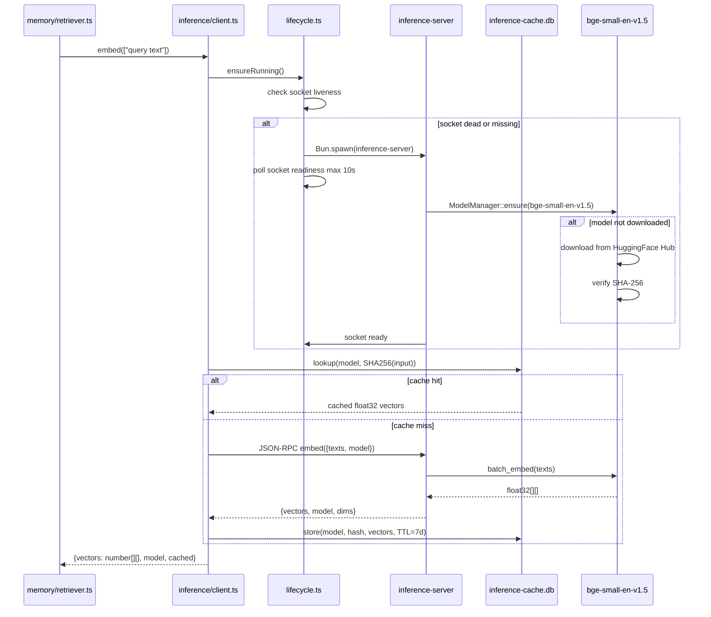

# PRD 2: Inference Sidecar (Rust)

## Status
ready-for-plan-breakdown

## Linkage chain
- Vision: `.scratch/agent-os-vision/VISION-GAPS.md` — no explicit row; underpins every online-gated feature (memory retrieval, router LLM, memory-llm-extract)
- Requirements: `.scratch/agent-os-vision/REQUIREMENTS.md` Pillar 2 section
- Decisions: Q5 (skip Mastra/Vercel SDK, handroll Rust sidecar), Q5b (surviving in-process LLM needs), Q-inference-lang (Rust, static binary), Q-sidecar-path (`./inference/` workspace), Q34 (on-demand spawn via graphile-worker), C1 (inference backends gated except embedded default), A2 (doctor coverage — inference subsystem), C1 inference model defaults (bge-small-en-v1.5 + Qwen2.5-0.5B)
- Docs: fastembed-rs README (`https://github.com/Anush008/fastembed-rs`), candle README (`https://github.com/huggingface/candle`), HuggingFace Hub GGUF format spec, JSON-RPC 2.0 spec (`https://www.jsonrpc.org/specification`)

## Vision
Build the Rust inference sidecar — a single static binary under `inference/` — so Fulcrum has an always-available, zero-API-key path for embeddings and text generation; every subsequent pillar (memory retrieval, router LLM, memory-llm-extract) calls one TS client abstraction and gets the right backend automatically, with no online dependency unless a flag is explicitly flipped. This directly addresses Q5: "skip mastra and vercel api, handroll it with rust sub project with small embedded models".

## Out-of-scope
- Orchestration logic, agent dispatch — Owned by Pillar 3 (Symphony Orchestration); the inference client built here is called by that pillar's hooks.
- Context assembly pipeline — Owned by Pillar 8 (Memory + Context Engine); `src/context/assemble.ts` calls `inference.tokenize()` and `inference.embed()` from this pillar's client.
- Memory retriever (`src/memory/retriever.ts`) — Owned by Pillar 6 (Memory); calls `inference.embed()` from this pillar when `embeddings` flag on.
- Router LLM logic (`src/router/auto-assign.ts`) — Owned by Pillar 3 (Auto-Router); calls `inference.generate()` from this pillar when `router-llm` flag on.
- Browser/WASM inference — not in user's verbatim ask; `fastembed-rs` and `candle` target native Rust binary; no WASM port planned. Explicitly named so it is clear we considered and excluded it.
- Model fine-tuning or training — not in user's verbatim ask (user asked for inference of pre-trained models, not training). Explicitly named so it is clear we considered and excluded it.
- Anthropic/OpenAI vendor SDKs (`@anthropic-ai/sdk`, `openai` npm package) — covered by the `openai-compatible` backend URL+key abstraction; no vendor SDK added.

## Always-on features

- **Rust workspace `inference/`** — Cargo workspace sibling to `src/`. Crates: `inference-core` (shared types + JSON-RPC protocol), `inference-server` (binary entrypoint + dispatcher), `inference-embed` (fastembed-rs), `inference-generate` (candle). Consumed by `fulcrum inference` CLI, `src/inference/lifecycle.ts`, and `src/inference/client.ts`.
- **JSON-RPC 2.0 over Unix socket** — `$FULCRUM_HOME/inference.sock`; length-prefixed newline-delimited JSON. Protocol schema mirrored in `inference/inference-core/src/protocol.rs` (Rust) + `src/inference/protocol.ts` (TS). Fallback: stdio JSON-RPC when socket unavailable (Windows). All surfaces call via `src/inference/client.ts`.
- **Auto-spawn-and-supervise** — `src/inference/lifecycle.ts`: checks socket liveness on first call; if dead, spawns via `Bun.spawn`, polls readiness max 10s, caches PID in `$FULCRUM_HOME/inference.pid`. Transparent to callers.
- **`embed(texts: string[]): Promise<number[][]>`** — batch float32 vectors. Default: `bge-small-en-v1.5` (~67 MB ONNX). Cached per (model, text-hash) through `CacheStore` `EmbedCacheEntry`. Consumed by memory retrieval (Pillar 6) + search (Pillar 14) when `embeddings` flag on.
- **`generate(prompt, options?): Promise<GenerateResult>`** — `GenerateOptions`: `schema?: JSONSchema` (constrained decoding), `model?`, `maxTokens?`, `temperature?`. Default: `Qwen2.5-0.5B-Instruct` Q4_K_M (~400 MB). Consumed by router LLM fallback (Pillar 3) + memory-llm-extract (Pillar 6).
- **`classify(text, labels): Promise<{label, score}[]>`** — zero-shot via cosine similarity; reuses embed backend; no extra model.
- **`tokenize(text, model?): Promise<{count, tokens}>`** — token budget for context assembler (Pillar 3).
- **`health(): Promise<HealthResult>`** — `{ status, backends, models }`; consumed by `fulcrum doctor`, TUI status bar, web settings.
- **`src/inference/client.ts`** — needle-di `@Injectable()` `InferenceClient`; single import/resolution for all callers; reads `FULCRUM_INFERENCE_BACKEND` + feature flags to select backend; retries 3× with exponential backoff; typed `InferenceError { code, backend, message }`; all four backends implement `InferenceBackend` interface.
- **Model auto-download** — `ModelManager::ensure(model_id)` in Rust: checks `$FULCRUM_HOME/models/<model_id>.gguf`; downloads from HuggingFace Hub (HTTPS + SHA-256) if absent; streams progress as `{"type":"download_progress","pct":N}` to stdout; TS surfaces via tRPC subscription.
- **Inference cache store** — `$FULCRUM_HOME/inference-cache.db` SQLite behind `CacheStore`; embed TTL 7 days, gen TTL 1 hour; cache-aside in `embed()` and `generate()`.

## Gated features (online or feature-flagged)

| Feature | Flag | Activates |
|---|---|---|
| Ollama backend | `embeddings:ollama` or `router-llm:ollama` (per-feature backend qualifier) | `src/inference/backends/ollama.ts` sends requests to `http://localhost:11434/api/embed` and `/api/generate`; model name passed through |
| LM Studio backend | `embeddings:lm-studio` or `router-llm:lm-studio` | `src/inference/backends/lm-studio.ts` hits `http://localhost:1234/v1` OpenAI-compat endpoint |
| External LLM provider | `external-llm-provider` (from Pillar 1) | `src/inference/backends/openai-compatible.ts` reads `FULCRUM_INFERENCE_URL` + `FULCRUM_INFERENCE_API_KEY`; calls any OpenAI-compatible API (Anthropic, Groq, Together, DeepSeek, Vercel, OpenRouter) |
| pgvector embeddings pipeline | `embeddings` (from Pillar 1) | Embedding vectors written to `Memory.embedding` and `SearchDocument.embedding` `VectorType` properties on upsert; HNSW index queried in retriever |
| Router LLM fallback | `router-llm` (from Pillar 1) | `generate()` called from `src/router/auto-assign.ts` when json-rules-engine returns no match |
| Memory LLM extraction | `memory-llm-extract` (from Pillar 1) | `generate()` called from `src/memory/extractor-llm.ts` for richer fact extraction from transcripts |

## Tech stack

| Layer | Pick | Rationale | Failure gate → action | Fallback 1 | Fallback 2 |
|---|---|---|---|---|---|
| Language | Rust (stable toolchain, edition 2021) | Single static binary; no Python deps; fast startup; `fastembed-rs` + `candle` both Rust-native | If Rust compilation on target arch fails in CI (ARM64 macOS, x86 Linux) → pin `cross` cross-compiler; if still broken → Python sidecar with `fastembed` + `llama-cpp-python` | Python (fastapi + fastembed + llama-cpp-python) | N/A |
| Embeddings crate | `fastembed-rs` v4 (Apache-2.0) | Wraps ONNX Runtime; `bge-small-en-v1.5` bundled model download; batch API; ~25–100 MB models | If ONNX Runtime link fails on target → fall back to `candle` for embeddings (slower but same crate as generation) | `candle` embeddings | N/A |
| Generation crate | `candle` v0.9+ (Apache-2.0, Hugging Face) | Pure Rust; no C++ llama.cpp dep; Metal (macOS) + CUDA backends; Qwen2.5, Llama3, Phi3 support | If `candle` Metal backend crashes on M-series Mac → disable Metal, CPU-only fallback (`--features cpu`). If candle model support lags → replace with `llm` crate (llama.cpp bindings) | `llm` crate (llama.cpp Rust bindings, MIT) | `mistral.rs` (MIT, HF format, async-native) |
| IPC protocol | JSON-RPC 2.0 over Unix domain socket | Standard; easy to test with `nc`; no HTTP overhead; no TLS cert management for local | If Unix socket unavailable (Windows, container) → stdio JSON-RPC (same protocol, different transport); TS client auto-detects | stdio JSON-RPC | Named pipe (Windows) |
| TS spawn/supervise | `Bun.spawn` + PID file | Already in Bun stdlib; no extra dep | If `Bun.spawn` process supervision unreliable on long-lived Rust process → use `node:child_process` `spawn` with `detached: true` | `node:child_process` | N/A |
| Model download | HuggingFace Hub HTTPS + SHA-256 verify | Free; MIT models available; no API key for public models | If HF rate-limits or goes down → fall back to user-supplied local path via `FULCRUM_MODELS_DIR`; GGUF files from any source accepted | User-supplied local GGUF path | Mirror URLs in `inference/models.toml` |
| Embedding cache | SQLite via `rusqlite` | Zero extra service; in-process; fast reads | If cache DB corrupts → delete and rebuild on next run; embeddings are deterministic | In-memory LRU (loses cache on restart) | N/A |
| Build system | `cargo build --release` + `bun build --compile` wrapper | Standard | N/A | N/A | N/A |

### Stack (C7-C9)

- C7: Main Fulcrum DB schema uses MikroORM v7 ES decorators, `@mikro-orm/migrations`, and generated migration class `src/db/migrations/Migration<timestamp>.ts`.
- C7: Embedding properties use `VectorType` from `pgvector/mikro-orm` with explicit `length: 384`; embeddings flag gates extension registration and writes.
- C8: TS inference services use needle-di `@Injectable()` and constructor `inject(...)` defaults.
- C9: Inference entities live under `src/db/entities/inference/`; repositories under `src/db/repositories/inference/`.
- Rust sidecar cache remains local implementation detail behind `CacheStore`; no hand-written schema files or query snippets are part of Fulcrum docs/source.

Default bundled models (downloaded on first use, not shipped in binary):
- Embeddings: `BAAI/bge-small-en-v1.5` (ONNX, ~67 MB) via `fastembed-rs` default.
- Generation: `Qwen/Qwen2.5-0.5B-Instruct-GGUF` Q4_K_M (~400 MB) via HuggingFace Hub.
- Optional / user-selectable: `meta-llama/Llama-3.2-1B-Instruct-GGUF` (~700 MB), `microsoft/Phi-3.5-mini-instruct-gguf` (~2.2 GB).

## Schema changes

Migration class `Migration<timestamp>` covering inference model cache, provider credentials, and embedding properties is generated from MikroORM metadata; file path: `src/db/migrations/Migration<timestamp>.ts`.

```typescript
import { Entity, Index, PrimaryKey, Property } from '@mikro-orm/decorators/es';
import { randomUUID } from 'node:crypto';
import { VectorType } from 'pgvector/mikro-orm';

@Entity({ tableName: 'model_cache' })
@Index({ properties: ['kind', 'active'] })
export class ModelCache {
  @PrimaryKey({ type: 'uuid' })
  id = randomUUID();

  @Property({ unique: true })
  modelId!: string;

  @Property()
  kind!: 'embed' | 'generate' | 'classify';

  @Property()
  source!: 'bundled' | 'huggingface' | 'local';

  @Property({ nullable: true })
  localPath?: string;

  @Property({ type: 'bigint', nullable: true })
  sizeBytes?: bigint;

  @Property({ nullable: true })
  sha256?: string;

  @Property({ default: false })
  downloaded = false;

  @Property({ default: false })
  active = false;

  @Property({ onCreate: () => new Date() })
  createdAt = new Date();
}

@Entity({ tableName: 'provider_credentials' })
@Index({ properties: ['provider', 'active'] })
export class ProviderCredential {
  @PrimaryKey({ type: 'uuid' })
  id = randomUUID();

  @Property()
  provider!: 'ollama' | 'lm-studio' | 'openai-compatible';

  @Property()
  baseUrl!: string;

  @Property({ nullable: true })
  secretRef?: string;

  @Property({ default: false })
  active = false;
}

@Entity({ tableName: 'memories' })
@Index({ name: 'memories_embedding_hnsw', expression: 'USING hnsw (embedding vector_cosine_ops)' })
export class MemoryEmbeddingColumn {
  @Property({ type: VectorType, length: 384, nullable: true })
  embedding?: number[];
}

@Entity({ tableName: 'search_documents' })
@Index({ name: 'search_documents_embedding_hnsw', expression: 'USING hnsw (embedding vector_cosine_ops)' })
export class SearchDocumentEmbeddingColumn {
  @Property({ type: VectorType, length: 384, nullable: true })
  embedding?: number[];
}

@Entity({ tableName: 'documents' })
export class DocumentEmbeddingColumn {
  @Property({ type: VectorType, length: 384, nullable: true })
  embedding?: number[];
}
```

Rust sidecar cache contract (separate `$FULCRUM_HOME/inference-cache.db`) is represented by typed `EmbedCacheEntry` and `GenerateCacheEntry` structs behind `CacheStore`; tests cover cache put/get/ttl/index behavior through API round-trips, not schema text.

## Surfaces

**Web (SvelteKit)**
- `src/web/src/routes/settings/inference/+page.svelte` — shows active backend, loaded models, download progress (tRPC subscription), toggle backend selector (gated by flags).
- `src/web/src/routes/settings/inference/+page.server.ts` — calls `inference.health`, `inference.models.list`, `inference.models.pull`.
- Backend badge in global nav (green = healthy, yellow = degraded, red = down) via `inference.health` tRPC query on 30-second poll.

**CLI (`fulcrum inference` subcommands)**
- `fulcrum inference start [--backend embedded|ollama|lm-studio]` — spawns sidecar; prints PID + socket path.
- `fulcrum inference stop` — sends SIGTERM to sidecar PID.
- `fulcrum inference status [--json]` — calls `health()`; prints table or JSON.
- `fulcrum inference models list [--json]` — lists known models + download status + size.
- `fulcrum inference models pull <model-id> [--force]` — triggers download; streams progress to stdout.
- `fulcrum inference models rm <model-id>` — deletes GGUF file + DB row.
- `fulcrum inference embed <text> [--model <id>] [--json]` — single-shot embed for debugging.
- `fulcrum inference generate <prompt> [--model <id>] [--max-tokens N] [--json]` — single-shot generate for debugging.

**TUI (OpenTUI)**
- Settings → Inference screen: backend selector, model list with download button, health badge, cache stats (hit rate, size).
- Progress overlay when model is downloading (progress bar fed by tRPC subscription to `inference.models.pull` stream).

**API (tRPC procedures)**
- `inference.health()` → `HealthResult`
- `inference.embed(texts: string[])` → `{ vectors: number[][], model: string, cached: boolean }`
- `inference.generate(prompt: string, options?: GenerateOptions)` → `{ text: string, model: string, tokens: number }`
- `inference.classify(text: string, labels: string[])` → `{ results: {label: string, score: number}[] }`
- `inference.tokenize(text: string)` → `{ count: number }`
- `inference.models.list()` → `InferenceModel[]`
- `inference.models.pull(modelId: string)` → tRPC subscription streaming `{ pct: number, downloaded: number, total: number }`
- `inference.models.rm(modelId: string)` → `{ ok: boolean }`
- `inference.backends.list()` → `Backend[]` with flag-gated availability

## Technical design

### Architecture

```mermaid
graph TD
    subgraph TS process (Bun)
        CLIENT[src/inference/client.ts\n@Injectable InferenceClient]
        LIFE[src/inference/lifecycle.ts\nauto-spawn + PID file]
        EMB[backends/embedded.ts\nUnix socket JSON-RPC]
        OLL[backends/ollama.ts\nHTTP localhost:11434]
        LMS[backends/lm-studio.ts\nHTTP localhost:1234]
        EXT[backends/openai-compatible.ts\nURL + API key - gated]
    end

    subgraph Rust binary - inference/
        SRV[inference-server\nmain + dispatcher]
        PROT[inference-core\nJSON-RPC protocol types]
        FEMB[inference-embed\nfastembed-rs bge-small-en-v1.5]
        FGEN[inference-generate\ncandle Qwen2.5-0.5B]
        SOCK[Unix socket\nFULCRUM_HOME/inference.sock]
        CACHE[inference-cache.db\nSQLite embed + gen cache]
        MDLS[ModelManager\nHuggingFace download + SHA-256]
    end

    subgraph Callers
        MEM[Pillar 8 memory/retriever.ts\nwhen embeddings ON]
        RTR[Pillar 5 router/auto-assign.ts\nwhen router-llm ON]
        CTX[Pillar 8 context/assemble.ts\ntokenize budget]
        EXT2[Pillar 8 extractor-llm.ts\nwhen memory-llm-extract ON]
    end

    CLIENT --> EMB & OLL & LMS & EXT
    LIFE --> SRV
    EMB --> SOCK --> SRV
    SRV --> PROT --> FEMB & FGEN
    FEMB --> CACHE
    FGEN --> CACHE
    FEMB --> MDLS
    FGEN --> MDLS
    MEM --> CLIENT
    RTR --> CLIENT
    CTX --> CLIENT
    EXT2 --> CLIENT
```

### Sequence: first embed call (cold start)



### Error model

| Error code | Description | Propagated to | Recovery action |
|---|---|---|---|
| `SIDECAR_SPAWN_FAILED` | `Bun.spawn` fails or socket not ready in 10s | `InferenceError`; caller receives null result | Check `FULCRUM_HOME` writable; `fulcrum inference start --foreground` to debug |
| `MODEL_DOWNLOAD_FAILED` | HuggingFace HTTPS error or SHA-256 mismatch | Rust exits; socket closed | Set `FULCRUM_MODELS_DIR` to local GGUF path; retry with `fulcrum inference models pull` |
| `BACKEND_UNREACHABLE` | Ollama/LM Studio HTTP 503 or ECONNREFUSED | `InferenceError{code:'BACKEND_UNREACHABLE'}` | Start the backend service; fall back to `embedded` |
| `GENERATE_TIMEOUT` | Generation exceeds 60s | Retry 3× with exponential backoff; then fail | Reduce `maxTokens`; use smaller model tier |
| `GRAMMAR_PARSE_FAILED` | JSON Schema → GBNF conversion fails | Post-hoc: free text → `JSON.parse` with 3 retries | Simplify schema; use subset of JSON Schema |
| `CACHE_CORRUPT` | `inference-cache.db` unreadable | Warn + delete cache; rebuild on next call | `rm $FULCRUM_HOME/inference-cache.db`; auto-rebuilds |

### Observability

OTel spans (no-op when exporter unset):
- `fulcrum.inference.embed` — attributes: `model`, `input_count`, `cached` (boolean), `backend`.
- `fulcrum.inference.generate` — attributes: `model`, `tokens_in`, `tokens_out`, `backend`.
- `fulcrum.inference.model.download` — attributes: `model_id`, `size_bytes`, `duration_ms`.

Log fields: `requestId`, `backend`, `model`, `inputCount`, `durationMs`, `cached`, `error?`.

Events emitted through `EventsRepository`: `inference.model.downloaded`, `inference.sidecar.started`, `inference.sidecar.stopped`.

### Performance budgets

| Operation | p50 target | p95 target |
|---|---|---|
| First embed call (cold start, model cached on disk) | <2s | <5s |
| Embed call (warm, cache miss, bge-small-en) | <50ms | <150ms |
| Embed call (warm, cache hit) | <1ms | <5ms |
| Generate call (Qwen2.5-0.5B, ≤200 tokens, CPU) | <5s | <15s |
| Socket round-trip overhead (no inference) | <2ms | <5ms |
| Model auto-download (bge-small-en ~67MB) | <30s (broadband) | <120s |

## Doctor integration

### Checks added to `fulcrum doctor`

Registered in `src/doctor/checks/inference.ts`:

1. **`inference.embedded.processHealthy`** — calls `health()` JSON-RPC; asserts `{status:'ok'}` within 3s. Spawns sidecar if not running.
2. **`inference.embedded.modelsAvailable`** — `ModelCacheRepository.findActiveDownloaded('embed')`; warn if no downloaded model.
3. **`inference.embedded.socketReachable`** — checks `FULCRUM_HOME/inference.sock` exists and accepts connection.
4. **`inference.cache.readable`** — opens `inference-cache.db`; asserts `CacheStore.health()` returns `ok`.
5. **`inference.ollama.reachable`** (checked when `embeddings:ollama` or `router-llm:ollama` in active flags) — `HEAD http://localhost:11434/`; asserts 200.
6. **`inference.lm-studio.reachable`** (checked when `embeddings:lm-studio` or `router-llm:lm-studio`) — `HEAD http://localhost:1234/v1`; asserts 200.
7. **`inference.external.configured`** (checked when `external-llm-provider` ON) — asserts `FULCRUM_INFERENCE_URL` and `FULCRUM_INFERENCE_API_KEY` set.
8. **`inference.models.diskUsage`** — `ModelCacheRepository.sumDownloadedBytes()`; warn if > 5GB.

### JSON output shape (Zod schema)

```typescript
const DoctorInferenceCheck = z.object({
  subsystem: z.literal('inference'),
  checks: z.array(z.object({
    id: z.string(),           // e.g. 'inference.embedded.processHealthy'
    status: z.enum(['pass', 'warn', 'fail', 'skip']),
    message: z.string(),
    durationMs: z.number().optional(),
    metadata: z.record(z.unknown()).optional(),
  })),
  ok: z.boolean(),
  sidecarVersion: z.string().optional(),
  activeBackend: z.string().optional(),
});
```

### Failure recovery guidance

- `inference.embedded.processHealthy fail` → `fulcrum inference start`; if repeated crashes check `$FULCRUM_HOME/inference.sock` permissions.
- `inference.embedded.modelsAvailable warn` → `fulcrum inference models pull BAAI/bge-small-en-v1.5` to download default model.
- `inference.ollama.reachable fail` → start Ollama with `ollama serve`; verify listening on port 11434.
- `inference.lm-studio.reachable fail` → start LM Studio server; enable API server on port 1234 in LM Studio settings.
- `inference.cache.readable fail` → `rm $FULCRUM_HOME/inference-cache.db`; cache auto-rebuilds.
- `inference.models.diskUsage warn` → `fulcrum inference models rm <model-id>` to free space; keep only active model tier.

## Dependencies
Pillar 1 (Foundation Reset) must be complete: feature-flag registry (`isEnabled()`), tRPC core router + context, `fulcrum` binary entrypoint scaffold, `fulcrum inference` stub converted to real dispatcher, MikroORM config, and generated migration class runner.

## Issues breakdown

**P2.1 — Rust workspace scaffold**
- Owner: `inference/Cargo.toml`, `inference-core/`, `inference-server/`
- RED: `cargo test -p inference-core` passes; `./inference-server --version` exits 0; health JSON-RPC returns `{status:"ok"}`.
- GREEN: workspace init; Protocol types; dispatcher stub; health endpoint.

**P2.2 — Unix socket + JSON-RPC transport**
- Owner: `inference/inference-server/src/transport/`, `src/inference/client.ts`
- RED: TS contract test sends health request over socket; response matches schema; mocked Rust binary used in CI.
- GREEN: Rust listener + TS client; length-prefix framing; 5s timeout; one auto-reconnect.

**P2.3 — Auto-spawn lifecycle**
- Owner: `src/inference/lifecycle.ts`
- RED: `ensureRunning()` spawns mock binary; second call within 1s returns same PID; `stop()` kills process + removes socket.
- GREEN: `Bun.spawn` + PID file + 100ms backoff readiness probe (max 10s).

**P2.4 — Embeddings crate (`fastembed-rs`)**
- Owner: `inference/inference-embed/src/`
- RED: unit test embeds two strings; output dims = 384; different inputs → different vectors.
- GREEN: `fastembed-rs` + f32 array serialization over JSON-RPC.

**P2.5 — Embedding cache**
- Owner: `inference/inference-embed/src/cache.rs`
- RED: second call with same text → hit count increments; no model inference fired.
- GREEN: SQLite-backed `CacheStore` with typed `EmbedCacheEntry`; 7-day TTL eviction; cache-aside in `embed()`.

**P2.6 — Generation crate (`candle`)**
- Owner: `inference/inference-generate/src/`
- RED: `"The capital of France is"` → non-empty response; completes < 30s CPU.
- GREEN: `candle` Qwen2.5-0.5B GGUF; temperature + top-p sampling; dispatched via JSON-RPC.

**P2.7 — Structured output (grammar-constrained)**
- Owner: `inference/inference-generate/src/grammar.rs`
- RED: `generate` with `schema: {type:"object",properties:{agent:{type:"string"}},required:["agent"]}` → valid JSON matching schema.
- GREEN: GBNF grammar from JSON Schema subset; logit bias mask applied to candle sampler.

**P2.8 — Model auto-download**
- Owner: `inference/inference-server/src/models.rs`
- RED: `models.pull("BAAI/bge-small-en-v1.5")` → progress stream 0%→100%; file present at `$FULCRUM_HOME/models/`; SHA-256 matches manifest.
- GREEN: `reqwest` HTTPS + streaming SHA-256; progress JSON to stdout; `ModelCacheRepository` row updated through MikroORM.

**P2.9 — TS backend abstraction**
- Owner: `src/inference/backends/`, `src/inference/client.ts`
- RED: unit tests for `embedded` (socket), `ollama` (mocked HTTP), `lm-studio` (mocked HTTP), `openai-compatible` (mocked, gated). All satisfy `InferenceBackend` interface.
- GREEN: four backend classes; `@Injectable()` `InferenceClient` selects via env + flag qualifier.

**P2.10 — `fulcrum inference` CLI verbs**
- Owner: `src/cli/inference.ts`
- RED: `start` → socket + PID file; `status --json` → health JSON; `stop` → socket removed.
- GREEN: CLI wired to `lifecycle.ts` + tRPC; `models list|pull|rm` work end-to-end.

**P2.11 — tRPC inference procedures**
- Owner: `src/server/trpc/routers/inference.ts`
- RED: `inference.health()` typed; `inference.embed(["test"])` returns `number[][]`; `inference.models.pull` streams progress.
- GREEN: procedures resolving `InferenceClient` from needle-di; subscription via `observable`.

**P2.12 — Web inference settings page**
- Owner: `src/web/src/routes/settings/inference/`
- RED: Playwright — settings → inference: backend badge visible; model list renders; pull button triggers progress overlay.
- GREEN: SvelteKit page + server load + tRPC SSE subscription for pull progress.

**P2.13 — TUI inference screen**
- Owner: TUI settings (OpenTUI)
- RED: smoke test opens screen; backend status + model list render without crash.
- GREEN: OpenTUI component; `inference.health` + `inference.models.list`; progress bar.

**P2.14 — Contract + integration tests**
- Owner: `inference/__tests__/`, `src/inference/__tests__/`
- RED: every JSON-RPC method gets a contract test against the real binary; integration test with `SKIP_MODEL_DOWNLOAD=1` uses mocked responses.
- GREEN: `bun run ci` includes `cargo test --workspace` + TS contract tests; all green.

## Failure gates

| Gate condition | Action |
|---|---|
| `fastembed-rs` ONNX link fails on ARM64 | Switch embeddings to `candle`; update default model dims |
| `candle` Metal backend crashes on M-series (GPU OOM) | Launch with `--no-metal`; CPU-only; note in `fulcrum doctor` |
| Qwen2.5-0.5B GGUF > 1 GB in practice | Switch to Q2_K (~250 MB); expose `--quality` flag |
| HuggingFace Hub blocked by firewall | Accept GGUF from `FULCRUM_MODELS_DIR` local path; skip HF calls |
| Grammar-constrained decoding fails for complex schemas | Post-hoc: free text → `serde_json::from_str` → retry 3× |
| `rusqlite` conflicts with PGlite WASM in Bun process | In-memory LRU only; warn in `fulcrum doctor` |
| Unix socket unavailable (Windows) | Auto-detect; use stdio JSON-RPC; no caller changes |

## Acceptance criteria

- `cargo build --release` in `inference/` produces a binary with no shared lib deps beyond system libc; `ldd inference-server` (Linux) / `otool -L` (macOS) confirms.
- `fulcrum inference start` → socket created + PID file written; `status --json` → `{status:"ok"}`; `stop` → socket removed.
- All three surfaces parity: `inference.health` tRPC returns same health data from web settings page, `fulcrum inference status --json` CLI, and TUI inference screen.
- `fulcrum inference embed "hello world" --json` returns 384-dim float array with no API key after initial model download.
- `fulcrum inference generate "The capital of France is" --json` returns text containing "Paris"; completes under 30s CPU-only.
- `FULCRUM_INFERENCE_BACKEND=ollama` routes `embed` to `http://localhost:11434` — verified by mocked TS test; no caller code change.
- `bun run ci` passes: `cargo test --workspace`, TS contract tests against the binary, Playwright inference settings page test.
