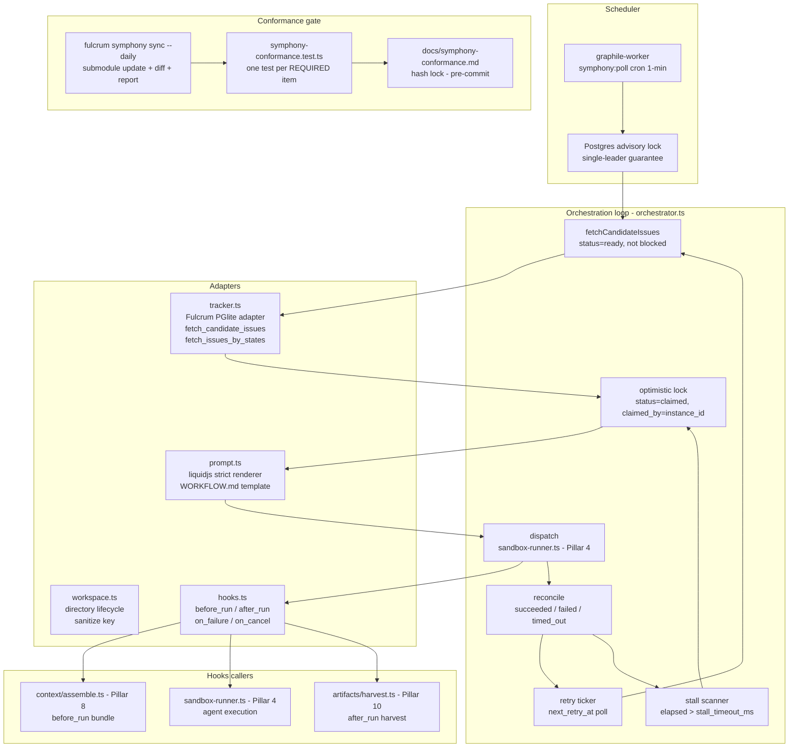
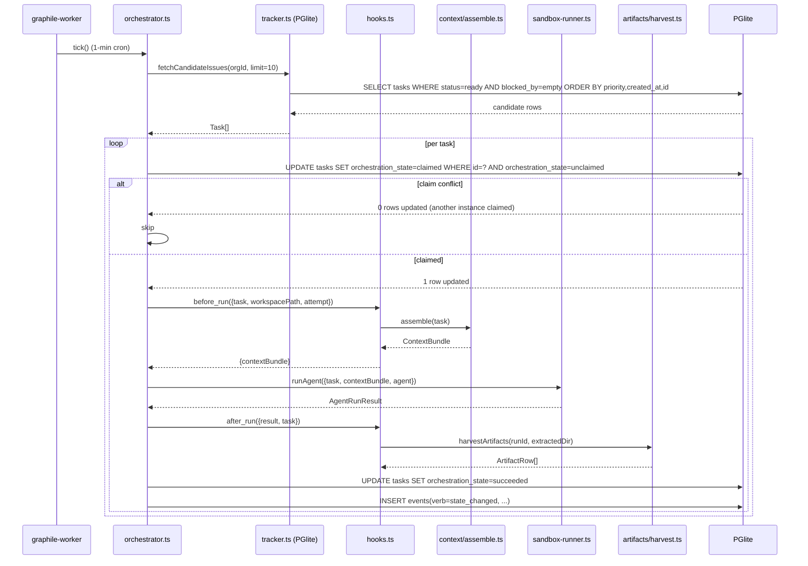

# PRD 3: Symphony Orchestration Loop + Fulcrum Tracker Adapter

## Status: ready-for-plan-breakdown

## Linkage chain
- Vision: `.scratch/agent-os-vision/VISION-GAPS.md` rows: "Agent orchestration + manual assign" (❌), "Auto-orchestration (auto-assign by task type/criteria)" (❌)
- Requirements: `.scratch/agent-os-vision/REQUIREMENTS.md` Pillar 3 section
- Decisions: Q1 (Fulcrum PGlite tasks = canonical tracker; Linear = optional connector), Q3 (Symphony conformance gating: test suite + trace doc + CI gate), Q6 (daily auto Symphony submodule sync via local CI), D1 (`orchestration_state` column name, not `symphony_state`), C1 (remote workspace/SSH/HTTP-API gated), A2 (doctor coverage — orchestration subsystem)
- Docs: OpenAI Symphony SPEC.md (`vendor/openai-symphony/SPEC.md`), liquidjs README (`https://liquidjs.com`), graphile-worker docs (`https://worker.graphile.org`)

## Vision (1-2 sentences from user)
Auto-assign tasks to CLI agents based on task type or other criteria for auto-orchestration mode; follow the Symphony specification as the canonical dispatch-and-retry model so Fulcrum's own PGlite task store is the tracker — no Linear dependency.

## Out-of-scope
- Codex app-server stdio protocol adapter — Owned by Pillar 4 (Sandcastle / Sandbox Runner); this pillar's `dispatcher.ts` calls the sandbox-runner interface that Pillar 4 implements.
- LLM-based auto-assignment router — Owned by Pillar 5 (Auto-Router); `src/router/auto-assign.ts` (json-rules-engine + `router-llm` fallback) is consumed by this pillar's `orchestrator.ts` but built and tested in Pillar 5.
- Inference sidecar — Owned by Pillar 2 (Inference Sidecar); the `router-llm` gated path here calls `src/inference/client.ts` which Pillar 2 builds.
- Memory retrieval / context bundle assembly — Owned by Pillar 8 (Memory + Context Engine); this pillar's `before_run` hook invokes `src/context/assemble.ts` which Pillar 8 builds.
- SaaS multi-tenancy runtime — Owned by Pillar 1 (Foundation Reset); schema is `org_id`-ready from day 1 (C2). Runtime SaaS enablement (auth providers, billing, per-org isolation) is flipped by the `saas-auth` flag registered in Pillar 1.

## Always-on features

- **Symphony outer loop** — `src/orchestration/symphony/orchestrator.ts`. Poll PGlite `tasks` for eligible rows, claim with optimistic lock (`status='claimed', claimed_by=instance_id`), dispatch to sandbox-runner, reconcile on completion or timeout, release workspace. Conforms to `SPEC.md` state machine exactly.
- **Fulcrum tracker adapter** — `src/orchestration/symphony/tracker.ts`. Implements Symphony's three required operations against our `tasks` table: `fetch_candidate_issues` (status=`ready`, not blocked, ordered by priority asc → created_at asc → id lex), `fetch_issues_by_states` (batch by id list), `fetch_issue_states_by_ids` (lightweight status poll). This is the only custom adapter replacing Linear.
- **Issue orchestration state machine** — `Unclaimed → Claimed → Running | RetryQueued → Released`. State transitions stored in `agent_runs.symphony_state`; every transition emits an `events` row.
- **Workspace management** — `src/orchestration/symphony/workspace.ts`. Per-task directory under configurable root (`FULCRUM_WORKSPACE_ROOT`, default `~/.fulcrum/workspaces`). Directory key sanitized: `[A-Za-z0-9._-]` only (SPEC.md §Workspace §Naming Invariant). Create-on-claim, destroy-on-release (or keep for inspect on failure, configurable).
- **Prompt template renderer** — `src/orchestration/symphony/prompt.ts`. Liquid-compatible strict renderer (unknown variable = error, not silent). Variables: `issue` object + `attempt` nullable int. Template loaded from per-project `WORKFLOW.md` front-matter YAML + Markdown body.
- **Lifecycle hooks** — `src/orchestration/symphony/hooks.ts`. Invoked as TS functions (not shell scripts): `before_run`, `after_run`, `on_failure`, `on_cancel`. Each receives typed context `{ run, task, workspacePath, attempt }`. Per-hook configurable timeout (default 60s), enforced via `Promise.race` + `AbortSignal`.
- **Retry/backoff engine** — formula: `min(10000 * 2^(attempt-1), max_retry_backoff_ms)` (SPEC.md §Retry). Persisted in `agent_runs.next_retry_at`. `RetryQueued` entries polled by the outer loop's retry ticker (separate timer from the main poll interval).
- **Stall detection** — elapsed wall-clock `> stall_timeout_ms` → mark `Stalled`, trigger retry. Configurable per project via `WORKFLOW.md` config block (`stall_timeout_ms`, default 300000).
- **Conformance test suite** — `src/orchestration/__tests__/symphony-conformance.test.ts`. One test per REQUIRED SPEC.md item; RED-first. CI fails on any REQUIRED failure or `.todo` item.
- **Conformance trace doc** — `docs/symphony-conformance.md`. Maps each SPEC.md REQUIRED section → Fulcrum file:function. CI fails if doc hash diverges from generated trace (`scripts/gen-conformance-trace.ts`).
- **Trace + telemetry** — every state transition emits: (a) `events` row (`org_id, subject_kind='agent_run', verb='state_changed'`), (b) OTel span via `@opentelemetry/api`; no-op when exporter unset.
- **Job queue integration** — graphile-worker recurring task (`symphony:poll`, 1-min cron) = scheduler entry point; single-leader via Postgres advisory locks. Poll loop itself is in-memory.
- **Daily sync job** — `fulcrum symphony sync --daily`: `git submodule update --remote`, diff `SPEC.md` hash, run conformance suite, write drift report to `.fulcrum/reports/symphony-drift-<date>.md`; opens local branch if diff non-empty.

## Gated features

- **Linear connector** | flag `FULCRUM_FEATURES=connector-linear` | `src/orchestration/connectors/linear.ts` implements the Symphony tracker-adapter interface against the Linear GraphQL API; task sync is bidirectional (Fulcrum PGlite ↔ Linear); issues created in Linear appear as tasks in Fulcrum and vice-versa. Connector adapter pattern is designed and flag-gated in this pillar; off by default (local-first, C2). Mentioned in DECISIONS.md Q1 as "optional connector".
- **Real-time run status push via SSE** | flag `FULCRUM_FEATURES=real-time-collab-server` | when ON, state transitions also publish to a Server-Sent Events channel; Web UI subscribes for live board updates without polling.
- **Remote workspace execution via SSH worker** | flag `FULCRUM_FEATURES=symphony-ssh-worker` | when ON, workspace runs on remote host via SSH stdio (SPEC.md §SSH Worker Extension); orchestrator dispatches to remote agent process. Off by default (local-first constraint).
- **HTTP status API** | flag `FULCRUM_FEATURES=symphony-http-api` | when ON, mounts `GET /api/v1/symphony/state`, `GET /api/v1/symphony/:identifier`, `POST /api/v1/symphony/refresh` endpoints on the Hono server matching SPEC.md §HTTP Server Extension.
- **LLM-narrated drift summary** | flag `FULCRUM_FEATURES=router-llm` | when daily sync detects SPEC.md drift, inference sidecar generates a one-paragraph human summary of breaking vs non-breaking changes appended to the drift report.

## Tech stack

| Layer | Pick | Rationale | Failure gate | Fallback 1 | Fallback 2 |
|---|---|---|---|---|---|
| Orchestration spec | `vendor/openai-symphony` (git submodule, Apache-2.0) | 20k stars, 40-page machine-readable SPEC.md, language-agnostic; OpenAI's canonical agentic pattern | SPEC.md breaking revision requiring >2 dev-weeks to adapt | Custom loop conforming to same behavioral contracts (no Symphony branding) | Temporal TS SDK (adds Go server dep, overkill locally) |
| Poll loop scheduler | `graphile-worker` (MIT, same PGlite Postgres) | Zero extra service; single-leader via Postgres advisory locks; `<5ms` job latency | PGlite in-memory mode (ephemeral queue) → enforce file-backed mode (already Fulcrum default) | `pg-boss` (same Postgres, simpler API) | Inngest self-host (Docker + Postgres) |
| Prompt template | `liquidjs` (MIT, TS-native) | Liquid spec; strict mode throws on unknown vars; SPEC.md mandates strict renderer | liquidjs API break | `eta` templating | Hand-roll micro-Liquid with regex |
| OpenTelemetry | `@opentelemetry/api` + `@opentelemetry/sdk-node` (Apache-2.0) | Vendor-neutral; no-op when exporter unset; zero overhead in local-first mode | Breaking OTel API revision | `pino` structured logs only (already in stack) | No traces (degrade gracefully) |
| Submodule diff | `difft` (difftastic, MIT) | Syntax-aware diff; surfaces SPEC.md structural changes not whitespace | difft unavailable on host | `git diff --unified=5` plain text | `diff` POSIX |

## Schema changes

```sql
-- Add Symphony state columns to agent_runs (partial; full table in Pillar 4 schema)
ALTER TABLE agent_runs
  ADD COLUMN IF NOT EXISTS symphony_state TEXT
    CHECK (symphony_state IN (
      'unclaimed','claimed','running','retry_queued','released',
      'succeeded','failed','timed_out','stalled','cancelled'
    )),
  ADD COLUMN IF NOT EXISTS attempt_count  INTEGER NOT NULL DEFAULT 0,
  ADD COLUMN IF NOT EXISTS next_retry_at  TIMESTAMPTZ,
  ADD COLUMN IF NOT EXISTS workspace_path TEXT,
  ADD COLUMN IF NOT EXISTS last_error_kind TEXT;

-- Claim lock: only one orchestrator instance claims a given run
CREATE UNIQUE INDEX IF NOT EXISTS agent_runs_claimed_unique
  ON agent_runs (task_id)
  WHERE symphony_state = 'claimed';

-- Primary dispatch poll index (matches fetch_candidate_issues ORDER BY)
CREATE INDEX IF NOT EXISTS agent_runs_dispatch_poll
  ON agent_runs (org_id, symphony_state, next_retry_at)
  WHERE symphony_state IN ('unclaimed','retry_queued');

-- Stall detection scan
CREATE INDEX IF NOT EXISTS agent_runs_stall_scan
  ON agent_runs (org_id, symphony_state, started_at)
  WHERE symphony_state = 'running';

-- tasks table: eligibility fields
ALTER TABLE tasks
  ADD COLUMN IF NOT EXISTS blocked_by_ids UUID[] DEFAULT '{}',
  ADD COLUMN IF NOT EXISTS workflow_id    TEXT;   -- links to WORKFLOW.md per project

CREATE INDEX IF NOT EXISTS tasks_dispatch_eligible
  ON tasks (org_id, status, priority, created_at)
  WHERE status = 'ready';

-- WORKFLOW definitions (per-project or per-org)
CREATE TABLE IF NOT EXISTS workflow_definitions (
  id          UUID PRIMARY KEY DEFAULT gen_random_uuid(),
  org_id      UUID NOT NULL REFERENCES orgs(id),
  project_id  UUID REFERENCES projects(id),  -- NULL = org-wide default
  name        TEXT NOT NULL,
  config_yaml TEXT NOT NULL,   -- WORKFLOW.md YAML front-matter block
  prompt_md   TEXT NOT NULL,   -- WORKFLOW.md Markdown body
  created_at  TIMESTAMPTZ NOT NULL DEFAULT NOW(),
  updated_at  TIMESTAMPTZ NOT NULL DEFAULT NOW()
);

CREATE UNIQUE INDEX IF NOT EXISTS workflow_defs_org_project_name
  ON workflow_definitions (org_id, COALESCE(project_id, '00000000-0000-0000-0000-000000000000'::uuid), name);

CREATE INDEX IF NOT EXISTS workflow_defs_org
  ON workflow_definitions (org_id, project_id);
```

## Surfaces

### Web (SvelteKit + tRPC)
- `/projects/[id]/runs` — active runs board; symphony_state badges; expandable timeline per run showing all state transitions.
- `/projects/[id]/runs/[runId]` — run detail: state machine diagram, attempt history, workspace path, last_error_kind, retry schedule, transcript link, artifact list.
- `/settings/orchestration` — per-org: poll interval, max concurrency, stall timeout, workspace root, workflow definitions CRUD.
- `/settings/orchestration/workflows/[id]` — WORKFLOW.md editor: YAML config form + Markdown prompt editor (TipTap).
- Real-time state badge updates via SSE (gated `FULCRUM_FEATURES=real-time-collab-server`); polling fallback (5s) when flag off.

### CLI (`fulcrum symphony …`)
- `fulcrum symphony status` — show running/queued/stalled counts and orchestrator health. `--json`.
- `fulcrum symphony sync [--daily]` — run submodule update + conformance + drift report.
- `fulcrum symphony runs list [--project <id>] [--state <state>]` — tabular. `--json`.
- `fulcrum symphony runs show <runId>` — full run detail. `--json`.
- `fulcrum symphony runs cancel <runId>` — send cancel signal; triggers `on_cancel` hook.
- `fulcrum symphony runs retry <runId>` — force immediate retry; resets `next_retry_at`.
- `fulcrum symphony conformance [--verbose]` — run conformance test suite, output PASS/FAIL per section.
- All commands: `--json` flag for machine-readable output.

### TUI (`fulcrum tui` → Orchestration pane, OpenTUI)
- Orchestration pane: live table of active runs (auto-refresh 2s). Columns: task title, agent, state, attempt, elapsed, workspace.
- State filter tabs: All / Running / Queued / Stalled / Failed.
- Select row → detail overlay: state timeline, hook outputs, error, retry info.
- Keyboard: `r` retry, `x` cancel, `l` view logs, `a` view artifacts, `Esc` back.
- cmd-palette integration: `> symphony …` dispatches CLI equivalents.

### API procedures (tRPC internal, + REST when `FULCRUM_FEATURES=public-api`)
- `orchestration.listRuns({ orgId, projectId, state, cursor, limit })`
- `orchestration.getRun({ runId })`
- `orchestration.cancelRun({ runId })`
- `orchestration.retryRun({ runId })`
- `orchestration.getOrchestratorStatus({ orgId })`
- `orchestration.listWorkflowDefs({ orgId, projectId })`
- `orchestration.upsertWorkflowDef({ orgId, projectId, name, configYaml, promptMd })`
- `orchestration.getSymphonyDriftReport({ date? })`

## Technical design

### Architecture



### Sequence: Symphony poll cycle — claim → dispatch → reconcile



### Error model

| Error code | Description | Propagated to | Recovery action |
|---|---|---|---|
| `CLAIM_CONFLICT` | Two orchestrator instances race on same task | Logged; second instance skips | Advisory lock prevents; safe to ignore |
| `HOOK_TIMEOUT` | Lifecycle hook exceeds per-hook timeout (default 60s) | `HookTimeoutError`; run marked `failed` + retry queued | Increase `hook_timeout_ms` in WORKFLOW.md or fix slow hook |
| `WORKSPACE_KEY_INVALID` | Task title produces unsafe directory characters | Sanitization fallback to `task_<id>` | Sanitizer covers all known characters; no action needed |
| `STALL_DETECTED` | Elapsed > `stall_timeout_ms` (default 300s) | `orchestration_state=stalled`; retry enqueued | Increase stall timeout or investigate agent hang |
| `RETRY_EXHAUSTED` | Attempt count ≥ `max_retry_count` | `orchestration_state=failed`; `events` row emitted | Manual `fulcrum symphony runs retry <id>`; investigate error |
| `TEMPLATE_RENDER_ERROR` | Unknown variable in WORKFLOW.md template | `UnknownVariableError`; run fails before dispatch | Fix template variable name; check against `issue` object shape |
| `SPEC_DRIFT` | `sync --daily` detects SPEC.md hash change | Drift report written; branch opened for review | Review drift report; update conformance tests if needed |

### Observability

OTel spans:
- `fulcrum.symphony.poll` — attributes: `candidates_found`, `claimed_count`.
- `fulcrum.symphony.claim` — attributes: `task_id`, `attempt`.
- `fulcrum.symphony.dispatch` — attributes: `task_id`, `agent`, `sandbox_mode`.
- `fulcrum.symphony.reconcile` — attributes: `task_id`, `from_state`, `to_state`, `duration_ms`.
- `fulcrum.symphony.hook` — attributes: `hook_name`, `duration_ms`.

Log fields: `requestId`, `taskId`, `runId`, `attempt`, `orchestrationState`, `durationMs`, `error?`.

Events emitted: one `events` row per state transition with `verb='state_changed'`, payload `{from, to, attempt}`.

### Performance budgets

| Operation | p50 target | p95 target |
|---|---|---|
| Poll + claim cycle (10 candidates) | <200ms | <500ms |
| Workspace directory creation | <50ms | <200ms |
| Liquid template render | <5ms | <20ms |
| `before_run` hook (excluding context assembly) | <100ms | <500ms |
| Retry backoff formula computation | <0.1ms | <1ms |
| Stall scan query | <20ms | <100ms |
| Symphony sync diff computation | <5s | <30s |

## Doctor integration

### Checks added to `fulcrum doctor`

Registered in `src/doctor/checks/orchestration.ts`:

1. **`orchestration.submodule.present`** — `vendor/openai-symphony/SPEC.md` exists; asserts SHA matches last pinned hash.
2. **`orchestration.graphile-worker.connected`** — graphile-worker registered task `symphony:poll` listed; worker not paused.
3. **`orchestration.workspace-root.writable`** — `FULCRUM_WORKSPACE_ROOT` (or `~/.fulcrum/workspaces`) exists and is writable.
4. **`orchestration.conformance.passing`** — runs `bun test src/orchestration/__tests__/symphony-conformance.test.ts`; asserts exit 0, zero skipped.
5. **`orchestration.drift-report.fresh`** — checks `.fulcrum/reports/symphony-drift-*.md` date; warn if older than 8 days.
6. **`orchestration.active-runs.stalled`** — `SELECT count(*) FROM agent_runs WHERE orchestration_state='stalled'`; warn if > 0, fail if > 10.
7. **`orchestration.db-backed`** — asserts `FULCRUM_PGLITE_PATH` is a file path (not `:memory:`); required for graphile-worker durability.

### JSON output shape (Zod schema)

```typescript
const DoctorOrchestrationCheck = z.object({
  subsystem: z.literal('orchestration'),
  checks: z.array(z.object({
    id: z.string(),
    status: z.enum(['pass', 'warn', 'fail', 'skip']),
    message: z.string(),
    durationMs: z.number().optional(),
    metadata: z.record(z.unknown()).optional(),
  })),
  ok: z.boolean(),
  stalledRunCount: z.number().optional(),
  lastDriftReportDate: z.string().optional(),
});
```

### Failure recovery guidance

- `orchestration.submodule.present fail` → `git submodule update --init vendor/openai-symphony`.
- `orchestration.graphile-worker.connected fail` → check `FULCRUM_PGLITE_PATH` is set to file-backed path; restart `fulcrum web`.
- `orchestration.workspace-root.writable fail` → `mkdir -p ~/.fulcrum/workspaces && chmod 700 ~/.fulcrum/workspaces`.
- `orchestration.conformance.passing fail` → `fulcrum symphony conformance --verbose` to see failing items; fix implementation.
- `orchestration.active-runs.stalled fail` → `fulcrum symphony runs list --state stalled --json`; `fulcrum symphony runs retry <id>`.
- `orchestration.db-backed fail` → set `FULCRUM_PGLITE_PATH=~/.fulcrum/db` in env/`.envrc`.

## Dependencies

- `vendor/openai-symphony` (git submodule, Apache-2.0) — SPEC.md only; Elixir impl not used
- `graphile-worker` (MIT) — already in stack; add recurring task registration
- `liquidjs` (MIT) — Liquid template renderer; strict mode
- `@opentelemetry/api`, `@opentelemetry/sdk-node`, `@opentelemetry/exporter-trace-otlp-http` (Apache-2.0)
- `difft` (difftastic, MIT) — binary on PATH; CI install via `mise`
- `zod` (MIT) — already in stack; used for WORKFLOW.md config validation
- No new Python deps; no new services beyond existing PGlite + graphile-worker

## Issues breakdown (TDD, numbered P3.x)

| # | Title | RED idea | GREEN target |
|---|---|---|---|
| P3.1 | Git submodule + SPEC.md pin | `vendor/openai-symphony/SPEC.md` absent → test fails | `git submodule add`; `just sync-symphony` recipe; CI verifies hash |
| P3.2 | `workflow_definitions` migration | table absent → migration → table + composite indexes present | Drizzle migration; verify `(org_id, project_id, name)` + `(org_id, project_id)` indexes |
| P3.3 | `agent_runs` Symphony columns | five new columns absent → migration → present with CHECK constraints | `ALTER TABLE` Drizzle migration; partial indexes for dispatch poll + stall scan + claimed unique |
| P3.4 | Tracker `fetchCandidateIssues` | returns tasks unordered / includes blocked / includes already-claimed | `tracker.ts`; ORDER BY `priority asc, created_at asc, id lex`; WHERE clauses per SPEC.md §Ordering |
| P3.5 | Tracker `fetchIssuesByStates` + `fetchIssueStatesByIds` | batch returns wrong shape or missing rows | implement both ops; Zod input validation; unit tests with fixture tasks |
| P3.6 | State machine: Unclaimed → Claimed | concurrent claim on same task succeeds twice | optimistic `INSERT … ON CONFLICT DO NOTHING`; second claim returns conflict error; `events` row emitted |
| P3.7 | State machine: Running → Released happy path | state sequence not recorded | `dispatchRun` + `reconcileCompletion` + `releaseWorkspace`; each emits `events` row + OTel span |
| P3.8 | Workspace key sanitization | special-char title produces invalid dir name | `sanitizeWorkspaceKey(title, taskId)` → `[A-Za-z0-9._-]+`; numeric suffix on collision |
| P3.9 | Lifecycle hooks + timeout | hook exceeding timeout resolves instead of rejecting | `hooks.ts` `Promise.race(hookFn, timeout)`; `HookTimeoutError`; all four hooks (`before_run`, `after_run`, `on_failure`, `on_cancel`) wired |
| P3.10 | Retry/backoff formula | attempt 3 returns wrong delay | `calcRetryDelay(attempt, maxMs)` → `min(10000 * 2^(attempt-1), maxMs)`; parameterized table test |
| P3.11 | Stall detection | run past `stall_timeout_ms` stays `running` | 30s stall-scan timer; query `agent_runs_stall_scan` index; mark `stalled`; enqueue retry |
| P3.12 | liquidjs strict-mode renderer | unknown template var silently renders empty | `strictVariables: true, strictFilters: true`; unknown var throws `UnknownVariableError` |
| P3.13 | graphile-worker poll registration | `symphony:poll` task not registered after startup | register in `src/jobs/registry.ts`; integration test with in-process worker; tick wires to `orchestrator.tick()` |
| P3.14 | Conformance test suite | all `it()` items `.todo`; CI fails on todo > 0 | implement one test per REQUIRED SPEC.md item; zero todo + zero failing = CI green |
| P3.15 | Conformance trace doc + hash gate | doc missing or stale after refactor | `scripts/gen-conformance-trace.ts`; `.symphony-conformance.lock`; pre-commit hook regenerates |
| P3.16 | `fulcrum symphony sync --daily` | command exits 0 when SPEC hash changed | `git submodule update --remote`; hash compare; difft; drift report to `.fulcrum/reports/`; conformance run |
| P3.17 | OTel spans on transitions | transitions emit no spans | inject `Tracer`; `tracer.startActiveSpan` wraps each transition; mock tracer captures `from_state`/`to_state` attrs |
| P3.18 | Web runs board | page missing / state badges static | SvelteKit page + tRPC query; state badge component; SSE subscription (gated) + polling fallback |
| P3.19 | CLI surface parity | `symphony runs list --json` missing or invalid | codegen CLI bindings; hand-roll `conformance` command; integration test `list`, `cancel`, `retry`, `conformance` |
| P3.20 | TUI orchestration pane | pane absent / `r`/`x` keys unbound | OpenTUI `<OrchestratorPane>`; keyboard bindings wired to `retryRun`/`cancelRun` tRPC mutations |

## Failure gates

1. **SPEC.md breaking revision** — if `sync --daily` diff reveals a REQUIRED-section rewrite requiring >10 changed Fulcrum functions, open a `symphony-drift-<date>` branch, block auto-merge, surface to user for scoping decision before proceeding.
2. **graphile-worker + PGlite in-memory** — if PGlite is configured in-memory (transient), graphile-worker loses queue state on restart. Gate: `fulcrum doctor` checks `FULCRUM_PGLITE_PATH` is set to a file path, not `:memory:`. If not set, warn + default to `~/.fulcrum/db`.
3. **liquidjs strict mode false positive** — if legitimate WORKFLOW.md templates use Liquid features not in strict subset (e.g. custom filters), configure an allowlist in `prompt.ts` before upgrading to strict. Gate: template parse failures in CI trigger an explicit error, not silent template corruption.
4. **OpenTelemetry peer dep conflict** — OTel SDK pins its own version of `@opentelemetry/api`. If other deps also pin it at an incompatible semver, Bun may use two instances (no-op spans). Gate: CI step verifies `bun pm ls @opentelemetry/api` shows exactly one version.
5. **Conformance doc hash drift** — if `scripts/gen-conformance-trace.ts` is not updated when `orchestrator.ts` is refactored, the hash gate will fail. Gate: pre-commit hook runs `gen-conformance-trace` and stages updated doc automatically.

## Acceptance criteria

1. `bun test src/orchestration/__tests__/symphony-conformance.test.ts` passes with zero skipped/todo items; output lists every REQUIRED SPEC.md section as PASS.
2. `docs/symphony-conformance.md` lock hash matches CI gate; removing any function from `orchestrator.ts` / `tracker.ts` / `hooks.ts` / `workspace.ts` / `prompt.ts` / `retry.ts` causes CI hash gate to fail.
3. Full happy-path integration test: create task in PGlite → orchestrator claims it → `before_run` hook fires → sandbox-runner stub returns success → `after_run` hook fires → run transitions to `released`/`succeeded` → `events` table has all four transition rows → OTel spans recorded in test tracer.
4. Retry formula test: attempt 1→10000ms, attempt 4→80000ms, attempt 10→capped at configured `max_retry_backoff_ms`; stall detection fires within 100ms of crossing `stall_timeout_ms` threshold (mocked clock).
5. All three surfaces parity: `fulcrum symphony runs list` (CLI) + `/projects/:id/runs` (Web) + TUI orchestration pane all display the same run rows from the same tRPC procedures; cancelling a run from any surface updates state visible in the other two.
6. `fulcrum symphony sync --daily` exits non-zero when SPEC.md hash changes; exits 0 and writes a "no drift" report when hash unchanged; conformance tests run as part of sync.
7. `fulcrum doctor` reports orchestration health: submodule present and pinned, graphile-worker connected, workspace root writable, last drift report date; exits non-zero if any check fails.
