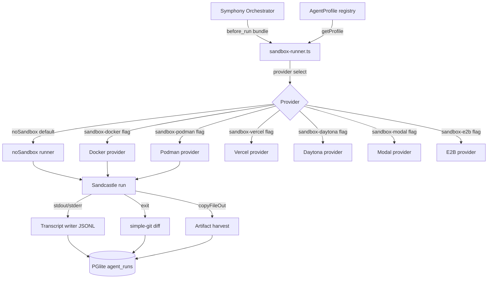
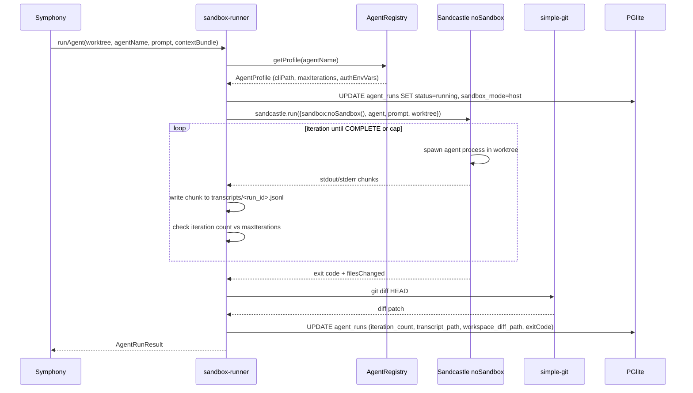
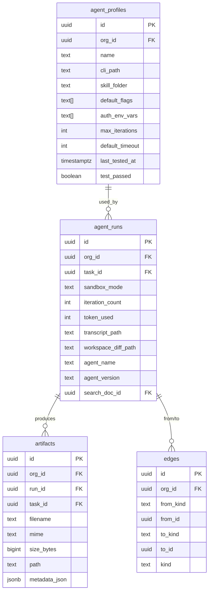

# PRD 4: Sandcastle Wrapper + Agent Runner Abstraction

## Status: ready-for-plan-breakdown

## Linkage chain

| Dimension | Detail |
|---|---|
| Vision gaps | V-gap-04: no isolated agent execution environment; V-gap-06: no per-agent capability profiles; V-gap-07: no transcript/diff capture per run |
| Requirements pillar | Pillar 4 — Agent Runner Abstraction (`REQUIREMENTS.md §4`) |
| Key decisions | Q34 (on-demand sandbox spawn, not always-running daemon); C1 (all features ship; gated behind flags not deferred); C4 (three-surface parity); D5 (flag naming lowercase-hyphen: `sandbox-docker`, `sandbox-podman`, etc.) |
| External specs | Sandcastle `@ai-hero/sandcastle` v0.5.6 API docs; Effect TS peer-dep isolation guide; Symphony `SPEC.md §after_run` hook contract |

## Vision (1-2 sentences from user)
Assign any task to any agent and auto-assign default tasks to CLI agents based on task type or other criteria; no distinction between personal and AI agent projects — both run through the same execution infrastructure with the same lifecycle, isolation, and capture guarantees.

## Out-of-scope

Items here fall strictly into carve-out (1): genuinely not in user's verbatim ask and not in any locked decision; or carve-out (2): owned by another pillar. Per C5, no feature mentioned in user's ask, OPEN-QUESTIONS, research, or DECISIONS may appear here.

- **Owned by Pillar 3 (Symphony / Orchestration):** Symphony outer loop (poll, claim, reconcile).
- **Owned by Pillar 5 (Auto-Router):** Auto-router / rules engine (`src/router/auto-assign.ts` module).
- **Owned by Pillar 6 (Memory / Context):** Memory retrieval and context bundle assembly (assembled bundle passed in via `before_run` hook; this pillar consumes it, does not build it).
- **Owned by Pillar 2 (Inference Sidecar):** Inference sidecar build and model management.
- **Effect framework exposure** beyond Sandcastle's own dependency tree — not in user's verbatim ask; Effect is an internal peer dep isolated to the adapter boundary, not a Fulcrum surface.
- **New agent profiles beyond the named six** (claude-code, codex, pi, copilot, opencode, gemini-cli) — extend via profile files as needed; no PRD change required. Not a PRD-scope decision.

## Always-on features

- **`sandbox-runner.ts` adapter** — `src/orchestration/sandbox-runner.ts`. Wraps `@ai-hero/sandcastle` `sandcastle.run()` / `createSandbox()`. Exposes Fulcrum types `AgentRunRequest` / `AgentRunResult`; API churn confined to this file. Signature: `(worktree, agentProfile, prompt, contextBundle, timeout, opts)` → `{ transcript, exitCode, filesChanged, artifacts, durationMs, iterationCount, tokenUsed? }`.
- **Agent profile registry** — `src/agents/profiles/{claude-code,codex,pi,copilot,opencode,gemini-cli}.ts`. Each exports `AgentProfile`: `{ name, cliPath, defaultFlags, skillFolder, authEnvVars[], sandcastleProvider, maxIterations, defaultTimeout }`. Registry at `src/agents/registry.ts`; validates all profiles at startup; `getProfile(name)` throws `UnknownAgentError`.
- **Invocation lifecycle** (enforced in `sandbox-runner.ts`): Symphony `before_run` result (context bundle) passed in → Sandcastle spawns agent in worktree → captures transcript/exit/diff/artifacts → returns `AgentRunResult` to Symphony `after_run` hook.
- **Iteration loop + hard cap** — loops while COMPLETE signal absent; appends context each turn. Cap: `agentProfile.maxIterations` (default 10) + `FULCRUM_MAX_TOKENS_PER_RUN` (default 200000). Writes `iteration_count` to DB.
- **noSandbox mode (default)** — Sandcastle `noSandbox()` provider; agent runs directly in git worktree on host. `fulcrum doctor` always emits trust-boundary warning.
- **Worktree lifecycle** — `createWorktree()` per run; branch strategy per profile (default `merge-to-head`). Teardown on `after_run`; optionally preserved on failure (`FULCRUM_KEEP_WORKTREE_ON_FAILURE`).
- **Transcript capture** — stdout/stderr streamed to `<workspace_root>/transcripts/<run_id>.jsonl`; `transcript_path` written to DB.
- **Workspace diff capture** — `git diff HEAD` via `simple-git` after run; stored at `<workspace_root>/diffs/<run_id>.diff`; `workspace_diff_path` written to DB.
- **Artifact harvest** — `after_run` calls `sandbox.copyFileOut()` for files matching project artifact glob (default `dist/**,build/**,*.patch,*.diff`); inserts `artifacts` row + `edges` row (`artifact → generated_by → agent_run`).
- **`fulcrum agents` CLI** — `list | profile <name> | test <name>`. `test` pings agent with `--version`, verifies exit 0 + auth vars, writes `last_tested_at` to DB.
- **`fulcrum runs` CLI** — `<id> attach | cancel | retry | logs`. `attach` tails JSONL live; `cancel` SIGTERMs process + `on_cancel` hook; `retry` re-enqueues in Symphony. All `--json`.
- **`fulcrum doctor` orchestration checks** — Sandcastle version pinned; Docker/Podman reachable when mode configured; agent binaries on PATH; auth vars set; workspace root writable; Effect singleton.

## Gated features

- **Docker container mode** | `FULCRUM_FEATURES=sandbox-docker` | Sandcastle `docker()` provider; `docker info` gate; doctor error if daemon down and flag on.
- **Podman alternative** | `FULCRUM_FEATURES=sandbox-podman` | Sandcastle `podman()` provider; mutually exclusive with `sandbox-docker`.
- **Vercel sandbox provider** | `FULCRUM_FEATURES=sandbox-vercel` | Sandcastle `vercel()` provider; requires `VERCEL_TOKEN` env var; doctor warns if token absent when flag on. Default mode stays `noSandbox`; user opts in by setting flag + auth env var.
- **Daytona sandbox provider** | `FULCRUM_FEATURES=sandbox-daytona` | Sandcastle `daytona()` provider; requires `DAYTONA_API_KEY` + `DAYTONA_SERVER_URL`; doctor check for both vars. User opts in.
- **Modal sandbox provider** | `FULCRUM_FEATURES=sandbox-modal` | Sandcastle `modal()` provider; requires `MODAL_TOKEN_ID` + `MODAL_TOKEN_SECRET`; doctor check. User opts in.
- **E2B sandbox provider** | `FULCRUM_FEATURES=sandbox-e2b` | Sandcastle `e2b()` provider; requires `E2B_API_KEY`; doctor check. User opts in.
- **Session resumption on retry** | `FULCRUM_FEATURES=session-resume` | Sandcastle `resumeSession` with prior run's JSONL path (claude-code only); cold-start fallback when off.
- **Token usage tracking** | `FULCRUM_FEATURES=token-tracking` | per-profile `tokenCountPattern` parses stdout; writes `agent_runs.token_used`; NULL when off.
- **Parallel worktrees** | `FULCRUM_FEATURES=parallel-worktrees` | `createSandbox()` + multiple `createWorktree()` for batch tasks; Docker mode only.
- **Real-time transcript streaming** | `FULCRUM_FEATURES=real-time-collab-server` | JSONL lines pushed to SSE; polling fallback when off.

## Tech stack

| Layer | Pick | Rationale | Failure gate | Fallback 1 | Fallback 2 |
|---|---|---|---|---|---|
| Agent execution | `@ai-hero/sandcastle` v0.5.6 (MIT, npm) | 2.3k stars; covers sandbox lifecycle, git worktrees, branch strategy, iteration loop, session capture; saves ~400 LOC of must-write code | API break before 1.0 requiring adapter rewrite >2×/quarter | Direct `Bun.spawn()` + `simple-git` worktree management + custom branch/merge (~400 LOC) | Claude Agent SDK TS v2 managed-agents (loses local-first) |
| Sandbox isolation (default) | `noSandbox()` (built into Sandcastle) | Zero deps; works everywhere; doctor warns about trust boundary | N/A — always available | N/A | N/A |
| Sandbox isolation (opt-in) | `docker()` / `podman()` providers (Sandcastle) | Hardens isolation; user opt-in via flag | Docker unavailable → fall back to noSandbox mode with explicit warning | Podman (`--podman` flag) | noSandbox with aggressive gitignore + chroot (incomplete isolation) |
| Git worktree management | Sandcastle `createWorktree()` | Handles create/use/teardown; branch strategy config; ~0 extra code | Sandcastle `createWorktree` removed in API revision → `simple-git` + manual worktree mgmt | `simple-git` npm + manual | `child_process` `git worktree add/remove` calls |
| Effect runtime | `effect` peer dep (MIT, via Sandcastle) | Required by Sandcastle; do not use directly in Fulcrum core; isolate to adapter boundary | Effect version conflict with Mastra or PGlite in Bun's module resolver | Upgrade Sandcastle to version that drops Effect dep (if/when available) | Replace Sandcastle with direct Bun.spawn fallback |
| Transcript storage | Local filesystem JSONL (`workspace_path/transcripts/`) | Zero infra; streamable; portable; content-addressed by run_id | Disk full → FULCRUM_MAX_TRANSCRIPT_SIZE limit + log rotation | Object storage (S3-compatible, gated) | PGlite bytea for small transcripts |

## Schema changes

```sql
ALTER TABLE agent_runs
  ADD COLUMN IF NOT EXISTS sandbox_mode        TEXT NOT NULL DEFAULT 'host'
    CHECK (sandbox_mode IN ('host', 'docker', 'podman')),
  ADD COLUMN IF NOT EXISTS iteration_count     INTEGER NOT NULL DEFAULT 0,
  ADD COLUMN IF NOT EXISTS token_used          INTEGER,
  ADD COLUMN IF NOT EXISTS transcript_path     TEXT,
  ADD COLUMN IF NOT EXISTS workspace_diff_path TEXT,
  ADD COLUMN IF NOT EXISTS agent_name          TEXT,
  ADD COLUMN IF NOT EXISTS agent_version       TEXT,
  ADD COLUMN IF NOT EXISTS search_doc_id       UUID REFERENCES search_documents(id);

CREATE INDEX IF NOT EXISTS agent_runs_agent_org
  ON agent_runs (org_id, agent_name, status, created_at);

CREATE TABLE IF NOT EXISTS artifacts (
  id            UUID PRIMARY KEY DEFAULT gen_random_uuid(),
  org_id        UUID NOT NULL REFERENCES orgs(id),
  run_id        UUID NOT NULL REFERENCES agent_runs(id),
  task_id       UUID REFERENCES tasks(id),
  filename      TEXT NOT NULL,
  mime          TEXT,
  size_bytes    BIGINT,
  path          TEXT NOT NULL,
  metadata_json JSONB,
  created_at    TIMESTAMPTZ NOT NULL DEFAULT NOW()
);

CREATE INDEX IF NOT EXISTS artifacts_org_run  ON artifacts (org_id, run_id);
CREATE INDEX IF NOT EXISTS artifacts_org_task ON artifacts (org_id, task_id);

CREATE TABLE IF NOT EXISTS edges (
  id         UUID PRIMARY KEY DEFAULT gen_random_uuid(),
  org_id     UUID NOT NULL REFERENCES orgs(id),
  from_kind  TEXT NOT NULL,
  from_id    UUID NOT NULL,
  to_kind    TEXT NOT NULL,
  to_id      UUID NOT NULL,
  kind       TEXT NOT NULL,
  created_at TIMESTAMPTZ NOT NULL DEFAULT NOW()
);

CREATE UNIQUE INDEX IF NOT EXISTS edges_from_to_kind
  ON edges (org_id, from_kind, from_id, to_kind, to_id, kind);

CREATE INDEX IF NOT EXISTS edges_to_lookup
  ON edges (org_id, to_kind, to_id, kind);

CREATE TABLE IF NOT EXISTS agent_profiles (
  id              UUID PRIMARY KEY DEFAULT gen_random_uuid(),
  org_id          UUID NOT NULL REFERENCES orgs(id),
  name            TEXT NOT NULL,
  cli_path        TEXT,
  skill_folder    TEXT,
  default_flags   TEXT[],
  auth_env_vars   TEXT[],
  max_iterations  INTEGER NOT NULL DEFAULT 10,
  default_timeout INTEGER NOT NULL DEFAULT 600000,
  last_tested_at  TIMESTAMPTZ,
  test_passed     BOOLEAN,
  created_at      TIMESTAMPTZ NOT NULL DEFAULT NOW(),
  updated_at      TIMESTAMPTZ NOT NULL DEFAULT NOW()
);

CREATE UNIQUE INDEX IF NOT EXISTS agent_profiles_org_name
  ON agent_profiles (org_id, name);
```

## Surfaces

### Web (SvelteKit + tRPC)
- `/agents` — registry: all profiles, last-tested badge, test button, profile editor.
- `/agents/[name]` — profile detail: CLI path, flags, auth env vars (masked), run history.
- `/projects/[id]/runs` — list with agent name, sandbox_mode chip, iteration_count columns.
- `/projects/[id]/runs/[runId]` — tabbed detail: Summary | Transcript (paginated JSONL renderer, collapsible turns) | Diff (syntax-highlighted) | Artifacts (download).
- SSE live transcript stream when `real-time-collab-server` on; 2s poll fallback.

### CLI (`fulcrum agents …` + `fulcrum runs …`)
- `fulcrum agents list | profile <name> | test <name>` — `test` spawns `--version`, verifies auth vars, writes `last_tested_at`. All `--json`.
- `fulcrum runs list [--project] [--agent] [--state] | show <id> | <id> logs [--follow] | <id> attach | <id> cancel | <id> retry` — all `--json`.

### TUI (OpenTUI)
- **Agents pane**: profile table, `t` test, `e` edit overlay, `Enter` → run history.
- **Runs detail overlay**: tabs Summary | Transcript (auto-scroll live) | Diff | Artifacts. Keys: `l` transcript, `d` diff, `a` artifacts, `c` cancel, `r` retry, `Esc` back.
- cmd-palette: `> agents test <name>`, `> runs cancel/retry <id>`.

### API procedures (tRPC internal, + REST when `FULCRUM_FEATURES=public-api`)
- `agents.listProfiles({ orgId })`
- `agents.getProfile({ orgId, name })`
- `agents.testProfile({ orgId, name })` — mutation; spawns test; returns result
- `agents.upsertProfile({ orgId, profile })` — mutation
- `runs.list({ orgId, projectId?, agentName?, state?, cursor, limit })`
- `runs.get({ runId })`
- `runs.cancel({ runId })` — mutation
- `runs.retry({ runId })` — mutation
- `runs.getLogs({ runId, cursor?, limit? })` — paginated transcript
- `runs.streamLogs({ runId })` — async generator / SSE subscription
- `runs.listArtifacts({ runId })`
- `runs.getWorkspaceDiff({ runId })`

## Technical design

### Architecture



### Sequence: noSandbox run start to finish



### ER diagram



### Error model

| Code | Description | Propagated to | Recovery |
|---|---|---|---|
| `UNKNOWN_AGENT_ERROR` | `getProfile(name)` finds no matching profile | tRPC caller | Register profile; `fulcrum agents list` to inspect |
| `SANDBOX_PROVIDER_UNAVAILABLE` | `docker info` non-zero when `sandbox-docker` flag active | tRPC + doctor | Start Docker daemon; never silently fallback |
| `MAX_ITERATIONS_EXCEEDED` | Loop hit `maxIterations` cap without COMPLETE signal | DB `exitReason` col; caller | Increase `agentProfile.maxIterations` or fix agent COMPLETE signal |
| `TRANSCRIPT_DISK_FULL` | `ENOSPC` writing JSONL | Logged + `transcript_truncated=true` | Clean disk; check `FULCRUM_MAX_TRANSCRIPT_SIZE` |
| `WORKTREE_CREATE_FAILED` | `createWorktree()` throws | Abort run; DB status=failed | Check repo state; clean stale worktrees |
| `EFFECT_VERSION_CONFLICT` | `bun pm ls effect` shows >1 version | CI gate | Pin Effect; see failure gate |

### Observability

| Signal | Name | Fields |
|---|---|---|
| OTel span | `fulcrum.sandbox.run` | `agent_name`, `sandbox_mode`, `run_id`, `iteration_count`, `exit_code` |
| OTel span | `fulcrum.sandbox.providerSelect` | `provider_name`, `flag_active` |
| OTel span | `fulcrum.artifact.harvest` | `run_id`, `file_count`, `total_bytes` |
| Log event | `agent.run.started` | `run_id`, `agent`, `sandbox_mode`, `worktree` |
| Log event | `agent.run.completed` | `run_id`, `exit_code`, `iterations`, `duration_ms` |
| Log event | `agent.run.max_iterations` | `run_id`, `cap`, `last_signal` |

### Performance budgets

| Operation | p50 | p95 |
|---|---|---|
| `sandbox-runner.runAgent` cold start (noSandbox) | <2 s | <5 s |
| `getProfile(name)` registry lookup | <5 ms | <15 ms |
| Transcript JSONL flush per chunk | <1 ms | <5 ms |
| `git diff HEAD` after run | <200 ms | <800 ms |
| `artifact.harvest` (3 files, <1 MB each) | <500 ms | <2 s |

## Doctor integration

Subsystem: `sandbox`

```typescript
const DoctorSandboxCheck = z.object({
  subsystem: z.literal('sandbox'),
  checks: z.array(z.object({
    id: z.string(),
    status: z.enum(['pass', 'warn', 'fail']),
    message: z.string(),
    durationMs: z.number().optional(),
    metadata: z.record(z.unknown()).optional(),
  })),
  ok: z.boolean(),
});
```

| Check ID | What it verifies | Failure recovery |
|---|---|---|
| `sandbox.sandcastle.version` | `@ai-hero/sandcastle` installed at pinned version | `bun add @ai-hero/sandcastle@0.5.6` |
| `sandbox.effect.singleton` | `bun pm ls effect` returns exactly one version | Audit package.json deps; pin Effect |
| `sandbox.agent-registry.loadable` | All 6 built-in profiles load without error | Check profile files exist in `src/agents/profiles/` |
| `sandbox.noSandbox.trustWarning` | Any `noSandbox()` call has adjacent `logger.warn(TRUST_BOUNDARY_WARNING)` | Add warning; CI semgrep rule enforces |
| `sandbox.agent.claude-code.binary` | `claude` binary on PATH | Install claude-code; check `$PATH` |
| `sandbox.agent.codex.binary` | `codex` binary on PATH | Install Codex CLI |
| `sandbox.docker.daemon` | `docker info` exits 0 (only if `sandbox-docker` flag on) | Start Docker daemon or disable flag |
| `sandbox.podman.daemon` | `podman info` exits 0 (only if `sandbox-podman` flag on) | Start Podman or disable flag |
| `sandbox.workspace-root.writable` | Workspace root directory is writable | Check filesystem permissions |
| `sandbox.transcripts-dir.writable` | `<workspace>/transcripts/` can be created and written | Check disk space; permissions |

## Dependencies

- `@ai-hero/sandcastle` v0.5.6 (MIT, npm) — pin exact version; Renovate for bumps
- `effect` (MIT, npm) — peer dep required by Sandcastle; isolate to adapter boundary; do not import in non-orchestration modules
- `@effect/platform`, `@effect/platform-node` (MIT) — Sandcastle peer deps; same isolation rule
- `simple-git` (MIT, npm) — fallback worktree management if Sandcastle API changes; also used for workspace diff capture
- `zod` (MIT) — already in stack; agent profile schema validation
- `graphile-worker` (MIT) — already in stack; retry re-enqueue via job queue
- No new services; no Python deps; no new infra

## Issues breakdown (TDD, numbered P4.x)

| # | Title | RED idea | GREEN target |
|---|---|---|---|
| P4.1 | Sandcastle install + Effect singleton | `bun pm ls effect` shows 2+ versions | `bun add @ai-hero/sandcastle@0.5.6`; pin Effect; CI asserts single version |
| P4.2 | `AgentProfile` type + registry | `getProfile('nonexistent')` resolves instead of throwing | `src/agents/types.ts` + `src/agents/registry.ts`; `UnknownAgentError`; load 6 profiles |
| P4.3 | claude-code profile | profile test fails — binary not found or missing `ANTHROPIC_API_KEY` check | `src/agents/profiles/claude-code.ts`; `fulcrum agents test claude-code` exits 0 |
| P4.4 | codex profile | profile test fails — wrong env var or provider | `src/agents/profiles/codex.ts`; `OPENAI_API_KEY`; `codex()` Sandcastle provider |
| P4.5 | pi / copilot / opencode / gemini-cli profiles | registry load throws on missing profile files | four profile files; registry integration test loads all 6 at startup |
| P4.6 | `sandbox-runner.ts` noSandbox happy path | `runAgent()` throws or returns empty result | adapter wraps `sandcastle.run({ sandbox: noSandbox(), agent: ... })`; stub agent; assert `AgentRunResult` shape |
| P4.7 | Docker mode provider selection (gated) | `sandbox-docker` flag ignored; always noSandbox | provider-select logic; `fulcrum doctor` Docker daemon check; flag-off → noSandbox + trust-boundary warn |
| P4.8 | Podman mode (gated) | Podman flag + Docker flag both active → undefined provider | Podman branch in adapter; mutual-exclusion warning; `sandbox-podman` selects `podman()` |
| P4.9 | Iteration loop + hard cap | agent without COMPLETE signal runs forever | iteration loop; `maxIterations` cap; `exitReason='max_iterations'`; write `iteration_count` to DB |
| P4.10 | Token budget cap (gated) | token-count parser absent; cap never fires | `tokenCountPattern` per profile; accumulate across turns; `FULCRUM_MAX_TOKENS_PER_RUN` guard; write `token_used` |
| P4.11 | Transcript JSONL capture | no file written after run | JSONL streaming writer; pipe stdout lines; write `transcript_path` to DB; each line valid JSON |
| P4.12 | Workspace diff capture | diff file absent after run | `simple-git` `git diff HEAD`; write to `diffs/<run_id>.diff`; update `workspace_diff_path` |
| P4.13 | Artifact harvest via `copyFileOut` | artifacts table empty after run that produces output files | `after_run` hook; artifact glob config; `sandbox.copyFileOut()`; insert `artifacts` + `edges` rows |
| P4.14 | Session resumption on retry (gated) | cold-start used even when `session-resume` flag on | look up prior `transcript_path`; pass to `resumeSession`; only for claude-code profile |
| P4.15 | `agent_runs` Sandcastle columns migration | seven new columns absent post-migration | Drizzle migration; `sandbox_mode` CHECK; composite index `(org_id, agent_name, status, created_at)` |
| P4.16 | `artifacts` + `edges` migrations | tables absent | Drizzle migration; `(org_id, run_id)` index; unique `(org_id, from_kind, from_id, to_kind, to_id, kind)` |
| P4.17 | `agent_profiles` migration + test persistence | `last_tested_at` not written after `agents test` | Drizzle migration; `agents.testProfile` mutation writes test result to DB |
| P4.18 | `fulcrum agents` CLI | `agents list --json` missing or invalid JSON | codegen CLI bindings; `list`, `profile`, `test` commands; integration test with mock DB |
| P4.19 | `fulcrum runs` CLI | `runs list --json` / `show` / `logs` / `cancel` / `retry` absent | codegen bindings; hand-roll `logs --follow` streaming; integration test each command |
| P4.20 | `fulcrum doctor` orchestration checks | doctor passes when agent binary missing or Effect duplicated | check group in `src/cli/doctor.ts`; `ok`/`warn`/`error` per check; non-zero exit on any `error` |
| P4.21 | Web agents registry page | `/agents` 404 or no profile rows | SvelteKit page + tRPC query; test button → `testProfile` mutation; badge reactive update |
| P4.22 | Web run detail: transcript + diff + artifacts | `/runs/:id` missing tabs or empty transcript viewer | tabbed page; JSONL renderer; diff viewer (syntax-highlight); artifact list with download |
| P4.23 | TUI agents + runs panels | agents pane absent; `t`/`c`/`r` keys unbound | `<AgentsPane>` + `<RunDetailOverlay>` OpenTUI components; keyboard bindings; in-process tRPC |
| P4.24 | Vercel sandbox provider (gated) | `sandbox-vercel` flag ignored; always noSandbox | Sandcastle `vercel()` provider wired; `VERCEL_TOKEN` env check in doctor; flag-off → noSandbox |
| P4.25 | Daytona sandbox provider (gated) | `sandbox-daytona` flag ignored | Sandcastle `daytona()` provider; `DAYTONA_API_KEY` + `DAYTONA_SERVER_URL` doctor checks; flag-off → noSandbox |
| P4.26 | Modal sandbox provider (gated) | `sandbox-modal` flag ignored | Sandcastle `modal()` provider; `MODAL_TOKEN_ID` + `MODAL_TOKEN_SECRET` doctor checks; flag-off → noSandbox |
| P4.27 | E2B sandbox provider (gated) | `sandbox-e2b` flag ignored | Sandcastle `e2b()` provider; `E2B_API_KEY` doctor check; flag-off → noSandbox |

## Failure gates

1. **Sandcastle API break before 1.0** — adapter rewrite >2× in 3 months → switch to `Bun.spawn` + `simple-git` fallback (~400 LOC). Gate: `SANDCASTLE_API_VERSION` constant; CI asserts pinned version; CHANGELOG review required on any bump.
2. **Effect peer dep conflict** — `bun pm ls effect | wc -l` > 1 → freeze upgrades until resolved. Gate: CI step asserts single Effect version.
3. **Docker unavailable when requested** — `docker info` non-zero with `sandbox-docker` flag → throw `SandboxProviderUnavailableError`; never silently fall back to noSandbox when Docker explicitly requested.
4. **noSandbox trust boundary removed** — semgrep rule: any `noSandbox()` call without adjacent `logger.warn(TRUST_BOUNDARY_WARNING)` fails CI.
5. **Transcript disk exhaustion** — `FULCRUM_MAX_TRANSCRIPT_SIZE` (50MB default) exceeded → truncate + write `{truncated:true}` final JSONL line + set `transcript_truncated=true` on run row.
6. **Iteration cap bypass** — COMPLETE signal mid-content (not final standalone turn) must not terminate loop. Gate: unit test verifies mid-content signal ignored.

## Acceptance criteria

1. `fulcrum agents test <name>` exits 0 when binary on PATH + auth vars set; exits 1 with `--json` error when missing; `fulcrum doctor` surfaces same checks.
2. End-to-end: `sandbox-runner.runAgent({agentProfile:'claude-code', sandbox_mode:'host', ...})` returns `AgentRunResult{exitCode:0, transcript_path, filesChanged, iterationCount>=1}`; all new DB columns written.
3. Iteration cap: agent never emitting COMPLETE terminates at `maxIterations`; `iteration_count` = cap; `exitReason='max_iterations'`.
4. Schema: `agent_runs`, `artifacts`, `edges` pass `fulcrum db validate`; all composite indexes present in `EXPLAIN` output.
5. All three surfaces parity: `fulcrum runs list` (CLI) + `/projects/:id/runs` (Web) + TUI runs detail overlay show same `sandbox_mode`, `iteration_count`, `agent_name`, `transcript`; cancel/retry from any surface reflected in the other two.
6. Docker gating: `sandbox-docker` + daemon up → `docker()` provider; daemon down → `SandboxProviderUnavailableError` (no silent fallback); no flag → noSandbox + trust-boundary warning.
7. `fulcrum doctor` exits non-zero on any `error`-level check; reports `ok` for fully configured local install.
