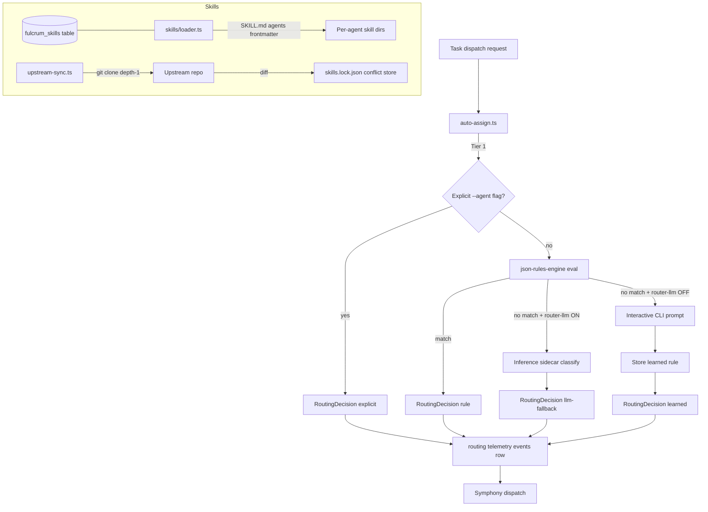
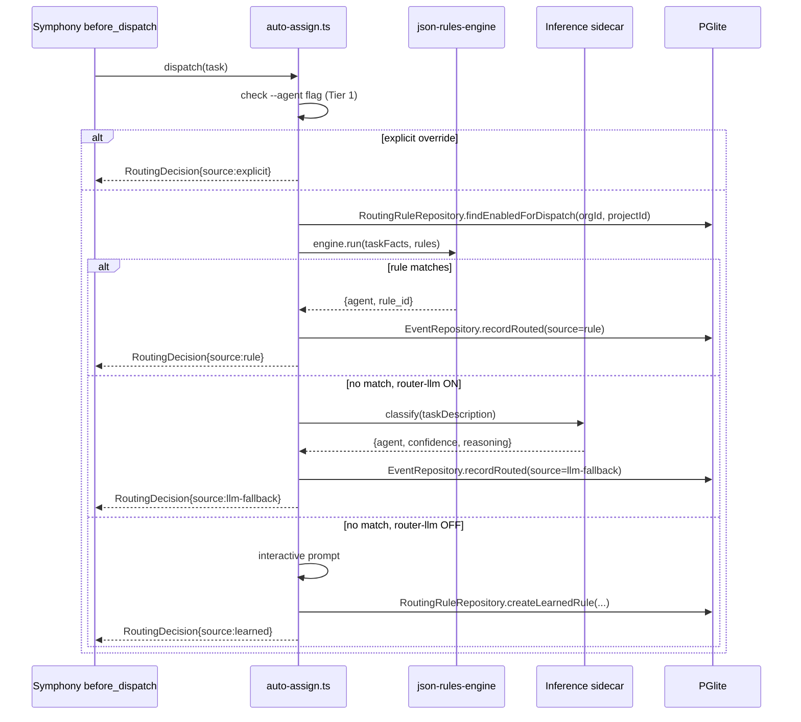

# PRD 5: Auto-Router + Skills Loader

## Status: ready-for-plan-breakdown

## Linkage chain

| Dimension | Detail |
|---|---|
| Vision gaps | V-gap-05: no automatic task-to-agent routing; V-gap-08: no versioned per-agent skill management; V-gap-09: no upstream skill sync |
| Requirements pillar | Pillar 5 — Auto-Router + Skills Loader (`REQUIREMENTS.md §5`) |
| Key decisions | Q19 (all sync local cron only, never remote CI runners); Q22 (composite org_id indexes); C1 (all features ship gated); D5 (flag naming: `router-llm`, `skills-daily-sync`, `skill-marketplace`); A2 (doctor coverage per pillar) |
| External specs | `json-rules-engine@^7` ISC; Symphony `SPEC.md §before_dispatch` hook; SKILL.md frontmatter convention (`mattpocock/skills`) |

## Vision

Three-tier deterministic-first router (explicit override → declarative rules → LLM fallback) dispatches every task to the right agent automatically. Skills are versioned per-agent-folder packages synced from upstream on local cron — no manual housekeeping.

## Out-of-scope

Items here fall strictly into carve-out (1): genuinely not in user's verbatim ask and not in any locked decision; or carve-out (2): owned by another pillar. Per C5, no feature mentioned in user's ask, OPEN-QUESTIONS, research, or DECISIONS may appear here.

- **Remote CI runners / GitHub Actions for any sync job** — locked decision Q6/Q19: all sync is local cron only. Never remote runners.
- **`~/.agents/` shared folder** — locked global rule (`~/.claude/CLAUDE.md`); never used in this project.
- **Owned by Pillar 3 (Symphony / Orchestration):** Orchestration framework internals (Mastra, Symphony outer loop).
- **Owned by Pillar 3 (Symphony / Orchestration):** Agent session management / run lifecycle.
- **Owned by Pillar 6 (Memory / Context):** Semantic memory extraction and embeddings pipeline.
- **LLM-narrated rule explanations** — not in user's verbatim ask, OPEN-QUESTIONS, or any locked decision; excluded until explicitly requested.

---

## Always-on features

| Feature | Path | Notes |
|---|---|---|
| Tier 1: explicit `--agent` override | `src/router/auto-assign.ts` | CLI flag; also accepted via tRPC `routing.dispatch` |
| Tier 2: `json-rules-engine` declarative rules | `src/router/auto-assign.ts` | Synchronous, deterministic; evaluates against task facts object |
| No-match interactive prompt | `src/router/auto-assign.ts` | "No rule matched; pick an agent or write a rule" → answer stored as `learned` rule |
| Routing telemetry (`events` row per decision) | `src/router/telemetry.ts` | `verb='routed'`, payload: `{rule_id|'manual'|'learned', agent, confidence}` |
| Per-agent skill folders | Install-time | `~/.claude/skills/`, `~/.codex/skills/`, etc. — N copies kept in sync |
| `fulcrum component install/uninstall/upgrade` skills support | Existing package manager | Delete-and-recopy on upgrade; multi-target via `SKILL.md` `agents:` frontmatter |
| `RoutingRule` CRUD + test | MikroORM entity + tRPC + CLI + TUI + Web | Full rule lifecycle; rule test dry-runs against a real task |
| `fulcrum_skills` registry entity | MikroORM | Canonical record of installed skills per org |
| Skills attach to routing rules | `routing_rules.action_skill_set` | Skills injected into agent session context bundle when rule fires |
| Skills CRUD + sync conflict viewer | tRPC + CLI + TUI + Web | Full lifecycle; conflict viewer shows diff of upstream vs local |

## Gated features

| Feature | Flag | Default | Notes |
|---|---|---|---|
| LLM-fallback router (Tier 3) | `FULCRUM_FEATURES=router-llm` | OFF | Calls inference sidecar with classifier prompt; structured output `{agent, confidence, reasoning}`; writes `events` row with `llm-fallback` source |
| LLM backend selection | `FULCRUM_FEATURES=router-llm:<backend>` | `embedded` when router-llm ON | Backends: `embedded` (Rust sidecar) / `ollama` / `lm-studio` / `openai-compatible:url:key` |
| Upstream skill auto-merge (daily cron) | `FULCRUM_FEATURES=skills-daily-sync` | OFF | Runs `fulcrum skills sync --fetch-upstream --daily`; conflicts written to lock file; no auto-commit |
| Cross-org skill marketplace | `FULCRUM_FEATURES=skill-marketplace` | OFF | Read/write access to a shared registry: publish a skill to the marketplace (signs SKILL.md with org key), fetch skills published by other orgs, verify signature before install, install to per-agent folders via existing package manager. Surfaces: marketplace browse/search page (Web), `fulcrum skills marketplace fetch/publish/verify` (CLI), marketplace browse panel (TUI). Minimal read-only public endpoint for anonymous browse; write (publish) requires org auth. |

---

## Tech stack

### Stack
- C7: MikroORM v7 owns `RoutingRule`, `FulcrumSkill`, `SkillVersion`, marketplace, and `CasbinPolicy` entities; no hand-authored migration files.
- C7: Casbin uses custom `FulcrumCasbinAdapter` (~200 LOC) over MikroORM repositories; Fulcrum owns `@Entity({ tableName: 'casbin_policies' })`, not node-casbin `casbin_rule`.
- C8: `@Injectable()` router and skills services use needle-di Stage-3 constructor injection across tRPC, CLI, TUI, and SvelteKit.
- C9: entities live under `src/db/entities/router/` and `src/db/entities/skills/`; repositories under matching `src/db/repositories/`; migrations are `src/db/migrations/Migration<timestamp>.ts`.

### Auto-Router

| Layer | Pick | License | Fit % | Rationale |
|---|---|---|---|---|
| Declarative rules engine | `json-rules-engine@^7` (npm) | ISC | 85% | TS-native; declarative JSON facts/conditions; 190+ dependents; 7.3.1 stable; zero native deps |
| LLM call (gated) | Inference sidecar (Pillar 2) via Unix socket JSON-RPC | Apache-2.0 / MIT | — | No external provider required; `embedded` model default; provider-agnostic interface |
| Router module | `src/router/auto-assign.ts` (must-write) | — | — | ~200 LOC; loads DB rules at startup + hot-reloads on rule change via PGlite LISTEN |
| Telemetry | Existing `events` table | — | — | Reuse Q23-backfilled table; no new schema beyond `routing_rules` |

**Failure gate:** malformed `conditions_json` → catch + log + fall through; bad rule auto-disabled.
**Fallback 1:** Mastra `workflow.branch()` — same conditions, inside Pillar 3.
**Fallback 2:** hand-written `if/else` evaluator over same schema (~150 LOC, zero deps).

### Skills Loader

| Layer | Pick | License | Fit % | Rationale |
|---|---|---|---|---|
| Skill format | `SKILL.md` frontmatter (`name`, `agents`, `triggers`, `version`) | MIT | 95% | Matches mattpocock/skills convention; already in repo |
| Upstream fetch | `git clone --depth 1` + diff (`src/skills/upstream-sync.ts`, ~250 LOC) | — | — | Pure local git; no remote CI |
| Conflict store | `~/.fulcrum/skills.lock.json` `[slug].upstream_conflict` | — | — | Human-readable diff for manual resolution |
| Hash verification | sha256 of SKILL.md → `fulcrum_skills.hash_verified` | — | — | Detects tampering on reinstall |
| Per-agent install | `fulcrum component install` (existing) | — | — | Reads `agents:` frontmatter → copies to each dir |
| Cron (gated) | `fulcrum skills sync --daily --install-cron` | — | — | Writes local cron entry; no remote runners |

**Failure gate:** upstream unreachable → warn, preserve local, never block dispatch.
**Fallback 1:** SKILL.md schema breaks → pin `skills.lock.json` version; `doctor` warning.
**Fallback 2:** agent dir missing → auto-create on install with warning.

---

## Schema changes

Migration class `Migration<timestamp>` is generated from MikroORM entity decorator diffs. Hand-authored schema lives in classes, not schema snippets.

```typescript
@Entity({ tableName: 'routing_rules' })
@Index({ name: 'routing_rules_org_priority', properties: ['org', 'priority', 'enabled'] })
@Index({ name: 'routing_rules_org_project', properties: ['org', 'project'] })
class RoutingRule {
  @PrimaryKey({ type: 'uuid' }) id = crypto.randomUUID();
  @ManyToOne(() => Org) org!: Org;
  @ManyToOne(() => Project, { nullable: true }) project?: Project;
  @Property() name!: string;
  @Property({ type: 'json' }) conditionsJson!: RoutingConditions;
  @Property() actionAgent!: string;
  @Property({ type: 'array' }) actionSkillSet: string[] = [];
  @Property({ default: 100 }) priority = 100;
  @Property({ default: true }) enabled = true;
  @Enum(() => RoutingRuleSource) source = RoutingRuleSource.Manual;
}

@Entity({ tableName: 'fulcrum_skills' })
@Unique({ name: 'fulcrum_skills_org_slug', properties: ['org', 'slug'] })
class FulcrumSkill {
  @PrimaryKey({ type: 'uuid' }) id = crypto.randomUUID();
  @ManyToOne(() => Org) org!: Org;
  @Property() name!: string;
  @Property() slug!: string;
  @Enum(() => SkillSource) source!: SkillSource;
  @Property({ nullable: true }) upstreamRepo?: string;
  @Property({ nullable: true }) upstreamRef?: string;
  @Property({ type: 'json' }) enabledAgents: string[] = [];
  @OneToMany(() => SkillVersion, version => version.skill) versions = new Collection<SkillVersion>(this);
}

@Entity({ tableName: 'skill_versions' })
class SkillVersion {
  @PrimaryKey({ type: 'uuid' }) id = crypto.randomUUID();
  @ManyToOne(() => FulcrumSkill) skill!: FulcrumSkill;
  @Property() version!: string;
  @Property({ nullable: true }) hashVerified?: string;
}

@Entity({ tableName: 'casbin_policies' })
class CasbinPolicy {
  @PrimaryKey({ type: 'uuid' }) id = crypto.randomUUID();
  @ManyToOne(() => Org) org!: Org;
  @Property() ptype!: string;
  @Property({ type: 'array' }) values: string[] = [];
}
```

Routing uses `RoutingRuleRepository.findEnabledForDispatch(orgId, projectId)` ordered by priority. First match wins. Routing telemetry writes through `EventRepository.recordRouted(...)`; no new event columns are needed.

---

## Surfaces

### Web

| Route | Features |
|---|---|
| `/settings/routing` | Global routing rules list; create/edit/delete rule; drag-to-reorder priority; rule test panel (paste task JSON → see which rule fires + agent assigned) |
| `/settings/skills` | Skills registry; install from upstream; upgrade; uninstall; upstream diff viewer; conflict resolver; enabled_agents toggle per skill |
| `/projects/<id>/routing` | Project-scoped overrides; inherits global rules below; project rule CRUD |

Rule editor: field selector + operator + value form; OR/AND nesting; raw JSON toggle.

### CLI

```
fulcrum routing rules list [--project <id>] [--json]
fulcrum routing rules create --name <n> --agent <a> --conditions <json> [--project <id>] [--priority <n>]
fulcrum routing rules update <id> [--name] [--agent] [--conditions] [--priority] [--enable|--disable]
fulcrum routing rules delete <id>
fulcrum routing rules test <task-id>          # dry-run: print rule fired + assigned agent
fulcrum routing rules dry-run --task-json <j> # dry-run without a saved task

fulcrum skills list [--json]
fulcrum skills install <slug|upstream-path>
fulcrum skills upgrade [<slug>|--all]
fulcrum skills uninstall <slug>
fulcrum skills sync [--fetch-upstream] [--daily] [--install-cron]
fulcrum skills conflicts list
fulcrum skills conflicts resolve <slug> --keep <local|upstream>
```

All: `--json` output; non-zero exit on error; `--dry-run` where mutating.

### TUI

**Routing Rules:** table (name/agent/scope/priority/source/enabled); `n`/`e`/`d`/`t` keys; test pane (conditions left, task fields right, decision banner).

**Skills:** table (slug/version/source/hash/agents); `s`=sync, `u`=upgrade, `D`=uninstall; conflict panel side-by-side diff; `k`=keep local, `U`=use upstream, `m`=`$EDITOR`.

### API (tRPC procedures)

```
routing.list(input: { orgId, projectId? }) → RoutingRule[]
routing.get(input: { id }) → RoutingRule
routing.create(input: CreateRoutingRuleInput) → RoutingRule
routing.update(input: { id } & Partial<CreateRoutingRuleInput>) → RoutingRule
routing.delete(input: { id }) → void
routing.test(input: { taskId }) → RoutingDecision
routing.dryRun(input: { taskJson }) → RoutingDecision

skills.list(input: { orgId }) → Skill[]
skills.install(input: { slug, source, upstreamRepo?, upstreamRef? }) → Skill
skills.upgrade(input: { slug | 'all' }) → Skill[]
skills.uninstall(input: { slug }) → void
skills.sync(input: { fetchUpstream?: boolean }) → SyncResult
skills.resolveConflict(input: { slug, resolution: 'local'|'upstream' }) → Skill
```

`RoutingDecision`: `{ ruleId, source: 'explicit'|'rule'|'learned'|'llm-fallback'|'manual', agent, confidence, reasoning? }`.

OpenAPI 3.1 REST surface (`@hono/zod-openapi`) gated by `FULCRUM_FEATURES=public-api` — same Zod schemas, auto-generated spec.

---

## Technical design

### Architecture



### Sequence: three-tier routing decision



### Error model

| Code | Description | Propagated to | Recovery |
|---|---|---|---|
| `RULE_EVAL_ERROR` | `json-rules-engine` throws on malformed `conditions_json` | Logged; rule auto-disabled | Fix `conditions_json`; re-enable rule |
| `SIDECAR_UNAVAILABLE` | `router-llm` ON but sidecar unreachable | Logged warning; fallback to prompt | Start inference sidecar; check socket |
| `UNKNOWN_AGENT_IN_RULE` | Rule `action_agent` not in profile registry | Routing warning; next tier tried | Register agent profile or fix rule |
| `SKILL_HASH_MISMATCH` | SKILL.md tampered post-install | Error; `hash_verified=null` | Re-install from upstream |
| `UPSTREAM_UNREACHABLE` | `git clone` fails during sync | Warning logged; local preserved | Check network; retry sync |
| `FRONTMATTER_PARSE_ERROR` | Bad YAML in SKILL.md | Skip that skill; continue installs | Fix SKILL.md YAML |

### Observability

| Signal | Name | Fields |
|---|---|---|
| OTel span | `fulcrum.router.dispatch` | `rule_id`, `source`, `agent`, `confidence`, `task_id` |
| OTel span | `fulcrum.router.ruleEval` | `rule_count`, `match_found`, `duration_ms` |
| OTel span | `fulcrum.skills.sync` | `skill_count`, `conflicts_found`, `upstream_reachable` |
| Log event | `router.rule.disabled` | `rule_id`, `reason` |
| Log event | `skills.conflict.detected` | `slug`, `upstream_ref` |

### Performance budgets

| Operation | p50 | p95 |
|---|---|---|
| `auto-assign` Tier-2 rule eval (20 rules) | <5 ms | <20 ms |
| LLM fallback sidecar call (gated) | <500 ms | <2 s |
| Skills `loader.install` (single SKILL.md) | <100 ms | <300 ms |
| PGlite LISTEN hot-reload pick-up | <50 ms | <200 ms |
| `routing.test` dry-run tRPC | <30 ms | <100 ms |

## Doctor integration

Subsystem: `router`

```typescript
const DoctorRouterCheck = z.object({
  subsystem: z.literal('router'),
  checks: z.array(z.object({
    id: z.string(),
    status: z.enum(['pass', 'warn', 'fail']),
    message: z.string(),
    durationMs: z.number().optional(),
    metadata: z.record(z.unknown()).optional(),
  })),
  ok: z.boolean(),
});
```

| Check ID | What it verifies | Failure recovery |
|---|---|---|
| `router.routing-rules.entity` | `RoutingRule` repository resolves and can read rules | Run migration class `Migration<timestamp>` covering router entities; check DB file |
| `router.skills.entity` | `FulcrumSkill` repository resolves | Run migration class `Migration<timestamp>` covering skills entities |
| `router.skills.conflicts.count` | Count of unresolved upstream conflicts | `fulcrum skills conflicts resolve` or accept upstream |
| `router.llm-flag.sidecar` | If `router-llm` ON: sidecar Unix socket reachable | Start inference sidecar (Pillar 2) |
| `router.default-rules.present` | At least one enabled `routing_rules` row per org | Create at least one rule via UI or CLI |
| `router.skill-dirs.writable` | Per-agent skill directories writable | Check `~/.claude/skills/`, `~/.codex/skills/`, etc. |
| `router.json-rules-engine.installed` | `json-rules-engine` importable | `bun add json-rules-engine@^7` |

## Dependencies

| Dep | Direction | Notes |
|---|---|---|
| **Pillar 1 — Foundation** | Required | `orgs`, `projects`, `tasks`, `events` tables; PGlite file-backed; graphile-worker queue; tRPC server; auth bootstrap |
| **Pillar 2 — Inference sidecar** | Required for gated Tier 3 | Unix socket JSON-RPC; `router-llm` flag OFF = sidecar not needed at all |
| **Pillar 3 — Symphony / Orchestration** | Hooks into | `src/router/auto-assign.ts` called from Symphony `before_dispatch` hook; `RoutingDecision` passed as metadata into agent run context |
| **Pillar 6 — Memory / Context** | Provides `action_skill_set` to context assembler | `routing_rules.action_skill_set` informs `src/context/assemble.ts` which SKILL.md files to inject |
| `json-rules-engine@^7` | Runtime | ISC; TS-native; no native deps |
| `fulcrum component install` | Runtime | Existing package manager extended to handle skill installs |

---

## Issues breakdown (TDD numbered)

Red-green-refactor: failing test first, then implementation, then lint pass.

### Router subsystem

**R-01** Entity + migration class: `RoutingRule` + decorator indexes + `events` payload `source`/`rule_id` fields. Verify idempotency + enum constraint.

**R-02** `src/router/rules-engine.ts` — `json-rules-engine` wrapper. Condition match returns agent; no match returns null; malformed `conditions_json` caught, returns null, marks rule disabled.

**R-03** `src/router/auto-assign.ts` — Tier 1 + Tier 2. Explicit `--agent` wins; rule match returns agent; no match + flag OFF returns null.

**R-04** Interactive no-match prompt + learned rule. Prompt fires on Tier 2 null + flag OFF; answer stored as `source='learned'`; next identical task resolves via Tier 2 without prompt.

**R-05** Routing telemetry. Every dispatch writes one `events` row; `source` + `rule_id` correct; `dryRun` writes zero rows.

**R-06** tRPC `routing.*` (list/get/create/update/delete/test/dryRun). Full CRUD round-trip; `test` returns correct `RoutingDecision`.

**R-07** CLI `fulcrum routing rules *`. `list --json` matches tRPC schema; `test <id>` prints agent; `create` round-trips.

**R-08** TUI Routing Rules screen. Table renders; `n`/`e`/`d`/`t` keys fire correct actions; test pane shows decision.

**R-09** Web `/settings/routing` + `/projects/<id>/routing`. Rule list + CRUD; Zod validates `conditions_json`; project scope filters correctly.

**R-10** LLM fallback Tier 3 (`FULCRUM_FEATURES=router-llm`). Flag ON + sidecar mock → structured output + `source='llm-fallback'` event. Flag OFF → no sidecar call.

**R-11** PGlite LISTEN hot-reload. New rule inserted via tRPC picked up by next `auto-assign` call in same process without restart.

### Skills subsystem

**S-01** Entity + migration class: `FulcrumSkill` + `SkillVersion` + unique `(org_id, slug)` decorator. Idempotent; duplicate slug rejected.

**S-02** `src/skills/loader.ts`. `agents: [claude, codex]` copies to 2 dirs; `agents: [*]` copies to all 5; missing agent dir emits warning, continues.

**S-03** `src/skills/upstream-sync.ts` — `--fetch-upstream`. Mock upstream: clean skill auto-merges; locally-edited skill writes conflict to `skills.lock.json`.

**S-04** Hash verification. Install writes `hash_verified`; same content = no-op; tampered content = error + cleared hash.

**S-05** `src/skills/conflict-resolver.ts`. `keep upstream` overwrites dirs + updates hash; `keep local` clears `upstream_conflict`; lock file valid JSON after both paths.

**S-06** tRPC `skills.*`. install → list → upgrade → resolveConflict → uninstall; each step verified in DB and on-disk.

**S-07** CLI `fulcrum skills *`. `list --json` matches tRPC; `sync --fetch-upstream` runs sync; `conflicts resolve --keep upstream` clears conflict.

**S-08** TUI Skills screen. Table; `s` = sync; conflict panel diff; `k`/`U` resolve; uninstall clears DB + agent dirs.

**S-09** Web `/settings/skills`. List; install form; upgrade; side-by-side diff viewer; resolve buttons call tRPC.

**S-10** `action_skill_set` → context assembler. Rule with `['tdd','caveman']` → SKILL.md content injected into bundle; missing slug = warning, not error.

**S-11** `--install-cron` (`FULCRUM_FEATURES=skills-daily-sync`). Writes idempotent cron entry; absent when flag OFF.

### Skill marketplace subsystem (`FULCRUM_FEATURES=skill-marketplace`)

**M-01** Entities: `MarketplaceListing` + `OrgMarketplaceKey` with decorator unique `(slug, version)` and publisher index. Migration class generated from entity diff.

**M-02** `src/skills/marketplace-client.ts` — fetch skill listing from shared registry endpoint; verify Ed25519 signature against publisher org's public key; reject on bad sig or missing key.

**M-03** `src/skills/marketplace-publisher.ts` — sign SKILL.md with org private key; POST to registry; version conflict → error (no overwrite of published version).

**M-04** tRPC `skills.marketplace.*` — `browse({ query?, tags? })`, `fetch({ slug, version? })`, `publish({ slug })`, `verify({ slug, version })`, `install({ slug, version? })`. Flag-off guard: all procedures throw `FeatureDisabledError` when `skill-marketplace` OFF.

**M-05** CLI `fulcrum skills marketplace browse | fetch <slug> | publish <slug> | verify <slug>`. All `--json`. Non-zero exit on sig verification fail.

**M-06** TUI marketplace panel — browse list (slug/version/publisher/stars), `Enter` detail, `i` install, `p` publish overlay.

**M-07** Web `/settings/skills/marketplace` — browse grid, search, publisher filter, install button, publish form (select local skill, sign, upload).

**M-08** Org key management — `org_marketplace_keys(org_id, public_key, created_at, revoked_at)`. `fulcrum marketplace keygen` generates Ed25519 keypair, stores private key in local keyring, publishes public key to registry.

### Cross-cutting

**X-01** `fulcrum doctor`. Reports: missing `routing_rules` table; pending conflicts count; `router-llm` state + sidecar reachability.

**X-02** OpenAPI 3.1 for `routing.*` + `skills.*` (`FULCRUM_FEATURES=public-api`). Spec generated; auth enforced; 401 on missing token.

---

## Failure gates

| Gate | Trigger | Response |
|---|---|---|
| `json-rules-engine` throws on rule evaluation | Malformed `conditions_json` | Catch + log; mark rule `enabled=false`; fall through to next tier |
| No rule match + `router-llm` OFF | Tier 2 miss, flag off | Interactive CLI prompt; learned rule stored; never blocks task |
| Inference sidecar unreachable (`router-llm` ON) | Health check fails | Log warning; fall back to interactive prompt; do not fail task dispatch |
| Upstream skills repo unreachable | Network error on sync | Log warning; preserve local version; do not block task dispatch |
| SKILL.md frontmatter parse error | Bad YAML | Log error; skip that skill; continue remaining installs |
| Agent skill dir missing | Path absent | Create dir with warning; log which agent dir was auto-created |
| `conditions_json` operator unknown to json-rules-engine | Rule author typo | Validation error on `routing.create` / `routing.update` tRPC call; blocked at write time |
| Skills hash mismatch on reinstall | File tampered post-install | Error + `hash_verified=null`; prompt user to re-install from upstream |

---

## Acceptance criteria

All criteria verified on all three surfaces unless marked otherwise.

**Router — always-on (all surfaces)**
- [ ] `--agent codex` override wins regardless of matching rules.
- [ ] Rule `{ "task.kind": "bug" }` matches bug task; lower priority fires first; project-scoped beats global at equal priority.
- [ ] No match + `router-llm` OFF → prompt fires; answer stored as `source='learned'`; next identical task skips prompt.
- [ ] Every dispatch writes exactly one `events` row; `dryRun` writes zero.
- [ ] Rule CRUD round-trips on Web form, `--json` CLI, TUI inline form. Malformed `conditions_json` rejected at write time.

**Router — gated (`router-llm`)**
- [ ] Flag ON + sidecar mock → `source='llm-fallback'` event + `confidence` non-null.
- [ ] Flag OFF → sidecar never called; prompt path used.

**Skills — always-on**
- [ ] `install tdd` → SKILL.md in each `agents:` dir; `hash_verified` set.
- [ ] `upgrade tdd` → auto-merge if clean; conflict in lock file if locally edited.
- [ ] `conflicts resolve tdd --keep upstream` → dirs overwritten, conflict key cleared.
- [ ] `uninstall tdd` → dirs + DB row removed; `agents: [claude]` only touches `~/.claude/skills/`.
- [ ] `action_skill_set: ['tdd']` → SKILL.md content injected into context bundle.
- [ ] list/install/upgrade/uninstall/sync/resolveConflict return identical data across CLI `--json`, Web API, TUI (parity).

**Skills — gated (`skills-daily-sync`)**
- [ ] `--install-cron` writes idempotent cron entry; absent when flag OFF.

**Cross-surface parity matrix**

| Operation | Web | CLI `--json` | TUI |
|---|---|---|---|
| List rules | renders | JSON array | renders |
| Create rule | form + save | `rules create` | `n` + inline form |
| Test rule | test panel | `rules test <id>` | `t` + pane |
| List skills | renders | JSON array | renders |
| Sync upstream | button | `sync --fetch-upstream` | `s` key |
| Resolve conflict | diff + buttons | `conflicts resolve` | `k`/`U` keys |

**`fulcrum doctor`**
- [ ] Missing `routing_rules` table reported; pending conflicts count shown; `router-llm` state + sidecar reachability shown; exit-0 on clean install.
