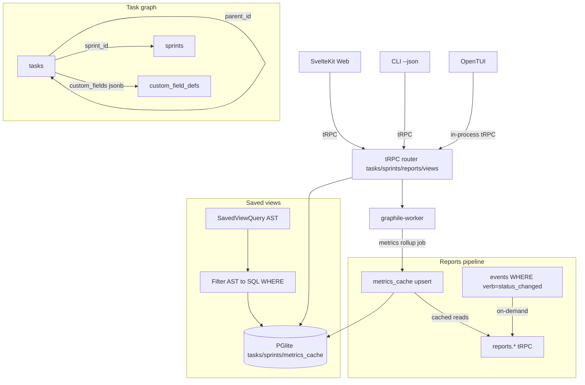
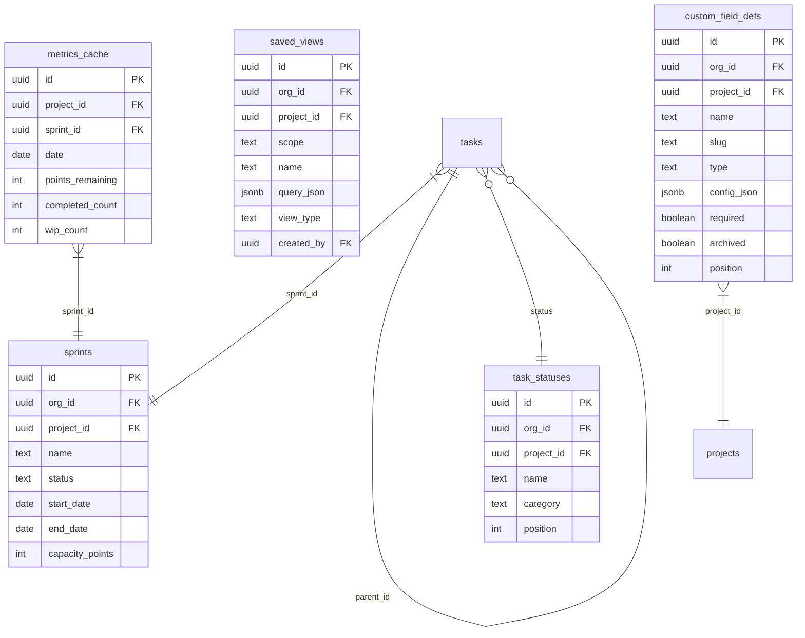

# PRD 6: Tasks + Scrum + Sprints + Burndown + Custom Fields + Saved Views

## Status: ready-for-plan-breakdown

## Linkage chain

| Dimension | Detail |
|---|---|
| Vision gaps | V-gap-10: no sprint planning or scrum board; V-gap-11: no burndown/velocity reporting; V-gap-12: no custom fields; V-gap-13: no saved/shareable views |
| Requirements pillar | Pillar 6 — Tasks + Scrum + Sprints (`REQUIREMENTS.md §6`) |
| Key decisions | Q7 (at-most-one active sprint per project); Q8 (burndown both on-demand and cached); Q9 (custom fields full engine); Q10 (saved views DB-persisted + shareable); Q22 (composite org_id indexes on all tables); Q23 (events.org_id backfill in Pillar 1); A2 (doctor coverage per pillar) |
| External specs | `svelte-dnd-action` MIT; `TanStack Table v8` MIT; `LayerChart` MIT; `svelte-gantt` MIT; graphile-worker rollup job docs |

---

## Vision

Jira/Linear-class task management. User verbatim: "interactive monitoring on kanban/scrum boards for dev cycles, burndown charts and reporting per project." Full parity: task detail, subtask trees, blocks/blocked-by, sprint planning, active sprint kanban, burndown + velocity + cycle-time, configurable statuses, custom fields, saved views (kanban/table/calendar/timeline/list) persisted + shareable. Web + CLI + TUI full parity — no surface MVP or phase 2 (C4, C1).

---

## Out-of-scope

Items here fall strictly into carve-out (1): genuinely not in user's verbatim ask and not in any locked decision; or carve-out (2): owned by another pillar. Per C5, no feature mentioned in user's ask, OPEN-QUESTIONS, research, or DECISIONS may appear here.

- **AI auto-labelling / auto-triage** — Q5b explicitly removed: not user-requested. Excluded until the user asks for it.
- **Owned by Pillar 9 (Notifications):** Email / webhook notifications triggered by task events. This pillar emits `events` rows (watchers, mentions, status changes); Pillar 9 owns fan-out to email/webhook/Slack channels.
- **Time tracking (hours logged)** — not in user's verbatim ask and not in any locked decision; considered and excluded.

---

## Always-on features

Ships unconditionally, all surfaces.

### Task primitive (full Jira/Linear parity)

**Detail page** — modal (board card click) + full-page route (`/projects/<id>/tasks/<task_id>`):
- Description: TipTap block editor (Pillar 4), slash commands, wikilinks, autosave.
- Parent/subtask: `tasks.parent_id` adjacency, infinite nesting, breadcrumb header.
- Dependencies: `tasks.dependencies jsonb` blocks/blocked-by; blocked badge on card; inline resolution.
- Assignees: multi-assign users OR agent identities.
- Core fields: due date, estimate (points), priority (urgent/high/medium/low/none), labels, sprint, repo link, custom fields.
- Watchers + mentions (events emitted → Pillar 9 consumes).
- Attachments: artifact rows via `edges(from_kind='artifact', to_kind='task')`.
- Comments: threaded, markdown, reactions, editable/deletable by author.
- Activity feed: append-only events log (status changes, field edits, comments, sprint moves, linked runs).
- Keyboard: `e` title, `a` assign, `s` status, `p` priority, `l` label, `d` due date, `[`/`]` prev/next task.

**Statuses** — configurable per project:
- Default template: `backlog → todo → in_progress → in_review → blocked → done → cancelled`.
- Settings → Statuses: add/rename/reorder/delete/color. Each status carries `category` enum (`unstarted|started|completed|cancelled`) driving burndown logic. At least one `completed` + one `unstarted` required.

**Bulk operations** — shift+click / cmd+click multi-select across board, table, list:
- Actions: assign, status, sprint, label, priority, delete (soft). Floating action bar ≥2 selected. shadcn-svelte Command dispatches bulk commands.

**View types** — five per project, each a `saved_views` row (scope `project` default):
1. **Kanban** — status columns; swimlanes (assignee/epic/priority); `svelte-dnd-action`.
2. **Table** — TanStack Table v8; sort/filter/group any field + custom fields; column visibility; inline edit.
3. **Calendar** — tasks on date grid by due_date; drag-to-reschedule.
4. **Timeline / Gantt** — horizontal timeline by start/end; dependency arrows; `svelte-gantt`.
5. **List** — TanStack Virtual; click opens detail.

---

### Sprints / scrum (Q7)

`sprints` — at-most-one active per project (partial unique index enforces). 

**Sprint planning board:** backlog (all unsprinted tasks) left | sprint right. `svelte-dnd-action` cross-container drag. Capacity bar = `sum(points)` vs `sprints.capacity_points`; over-capacity warning. Backlog filter by priority/assignee/label.

**Active sprint board:** Kanban scoped to `sprint_id = active_sprint.id`. Header: goal, dates, capacity bar, days remaining. Quick-add inline per column.

**Sprint close:** modal to disposition unfinished tasks (next sprint or backlog, per task). Auto-creates `doc_type='postmortem'` retrospective doc (Pillar 7 dependency; if not shipped: emit `sprint.closed` event, Pillar 7 adds listener). Records final metrics snapshot to `metrics_cache`.

---

### Burndown / velocity / cycle-time (Q8 — both on-demand and cached)

**On-demand** — `events WHERE subject_kind='task' AND verb='status_changed'` + JOIN tasks. Used for drill-down tooltips, cycle-time detail, retro deep-dive.

**Cached** — `graphile-worker` rollup job writes `metrics_cache`. Trigger: status_changed event for (project, sprint) past last_rollup_cursor → enqueue job (deduped). Job upserts day row. Dashboard tiles read cache only.

**Reports (all shipped):** burndown (points remaining vs ideal, LayerChart area+line), velocity (3-sprint committed vs completed bar), cycle-time (histogram `in_progress→done`), throughput (tasks/wk 12wk), WIP (`started` count + 7d sparkline), cumulative-flow (stacked area per status category). Routes: `/projects/<id>/reports`, CLI `--json`, TUI ASCII via `asciichart`.

---

### Custom fields engine (Q9 — full engine)

Types: `text | select | multi_select | number | date | user | url | json`. Config JSON per type: select/multi_select `{options:[{value,label,color}]}`; number `{unit,decimals,min,max}`; date `{include_time}`; user `{multi}`; url `{display_as:'link'|'embed'}`.

Defaults seeded at project create: `status, priority, assignee, due_date, estimate, parent, tags, repo, sprint`.

Settings → Fields tab: add/reorder/archive. Archived: hidden in UI, values preserved in `tasks.custom_fields jsonb`. Detail page: fields rendered in `position` order; required fields block save. Custom fields filterable/sortable in all five views + saved-view AST.

---

### Saved views (Q10 — DB-persisted, shareable)

`saved_views` scopes: `private | project | org`. Typed AST is canonical for both URL params (transient) and DB rows (named):

```typescript
type SavedViewQuery = {
  filters: Array<{ field: string; op: 'eq'|'neq'|'in'|'nin'|'gt'|'lt'|'contains'|'is_empty'|'is_not_empty'; value: unknown }>;
  text: string;   // FTS fragment
  facets: { kind?:string[]; status?:string[]; priority?:string[]; assignee?:string[]; sprint?:string[]; label?:string[]; repo?:string[] };
};
```

Q27 (search) reuses same AST; `kind` field discriminates task/doc/memory/artifact. Filter builder: shadcn-svelte Command palette composes chips; "Save as view" serializes state + view type to `saved_views`.

---

## Gated features

All shipped + tested; OFF by default; flip individual flag to enable.

| Feature | Gate flag | What it does |
|---|---|---|
| Real-time multi-cursor editing of task descriptions | `FULCRUM_FEATURES=real-time-collab-server` | Yjs CRDT binding on the task description TipTap field; in-process Hocuspocus server manages document rooms; collab cursor (name + colour) shown to concurrent editors. Cross-ref Pillar 5 (docs editor) — same flag gates Hocuspocus server lifecycle for both docs and tasks. |
| Jira connector (one-way pull) | `FULCRUM_FEATURES=connector-jira` | ETL pipeline scaffolding + Jira REST adapter. Imports issues into `tasks` with `external_id='jira:<issue_key>'`. Bi-directional sync gated behind `connector-jira-bidirectional`. |
| Linear connector (one-way pull) | `FULCRUM_FEATURES=connector-linear` | Linear GraphQL adapter. Imports issues into `tasks` with `external_id='linear:<uuid>'`. Schema already accepts `external_id` column. Bi-directional behind `connector-linear-bidirectional`. |
| GitHub Issues connector (one-way pull) | `FULCRUM_FEATURES=connector-github-issues` | GitHub REST API adapter. Imports issues + labels + milestones into tasks + sprints. Bi-directional behind `connector-github-issues-bidirectional`. |
| LLM-narrated sprint summary | `FULCRUM_FEATURES=report-llm-narration` | On sprint close: inference sidecar generates a 3-paragraph narrative from sprint metrics + completed task titles. Appended to the auto-created retrospective doc. Backend: `embedded` sidecar by default; overridable via `report-llm-narration:<backend>` (same backend syntax as `router-llm`). |
| Embeddings-powered task search | `FULCRUM_FEATURES=embeddings` | Task title + description embedded via inference sidecar; hybrid FTS + cosine similarity for search-in-view filter. |
| ABAC policies for field/view permissions | `FULCRUM_FEATURES=casbin-policies` | node-casbin rules gate which org roles can create/edit/delete custom fields and share saved views to org scope. |
| Public REST/OpenAPI for tasks + sprints | `FULCRUM_FEATURES=public-api` | Exposes `GET/POST/PATCH/DELETE /api/v1/tasks`, `/api/v1/sprints`, `/api/v1/reports/{kind}` via `@hono/zod-openapi`. |

---

## Stack

ORM/DB: MikroORM v7 (`@mikro-orm/core` + `mikro-orm-pglite` local, `@mikro-orm/postgresql` SaaS). Entities: `src/db/entities/tasks/`. Repositories: `src/db/repositories/tasks/`. Migrations auto-generated by `mikro-orm migration:create` at `src/db/migrations/Migration<timestamp>.ts`. DI via `needle-di` `@Injectable()`. Burndown rollup job (`graphile-worker` side) calls `metricsCacheRepo.upsert(...)` — no raw SQL. See C7, C8, C9 in DECISIONS.md.

## Tech stack

| Layer | Pick | License | Failure gate | 2nd | 3rd |
|---|---|---|---|---|---|
| Kanban DnD | `svelte-dnd-action` | MIT | Svelte 5 runes breaks `onconsider`/`onfinalize`; >500 cards perf | `pragmatic-drag-and-drop` (Apache-2.0) | `SortableJS` (MIT) |
| Gantt/Timeline | `svelte-gantt` | MIT | <618 stars → abandoned; no keyboard a11y; >6mo scroll perf | `vis-timeline` (Apache/MIT) | `SVAR Svelte Gantt` MIT |
| Charts | `LayerChart` | MIT | CFD chart missing + d3 compose >3 days; SSR breaks | `Chart.js` (MIT, 67k stars) | `Apache ECharts` (Apache-2.0) |
| Table/Backlog | `TanStack Table v8` + `TanStack Virtual` | MIT | v9 breaks v8 workarounds; Virtual bug #866 blank lists | `AG Grid Community` (MIT) | `@humanspeak/svelte-virtual-list` (MIT) |
| Filter AST | Hand-rolled `src/filters/ast.ts` | — | N/A — owned | — | — |
| Command palette / bulk | `shadcn-svelte Command` (Bits UI) | MIT | Bits UI breaking change; >1000 items lag | `ninja-keys` (MIT) | Headless Svelte `use:` + Bits UI combobox |
| Sprint retro doc | Pillar 7 doc-create API | — | Pillar 7 not shipped → emit event only; Pillar 7 adds listener | — | — |

---

## Schema changes

All schema artifacts are MikroORM v7 `@Entity` classes (C6, C7, C9). Composite `(org_id,…)` indexes on all entities (Q22 mandate). Migrations auto-generated by `mikro-orm migration:create`. No `.sql` files.

### `Sprint` entity (new — `src/db/entities/tasks/Sprint.ts`)

```typescript
@Entity()
export class Sprint {
  @PrimaryKey({ type: 'uuid', defaultRaw: 'gen_random_uuid()' }) id!: string;
  @ManyToOne(() => Org) org!: Org;
  @ManyToOne(() => Project) project!: Project;
  @Property({ type: 'string' }) name!: string;
  @Property({ type: 'string', nullable: true }) goal?: string;
  @Property({ type: 'date' }) startDate!: Date;
  @Property({ type: 'date' }) endDate!: Date;
  @Property({ type: 'string', default: 'planned',
    check: `status IN ('planned','active','completed')` })
  status: string = 'planned';
  @Property({ type: 'integer', nullable: true }) capacityPoints?: number;
  @Property({ type: 'date', defaultRaw: 'now()' }) createdAt: Date = new Date();
}
```

Indexes: `sprints_org_project_status (org_id, project_id, status)`; unique partial `sprints_one_active_per_project (project_id) WHERE status = 'active'`.

### `CustomFieldDef` entity (new — `src/db/entities/tasks/CustomFieldDef.ts`)

```typescript
@Entity()
export class CustomFieldDef {
  @PrimaryKey({ type: 'uuid', defaultRaw: 'gen_random_uuid()' }) id!: string;
  @ManyToOne(() => Org) org!: Org;
  @ManyToOne(() => Project) project!: Project;
  @Property({ type: 'string' }) name!: string;
  @Property({ type: 'string' }) slug!: string;
  @Property({ type: 'string',
    check: `type IN ('text','select','multi_select','number','date','user','url','json')` })
  type!: string;
  @Property({ type: 'json', default: {} }) configJson: Record<string, unknown> = {};
  @Property({ type: 'boolean', default: false }) required: boolean = false;
  @Property({ type: 'boolean', default: false }) archived: boolean = false;
  @Property({ type: 'integer', default: 0 }) position: number = 0;
}
```

Unique: `(project_id, slug)`. Index: `custom_field_defs_org_project (org_id, project_id)`.

### `SavedView` entity (new — `src/db/entities/tasks/SavedView.ts`)

```typescript
@Entity()
export class SavedView {
  @PrimaryKey({ type: 'uuid', defaultRaw: 'gen_random_uuid()' }) id!: string;
  @ManyToOne(() => Org) org!: Org;
  @ManyToOne(() => Project, { nullable: true }) project?: Project;
  @Property({ type: 'string', default: 'private',
    check: `scope IN ('private','project','org')` })
  scope: string = 'private';
  @Property({ type: 'string' }) name!: string;
  @Property({ type: 'json', default: {} }) queryJson: Record<string, unknown> = {};
  @Property({ type: 'json', default: [] }) orderBy: unknown[] = [];
  @Property({ type: 'string', default: 'list',
    check: `view_type IN ('kanban','table','calendar','timeline','list')` })
  viewType: string = 'list';
  @ManyToOne(() => User) createdBy!: User;
  @Property({ type: 'array', default: [] }) sharedWithUsers: string[] = [];
  @Property({ type: 'array', default: [] }) sharedWithTeams: string[] = [];
  @Property({ type: 'string', nullable: true }) defaultFor?: string;
  @Property({ type: 'date', defaultRaw: 'now()' }) createdAt: Date = new Date();
  @Property({ type: 'date', defaultRaw: 'now()', onUpdate: () => new Date() }) updatedAt: Date = new Date();
}
```

Indexes: `saved_views_org_project (org_id, project_id)`; `saved_views_created_by (created_by)`.

### `MetricsCache` entity (new — `src/db/entities/tasks/MetricsCache.ts`)

```typescript
@Entity()
export class MetricsCache {
  @PrimaryKey({ type: 'uuid', defaultRaw: 'gen_random_uuid()' }) id!: string;
  @ManyToOne(() => Project) project!: Project;
  @ManyToOne(() => Sprint, { nullable: true }) sprint?: Sprint;
  @Property({ type: 'date' }) date!: Date;
  @Property({ type: 'integer', default: 0 }) startedCount: number = 0;
  @Property({ type: 'integer', default: 0 }) completedCount: number = 0;
  @Property({ type: 'integer', default: 0 }) blockedCount: number = 0;
  @Property({ type: 'integer', default: 0 }) pointsCompleted: number = 0;
  @Property({ type: 'integer', default: 0 }) pointsRemaining: number = 0;
  @Property({ type: 'integer', default: 0 }) wipCount: number = 0;
  @Property({ type: 'date', defaultRaw: 'now()', onUpdate: () => new Date() }) updatedAt: Date = new Date();
}
```

Unique: `(project_id, sprint_id, date)`. Index: `metrics_cache_project_sprint_date (project_id, sprint_id, date)`.

### `TaskStatus` entity (new — `src/db/entities/tasks/TaskStatus.ts`)

```typescript
@Entity()
export class TaskStatus {
  @PrimaryKey({ type: 'uuid', defaultRaw: 'gen_random_uuid()' }) id!: string;
  @ManyToOne(() => Org) org!: Org;
  @ManyToOne(() => Project) project!: Project;
  @Property({ type: 'string' }) name!: string;
  @Property({ type: 'string', default: '#6B7280' }) color: string = '#6B7280';
  @Property({ type: 'string',
    check: `category IN ('unstarted','started','completed','cancelled')` })
  category!: string;
  @Property({ type: 'integer', default: 0 }) position: number = 0;
  @Property({ type: 'boolean', default: false }) isDefault: boolean = false;
}
```

Unique: `(project_id, name)`. Index: `task_statuses_org_project (org_id, project_id)`.

### `Task` entity — additive properties

```typescript
// src/db/entities/tasks/Task.ts  (additive properties)
@ManyToOne(() => Sprint, { nullable: true }) sprint?: Sprint;
@Property({ type: 'json', default: {} }) customFields: Record<string, unknown> = {};
@Property({ type: 'integer', nullable: true }) points?: number;
@ManyToOne(() => Task, { nullable: true }) parent?: Task;
@Property({ type: 'json', default: { blocks: [], blocked_by: [] } })
dependencies: { blocks: string[]; blocked_by: string[] } = { blocks: [], blocked_by: [] };
@Property({ type: 'string', nullable: true }) externalId?: string;  // 'jira:<key>' | 'linear:<uuid>' | 'github:<number>'
```

Indexes: `tasks_org_sprint_status (org_id, sprint_id, status)`; `tasks_org_parent (org_id, parent_id)`; GIN `tasks_custom_fields_gin` on `custom_fields`; unique partial `tasks_org_external_id (org_id, external_id) WHERE external_id IS NOT NULL`.

Repositories: `src/db/repositories/tasks/{Sprint,CustomFieldDef,SavedView,MetricsCache,TaskStatus}Repository.ts`.

`events.org_id` backfill in Pillar 1 (Q23). No new events columns here; this pillar only emits events.

---

## Surfaces

### Web (SvelteKit routes)

`/projects/<id>/board` — Kanban (status columns, sprint filter header)  
`/projects/<id>/backlog` — TanStack Table + sprint planning side panel  
`/projects/<id>/sprints` — sprint list (planned/active/completed, velocity sparklines)  
`/projects/<id>/sprint/<sprint_id>` — active sprint Kanban  
`/projects/<id>/tasks/<task_id>` — task full-page detail  
`/projects/<id>/reports` — reports hub (burndown/velocity/cycle-time/throughput/WIP/CFD)  
`/projects/<id>/settings/fields` — custom field CRUD  
`/projects/<id>/settings/statuses` — status config  
`/projects/<id>/settings/views` — saved views management  

Task detail modal: router modal pattern — URL updates to `/projects/<id>/tasks/<id>`, background view preserved.

### CLI (auto-codegenned from tRPC, `--json` every command)

```
fulcrum tasks  list|get|create|update|delete|bulk|deps|comment  --project <id> [flags]
fulcrum sprints list|get|create|start|close                      --project <id> [flags]
  # close: [--unfinished-to-backlog | --unfinished-to-next]
fulcrum reports burndown|velocity|cycletime|throughput           --project <id> --sprint <id> [--json]
fulcrum views  list|get|create|delete                            --project <id> [--query-json]
fulcrum fields list|create|update                                --project <id> [--type] [--config-json]
```

### TUI (OpenTUI, Bun-native)

All panels consume tRPC in-process (no HTTP hop).

- **Tasks** — list rows; `b` ASCII board; `Enter` detail pane; `c` create inline.
- **Board** — ASCII kanban columns; `h`/`l` move status; `Enter` detail.
- **Sprints** — list; `p` planning split (backlog|sprint); `m` move task to sprint.
- **Active sprint** — board pane scoped to active sprint; capacity bar header.
- **Reports** — burndown/velocity/cycle-time/throughput ASCII charts via `asciichart`.
- **Fields/Views** — CRUD list for `custom_field_defs` + `saved_views`.

### API (tRPC always-on + gated OpenAPI)

tRPC namespaces: `tasks.*` (list/get/create/update/delete/bulkUpdate/addComment/listComments/addWatcher/setDependencies), `sprints.*` (list/get/create/start/close/addTask/removeTask), `reports.*` (burndown/velocity/cycleTime/throughput/wip/cumulativeFlow), `customFields.*` (list/create/update/archive/reorder), `savedViews.*` (list/get/create/update/delete/setDefault), `taskStatuses.*` (list/create/update/delete/reorder).

`FULCRUM_FEATURES=public-api` → each procedure gets `GET/POST/PATCH/DELETE /api/v1/…` via `@hono/zod-openapi`.

---

## Technical design

### Architecture



### Sequence: sprint close + metrics rollup

```mermaid
sequenceDiagram
    participant WEB as Web UI
    participant TR as tRPC sprints.close
    participant DB as PGlite
    participant GW as graphile-worker
    participant MJ as metrics-rollup job
    participant P7 as Pillar 7 docs.create

    WEB->>TR: sprints.close({sprintId, unfinishedDisposition})
    TR->>DB: sprintRepo.assign(sprint, { status:'completed' }); em.flush()
    TR->>DB: taskRepo.nativeUpdate({ sprint, status:{ $ne:'done' } }, { sprint: null })
    TR->>DB: eventsRepo.create({ verb:'sprint.closed' }); em.flush()
    TR->>GW: enqueue metrics-rollup(projectId, sprintId)
    TR->>P7: docs.create({docType:'postmortem', sprint_id})
    P7-->>TR: {docId}
    TR-->>WEB: {sprint, retroDocId}
    GW->>MJ: execute metrics-rollup
    MJ->>DB: eventsRepo.find({ subjectKind:'task', verb:'status_changed' })
    MJ->>DB: metricsCacheRepo.upsert({ projectId, sprintId, date, pointsRemaining, ... })
```

### ER diagram



### Error model

| Code | Description | Propagated to | Recovery |
|---|---|---|---|
| `SPRINT_ALREADY_ACTIVE` | `sprints.start` when another active sprint exists | tRPC 400 | Close active sprint first |
| `CIRCULAR_DEPENDENCY` | `tasks.setDependencies` creates cycle | tRPC 400 | Fix dependency chain |
| `CUSTOM_FIELD_REQUIRED` | Required field missing on `tasks.update` | tRPC 400 + Web inline error | Provide required field value |
| `ROLLUP_JOB_FAILED` | graphile-worker metrics rollup throws | job retry; `events(verb=rollup.failed)` | On-demand reports still work; check logs |
| `FILTER_AST_INVALID` | `savedViews.create` with unparseable `query_json` | tRPC 400 | Fix filter AST; validate via `routing.dryRun` |
| `CONNECTOR_SYNC_FAILED` | Jira/Linear/GitHub fetch throws | `connector_sync_log(status=error)` | Check connector credentials; manual retry |

### Observability

| Signal | Name | Fields |
|---|---|---|
| OTel span | `fulcrum.sprint.close` | `sprint_id`, `unfinished_count`, `disposition` |
| OTel span | `fulcrum.metrics.rollup` | `project_id`, `sprint_id`, `rows_upserted`, `duration_ms` |
| OTel span | `fulcrum.tasks.bulkUpdate` | `task_count`, `action`, `duration_ms` |
| Log event | `sprint.closed` | `sprint_id`, `completed_points`, `total_points`, `retro_doc_id` |
| Log event | `metrics.rollup.cached` | `project_id`, `date_rows_written` |

### Performance budgets

| Operation | p50 | p95 |
|---|---|---|
| Kanban 200 tasks cold load | <150 ms | <300 ms |
| Burndown from `metrics_cache` | <50 ms | <100 ms |
| `TanStack Virtual` 1000 tasks | <100 ms | <200 ms |
| Sprint close mutation | <500 ms | <1 s |
| Filter AST to SQL + query | <30 ms | <100 ms |

## Doctor integration

Subsystem: `tasks`

```typescript
const DoctorTasksCheck = z.object({
  subsystem: z.literal('tasks'),
  checks: z.array(z.object({
    id: z.string(),
    status: z.enum(['pass', 'warn', 'fail']),
    message: z.string(),
    durationMs: z.number().optional(),
    metadata: z.record(z.unknown()).optional(),
  })),
  ok: z.boolean(),
});
```

| Check ID | What it verifies | Failure recovery |
|---|---|---|
| `tasks.schema.sprints` | `Sprint` entity table present with unique active index | Run `mikro-orm migration:up` for P6 migration class |
| `tasks.schema.custom-fields` | `CustomFieldDef` entity table present | Run `mikro-orm migration:up` for P6 migration class |
| `tasks.schema.saved-views` | `SavedView` entity table present | Run `mikro-orm migration:up` for P6 migration class |
| `tasks.schema.metrics-cache` | `MetricsCache` entity table present | Run `mikro-orm migration:up` for P6 migration class |
| `tasks.statuses.defaults` | At least one project has default status set seeded | Trigger project create or run seed |
| `tasks.rollup-worker.running` | `graphile-worker` queue accessible; metrics job registered | Check Pillar 1 graphile-worker setup |
| `tasks.connector-sync.errors` | Count of `connector_sync_log` rows with `status=error` in last 24h | Check connector credentials and fix |

## Dependencies

| Depends on | What we need |
|---|---|
| **Pillar 1** | `orgs/projects/users/org_members` tables; feature flag eval; Better-Auth middleware; graphile-worker queue (metrics rollup). |
| **Pillar 4** (TipTap) | Task description shares TipTap instance; sprint retro doc creation via Pillar 4 doc-create API. |
| **Pillar 7** (docs taxonomy) | Sprint close → `doc_type='postmortem'`. If Pillar 7 not shipped: emit `sprint.closed` event; Pillar 7 adds listener. |
| **Pillar 9** (notifications) | PRD 6 emits watcher/mention events; Pillar 9 fan-out routes them. |
| **Pillar 10** (search) | PRD 6 calls index-write helper on task create/update; Pillar 10 owns FTS indexer. |
| **Pillar 11** (inference sidecar) | Gated: LLM sprint summary (`router-llm`) + task embeddings (`embeddings`). |

---

## Issues breakdown (TDD-numbered)

TDD cycle: failing test → implement → green → refactor.

**Foundation**
- `T6-01` Migration: `sprints`, `task_statuses`, `custom_field_defs`, `saved_views`, `metrics_cache` + tasks ALTER. Tests: schema round-trip, unique indexes, FK cascade.
- `T6-02` tRPC `tasks.*` extended (sprint_id, custom_fields, parent_id, dependencies, points). Tests: CRUD, Zod validation.
- `T6-03` tRPC `taskStatuses.*` CRUD + reorder. Tests: default seeding on project create, at-least-one-completed guard.
- `T6-04` tRPC `sprints.*` CRUD + start + close. Tests: at-most-one-active, close moves unfinished tasks, emits `sprint.closed`.
- `T6-05` tRPC `customFields.*` CRUD + reorder + archive. Tests: defaults seeded, archived values preserved.
- `T6-06` tRPC `savedViews.*` CRUD + setDefault. Tests: scope permission checks (private=owner; project=members; org=org).
- `T6-07` tRPC `reports.*` on-demand. Tests: burndown ideal-line formula, velocity 3-sprint rollup, cycle-time median.
- `T6-08` graphile-worker metrics rollup job. Tests: cache invalidation on status_changed, idempotent re-run, date row upsert.
- `T6-09` Filter AST `src/filters/ast.ts` → SQL WHERE. Tests: all 8 operators, `custom_fields->>'slug'` filter, FTS, facets.

**Web — task detail**
- `T6-10` Detail modal (router modal). Tests: URL update, background view preserved, Escape closes.
- `T6-11` Detail full-page route. Tests: SSR render, all sections visible.
- `T6-12` TipTap description. Tests: autosave debounce, wikilink + mention parse.
- `T6-13` Subtask tree UI. Tests: create child, breadcrumb, infinite nesting render.
- `T6-14` Dependencies UI. Tests: add/remove, blocked badge, circular dependency reject.
- `T6-15` Activity feed. Tests: append on status_changed, comment render, pagination.
- `T6-16` Comments thread. Tests: create/edit/delete, reactions, markdown.
- `T6-17` Custom fields renderer. Tests: each type renders correct input, required blocks save.
- `T6-18` Keyboard shortcuts. Tests: each key triggers correct action.
- `T6-19` Attachments. Tests: upload → artifact row + edge row, preview render.

**Web — views**
- `T6-20` Kanban board. Tests: card render, DnD column change, swimlane toggle.
- `T6-21` Kanban card mini-detail: avatar, priority badge, labels, blocked badge, points.
- `T6-22` Table/backlog (TanStack Table). Tests: sort, filter, group-by, column visibility, inline edit.
- `T6-23` Calendar view. Tests: task by due_date, drag-to-reschedule.
- `T6-24` Gantt/Timeline (svelte-gantt). Tests: bars by start/end, dependency arrows, drag reschedule.
- `T6-25` List view (TanStack Virtual). Tests: 1000+ tasks no blank rows, click opens detail.
- `T6-26` Bulk operation bar. Tests: shift+click range, cmd+click toggle, bulk status/assign/delete.
- `T6-27` Saved views filter builder. Tests: add/remove chip, save view, load restores state.
- `T6-28` View switcher tabs. Tests: persists last-used view.

**Web — sprints**
- `T6-29` Sprint list page. Tests: status grouping, velocity sparklines.
- `T6-30` Sprint planning board. Tests: drag to sprint, capacity bar, over-capacity warning.
- `T6-31` Active sprint Kanban. Tests: header fields, quick-add inline.
- `T6-32` Sprint close modal. Tests: task disposition, retro doc creation (mock P7), status update.

**Web — reports**
- `T6-33` Burndown (LayerChart). Tests: ideal line, actual from metrics_cache, sprint-day x-axis.
- `T6-34` Velocity (LayerChart stacked bar). Tests: 3-sprint window, committed vs completed.
- `T6-35` Cycle-time histogram. Tests: median/p75/p95 overlaid.
- `T6-36` Throughput. Tests: 12-week window, tasks/week aggregation.
- `T6-37` WIP counter. Tests: current `started` count, 7d sparkline.
- `T6-38` Cumulative flow. Tests: one band per status category, correct stacking.

**Web — settings**
- `T6-39` Fields tab. Tests: create/reorder/archive, type-specific config form.
- `T6-40` Statuses tab. Tests: add/reorder/color/delete, at-least-one-completed guard.
- `T6-41` Saved Views tab. Tests: list, set default, share to org, delete.

**CLI**
- `T6-42` `fulcrum tasks *`. Tests: `--json` all verbs, flag aliases, error messages.
- `T6-43` `fulcrum sprints *`. Tests: start/close flow, interactive disposition for unfinished tasks.
- `T6-44` `fulcrum reports *`. Tests: JSON schema matches tRPC return, `--sprint` filter.
- `T6-45` `fulcrum views *` + `fulcrum fields *`.

**TUI**
- `T6-46` Tasks panel (list+ASCII board). Tests: 50 tasks render, `b` toggle, `Enter` detail pane.
- `T6-47` Task detail pane. Tests: all sections, edit flow (title/status/assignee).
- `T6-48` Sprints panel + planning split. Tests: `m` moves to sprint, capacity bar updates.
- `T6-49` Reports panel ASCII charts. Tests: burndown + velocity render from cache.

**Gated**
- `T6-50` `report-llm-narration`: sprint summary. Tests: OFF → no LLM call; ON → sidecar called with metrics payload, narrative appended to retro doc; backend override syntax `report-llm-narration:ollama` routes to correct provider.
- `T6-51` `embeddings`: task embed on create/update. Tests: OFF → no write; ON → column populated.
- `T6-52` `public-api`: REST tasks/sprints/reports. Tests: OpenAPI spec valid, auth required, correct status codes.
- `T6-53` `real-time-collab-server`: task description Yjs binding. `tasks.description` TipTap field wired to Yjs Doc; Hocuspocus in-process server manages room keyed by `task_id`; collab cursor overlay shows collaborator name + colour. Tests: two clients connect → edits converge, cursor positions broadcast; flag OFF → TipTap standalone (no Hocuspocus connection). Cross-ref Pillar 5 which owns Hocuspocus server lifecycle.
- `T6-54` Connector framework scaffolding (shared, required before per-connector adapters). `src/connectors/framework.ts`: ETL pipeline base class with `fetch() → UpsertTaskInput[]`; idempotent upsert on `(org_id, external_id)`; `connector_sync_log(id, connector, status, last_run_at, error)` table; `graphile-worker` job per connector; doctor check per enabled connector.
- `T6-55` `connector-jira`: Jira REST adapter. Auth: `JIRA_HOST` + `JIRA_EMAIL` + `JIRA_API_TOKEN`. Fetches issues via `/rest/api/3/search`; maps issue type/status/priority/assignee/labels to Fulcrum fields; `external_id='jira:<key>'`. Tests: mock Jira API → upserts tasks correctly; duplicate run = no-op; status map config.
- `T6-56` `connector-linear`: Linear GraphQL adapter. Auth: `LINEAR_API_KEY`. Fetches issues via `issues(filter: {team:{key:{eq:$team}}})` query; maps state/priority/cycle to sprint; `external_id='linear:<uuid>'`. Tests: mock GraphQL → upserts; cursor-based pagination; delta sync on re-run.
- `T6-57` `connector-github-issues`: GitHub REST adapter. Auth: `GITHUB_TOKEN` + `GITHUB_REPO`. Fetches issues + labels + milestones; maps milestones to sprints; `external_id='github:<number>'`. Tests: mock GitHub API → upserts; label→tag mapping; milestone→sprint matching.
- `T6-58` Connector CLI surface. `fulcrum connectors list|sync <name>|status <name>` — all `--json`. `fulcrum doctor` reports each enabled connector's last sync time + error.
- `T6-59` Connector Web surface. `/settings/connectors` — list enabled connectors, last sync, manual sync button, per-connector config form (host/token fields, masked). TUI: `/connectors` panel, `s` = manual sync.

---

## Failure gates

See Tech stack table above. Additional:
- `graphile-worker` not available (Pillar 1) → on-demand only; cache job added when Pillar 1 ships.
- `svelte-gantt` dependency arrows too limited → `vis-timeline` imperative wrapper (~1 day).

---

## Acceptance criteria

All three surfaces (Web + CLI + TUI) must pass before done.

**Task CRUD + fields** — Web: CRUD all core fields + custom fields; CLI: `tasks create/get` `--json` validates Zod schema; TUI: list + detail pane persists via tRPC.

**Status config** — Web: add/reorder/color/delete; default seeded; CLI: `--status <name>` accepts custom names; TUI: board columns reflect custom statuses.

**Subtasks + dependencies** — Web: create child + breadcrumb; blocks/blocked-by; circular rejected; CLI: `tasks deps <id>` ASCII tree; TUI: detail pane shows subtask + dependency lists.

**Sprint CRUD + planning** — Web: create sprint, drag-to-sprint, capacity bar, one-active enforced; CLI: `sprints start/close` round-trip; TUI: planning split, `m` moves task, capacity bar visible.

**Burndown + reports** — Web: burndown ideal vs actual from metrics_cache, velocity 3 sprints; CLI: `reports burndown --json` returns `{date,pointsRemaining,ideal}[]`; TUI: ASCII burndown renders.

**Custom fields** — Web: create select field, task detail renders, filter-by-custom-field in table view; CLI: `fields create --type select`, `tasks list --json` includes `custom_fields`; TUI: detail shows custom fields section.

**Saved views** — Web: build filter, save, reload URL → same filter; share project scope; CLI: `views create/list` round-trip; TUI: selecting view filters tasks list.

**Bulk ops** — Web: shift+click range, bulk status/assign; CLI: `tasks bulk --action status`; TUI: Space multi-select, `B` bulk menu.

**Gated (both OFF + ON tested):**
- `report-llm-narration` OFF: retro doc has no LLM narrative; ON: narrative appended to retrospective doc.
- `real-time-collab-server` OFF: TipTap standalone (no collab cursor, no Hocuspocus); ON: two browser tabs converge edits, collab cursor visible.
- `connector-jira` OFF: no Jira sync job; ON: `fulcrum connectors sync jira` imports issues, idempotent re-run.
- `connector-linear` OFF: no Linear sync; ON: `fulcrum connectors sync linear` imports issues.
- `connector-github-issues` OFF: no GitHub Issues sync; ON: `fulcrum connectors sync github-issues` imports issues + labels.
- `embeddings` OFF: no embed write; ON: column populated.
- `public-api` OFF: `/api/v1/tasks` → 404; ON: returns tasks with valid OpenAPI schema.

**Performance baselines:**
- Kanban 200 tasks × 7 columns < 300ms cold load.
- Table/backlog 1000 tasks via TanStack Virtual — no blank rows.
- Burndown chart from metrics_cache < 100ms.
- svelte-gantt 6-month timeline — no scroll jank.
