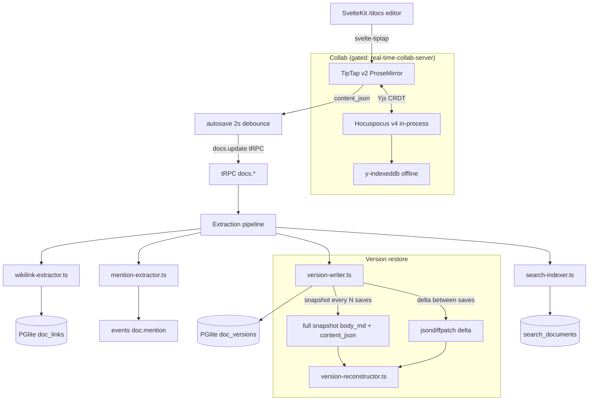
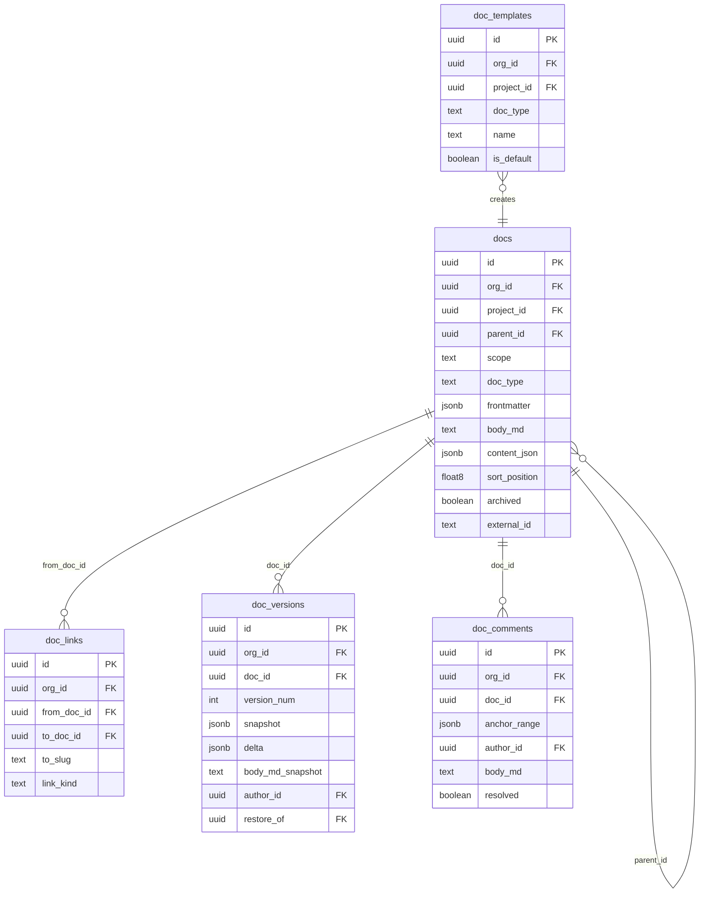

# PRD 7: Docs + Block Editor + Wiki + Collab + Versioning

## Status: ready-for-plan-breakdown

## Linkage chain

| Dimension | Detail |
|---|---|
| Vision gaps | V-gap-14: no block editor; V-gap-15: no collaborative doc editing; V-gap-16: no wikilinks or backlinks; V-gap-17: no version history |
| Requirements pillar | Pillar 7 — Docs + Block Editor + Wiki + Collab (`REQUIREMENTS.md §7`) |
| Key decisions | Q11 (doc taxonomy: 9 typed doc types); Q13 (frontmatter: form + YAML toggle); Q14 (version history: snapshot+delta hybrid); Q22 (composite org_id indexes); C1 (all features ship gated); A2 (doctor coverage per pillar) |
| External specs | TipTap v2 + `svelte-tiptap` 3.0.1 MIT; Yjs MIT + Hocuspocus v4 MIT; jsondiffpatch MIT; `isomorphic-dompurify` MIT |

---

## Vision

Confluence-class docs. User verbatim: "imagine it a jira + confluence clone" with "memory and context management through project management and documentation details." Top-class block editing — slash commands, wikilinks, mentions, collab cursors, version history, typed doc taxonomy — all shipped, no surface MVP or phase 2 (C4, C1).

---

## Out-of-scope

Per C5: carve-out (1) = genuinely not in user's ask; carve-out (2) = owned by another pillar.

- **Time-tracked meeting billing** — not in verbatim ask; excluded.
- **AI auto-tagging** — Q5b removed; excluded until user asks.
- **Owned by Pillar 9:** email/webhook fan-out for `@mention` events (this pillar emits `events` rows only).
- **Owned by Pillar 3 (Memory):** context extraction pipeline reading `doc.saved` events.
- **Owned by Pillar 11 (Search):** query surface; this pillar writes `search_documents` rows.
- **Owned by Pillar 1:** `org_id` composite indexes (Q22), Better-Auth middleware, feature-flag eval, graphile-worker.

---

## Always-on features

### TipTap v2 block editor

Binding: `svelte-tiptap` 3.0.1 or Tipex (Svelte 5 runes). Headless ProseMirror; all MIT extensions; no Tiptap Cloud required.

**12 extensions (all MIT):** StarterKit (H1-H6, lists, bold/italic/strike/code, blockquote, undo/redo), CodeBlockLowlight+shiki (syntax hl), Table (CRUD), Link, Image (paste/drag-drop; Bun FS upload), FileAttachment (custom NodeView; chip), Mathematics/KaTeX (`$inline$` + `$$block$$`), Mermaid (custom NodeView; sandboxed iframe), Excalidraw (React island sketch block), Wikilink (custom NodeView; `[[slug]]` chip; on-save upserts `doc_links`), Mention (custom NodeView; `@user/@agent/@task/@run`; notification hook), Comment (now-MIT; text-range anchor → thread ID; gutter indicator), Footnote (`[^1]`), Embed (`/embed <url>` → allow-listed iframe).

**Slash command menu** — `/` palette: all block types + template insert + wikilink insert. `shadcn-svelte Command`. Keyboard navigable.

**Autosave** — 2s debounce. Writes `docs.body_md` (canonical export) + `docs.content_json` (ProseMirror source). Both stored; body_md for FTS/CLI/TUI; content_json is editor source of truth.

---

### Doc taxonomy (Q11)

`docs.parent_id` adjacency list, `docs.scope ('project'|'global')`, `docs.doc_type` enum: `spec | adr | wiki | runbook | meeting | postmortem | rfc | note | scratch`.

Doc-type drives: template, required fields (blocked save if missing), editor toolbar variant, sidebar icon + color badge.

Two trees: per-project (scope=`project`) + global org-wide (scope=`global`). `sort_position float8` fractional indexing. `docs.archived` soft-delete. Breadcrumbs via recursive CTE on `parent_id`.

---

### Frontmatter (Q13)

Two modes — always-on:

1. **Form UI** — Zod-validated per doc_type. Required fields: ADR (`status/decision/context/consequences`), postmortem (`impact/timeline/root_cause/action_items`), RFC (`status/summary`), runbook (`service/severity_level`), meeting (`date/attendees`), spec (`status`). wiki/note/scratch have no required fields.
2. **Raw YAML toggle** — power-user YAML edit. Both paths write canonical `docs.frontmatter jsonb`. Round-trip lossless. Zod schemas in `src/docs/frontmatter-schemas.ts`.

---

### Wikilinks + backlinks

- Resolution at render time: PGlite slug/title lookup → chip or orange unresolved.
- On save: parse all `[[…]]` nodes → bulk upsert `doc_links(from_doc_id, to_slug, to_doc_id, link_kind)`. Stale links removed.
- `link_kind` enum: `wikilink | task_ref | run_ref | mention`.
- Doc sidebar: "Referenced by N docs" + list.

---

### Comments + threads

TipTap comment extension (MIT since May 2026) marks text range; thread stored in `doc_comments(anchor_range, body_md, parent_comment_id, resolved)`. Markdown body; mentions allowed. Comments panel in web sidebar. `resolved` collapses thread, preserves data.

---

### Version history (Q14 — snapshot + delta hybrid)

Every save writes `doc_versions` row: jsondiffpatch delta vs prior. Full snapshot every N saves (default 10, env `DOC_SNAPSHOT_EVERY`) + once per calendar day. `body_md_snapshot` always written (enables CLI/TUI restore without content_json chain).

Diff view: jsondiffpatch HTML visual, block-level adds/deletes. Restore: reconstruct via nearest snapshot + forward deltas → new version row (`restore_of` FK), non-destructive. Byte-stable: restored `content_json` + `body_md` match original exactly.

---

### Templates

`doc_templates` table; `project_id NULL` = org default. Pre-seeded for all 9 doc_types. Template picker in slash menu + new-doc wizard. Settings → Templates CRUD per project.

---

### Search indexing

Every doc save: upsert `search_documents(kind='doc', entity_id, org_id, project_id, title, body_text, doc_type, tags, author_id, updated_at)`. Consumed by Pillar 11. Facets: `doc_type`, `project`, `tag`, `author`, `date_range`, `scope`.

---

### Drag-drop tree CRUD

`svelte-dnd-action` on tree nodes; writes `sort_position` fractional index. Context menu: create/rename/move/archive/delete. Breadcrumbs recomputed on move.

---

## Gated features

All shipped + tested; OFF by default.

| Flag | What it does |
|---|---|
| `real-time-collab-server` | Yjs CRDT on TipTap; in-process Hocuspocus v4 WebSocket server (Bun); room per `doc_id`. `y-indexeddb` offline fallback always-on. ON: server persistence + presence; collab cursors. Shared flag with Pillar 6 task description collab. |
| `embeddings` | On save: `body_md` → inference sidecar → `docs.embedding vector(384)`. Enables hybrid FTS+cosine via Pillar 11. |
| `report-llm-narration` | On save of `adr/postmortem/rfc`: inference sidecar generates 2-para exec summary; prepended as read-only block. Backend: `embedded` default; overridable `report-llm-narration:<backend>`. |
| `connector-confluence` | One-way import: Confluence Cloud REST → markdown via remark pipeline → `docs` rows; `external_id='confluence:<page_id>'`. `connector_sync_log` written per run. |
| `connector-notion` | One-way import: Notion REST API → recursive block fetch → `docs` rows; `external_id='notion:<page_id>'`. |
| `public-api` | `@hono/zod-openapi` REST: `GET/POST/PATCH/DELETE /api/v1/docs`, `/api/v1/docs/{id}/versions`, `/api/v1/docs/{id}/comments`, `/api/v1/docs/{id}/backlinks`. |

---

## Stack

ORM/DB: MikroORM v7 (`@mikro-orm/core` + `mikro-orm-pglite` local, `@mikro-orm/postgresql` SaaS). Entities: `src/db/entities/docs/`. Repositories: `src/db/repositories/docs/`. Migrations auto-generated by `mikro-orm migration:create` at `src/db/migrations/Migration<timestamp>.ts`. TipTap/Yjs/Hocuspocus stay TS-side — no ORM involvement. Collab (Hocuspocus) gated behind `real-time-collab-server` flag. DI via `needle-di` `@Injectable()`. See C7, C8, C9 in DECISIONS.md.

## Tech stack

| Layer | Pick | License | Failure gate | 2nd | 3rd |
|---|---|---|---|---|---|
| Block editor | TipTap v2 + svelte-tiptap 3.0.1 | MIT | Svelte 5 runes compat regression → Tipex (Svelte 5 runes); TipTap drops Svelte → Milkdown | Milkdown | svelte-lexical |
| Collab CRDT | Yjs | MIT | Confirmed corruption bug → Automerge 3 | Automerge 3 | Loro (Rust/WASM, maturing) |
| Collab server | Hocuspocus v4 (Bun) | MIT | No release >6mo or Bun crash → custom Bun WS + y-websocket protocol | y-websocket direct | — |
| Math | KaTeX | MIT | Missing glyph → MathJax (Apache-2.0) | MathJax | — |
| Diagrams | Mermaid (sandboxed iframe default) | MIT | CVE recurrence → CDN in sandboxed iframe, remove npm dep | iframe only | draw.io embed |
| Sketch | Excalidraw React island | MIT | Bundle >400kb → draw.io web embed | draw.io embed | — |
| Diff | jsondiffpatch | MIT | >200ms on docs >500kb → full snapshots only, add GC policy | full snapshots | — |
| Sanitize | isomorphic-dompurify | MIT | — | — | — |
| Syntax hl | shiki (in CodeBlockLowlight) | MIT | WASM budget exceeded → Prism | Prism | lowlight |
| Tree DnD | svelte-dnd-action | MIT | Svelte 5 runes breaks handlers → pragmatic-drag-and-drop (Apache-2.0) | pragmatic-dnd | SortableJS |
| Tree storage | adjacency list + recursive CTE | — | >10k nodes, CTE >50ms → add closure table alongside | closure table | — |
| File upload | Bun local FS | MIT | Multi-user deploy → MinIO (AGPL, server-side) | MinIO | S3-compatible |

---

## Schema changes

All schema artifacts are MikroORM v7 `@Entity` classes (C6, C7, C9). Composite `(org_id,…)` indexes on every entity (Q22). Migrations auto-generated by `mikro-orm migration:create`. No `.sql` files.

### `Doc` entity — additive properties (`src/db/entities/docs/Doc.ts`)

```typescript
@ManyToOne(() => Doc, { nullable: true }) parent?: Doc;   // ON DELETE SET NULL

@Property({ type: 'string', default: 'project',
  check: `scope IN ('project','global')` })
scope: string = 'project';

@Property({ type: 'string', default: 'note',
  check: `doc_type IN ('spec','adr','wiki','runbook','meeting','postmortem','rfc','note','scratch')` })
docType: string = 'note';

@Property({ type: 'json', default: {} }) frontmatter: Record<string, unknown> = {};
@Property({ type: 'text', default: '' }) bodyMd: string = '';
@Property({ type: 'json', default: {} }) contentJson: Record<string, unknown> = {};
@Property({ type: 'float', default: 0 }) sortPosition: number = 0;
@Property({ type: 'boolean', default: false }) archived: boolean = false;
@Property({ type: 'string', nullable: true }) externalId?: string;
```

Indexes: `docs_org_project_scope (org_id, project_id, scope)`; `docs_org_doc_type (org_id, doc_type)`; `docs_org_parent (org_id, parent_id)`; unique partial `docs_org_external_id (org_id, external_id) WHERE external_id IS NOT NULL`.

### `DocLink` entity (new — `src/db/entities/docs/DocLink.ts`)

```typescript
@Entity()
export class DocLink {
  @PrimaryKey({ type: 'uuid', defaultRaw: 'gen_random_uuid()' }) id!: string;
  @ManyToOne(() => Org) org!: Org;
  @ManyToOne(() => Doc, { onDelete: 'cascade' }) fromDoc!: Doc;
  @ManyToOne(() => Doc, { nullable: true, onDelete: 'set null' }) toDoc?: Doc;
  @Property({ type: 'string' }) toSlug!: string;
  @Property({ type: 'string', default: 'wikilink',
    check: `link_kind IN ('wikilink','task_ref','run_ref','mention')` })
  linkKind: string = 'wikilink';
  @Property({ type: 'string', nullable: true }) anchor?: string;
  @Property({ type: 'date', defaultRaw: 'now()' }) createdAt: Date = new Date();
}
```

Indexes: `doc_links_org_from (org_id, from_doc_id)`; `doc_links_org_to (org_id, to_doc_id)`.

### `DocVersion` entity (new — `src/db/entities/docs/DocVersion.ts`)

```typescript
@Entity()
export class DocVersion {
  @PrimaryKey({ type: 'uuid', defaultRaw: 'gen_random_uuid()' }) id!: string;
  @ManyToOne(() => Org) org!: Org;
  @ManyToOne(() => Doc, { onDelete: 'cascade' }) doc!: Doc;
  @Property({ type: 'integer' }) versionNum!: number;
  @Property({ type: 'json', nullable: true }) snapshot?: Record<string, unknown>;
  @Property({ type: 'json', nullable: true }) delta?: Record<string, unknown>;
  @Property({ type: 'text', nullable: true }) bodyMdSnapshot?: string;
  @ManyToOne(() => User, { nullable: true, onDelete: 'set null' }) author?: User;
  @ManyToOne(() => DocVersion, { nullable: true, onDelete: 'set null' }) restoreOf?: DocVersion;
  @Property({ type: 'date', defaultRaw: 'now()' }) createdAt: Date = new Date();
}
```

Unique: `(doc_id, version_num)`. Index: `doc_versions_org_doc_version (org_id, doc_id, version_num)`.

### `DocComment` entity (new — `src/db/entities/docs/DocComment.ts`)

```typescript
@Entity()
export class DocComment {
  @PrimaryKey({ type: 'uuid', defaultRaw: 'gen_random_uuid()' }) id!: string;
  @ManyToOne(() => Org) org!: Org;
  @ManyToOne(() => Doc, { onDelete: 'cascade' }) doc!: Doc;
  @Property({ type: 'json', nullable: true }) anchorRange?: Record<string, unknown>;
  @ManyToOne(() => User) author!: User;
  @Property({ type: 'text' }) bodyMd!: string;
  @ManyToOne(() => DocComment, { nullable: true, onDelete: 'cascade' }) parentComment?: DocComment;
  @Property({ type: 'boolean', default: false }) resolved: boolean = false;
  @Property({ type: 'date', defaultRaw: 'now()' }) createdAt: Date = new Date();
  @Property({ type: 'date', defaultRaw: 'now()', onUpdate: () => new Date() }) updatedAt: Date = new Date();
}
```

Index: `doc_comments_org_doc (org_id, doc_id)`.

### `DocTemplate` entity (new — `src/db/entities/docs/DocTemplate.ts`)

```typescript
@Entity()
export class DocTemplate {
  @PrimaryKey({ type: 'uuid', defaultRaw: 'gen_random_uuid()' }) id!: string;
  @ManyToOne(() => Org) org!: Org;
  @ManyToOne(() => Project, { nullable: true, onDelete: 'cascade' }) project?: Project;
  @Property({ type: 'string',
    check: `doc_type IN ('spec','adr','wiki','runbook','meeting','postmortem','rfc','note','scratch')` })
  docType!: string;
  @Property({ type: 'string' }) name!: string;
  @Property({ type: 'json', default: {} }) frontmatterTemplate: Record<string, unknown> = {};
  @Property({ type: 'text', default: '' }) bodyTemplate: string = '';
  @Property({ type: 'boolean', default: false }) isDefault: boolean = false;
  @Property({ type: 'date', defaultRaw: 'now()' }) createdAt: Date = new Date();
}
```

Unique: `(org_id, project_id, doc_type, name)`. Index: `doc_templates_org_project_type (org_id, project_id, doc_type)`.

Repositories: `src/db/repositories/docs/{Doc,DocLink,DocVersion,DocComment,DocTemplate}Repository.ts`.

---

## Surfaces

### Web

| Route | Purpose |
|---|---|
| `/docs` | Global hub: global tree sidebar, recent docs, search bar |
| `/docs/global` | Global scope tree full-page |
| `/docs/new` | New-doc wizard: pick doc_type → template → create |
| `/docs/<slug>` | Read view: remark+shiki+DOMPurify render, backlinks panel, comments panel, frontmatter summary |
| `/docs/<slug>/edit` | Editor: TipTap, frontmatter form/YAML panel, comments panel, presence avatars (flag on) |
| `/docs/<slug>/history` | Version timeline: list, diff view, restore |
| `/projects/<id>/docs` | Per-project tree + reader/editor, scoped |

Sidebar: `svelte-dnd-action` tree, context menu, breadcrumbs. Frontmatter + comments as slide-in panels. cmd+K integration via Pillar 11 (`docs.create`, `docs.search`, `docs.navigate-to`).

### CLI (`--json` on every command)

Auto-codegenned from tRPC. Commands: `fulcrum docs create|list|tree|show|edit|move|rename|delete|archive|history|restore|backlinks`; `fulcrum docs template list|create`; `fulcrum docs comments list`; `fulcrum docs connector sync <name>`.

### TUI (OpenTUI; consumes tRPC in-process)

- **Docs panel** — two-pane: tree (arrow-keys, `Enter` reader, `n` new, `d` delete) + reader (remark render, no TipTap)
- **Edit mode** — OpenTUI `<TextArea>` + live keybindings; `Ctrl+S` save; `Ctrl+F` frontmatter YAML popup
- **Keys** — `b` backlinks panel, `h` history view, `g` scope toggle (project↔global), `p` preview split, `r` restore version
- **History view** — version list; jsondiffpatch ANSI diff; `r` restore

Failure gate: if OpenTUI too immature at TUI-build time → ratatui (Rust, in inference-sidecar workspace).

### API

tRPC namespaces (always-on): `docs.*`, `docs.versions.*`, `docs.comments.*`, `docs.links.*`, `docs.templates.*`. `FULCRUM_FEATURES=public-api` → `@hono/zod-openapi` REST wrapper covering all five namespaces.

---

## Technical design

### Architecture



### Sequence: doc save with extraction pipeline

```mermaid
sequenceDiagram
    participant ED as TipTap Editor
    participant AS as Autosave debounce
    participant TR as tRPC docs.update
    participant VW as version-writer
    participant WL as wikilink-extractor
    participant SI as search-indexer
    participant DB as PGlite

    ED->>AS: content_json changed
    AS->>TR: docs.update({id, content_json, body_md})
    TR->>DB: docRepo.assign(doc, { contentJson, bodyMd }); em.flush()
    TR->>VW: write version row
    VW->>DB: docVersionRepo.count({ doc }) to get max version_num
    alt version_num % SNAPSHOT_EVERY == 0
        VW->>DB: docVersionRepo.create({ doc, snapshot: contentJson, bodyMdSnapshot }); em.flush()
    else
        VW->>DB: docVersionRepo.create({ doc, delta: jsondiffpatch(prev, curr) }); em.flush()
    end
    TR->>WL: extractWikilinks(content_json)
    WL->>DB: docLinkRepo.nativeDelete({ fromDoc: doc.id })
    WL->>DB: docLinkRepo.upsertMany([...links]); em.flush()
    TR->>SI: upsert(docId)
    SI->>DB: searchDocRepo.upsert({ kind:'doc', entityId: doc.id, ... }); em.flush()
    TR-->>ED: {docId, version_num}
```

### ER diagram



### Error model

| Code | Description | Propagated to | Recovery |
|---|---|---|---|
| `DOC_FRONTMATTER_REQUIRED` | Required frontmatter field missing on save for ADR/RFC/etc | tRPC 400 + editor inline error | Fill required fields before saving |
| `VERSION_RECONSTRUCT_FAILED` | Delta chain broken (missing intermediate version) | tRPC 500 on restore | Use nearest snapshot directly |
| `WIKILINK_CYCLE` | Circular `[[A]] -> B -> [[A]]` wikilink | Logged warning; render as unresolved | Fix link to avoid cycle |
| `HOCUSPOCUS_ROOM_CRASH` | Yjs document room crashes (flag on) | Reconnect client; y-indexeddb fallback | Server restart; local offline edits preserved |
| `CONNECTOR_IMPORT_FAILED` | Confluence/Notion fetch fails | `connector_sync_log(status=error)` | Check API credentials; retry |

### Observability

| Signal | Name | Fields |
|---|---|---|
| OTel span | `fulcrum.docs.update` | `doc_id`, `doc_type`, `version_num`, `duration_ms` |
| OTel span | `fulcrum.docs.versionWrite` | `doc_id`, `kind` (snapshot/delta), `size_bytes` |
| OTel span | `fulcrum.docs.wikilinkExtract` | `doc_id`, `link_count`, `unresolved_count` |
| Log event | `docs.collab.room.created` | `doc_id`, `user_id` |
| Log event | `docs.version.restored` | `doc_id`, `from_version`, `to_version` |

### Performance budgets

| Operation | p50 | p95 |
|---|---|---|
| TipTap cold mount | <150 ms | <300 ms |
| Autosave `docs.update` tRPC | <100 ms | <200 ms |
| Doc tree 500 nodes recursive CTE | <100 ms | <200 ms |
| Version restore (50 versions, 5 snapshots) | <80 ms | <150 ms |
| `search_documents` upsert on save | <20 ms | <50 ms |

## Doctor integration

Subsystem: `docs`

```typescript
const DoctorDocsCheck = z.object({
  subsystem: z.literal('docs'),
  checks: z.array(z.object({
    id: z.string(),
    status: z.enum(['pass', 'warn', 'fail']),
    message: z.string(),
    durationMs: z.number().optional(),
    metadata: z.record(z.unknown()).optional(),
  })),
  ok: z.boolean(),
});
```

| Check ID | What it verifies | Failure recovery |
|---|---|---|
| `docs.schema.doc_links` | `DocLink` entity table exists | Run `mikro-orm migration:up` for P7 migration class |
| `docs.schema.doc_versions` | `DocVersion` entity table exists | Run `mikro-orm migration:up` for P7 migration class |
| `docs.schema.doc_comments` | `DocComment` entity table exists | Run `mikro-orm migration:up` for P7 migration class |
| `docs.schema.doc_templates` | `DocTemplate` entity table exists; defaults seeded | Run `mikro-orm migration:up` for P7 migration class |
| `docs.frontmatter.schemas` | All 9 doc_type Zod schemas importable | Check `src/docs/frontmatter-schemas.ts` |
| `docs.collab.hocuspocus` | If `real-time-collab-server` ON: Hocuspocus WS server bound | Check flag + start server |
| `docs.connector.confluence.creds` | If `connector-confluence` ON: `CONFLUENCE_URL` + token set | Set env vars |
| `docs.connector.notion.creds` | If `connector-notion` ON: `NOTION_TOKEN` set | Set env var |

## Dependencies

| Pillar | What needed |
|---|---|
| **Pillar 1** | `orgs/projects/users/org_members`; flag eval; Better-Auth; graphile-worker (connector sync jobs) |
| **Pillar 2** (inference sidecar) | Gated: embeddings + LLM summary |
| **Pillar 3** (Memory) | Consumes `doc.saved` events emitted here; event contract must be stable |
| **Pillar 6** (Tasks) | Sprint close creates `doc_type='postmortem'` via `docs.create` tRPC — must ship before or with P6 sprint-close |
| **Pillar 9** (Notifications) | Consumes `doc.mention` events emitted here |
| **Pillar 11** (Search) | Consumes `search_documents` rows written here |

---

## Issues breakdown (TDD-numbered P7.xx)

**Schema + foundation**
- `P7-01` Migration class: `Doc` entity gains additive properties (`parent`, `scope`, `docType`, `frontmatter`, `bodyMd`, `contentJson`, `sortPosition`, `archived`, `externalId`) + all indexes. Generated by `mikro-orm migration:create`.
- `P7-02` Migration classes: `DocLink`, `DocVersion`, `DocComment`, `DocTemplate` entities + indexes. Generated by `mikro-orm migration:create`.
- `P7-03` Frontmatter Zod schemas for all 9 doc_types (`src/docs/frontmatter-schemas.ts`). Tests: validate shapes, reject missing required, roundtrip form↔YAML.
- `P7-04` Template seed migration: org-default per doc_type. Tests: 9 templates on org create, project-override takes precedence.

**tRPC procedures**
- `P7-05` `docs.list` (scope/doc_type/archived/parent_id/pagination). `P7-06` `docs.get` (slug or id; 404 on missing). `P7-07` `docs.create` (slug auto-gen, template applied, version 1 written). `P7-08` `docs.update` (version row + search_documents upsert + doc_links extracted). `P7-09` `docs.delete` (soft=archived; hard=cascade links/versions/comments). `P7-10` `docs.move` (fractional sort_position, breadcrumb recomputed). `P7-11` `docs.tree` (recursive CTE, depth limit, archived excluded). `P7-12` `docs.backlinks` (filter by link_kind). `P7-13` `docs.versions.list/get` (DESC, snapshot/delta flagged). `P7-14` `docs.versions.diff` (nearest snapshot + forward deltas). `P7-15` `docs.versions.restore` (byte-stable; new version_num = max+1; restore_of FK). `P7-16` `docs.comments.list/create/update/delete/resolve` (anchor_range, thread reply, cascade). `P7-17` `docs.links.listBacklinks/listForwardLinks`. `P7-18` `docs.templates.list/get/create/update/delete/setDefault` (org fallback, project override).

**Extraction pipeline**
- `P7-19` `src/docs/wikilink-extractor.ts` — parse `content_json` → bulk upsert `doc_links`. Tests: idempotent, removes stale links.
- `P7-20` `src/docs/mention-extractor.ts` — parse mention nodes → emit `doc.mention` events. Tests: correct event shape, no duplicate events.
- `P7-21` `src/docs/version-writer.ts` — delta vs snapshot logic, `body_md_snapshot` always written. Tests: snapshot at interval N, delta between.
- `P7-22` `src/docs/version-reconstructor.ts` — nearest snapshot + apply deltas. Tests: byte-stable reconstruction.
- `P7-23` `src/docs/search-indexer.ts` — strip markdown → upsert `search_documents`. Tests: correct fields, updated on every save.

**TipTap custom extensions**
- `P7-24` Wikilink NodeView (`[[slug]]` parses; resolved chip; unresolved orange; extraction on save). `P7-25` Mention NodeView (all 4 types; chip; hover card). `P7-26` Mermaid NodeView (sandboxed iframe; invalid inline error; no XSS). `P7-27` KaTeX (inline + block; fallback text on error). `P7-28` FileAttachment NodeView (upload → chip; drag-drop). `P7-29` Excalidraw React island (sketch in node attrs; saves on close). `P7-30` Footnote (numbered; bottom block).

**Frontmatter components**
- `P7-31` `FrontmatterForm.svelte` — Zod-schema-driven per doc_type. Tests: required fields block save, Zod errors inline.
- `P7-32` `FrontmatterYaml.svelte` — raw YAML via `js-yaml`. Tests: form→YAML→form lossless, unknown keys preserved, invalid YAML shows error.

**Web routes + components**
- `P7-33` `/docs` hub (global tree, recent, search). `P7-34` `/docs/<slug>` read view (remark+shiki+DOMPurify, wikilink chips, backlinks panel). `P7-35` `/docs/<slug>/edit` (TipTap, autosave, panels, presence avatars). `P7-36` `/docs/<slug>/history` (version list, diff, restore). `P7-37` `/projects/<id>/docs` (scoped tree). `P7-38` `DocTree.svelte` (DnD reorder → sort_position, context menu). `P7-39` `CommentsPanel.svelte` (anchor highlight, resolve, threads). `P7-40` `NewDocWizard.svelte` (9 types, template picker, create + redirect).

**CLI**
- `P7-41` `fulcrum docs create/list/tree/show/edit/move/rename/delete/archive`. Tests: `--json`, flag aliases.
- `P7-42` `fulcrum docs history/restore/backlinks`. Tests: JSON schema, byte-stable restore.
- `P7-43` `fulcrum docs template list/create` + `fulcrum docs comments list`.

**TUI**
- `P7-44` Docs panel (tree + reader). Tests: 100+ docs, arrow-key navigate, `Enter` reader.
- `P7-45` Edit mode (textarea + Ctrl+S). Tests: saves via tRPC, version written.
- `P7-46` Backlinks panel, history view, scope toggle. Tests: backlinks accurate, ANSI diff renders, scope toggle switches tree.

**Gated**
- `P7-47` `real-time-collab-server`: Yjs + Hocuspocus room per doc_id; `y-indexeddb` always-on. Tests: OFF → standalone; ON → two tabs converge, cursor visible, disconnect+reconnect no data loss.
- `P7-48` `embeddings`: on update → sidecar → `docs.embedding`. Tests: OFF → NULL; ON → populated.
- `P7-49` `report-llm-narration`: on ADR/postmortem/RFC save → sidecar → read-only summary block. Tests: OFF → no call; ON → block present.
- `P7-50` `connector-confluence`: ETL pipeline. Tests: mock API → upserts, idempotent re-run, external_id set.
- `P7-51` `connector-notion`: ETL pipeline. Tests: recursive block fetch, upserts, external_id set.
- `P7-52` Connector sync job (graphile-worker) + `connector_sync_log` table + CLI `fulcrum docs connector sync <name>`. Tests: job enqueue, log row, error captured.
- `P7-53` `public-api`: REST for docs/versions/comments/backlinks. Tests: OpenAPI spec validates, auth required, 404 on missing.

---

## Failure gates

| Pick | Gate condition | Fallback |
|---|---|---|
| TipTap v2 + svelte-tiptap | Svelte 5 runes compat regression | Tipex → Milkdown → svelte-lexical |
| Hocuspocus v4 | No release >6mo OR Bun crash in stress test | Custom Bun WS + y-websocket protocol (~300 lines) |
| Yjs | Confirmed corruption bug in production | Automerge 3 (MIT) |
| jsondiffpatch | >200ms on docs >500kb | Full snapshots only; add GC policy |
| Mermaid | CVE recurrence | Sandboxed iframe + CDN; remove npm dep |
| svelte-dnd-action | Svelte 5 runes breaks handlers | pragmatic-drag-and-drop (Apache-2.0) |
| adjacency list + CTE | >10k nodes, CTE >50ms | Add closure table alongside |
| OpenTUI (TUI) | Component library too immature at TUI-build time | ratatui (Rust, inference-sidecar workspace) |

---

## Acceptance criteria

All three surfaces (Web + CLI + TUI) must pass. OFF and ON flag paths tested for all gated features.

**Doc CRUD + tree** — Web: all 9 doc_types created, tree nesting correct, DnD reorder persists, breadcrumbs correct, archive hides. CLI: `fulcrum docs create --type adr --json` returns doc; `fulcrum docs tree --json` returns nested structure. TUI: 100+ docs render, arrow-key navigate, `Enter` reader, `n` create.

**TipTap extension coverage (Web)** — All 12 extension types render and save: headings, lists, links, code blocks (syntax-highlighted), tables, math (KaTeX), diagrams (Mermaid), wikilinks, mentions, comments (anchor), file embeds, footnotes. Slash menu navigates to all block types.

**Frontmatter round-trip** — ADR: form shows all 4 required fields; missing field blocks save; YAML toggle shows equivalent YAML; edit YAML → save → reopen form → no data loss. All 9 doc_type Zod schemas validate correct shapes and reject invalid.

**Wikilinks + backlinks (all surfaces)** — `[[existing-slug]]` chip clickable → navigates. Unresolved orange with "create?" action. After save: `doc_links` row exists; backlinks panel shows referring doc. CLI: `--json` returns from_doc list. TUI: `b` key backlinks panel correct.

**Comments (Web + CLI)** — Select text → thread → reply → resolve → collapsed but preserved. CLI: `comments list --json` returns threads with anchor_range and resolved status.

**Version history + restore (all surfaces)** — 12 saves: 12 rows, snapshots on 1 and 10, deltas on others. Diff shows changed blocks. Restore v5 → byte-stable match of original. CLI: `history --json` + `restore --version 5`. TUI: `h` list + `r` restore.

**Search index** — Every doc save: `search_documents` upserted with correct `doc_type`, `body_text`, `org_id`, `project_id`. Verified via test-db direct query.

**Gated (OFF and ON):** `real-time-collab-server` OFF → standalone TipTap; ON → two tabs converge, cursors visible, disconnect+reconnect no loss. `embeddings` OFF → NULL; ON → embedding populated. `report-llm-narration` OFF → no sidecar call; ON → read-only summary block prepended on ADR/postmortem/RFC. `connector-confluence/notion` OFF → no sync; ON → `fulcrum docs connector sync <name>` imports idempotently. `public-api` OFF → 404; ON → valid OpenAPI 3.1, auth required.

**Performance:** doc tree 500 nodes < 200ms; TipTap cold mount < 300ms; version restore (50 versions, 5 snapshots) < 150ms; `search_documents` upsert < 50ms (in-process PGlite).
