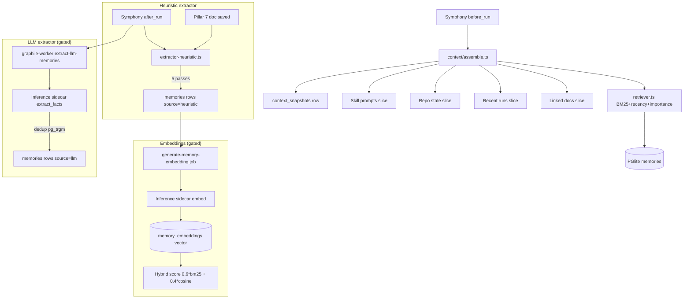
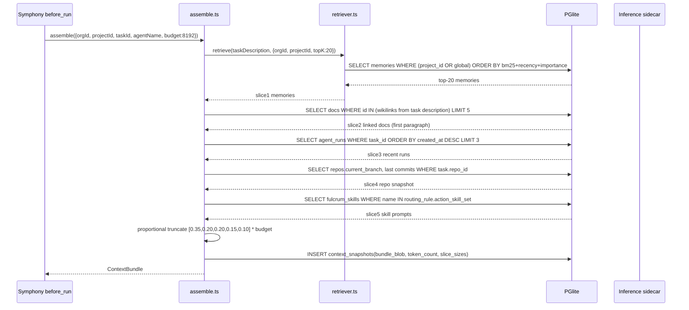

# PRD 8: Memory + Context Engine + Retriever

## Status: ready-for-plan-breakdown

## Linkage chain

| Dimension | Detail |
|---|---|
| Vision gaps | V-gap-18: no persistent memory store; V-gap-19: no context assembly before agent runs; V-gap-20: no heuristic extraction from transcripts |
| Requirements pillar | Pillar 8 — Memory + Context Engine (`REQUIREMENTS.md §8`) |
| Key decisions | Q15 (memory per-project + global scoping); Q16 (heuristic extraction always-on, LLM extraction gated); Q17 (BM25+recency+importance always-on, pgvector gated); Q18 (5-slice context bundle); Q22 (composite org_id indexes); A2 (doctor coverage per pillar) |
| External specs | PGlite `tsvector` + `ts_rank_cd` PostgreSQL docs; pgvector HNSW index docs; graphile-worker job retry docs; fastembed-rs bge-small model spec |

---

## Vision

User verbatim: "preserves and provide memory and context management through project management and documentation details." Per DECISIONS Q15/Q16/Q17/Q18: a durable memory store with per-project + global scoping, hybrid heuristic-always / LLM-gated extraction, BM25+recency+importance retrieval always-on, pgvector hybrid retrieval gated, and a 5-slice context bundle assembled before every agent run. Three surfaces — Web + APIs, CLI, TUI — full parity (C4). All features shipped; online features gated (C1, C5).

---

## Out-of-scope

Strictly C5 carve-out (1) or (2) only.

- **Owned by Pillar 2 (Inference Sidecar):** embedding generation (`fastembed-rs`), LLM extraction inference calls, model backend management (embedded / Ollama / LM Studio / OpenAI-compatible). This pillar consumes the sidecar via Unix socket / stdio JSON-RPC; does not implement it.
- **Owned by Pillar 3 (Symphony Orchestration):** `before_run` hook invocation, `after_run` transcript delivery. This pillar implements `context.assemble` and the heuristic extractor hooks; Symphony calls them.
- **Owned by Pillar 7 (Docs):** doc save event emission, TipTap frontmatter form, doc versioning. This pillar subscribes to doc save events to trigger heuristic extraction; does not own the doc pipeline.
- **Owned by Pillar 6 (Tasks + Scrum):** `project_id` + task description supply for retrieval; task detail page display of linked memories. This pillar exposes `context.preview` API; Pillar 6 calls it.
- **AI auto-labelling / auto-tagger** — Q5b explicitly removed; not user-requested. Excluded until asked.
- **Automated daily digest / sprint summary narration** — not in verbatim ask; gated separately as `report-llm-narration` if ever requested. Not in this pillar.
- **Cross-org skill marketplace** — Owned by Pillar 5 (Router + Skills).

---

## Always-on features

Ships unconditionally, all surfaces.

### Memory schema + lifecycle

`memories` table — full DDL in Schema Changes section. CRUD: create, read, update, archive, restore, forget (hard delete, org-admin only). `source` column (`heuristic | llm | manual`) always set on write. `importance` column (`low | medium | high`) defaults `medium`. `global` boolean defaults `false`; flip to `true` to share cross-project. `archived` boolean soft-deletes from retrieval unless `--include-archived` explicitly passed.

`memory_links` — links a memory to a task, doc, agent_run, or artifact row by `(target_kind, target_id)`. One memory may link to many entities. Populated by heuristic extractor when it detects provenance; queryable to show "memories from this run" on the agent run detail page (Pillar 3 surface).

`context_snapshots` — replay/debug store. Every assembled bundle is serialized and stored against its `run_id`. Enables deterministic re-run, diff between two runs, and the `fulcrum context preview` output being reproducible without re-running retrieval.

### Heuristic extractor (`src/memory/extractor-heuristic.ts`)

Always-on. No inference call. Triggered by two hooks:

**Agent run completion hook** (`after_run`): receives transcript blob from Symphony. Runs five regex/parser passes in sequence:
1. **File-touched** — `[read|wrote|created|deleted] <path>` → `kind='file_ref'`, `source_ref.{run_id,span_start,span_end}`.
2. **Decision lines** — `decided:`, `decision:`, `## Decision` headings → `kind='decision'`, `importance='high'`.
3. **Heading detection** — H2/H3 markdown headings → `kind='section_anchor'`.
4. **Blocker patterns** — `blocked by`, `waiting on`, `need .* to proceed` → `kind='blocker'`, `importance='high'`.
5. **Link extraction** — `[[wikilink]]` / bare URLs → `kind='link'`, body = href + anchor.

All rows: `source='heuristic'`.

**Doc save hook** (`after_doc_save`): three passes over doc body + frontmatter from Pillar 7:
1. Frontmatter keys `decisions|blockers|links|status|tags` → memory per value.
2. Lists under `## Decisions` / `## Blockers` / `## Action Items` headings → memory per bullet.
3. Wikilinks in body → `kind='link'`.

**Manual ingestion**: `fulcrum memory remember "<text>" [--global] [--project <id>] [--tag …] [--importance …] [--kind …]` → `source='manual'`.

### Retriever (`src/memory/retriever.ts`)

~150 LOC, pure TS, no framework dependency. Single exported function `retrieve(query: string, opts: RetrieverOpts): Promise<Memory[]>`.

**Always-on scoring formula:**
```
score = bm25(query, memory.body)
      + exp(-age_days / 30)
      + (memory.importance === 'high' ? 1.0 : 0.0)
```

BM25 via Postgres `ts_rank_cd(to_tsvector('english', body), plainto_tsquery('english', $query))`. Recency computed as `EXTRACT(EPOCH FROM (NOW() - created_at)) / 86400`. Importance boost applied in SQL CASE expression.

**Scope:** single UNION query: `WHERE org_id=$1 AND project_id=$2 AND archived=false` UNION `WHERE org_id=$1 AND global=true AND archived=false`. Dedupe on `id` (UNION handles naturally). Sort by `score DESC`. Return top 20.

**RetrieverOpts:** `{ orgId, projectId, query, topK = 20, includeArchived = false, kinds?: string[] }`. All params typed; Zod schema generated from tRPC input schema.

### Context bundle assembler (`src/context/assemble.ts`)

Called by Pillar 3 Symphony `before_run` hook. Assembles 5 slices into a single token-budgeted blob. Returns `ContextBundle` + writes a `context_snapshots` row.

**5 slices (in priority order for proportional truncation):**
1. **Memories** — top-N from retriever (project + global). Query derived from task description + task title.
2. **Linked docs** — one-hop wikilinks extracted from task description. Each doc fetched and truncated to first paragraph (or first 200 tokens). Max 5 docs.
3. **Recent agent runs** — last K (default 3) transcripts / status events for the same `task_id`, plus last 2 for sibling tasks in the same sprint. Source: `agent_runs` table, status + summary fields only (not full transcript, unless budget allows).
4. **Repo state snapshot** — current branch name + last 5 commits (from `repos` table cached state, Pillar 1/Q24 data) + top-level file tree skim (directory names only, depth 2).
5. **Skill prompts** — SKILL.md content for the chosen agent + task type. Source: Pillar 5 skills registry. Truncated to skill description + triggers section.

**Token budget:** configurable via `context.tokenBudget` project setting (default 8192). Proportional shrink: each slice allocated `budget * weight[i]`; weights `[0.35, 0.20, 0.20, 0.15, 0.10]`. Slices truncated independently by token count (naive `text.split(' ').length * 1.3` estimate; exact tiktoken used when embeddings flag on).

**`context_snapshots` row** written on every call. Used by `fulcrum context preview` and replay/diff.

### Manual memory CRUD

Full CLI binding per Q-cli-shape (see CLI surface). `memory.{create,read,update,archive,restore,forget,promote}` tRPC procedures back all surfaces. `context.preview --task <id>` assembles bundle without triggering a run.

---

## Gated features

All shipped + implemented + tested; OFF by default. Flip the named flag to enable.

### `memory-llm-extract`

**Flag:** `FULCRUM_FEATURES=memory-llm-extract`

Triggered after `after_run` or `after_doc_save` (parallel to heuristic, graphile-worker job `extract-llm-memories`). Calls Pillar 2 sidecar `extract_facts(text) → Fact[]`. Each Fact: `{body, kind, importance, confidence}`. Writes `source='llm'`. Before write, `pg_trgm similarity()` dedup: skip if existing row similarity > 0.85. Job timeout 30s, retry 2×; fails silently if sidecar down.

### `embeddings`

**Flag:** `FULCRUM_FEATURES=embeddings`

On memory write: enqueue job `generate-memory-embedding` → sidecar `embed(body) → float32[]` → write to `memory_embeddings(memory_id, vector)` (384 dim for bge-small). On retrieval, hybrid score:
```
score = 0.6 * normalize(bm25) + 0.4 * cosine(embed(query), memory_embed)
```
`normalize(bm25) = bm25 / max_bm25_in_result_set`. Recency + importance boosts unchanged (additive). Query embed cached in `context_snapshots.bundle_blob` for replay. `doc_embeddings` populated on doc save; ranks linked-doc slice when wikilinks > 5.

### `report-llm-narration`

**Flag:** `FULCRUM_FEATURES=report-llm-narration`

Summarize a memory cluster (project + date range) via sidecar `summarize(memories[]) → string`. Output stored as `doc_type='note'` doc (Pillar 7). Triggered by `fulcrum memory digest --project <id> [--since <date>]` or weekly graphile-worker cron.

---

## Tech stack

| Layer | Choice | License | Fit % | Failure gate | Fallback |
|---|---|---|---|---|---|
| FTS ranking | Postgres `tsvector` + `ts_rank_cd` | PostgreSQL | 95% | FTS rank insufficient for multi-field | Switch to `pgroonga` or manual BM25 re-ranker |
| Vector store | PGlite + pgvector (gated) | Apache-2.0 | 95% | Browser/edge deploy without PGlite | Vectra file-backed |
| Embeddings model | Pillar 2 sidecar (`fastembed-rs` bge-small) | Apache-2.0 | 90% | Sidecar unavailable | Disable `embeddings` flag; fall back to FTS-only |
| Job queue | graphile-worker | MIT | 90% | PGlite in-memory mode | Enforce file-backed PGlite (default) |
| Dedup similarity | `pg_trgm` `similarity()` | PostgreSQL | 85% | Trigram not semantic enough | Cosine check via pgvector when embeddings on |
| Token counting | Naive word-count * 1.3 (always-on) | N/A | 80% | Off by >15% for CJK text | `tiktoken-lite` WASM (gated with embeddings) |

Note: `ts_rank_cd` is not strict BM25 but equivalent here. TS BM25 re-ranker swappable if precision gate fails; no schema change.

---

## Schema changes

```sql
CREATE TABLE memories (
  id           uuid PRIMARY KEY DEFAULT gen_random_uuid(),
  org_id       uuid NOT NULL REFERENCES orgs(id),
  project_id   uuid REFERENCES projects(id),
  global       boolean NOT NULL DEFAULT false,
  kind         text NOT NULL DEFAULT 'note',   -- note|decision|blocker|file_ref|section_anchor|link|fact
  body         text NOT NULL,
  tags         text[] NOT NULL DEFAULT '{}',
  importance   text NOT NULL DEFAULT 'medium' CHECK (importance IN ('low','medium','high')),
  source       text NOT NULL CHECK (source IN ('heuristic','llm','manual')),
  source_ref   jsonb NOT NULL DEFAULT '{}',
  created_at   timestamptz NOT NULL DEFAULT now(),
  updated_at   timestamptz NOT NULL DEFAULT now(),
  archived     boolean NOT NULL DEFAULT false,
  body_tsv     tsvector GENERATED ALWAYS AS (to_tsvector('english', body)) STORED
);

-- Composite indexes per Q22
CREATE INDEX memories_org_project_importance ON memories (org_id, project_id, importance);
CREATE INDEX memories_org_kind    ON memories (org_id, kind);
CREATE INDEX memories_org_archived ON memories (org_id, archived);
CREATE INDEX memories_org_global  ON memories (org_id, global) WHERE global = true;
CREATE INDEX memories_body_tsv    ON memories USING GIN (body_tsv);

CREATE TABLE memory_links (
  id          uuid PRIMARY KEY DEFAULT gen_random_uuid(),
  memory_id   uuid NOT NULL REFERENCES memories(id) ON DELETE CASCADE,
  target_kind text NOT NULL,   -- task|doc|agent_run|artifact
  target_id   uuid NOT NULL,
  created_at  timestamptz NOT NULL DEFAULT now()
);
CREATE INDEX memory_links_memory_id ON memory_links (memory_id);
CREATE INDEX memory_links_target   ON memory_links (target_kind, target_id);

-- Gated (FULCRUM_FEATURES=embeddings); HNSW index added lazily on first write
CREATE TABLE memory_embeddings (
  memory_id  uuid PRIMARY KEY REFERENCES memories(id) ON DELETE CASCADE,
  vector     vector(384),
  model_id   text NOT NULL,
  created_at timestamptz NOT NULL DEFAULT now()
);
CREATE TABLE doc_embeddings (
  doc_id     uuid PRIMARY KEY REFERENCES docs(id) ON DELETE CASCADE,
  vector     vector(384),
  model_id   text NOT NULL,
  created_at timestamptz NOT NULL DEFAULT now()
);

-- Replay / debug; written on every context.assemble call
CREATE TABLE context_snapshots (
  id          uuid PRIMARY KEY DEFAULT gen_random_uuid(),
  run_id      uuid REFERENCES agent_runs(id) ON DELETE SET NULL,
  task_id     uuid REFERENCES tasks(id) ON DELETE SET NULL,
  bundle_blob jsonb NOT NULL,
  token_count int NOT NULL,
  slice_sizes jsonb NOT NULL,
  created_at  timestamptz NOT NULL DEFAULT now()
);
CREATE INDEX context_snapshots_run_id  ON context_snapshots (run_id);
CREATE INDEX context_snapshots_task_id ON context_snapshots (task_id);
```

---

## Surfaces

### Web (`/memory`)

**`/memory`** — org-level memory browser. Filter: project, kind, importance, tags, date range, source, archived toggle. Results list: body preview, kind badge, importance dot, source chip. Search via `memory.search` tRPC. Bulk: promote, archive, tag — floating action bar on multi-select.

**`/memory/<id>`** — full body (markdown), metadata inline-editable, `source_ref` link to producing run/doc, linked entities via `memory_links`, archive/promote/restore buttons. Heuristic/LLM body read-only; edit-requires-confirmation modal.

**Settings panel (project → Memory):** retriever weight sliders (`bm25_weight`, `recency_weight`, `importance_boost`) stored in `project_settings.memory_config jsonb`; token budget input; reset defaults.

**`/context/preview?task=<id>`** — assembled bundle preview (debug route): 5 slices with per-slice token counts. Mirrors `fulcrum context preview` output.

### CLI

`--json` on every command. Auto-generated from tRPC schema per Q-cli-shape.

```
fulcrum memory list        [--project <id>] [--global] [--kind <k>] [--tag <t>] [--importance <i>] [--archived] [--json]
fulcrum memory search      "<query>" [--project <id>] [--top <n>] [--json]
fulcrum memory show        <id> [--json]
fulcrum memory remember    "<text>" [--global] [--project <id>] [--tag <t>...] [--importance <i>] [--kind <k>]
fulcrum memory promote     <id> --global
fulcrum memory archive     <id>
fulcrum memory restore     <id>
fulcrum memory edit        <id> [--body "<text>"] [--importance <i>] [--tags <t...>]
fulcrum memory forget      <id>             # hard delete; prompts unless --confirm passed
fulcrum memory digest      --project <id> [--since <date>]  # gated: report-llm-narration
fulcrum context preview    --task <id> [--budget <n>] [--json]
```

### TUI

**Memory browser screen** (`m` keybind): left facet tree (kind/importance/source/project), right virtual-scroll list, detail pane on `Enter`. Inline: `g` promote, `a` archive, `e` edit, `d` delete. `/` search, debounced 200ms.

**Context bundle preview screen** (`cx` or `C` from task): 5 slices as collapsible panels, token budget bar, per-slice expand/collapse.

### API

**tRPC (always-on):** `memory.{list,search,get,create,update,promote,archive,restore,forget}` + `context.{assemble,preview}`. Zod-validated inputs; org_id enforced on every query.

**OpenAPI REST (gated `public-api`):** `GET|POST /api/memory`, `GET|PATCH|DELETE /api/memory/:id`, `POST /api/memory/:id/{promote,archive}`, `GET /api/context/preview?taskId=`. `@hono/zod-openapi` wrapper per Q28.

---

## Technical design

### Architecture



### Sequence: context assembly for agent run



### Error model

| Code | Description | Propagated to | Recovery |
|---|---|---|---|
| `RETRIEVER_FTS_FAILED` | `ts_rank_cd` query throws | Logged; empty slice returned | Check PGlite tsvector GENERATED ALWAYS support |
| `SIDECAR_EMBED_TIMEOUT` | `embed()` call >5s | Disable embeddings for run; heuristic continues | Check inference sidecar health |
| `LLM_EXTRACT_JOB_TIMEOUT` | graphile job >30s | Job fails; heuristic row still present | Check sidecar load; retry via queue |
| `CONTEXT_BUDGET_EXCEEDED` | Total slices exceed configured budget | Proportional truncation applied | Increase `context.tokenBudget` project setting |
| `SNAPSHOT_REPLAY_MISMATCH` | Reconstructed bundle differs from original | Error logged for replay test | Verify slice content determinism |

### Observability

| Signal | Name | Fields |
|---|---|---|
| OTel span | `fulcrum.memory.retrieve` | `org_id`, `project_id`, `query_len`, `results_count`, `duration_ms` |
| OTel span | `fulcrum.context.assemble` | `run_id`, `token_count`, `slice_sizes_json` |
| OTel span | `fulcrum.memory.extract.heuristic` | `run_id`, `rows_written`, `passes_run` |
| Log event | `memory.llm.dedup.skipped` | `body_similarity`, `existing_id` |
| Log event | `context.budget.truncated` | `slice`, `original_tokens`, `truncated_tokens` |

### Performance budgets

| Operation | p50 | p95 |
|---|---|---|
| `retriever.retrieve` BM25 (50k rows) | <30 ms | <80 ms |
| `assemble.ts` full 5-slice bundle | <150 ms | <400 ms |
| Heuristic extractor (5 passes, 10k token transcript) | <100 ms | <300 ms |
| Memory `create` tRPC | <20 ms | <50 ms |
| Hybrid re-rank (embeddings ON) | <60 ms | <150 ms |

## Doctor integration

Subsystem: `memory`

```typescript
const DoctorMemoryCheck = z.object({
  subsystem: z.literal('memory'),
  checks: z.array(z.object({
    id: z.string(),
    status: z.enum(['pass', 'warn', 'fail']),
    message: z.string(),
    durationMs: z.number().optional(),
    metadata: z.record(z.unknown()).optional(),
  })),
  ok: z.boolean(),
});
```

| Check ID | What it verifies | Failure recovery |
|---|---|---|
| `memory.schema.memories` | `memories` table with `body_tsv` GENERATED column | Run migration P8.1; check PGlite WASM supports generated cols |
| `memory.schema.context_snapshots` | `context_snapshots` table exists | Run migration P8.1 |
| `memory.schema.memory_links` | `memory_links` table exists | Run migration P8.1 |
| `memory.fts.tsvector` | Simple FTS query returns in <100ms | Check GIN index on `body_tsv` |
| `memory.embeddings.table` | If `embeddings` ON: `memory_embeddings` table present | Run migration P8.2 |
| `memory.embeddings.sidecar` | If `embeddings` ON: sidecar `embed()` reachable | Start inference sidecar (Pillar 2) |
| `memory.llm-extract.sidecar` | If `memory-llm-extract` ON: sidecar `extract_facts` reachable | Start inference sidecar |
| `memory.context.budget` | `context.tokenBudget` setting > 0 in project_settings | Configure via settings panel or CLI |

## Dependencies

| Pillar | Dependency direction | What this pillar needs |
|---|---|---|
| Pillar 1 (Foundation) | consumes | `orgs`, `projects` schema; feature flag checks; composite index conventions (Q22) |
| Pillar 2 (Inference Sidecar) | consumes (gated) | `embed(text)` for `embeddings` flag; `extract_facts(text)` for `memory-llm-extract` flag |
| Pillar 3 (Symphony Orchestration) | bidirectional | Pillar 3 calls `context.assemble` in `before_run`; delivers transcript to heuristic extractor in `after_run` |
| Pillar 5 (Router + Skills) | consumes | SKILL.md content for context bundle slice 5; skills registry lookup |
| Pillar 6 (Tasks + Scrum) | consumes | `task_id` + task description + `project_id` for retrieval; calls `context.preview` |
| Pillar 7 (Docs) | consumes | doc save events for heuristic extraction; doc content for linked-doc slice 2 |
| graphile-worker | runtime dep | job queue for async LLM extract + embedding generation jobs |
| PGlite + pg_trgm | runtime dep | FTS, tsvector, trigram similarity for dedup |
| PGlite + pgvector | runtime dep (gated) | vector column + HNSW index when `embeddings` on |

---

## Issues breakdown

**P8.1** Migration: `memories` + `memory_links` + `context_snapshots` + all indexes. TDD: idempotent; indexes present.
**P8.2** Migration: `memory_embeddings` + `doc_embeddings` (no HNSW yet). TDD: tables exist; vector column typed.
**P8.3** `extractor-heuristic.ts` — file-touched regex pass. TDD: fixture transcripts → expected rows.
**P8.4** Heuristic — decision-line parser. TDD: 5 decision-pattern variants → `kind='decision'`.
**P8.5** Heuristic — heading detection. TDD: H2/H3 headings → `kind='section_anchor'`.
**P8.6** Heuristic — blocker patterns. TDD: `blocked by` / `waiting on` → `importance='high'`.
**P8.7** Heuristic — wikilink + URL extraction. TDD: `[[Foo Bar]]` + URLs → `kind='link'`.
**P8.8** Heuristic — doc save hook (frontmatter + structured lists). TDD: fixture docs → expected rows.
**P8.9** `retriever.ts` — BM25 via `ts_rank_cd`. TDD: fixed seed → deterministic top-20.
**P8.10** Retriever — recency decay. TDD: newer memory beats identical 60-day-old body.
**P8.11** Retriever — importance boost. TDD: `high` beats `medium` same body + age by +1.0.
**P8.12** Retriever — project + global UNION. TDD: both scopes returned; no duplicates.
**P8.13** Retriever — archived exclusion. TDD: excluded by default; visible with `includeArchived=true`.
**P8.14** `assemble.ts` — slice 1 memories. TDD: retriever result in bundle.
**P8.15** Assembler — slice 2 linked docs. TDD: wikilinks resolved; max 5 docs; first-paragraph truncation.
**P8.16** Assembler — slice 3 recent runs. TDD: last 3 same-task + last 2 sibling; transcript dropped when budget tight.
**P8.17** Assembler — slice 4 repo snapshot. TDD: branch + 5 commits + depth-2 tree present.
**P8.18** Assembler — slice 5 skill prompts. TDD: SKILL.md description + triggers for chosen agent injected.
**P8.19** Assembler — token budget proportional truncation. TDD: total ≤ budget; weights `[0.35,0.20,0.20,0.15,0.10]`.
**P8.20** Assembler — writes `context_snapshots` row. TDD: row present post-call; `bundle_blob` matches return.
**P8.21** tRPC `memory.{create,get,list,update,archive,restore,forget,promote}`. TDD: Zod validation; org_id scoping.
**P8.22** tRPC `memory.search`. TDD: deterministic results match retriever unit output on same seed.
**P8.23** tRPC `context.assemble` + `context.preview`. TDD: 5 slices returned; preview no `agent_runs` write.
**P8.24** CLI `fulcrum memory remember`. TDD: flags parsed; row written; `--json` returns row.
**P8.25** CLI `memory {list,search,show,promote,archive,restore,edit,forget}`. TDD: each; `--json`; org scoping.
**P8.26** CLI `fulcrum context preview --task <id>`. TDD: 5 slices with token counts; `--json` matches tRPC.
**P8.27** Web `/memory` list + search + filter. TDD: renders rows; filters re-fetch; bulk bar on multi-select.
**P8.28** Web `/memory/<id>` detail + edit + source_ref. TDD: manual editable; source_ref links to run/doc.
**P8.29** Web settings panel: weight sliders + budget. TDD: saves to `memory_config`; retriever respects weights.
**P8.30** TUI memory browser. TDD: facet filters; keyboard nav; detail pane opens.
**P8.31** TUI context preview screen. TDD: 5 slices render; expand/collapse; budget bar accurate.
**P8.32** OpenAPI mount (gated `public-api`). TDD: spec validates; payloads match tRPC.
**P8.33** Gated `memory-llm-extract`: job `extract-llm-memories`; sidecar `extract_facts`; `pg_trgm` dedup; `source='llm'`. TDD: job enqueued when flag on; dedup skips near-duplicate.
**P8.34** Gated `embeddings`: job `generate-memory-embedding`; sidecar `embed()`; writes `memory_embeddings`. TDD: row written; dimension correct.
**P8.35** Gated `embeddings`: hybrid scoring. TDD: re-ranks differently from FTS-only on same seed.
**P8.36** Gated `embeddings`: HNSW index post-first-write. TDD: index present; EXPLAIN shows index scan.
**P8.37** Gated `report-llm-narration`: `fulcrum memory digest`; sidecar `summarize`; writes `doc_type='note'`. TDD: doc row created; body non-empty.

---

## Failure gates

| Component | Gate condition | Response |
|---|---|---|
| `ts_rank_cd` BM25 quality | Retriever precision@10 < 0.6 on test corpus | Replace with hand-rolled BM25 re-ranker in TS; no schema change |
| pgvector HNSW recall | Recall@10 < 0.9 on embedding test set | Tune `ef_construction` / `m` HNSW params; fallback to exact `ORDER BY vector <=>` (no HNSW) |
| Inference sidecar unavailable | `embed()` or `extract_facts()` call fails or times out | Disable gated feature for run; log warning; heuristic path continues uninterrupted |
| graphile-worker PGlite compatibility | Job queue drops or duplicates jobs in tests | Switch to pg-boss (same Postgres, simpler API) |
| PGlite `tsvector` GENERATED ALWAYS | PGlite WASM version doesn't support generated columns | Compute `body_tsv` in application layer on write; add trigger |
| Token budget accuracy | Naive word-count estimate off > 15% for non-Latin text | Add `tiktoken-lite` WASM; gated with `embeddings` flag (both ship together) |
| `memory-llm-extract` job timeout | Inference sidecar > 30s per transcript | Job fails silently; no retry beyond 2×; heuristic row still present |

---

## Acceptance criteria

All three surfaces must reach parity before pillar ships.

1. **All-surfaces CRUD parity** — `list`, `search`, `show`, `remember`, `promote`, `archive`, `restore`, `edit`, `forget` functionally identical on Web, CLI (`--json`), TUI. Single tRPC procedure per op; surfaces presentation-only. (`memory.crud-parity.test.ts`)

2. **Retriever determinism** — Fixed seed ≥50 rows (2 projects + 5 globals), fixed query → identical top-20 list across 100 sequential calls. (`retriever.determinism.test.ts`)

3. **Hybrid re-ranking** — `embeddings` ON → `memory.search` re-ranks differently from FTS-only for ≥3/10 test queries. (`retriever.hybrid.test.ts`)

4. **5-slice bundle** — `context.assemble` returns exactly 5 non-empty slices; total tokens ≤ configured budget. (`assembler.unit.test.ts`)

5. **Bundle reproducibility** — Re-hydrating from `context_snapshots` row (no DB query) produces byte-identical JSON. (`assembler.replay.test.ts`)

6. **Heuristic coverage** — Fixture transcript produces ≥1 row each of `decision`, `file_ref`, `blocker`, `link`. (`extractor-heuristic.test.ts`)

7. **Org isolation** — Org A memories never appear in Org B retrieval results. (`retriever.isolation.test.ts`)

8. **Archive lifecycle** — Archived rows excluded by default; visible with `--include-archived`; restorable. All three surfaces.

9. **Gated off by default** — No `FULCRUM_FEATURES` → `memory_embeddings` empty, no sidecar calls, no `source='llm'` rows. (`feature-flags.test.ts`)

10. **OpenAPI parity** — `public-api` ON → spec passes `openapi-validator`; payload schemas match tRPC. (`openapi.memory.test.ts`)
