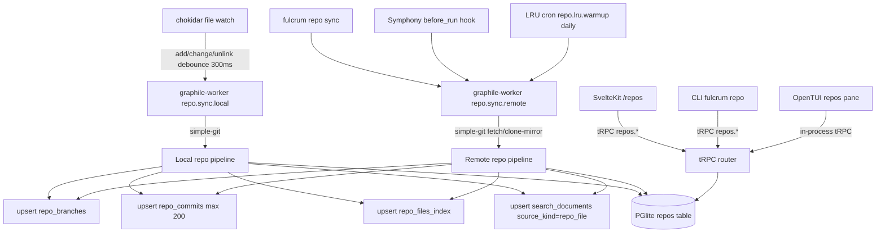
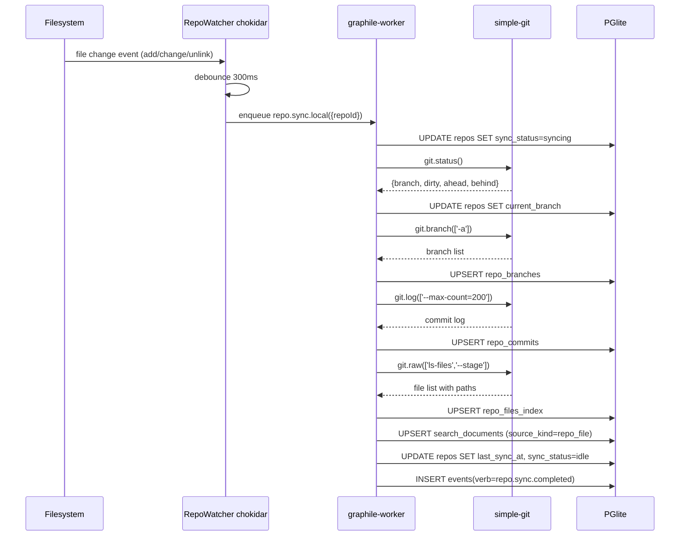

# PRD 9: Repos + Git Supervision

## Status: ready-for-plan-breakdown

## Linkage chain

| Dimension | Detail |
|---|---|
| Vision gaps | V-gap-21: no repository supervision; V-gap-22: no reactive file-watch sync; V-gap-23: no git log/diff/blame surfaces |
| Requirements pillar | Pillar 9 — Repos + Git Supervision (`REQUIREMENTS.md §9`) |
| Key decisions | Q22 (composite org_id indexes); Q24 (repo state cached in DB; context bundle uses cached data); C1 (write-side gated for safety); C4 (three-surface parity); A2 (doctor coverage per pillar) |
| External specs | `simple-git` v3 MIT API docs; `chokidar` v4 MIT API docs; graphile-worker cron docs; `@octokit/rest` v21 MIT |

---

## Vision

First-class repository supervision. User verbatim: "covering supervising repositories … imagine it a jira + confluence clone." Every project owns N repos; every task may reference a repo. Local repos watched reactively via chokidar; remote repos synced on-demand (Symphony `before_run` hook) + LRU background worker. Read-side git ops always-on; write-side (commit, push, PR) gated for safety. Multi-repo projects, file browser, branch manager, commit log, diff viewer, blame — all three surfaces, no MVP, no phase 2 (C1, C4).

---

## Out-of-scope

Per C5: no feature mentioned in any locked decision, research finding, or verbatim ask may appear here. Items below fall strictly into carve-out (1) (not in any ask/decision) or carve-out (2) (owned by another pillar).

- **Code review / inline PR review UI** — not in user's verbatim ask. Excluded until the user requests it.
- **CI/CD pipeline integration** — not in verbatim ask. Excluded until asked.
- **Owned by Pillar 3 (Symphony):** `before_run` hook calling `fulcrum repo sync`; repo state injected into agent context bundle. This pillar exposes the sync API; Pillar 3 is the caller.
- **Owned by Pillar 11 (Search):** full-text indexing of repo file contents. This pillar writes `repo_files_index` rows and emits `search_documents` upsert events; Pillar 11 owns the FTS pipeline.
- **Owned by Pillar 13 (API Gateway):** public REST `/api/v1/repos/*` routes. tRPC `repos.*` procedures are always-on internal; public REST wrapping is Pillar 13.

---

## Always-on features

### Schema layer
Migration `0009_repos_git`. Full DDL in §Schema changes below. Tables: `repos` (extended), `repo_branches`, `repo_commits`, `repo_files_index`. Amendment: `tasks.repo_id`. Composite `(org_id, …)` indexes on all tables per Q22.

### Local-repo watcher (chokidar)
`src/repos/watcher.ts` — `RepoWatcher` class:
- One `chokidar.watch(local_path, { ignoreInitial: false, persistent: true })` per `kind='local'` repo row.
- On `add|change|unlink` events: debounce 300 ms → enqueue `repo.sync.local` graphile-worker job for the repo.
- On `fulcrum` start: `WatcherRegistry.startAll()` instantiates watchers for all active local repos.
- `fulcrum repo add --path <dir>` + `fulcrum repo remove` call `WatcherRegistry.start(id)` / `.stop(id)` live.
- Memory: one watcher per repo, closed on shutdown via `close()`.

### Sync worker — local repos
`src/repos/workers/sync-local.ts` (graphile-worker task `repo.sync.local`):
1. `simple-git(local_path).status()` → update `repos.current_branch`, `repos.sync_status='syncing'`.
2. `git.branch(['-a'])` → upsert `repo_branches`.
3. `git.log(['--max-count=200'])` → upsert `repo_commits` (last 200 commits on current branch).
4. `git.raw(['ls-files', '--stage'])` → bulk upsert `repo_files_index` (paths + sizes; `kind` inferred from trailing `/`).
5. Upsert `search_documents` rows (source_kind=`repo_file`, body=path) for Pillar 11 pickup.
6. Update `repos.last_sync_at`, `repos.sync_status='idle'`, `repos.last_touched_at=now()`.
7. On error: `repos.sync_status='error'` + emit `event(verb='repo.sync.failed')`.

### Sync worker — remote repos (on-demand + LRU)
`src/repos/workers/sync-remote.ts` (graphile-worker task `repo.sync.remote`):
- Triggered by: (a) Symphony `before_run` hook via `fulcrum repo sync --repo <id>` subprocess call, (b) explicit `fulcrum repo sync --repo <id>`, (c) daily LRU cron.
- Performs: `git fetch --all --prune` on a locally-cloned mirror path (`~/.fulcrum/repos/<org>/<repo_slug>`). If no local mirror yet: `git clone --mirror`. Then runs the same branch/commit/files pipeline as sync-local.
- Daily LRU cron (graphile-worker `repo.lru.warmup` every 24 h): selects top-5 repos by `last_touched_at DESC WHERE kind='remote'`, enqueues `repo.sync.remote` for each.
- `last_touched_at` updated on every interaction: sync, file read, agent run referencing the repo.

### Git operations via simple-git (always-on, read-side)
`src/repos/git.ts` wrappers: `getStatus`, `listBranches`, `createBranch`, `checkoutBranch`, `deleteBranch`, `getCommitLog` (paginated; DB-first, live fallback), `getCommitDiff` (`git show --stat --patch`), `getBlame` (per-line `{sha,author,line}`), `getFileTree` (DB-first, `git ls-tree` fallback), `getFileContent` (`git show <branch>:<path>`, MIME-sniffed), `getStashList`. `searchInRepo` delegates to Pillar 11 FTS on `search_documents WHERE source_kind='repo_file'`.

### Multi-repo project support
`projects` ↔ `repos` 1-to-N via `repos.project_id`. `tasks.repo_id` FK scopes a task to a repo (NULL = agnostic). Context bundle (Pillar 3/Q18): task with `repo_id` includes branch, last 20 commits, `git status` from sync record.

### tRPC procedures (`repos.*`)
`repos.list`, `repos.get`, `repos.add`, `repos.update`, `repos.remove`, `repos.sync`, `repos.branches.list`, `repos.branches.create`, `repos.branches.checkout`, `repos.branches.delete`, `repos.commits.list`, `repos.commits.get`, `repos.files.tree`, `repos.files.content`, `repos.blame`, `repos.status`, `repos.stash.list`. All return typed Zod-validated responses. All mutations emit `events` rows.

---

## Gated features

| Feature | Flag | What activates |
|---|---|---|
| `connector-github` | `connector-github` | Full GitHub API metadata sync: PRs, issues, releases, workflows, check-runs. One-way pull via Octokit REST. Upserts to `repo_branches` (PR branches), dedicated `github_prs` + `github_issues` tables (migration `0009b`). Cron: daily graphile-worker job syncs open PRs/issues for all GitHub-remote repos. OAuth token stored in `org_settings`. |
| `connector-gitlab` | `connector-gitlab` | Same as above for GitLab API v4. `gitlab_mrs` + `gitlab_issues` tables. PAT or OAuth token. |
| `connector-bitbucket` | `connector-bitbucket` | Same for Bitbucket API 2.0. `bb_prs` + `bb_issues` tables. App password or OAuth. |
| `repo-write-ops` | `repo-write-ops` | Enables write-side git operations (OFF by default, safety gate): `git.commit(repoId, message, files)`, `git.push(repoId, branch, force)`, `git.openPR(repoId, …)` (calls connector if active). Exposed on all three surfaces. Commit triggers `repo.sync.local` worker immediately. |

---

## Tech stack

| Layer | Pick | Rationale | Failure gate → action |
|---|---|---|---|
| Git operations | `simple-git` v3 (MIT, ~5k stars) | Pure JS, Promise-based, full Git porcelain, widely used, no native bindings | If porcelain gaps found → fall back to `nodegit` (libgit2 bindings, LGPL) for the specific call; keep simple-git as default |
| Filesystem watcher | `chokidar` v4 (MIT, ~12k stars) | Bun-compatible, native FS events, debounce built-in, widely used | If chokidar leaks handles on macOS FSEvents → fall back to `@parcel/watcher` (MIT, Parcel team) |
| Background jobs | `graphile-worker` (MIT) — already locked in Pillar 1 | Postgres-backed; deduplication on `key`; cron support | No secondary needed; already locked |
| Syntax highlight | `Shiki` v1 (MIT) — already in Pillar 7 (Docs) | WASM, same instance reused | If WASM size is a concern in TUI → fall back to `highlight.js` subset bundle |
| GitHub connector | `@octokit/rest` v21 (MIT) | Official, typed, handles pagination + rate limits | If GitHub changes OAuth flow → fall back to raw `xh` calls under a thin adapter |
| GitLab/Bitbucket connectors | `@gitbeaker/rest` (GitLab, MIT) + `bitbucket.js` (Bitbucket, MIT) | Official community clients | If unmaintained → raw `xh` under thin adapter |

---

## Schema changes

```sql
-- migration 0009_repos_git

-- Extend repos
ALTER TABLE repos
  ADD COLUMN name          text         NOT NULL DEFAULT '',
  ADD COLUMN slug          text         NOT NULL DEFAULT '',
  ADD COLUMN kind          text         NOT NULL DEFAULT 'local' CHECK (kind IN ('local','remote')),
  ADD COLUMN local_path    text,
  ADD COLUMN remote_url    text,
  ADD COLUMN default_branch text        NOT NULL DEFAULT 'main',
  ADD COLUMN current_branch text        NOT NULL DEFAULT 'main',
  ADD COLUMN last_sync_at  timestamptz,
  ADD COLUMN sync_status   text         NOT NULL DEFAULT 'idle' CHECK (sync_status IN ('idle','syncing','error')),
  ADD COLUMN last_touched_at timestamptz NOT NULL DEFAULT now(),
  ADD COLUMN archived      boolean      NOT NULL DEFAULT false;

CREATE UNIQUE INDEX repos_org_slug ON repos (org_id, slug);
CREATE INDEX repos_org_touched  ON repos (org_id, last_touched_at DESC);
CREATE INDEX repos_kind_status  ON repos (kind, sync_status);

-- repo_branches
CREATE TABLE repo_branches (
  id            text PRIMARY KEY,
  repo_id       text NOT NULL REFERENCES repos(id) ON DELETE CASCADE,
  org_id        uuid NOT NULL REFERENCES orgs(id),
  name          text NOT NULL,
  head_sha      text,
  is_default    boolean NOT NULL DEFAULT false,
  is_current    boolean NOT NULL DEFAULT false,
  last_seen_at  timestamptz NOT NULL DEFAULT now()
);
CREATE UNIQUE INDEX repo_branches_repo_name ON repo_branches (repo_id, name);
CREATE INDEX repo_branches_org_repo ON repo_branches (org_id, repo_id);

-- repo_commits
CREATE TABLE repo_commits (
  id            text PRIMARY KEY,
  repo_id       text NOT NULL REFERENCES repos(id) ON DELETE CASCADE,
  org_id        uuid NOT NULL REFERENCES orgs(id),
  sha           text NOT NULL,
  author_name   text,
  author_email  text,
  committed_at  timestamptz NOT NULL,
  subject       text,
  body          text,
  parents       text[]
);
CREATE UNIQUE INDEX repo_commits_repo_sha ON repo_commits (repo_id, sha);
CREATE INDEX repo_commits_repo_date ON repo_commits (repo_id, committed_at DESC);
CREATE INDEX repo_commits_org_repo ON repo_commits (org_id, repo_id);

-- repo_files_index
CREATE TABLE repo_files_index (
  id              text PRIMARY KEY,
  repo_id         text NOT NULL REFERENCES repos(id) ON DELETE CASCADE,
  org_id          uuid NOT NULL REFERENCES orgs(id),
  path            text NOT NULL,
  kind            text NOT NULL DEFAULT 'file' CHECK (kind IN ('file','dir')),
  size_bytes      bigint,
  last_modified   timestamptz,
  last_indexed_at timestamptz NOT NULL DEFAULT now()
);
CREATE UNIQUE INDEX repo_files_repo_path ON repo_files_index (repo_id, path);
CREATE INDEX repo_files_org_repo ON repo_files_index (org_id, repo_id, kind);

-- tasks amendment
ALTER TABLE tasks ADD COLUMN repo_id text REFERENCES repos(id);
CREATE INDEX tasks_org_repo ON tasks (org_id, repo_id);
```

---

## Surfaces (Web, CLI, TUI, API)

### Web (SvelteKit routes, shadcn-svelte)
Routes: `/repos`, `/repos/<id>`, `/repos/<id>/branches`, `/repos/<id>/commits`, `/repos/<id>/commits/<sha>`, `/repos/<id>/files`, `/repos/<id>/files/*`, `/projects/<id>/repos`. File tree: recursive `<TreeNode>`, lazy-load. Diff: `diff2html` unified/split. Blame: `<BlameView>` with SHA nav. Sync badge: spinner + error hover. `repo-write-ops` ON: Commit/Push/New-PR in branch toolbar.

### CLI (`fulcrum repo <verb>`)
Auto-generated from tRPC schema (Q-cli-shape). All commands support `--json` output.

| Command | Description |
|---|---|
| `fulcrum repo add [--path \| --url] [--project-id] [--name]` | Register local or remote repo |
| `fulcrum repo list [--project-id] [--json]` | List repos with sync status |
| `fulcrum repo show <id\|slug>` | Detail: branches, last sync, open tasks |
| `fulcrum repo sync <id\|slug>` | Trigger on-demand sync |
| `fulcrum repo branches <id>` | List branches |
| `fulcrum repo branch-create <id> <name> [--from]` | Create branch |
| `fulcrum repo checkout <id> <branch>` | Checkout branch |
| `fulcrum repo branch-delete <id> <name> [--force]` | Delete branch |
| `fulcrum repo commits <id> [--branch] [--page] [--limit]` | Paginated commit log |
| `fulcrum repo diff <id> <sha>` | Commit diff |
| `fulcrum repo blame <id> <file> [--branch]` | Blame output |
| `fulcrum repo files <id> [--path] [--branch]` | File tree listing |
| `fulcrum repo cat <id> <file> [--branch]` | File content to stdout |
| `fulcrum repo status <id>` | Working tree status |
| `fulcrum repo stash-list <id>` | Stash list |
| `fulcrum repo remove <id> [--unregister-only\|--delete-mirror]` | Remove repo registration |

### TUI (OpenTUI, `fulcrum tui`)
Repos browser pane in main nav. Layout: repo list (left) | branches (top-right) + commit log (bottom-left) + file tree (bottom-right). Keys: `n` new branch, `x` delete, `Enter` checkout/open file, `d` diff, `b` blame. Status bar: branch + last sync + dirty. `repo-write-ops` ON adds `c` commit + `p` push. ASCII diff in scrollable buffer.

### API (tRPC internal, OpenAPI gated)
All `repos.*` tRPC procedures always-on. `public-api` ON (Pillar 13): REST `GET|POST|PUT|DELETE /api/v1/repos[/:id[/branches|commits|files|files/*]]`. Write-ops endpoints additionally require `repo-write-ops`.

---

## Technical design

### Architecture



### Sequence: chokidar watch to DB updated



### Error model

| Code | Description | Propagated to | Recovery |
|---|---|---|---|
| `REPO_SYNC_FAILED` | `simple-git` throws during sync pipeline | `repos.sync_status=error`; `events(verb=repo.sync.failed)` | Check repo path; verify git available |
| `CHOKIDAR_HANDLE_LEAK` | macOS FSEvents memory >50 MB/h | Doctor warn; swap to `@parcel/watcher` | See failure gates |
| `REMOTE_CLONE_FAILED` | `git clone --mirror` fails | `repos.sync_status=error` | Check `remote_url`; network; auth |
| `MIRROR_DISK_FULL` | `~/.fulcrum/repos/` >10 GB | Doctor alert | `fulcrum repo prune-mirror <id>` |
| `WRITE_OP_GATED` | Write op attempted without `repo-write-ops` flag | tRPC `FEATURE_GATED` error | Enable flag `FULCRUM_FEATURES=repo-write-ops` |

### Observability

| Signal | Name | Fields |
|---|---|---|
| OTel span | `fulcrum.repo.sync.local` | `repo_id`, `branch`, `commit_count`, `file_count`, `duration_ms` |
| OTel span | `fulcrum.repo.sync.remote` | `repo_id`, `remote_url`, `fetch_duration_ms` |
| Log event | `repo.watcher.started` | `repo_id`, `local_path` |
| Log event | `repo.lru.warmup` | `selected_repo_ids`, `enqueued_count` |
| Log event | `repo.sync.failed` | `repo_id`, `error` |

### Performance budgets

| Operation | p50 | p95 |
|---|---|---|
| Chokidar event to sync job enqueued | <350 ms | <600 ms |
| `repo.sync.local` full pipeline | <3 s | <10 s |
| `repo.sync.remote` (10k commits) | <10 s | <30 s |
| `repos.files.tree` tRPC (1k files) | <50 ms | <150 ms |
| `repos.commits.list` paginated (50 rows) | <30 ms | <80 ms |

## Doctor integration

Subsystem: `repos`

```typescript
const DoctorReposCheck = z.object({
  subsystem: z.literal('repos'),
  checks: z.array(z.object({
    id: z.string(),
    status: z.enum(['pass', 'warn', 'fail']),
    message: z.string(),
    durationMs: z.number().optional(),
    metadata: z.record(z.unknown()).optional(),
  })),
  ok: z.boolean(),
});
```

| Check ID | What it verifies | Failure recovery |
|---|---|---|
| `repos.schema.migration` | `repo_branches`, `repo_commits`, `repo_files_index` tables present | Run migration 0009 |
| `repos.count` | Number of registered repos; 0 is warn not fail | `fulcrum repo add --path <dir>` |
| `repos.sync.errors` | Count of repos with `sync_status=error` | Check failing repos with `fulcrum repo show <id>` |
| `repos.watcher.running` | Count of active chokidar watchers matches local-kind repos | Restart `fulcrum` to reinitialize watchers |
| `repos.git.available` | `git --version` exits 0 | Install git |
| `repos.mirror.diskUsage` | `~/.fulcrum/repos/` total size | `fulcrum repo prune-mirror` if >10 GB |
| `repos.github.token` | If `connector-github` ON: `GITHUB_TOKEN` set | Set env var |

## Dependencies

| Pillar | Direction | What is needed |
|---|---|---|
| Pillar 1 (Foundation) | depends-on | `orgs`, `users`, feature flags registry, tRPC core, graphile-worker bootstrap |
| Pillar 3 (Symphony) | depended-on-by | Symphony `before_run` hook calls `fulcrum repo sync --repo <id>`; this pillar exports the sync CLI entry |
| Pillar 4 (Sandcastle) | no dependency | Independent |
| Pillar 11 (Search) | depended-on-by | This pillar writes `search_documents` rows with `source_kind='repo_file'`; Pillar 11 indexes them |
| Pillar 7 (Docs/Editor) | depended-on-by | Shiki instance shared if shipped first; otherwise this pillar vendors its own |

---

## Issues breakdown (TDD numbered)

Each issue: RED test first → GREEN implementation → refactor/review.

| # | Title | Layer |
|---|---|---|
| 09-01 | Migration `0009_repos_git`: schema + indexes + tasks.repo_id amendment | DB |
| 09-02 | `RepoRepository`: tRPC-ready CRUD wrappers + event emission for `repos` table | DB/tRPC |
| 09-03 | `BranchRepository` + `CommitRepository` + `FileIndexRepository`: CRUD + upsert bulk | DB |
| 09-04 | `simple-git` wrapper `src/repos/git.ts`: status, branch list, log, diff, blame, file tree, file content, stash | Git |
| 09-05 | Sync worker `repo.sync.local`: full pipeline (status → branches → commits → file index → search_documents → events) | Worker |
| 09-06 | Sync worker `repo.sync.remote`: clone-mirror + fetch + same pipeline | Worker |
| 09-07 | LRU warmup cron `repo.lru.warmup`: top-5 by `last_touched_at`, enqueue sync jobs | Worker |
| 09-08 | `RepoWatcher` (`chokidar`): start/stop per repo, debounce, enqueue sync job, WatcherRegistry | Watcher |
| 09-09 | `fulcrum repo add|remove|list|show|sync|status` CLI verbs | CLI |
| 09-10 | `fulcrum repo branches|branch-create|checkout|branch-delete` CLI verbs | CLI |
| 09-11 | `fulcrum repo commits|diff|blame|files|cat|stash-list` CLI verbs | CLI |
| 09-12 | tRPC `repos.*` procedures (all read + write, incl. gated write-ops guard) | tRPC |
| 09-13 | Web: `/repos` list + `/repos/<id>` dashboard routes + shadcn components | Web |
| 09-14 | Web: `/repos/<id>/branches` + branch CRUD actions | Web |
| 09-15 | Web: `/repos/<id>/commits` paginated log + `/repos/<id>/commits/<sha>` diff view | Web |
| 09-16 | Web: `/repos/<id>/files` tree + `/repos/<id>/files/*` content + blame view | Web |
| 09-17 | Web: `/projects/<id>/repos` scoped view + add-repo action | Web |
| 09-18 | TUI repos browser pane: list + branch/commit/file-tree panels + keyboard ops | TUI |
| 09-19 | `connector-github` adapter: Octokit sync of PRs/issues/workflows → `github_prs`/`github_issues` tables | Gated |
| 09-20 | `connector-gitlab` adapter: GitLab API sync → `gitlab_mrs`/`gitlab_issues` tables | Gated |
| 09-21 | `connector-bitbucket` adapter: Bitbucket API sync → `bb_prs`/`bb_issues` tables | Gated |
| 09-22 | `repo-write-ops` gate: commit + push + PR-open behind flag; CLI + Web + TUI surfaces | Gated |
| 09-23 | Playwright e2e: repo add (local), sync, file browse, branch create | Tests |
| 09-24 | Performance: benchmark watcher startup for 20 repos; graphile-worker sync throughput | Perf |
| 09-25 | Doctor integration: repos section (count, sync errors, watcher status) | Doctor |

---

## Failure gates

| Gate | Trigger | Fallback |
|---|---|---|
| `simple-git` gap | Needed op missing | `git.raw([...])` for that call; if brittle → `nodegit` for that command only |
| chokidar leak | macOS FSEvents mem > 50 MB/h with > 5 repos | Swap to `@parcel/watcher`, same wrapper |
| graphile throughput | Queue > 100 pending | Concurrency 3 → 10; add dedicated `repos` worker pool |
| PGlite file index | `repo_files_index` > 500k rows, query slow | Partial index `WHERE kind='file'`; VACUUM ANALYZE |
| Octokit 429 | GitHub rate limit on sync | Exponential backoff with `X-RateLimit-Reset`; serve cached rows until reset |
| Mirror disk | `~/.fulcrum/repos/` > 10 GB | Doctor alert; `fulcrum repo prune-mirror <id>` |

---

## Acceptance criteria (incl. all-three-surfaces parity)

1. Migration `0009_repos_git` applies clean on PGlite + PostgreSQL; composite indexes present; `tasks.repo_id` added without data loss.
2. Local watcher: file change in repo → `repo_branches`/`repo_commits`/`repo_files_index` updated within 1 s.
3. Remote sync: `fulcrum repo sync --repo <id>` completes < 30 s for < 10k commits; branches + commits in DB.
4. LRU cron: selects top-5 by `last_touched_at`; verified via job_queue assertion.
5. `simple-git` wrappers: unit tests with fixture git repo cover status, branch list, log, diff, blame, file tree, file content.
6. Web parity: all 8 routes render correct data; Playwright e2e green.
7. CLI parity: every verb returns `--json` output matching tRPC schema; no verb missing.
8. TUI parity: repos pane lists repos; file tree/commit log/branch ops work with keyboard; smoke-test checklist passes.
9. `connector-github` ON + test PAT: `github_prs` + `github_issues` populated; flag OFF → zero API calls.
10. `repo-write-ops` OFF → `FEATURE_GATED` error on commit/push; ON → real commit created in fixture repo.
11. Doctor reports repos count, sync errors, watcher count.
12. After sync: `search_documents` rows with `source_kind='repo_file'` exist; FTS on filename returns them.
13. Three-surface parity: branch created via CLI visible in Web + TUI immediately; file changed on disk reflected in all three after watcher fires.
