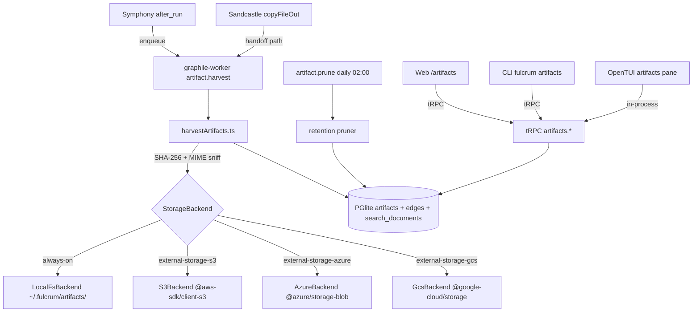
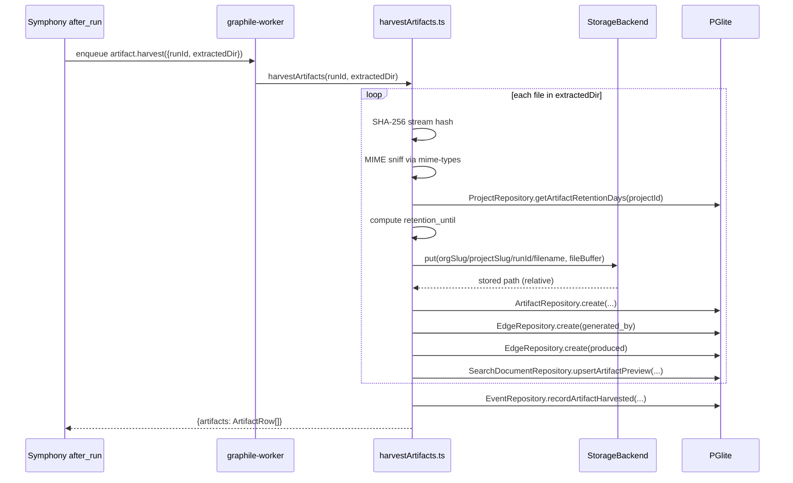

# PRD 10: Artifacts

## Status: ready-for-plan-breakdown

## Linkage chain

| Dimension | Detail |
|---|---|
| Vision gaps | V-gap-24: no artifact management; V-gap-25: no file retention policies; V-gap-26: no artifact search indexing |
| Requirements pillar | Pillar 10 — Artifacts (`REQUIREMENTS.md §10`) |
| Key decisions | Q25 (artifact store local-fs always-on; S3/Azure/GCS gated); Q22 (composite org_id indexes); D1 (edges table for artifact-run-task relationships); C1 (storage backends ship gated); A2 (doctor coverage per pillar) |
| External specs | Symphony `SPEC.md §after_run` hook; Sandcastle `copyFileOut()` API; `mime-types` v3 MIT; `@aws-sdk/client-s3` v3 Apache-2.0 |

---

## Vision

First-class artifact management layer. Every agent run may produce files; those files are harvested automatically by the Symphony `after_run` hook via Sandcastle `copyFileOut()`, indexed for search, linked to their producing run and task via the edges graph, and surfaced on all three surfaces with preview, download, and manual upload. Retention policies per project prevent unbounded disk growth. Manual upload from human users attaches arbitrary files to tasks, docs, or runs. Storage backend is local-fs always-on; S3-compatible backends ship gated. Three-surface parity (Web + CLI + TUI) — no MVP, no phase 2 (C1, C4, Q25).

---

## Out-of-scope

Per C5: no feature mentioned in any locked decision, research finding, or verbatim ask may appear here. Items below fall strictly into carve-out (1) (not in any ask/decision) or carve-out (2) (owned by another pillar).

- **Artifact diffing / version comparison** — not in user's verbatim ask; excluded until asked.
- **Owned by Pillar 3 (Symphony):** wiring the `after_run` lifecycle hook that calls `copyFileOut()` and then calls the harvest API. This pillar exposes `artifacts.harvest()` tRPC procedure + graphile-worker task; Pillar 3 is the hook caller.
- **Owned by Pillar 4 (Sandcastle):** `copyFileOut()` implementation extracting files from the sandbox. This pillar consumes the extracted files at a handoff path; Pillar 4 owns the extraction.
- **Owned by Pillar 11 (Search):** full-text indexing of artifact text content. This pillar writes `search_documents` rows with preview body; Pillar 11 owns the FTS pipeline.
- **Owned by Pillar 13 (API Gateway):** public REST `/api/v1/artifacts/*` routes. tRPC `artifacts.*` are always-on internal; public REST is Pillar 13.

---

## Always-on features

### Schema layer
Migration class `Migration<timestamp>` extends and tightens the existing `Artifact` entity, adds retention properties, and registers the prune-jobs schedule.

**`artifacts` (extended)**:
- `id` text PK (ULID), `org_id` uuid NOT NULL FK→orgs, `run_id` text NULL FK→agent_runs ON DELETE SET NULL, `task_id` text NULL FK→tasks ON DELETE SET NULL, `project_id` text NULL FK→projects ON DELETE SET NULL, `filename` text NOT NULL, `mime` text NOT NULL DEFAULT 'application/octet-stream', `size_bytes` bigint NOT NULL DEFAULT 0, `path` text NOT NULL (relative to artifact store root), `checksum_sha256` text NOT NULL, `metadata_json` jsonb NOT NULL DEFAULT '{}', `archived` boolean NOT NULL DEFAULT false, `retention_until` timestamptz NULL (NULL = keep forever), `created_at` timestamptz NOT NULL DEFAULT now().
- Composite indexes: `(org_id, project_id, created_at DESC)`, `(org_id, run_id)`, `(org_id, task_id)`, `(checksum_sha256)` (dedup detection), `(retention_until) WHERE retention_until IS NOT NULL` (pruner query), `(org_id, archived, created_at DESC)`.

**`projects` amendment**: add `artifact_retention_days integer NULL` (NULL = keep forever). Default for scratch-type projects recommended as 90 days; enforced at harvest time.

**Edges wiring**: two `edges` rows per harvested artifact (already exists; no new columns):
- `(from_kind='artifact', from_id=artifact.id, to_kind='agent_run', to_id=run_id, kind='generated_by')`.
- `(from_kind='agent_run', from_id=run_id, to_kind='artifact', to_id=artifact.id, kind='produced')`.
Manual upload edges: `(from_kind='artifact', from_id=artifact.id, to_kind=<task|doc|run>, to_id=<id>, kind='attached_to')`.

### Artifact store layout (always-on: local-fs)
Root: `~/.fulcrum/artifacts/`. Deterministic path per artifact:
```
~/.fulcrum/artifacts/<org_slug>/<project_slug_or_global>/<run_id_or_manual>/<filename>
```
- Collision: if filename exists, append `_<ulid_suffix>` before extension.
- `artifacts.path` column stores the path **relative** to `~/.fulcrum/artifacts/` so the root can be remapped (e.g. to S3 mount) without row updates.
- Store root resolved via `FULCRUM_ARTIFACT_STORE` env var (default `~/.fulcrum/artifacts/`).

### Harvest pipeline
`src/artifacts/harvest.ts` — `harvestArtifacts(runId, extractedDir)` runs TS-side through repositories and injectable services:
1. Read `extractedDir` (handoff path from Sandcastle `copyFileOut()`); enumerate files recursively.
2. For each file: compute SHA-256 via `node:crypto`; sniff MIME via `mime-types`; read `size_bytes`.
3. Resolve `retention_until` from `projects.artifact_retention_days` (if set: `now() + days`).
4. Copy file to artifact store path; call `ArtifactRepository.create(...)`; call `EdgeRepository.createMany(...)`.
5. Call `SearchDocumentRepository.upsertArtifactPreview(...)`: `source_kind='artifact'`, `source_id=artifact.id`, `title=filename`, `body=<first 2000 chars if text-mime else empty>`.
6. Call `EventRepository.recordArtifactHarvested(...)`.
7. Return `{ artifacts: ArtifactRow[] }` for Symphony hook response.

Called via graphile-worker task `artifact.harvest` (payload: `{ runId, extractedDir }`) — decoupled from Symphony `after_run` hook which simply enqueues the job and returns immediately.

### Retention + pruner
- `artifact.prune` graphile-worker cron (daily at 02:00): calls `ArtifactRepository.findPastRetention(...)`; deletes files from disk through `StorageBackend`; archives via `ArtifactRepository.archive(...)` (soft-delete first); after 7 days second pass hard-deletes rows.
- `fulcrum artifacts prune [--dry-run] [--project-id]` — manual trigger; `--dry-run` prints what would be deleted.
- Doctor reports: total artifact count, total disk usage, count past `retention_until`, count archived.

### Manual upload + preview + CRUD
**Upload**: Web drag-drop widget on task/run/doc detail; CLI `fulcrum artifacts upload`; TUI `u` hotkey. `FULCRUM_ARTIFACT_MAX_SIZE_MB` (default: unlimited). Multipart → artifact row + `attached_to` edges row.

**Preview**: text-MIME → Shiki inline (Web) / `bat` (CLI) / scrollable buffer (TUI); image → `` (Web) / dimensions (CLI) / Sixel if supported (TUI); binary → download-only. MIME via `mime-types` + `file` fallback.

**Archive/delete**: `archive`, `unarchive`, `delete [--hard]` on all surfaces. Bulk archive/delete in Web list. `a`/`D` keys in TUI (confirm prompt).

### tRPC procedures (`artifacts.*`)
`artifacts.list` (filters: org, project, run, task, archived, mime, date range), `artifacts.get`, `artifacts.upload` (multipart handled by SvelteKit action; tRPC procedure takes metadata), `artifacts.attach`, `artifacts.detach`, `artifacts.archive`, `artifacts.unarchive`, `artifacts.delete`, `artifacts.prune` (manual trigger), `artifacts.harvest` (internal; called by Symphony hook). All return typed Zod responses. All mutations emit `events` rows.

---

## Gated features

| Feature | Flag | What activates |
|---|---|---|
| `external-storage-s3` | `external-storage-s3` | Pushes harvested artifacts to S3-compatible store (MinIO, R2, S3, B2). `FULCRUM_S3_ENDPOINT`, `FULCRUM_S3_BUCKET`, `FULCRUM_S3_ACCESS_KEY`, `FULCRUM_S3_SECRET_KEY`. `artifacts.path` stores the S3 key (same relative path). Reads go through S3 presigned URL or proxy. `@aws-sdk/client-s3` (Apache-2.0). Local-fs copy skipped. |
| `external-storage-azure` | `external-storage-azure` | Azure Blob Storage. `FULCRUM_AZURE_CONN_STRING`, `FULCRUM_AZURE_CONTAINER`. `@azure/storage-blob` (MIT). Same path abstraction as S3. |
| `external-storage-gcs` | `external-storage-gcs` | Google Cloud Storage. `FULCRUM_GCS_BUCKET`, `FULCRUM_GCS_KEY_FILE`. `@google-cloud/storage` (Apache-2.0). Same path abstraction. |
| `report-llm-narration` | `report-llm-narration` | Inference sidecar (Pillar 2) generates a plain-language description / content summary for each artifact post-harvest. Stored in `artifacts.metadata_json.narration`. Displayed in Web artifact detail. Gated; off by default; uses `FULCRUM_FEATURES=report-llm-narration` + inference sidecar must be running. |

Backend abstracted: `src/artifacts/storage.ts` `StorageBackend` interface (`put/get/delete/exists`). `LocalFsBackend` always-on; cloud backends implement same interface.

---

## Tech stack

### Stack
- C7: MikroORM v7 owns `Artifact` and `ArtifactLifecycle` entity classes; migration output is `src/db/migrations/Migration<timestamp>.ts`.
- C8: `StorageBackend`, `LocalFsBackend`, S3/R2/GCS/Azure backends, harvest, and pruner are `@Injectable()` services resolved through needle-di.
- C9: artifacts entities live under `src/db/entities/artifacts/`; repositories under `src/db/repositories/artifacts/`; no hand-authored migration-file paths.
- Harvest pipeline is TS-side repository/service code; storage backend stays swappable and does not own schema.

| Layer | Pick | Rationale | Failure gate → action |
|---|---|---|---|
| MIME detection | `mime-types` v3 (MIT, npm) + `node:crypto` for SHA-256 | Zero deps, fast, correct MIME map | If MIME wrong for edge cases → add `file-type` v19 (MIT) as secondary sniff for binary formats |
| Checksum | `node:crypto` `createHash('sha256')` streaming | Built-in, no extra dep | No fallback needed |
| Local storage | `node:fs/promises` streaming writes | Built-in, no dep | If streaming writes cause issues on PGlite-in-browser future path → add `@isomorphic-git/lightning-fs` adapter |
| S3 backend | `@aws-sdk/client-s3` v3 modular (Apache-2.0) | Works with MinIO/R2/B2 via `endpoint` override; tree-shakeable | If S3 SDK too heavy → fall back to `@vercel/blob` or raw `xh` presigned upload |
| Azure backend | `@azure/storage-blob` v12 (MIT) | Official, SAS token + conn string support | If SDK size too large → raw `xh` with SAS URL |
| GCS backend | `@google-cloud/storage` v7 (Apache-2.0) | Official, service account JSON | If SDK size too large → raw `xh` with signed URL |
| Background jobs | `graphile-worker` (already locked, Pillar 1) | Deduplication, cron, Postgres-backed | No secondary needed |
| Syntax highlight | Shiki v1 (MIT, reused from Pillar 7/9) | Same WASM instance | If WASM unavailable in TUI → `highlight.js` subset |

---

## Schema changes

Migration class `Migration<timestamp>` is generated by MikroORM from entity decorator diffs.

```typescript
@Entity({ tableName: 'artifacts' })
@Index({ name: 'artifacts_org_project_date', properties: ['org', 'project', 'createdAt'] })
@Index({ name: 'artifacts_org_run', properties: ['org', 'run'] })
@Index({ name: 'artifacts_org_task', properties: ['org', 'task'] })
@Index({ name: 'artifacts_checksum', properties: ['checksumSha256'] })
@Index({ name: 'artifacts_retention', properties: ['retentionUntil'] })
@Index({ name: 'artifacts_org_archived_date', properties: ['org', 'archived', 'createdAt'] })
class Artifact {
  @PrimaryKey({ type: 'uuid' }) id = crypto.randomUUID();
  @ManyToOne(() => Org) org!: Org;
  @ManyToOne(() => AgentRun, { nullable: true }) run?: AgentRun;
  @ManyToOne(() => Task, { nullable: true }) task?: Task;
  @ManyToOne(() => Project, { nullable: true }) project?: Project;
  @Property() filename!: string;
  @Property({ default: 'application/octet-stream' }) mime = 'application/octet-stream';
  @Property({ type: 'bigint', default: 0 }) sizeBytes = 0n;
  @Property() path!: string;
  @Property() checksumSha256!: string;
  @Property({ type: 'json' }) metadataJson: Record<string, unknown> = {};
  @Property({ default: false }) archived = false;
  @Property({ nullable: true }) retentionUntil?: Date;
}

@Entity({ tableName: 'artifact_lifecycles' })
class ArtifactLifecycle {
  @PrimaryKey({ type: 'uuid' }) id = crypto.randomUUID();
  @ManyToOne(() => Artifact) artifact!: Artifact;
  @Enum(() => ArtifactLifecycleState) state!: ArtifactLifecycleState;
  @Property() recordedAt = new Date();
}
```

`Project` gains `artifactRetentionDays?: number` as a property extension owned by its entity. Partial retention behavior is encoded in repository methods plus the generated migration class.

---

## Surfaces (Web, CLI, TUI, API)

### Web (SvelteKit routes, shadcn-svelte)
Routes: `/artifacts` (list + filters), `/artifacts/<id>` (detail + preview + edges + narration if gated), `/runs/<id>/artifacts`, `/tasks/<id>/artifacts`, `/projects/<id>/artifacts` (disk usage). Upload widget (drag-drop + progress) on task/run/doc detail pages.

### CLI (`fulcrum artifacts <verb>`)
Auto-generated from tRPC schema. All support `--json`.

| Command | Description |
|---|---|
| `fulcrum artifacts list [--project-id] [--run-id] [--task-id] [--archived] [--json]` | List artifacts |
| `fulcrum artifacts show <id>` | Detail: path, MIME, size, checksum, edges |
| `fulcrum artifacts upload <file> [--task-id\|--run-id\|--doc-id] [--project-id]` | Upload + attach |
| `fulcrum artifacts download <id> [--out <path>]` | Download to local path |
| `fulcrum artifacts attach <id> --to-task\|--to-run\|--to-doc <target-id>` | Attach edge |
| `fulcrum artifacts detach <id> --from-task\|--from-run\|--from-doc <target-id>` | Remove attachment edge |
| `fulcrum artifacts archive <id>` | Soft-archive |
| `fulcrum artifacts unarchive <id>` | Restore |
| `fulcrum artifacts delete <id> [--hard]` | Delete (soft default) |
| `fulcrum artifacts prune [--dry-run] [--project-id]` | Run retention pruner |

### TUI (OpenTUI, `fulcrum tui`)
Artifacts pane: list (filename, MIME, size, attachment badge) + preview (text/Sixel-image/hex-binary). Keys: `u` upload, `d` download, `a` archive, `D` delete (confirm), `Enter` detail, `f` filter. Per-run/task artifacts accessible from Runs and Task panels.

### API (tRPC internal, OpenAPI gated)
All `artifacts.*` tRPC always-on. `public-api` ON: `GET|POST|DELETE /api/v1/artifacts[/:id[/download]]`. Cloud storage ON: download redirects to presigned URL.

---

## Technical design

### Architecture



### Sequence: after_run artifact harvest



### Error model

| Code | Description | Propagated to | Recovery |
|---|---|---|---|
| `ARTIFACT_DISK_FULL` | `ENOSPC` writing to local-fs | Clean partial file; no DB row written; `artifact.harvest.failed` event | Free disk space; check `FULCRUM_ARTIFACT_STORE` |
| `MIME_DETECT_FAILED` | `mime-types` returns null; `file` fallback also fails | `mime='application/octet-stream'` used | Add `file-type` v19 secondary magic-byte sniff |
| `S3_UPLOAD_FAILED` | S3 SDK throws network/creds error | Retry 3x backoff; `artifact.storage.degraded` event | Check `FULCRUM_S3_*` vars; network |
| `CHECKSUM_DEDUP` | Same `(run_id, filename, checksum)` already exists | Skip copy; reuse existing row | By design; two rows with same checksum allowed |
| `PRUNER_WRONG_RETENTION` | `retention_until` computed incorrectly | Dry-run always first; `--confirm` required | Check `artifact_retention_days` project setting |

### Observability

| Signal | Name | Fields |
|---|---|---|
| OTel span | `fulcrum.artifact.harvest` | `run_id`, `file_count`, `total_bytes`, `backend`, `duration_ms` |
| OTel span | `fulcrum.artifact.prune` | `candidates`, `pruned`, `dry_run`, `duration_ms` |
| OTel span | `fulcrum.artifact.upload` | `artifact_id`, `size_bytes`, `mime`, `backend` |
| Log event | `artifact.harvested` | `run_id`, `artifact_ids`, `total_bytes` |
| Log event | `artifact.storage.degraded` | `backend`, `error`, `fallback` |

### Performance budgets

| Operation | p50 | p95 |
|---|---|---|
| `harvestArtifacts` (3 files <1 MB each) | <300 ms | <1 s |
| `artifact.prune` cron (1000 candidates) | <2 s | <5 s |
| `artifacts.list` tRPC (50 rows) | <30 ms | <80 ms |
| `artifacts.upload` multipart (10 MB) | <3 s | <8 s |
| S3 presigned URL generation | <50 ms | <150 ms |

## Doctor integration

Subsystem: `artifacts`

```typescript
const DoctorArtifactsCheck = z.object({
  subsystem: z.literal('artifacts'),
  checks: z.array(z.object({
    id: z.string(),
    status: z.enum(['pass', 'warn', 'fail']),
    message: z.string(),
    durationMs: z.number().optional(),
    metadata: z.record(z.unknown()).optional(),
  })),
  ok: z.boolean(),
});
```

| Check ID | What it verifies | Failure recovery |
|---|---|---|
| `artifacts.schema.migration` | `Artifact` entity properties and indexes present through MikroORM metadata | Run migration class `Migration<timestamp>` covering artifacts |
| `artifacts.store.writable` | `FULCRUM_ARTIFACT_STORE` path exists and is writable | Create directory; check permissions |
| `artifacts.store.diskUsage` | Total artifact store size; warn if >5 GB | Prune old artifacts; set retention policy |
| `artifacts.count.past-retention` | Count of artifacts past `retention_until` not yet pruned | Run `fulcrum artifacts prune` |
| `artifacts.storage.backend` | Reports active backend (local-fs / s3 / azure / gcs) | Informational |
| `artifacts.s3.reachable` | If `external-storage-s3` ON: `ListBuckets` call succeeds | Check `FULCRUM_S3_*` env vars and credentials |
| `artifacts.prune.cron.registered` | `artifact.prune` cron job registered in graphile-worker | Check Pillar 1 graphile-worker setup |

## Dependencies

| Pillar | Direction | What is needed |
|---|---|---|
| Pillar 1 (Foundation) | depends-on | `orgs`, `users`, feature flags, tRPC core, graphile-worker bootstrap, `edges` table |
| Pillar 3 (Symphony) | depended-on-by | Symphony `after_run` hook enqueues `artifact.harvest` job; this pillar exposes the job handler + `artifacts.harvest` tRPC procedure |
| Pillar 4 (Sandcastle) | depended-on-by | Sandcastle `copyFileOut()` writes files to handoff path; this pillar reads from that path. Pillar 4 must be runnable for harvest e2e test |
| Pillar 11 (Search) | depended-on-by | This pillar writes `search_documents` rows with `source_kind='artifact'`; Pillar 11 owns FTS |
| Pillar 2 (Inference) | depends-on (gated) | `report-llm-narration` flag calls inference sidecar; Pillar 2 must be running for that path |

---

## Issues breakdown (TDD numbered)

Each issue: RED test first → GREEN implementation → refactor.

| # | Title | Layer |
|---|---|---|
| 10-01 | Migration class `Migration<timestamp>`: extend `Artifact` entity, add decorator indexes, add `Project.artifactRetentionDays` | DB |
| 10-02 | `ArtifactRepository`: CRUD wrappers + event emission + retention_until computation | DB/tRPC |
| 10-03 | `StorageBackend` interface + `LocalFsBackend` implementation (put/get/delete/exists) | Storage |
| 10-04 | `harvestArtifacts()`: SHA-256, MIME sniff, copy to store, DB row, edges rows, search_documents upsert | Harvest |
| 10-05 | `artifact.harvest` graphile-worker task + job enqueue from Symphony hook shim | Worker |
| 10-06 | Retention pruner `artifact.prune` cron: select expired, soft-delete files, archive rows | Worker |
| 10-07 | Manual upload server action: multipart → store → DB row → edges row | Upload |
| 10-08 | `fulcrum artifacts list|show|upload|download|attach|detach|archive|unarchive|delete|prune` CLI verbs | CLI |
| 10-09 | tRPC `artifacts.*` procedures (all verbs, gated flags respected) | tRPC |
| 10-10 | Web: `/artifacts` list route + filter panel + shadcn components | Web |
| 10-11 | Web: `/artifacts/<id>` detail route + preview panel (text/image/binary) + Shiki highlight | Web |
| 10-12 | Web: `/runs/<id>/artifacts` + `/tasks/<id>/artifacts` + `/projects/<id>/artifacts` routes | Web |
| 10-13 | Web: upload widget component (drag-drop + file picker + progress) embedded in task/run/doc detail | Web |
| 10-14 | TUI artifacts pane: list + preview + keyboard ops (`u`, `d`, `a`, `D`) | TUI |
| 10-15 | `S3Backend` implementation (`@aws-sdk/client-s3`): put/get/delete + presigned download | Gated |
| 10-16 | `AzureBackend` implementation (`@azure/storage-blob`) | Gated |
| 10-17 | `GcsBackend` implementation (`@google-cloud/storage`) | Gated |
| 10-18 | `report-llm-narration` hook: post-harvest inference sidecar call + metadata_json.narration write | Gated |
| 10-19 | Playwright e2e: upload via Web, download, attach to task, view on task detail, prune dry-run | Tests |
| 10-20 | Doctor integration: artifact count, disk usage, past-retention count, storage backend in use | Doctor |

---

## Failure gates

| Gate | Trigger | Fallback |
|---|---|---|
| MIME misidentify | Wrong MIME → wrong preview | Add `file-type` v19 as secondary magic-byte sniff |
| Disk full | `ENOSPC` on write | Clean partial file; emit `artifact.harvest.failed`; no DB row written |
| SHA-256 dedup | Same `(run_id, filename, checksum)` | Skip copy, reuse existing row; checksum column non-unique by design |
| S3 failure | Network/creds error | Retry 3× backoff; fall back to local-fs; emit `artifact.storage.degraded` |
| Harvest latency | > 10 s avg | Increase concurrency; stream SHA-256 for large files |
| Pruner bug | Wrong `retention_until` calc | Pruner always dry-runs to `~/.fulcrum/logs/prune-<date>.log`; requires `--confirm` to execute |

---

## Acceptance criteria (incl. all-three-surfaces parity)

1. Migration class `Migration<timestamp>` applies clean on PGlite + PostgreSQL; all decorator indexes present; `Project.artifactRetentionDays` added.
2. Harvest fixture (3 mixed files) → 3 artifact rows + correct SHAs + correct MIMEs + files on disk + 6 edges rows + 3 `search_documents` rows (text artifacts have non-empty body).
3. Retention: `artifact_retention_days=1`; prune cron soft-archives artifact + deletes file; dry-run logs candidates without deleting.
4. Manual upload: CLI upload → artifact row + `attached_to` edge; `list --task-id` returns it; Web `/tasks/<id>/artifacts` shows it; TUI shows attachment badge.
5. Web parity: all 5 routes render correct data; upload widget creates artifact; Playwright e2e green.
6. CLI parity: every verb returns `--json` matching tRPC schema; `prune --dry-run` prints candidates.
7. TUI parity: artifacts pane lists; `u`/`d`/`a`/`D` work; preview shows text content; smoke-test checklist passes.
8. S3 gate: MinIO + flag ON → file in MinIO bucket, not local-fs; download → presigned redirect. Flag OFF → local-fs only.
9. Narration gate: flag ON + sidecar running → `metadata_json.narration` populated; flag OFF → zero inference calls.
10. Doctor reports artifact count, disk usage, past-retention count, storage backend.
11. Three-surface parity: artifact uploaded via CLI visible in Web + TUI without restart; archived via Web reflected in CLI `--json` + TUI without restart.
12. Dedup: same file uploaded twice → two rows, same `checksum_sha256`, both queryable, neither silently dropped.
