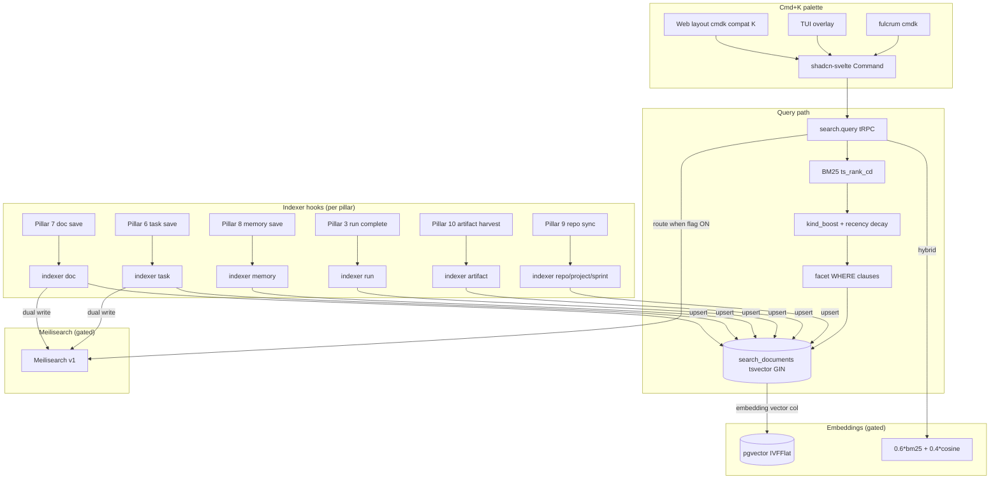
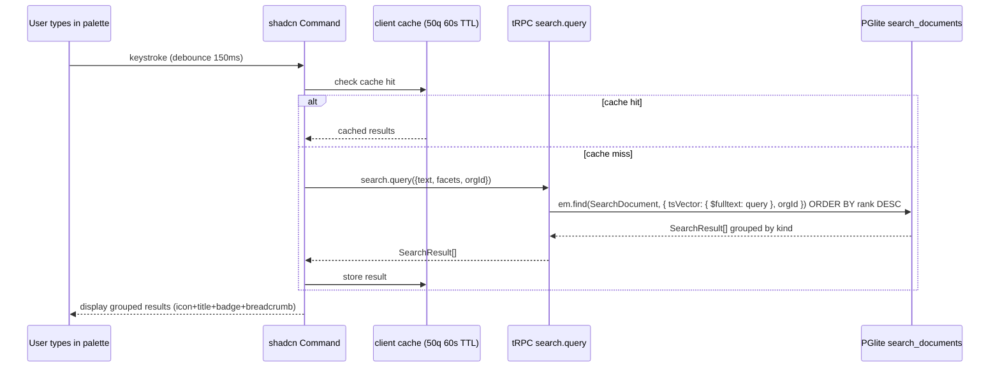

# PRD 11: Search + Facets + Saved Searches + Cmd+K Palette

## Status: ready-for-plan-breakdown

## Linkage chain

| Dimension | Detail |
|---|---|
| Vision gaps | V-gap-27: no unified cross-entity search; V-gap-28: no cmd+K palette; V-gap-29: no faceted filtering |
| Requirements pillar | Pillar 11 — Search + Facets + Saved Searches (`REQUIREMENTS.md §11`) |
| Key decisions | Q27 (unified search on `search_documents` denormalised table); Q10 (`saved_views` reused for saved searches with `view_type=search`); Q22 (composite org_id indexes); C1 (embeddings and Meilisearch gated); A2 (doctor coverage per pillar) |
| External specs | PGlite `tsvector` GIN index docs; `shadcn-svelte Command` Bits UI docs; pgvector IVFFlat index; Meilisearch v1 MIT API |

---

## Vision

Keyboard-first unified search across every Fulcrum entity. PGlite FTS over `search_documents` aggregates docs, tasks, memories, runs, artifacts, repos, projects, sprints. Cmd+K palette does search AND command dispatch on all three surfaces. Saved searches reuse Pillar 6 `saved_views`. BM25+recency ranking always-on; embeddings hybrid + Meilisearch backend gated. C4 parity: Web (`/search` + cmd+K) + CLI + TUI + API.

---

## Out-of-scope

C5 carve-out (2) — owned by another pillar:
- **Pillar 8:** per-task context bundle assembly (top-N memories for agent run). Pillar 8 owns retrieval scoring formula.
- **Pillar 7:** TipTap doc viewer + full-text preview rendering. This pillar indexes title/body/tags only.
- **Pillar 2:** embedding model lifecycle + backend selection.

C5 carve-out (1) — not in verbatim ask / no locked decision:
- **AI auto-tagging** — Q5b excluded.
- **Cross-tenant federated search** — not in any locked decision.

---

## Always-on features

Ships unconditionally, all surfaces.

### `search_documents` table + per-kind indexers

Denormalised write-optimised table (not a view — needs GIN index). Each owning pillar registers an indexer hook on entity save that upserts the row. This pillar owns the DDL + hook contract; each pillar owns its hook implementation.

```
kind        | source table  | title field     | body fields                  | owning pillar
------------+---------------+-----------------+------------------------------+--------------
doc         | docs          | title           | content + tags               | 7
task        | tasks         | title           | description + custom_fields  | 6
memory      | memories      | title           | body + tags                  | 8
run         | agent_runs    | title           | transcript_summary + status  | 3
artifact    | artifacts     | filename        | metadata_json                | 10 (Pillar 10)
repo        | repos         | name            | description + default_branch | 9
project     | projects      | name            | description                  | 1
sprint      | sprints       | name            | goal                         | 6
```

`tsvector` generated column: weight A=title, B=tags, C=body. GIN index. `ts_rank_cd` at query time.

### BM25 + recency + entity-specific ranking

```
rank = ts_rank_cd(ts_vector, query) + 0.3*exp(-age_days/14.0) + kind_boost
```

`kind_boost` defaults: task `open|in_progress` +0.5, task `done|cancelled` 0; memory `high` +0.4; doc `spec|adr|runbook` +0.2; run `completed` +0.1.

### Faceted filters

All composable `WHERE` clauses on the base FTS query:
`kind`, `project_id`, `sprint_id`, `doc_type` (metadata), `status` (metadata), `assignee_id` (metadata), `tags @>`, `repo_id` (metadata), `created_at`/`updated_at` date_range, `author_id`.

### Saved searches (Q10 `saved_views` reuse)

Reuses `saved_views` (Pillar 6); `view_type='search'` discriminant added to CHECK constraint. `query_json` carries `{filters, text, facets}`. No new table needed.

### Cmd+K palette — search + command dispatch

Global: Web `⌘K`/`Ctrl+K` via `+layout.svelte`, TUI overlay `⌘K`, CLI `fulcrum cmdk`. Implemented via shadcn-svelte `Command` (Bits UI — `cmdk-sv` deprecated).

- **Search mode** (default): debounced 150ms, results grouped by kind, icon+title+badge+breadcrumb+date.
- **Command mode** (`>` prefix): open/create-task/create-doc/navigate/run-agent/toggle-flag.
- **Quick-filter inline**: `kind:doc`, `project:<slug>`, `assignee:me`, `status:open`, `tag:<x>` — client-parsed, appended to facets.

Keyboard: `↑↓` navigate, `Enter` open, `⌘Enter` new tab, `Tab` cycle kind group. Client cache: 50 queries, 60s TTL, invalidated on tRPC mutation.

### Search-as-you-type + autocomplete

Debounced 150ms. `search.suggest` → top-5 title prefix completions; `Tab` accepts first.

### In-context search (per list view)

Scoped search bar on each list view (tasks, docs, runs, artifacts, repos) — calls `search.query` with kind + project_id pre-set. Results replace list; facet pills above.

---

## Gated features

All shipped + tested; OFF by default; flip individual flag to enable.

| Feature | Gate flag | What it does |
|---|---|---|
| Hybrid embeddings search | `FULCRUM_FEATURES=embeddings` | Query embedded via inference sidecar; hybrid score `0.6 * bm25_norm + 0.4 * cosine(query_embed, doc_embed)` replaces always-on score. Adds `embedding vector(384)` column to `search_documents`; indexer hook populates on entity save when flag ON. pgvector IVFFlat index on `search_documents(embedding)`. |
| Meilisearch backend | `FULCRUM_FEATURES=external-search-meilisearch` | Meilisearch v1 MIT sidecar replaces PGlite FTS at query time. Indexer hooks dual-write to both PGlite and Meilisearch (fallback path stays live). Same query API (`search.query`), different execution backend selected at runtime. `MEILISEARCH_URL` + `MEILISEARCH_KEY` env vars. |
| NL→filter translation | `FULCRUM_FEATURES=report-llm-narration` | User types natural-language query ("show me docs about deployment from last week") → inference sidecar translates to filter AST (`{filters, facets, text}`) via a constrained generation prompt → AST injected into standard `search.query` call. No separate query path; NL is pre-processing only. Backend: `embedded` sidecar default; overridable `report-llm-narration:<backend>`. |
| Search click telemetry | `FULCRUM_FEATURES=search-click-telemetry` | Writes `search_clicks` rows on result open. Used as future ranking signal. OFF: table exists, no writes. ON: click position + kind + result_id recorded. |
| Public API search endpoints | `FULCRUM_FEATURES=public-api` | Exposes `GET /api/v1/search`, `GET /api/v1/search/suggest`, `GET/POST /api/v1/search/saved` via `@hono/zod-openapi`. |

---

## Tech stack

| Layer | Pick | License | Failure gate | 2nd | 3rd |
|---|---|---|---|---|---|
| FTS backend (always-on) | PGlite `tsvector`/`tsquery` + GIN index | MIT | Cross-kind ranking too weak OR query latency >200ms at 50k docs → dedicated index per kind + manual union merge in TS OR Orama in-memory index | `Orama` (Apache-2.0, in-process) | `Tantivy` via WASM sidecar |
| Cmd+K palette | shadcn-svelte `Command` (Bits UI) | MIT | Bits UI breaking change; >1000 items lag | `ninja-keys` web component (MIT) | Headless Svelte `use:` + Bits UI combobox |
| Gated: external search | Meilisearch v1 (MIT) | MIT | License change or memory overhead on single-machine install | `Typesense` (GPL-3 / cloud; skip if GPL concern) | `Zinc` (Apache-2.0) |
| Gated: embeddings | pgvector + fastembed-rs (via Pillar 2 sidecar) | Apache-2.0 | pgvector IVFFlat recall <0.9 at 100k rows | HNSW index (pgvector v0.5+, same dep) | SQLite-VSS via separate WASM path |
| Gated: NL→filter | Inference sidecar (Pillar 2) constrained gen | — | Sidecar not available → disable flag gracefully, surface "NL search unavailable" in UI | — | — |
| TUI overlay | OpenTUI overlay component | MIT | OpenTUI overlay API too immature → ratatui popup widget in Rust sidecar workspace | — | — |
| Result cache | In-memory Map (browser), Bun in-process cache (TUI/CLI) | — | N/A | — | — |

### Stack (C7 · C8 · C9)

- **ORM:** MikroORM v7 (`@mikro-orm/core` + `mikro-orm-pglite` local / `@mikro-orm/postgresql` SaaS) — C7.
- **DI:** `@needle-di/core` v1 with Stage-3 TC39 decorators; `@Injectable()` services, `inject(EntityManager)` in constructors — C8.
- **Entities:** `src/db/entities/search/SearchDocument.ts`, `SearchClick.ts` — C9.
- **Migrations:** auto-generated by `mikro-orm migration:create` at `src/db/migrations/Migration<timestamp>.ts`; never hand-edited `.sql` files — C6/C9.
- **`tsvector` column:** `@Property({ columnType: "tsvector GENERATED ALWAYS AS (setweight(to_tsvector('english', coalesce(title,'')), 'A') || setweight(to_tsvector('english', array_to_string(tags, ' ')), 'B') || setweight(to_tsvector('english', coalesce(body,'')), 'C')) STORED", nullable: false })` — sanctioned single DDL-string-per-column escape under C6.
- **GIN indexes:** `@Index({ expression: "gin(ts_vector)" })`, `@Index({ expression: "gin(tags)" })`, `@Index({ expression: "gin(metadata)" })` — sanctioned single DDL-string-per-index escape under C6.
- **pgvector column (gated):** `@Property({ type: VectorType, length: 384, nullable: true })` from `pgvector/mikro-orm` — C7.

---

## Schema changes

All tables: composite `(org_id, …)` indexes (Q22 mandate). All migrations idempotent. Migration classes auto-generated by `mikro-orm migration:create` at `src/db/migrations/Migration<timestamp>.ts` — never hand-written `.sql` files (C6/C9).

```typescript
// src/db/entities/search/SearchDocument.ts
@Entity()
@Index({ properties: ['orgId', 'kind'] })
@Index({ properties: ['orgId', 'projectId'] })
@Index({ properties: ['orgId', 'authorId'] })
@Index({ expression: "gin(ts_vector)" })           // sanctioned DDL-string escape: single GIN index per C6
@Index({ expression: "gin(tags)" })
@Index({ expression: "gin(metadata)" })
@Unique({ properties: ['orgId', 'kind', 'entityId'] })
export class SearchDocument {
  @PrimaryKey({ type: 'uuid', defaultRaw: 'gen_random_uuid()' })
  id!: string;

  @ManyToOne(() => Org, { onDelete: 'cascade' })
  @Index()
  orgId!: string;

  @Enum({ items: ['doc','task','memory','run','artifact','repo','project','sprint'] })
  kind!: string;

  @Property({ type: 'uuid' })
  entityId!: string;

  @ManyToOne(() => Project, { nullable: true, onDelete: 'cascade' })
  projectId?: string;

  @ManyToOne(() => Sprint, { nullable: true, onDelete: 'set null' })
  sprintId?: string;

  @ManyToOne(() => User, { nullable: true, onDelete: 'set null' })
  authorId?: string;

  @Property({ default: '' })
  title!: string;

  @Property({ columnType: 'text', default: '' })
  body!: string;

  @Property({ type: 'string[]', default: '{}' })
  tags!: string[];

  @Property({ type: 'json', default: '{}' })
  metadata!: Record<string, unknown>;

  // Sanctioned single-DDL-string-per-column escape under C6 for tsvector GENERATED column:
  @Property({
    columnType: "tsvector GENERATED ALWAYS AS (setweight(to_tsvector('english', coalesce(title,'')), 'A') || setweight(to_tsvector('english', array_to_string(tags, ' ')), 'B') || setweight(to_tsvector('english', coalesce(body,'')), 'C')) STORED",
    nullable: false,
    persist: false,
  })
  tsVector!: string;

  // NULL when embeddings flag OFF; @Property from pgvector/mikro-orm when flag ON (gated):
  @Property({ type: VectorType, length: 384, nullable: true })
  embedding?: number[];

  @Property({ defaultRaw: 'now()' })
  createdAt!: Date;

  @Property({ defaultRaw: 'now()', onUpdate: () => new Date() })
  updatedAt!: Date;
}

// src/db/entities/search/SearchClick.ts
@Entity()
@Index({ properties: ['orgId', 'queryHash', 'clickedAt'] })
@Index({ properties: ['orgId', 'resultKind', 'resultId'] })
export class SearchClick {
  @PrimaryKey({ type: 'uuid', defaultRaw: 'gen_random_uuid()' })
  id!: string;

  @ManyToOne(() => Org, { onDelete: 'cascade' })
  orgId!: string;

  @ManyToOne(() => User, { nullable: true, onDelete: 'set null' })
  userId?: string;

  @Property()
  queryHash!: string;          // SHA-256 of (org_id + query_text + facets_json)

  @Property()
  resultKind!: string;

  @Property({ type: 'uuid' })
  resultId!: string;

  @Property()
  position!: number;

  @Property({ defaultRaw: 'now()' })
  clickedAt!: Date;
}

// saved_views already exists (Pillar 6).
// Add view_type='search' to the @Enum on SavedView.viewType in P6 entity
// (migration class auto-generated by `mikro-orm migration:create`).
```

Hook contract (`src/search/indexers/`): `upsert(entityId, orgId): Promise<void>` + `remove(entityId, orgId): Promise<void>`. Pillar 11 ships implementations for all 8 kinds; each pillar wires calls into its own save handlers.

---

## Surfaces

### Web (SvelteKit routes)

`/search` — full-page: left-rail facets + kind-grouped result list; URL params `?q=&kind=&project=&…`; SSR first page.  
`⌘K` — layout-level modal, Svelte 5 portal to `<body>`.  
In-context bars — `/projects/<id>/board`, `/projects/<id>/docs`, `/runs`, `/artifacts`, `/repos`.  
`/settings/saved-searches` — saved-view CRUD for `view_type='search'`.

### CLI (`--json` on every command)

```
fulcrum search <query> [--kind doc|task|memory|run|artifact|repo|project|sprint]
                        [--project <id-or-slug>] [--status <status>]
                        [--assignee <user-id|me>] [--tag <tag>]
                        [--date-range <ISO>/<ISO>] [--author <user-id>]
                        [--limit <n>] [--offset <n>] [--json]

fulcrum search suggest <partial-query> [--kind ...] [--json]

fulcrum search saved list   [--project <id>] [--json]
fulcrum search saved create --name <name> --query-json <json>
fulcrum search saved delete <id>

fulcrum cmdk <command-name> [--args <json>]   # palette command dispatch from shell
```

### TUI (OpenTUI, Bun-native)

`⌘K` overlay any screen; `S` keybind → full-screen (left: facet checkboxes, right: result list, `Enter` navigates); in-panel bars on tasks/docs/runs panels.

### API (tRPC always-on + gated OpenAPI)

`search.query` / `.suggest` / `.savedList` / `.savedCreate` / `.savedUpdate` / `.savedDelete` / `.recordClick` (no-op when `search-click-telemetry` OFF).

`FULCRUM_FEATURES=public-api` → `GET /api/v1/search`, `/search/suggest`, `GET|POST /api/v1/search/saved` via `@hono/zod-openapi`.

---

## Technical design

### Architecture



### Sequence: cmd+K search to result display



### Error model

| Code | Description | Propagated to | Recovery |
|---|---|---|---|
| `FTS_LATENCY_EXCEEDED` | `search.query` p95 >200ms | Doctor warn; consider Orama fallback | Add `pg_trgm` GIN on title; tune GIN fastupdate |
| `INDEXER_UPSERT_FAILED` | `search_documents` upsert throws in pillar hook | Logged; entity findable once next save | Manual re-index via `fulcrum search reindex --kind <k>` |
| `MEILISEARCH_DOWN` | Meilisearch unreachable with flag ON | Fall back to PGlite FTS; no 500 | Check Meilisearch process; env vars |
| `EMBED_SIDECAR_TIMEOUT` | `embeddings` flag ON; sidecar unavailable for query embed | Fall back to BM25-only | Start inference sidecar |
| `SAVED_VIEW_TYPE_CONSTRAINT` | `view_type='search'` fails `SavedView` entity enum validation | tRPC 500 | Run `fulcrum db migrate` to apply `SavedView.viewType` enum extension |

### Observability

| Signal | Name | Fields |
|---|---|---|
| OTel span | `fulcrum.search.query` | `kind_filter`, `result_count`, `backend`, `duration_ms` |
| OTel span | `fulcrum.search.indexer.upsert` | `kind`, `entity_id`, `duration_ms` |
| OTel span | `fulcrum.cmdk.open` | `surface`, `time_to_first_result_ms` |
| Log event | `search.meilisearch.fallback` | `error`, `query` |
| Log event | `search.indexer.failed` | `kind`, `entity_id`, `error` |

### Performance budgets

| Operation | p50 | p95 |
|---|---|---|
| `search.query` BM25 (10k rows) | <80 ms | <200 ms |
| cmd+K first paint | <30 ms | <50 ms |
| `search.suggest` prefix | <40 ms | <100 ms |
| Indexer `upsert` per entity | <15 ms | <40 ms |
| Hybrid re-rank (embeddings ON) | <80 ms | <200 ms |

## Doctor integration

Subsystem: `search`

```typescript
const DoctorSearchCheck = z.object({
  subsystem: z.literal('search'),
  checks: z.array(z.object({
    id: z.string(),
    status: z.enum(['pass', 'warn', 'fail']),
    message: z.string(),
    durationMs: z.number().optional(),
    metadata: z.record(z.unknown()).optional(),
  })),
  ok: z.boolean(),
});
```

| Check ID | What it verifies | Failure recovery |
|---|---|---|
| `search.schema.search_documents` | `search_documents` entity with `tsVector` GENERATED col and GIN index present | Run `fulcrum db migrate` (migration class covering search schema) |
| `search.schema.search_clicks` | `search_clicks` entity table exists (writes gated) | Run `fulcrum db migrate` |
| `search.indexer.coverage` | Count of `search_documents` rows per kind; warn if any kind is 0 | Run `fulcrum search reindex --kind <k>` |
| `search.fts.latency` | Sample query p50 <100ms | Check GIN index; vacuum |
| `search.embeddings.ivfflat` | If `embeddings` ON: IVFFlat index exists on `embedding` column | Create index or run migration |
| `search.meilisearch.reachable` | If `external-search-meilisearch` ON: `MEILISEARCH_URL` health check | Check Meilisearch process |
| `search.saved_views.constraint` | `saved_views.view_type` enum includes `'search'` on `SavedView` entity | Run `fulcrum db migrate` to apply `SavedView` entity update |

## Dependencies

| Pillar | Need |
|---|---|
| 1 | orgs/projects/users; flag eval; graphile-worker (bulk re-index) |
| 6 | `saved_views` table + filter AST shape |
| 7 | Doc save → `upsert(docId)` wired by P7 |
| 8 | Memory save → `upsert(memoryId)` |
| 9 | Repo save → `upsert(repoId)` |
| 10 | Artifact harvest → `upsert(artifactId)` |
| 3 | Run complete → `upsert(runId)` |
| 2 | Gated: embeddings model; NL→filter sidecar |

---

## Issues breakdown (TDD-numbered)

**Foundation**
- `T11-01` Migration class `Migration<timestamp>` covering search schema: `SearchDocument` entity (`search_documents` table with `tsVector` GENERATED column, `embedding` vector column, GIN indexes), `SearchClick` entity, `SavedView.viewType` enum extended with `'search'`. Tests: schema, unique `(org_id,kind,entity_id)`, GIN indexes, FK cascades.
- `T11-02` `SearchIndexHook` base (`src/search/indexers/base.ts`). Tests: upsert idempotent, remove deletes, `ts_vector` populated.
- `T11-03` Indexer `task` — title/description/custom_fields; metadata `{status,assignee_id,sprint_id}`; wired into `tasks.*`.
- `T11-04` Indexer `doc` — title/content/tags; metadata `{doc_type,scope}`; wired into P7 save.
- `T11-05` Indexer `memory` — title/body/tags; P8 save.
- `T11-06` Indexer `run` — transcript summary + status; P3 run complete.
- `T11-07` Indexer `artifact` — filename + metadata preview; P10 harvest.
- `T11-08` Indexers `repo/project/sprint` — name/description/goal; respective save handlers.
- `T11-09` tRPC `search.query`: FTS + ranking + facets. Tests: BM25 base, recency decay, kind_boost, facet WHERE, pagination, empty, cross-kind dedup.
- `T11-10` tRPC `search.suggest`: prefix autocomplete. Tests: partial token, kind scope, top-5.
- `T11-11` tRPC `search.saved*` CRUD. Tests: `view_type='search'`, scope checks, project filter.
- `T11-12` Quick-filter parser `src/search/quick-filter-parser.ts`. Tests: all tokens, combined, unknown key ignored.
- `T11-13` Client cache `src/search/cache.ts`. Tests: hit within TTL, evict at 50, invalidated on mutation.

**Web**
- `T11-14` `/search` route. Tests: SSR, URL params hydrate facets, facet counts.
- `T11-15` Left-rail facets panel. Tests: each type renders; select updates URL + re-fetch; remove chip.
- `T11-16` Result list kind-grouped. Tests: icon+title+badge+breadcrumb; click navigates.
- `T11-17` Cmd+K modal layout. Tests: `⌘K` open, `Esc` close, persists across routes, focus trap.
- `T11-18` Palette search mode. Tests: debounce, grouping, keyboard nav.
- `T11-19` Palette command mode `>`. Tests: list, `create-task` dispatches modal.
- `T11-20` Palette quick-filter. Tests: `kind:doc` applied; `assignee:me` resolved.
- `T11-21` In-context search bars. Tests: scoped query, results replace list, clear restores.
- `T11-22` Saved searches settings. Tests: list/create/delete; load populates `/search`.

**CLI**
- `T11-23` `fulcrum search` + all flags. Tests: `--json` schema, `--kind`, `--assignee me`, pagination.
- `T11-24` `fulcrum search suggest`. Tests: `--json {suggestions:[]}`.
- `T11-25` `fulcrum search saved *`. Tests: create/list/delete, `--query-json` validation.
- `T11-26` `fulcrum cmdk <cmd>`. Tests: registered commands, unknown cmd error.

**TUI**
- `T11-27` Cmd+K overlay. Tests: open/close, scroll results, `Enter` navigates.
- `T11-28` Full-screen search. Tests: left facets, right results, `Enter` detail pane.
- `T11-29` In-panel bars. Tests: type-to-filter, results replace list.

**Gated**
- `T11-30` `embeddings`: populate `embedding` on upsert; IVFFlat on enable; hybrid scoring. Tests: OFF → no write; ON → non-null, hybrid applied; fallback to BM25 when OFF.
- `T11-31` `external-search-meilisearch`: dual-write; query backend switch. Tests: OFF → no Meilisearch; ON → routed; down → PGlite fallback.
- `T11-32` `report-llm-narration`: NL→AST via sidecar. Tests: OFF → plain text; ON → AST injected; sidecar timeout → plain-text fallback.
- `T11-33` `search-click-telemetry`: writes when ON. Tests: OFF → empty; ON → row with position+kind.
- `T11-34` `public-api` search endpoints. Tests: OpenAPI valid, auth required, 200/400/401.

---

## Failure gates

- **PGlite FTS p95 >200ms at 50k docs:** `pg_trgm` GIN on title + `hyperfine` benchmark; fallback Orama in-memory (~60 KB, Apache-2.0).
- **shadcn-svelte Command lag >1000 items / breaking change:** `ninja-keys` MIT web component, one-day swap.
- **pgvector IVFFlat recall <0.9 at 100k rows:** HNSW index (pgvector ≥0.5) or `halfvec` quantised (pgvector 0.7+).
- **Meilisearch too heavy:** Typesense drop-in (check GPL concern for Typesense cloud tier); fallback `Zinc` (Apache-2.0).
- **OpenTUI overlay not ready:** ratatui popup in Rust sidecar workspace via same Unix socket / stdio RPC.

---

## Acceptance criteria

All three surfaces pass before done.

**FTS** — Web: `/search` + `⌘K` return ≥3 kinds for multi-kind query; CLI: `fulcrum search "x" --json` matches tRPC schema; TUI: cross-kind results visible.  
**Facets** — `kind=doc` + `project=X` narrows count on all surfaces; facet counts accurate.  
**Saved searches** — create/load round-trip on Web; CLI `fulcrum search saved create/list`; TUI loadable.  
**Cmd+K** — opens <50ms, debounce 150ms, keyboard nav, `>create-task` dispatches modal, quick-filter `kind:doc` applied; TUI overlay `⌘K`/`Esc`.  
**Ranking** — open tasks rank above closed (unit test on formula); recency decay verified.  
**Performance** — `search.query` p95 <200ms at 10k rows; cmd+K first paint <50ms; suggest <100ms.  
**Coverage** — one entity each kind → all 8 in `/search`; `--kind` CLI filter correct.

**Gated (OFF + ON both tested):**
- `embeddings` OFF: no embedding writes; ON: populated, hybrid score active, recall ≥0.85.
- `external-search-meilisearch` OFF: no calls; ON: routed to Meilisearch; Meilisearch down → PGlite fallback, no 500.
- `report-llm-narration` OFF: plain-text pass-through; ON: sidecar called, AST injected.
- `search-click-telemetry` OFF: `search_clicks` empty; ON: row inserted with position + kind.
- `public-api` OFF: 404; ON: valid OpenAPI `SearchResult[]`, auth enforced.
