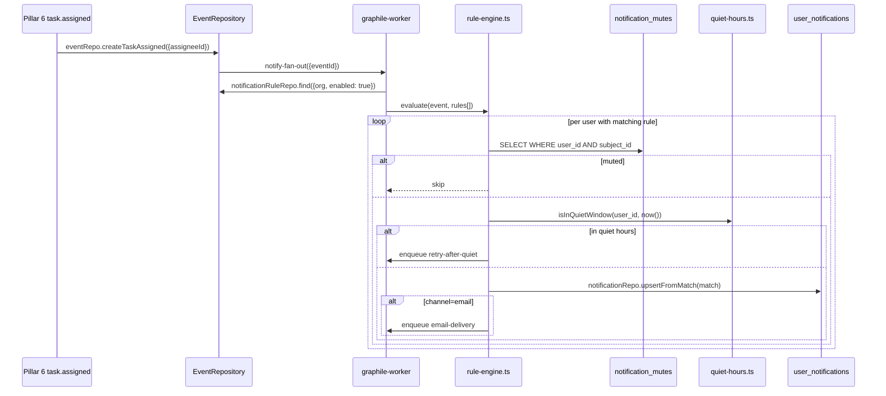
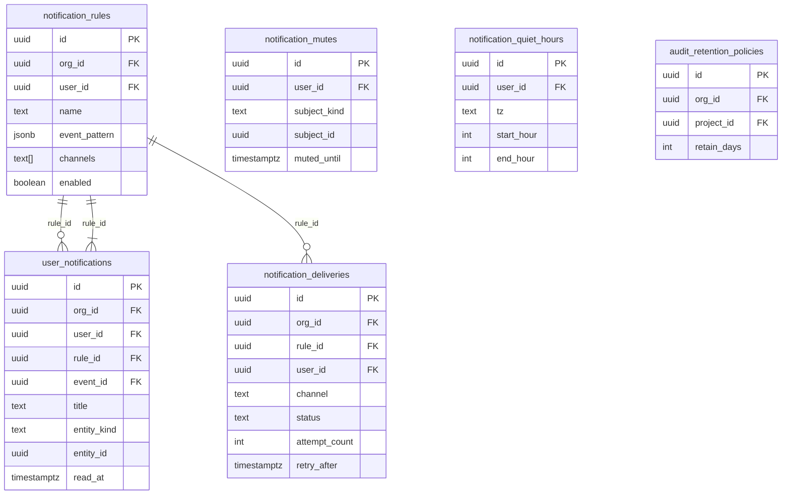

# PRD 12: Notifications + Activity Feed + Audit

## Status: ready-for-plan-breakdown

## Linkage chain

| Dimension | Detail |
|---|---|
| Vision gaps | V-gap-30: no notification fan-out system; V-gap-31: no audit log viewer; V-gap-32: no outbound webhook delivery |
| Requirements pillar | Pillar 12 — Notifications + Activity + Audit (`REQUIREMENTS.md §12`) |
| Key decisions | Q26 (no Novu/SaaS notification platform; build own rule engine); Q22 (composite org_id indexes); Q23 (events.org_id backfill owned by Pillar 1 consumed here); C1 (email/webhook/push gated); A2 (doctor coverage per pillar) |
| External specs | `graphile-worker` task + cron docs; `nodemailer` MIT SMTP docs; `web-push` VAPID spec; HMAC-SHA256 webhook signing convention |

---

## Vision

Every event fans out to signals. Always-on: in-app activity feed per project + per user, bell-icon unread counter, `NotificationRule` rule engine against the Pillar 1 `Event` entity, audit log viewer, mute/quiet-hours. Gated but fully shipped: email SMTP, outbound webhooks (HMAC), Slack webhook, Discord webhook, VAPID push. Mute/snooze per entity; quiet hours; per-user rule CRUD. Audit log: filters + CSV/JSON export; retention policy per project. C4 parity: Web (`/inbox`, `/settings/notifications`, `/audit`) + CLI + TUI + API.

---

## Out-of-scope

C5 carve-out (2) — owned by another pillar:
- **Pillar 1:** `Event` entity + `org_id` backfill (Q23). This pillar consumes events, does not own the event model.
- **Pillars 3/6/7/8/9/10:** emitting specific event rows. This pillar evaluates rules against them.
- **Pillar 2:** embedding model lifecycle.

C5 carve-out (1) — not in verbatim ask / explicitly excluded:
- **Novu / SaaS notification platform** — Q26 verbatim exclusion.
- **AI notification summaries/digests** — Q5b; excluded until requested.
- **SMS/phone** — not mentioned.

---

## Always-on features

Ships unconditionally, all surfaces.

### `events` consumption

P1 owns the `Event` entity. This pillar: `graphile-worker` `notify-fan-out` job after event write → `src/notifications/rule-engine.ts` matches against `NotificationRuleRepository` per org user → writes `Notification` entities per in-app match.

### `NotificationRule` entity

Per-user declarative rules; in-process per-event evaluation. Pattern jsonb AST fields: `subject_kind`, `verb`, `payload_path` (dot-path into `events.payload`), `project_id`, `sprint_id`. Example: `{"subject_kind":"task","verb":"assigned","payload_path_eq":[{"path":"assignee_id","value":"$current_user_id"}]}`.

4 defaults seeded on user create (all enabled, all in-app): `assignment-to-me`, `mention-of-me`, `sprint-changes-affecting-my-tasks`, `run-completed-on-my-task`.

### In-app notifications + activity feed

`Notification`: one entity per (user, event, rule). Bell badge = `notificationRepo.count({ user, readAt: null })`. Card: icon + title + verb + actor + time. Click navigates. Infinite scroll 20/page.

`/projects/<id>/activity`: `eventRepo.find({ project }, { orderBy: { createdAt: 'DESC' } })`, filter kind/verb/actor/date (TanStack Virtual). `/inbox`: "For you" (`Notification`) + "My activity" (`eventRepo.find({ actor: currentUser })`) tabs.

### Mute + quiet hours

`NotificationMute(user_id, subject_kind, subject_id, muted_until)` — `null`=permanent; rule engine checks before writing. `NotificationQuietHours(user_id, tz, start_hour, end_hour, days_of_week[])` — gated deliveries suppressed in window; `retry-after-quiet` job reschedules. In-app unaffected.

### Audit log surface

Read-only `Event` viewer: filters `org_id`/`project_id`/`user_id`/`subject_kind`/`verb`/`date_range`, default last 7 days, `created_at DESC`. Export CSV/JSON — streams for <100k entities; `graphile-worker` job for larger. Retention policy via `EventRetentionPolicy(retain_days DEFAULT 0 = keep-forever)`; daily cron prunes matching events.

### Bell-icon counter

60s poll via `notify.unreadCount`. WebSocket update gated behind `real-time-collab-server`. Badge cleared on inbox visit.

---

## Gated features

All shipped + tested; OFF by default; flip individual flag to enable.

| Feature | Flag | What it does |
|---|---|---|
| Email SMTP | `notify-email` | nodemailer + Eta template + graphile-worker queue. `SMTP_HOST/PORT/USER/PASS`. Verified email, rate-limited. Writes `notification_deliveries`. |
| Outbound webhooks | `notify-webhook` | HTTP POST + `X-Fulcrum-Signature-256` HMAC. Exponential backoff, max 5 retries. `HMAC_SECRET` per rule. |
| Slack webhook | `notify-slack` | fetch POST to `SLACK_WEBHOOK_URL`. Block Kit format. |
| Discord webhook | `notify-discord` | fetch POST to Discord webhook URL. Embed format. |
| Web push (VAPID) | `notify-push` | `web-push` + service worker. `VAPID_PUBLIC/PRIVATE_KEY`. `PushSubscription` entity. Quiet hours respected. |
| Real-time bell | `real-time-collab-server` | Hocuspocus WebSocket replaces 60s poll. Cross-ref Pillar 5/6 (same flag). |
| Public REST/OpenAPI | `public-api` | `GET|POST|PATCH|DELETE /api/v1/notifications/*`, `GET /api/v1/audit` via `@hono/zod-openapi`. |

---

## Tech stack

| Layer | Pick | License | Failure gate | 2nd |
|---|---|---|---|---|
| Job queue | `graphile-worker` (P1 dep) | MIT | P1 delay → in-process listener + retry table | `BullMQ` (MIT, Redis) |
| SMTP | `nodemailer` | MIT | TLS/auth issues → `emailjs` (MIT) | `@sendgrid/mail` gated |
| Email templates | `Eta` v3 | MIT | API change → `Handlebars` (MIT) | tagged-template literal |
| Webhook HMAC | `node:crypto` (built-in) | — | N/A | — |
| Slack delivery | `fetch` to incoming-webhook URL | — | Slack deprecates → OAuth app `notify-slack-api` flag | — |
| Discord delivery | `fetch` to Discord URL | — | Rate-limit → same backoff as webhook path | — |
| Web push | `web-push` | MIT | VAPID <95% → degrade gracefully; in-app always-on | — |
| Rule engine | In-process jsonb match | — | >5ms → pre-index common patterns in repository filters | `json-rules-engine` (MIT, P3 reuse) |
| TUI | OpenTUI | MIT | Too immature → ratatui in Rust sidecar | — |

### Stack (DECISIONS.md C7-C9)
- C7: MikroORM v7 primary; entities use `@mikro-orm/decorators/es`.
- C7: migrations are classes at `src/db/migrations/Migration<timestamp>.ts`.
- C8: channel dispatchers are `@Injectable()` services resolved by needle-di.
- C9: entity paths live under `src/db/entities/notifications/`.
- C9: repositories live under `src/db/repositories/notifications/`.

---

## Entity changes

All entities carry composite `(org_id, …)` indexes (Q22 mandate). Migration class: `Migration<timestamp>` covering notifications.

```ts
@Entity({ tableName: 'notification_rules' })
@Index({ properties: ['org', 'user'] })
@Index({ properties: ['org', 'enabled'] })
export class NotificationRule {
  @PrimaryKey({ type: 'uuid' }) id = crypto.randomUUID();
  @ManyToOne(() => Org, { deleteRule: 'cascade' }) org!: Org;
  @ManyToOne(() => User, { deleteRule: 'cascade' }) user!: User;
  @Property() name!: string;
  @Property({ type: 'json' }) eventPattern: Record<string, unknown> = {};
  @Property({ type: 'array' }) channels: string[] = ['in-app'];
  @Property() enabled = true;
  @Property() createdAt = new Date();
  @Property({ onUpdate: () => new Date() }) updatedAt = new Date();
}

@Entity({ tableName: 'user_notifications' })
@Unique({ properties: ['user', 'event', 'rule'] })
@Index({ properties: ['org', 'user', 'readAt'] })
@Index({ properties: ['org', 'user', 'createdAt'] })
export class Notification {
  @PrimaryKey({ type: 'uuid' }) id = crypto.randomUUID();
  @ManyToOne(() => Org, { deleteRule: 'cascade' }) org!: Org;
  @ManyToOne(() => User, { deleteRule: 'cascade' }) user!: User;
  @ManyToOne(() => NotificationRule, { nullable: true, deleteRule: 'set null' }) rule?: NotificationRule;
  @ManyToOne(() => Event, { deleteRule: 'cascade' }) event!: Event;
  @Property() title!: string;
  @Property() body = '';
  @Property() entityKind!: string;
  @Property({ type: 'uuid' }) entityId!: string;
  @Property({ nullable: true }) readAt?: Date;
  @Property() createdAt = new Date();
}

@Entity({ tableName: 'notification_deliveries' })
@Index({ properties: ['org', 'user', 'channel', 'status'] })
@Index({ properties: ['retryAfter'] })
export class NotificationDelivery {
  @PrimaryKey({ type: 'uuid' }) id = crypto.randomUUID();
  @ManyToOne(() => Org, { deleteRule: 'cascade' }) org!: Org;
  @ManyToOne(() => NotificationRule, { deleteRule: 'cascade' }) rule!: NotificationRule;
  @ManyToOne(() => Notification, { nullable: true, deleteRule: 'set null' }) notification?: Notification;
  @ManyToOne(() => User, { deleteRule: 'cascade' }) user!: User;
  @Property() channel!: string;
  @Enum(() => DeliveryStatus) status = DeliveryStatus.Pending;
  @Property() attemptCount = 0;
  @Property({ nullable: true }) lastError?: string;
  @Property({ type: 'json' }) payload: Record<string, unknown> = {};
  @Property({ nullable: true }) sentAt?: Date;
  @Property({ nullable: true }) retryAfter?: Date;
  @Property() createdAt = new Date();
}

@Entity({ tableName: 'notification_mutes' })
@Unique({ properties: ['user', 'subjectKind', 'subjectId'] })
export class NotificationMute {
  @PrimaryKey({ type: 'uuid' }) id = crypto.randomUUID();
  @ManyToOne(() => Org, { deleteRule: 'cascade' }) org!: Org;
  @ManyToOne(() => User, { deleteRule: 'cascade' }) user!: User;
  @Property() subjectKind!: string;
  @Property({ type: 'uuid' }) subjectId!: string;
  @Property({ nullable: true }) mutedUntil?: Date;
}

@Entity({ tableName: 'notification_quiet_hours' })
@Unique({ properties: ['user'] })
export class NotificationQuietHours {
  @PrimaryKey({ type: 'uuid' }) id = crypto.randomUUID();
  @ManyToOne(() => Org, { deleteRule: 'cascade' }) org!: Org;
  @ManyToOne(() => User, { deleteRule: 'cascade' }) user!: User;
  @Property() tz = 'UTC';
  @Property() startHour!: number;
  @Property() endHour!: number;
  @Property({ type: 'array' }) daysOfWeek: number[] = [0, 1, 2, 3, 4, 5, 6];
}

@Entity({ tableName: 'event_retention_policy' })
@Unique({ properties: ['org', 'project'] })
export class EventRetentionPolicy {
  @PrimaryKey({ type: 'uuid' }) id = crypto.randomUUID();
  @ManyToOne(() => Org, { deleteRule: 'cascade' }) org!: Org;
  @ManyToOne(() => Project, { nullable: true, deleteRule: 'cascade' }) project?: Project;
  @Property() retainDays = 0;
}

@Entity({ tableName: 'webhook_rule_configs' })
@Unique({ properties: ['rule'] })
export class WebhookRuleConfig {
  @PrimaryKey({ type: 'uuid' }) id = crypto.randomUUID();
  @ManyToOne(() => Org, { deleteRule: 'cascade' }) org!: Org;
  @ManyToOne(() => NotificationRule, { deleteRule: 'cascade' }) rule!: NotificationRule;
  @Property() url!: string;
  @Property() encryptedSecret!: string;
}

@Entity({ tableName: 'push_subscriptions' })
@Unique({ properties: ['user', 'endpoint'] })
export class PushSubscription {
  @PrimaryKey({ type: 'uuid' }) id = crypto.randomUUID();
  @ManyToOne(() => Org, { deleteRule: 'cascade' }) org!: Org;
  @ManyToOne(() => User, { deleteRule: 'cascade' }) user!: User;
  @Property() endpoint!: string;
  @Property() p256dh!: string;
  @Property() auth!: string;
  @Property({ nullable: true }) userAgent?: string;
}
```

`Event` owned by Pillar 1; Q23 org_id backfill in Pillar 1. No new `Event` properties from this pillar.

---

## Surfaces

### Web (SvelteKit routes)

`/inbox` — "For you" / "My activity" tabs; bell overlay (top-5 unread + "See all"); mark-read on open; TanStack Virtual scroll.  
`/projects/<id>/activity` — all project events; filter toolbar (kind/verb/actor/date).  
`/settings/notifications` — rules CRUD, channel toggles, quiet-hours, mute list.  
`/settings/notifications/channels` — per-channel config (email verify, webhook URL+secret, Slack/Discord URL, push subscribe).  
`/audit` — filter toolbar (project/user/kind/verb/date); paginated table; Export CSV + JSON.

### CLI (`--json` on every command)

```
fulcrum notify list     [--unread] [--limit <n>] [--offset <n>] [--json]
fulcrum notify read     <notification-id>
fulcrum notify mark-read <notification-id> | --all
fulcrum notify mute     <subject-kind> <subject-id> [--until <ISO>]
fulcrum notify unmute   <subject-kind> <subject-id>

fulcrum notify rules list   [--json]
fulcrum notify rules get    <rule-id> [--json]
fulcrum notify rules create --name <name> --pattern <json> --channels <csv>
fulcrum notify rules update <rule-id> [--name] [--pattern] [--channels] [--enable|--disable]
fulcrum notify rules delete <rule-id>

fulcrum notify channels list   [--json]
fulcrum notify channels config <channel> [--url <url>] [--secret <secret>]
fulcrum notify channels test   <channel>  # sends a test delivery

fulcrum audit query [--project <id>] [--user <id>] [--kind <kind>] [--verb <verb>]
                    [--since <ISO>] [--until <ISO>] [--limit <n>] [--json]
fulcrum audit export --format csv|json [same filters as query] [--output <file>]
```

### TUI (OpenTUI, Bun-native)

`I` → Inbox (unread highlighted, `R` mark-read, `M` mute, `Enter` navigate); `A` → Activity feed (filter chips); Settings → Notifications tab (rules CRUD, quiet-hours); Audit panel (scrollable table, `E` export JSON).

### API (tRPC always-on + gated OpenAPI)

`notify.list` / `.unreadCount` / `.markRead` / `.markAllRead` / `.mute` / `.unmute` / `.rules.*` / `.channels.*` / `.quietHours.*`; `audit.query` / `.export` / `.retentionPolicy.*`.

`FULCRUM_FEATURES=public-api` → REST `GET|POST|PATCH|DELETE /api/v1/notifications/*`, `GET /api/v1/audit` via `@hono/zod-openapi`; webhook rule CRUD + configs exposed (masked secret).

---

## Technical design

### Architecture

```mermaid
graph TD
    EV[(Event entity)] -->|write hook| GW[graphile-worker notify-fan-out]
    GW --> RE[rule-engine.ts per org user]
    RE -->|match + not muted + not quiet| UN[(Notification)]
    RE -->|channel=email + notify-email ON| EM[EmailDispatcherService]
    RE -->|channel=webhook + notify-webhook ON| WH[WebhookDispatcherService]
    RE -->|channel=slack + notify-slack ON| SL[SlackDispatcherService]
    RE -->|channel=discord + notify-discord ON| DC[DiscordDispatcherService]
    RE -->|channel=push + notify-push ON| VP[PushDispatcherService]
    EM & WH & SL & DC & VP --> ND[(NotificationDelivery)]

    QH[quiet-hours.ts] -->|suppress in window| RE
    MUTE[(NotificationMute)] --> RE
    CRON[retention cron daily] --> PRUNE[audit retention pruner]
    PRUNE --> EV

    WEB[/inbox /audit] -->|tRPC notify.* audit.*| TR[tRPC router]
    CLI[fulcrum notify/audit] -->|tRPC| TR
    TUI[OpenTUI inbox/audit] -->|in-process| TR
    TR --> UN & EV & ND
```

### Sequence: event fan-out to in-app notification



### ER diagram



### Error model

| Code | Description | Propagated to | Recovery |
|---|---|---|---|
| `RULE_EVAL_SLOW` | Rule engine >5ms per event with 1000 rules | Doctor warn | Pre-index common patterns in repository filters |
| `EMAIL_SEND_FAILED` | nodemailer SMTP error | `deliveries.status=failed` + `last_error` | Check SMTP creds; `nodemailer` fallback `emailjs` |
| `WEBHOOK_MAX_RETRIES` | 5 retry attempts exhausted on 5xx | `deliveries.status=failed` | Manual resend; check target URL |
| `VAPID_SUBSCRIPTION_EXPIRED` | 410 from push service | Delete `push_subscriptions` row | User re-subscribes in browser |
| `QUIET_HOURS_TIMEZONE` | Invalid tz string in `notification_quiet_hours` | Logged; UTC fallback | Fix tz via settings panel |

### Observability

| Signal | Name | Fields |
|---|---|---|
| OTel span | `fulcrum.notify.fanOut` | `event_id`, `rules_evaluated`, `notifications_written`, `duration_ms` |
| OTel span | `fulcrum.notify.delivery.email` | `user_id`, `rule_id`, `status`, `attempt` |
| OTel span | `fulcrum.notify.delivery.webhook` | `url_host`, `status_code`, `attempt` |
| Log event | `notify.quiet.held` | `user_id`, `event_id`, `retry_at` |
| Log event | `audit.retention.pruned` | `org_id`, `rows_deleted`, `retain_days` |

### Performance budgets

| Operation | p50 | p95 |
|---|---|---|
| Rule eval 1000 rules x 100 users per event | <20 ms | <50 ms |
| `/inbox` cold load | <80 ms | <150 ms |
| `notify.unreadCount` bell query | <10 ms | <20 ms |
| Audit export 10k rows CSV stream | <1 s | <2 s |
| Email delivery via nodemailer | <2 s | <5 s |

## Doctor integration

Subsystem: `notifications`

```typescript
const DoctorNotificationsCheck = z.object({
  subsystem: z.literal('notifications'),
  checks: z.array(z.object({
    id: z.string(),
    status: z.enum(['pass', 'warn', 'fail']),
    message: z.string(),
    durationMs: z.number().optional(),
    metadata: z.record(z.unknown()).optional(),
  })),
  ok: z.boolean(),
});
```

| Check ID | What it verifies | Failure recovery |
|---|---|---|
| `notifications.schema.rules` | `NotificationRule` metadata with enabled composite index | Run migration T12-01 |
| `notifications.schema.user_notifications` | `Notification` unique key `(user, event, rule)` | Run migration T12-01 |
| `notifications.schema.audit_retention` | `EventRetentionPolicy` metadata registered | Run migration T12-01 |
| `notifications.defaults.seeded` | 4 default rules exist per user on first user create | Re-run default seeder T12-03 |
| `notifications.fanout.worker` | `notify-fan-out` graphile-worker task registered | Check graphile-worker setup (Pillar 1) |
| `notifications.email.smtp` | If `notify-email` ON: SMTP connection test passes | Check `SMTP_HOST/PORT/USER/PASS` |
| `notifications.webhook.hmac_secret` | If `notify-webhook` ON: webhook configs have non-empty `secret` | Set secret per rule in settings |
| `notifications.push.vapid` | If `notify-push` ON: `VAPID_PUBLIC_KEY` + `VAPID_PRIVATE_KEY` set | Generate via `fulcrum notify vapid-keygen` |
| `notifications.deliveries.failing` | Count of `delivery.status=failed` in last 24h >10 | Investigate failing deliveries |

## Dependencies

| Pillar | Need |
|---|---|
| 1 | `Event` entity + Q23 backfill; `graphile-worker` (fan-out, quiet-retry, retention cron); flag eval; Better-Auth `$me` resolution |
| 6 | Task events: `status_changed`, `assigned`, `mentioned`, `commented`, `sprint_changed` |
| 7 | Doc events: `created`, `updated`, `mentioned` |
| 9 | Repo events: `pushed`, `merged` |
| 3 | Run events: `completed`, `failed` |
| 10 | Artifact events: `created` |

---

## Issues breakdown (TDD-numbered)

**Foundation**
- `T12-01` Migration class `Migration<timestamp>`: all 8 notification entities. Tests: metadata, unique indexes, FK cascades.
- `T12-02` Rule engine `src/notifications/rule-engine.ts`. Tests: all AST fields match; `$me` resolved; no-match empty; mute short-circuits; disabled rule skipped.
- `T12-03` Default rules seeding (4 defaults on user create). Tests: correct rules present; idempotent.
- `T12-04` `graphile-worker` `notify-fan-out`: event → evaluate rules → write `user_notifications`. Tests: dedup `(user_id, event_id, rule_id)`; muted suppressed; disabled skipped.
- `T12-05` tRPC `notify.*` CRUD. Tests: all procedures, Zod validation, permission checks (user owns rule), unread count decrements.
- `T12-06` tRPC `audit.*`. Tests: filter combos, pagination, retention CRUD, export stream rows correct.
- `T12-07` Quiet-hours `src/notifications/quiet-hours.ts`. Tests: suppressed in window; `retry-after-quiet` enqueued; outside window proceeds; UTC + local tz.
- `T12-08` Bell 60s poll. Tests: count updates on new notification; clears on inbox visit.

**Web**
- `T12-09` `/inbox` tabs + scroll. Tests: 20 items, next page, `read_at` set on open, tab switch.
- `T12-10` Bell dropdown overlay. Tests: top-5 unread, badge, "See all", click marks read.
- `T12-11` `/projects/<id>/activity`. Tests: all events, filter toolbar, date range.
- `T12-12` Per-entity activity (task detail). Tests: events scoped to `entity_id`, status/comment events.
- `T12-13` Rules list. Tests: 4 defaults, CRUD, toggle enable/disable.
- `T12-14` Rule create/edit form. Tests: pattern builder, channel multi-select, save round-trip.
- `T12-15` Quiet-hours panel. Tests: tz picker, hours, days-of-week, save + load.
- `T12-16` Mute list. Tests: list/remove mute, "until" date.
- `T12-17` Channels config. Tests: email verify (token sent, confirmed); webhook masked secret; push subscription stored.
- `T12-18` `/audit` viewer. Tests: filter toolbar, paginated, CSV + JSON export download.
- `T12-19` Retention policy settings. Tests: `retain_days` set/load, 0=forever default.

**CLI**
- `T12-20` `fulcrum notify list|read|mark-read|mute|unmute`. Tests: `--json`, `--unread`, mark-all.
- `T12-21` `fulcrum notify rules *`. Tests: `--pattern` JSON, `--disable`, delete.
- `T12-22` `fulcrum notify channels *`. Tests: `--json`, test delivery, masked secret.
- `T12-23` `fulcrum audit query`. Tests: all filters, `--json Event[]`.
- `T12-24` `fulcrum audit export`. Tests: CSV headers+rows, JSON array, `--output` file.

**TUI**
- `T12-25` Inbox screen. Tests: render, `R`/`M`/`Enter` keybinds.
- `T12-26` Activity feed. Tests: filter chips, `Enter` navigate.
- `T12-27` Rules editor. Tests: CRUD, quiet-hours section.
- `T12-28` Audit panel. Tests: scroll, `E` export JSON.

**Gated**
- `T12-29` `notify-email`: nodemailer transport, Eta template, delivery row. Tests: OFF → no SMTP; ON → sends, `status='sent'`; failure → `status='failed'` + `last_error`.
- `T12-30` Email verify flow. Tests: token generated; confirm link sets `email_verified`; unverified suppressed.
- `T12-31` Rate limiter. Tests: >N/hr → `status='suppressed'`.
- `T12-32` `notify-webhook`: POST + HMAC signing. Tests: OFF → no request; ON → `X-Fulcrum-Signature-256` valid; 4xx retry ≤5; 5xx backoff; 200 → `sent`.
- `T12-33` Webhook retry job. Tests: `retry_after` past → re-enqueued; max → `failed`; idempotent.
- `T12-34` `notify-slack`: Block Kit POST. Tests: OFF → no request; ON → mocked URL succeeds; quiet-hours respected.
- `T12-35` `notify-discord`: embed POST. Tests: same pattern as T12-34.
- `T12-36` `notify-push`: VAPID + `web-push`. Tests: OFF → no VAPID; ON → sub stored; 201; 410 → delete sub.
- `T12-37` Service worker. Tests: registered on flag ON; `showNotification` called on push.
- `T12-38` `real-time-collab-server`: bell WebSocket. Tests: OFF → 60s poll; ON → badge updates <2s.
- `T12-39` `public-api` REST. Tests: OpenAPI valid; auth; `GET /api/v1/notifications`; `GET /api/v1/audit`; webhook rule config masked.

---

## Failure gates

- **`graphile-worker` unavailable (Pillar 1 delay):** in-process sync listener + `at_least_once_deliveries` retry table.
- **`nodemailer` TLS/auth issues:** `emailjs` (MIT) drop-in; transport factory in `src/notifications/channels/email.ts`.
- **`web-push` VAPID rotation:** `VAPID_PUBLIC_KEY_OLD` + re-subscribe flow; old subs kept until TTL.
- **Rule engine >5ms per event:** pre-index frequent patterns and batch repository filters; `json-rules-engine` (MIT, shared with Pillar 3 router) as fallback.
- **OpenTUI too immature:** ratatui pane in Rust sidecar via same Unix socket/stdio RPC.

---

## Acceptance criteria

All three surfaces pass before done.

**In-app** — assign → bell increment; click navigates + clears; mark-all clears; CLI `notify list --unread --json`; TUI `R` marks read.  
**Rule CRUD** — create `doc/created/in-app`; fires on new doc; disable → silent; CLI `rules create/list/delete`; TUI CRUD.  
**Mute** — mute task → no notifications; unmute restores; CLI `notify mute`; TUI `M`.  
**Quiet hours** — 22:00–08:00; `held-quiet-hours`; resent after window.  
**Activity** — 20 events, `kind=task verb=status_changed` filter; CLI `audit query --kind task --json`; TUI screen.  
**Audit** — filter+export CSV; CLI `audit export --format csv --output`; TUI `E` JSON.  
**Retention** — `retain_days=30`; cron deletes older; `0`=forever confirmed.  
**Default rules** — 4 on user create; each fires; duplicate = no duplicates.

**Gated (OFF + ON both):**
- `notify-email` OFF: no SMTP; ON: email delivered, Eta template, `status='sent'`; SMTP failure → `failed`.
- `notify-webhook` OFF: no outbound; ON: HMAC header valid; 5xx backoff; max → `failed`.
- `notify-slack` OFF: no POST; ON: Block Kit delivered; quiet-hours respected.
- `notify-discord` OFF: no POST; ON: embed delivered.
- `notify-push` OFF: no VAPID; ON: sub stored, 201, 410 → sub deleted.
- `real-time-collab-server` OFF: 60s poll; ON: badge updates <2s via WebSocket.
- `public-api` OFF: 404; ON: valid OpenAPI, auth enforced.

**Performance:** rule eval 1000 rules × 100 users per event <50ms; `/inbox` cold load <150ms; bell count query <20ms; audit export 10k rows CSV <2s.
