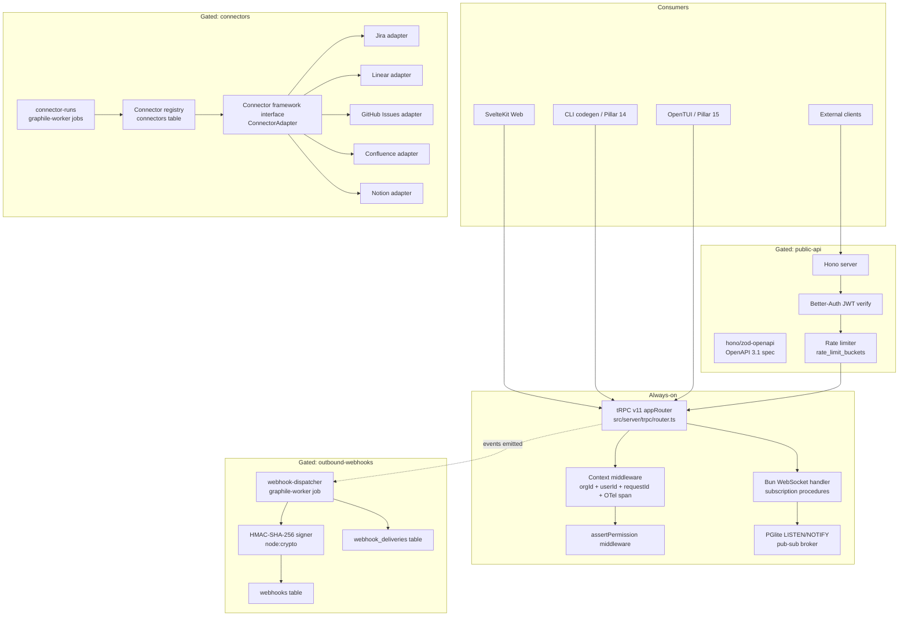
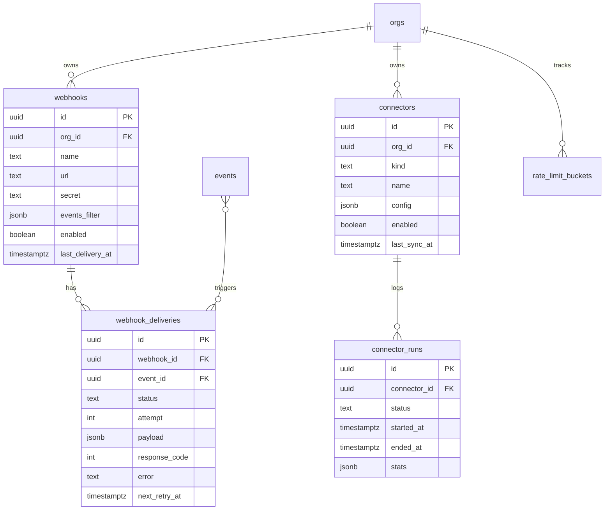

# PRD 13: API Surface + Webhooks + Connector Framework

## Status
ready-for-plan-breakdown

## Linkage chain
- Vision: `.scratch/agent-os-vision/VISION-GAPS.md` rows: "API / webhooks / integrations" (❌), "Schema for future SaaS without rewrite" (❌)
- Requirements: `.scratch/agent-os-vision/REQUIREMENTS.md` Pillar 13 section
- Decisions: Q28, Q-flag-granularity, A2, A4, A6, C1, C2, C4, C5, D5, Q-cross-cut (B8 import/export)
- Docs: tRPC v11 RFC (`https://trpc.io/docs/v11`), Hono `@hono/zod-openapi` README, OpenAPI 3.1 spec, HMAC-SHA-256 RFC 2104

## Vision
Every Fulcrum operation callable via typesafe tRPC — consumed identically by the SvelteKit web UI, the CLI codegen, and the TUI in-process — with an optional REST+OpenAPI 3.1 surface for external integrations, HMAC-signed outbound webhooks for reactive pipelines, and a pluggable connector framework that gates per-connector adapters (Linear, Jira, GitHub Issues, Confluence, Notion, GitHub, GitLab, Bitbucket) individually behind feature flags.

## Out-of-scope
Per C5: only (1) genuinely-not-asked items or (2) cross-pillar-owned items appear here.

- **GraphQL surface** — not mentioned in any locked decision; not in user verbatim ask. Excluded until explicitly requested.
- **Billing / metering APIs** — not in user verbatim ask or DECISIONS. Excluded.
- **Individual connector business logic** — Pillar 13 owns the connector framework interface and registry. Per-connector adapter implementations (Linear sync rules, Jira field mapping, Bitbucket PR state) live in their respective domain pillars or future connector-specific PRDs once the framework is live.
- **OAuth provider configuration (Google, GitHub OAuth)** — Owned by Pillar 1 (`saas-auth` flag). This pillar only wires JWT bearer auth for external REST callers using Better-Auth tokens.
- **Notification channels (SMTP, Slack, Discord)** — Owned by Pillar 12. This pillar's `outbound-webhooks` flag covers arbitrary HTTP webhook subscriptions, not notification channels.
- **Symphony HTTP API extension** — Owned by Pillar 3 (`symphony-http-api` flag). This pillar's public REST surface covers all other domains.

## Always-on features

### tRPC v11 consolidated router
`src/server/trpc/router.ts` — single `appRouter` merging sub-routers for every domain. Procedure registry (all domains):

| Sub-router | Procedures |
|---|---|
| `auth` | `whoami`, `invite`, `acceptInvite` |
| `orgs` | `get`, `update`, `members.*` |
| `flags` | `list`, `set` |
| `projects` | `list`, `get`, `create`, `update`, `delete`, `stats` |
| `tasks` | `list`, `get`, `create`, `update`, `delete`, `bulk`, `move`, `claim` |
| `sprints` | `list`, `get`, `create`, `update`, `delete`, `activate`, `complete` |
| `custom_fields` | `list`, `create`, `update`, `delete`, `reorder` |
| `saved_views` | `list`, `get`, `create`, `update`, `delete` |
| `docs` | `list`, `get`, `create`, `update`, `delete`, `move`, `reorder` |
| `doc_versions` | `list`, `get`, `restore` |
| `doc_comments` | `list`, `create`, `update`, `delete` |
| `doc_links` | `list`, `create`, `delete` |
| `memories` | `list`, `get`, `create`, `update`, `delete`, `promote` |
| `context` | `assemble`, `preview` |
| `agent_runs` | `list`, `get`, `create`, `cancel`, `retry` |
| `artifacts` | `list`, `get`, `download`, `delete` |
| `repos` | `list`, `get`, `register`, `sync`, `unregister` |
| `repo_branches` | `list`, `get` |
| `repo_commits` | `list`, `get` |
| `search` | `query`, `suggest`, `savedList`, `savedCreate`, `savedDelete` |
| `notify` | `list`, `unreadCount`, `markRead`, `mute`, `unmute`, `rules.*`, `channels.*`, `quietHours.*` |
| `audit` | `query`, `export`, `retentionPolicy.*` |
| `routing` | `list`, `get`, `create`, `update`, `delete`, `test`, `dryRun` |
| `fulcrum_skills` | `list`, `install`, `upgrade`, `uninstall`, `sync`, `resolveConflict` |
| `orchestration` | `status`, `runs.*`, `workflows.*` |
| `inference` | `status`, `models.*`, `backends.*` |
| `webhooks` | `list`, `get`, `create`, `update`, `delete`, `deliveries.*` |
| `connectors` | `list`, `get`, `enable`, `disable`, `sync`, `runs.*` |
| `doctor` | `run`, `subsystems` |
| `invitations` | `list`, `get`, `create`, `revoke` |

Every procedure: Zod input + output schema. `assertPermission()` middleware on every mutation. Context carries `{ orgId, userId, session }` from Pillar 1 auth. Subscription procedures (marked `subscription`) use native WebSocket transport for real-time UI updates.

### OTel span on every tRPC call
`src/server/trpc/middleware/otel.ts` — wraps every procedure in an OTel span `fulcrum.trpc.<domain>.<procedure>`. Attributes: `org.id`, `user.id`, `request.id` (UUID injected in context). No-op when exporter unset (local-first default).

### Request-ID injection
`src/server/trpc/middleware/requestId.ts` — generates `uuid()` per request, attached to context + response header `X-Fulcrum-Request-Id`. Used for log correlation across CLI, TUI, and web.

### WebSocket subscriptions (in-process)
Bun native `WebSocketHandler` (no external WS library). tRPC `subscription` procedures backed by Bun's pub/sub via `PGlite LISTEN/NOTIFY` channels. Topics: `agent_run.<id>`, `project.<id>.tasks`, `org.<id>.notifications`. Zero external broker.

### Always-on tRPC procedures backing all surfaces
SvelteKit consumes via `createTRPCProxyClient` + `@trpc/server/adapters/fetch` (Pillar 1). CLI codegen reads tRPC router type (Pillar 14). TUI calls same in-process (Pillar 15). No HTTP round-trip for CLI/TUI.

## Gated features

| Feature | Flag | Activates |
|---|---|---|
| REST + OpenAPI 3.1 | `public-api` | Hono + `@hono/zod-openapi` mounts at `/api/v1`; same Zod schemas auto-generate OpenAPI 3.1 spec served at `/api/v1/openapi.json`; JWT bearer auth via Better-Auth tokens; rate limiting per token (100 req/min default, configurable per org via `tenant_settings`). All procedure groups reflected as REST routes. |
| Outbound webhooks | `outbound-webhooks` | `webhooks` table active; `webhook_deliveries` table active; graphile-worker `webhook-dispatcher` job fires on every `events` row matching a subscription's `events_filter`; HMAC-SHA-256 signing with per-subscription secret (`node:crypto`); exponential backoff (base 1s, max 5 retries); idempotency key `X-Fulcrum-Delivery-Id` (delivery UUID). |
| Jira connector | `connector-jira` | Two-way sync adapter; `connectors` table row; pull issues from Jira REST API v3; push Fulcrum task updates back; `connector_runs` records sync stats; env: `JIRA_URL`, `JIRA_TOKEN`, `JIRA_PROJECT_KEY`. |
| Linear connector | `connector-linear` | Two-way sync; Linear GraphQL API; env: `LINEAR_API_KEY`, `LINEAR_TEAM_ID`. |
| GitHub Issues connector | `connector-github-issues` | Two-way sync; GitHub REST API v3; env: `GITHUB_TOKEN`, `GITHUB_REPO`. |
| Confluence connector | `connector-confluence` | One-way pull into Fulcrum docs; Confluence Cloud REST API; env: `CONFLUENCE_URL`, `CONFLUENCE_TOKEN`, `CONFLUENCE_SPACE_KEY`. |
| Notion connector | `connector-notion` | One-way pull into Fulcrum docs + tasks; Notion API v1; env: `NOTION_TOKEN`, `NOTION_DATABASE_ID`. |
| GitHub connector | `connector-github` | Repo supervision: branches, commits, PRs; supplements Pillar 9; env: `GITHUB_TOKEN`. |
| GitLab connector | `connector-gitlab` | Repo supervision: branches, MRs; env: `GITLAB_TOKEN`, `GITLAB_URL`. |
| Bitbucket connector | `connector-bitbucket` | Repo supervision: branches, PRs; env: `BITBUCKET_TOKEN`, `BITBUCKET_WORKSPACE`. |
| CSV import | `import-csv` | Bulk import tasks from CSV; column-mapping UI + validation; idempotent by external ID. |
| CSV export | `export-csv` | Bulk export tasks/docs as CSV; streaming for >1k rows. |
| Linear import | `import-linear` | One-shot historical import from Linear workspace; env: `LINEAR_API_KEY`. |
| Jira import | `import-jira` | One-shot historical import from Jira project; env: `JIRA_URL`, `JIRA_TOKEN`. |
| Plane import | `import-plane` | One-shot historical import from Plane workspace; env: `PLANE_URL`, `PLANE_TOKEN`. |

## Tech stack

| Layer | Pick | License | Failure gate → action | 2nd | 3rd |
|---|---|---|---|---|---|
| tRPC | v11 (MIT, ~36k stars) | MIT | v11 + Bun `--compile` incompatibility → Hono JSON-RPC with same Zod schemas | Hono + zod-openapi as sole router | — |
| REST + OpenAPI | Hono (MIT) + `@hono/zod-openapi` (MIT) | MIT | Hono breaking change → hand-rolled fetch handler wrapping tRPC procedures | `fastify` + `@fastify/swagger` | Express + `swagger-jsdoc` |
| HMAC signing | `node:crypto` built-in | — | N/A (standard library) | — | — |
| WebSocket | Bun native `WebSocketHandler` | — | Bun WS API break → `ws` npm package (MIT) | — | — |
| Connector framework | In-house interface + registry (must-write, ~300 LOC) | — | Interface too rigid → plugin-style dynamic import pattern | — | — |
| Rate limiting | In-process sliding-window counter (PGlite `rate_limit_buckets` table) | — | High-frequency external API → `@hono/rate-limiter` (MIT) with Redis adapter | — | — |
| JWT validation | Better-Auth `verifyToken` (Pillar 1 dep) | MIT | N/A (same auth system) | — | — |

### Stack (C7 · C8 · C9)

- **ORM:** MikroORM v7 (`@mikro-orm/core` + `mikro-orm-pglite` local / `@mikro-orm/postgresql` SaaS) — C7.
- **DI:** `@needle-di/core` v1 with Stage-3 TC39 decorators; `@Injectable()` services, `inject(EntityManager)` in constructors — C8.
- **Entities:** `src/db/entities/api/Webhook.ts`, `WebhookDelivery.ts`, `RateLimitBucket.ts`, `Connector.ts`, `ConnectorRun.ts` — C9.
- **Migrations:** auto-generated by `mikro-orm migration:create` at `src/db/migrations/Migration<timestamp>.ts`; never hand-written `.sql` files — C6/C9.
- **Connector credentials:** sensitive config stored in the Pillar 1 `credentials` table via `nacl.secretbox`; `Connector.config` jsonb holds non-secret config only — `@Property({ type: 'json', default: '{}' })`.
- **Partial indexes on delivery retry:** `@Index({ expression: "webhook_deliveries (next_retry_at) WHERE status = 'retrying'" })` — sanctioned single DDL-string-per-index escape under C6.
- **Partial index on running connector:** `@Index({ expression: "connector_runs (org_id, status) WHERE status = 'running'" })` — same C6 escape.

## Schema changes

All migrations idempotent. Composite `(org_id, …)` indexes mandatory per Q22. Migration classes auto-generated by `mikro-orm migration:create` at `src/db/migrations/Migration<timestamp>.ts` — never hand-written `.sql` files (C6/C9).

```typescript
// src/db/entities/api/Webhook.ts
@Entity()
@Index({ properties: ['orgId', 'enabled'] })
@Unique({ properties: ['orgId', 'name'] })
export class Webhook {
  @PrimaryKey({ type: 'uuid', defaultRaw: 'gen_random_uuid()' })
  id!: string;

  @ManyToOne(() => Org, { onDelete: 'cascade' })
  orgId!: string;

  @Property()
  name!: string;

  @Property()
  url!: string;

  @Property()
  secret!: string;                        // nacl.secretbox encrypted at rest

  @Property({ type: 'json', default: '{}' })
  eventsFilter!: Record<string, unknown>; // {} = all events

  @Property({ default: true })
  enabled!: boolean;

  @Property({ defaultRaw: 'now()' })
  createdAt!: Date;

  @Property({ defaultRaw: 'now()', onUpdate: () => new Date() })
  updatedAt!: Date;

  @Property({ nullable: true })
  lastDeliveryAt?: Date;
}

// src/db/entities/api/WebhookDelivery.ts
@Entity()
@Index({ properties: ['orgId', 'webhookId', 'createdAt'] })
// Sanctioned single DDL-string-per-index escape under C6 for partial index:
@Index({ expression: "webhook_deliveries (next_retry_at) WHERE status = 'retrying'" })
export class WebhookDelivery {
  @PrimaryKey({ type: 'uuid', defaultRaw: 'gen_random_uuid()' })
  id!: string;

  @ManyToOne(() => Org, { onDelete: 'cascade' })
  orgId!: string;

  @ManyToOne(() => Webhook, { onDelete: 'cascade' })
  webhookId!: string;

  @ManyToOne(() => Event, { nullable: true, onDelete: 'set null' })
  eventId?: string;

  @Enum({ items: ['pending','sent','failed','retrying'], default: 'pending' })
  status!: string;

  @Property({ default: 0 })
  attempt!: number;

  @Property({ type: 'json', default: '{}' })
  payload!: Record<string, unknown>;

  @Property({ nullable: true })
  responseCode?: number;

  @Property({ nullable: true })
  error?: string;

  @Property({ nullable: true })
  nextRetryAt?: Date;

  @Property({ defaultRaw: 'now()' })
  createdAt!: Date;
}

// src/db/entities/api/RateLimitBucket.ts
@Entity()
@Index({ properties: ['orgId', 'tokenHash', 'windowStart'] })
@Unique({ properties: ['orgId', 'tokenHash', 'windowStart'] })
export class RateLimitBucket {
  @PrimaryKey({ type: 'uuid', defaultRaw: 'gen_random_uuid()' })
  id!: string;

  @ManyToOne(() => Org, { onDelete: 'cascade' })
  orgId!: string;

  @Property()
  tokenHash!: string;  // SHA-256 of bearer token

  @Property()
  windowStart!: Date;

  @Property({ default: 0 })
  requestCount!: number;
}

// src/db/entities/api/Connector.ts
@Entity()
@Index({ properties: ['orgId', 'kind', 'enabled'] })
@Unique({ properties: ['orgId', 'kind'] })
export class Connector {
  @PrimaryKey({ type: 'uuid', defaultRaw: 'gen_random_uuid()' })
  id!: string;

  @ManyToOne(() => Org, { onDelete: 'cascade' })
  orgId!: string;

  @Enum({ items: ['jira','linear','github-issues','confluence','notion','github','gitlab','bitbucket'] })
  kind!: string;

  @Property()
  name!: string;

  @Property({ type: 'json', default: '{}' })
  config!: Record<string, unknown>;  // non-secret config; secrets in Pillar 1 credentials table

  @Property({ default: false })
  enabled!: boolean;

  @Property({ nullable: true })
  lastSyncAt?: Date;

  @Property({ defaultRaw: 'now()' })
  createdAt!: Date;

  @Property({ defaultRaw: 'now()', onUpdate: () => new Date() })
  updatedAt!: Date;
}

// src/db/entities/api/ConnectorRun.ts
@Entity()
@Index({ properties: ['orgId', 'connectorId', 'startedAt'] })
// Sanctioned single DDL-string-per-index escape under C6 for partial index:
@Index({ expression: "connector_runs (org_id, status) WHERE status = 'running'" })
export class ConnectorRun {
  @PrimaryKey({ type: 'uuid', defaultRaw: 'gen_random_uuid()' })
  id!: string;

  @ManyToOne(() => Org, { onDelete: 'cascade' })
  orgId!: string;

  @ManyToOne(() => Connector, { onDelete: 'cascade' })
  connectorId!: string;

  @Enum({ items: ['running','completed','failed','cancelled'], default: 'running' })
  status!: string;

  @Property({ defaultRaw: 'now()' })
  startedAt!: Date;

  @Property({ nullable: true })
  endedAt?: Date;

  @Property({ type: 'json', default: '{}' })
  stats!: Record<string, unknown>;  // created/updated/skipped/errors counts
}
```

## Surfaces

### Web (SvelteKit routes)
- `/settings/api` — API token management (create, list, revoke tokens for `public-api` callers); rate-limit current usage bar.
- `/settings/webhooks` — webhook CRUD: URL, secret (masked), events filter, enabled toggle; delivery log per webhook (status, attempt, response code, timestamp); test-fire button.
- `/settings/connectors` — connector cards per kind; enable/disable; config form (URL, project key); last-sync timestamp; manual trigger sync; run history list.
- `/settings/connectors/[kind]/runs/[runId]` — connector run detail: stats, error log.
- `/api/v1/openapi.json` — served when `public-api` ON; auto-generated from `@hono/zod-openapi`.

### CLI (`--json` on every command)
```
fulcrum api tokens list     [--json]
fulcrum api tokens create   --name <n> [--expiry <ISO>] [--json]
fulcrum api tokens revoke   <token-id>

fulcrum webhooks list        [--json]
fulcrum webhooks create      --name <n> --url <url> --secret <s> [--events <json>]
fulcrum webhooks update      <id> [--url] [--secret] [--events] [--enable|--disable]
fulcrum webhooks delete      <id>
fulcrum webhooks deliveries  <id> [--limit <n>] [--status <status>] [--json]
fulcrum webhooks test        <id>  # fires a synthetic ping delivery

fulcrum connectors list      [--json]
fulcrum connectors enable    <kind>
fulcrum connectors disable   <kind>
fulcrum connectors sync      <kind> [--full]
fulcrum connectors runs      <kind> [--limit <n>] [--json]
fulcrum connectors config    <kind> [--set key=value ...] [--json]

fulcrum import csv           --file <path> --entity tasks|docs [--project <id>] [--map-columns <json>]
fulcrum import linear        [--team-id <id>]
fulcrum import jira          --project-key <k>
fulcrum import plane         [--workspace <id>]
fulcrum export csv           --entity tasks|docs [--project <id>] [--output <file>]
```

### TUI (OpenTUI)
- Settings → API Tokens screen: list, `n` create, `D` revoke.
- Settings → Webhooks screen: list, `n`/`e`/`D`, delivery log pane, `t` test-fire.
- Settings → Connectors screen: cards per kind, `Enter` config pane, `s` sync, run log.

### API (tRPC always-on + gated OpenAPI)
All `webhooks.*`, `connectors.*`, `auth.tokens.*` tRPC procedures always-on for internal consumers (web, CLI, TUI). `FULCRUM_FEATURES=public-api` exposes them as REST `GET|POST|PATCH|DELETE /api/v1/{domain}/{resource}` with JWT bearer auth. OpenAPI spec auto-generated; spec endpoint at `/api/v1/openapi.json`.

## Technical design

### Architecture



### Sequence: external REST call with rate limiting

```mermaid
sequenceDiagram
    participant C as External Client
    participant H as Hono /api/v1
    participant J as JWT Verify
    participant R as Rate Limiter
    participant T as tRPC Procedure
    participant DB as PGlite / PostgreSQL

    C->>H: POST /api/v1/tasks (Bearer token)
    H->>J: verifyToken(token)
    J-->>H: { orgId, userId } or 401
    H->>R: checkBucket(orgId, tokenHash, window=60s)
    R->>DB: rateLimitRepo.findOneAndIncrement({ orgId, tokenHash, windowStart })
    DB-->>R: count
    alt over limit
        R-->>H: 429 Too Many Requests
        H-->>C: 429 { error: "rate_limit_exceeded", retry_after }
    else within limit
        H->>T: tasks.create({ ...body, orgId, userId })
        T->>DB: em.create(Task, {...}); em.create(Event, {...}); em.flush()
        DB-->>T: task row
        T-->>H: TaskOutput (Zod)
        H-->>C: 201 { data: task }
    end
```

### Sequence: outbound webhook delivery with retry

```mermaid
sequenceDiagram
    participant E as events table insert
    participant W as graphile-worker
    participant D as webhook-dispatcher job
    participant DB as PGlite
    participant R as Remote URL

    E->>W: pg_notify('events', event_id)
    W->>D: dequeue job
    D->>DB: webhookRepo.find({ eventsFilter: { $contains: event.type }, enabled: true, orgId })
    loop per matching webhook
        D->>DB: em.create(WebhookDelivery, { status: 'pending', ... }); em.flush()
        D->>R: POST url (HMAC-SHA256 header, payload, X-Fulcrum-Delivery-Id)
        alt 2xx
            R-->>D: 200 OK
            D->>DB: delivery.status = 'sent'; webhook.lastDeliveryAt = new Date(); em.flush()
        else 4xx / 5xx / timeout
            R-->>D: error
            D->>DB: delivery.status = 'retrying'; delivery.attempt++; delivery.nextRetryAt = backoff; em.flush()
            Note over D: backoff = min(2^attempt * 1000ms, 32000ms)
        end
    end
    Note over D: max 5 attempts; final failure → status='failed'
```

### ERD (core tables this pillar adds)



### Error model

| Error code | Condition | Propagation |
|---|---|---|
| `FORBIDDEN` | `assertPermission` fails on any mutation | tRPC `TRPCError`; REST 403 |
| `UNAUTHORIZED` | JWT missing or expired | Hono middleware; REST 401 |
| `RATE_LIMITED` | Token over bucket quota | Hono middleware; REST 429 + `Retry-After` header |
| `WEBHOOK_SECRET_INVALID` | Caller provides wrong HMAC on inbound test | tRPC `BAD_REQUEST` |
| `CONNECTOR_UNREACHABLE` | Connector host fails health check | `connector_runs` row `status='failed'`; doctor check fails |
| `CONNECTOR_AUTH_FAILED` | Connector credential rejected by remote | Same as above; `stats.error_kind='auth'` |
| `DELIVERY_MAX_RETRIES` | 5th delivery attempt fails | `webhook_deliveries.status='failed'`; no further retry |
| `SCHEMA_VALIDATION` | Zod parse fails on procedure input | tRPC `BAD_REQUEST`; REST 422 with Zod error map |

All tRPC errors carry `{ code, message, requestId }` shape. REST errors follow `{ error: { code, message, requestId } }`.

### Observability

OTel spans emitted per procedure: `fulcrum.trpc.<domain>.<procedure>`. Span attributes:
- `org.id` (string)
- `user.id` (string)
- `request.id` (UUID)
- `trpc.procedure` (string)
- `trpc.type` (`query|mutation|subscription`)

Webhook delivery: span `fulcrum.webhook.deliver` with `webhook.id`, `delivery.attempt`, `http.status_code`.
Connector sync: span `fulcrum.connector.sync` with `connector.kind`, `connector.id`, `stats.created`, `stats.updated`, `stats.errors`.

Log fields (structured JSON, `pino`): `requestId`, `orgId`, `userId`, `procedure`, `durationMs`, `error?`.

### Performance budgets

| Operation | p50 target | p95 target |
|---|---|---|
| tRPC query (simple list) | <10ms | <50ms |
| tRPC mutation (create/update) | <20ms | <80ms |
| REST via Hono wrapper | +5ms overhead over tRPC | +10ms overhead |
| Webhook dispatch job (per hook) | <200ms | <1s |
| Connector sync (incremental) | <5s | <30s |
| OpenAPI spec serve `/api/v1/openapi.json` | <5ms (cached) | <20ms |
| Rate limit bucket check | <5ms | <15ms |

## Doctor integration

### Checks added to `fulcrum doctor`

Registered in `src/doctor/checks/api.ts`:

1. **tRPC router reachable** — calls `doctor.run` procedure in-process; asserts response within 100ms.
2. **Zod schemas compilable** — import all Zod schemas from `src/server/trpc/schemas/`; assert no thrown errors.
3. **REST surface reachable** (`public-api` ON) — `GET /api/v1/openapi.json`; asserts 200 + valid OpenAPI 3.1 JSON.
4. **Webhook dispatcher running** (`outbound-webhooks` ON) — graphile-worker job `webhook-dispatcher` listed in registered jobs; asserts not paused.
5. **Pending delivery backlog** (`outbound-webhooks` ON) — `deliveryRepo.count({ status: 'retrying', orgId })`; warn if >100, error if >1000.
6. **Connector reachability** — for each enabled connector: HTTP HEAD to connector base URL (or GraphQL ping); mark pass/warn/fail.
7. **Connector run health** — last `connector_runs` row per connector; warn if `status='failed'` or `last_sync_at` > 24h.

### JSON output shape (Zod schema)

```typescript
const DoctorApiCheck = z.object({
  subsystem: z.literal('api'),
  checks: z.array(z.object({
    id: z.string(),                     // e.g. 'trpc-router', 'rest-surface', 'webhook-dispatcher'
    status: z.enum(['pass','warn','fail']),
    message: z.string(),
    durationMs: z.number().optional(),
    metadata: z.record(z.unknown()).optional(),
  })),
  ok: z.boolean(),                      // true = all pass; false = any fail
});
```

### Failure recovery guidance

- `trpc-router fail` → `bun run dev` restart; check `FULCRUM_HOME` + PGlite path.
- `rest-surface fail` → verify `FULCRUM_FEATURES=public-api` set; check Hono mount in `src/server/index.ts`.
- `webhook-dispatcher warn/fail` → `fulcrum webhooks deliveries <id>` to inspect; reset stalled jobs via graphile-worker `--maintenance`; check network reachability to destination.
- `connector-unreachable fail` → verify env vars (`JIRA_URL`, etc.); `fulcrum connectors config <kind>` to view; disable connector to clear error.

## Dependencies

| Pillar | Reason |
|---|---|
| Pillar 1 | tRPC core, auth context, flag registry, `assertPermission`, graphile-worker, `events` table, `credentials` table for connector secrets |
| Pillars 2–12 | All domain tRPC sub-routers merged here; their schemas must be stable before this pillar seals the consolidated router |
| Pillar 14 | Consumes this pillar's tRPC type exports for codegen; depends on stable `AppRouter` type |
| Pillar 15 | TUI calls tRPC in-process; stable `AppRouter` required |

## Issues breakdown (TDD-numbered P13.x)

**Foundation**
- `P13.01` tRPC consolidated router: merge all domain sub-routers; unit test each domain has required procedures; type-check passes with `bun run type-check`.
- `P13.02` OTel span middleware. Tests: span created per call, `org.id`/`user.id` attributes set; no-op exporter default.
- `P13.03` Request-ID middleware. Tests: UUID injected in context; `X-Fulcrum-Request-Id` header in response; same ID in tRPC error payload.
- `P13.04` Zod schema registry completeness. Tests: every sub-router's input+output schemas importable; no `z.any()` on public procedures.
- `P13.05` WebSocket subscription transport. Tests: subscribe `agent_run.<id>` → receive update within 500ms of PGlite NOTIFY; disconnect cleans up listener.

**Public REST API (gated)**
- `P13.06` Hono server setup + `@hono/zod-openapi` registration for all domain groups. Tests: flag OFF → 404 on `/api/v1/*`; ON → 200 on spec.
- `P13.07` JWT bearer auth middleware. Tests: missing token → 401; expired → 401; valid → 200.
- `P13.08` Rate limiter middleware. Tests: 101st request in 60s window → 429 + `Retry-After`; new window resets; per-org isolation.
- `P13.09` OpenAPI spec accuracy. Tests: spec validates against OpenAPI 3.1 schema; all registered routes present; no extra routes.
- `P13.10` REST endpoint parity: tasks CRUD. Tests: `POST /api/v1/tasks` ↔ `tRPC tasks.create`; same Zod schema; 201 + task body.
- `P13.11` REST endpoint parity: docs CRUD. Tests: same pattern.
- `P13.12` REST endpoint parity: sprints, saved_views, memories. Tests: same pattern.
- `P13.13` REST endpoint parity: search, notifications, audit. Tests: `GET /api/v1/search?q=` returns `SearchResult[]`.
- `P13.14` REST endpoint parity: agent_runs, artifacts, repos. Tests: same pattern.
- `P13.15` API token CRUD (create/list/revoke). Tests: token stored (hashed); revocation invalidates JWT verify.

**Outbound webhooks (gated)**
- `P13.16` Migration class `Migration<timestamp>` covering webhook schema: `Webhook` + `WebhookDelivery` entities with composite indexes and partial index for `status='retrying'`. Tests: idempotent; FK cascades; status enum enforced.
- `P13.17` `webhooks.*` tRPC CRUD. Tests: create with encrypted secret; list masked; delete cascades deliveries.
- `P13.18` `webhook-dispatcher` graphile-worker job. Tests: event fires → matching webhook triggered → delivery row created; `events_filter` `{}` matches all; specific filter skips non-matching.
- `P13.19` HMAC-SHA-256 signing. Tests: `X-Fulcrum-Signature-256` valid for payload; wrong secret fails verification; empty payload signed correctly.
- `P13.20` Delivery retry backoff. Tests: 1st fail → `next_retry_at = now()+1s`; 5th fail → `status='failed'`; 2xx on retry 3 → `status='sent'`.
- `P13.21` Idempotency key `X-Fulcrum-Delivery-Id`. Tests: same delivery UUID on retry; remote can deduplicate.
- `P13.22` Webhook test-fire CLI + Web. Tests: `fulcrum webhooks test <id>` sends synthetic payload; delivery row created.

**Connector framework**
- `P13.23` Migration class `Migration<timestamp>` covering connector schema: `Connector` + `ConnectorRun` entities with composite indexes, `UNIQUE(orgId, kind)`, and partial index for `status='running'`. Tests: idempotent; UNIQUE(org_id, kind) enforced.
- `P13.24` `ConnectorAdapter` interface (`src/connectors/interface.ts`). Tests: TypeScript compile; required methods defined; `pull()`, `push()`, `healthCheck()` signatures.
- `P13.25` Connector registry + flag guard. Tests: `connector-jira` OFF → `connectors.enable('jira')` throws `FeatureDisabledError`; ON → row created.
- `P13.26` Jira adapter (`connector-jira`). Tests: mock Jira API → `pull()` creates tasks in PGlite; `push()` updates Jira issue; `healthCheck()` pings auth endpoint.
- `P13.27` Linear adapter (`connector-linear`). Tests: same pattern against mocked Linear GraphQL.
- `P13.28` GitHub Issues adapter (`connector-github-issues`). Tests: same pattern against mocked GitHub REST.
- `P13.29` Confluence adapter (`connector-confluence`). Tests: pull docs → Fulcrum docs created with `doc_type='wiki'`.
- `P13.30` Notion adapter (`connector-notion`). Tests: pull database rows → tasks created; pull pages → docs created.
- `P13.31` GitHub + GitLab + Bitbucket connector stubs (repo supervision). Tests: `healthCheck()` passes; `pull()` returns branch list compatible with Pillar 9 schema.
- `P13.32` Connector runs graphile-worker job. Tests: `connector_runs` row inserted on sync start; `stats` populated on complete; `status='failed'` on connector error.
- `P13.33` CSV import (`import-csv`). Tests: valid CSV → task rows created; invalid header → 422 error; duplicate external_id idempotent.
- `P13.34` CSV export (`export-csv`). Tests: 1k tasks → CSV with correct headers; streaming response for >1k.
- `P13.35` Linear/Jira/Plane historical imports. Tests: mock API → task count matches source; fields mapped correctly.

**Doctor**
- `P13.36` Doctor checks `src/doctor/checks/api.ts`. Tests: all 7 checks pass on clean install; `connector-unreachable` fail when mock connector host down; `pending-delivery-backlog` warn at 101 deliveries.
- `P13.37` `doctor.run` tRPC procedure + REST (`public-api` ON). Tests: `GET /api/v1/doctor` returns `DoctorApiCheck` Zod shape; auth required.

**Three-surfaces parity**
- `P13.38` All tRPC procedure groups verified consumed by: (a) Playwright test via web UI, (b) `fulcrum <domain> <verb> --json` CLI roundtrip (Pillar 14 integration), (c) TUI in-process smoke call (Pillar 15 integration). Parity matrix: tasks/docs/sprints/memories/runs/artifacts/repos/search/notify/audit/webhooks/connectors — all surfaces.

**Performance**
- `P13.39` `hyperfine` benchmark tRPC `tasks.list` p95 <50ms at 10k tasks; REST wrapper +10ms overhead verified; webhook dispatch p95 <1s under 100 concurrent deliveries.
- `P13.40` Rate limiter stress test: 200 req/60s from same token → first 100 pass, 101–200 → 429; clean window at 61s.

## Failure gates

| Gate | Trigger | Response |
|---|---|---|
| tRPC v11 + Bun `--compile` break | Build fails on any platform | Switch internal router to Hono + JSON-RPC; same Zod schemas; keep AppRouter type alias |
| `@hono/zod-openapi` breaking change | OpenAPI spec generation fails | Hand-generate spec from Zod schemas via `zod-to-json-schema`; mount Scalar/Swagger UI directly |
| PGlite `LISTEN/NOTIFY` unreliable | Subscriptions miss events under load | Polling fallback: 5s interval `SELECT` on `events WHERE id > last_seen`; no behavioral change to consumers |
| Connector host unreachable at startup | Doctor check fails | Connector auto-disabled; `connector_runs` row inserted with `status='failed'`; doctor `connector-unreachable` item |
| HMAC signing 100% CPU on large payloads | Delivery backlog grows | Offload signing to worker thread via Bun `Worker`; same `node:crypto` API |
| OpenTUI immaturity for Settings screens | TUI screens broken | Fall back to ratatui (Rust sidecar) for connector settings panel only |

## Acceptance criteria

- **tRPC parity** — all 28 domain sub-routers merged; `bun run type-check` passes; every procedure has passing unit test with Zod validation verified.
- **REST + OpenAPI** (`public-api` ON) — `GET /api/v1/openapi.json` returns valid OpenAPI 3.1; every tRPC procedure group reflected as a REST route group; JWT auth enforced (401 on missing token); rate limiting verified (429 at 101 req/60s).
- **Outbound webhooks** (`outbound-webhooks` ON) — task status change triggers matching webhook delivery within 2s; HMAC signature valid; 5-retry backoff sequence verified; `fulcrum webhooks deliveries <id> --json` returns delivery history.
- **Connector framework** — `ConnectorAdapter` interface stable; all 8 connector stubs pass `healthCheck()` with mocked credentials; Jira + Linear adapters pass full pull/push cycle tests.
- **Doctor integration** — `fulcrum doctor --json` includes `subsystem: 'api'` section; all 7 checks listed; fails cleanly when `public-api` OFF (checks report `status: 'skip'`).
- **All three surfaces parity** — web settings UI, CLI `fulcrum webhooks|connectors` commands, and TUI Settings screens all reach identical connector/webhook state from same DB; Playwright e2e + CLI integration + TUI smoke all green.
- **Performance** — tRPC `tasks.list` p95 <50ms; REST +10ms overhead; `bun run ci` completes full tRPC type-check in <60s.
