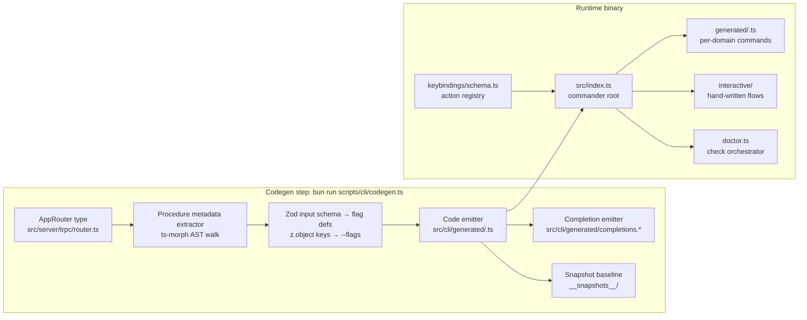
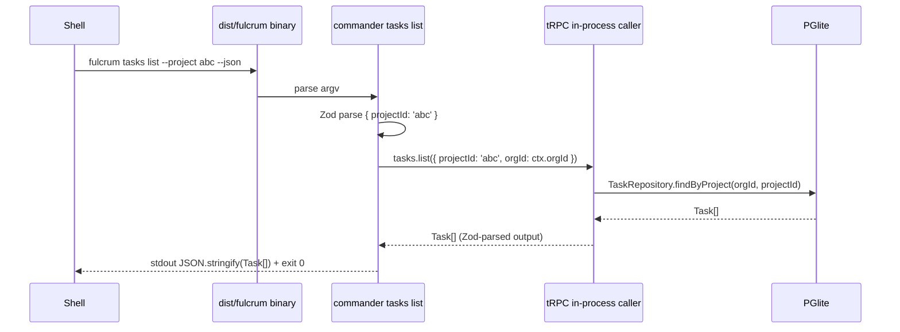
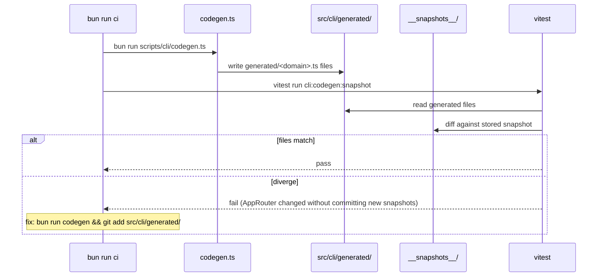

# PRD 14: CLI (Auto-Codegen from tRPC)

## Status
ready-for-plan-breakdown

## Linkage chain
- Vision: `.scratch/agent-os-vision/VISION-GAPS.md` rows: "Three surfaces, all shipped" (C4 mandate)
- Requirements: `.scratch/agent-os-vision/REQUIREMENTS.md` Pillar 14 section
- Decisions: Q-cli-shape, Q-distribution, C4, D5, A1, A2, Q29, Q30, Q31
- Docs: Bun compile docs (`https://bun.sh/docs/bundler/executables`), commander.js README, tRPC server-side caller docs

## Vision
Every tRPC procedure has a `fulcrum <domain> <verb> [flags]` binding with `--json` output and auto-generated help text, all produced by a single codegen step that reads the tRPC router. One static binary (`bun build --compile`) ships the full command tree; hand-written interactive flows cover the exceptions. The keyboard shortcuts registry at `src/keybindings/schema.ts` is the single source of truth consumed by web, CLI, and TUI.

## Out-of-scope
Per C5: only (1) genuinely-not-asked items or (2) cross-pillar-owned items appear here.

- **TUI screens** — Owned by Pillar 15. CLI binary launches `fulcrum tui` which hands off to OpenTUI; the TUI itself is Pillar 15's scope.
- **SvelteKit web routes** — Owned by Pillar 16. `fulcrum web` starts the SvelteKit server; route implementation is Pillar 16's scope.
- **tRPC procedure signatures** — Owned by Pillar 13 (consolidated router). CLI codegen reads them but does not define them.
- **Doctor check implementations per subsystem** — Each pillar owns its doctor check module. This pillar owns the `fulcrum doctor` orchestrator that loads and runs all registered checks, aggregates output, and enforces CI exit code.
- **Inference sidecar binary** — Owned by Pillar 2. `fulcrum inference start/stop/status` hands off to the Rust binary; build pipeline for the Rust binary is Pillar 2's scope.
- **Mobile shell / React Native** — Not in user's verbatim ask. Excluded.

## Always-on features

### Codegen pipeline
`bun run scripts/cli/codegen.ts` — reads the `AppRouter` TypeScript type from `src/server/trpc/router.ts`; no DB schema introspection, migrations, or repository access in codegen:
1. Introspects procedure metadata: name, type (query/mutation/subscription), Zod input schema, Zod output schema, docstring.
2. Emits `src/cli/generated/<domain>.ts` per sub-router — one file per domain with: `commander` `Command` instances, flag definitions derived from Zod input schema (object keys → `--key` flags; optional fields → optional flags; defaults forwarded), `--json` flag on every command, `--watch` on subscription procedures, help text from Zod description strings.
3. Emits `src/cli/generated/completions.sh` / `.zsh` / `.fish` for shell completion; all domain verbs + flags present.
4. Codegen is deterministic: same input router → bitwise-identical output files. Tested by snapshot test.
5. Codegen runs as part of `bun run ci` (`ci:codegen` stage); fails CI if output diverges from committed snapshots.

### Command tree (`fulcrum <domain> <verb>`)
Full domain/verb matrix — all from tRPC codegen:

| Domain | Verbs |
|---|---|
| `projects` | `list`, `get`, `create`, `update`, `delete`, `stats` |
| `tasks` | `list`, `get`, `create`, `update`, `delete`, `bulk`, `move`, `claim` |
| `sprints` | `list`, `get`, `create`, `update`, `delete`, `activate`, `complete` |
| `custom-fields` | `list`, `create`, `update`, `delete`, `reorder` |
| `saved-views` | `list`, `get`, `create`, `update`, `delete` |
| `docs` | `list`, `get`, `create`, `update`, `delete`, `move` |
| `doc-versions` | `list`, `get`, `restore` |
| `doc-comments` | `list`, `create`, `update`, `delete` |
| `memories` | `list`, `get`, `create`, `update`, `delete`, `promote` |
| `context` | `assemble`, `preview` |
| `runs` | `list`, `get`, `cancel`, `retry` |
| `artifacts` | `list`, `get`, `download`, `delete` |
| `repos` | `list`, `get`, `register`, `sync`, `unregister` |
| `search` | (query), `suggest`, `saved list|create|delete` |
| `notify` | `list`, `mark-read`, `mute`, `unmute`, `rules *`, `channels *` |
| `audit` | `query`, `export` |
| `routing` | `rules list|get|create|update|delete|test|dry-run` |
| `skills` | `list`, `install`, `upgrade`, `uninstall`, `sync`, `conflicts list|resolve` |
| `symphony` | `status`, `sync`, `runs list|show` |
| `inference` | `start`, `stop`, `status`, `models list|pull|default` |
| `webhooks` | `list`, `create`, `update`, `delete`, `deliveries`, `test` |
| `connectors` | `list`, `enable`, `disable`, `sync`, `runs`, `config` |
| `import` | `csv`, `linear`, `jira`, `plane` |
| `export` | `csv` |
| `flags` | `list`, `set` |
| `auth` | `whoami`, `invite`, `logout` |
| `orgs` | `get`, `update`, `members list|update-role|remove` |
| `backup` | (run), `restore` |
| `doctor` | (run) |

`--json` universal: every command, when `--json` flag present, writes a single JSON object or array to stdout and exits 0. Error conditions: writes `{ "error": { "code": "<code>", "message": "<msg>" } }` to stdout + exits non-zero.

`--watch` on subscription procedures (`runs get`, `notify list --unread`): subscribes via tRPC WebSocket and streams JSON objects one per line until `CTRL+C`.

### Hand-written interactive flows (exceptions to codegen)
`src/cli/interactive/` — these are not generated; they require TTY + interactive prompts:

- `fulcrum init` — seeds org + admin@local user; idempotent; no-prompt after first run.
- `fulcrum tui` — launches OpenTUI in-process (passes control to Pillar 15).
- `fulcrum web` — starts SvelteKit server; `--port`, `--host`, `--open` flags.
- `fulcrum inference start [--foreground]` — spawns Rust sidecar; `--foreground` blocks and streams logs.
- `fulcrum inference stop` — sends shutdown signal to sidecar.
- `fulcrum doctor` (interactive mode) — default when `--json` not set; per-check spinner UI with green/yellow/red icons; recovery guidance displayed inline.
- `fulcrum routing rules edit <id>` — opens `$EDITOR` with YAML rule definition; saves on exit.
- `fulcrum skills conflicts resolve <slug>` — side-by-side diff in pager; `k`=keep local, `u`=use upstream, `m`=`$EDITOR`.
- `fulcrum backup` — progress bar; destination path prompt if `--output` not set.
- `fulcrum restore` — confirmation prompt before overwrite.
- `fulcrum import csv` — column-mapping wizard if `--map-columns` not provided.

### Binary entrypoint (`fulcrum`)
`src/index.ts` — commander root program:
```
fulcrum [<domain> <verb> [flags]]   # codegen'd tree
fulcrum tui                         # hand-written
fulcrum web                         # hand-written
fulcrum init                        # hand-written
fulcrum doctor [--json]             # hand-written orchestrator
fulcrum inference <start|stop|status|models ...>
fulcrum backup [--output <path>]
fulcrum restore --input <path>
fulcrum completion <bash|zsh|fish>  # emits shell completion script
```

`bun build --compile src/index.ts --outfile dist/fulcrum` — single static binary. Pre-built binaries shipped per Q29 for macOS arm64, macOS x64, Linux x64, Linux arm64, Windows x64.

### Shell completion
`fulcrum completion bash|zsh|fish` — emits completion script to stdout; user pipes to install location. Completions cover all generated domain/verb/flag combinations + dynamic completions for IDs (tRPC calls for list).

### Keyboard shortcuts registry
`src/keybindings/schema.ts` — Zod enum of all named actions:

```typescript
export const KeybindingAction = z.enum([
  // Navigation
  'navigate.projects', 'navigate.tasks', 'navigate.docs',
  'navigate.runs', 'navigate.search', 'navigate.inbox',
  // Task actions
  'task.create', 'task.update', 'task.delete', 'task.move-status',
  // Doc actions
  'doc.create', 'doc.save', 'doc.toggle-raw-yaml',
  // Sprint actions
  'sprint.activate', 'sprint.complete',
  // Global
  'palette.open', 'palette.command-mode', 'search.focus',
  'run.dispatch', 'run.cancel',
  // Misc
  'view.toggle-sidebar', 'view.cycle-view-type',
  'doctor.open', 'flags.open',
]);
```

`src/keybindings/defaults.ts` — platform-aware default bindings (macOS `⌘`, Linux/Win `Ctrl`). Consumed by:
- **Web** (`src/web/src/lib/keybindings.ts`): hotkey handler via Svelte `use:` action.
- **CLI** (`src/cli/keybindings.ts`): banner printed by `fulcrum --help` / `fulcrum <domain> --help`.
- **TUI** (Pillar 15 `src/tui/keybindings.ts`): OpenTUI keyboard event map.

`tenant_settings(org_id, user_id, key='keybinding.<action>', value='<shortcut>')` — per-user override; CLI reads via tRPC `tenant_settings.get('keybinding.*')`.

## Gated features

No flags specific to Pillar 14 itself. `FULCRUM_FEATURES` env var flows through from the shell environment into all generated commands — each domain command invokes tRPC in-process, and in-process flag evaluation applies normally. Examples:
- `fulcrum inference start` → only meaningful when Pillar 2 sidecar available; exits with informative message if binary not built.
- `fulcrum connectors enable jira` → tRPC call throws `FeatureDisabledError` when `connector-jira` OFF.
- `fulcrum search "query" --semantic` → calls `search.query` with `embeddings` path; throws `FeatureDisabledError` when `embeddings` OFF.

## Tech stack

### Stack
- C7: no CLI-owned entities or migrations; generated commands call tRPC and domain repositories stay behind services.
- C8: hand-written CLI flows and doctor checks are `@Injectable()` services resolved from the shared needle-di container.
- C9: DB access, when needed by doctor checks, goes through `src/db/repositories/...`; no hand-authored migration-file paths.
- Bun compile size note: baseline ~60 MB + needle-di <0.01 MB + MikroORM core ~280 KB; comfortably under the 150 MB binary target.

| Layer | Pick | License | Failure gate → action | 2nd | 3rd |
|---|---|---|---|---|---|
| CLI framework | `commander` v12 (MIT, 27k stars) | MIT | commander breaking change or Bun compat issue → minimal hand-rolled arg parser (~300 LOC) with same `--json` contract | `yargs` (MIT) | hand-rolled |
| Binary bundler | `bun build --compile` | MIT | Binary >150 MB → split `fulcrum-cli` + `fulcrum-web` packages; shared `@fulcrum/core` | `pkg` (MIT, Node) — only if Bun compile blocked | Source-only build |
| Interactive prompts | `@inquirer/prompts` (MIT) | MIT | ESM compat break with Bun → `prompts` (MIT) | `enquirer` (MIT) | `readline` stdlib |
| Pager / diff display | `less` via `Bun.spawn` | — | `less` unavailable → `more` → plain stdout | — | — |
| Codegen (TS emit) | `ts-morph` (MIT) for AST emit | MIT | ts-morph too heavy → `@babel/generator` (MIT) | Template literal emit (no AST lib) | — |
| Snapshot testing | Vitest `toMatchSnapshot` | MIT | N/A (same test infra) | — | — |

## Schema changes

No new entity classes or migration classes. Pillar 14 reads the `AppRouter` TypeScript type for codegen and invokes tRPC in-process at runtime. Keybinding overrides are read through `TenantSettingsRepository` behind an injectable service when needed; no DB work happens in the generator.

## Surfaces

Pillar 14 **is** the CLI surface. It ensures all other pillars' tRPC procedures are reachable from the shell. "Surfaces parity" for this pillar means:
- Every Web UI action has a corresponding CLI command that produces identical data via the same tRPC procedure.
- Every TUI action has a corresponding CLI command.
- Verified by the parity matrix in Acceptance criteria.

## Technical design

### Codegen pipeline architecture



### Sequence: `fulcrum tasks list --project <id> --json`



### Sequence: `fulcrum doctor` (interactive)

```mermaid
sequenceDiagram
    participant Shell
    participant DOCC as fulcrum doctor (interactive)
    participant REG as check registry
    participant CHK1 as api check
    participant CHK2 as inference check
    participant CHK3 as connector checks
    participant TRPC as tRPC in-process

    Shell->>DOCC: fulcrum doctor
    DOCC->>REG: load all registered checks from src/doctor/checks/*.ts
    loop per check (parallel batches)
        REG->>CHK1: run()
        CHK1->>TRPC: doctor.run / in-process probe
        TRPC-->>CHK1: CheckResult
        CHK1-->>REG: { id, status, message, durationMs }
        REG->>CHK2: run()
        REG->>CHK3: run()
    end
    REG-->>DOCC: DoctorReport[]
    DOCC-->>Shell: colored spinner output; non-zero exit if any fail
```

### Sequence: codegen snapshot CI gate



### Error model

| Error | Condition | CLI behavior |
|---|---|---|
| `FeatureDisabledError` | tRPC procedure behind OFF flag | `--json`: `{ "error": { "code": "FEATURE_DISABLED", "flag": "<flag>" } }` + exit 1; interactive: "Feature <flag> is disabled. Enable with: fulcrum flags set <flag> on" |
| `FORBIDDEN` | Permission check fails | `{ "error": { "code": "FORBIDDEN" } }` + exit 3 |
| `NOT_FOUND` | Resource not found | `{ "error": { "code": "NOT_FOUND", "id": "<id>" } }` + exit 4 |
| `VALIDATION_ERROR` | Zod parse failure on CLI flags | Print Zod error map formatted; exit 2; no `--json` needed (always machine-readable shape) |
| `NETWORK_ERROR` | tRPC in-process call throws unexpected | `{ "error": { "code": "INTERNAL", "message": "<msg>" } }` + exit 5; also written to `~/.fulcrum/state/errors/YYYY-MM-DD.jsonl` |
| `SIDECAR_UNAVAILABLE` | `fulcrum inference start` with no binary | Friendly message with build instructions + exit 6 |
| `INTERACTIVE_REQUIRED` | `--non-interactive` passed to interactive flow | `{ "error": { "code": "INTERACTIVE_REQUIRED" } }` + exit 7 |

Exit codes are stable and documented in `docs/cli-exit-codes.md`.

### Observability

CLI calls are in-process: they inherit the same OTel span from the tRPC middleware. No extra instrumentation needed. Additional CLI-specific log:
- Every command invocation appended to `~/.fulcrum/state/cli-history.jsonl`: `{ ts, command, args, flags, exitCode, durationMs }`.
- `--verbose` flag on any command: streams tRPC procedure logs to stderr.
- Crash / unhandled rejection: caught by global handler; writes to `~/.fulcrum/state/errors/YYYY-MM-DD.jsonl` with stack trace + system info; prints "Error logged to ~/.fulcrum/state/errors/..."; exits 1.

### Performance budgets

| Operation | p50 target | p95 target |
|---|---|---|
| `fulcrum tasks list --json` (cold start, 100 tasks) | <100ms | <300ms |
| `fulcrum tasks list --json` (warm binary, subsequent call) | <50ms | <150ms |
| `fulcrum doctor --json` (all checks, clean install) | <2s | <5s |
| Codegen step `bun run scripts/cli/codegen.ts` | <3s | <8s |
| Shell completion suggestion | <50ms | <100ms |
| `bun build --compile` (full binary) | <30s | <60s |

## Doctor integration

### Checks added to `fulcrum doctor`

`src/doctor/checks/cli.ts` — CLI pillar's own checks. Checks that need persisted state resolve injectable services from the shared container and call repositories through those services:

1. **Binary entrypoint** — `dist/fulcrum` (or `fulcrum` on PATH) runs `--version`; assert exit 0.
2. **Codegen sync** — run codegen in dry-run mode; assert output matches committed `src/cli/generated/` snapshots.
3. **Completion scripts** — `fulcrum completion bash` emits non-empty script; fish + zsh variants same.
4. **`--json` on all domain commands** — sample 10 domain commands with `--help --json`; assert non-zero output (verifies `--json` registered on each).
5. **`fulcrum init` idempotency** — run twice; assert no error on second run; org row count stable.
6. **Error log dir writable** — `~/.fulcrum/state/errors/` writable; size report.

`fulcrum doctor` is also the aggregator: it loads ALL registered doctor check modules from each pillar (`src/doctor/checks/*.ts`) and runs them in parallel batches. This pillar owns:
- `src/doctor/index.ts` — orchestrator that discovers + runs checks.
- `src/doctor/runner.ts` — parallel batch execution, timeout per check (default 10s).
- `src/doctor/output.ts` — interactive (colored) + `--json` output modes.
- `fulcrum doctor --subsystem <name>` — runs only checks for a named subsystem.

### JSON output shape (Zod schema)

```typescript
const DoctorCheckResult = z.object({
  id: z.string(),
  subsystem: z.string(),
  status: z.enum(['pass', 'warn', 'fail', 'skip']),
  message: z.string(),
  recovery: z.string().optional(),      // one-line recovery instruction
  durationMs: z.number(),
  metadata: z.record(z.unknown()).optional(),
});

const DoctorReport = z.object({
  version: z.string(),                  // fulcrum binary version
  timestamp: z.string(),                // ISO 8601
  checks: z.array(DoctorCheckResult),
  summary: z.object({
    pass: z.number(),
    warn: z.number(),
    fail: z.number(),
    skip: z.number(),
    ok: z.boolean(),                    // true = zero fails
  }),
});
```

Exit code: 0 = all pass or warn; 1 = any fail. `bun run ci` runs `fulcrum doctor --json`; fails CI on exit 1.

### Failure recovery guidance

- `codegen-sync fail` → run `bun run codegen && git add src/cli/generated/`; commit; retry.
- `binary-entrypoint fail` → run `bun run build:cli`; verify `dist/fulcrum --version`.
- `completion-scripts fail` → run `bun run codegen`; re-check completion output.
- `init-idempotency fail` → check `~/.fulcrum/` for corrupted DB file; `fulcrum doctor --subsystem db` for schema check.

## Dependencies

| Pillar | Reason |
|---|---|
| Pillar 1 | Auth session; tRPC context; flag registry; graphile-worker; PGlite; `tenant_settings` for keybinding overrides |
| Pillar 13 | `AppRouter` stable type — codegen reads it; Pillar 13 must finalize all procedure signatures before Pillar 14 codegen is locked |
| Pillars 2–12 | Each pillar's doctor check module registered in `src/doctor/checks/`; all domain sub-routers registered in `AppRouter` |

Pillar 14 is a **consumer** of all other pillars; it must ship last among the core pillars (after Pillar 13 stabilises `AppRouter`) but before Pillar 15 (TUI) which also depends on the `AppRouter` type.

## Issues breakdown (TDD-numbered P14.x)

**Codegen pipeline**
- `P14.01` Codegen scaffolding `scripts/cli/codegen.ts`. Tests: reads `AppRouter` type; emits `src/cli/generated/projects.ts` with correct `commander` instance; snapshot baseline established.
- `P14.02` Zod-to-flag mapping. Tests: `z.string()` → `--key <string>`; `z.number()` → `--key <number>`; `z.boolean()` → `--key` (flag); `z.optional()` → optional flag; `z.enum()` → choices; nested `z.object()` → `--parent-child` flattened.
- `P14.03` `--json` flag generation. Tests: every generated command has `--json`; `--json` produces JSON to stdout; `--help` shows `--json`.
- `P14.04` `--watch` generation for subscription procedures. Tests: `runs get --watch` subscribes; streams JSON lines; exits on `CTRL+C`.
- `P14.05` Completion script emitter. Tests: bash completion non-empty; zsh completion non-empty; fish completion non-empty; all domain verbs present.
- `P14.06` Codegen CI snapshot gate. Tests: diverged generated file → CI fail; matching → pass; deterministic (run twice = same output).
- `P14.07` Codegen runs in `bun run ci` (`ci:codegen` stage). Tests: `ci` script includes codegen step; stage exits non-zero on snapshot mismatch.

**Binary + entrypoint**
- `P14.08` `src/index.ts` commander root. Tests: `fulcrum --help` exits 0; `fulcrum --version` exits 0 with semver; unknown command exits 1 with suggestion.
- `P14.09` `bun build --compile` produces `dist/fulcrum`. Tests: file exists, executable bit set, file runs on macOS arm64 + Linux x64 in CI.
- `P14.10` Cross-compile all 5 targets (per Q29). Tests: CI matrix produces 5 binaries; each `--version` succeeds; Windows x64 failure tolerated (warn, not block).
- `P14.11` Binary size check. Tests: `dist/fulcrum` < 150 MB; warn at 130 MB; fail at 150 MB.

**Generated domain commands — integration tests**
- `P14.12` `fulcrum projects list --json`. Tests: returns `Project[]` Zod shape; empty org → `[]`; `--limit` respected.
- `P14.13` `fulcrum tasks create --title "T" --project <id> --json`. Tests: task created; returned row has `id`, `title`, `status='open'`.
- `P14.14` `fulcrum tasks list --status open --assignee me --json`. Tests: filters applied; shape correct.
- `P14.15` `fulcrum docs create --title "D" --type note --project <id> --json`. Tests: doc created; `doc_type='note'`.
- `P14.16` `fulcrum sprints activate <id> --json`. Tests: sprint status = `'active'`; error when already active.
- `P14.17` `fulcrum memories list --project <id> --json`. Tests: returns `Memory[]`; project filter applied.
- `P14.18` `fulcrum search "query" --kind task --json`. Tests: FTS returns results; `--kind` filters correctly.
- `P14.19` `fulcrum runs list --status running --json`. Tests: shape correct; claim state reflected.
- `P14.20` `fulcrum notify list --unread --json`. Tests: only unread rows; `--watch` streams new notifications.
- `P14.21` `fulcrum audit query --kind task --since <ISO> --json`. Tests: filter applied; rows have `org_id`.
- `P14.22` `fulcrum webhooks list --json` + `fulcrum webhooks test <id>`. Tests: list shape; test-fire delivery row created.
- `P14.23` `fulcrum connectors enable jira` (flag ON). Tests: connector `enabled=true`; flag OFF → `FeatureDisabledError`.
- `P14.24` `fulcrum flags list --json` + `fulcrum flags set router-llm on`. Tests: flag set; list reflects; `--json` schema stable.

**Hand-written flows**
- `P14.25` `fulcrum init` idempotent. Tests: run twice; second run exits 0; single org + user row.
- `P14.26` `fulcrum doctor --json`. Tests: all registered checks run; `DoctorReport` shape valid; exit 0 on clean install.
- `P14.27` `fulcrum doctor` interactive mode. Tests: spinner output visible; green/yellow/red icons; recovery lines printed for warn/fail checks.
- `P14.28` `fulcrum doctor --subsystem api`. Tests: only `subsystem: 'api'` checks run; others skipped.
- `P14.29` `fulcrum routing rules edit <id>` opens `$EDITOR`. Tests: mock `EDITOR=cat`; YAML written to temp file; save round-trips.
- `P14.30` `fulcrum skills conflicts resolve <slug>` interactive. Tests: `--keep local` skips pager; `--keep upstream` overwrites; `--non-interactive` required when no TTY.
- `P14.31` `fulcrum backup --output /tmp/backup.tar.gz`. Tests: file created; contains PGlite dump + artifacts manifest.
- `P14.32` `fulcrum restore --input /tmp/backup.tar.gz`. Tests: confirmation prompt (mocked); DB restored; artifacts re-linked.

**Keybindings registry**
- `P14.33` `src/keybindings/schema.ts` exports `KeybindingAction` enum. Tests: all actions importable by web (`src/web`), CLI (`src/cli`), TUI (`src/tui`) without error; Zod parse of default bindings valid.
- `P14.34` `tenant_settings` keybinding override. Tests: `fulcrum flags set` analog for keybindings via `tenant_settings.set`; web reads override; TUI reads override; CLI `--help` reflects override.

**Error model + logging**
- `P14.35` Exit codes 0–7 verified. Tests: one case per exit code; `--json` error shape consistent.
- `P14.36` CLI history log. Tests: `~/.fulcrum/state/cli-history.jsonl` appended per invocation; contains `command`, `exitCode`, `durationMs`.
- `P14.37` Crash handler. Tests: throw unhandled rejection → `errors/YYYY-MM-DD.jsonl` written; message printed; exit 1.

**Doctor + CI**
- `P14.38` Doctor CLI checks `src/doctor/checks/cli.ts`. Tests: all 6 checks pass on clean build.
- `P14.39` `bun run ci` runs `fulcrum doctor --json` as final gate. Tests: CI script includes doctor step; exit 1 on any fail check; exit 0 on clean.

**Performance**
- `P14.40` `hyperfine` benchmark `fulcrum tasks list --json` p95 <300ms (cold), <150ms (warm). Test in CI with 1k tasks fixture.

## Failure gates

| Gate | Trigger | Response |
|---|---|---|
| `commander` breaking change / Bun compat break | `commander` import fails in Bun compiled binary | Replace with hand-rolled arg parser (~300 LOC); same `--json` + exit-code contract; all tests still pass |
| Binary >150 MB | `dist/fulcrum` exceeds 150 MB after tree-shaking | Split: `fulcrum-cli` (commands only) + `fulcrum-web` (SvelteKit); shared `@fulcrum/core` package |
| Windows x64 cross-compile fails | `bun build --compile --target bun-windows-x64` errors | Skip Windows binary for that release; document in release notes; source build available |
| `ts-morph` codegen too slow (>30s) | CI `ci:codegen` stage times out | Switch to template literal emit; remove `ts-morph`; same snapshot contract |
| `@inquirer/prompts` ESM compat break | Interactive flows crash | Replace with `prompts` (MIT); same flow contract; 1-day swap |
| tRPC in-process caller startup >500ms | Cold-start CLI latency unacceptable | Add Bun AOT snapshot (`bun build --compile` already does this); investigate tRPC init chain |
| Keybinding overrides cause web/TUI crash | Malformed shortcut string in `tenant_settings` | Zod parse on load; invalid binding → warn + fall back to default; never crash |

## Acceptance criteria

- **Codegen correctness** — `bun run codegen` produces deterministic `src/cli/generated/<domain>.ts` for all 29 domains; snapshot test green; `bun run ci` fails when AppRouter changes without regenerating snapshots.
- **`--json` everywhere** — `fulcrum <domain> <verb> --json` returns valid Zod-typed JSON for every generated command; output is machine-parseable with `jq`; errors also JSON.
- **`--watch` on subscriptions** — `fulcrum runs get <id> --watch` streams JSON updates in real time; exit on `CTRL+C` without hang.
- **Doctor orchestrator** — `fulcrum doctor --json` runs checks from all registered pillar modules; `DoctorReport` Zod-validates; exit 0 on clean install; exit 1 on any fail; `bun run ci` integrates doctor gate.
- **All three surfaces parity** — for every domain, the same tRPC procedure is reachable via: (a) web UI action, (b) `fulcrum <domain> <verb> --json`, and (c) TUI keybind / menu action; parity matrix verified by integration tests (Playwright web + CLI integration + TUI smoke).
- **Keybindings single source of truth** — `src/keybindings/schema.ts` imported by web, CLI, and TUI without duplication; per-user override via `tenant_settings` reflected on all three surfaces.
- **Binary delivery** — `dist/fulcrum` produced by `bun build --compile`; runs on macOS arm64 + x64 + Linux x64 in CI; `fulcrum --version` exits 0; binary <150 MB.
- **Performance** — `fulcrum tasks list --json` p95 <300ms cold; codegen step <8s; `bun run ci` including codegen + doctor gate completes in <120s total.
