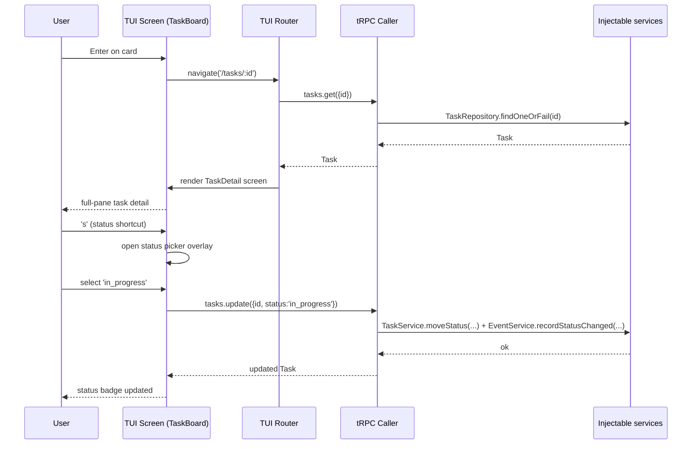
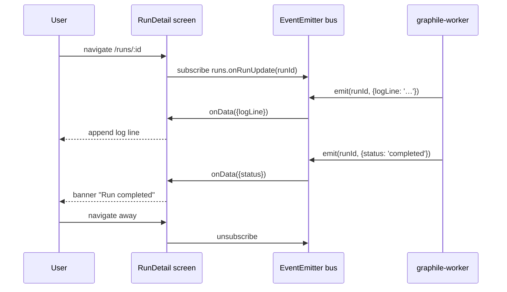

# PRD 15: TUI (OpenTUI, Full Feature Parity)

## Status
ready-for-plan-breakdown

## Linkage chain
- Vision: `.scratch/agent-os-vision/VISION-GAPS.md` — "Web+APIs primary, full CLI second, fully featured TUI last — all three shipped to feature parity"
- Requirements: `.scratch/agent-os-vision/REQUIREMENTS.md` — Pillar 15 section
- Decisions: Q-tui-lib (OpenTUI), Q-distribution (`fulcrum tui` subcommand), C4 (three surfaces all shipped), C1 (gated features shipped + disabled), Q-cli-shape (CLI tRPC codegen), Q28 (tRPC internal always-on)
- Docs: https://github.com/nicholasgasior/opentui (OpenTUI); https://github.com/crossterm-rs/crossterm (ratatui fallback reference)

---

## Vision

Fully featured interactive terminal UI — every screen, every domain, full feature parity with the Web shell (Pillar 16). Launched via `fulcrum tui` from the single compiled binary. Consumes all tRPC procedures in-process (no HTTP hop). Keyboard-first; shortcut registry defined in `src/keybindings/schema.ts` (shared with CLI and Web). Live updates via tRPC subscriptions over a local WebSocket bridge. Theming uses the same CSS-var contract translated to terminal ANSI palette slots. Doctor integration verifies render health and keybind conflicts.

User verbatim: "we also need it to be web + apis 1st but also ship full cli direct calls and a fully featured TUI too but last but i want all." C4 mandates: all three reach feature parity by release. None is deferred or MVP-qualified.

---

## Out-of-scope (per C5)

C5 carve-out (2) — owned by another pillar:
- **Pillar 13 (API):** tRPC procedure definitions. TUI consumes them in-process; it does not define them.
- **Pillar 14 (CLI):** `fulcrum tui` binary entrypoint scaffolding + keybindings schema file location. TUI reads from CLI's shared schema.
- **Pillar 16 (Web):** SvelteKit routes and web-specific rendering. TUI is a parallel surface, not derived from web.
- **Pillar 7 (Docs):** TipTap block editor engine. TUI uses a plain-text fallback editor for doc editing (terminal cannot host a ProseMirror DOM); full-fidelity editing is web-only. TUI renders doc content via remark → strip-ansi plain text.
- **Pillar 6 (Tasks):** svelte-gantt Gantt rendering. TUI renders timeline as ASCII bars; pixel-perfect Gantt is web-only.

C5 carve-out (1) — genuinely not in user's verbatim ask:
- **Plugin marketplace UI within TUI** — no locked decision for this surface.
- **Video/image inline preview** — terminal sixel graphics not in verbatim ask; download-only for binary artifacts.

---

## Always-on features

Ships unconditionally, all domain screens included.

### Launch + in-process tRPC bridge

`fulcrum tui` (binary dispatcher → `src/tui/index.ts`). TUI startup receives the shared needle-di container and calls `container.resolve(...)` for services such as `TrpcCallerService`, `ThemeService`, and `KeybindingService`. In-process tRPC caller via `createCaller(ctx)` — zero HTTP. Context bootstrapped from same Better-Auth session as CLI. tRPC subscriptions delivered via a local in-process event emitter bridge (no WebSocket server started; subscriptions are direct EventEmitter listeners). Graceful exit: `Ctrl+C` / `q` on root pane saves state to `~/.fulcrum/tui-state.json` (last focused pane, scroll positions).

### Keyboard-first shortcut registry (shared)

`src/keybindings/schema.ts` — Zod enum of semantic actions:
```
NavigateLeft, NavigateRight, NavigateUp, NavigateDown,
Select, Confirm, Cancel, GoBack,
OpenSearch, OpenPalette, CreateItem, EditItem, DeleteItem,
ToggleView, RefreshPane, ToggleSidebar, ToggleHelp,
BulkSelect, BulkAction, NextTab, PrevTab,
OpenDetail, OpenBoard, OpenList, OpenCalendar, OpenTimeline,
MarkRead, Mute, ArchiveItem,
TaskStatus, TaskAssign, TaskPriority, TaskLabel, TaskDueDate,
SprintPlanMove, SprintClose,
MemoryGlobal, DocNewBranch, RunDispatch, ArtifactDownload,
InferenceStatus, OrchestratorStatus, AgentDispatch,
FlagToggle, ThemeNext, QuitTUI
```

Key bindings defined in `src/keybindings/default-tui.ts`; overridable by user via `~/.fulcrum/keybindings.json`. TUI help pane (`?`) renders current binding map from schema.

### Screen inventory (full parity with Pillar 16 web routes)

All screens listed below are always-on unless explicitly gated. Each screen is an OpenTUI component tree, reads state via tRPC, writes via tRPC mutations.

| Screen | Route analogue | Primary keybinds |
|---|---|---|
| Dashboard | `/` | `p` projects, `r` recent runs, `n` notifications |
| Projects list | `/projects` | `Enter` open, `c` create, `d` delete |
| Project detail | `/projects/[id]` | `b` board, `l` list, `s` sprints, `r` reports, `o` repos, `D` docs |
| Tasks list | `/projects/[id]/backlog` | `c` create, `Enter` detail, `Space` multi-select, `B` bulk |
| Task board (Kanban) | `/projects/[id]/board` | `h`/`l` move status column, `Enter` detail, `c` create inline |
| Task calendar | `/projects/[id]/board?view=calendar` | `←`/`→` navigate weeks, `Enter` detail |
| Task timeline (ASCII Gantt) | `/projects/[id]/board?view=timeline` | `←`/`→` scroll, `Enter` detail |
| Task detail | `/tasks/[id]` | `e` edit title, `a` assign, `s` status, `p` priority, `d` due date, `l` labels |
| Sprints list | `/projects/[id]/sprints` | `c` create, `Enter` detail, `A` start active |
| Sprint planning | `/projects/[id]/sprints` (plan mode) | `m` move to sprint, `x` remove, capacity bar header |
| Sprint detail (active board) | `/projects/[id]/sprint/[sid]` | Kanban columns scoped to sprint |
| Reports hub | `/projects/[id]/reports` | `1`–`6` switch chart type |
| Burndown | `/projects/[id]/reports?report=burndown` | ASCII area+line via `asciichart` |
| Velocity | `/projects/[id]/reports?report=velocity` | ASCII bar chart |
| Cycle-time | `/projects/[id]/reports?report=cycletime` | ASCII histogram |
| Throughput | `/projects/[id]/reports?report=throughput` | ASCII sparkline |
| WIP | `/projects/[id]/reports?report=wip` | Counters + sparkline |
| CFD | `/projects/[id]/reports?report=cfd` | ASCII stacked area |
| Docs tree + reader | `/docs`, `/projects/[id]/docs` | `←`/`→` tree/content split, `e` edit, `n` new |
| Doc editor (plain) | `/docs/[id]/edit` | Full-pane plain-text editor; frontmatter YAML form above separator |
| Doc history | `/docs/[id]/history` | Version list; `Enter` diff view |
| Memory browser | `/memory` | `Enter` detail, `g` toggle global, `/` search |
| Context bundle preview | `/context/preview` | Pane per slice: memories / docs / transcripts / repo state |
| Runs list | `/runs` | `Enter` detail, `d` dispatch new run |
| Run detail + live log | `/runs/[id]` | Streaming log lines via subscription, `x` cancel |
| Artifacts browser | `/artifacts` | `Enter` preview (text) or `w` download, `D` delete |
| Repos browser | `/repos` | `Enter` detail, `s` sync |
| Repo detail + file viewer | `/repos/[id]` | `f` file tree, `l` commit log |
| Commit log | `/repos/[id]/commits` | `Enter` diff view |
| Search full-screen | `/search` | `Tab` cycle kinds, `Enter` open, facet checkboxes left rail |
| Cmd+K palette | global overlay `⌘K` / `Ctrl+K` | `>` command mode, quick-filter tokens |
| Notifications inbox | `/inbox` | `R` mark read, `M` mute, `Enter` navigate |
| Audit log | `/audit` | filter chips, `E` export JSON |
| Agents registry | `/agents` | `Enter` detail, `d` dispatch |
| Orchestration dashboard | `/orchestration` | Live run list, claim states |
| Inference dashboard | `/inference` | Sidecar status, model list, `s` start/stop |
| Doctor | `/doctor` | Per-subsystem check rows, `Enter` recovery guide |
| Settings: routing rules | `/settings/routing` | CRUD list, `c` create |
| Settings: skills | `/settings/skills` | List, `u` update, `c` conflicts |
| Settings: custom fields | `/settings/custom-fields` | CRUD per project |
| Settings: saved views | `/settings/saved-views` | CRUD |
| Settings: integrations/connectors | `/settings/integrations` | Per-connector status, `s` sync |
| Settings: theme | `/settings/theme` | ANSI palette picker, `n` next preset |
| Settings: i18n | `/settings/i18n` | Locale list (gated `i18n`) |
| Settings: secrets | `/settings/secrets` | Masked list, `a` add, `d` delete |
| Settings: backups | `/settings/backups` | `b` backup, `r` restore, `s` schedule (gated) |
| Settings: feature flags | `/settings/feature-flags` | Toggle list |
| Settings: users + invites | `/settings/users` | Member list, `i` invite |
| Auth screen | `/auth` | Passkey + password; TUI status bar shows org + user |

### Live updates via subscriptions

tRPC subscriptions (`runs.onRunUpdate`, `notify.onNewNotification`, `orchestration.onStateChange`, `inference.onSidecarStatus`) emit via in-process EventEmitter. TUI components subscribe on mount, unsubscribe on unmount. Bell badge increments live. Run log streams lines.

### Theme translation

`src/tui/theme.ts` reads `tenant_settings` CSS-var values (`--color-primary`, `--color-bg`, `--color-surface`, `--color-muted`, `--color-success`, `--color-destructive`) and maps to `picocolors` ANSI codes. Palette slots: fg-primary, fg-muted, bg-panel, bg-focused, border, success, warning, error. User `Settings → Theme` in TUI cycles through built-in palettes (dark, light, monokai, solarized-dark, dracula).

### wcwidth for full-width characters

`wcwidth` npm package handles CJK double-width characters, emoji widths. Used in all string-truncation paths (`src/tui/utils/truncate.ts`) to prevent layout overflow. Verified by snapshot test with CJK sample strings.

---

## Gated features

All shipped + tested; OFF by default; flip individual flag to enable.

| Feature | Gate flag | What it does in TUI |
|---|---|---|
| i18n locale selection | `FULCRUM_FEATURES=i18n` | Settings → i18n screen lists available locales; selection writes `tenant_settings(locale)`; TUI re-renders labels from paraglide-js message catalog |
| Semantic search | `FULCRUM_FEATURES=embeddings` | `/search` screen shows "Semantic" toggle; queries hybrid score endpoint when ON |
| Real-time collab cursors | `FULCRUM_FEATURES=real-time-collab-server` | Doc editor shows collaborator names in header bar; presence list in sidebar |
| Scheduled backups | `FULCRUM_FEATURES=scheduled-backups` | Settings → Backups shows cron schedule picker |
| Feature-flag A/B | `FULCRUM_FEATURES=experiments` | Settings → Experiments panel lists active experiments + assigned variant |
| Casbin ABAC | `FULCRUM_FEATURES=casbin-policies` | Settings → Permissions panel shows casbin rule editor |
| Desktop app (Tauri) keybind bridge | `FULCRUM_FEATURES=desktop-app` | TUI `fulcrum tui` running inside Tauri shell receives native OS keybindings via Tauri IPC bridge; no-op when running standalone |
| Public API explorer | `FULCRUM_FEATURES=public-api` | Settings → API screen shows OpenAPI base URL + copy-token action |
| Telemetry opt-in | `FULCRUM_FEATURES=telemetry-remote` | Settings → Privacy shows telemetry toggle; ON enables remote aggregation |

---

## Tech stack

### Stack
- C7: TUI owns no tables; it consumes MikroORM-backed domain services through tRPC and repositories.
- C8: OpenTUI screens call services via `container.resolve(...)`; settings screens read repositories through injectable services, never direct query strings.
- C9: persistent state such as keybindings/theme lives in existing entity/repository paths; no TUI-owned migration files.

| Layer | Pick | License | Failure gate → action | 2nd | 3rd |
|---|---|---|---|---|---|
| TUI framework | OpenTUI (Bun-native TS, JSX components) | MIT | OpenTUI component library too immature OR missing required primitives (overlay, split-pane, virtual scroll) at pillar start time → switch to ratatui (Rust, MIT) sharing the `inference/` Cargo workspace; TUI logic ported to Rust; tRPC consumed via Unix socket same as sidecar | ratatui (Rust MIT) | ink (React/Node, MIT) |
| ANSI colour | `picocolors` | MIT | API incompatible with Bun → `chalk` (MIT, ESM) | `chalk` | `kleur` (MIT) |
| Keyboard events | `@nicholasgasior/opentui` native keypress | MIT | Falls back with OpenTUI fallback | `keypress` (MIT, Node) | raw `process.stdin` via Bun |
| Full-width char widths | `wcwidth` | MIT | Wrong widths on exotic code points → `get-east-asian-width` (MIT) | `get-east-asian-width` | bespoke BMP table |
| ASCII charts | `asciichart` | MIT | Missing chart type → custom d3-scale + manual ANSI bar render | bespoke render | `sparkly` (MIT) |
| Fake terminal driver (tests) | Custom `FakeTTY` (`src/tui/testing/fake-tty.ts`) — stdin/stdout streams | — | Snapshot diff breaks on cross-platform ANSI → `strip-ansi` before snapshot compare | strip-ansi snapshots | jest-snapshot-serializer-ansi |
| Virtual scroll (long lists) | OpenTUI built-in virtual list | MIT | Missing → manual row-window with `Math.floor(scroll/row_height)` | Manual | ink-big-list (MIT) |
| Diff view (doc history) | `diff` npm package | BSD-3 | — | `jsdiff` | `structuredClone` delta |

---

## Schema changes

No new entity classes or migration classes. TUI consumes existing data exclusively through tRPC and injectable services.

TUI state uses `TenantSettingsRepository` keys such as `tui.last_pane`, `tui.theme_preset`, and `tui.keybinding_overrides_json`, stored per `(org_id, user_id)` in the existing Pillar 1 entity.

---

## Surfaces

**TUI** — primary surface for this pillar. Every screen listed under Always-on features.

**CLI integration** — `fulcrum tui` entrypoint (scaffolded by Pillar 14); `fulcrum doctor tui` check; `--no-tui` flag on any command suppresses TUI mode.

**Doctor** — `fulcrum doctor --json` includes TUI subsystem (see Doctor integration).

---

## Technical design

### Architecture diagram

```mermaid
graph TD
    subgraph "fulcrum binary"
        CLI[CLI dispatcher<br/>src/index.ts]
        TUI_ENTRY[TUI entrypoint<br/>src/tui/index.ts]
        TRPC_CALLER[tRPC in-process caller<br/>createCaller(ctx)]
        KB[Keybindings registry<br/>src/keybindings/schema.ts]
    end

    subgraph "OpenTUI runtime"
        APP[App root component<br/>src/tui/App.tsx]
        ROUTER[TUI Router<br/>src/tui/router.ts]
        SCREENS[Screen components<br/>src/tui/screens/]
        WIDGETS[Shared widgets<br/>src/tui/widgets/]
        THEME[Theme engine<br/>src/tui/theme.ts]
        VSCROLL[Virtual scroll<br/>src/tui/widgets/VirtualList.tsx]
        PALETTE[Cmd+K overlay<br/>src/tui/widgets/Palette.tsx]
    end

    subgraph "Data"
        TRPC_ROUTER[tRPC router<br/>src/server/trpc/]
        DB[(PGlite / Postgres)]
        SUB_BUS[EventEmitter bus<br/>subscription bridge]
    end

    CLI -->|fulcrum tui| TUI_ENTRY
    TUI_ENTRY --> APP
    APP --> ROUTER
    ROUTER --> SCREENS
    SCREENS --> WIDGETS
    SCREENS --> VSCROLL
    SCREENS --> PALETTE
    APP --> THEME
    APP --> KB
    SCREENS -->|calls| TRPC_CALLER
    TRPC_CALLER --> TRPC_ROUTER
    TRPC_ROUTER --> DB
    TRPC_ROUTER -->|emit| SUB_BUS
    SUB_BUS -->|subscription| SCREENS
```

### Sequence diagram — task detail open



### Sequence diagram — live run log



### Error model

- tRPC FORBIDDEN → TUI shows red status bar "Permission denied" + returns to previous screen.
- tRPC NOT_FOUND → "Not found" overlay; `G` go back.
- Network/DB error → error banner bottom bar + error written to `~/.fulcrum/state/errors/YYYY-MM-DD.jsonl`; retry button `r`.
- OpenTUI render exception → caught in root error boundary; renders fallback "TUI error" screen with stack trace; continues running.
- Subscription disconnect → banner "Live updates paused"; 5s reconnect with exponential backoff.

### Observability

- `~/.fulcrum/state/errors/YYYY-MM-DD.jsonl` — append on every unhandled TUI exception.
- `metrics` tRPC procedure records `tui_screen_render_ms` histogram per screen key to `local_telemetry` table (always-on local telemetry per Q-cross-cut).
- Doctor reads `local_telemetry` to compute p95 render times per screen.
- `FULCRUM_TUI_DEBUG=1` env var: writes raw keypress events + render timings to `~/.fulcrum/state/tui-debug.jsonl`.

### Performance budgets

| Metric | Target | Gate |
|---|---|---|
| Cold TUI startup to first paint | < 500ms | Doctor check; CI synthetic test |
| Screen navigation (pane switch) | < 50ms | In-process tRPC — no HTTP overhead |
| Virtual list scroll (1000 items) | < 16ms/frame | OpenTUI virtual list; fallback manual window |
| Search/palette keypress → results | < 150ms debounce | Same as web (shared tRPC) |
| Live log append latency | < 100ms | EventEmitter direct; no serialise/deserialise |
| Subscription reconnect | < 5s | Exponential backoff 1s→2s→4s→5s cap |

---

## Doctor integration

`fulcrum doctor --json` subsystem `tui`:

```json
{
  "subsystem": "tui",
  "checks": [
    {
      "name": "tui.binary_present",
      "description": "fulcrum binary compiled with TUI entrypoint",
      "status": "ok|fail",
      "recovery": "run: bun run build"
    },
    {
      "name": "tui.opentui_compatible",
      "description": "OpenTUI version matches expected API surface",
      "status": "ok|warn|fail",
      "recovery": "run: bun install opentui@<pinned>"
    },
    {
      "name": "tui.render_p95_ms",
      "description": "p95 screen render time from local_telemetry last 7d",
      "status": "ok (<50ms)|warn (50-200ms)|fail (>200ms)",
      "value": "<ms>",
      "recovery": "check tui-debug.jsonl; report OpenTUI issue"
    },
    {
      "name": "tui.keybind_conflicts",
      "description": "no two actions share the same key in any screen context",
      "status": "ok|fail",
      "conflicts": ["<key> bound to [ActionA, ActionB] in context X"],
      "recovery": "edit ~/.fulcrum/keybindings.json to resolve"
    },
    {
      "name": "tui.trpc_in_process",
      "description": "tRPC createCaller resolves without error on warmup query",
      "status": "ok|fail",
      "recovery": "check DB connection via: fulcrum doctor --subsystem db"
    },
    {
      "name": "tui.subscription_bridge",
      "description": "EventEmitter subscription bridge emits within 200ms of trigger",
      "status": "ok|fail",
      "recovery": "check graphile-worker status via: fulcrum doctor --subsystem jobs"
    },
    {
      "name": "tui.wcwidth_cjk",
      "description": "wcwidth returns 2 for U+4E2D (CJK sample)",
      "status": "ok|fail",
      "recovery": "run: bun install wcwidth@latest"
    }
  ]
}
```

Zod schema: `TuiDoctorCheck` with `{ name: z.string(), description: z.string(), status: z.enum(['ok','warn','fail']), value: z.string().optional(), recovery: z.string(), conflicts: z.array(z.string()).optional() }`.

---

## Dependencies

| Depends on | What we need |
|---|---|
| **Pillar 1** | tRPC context + auth + flag registry; `tenant_settings` for TUI state + theme; session for `createCaller(ctx)` |
| **Pillar 13 (API)** | All tRPC procedures; subscription definitions (`runs.onRunUpdate`, `notify.onNewNotification`, etc.) |
| **Pillar 14 (CLI)** | `fulcrum tui` binary entrypoint; keybindings schema file location + shared default bindings |
| **Pillars 2–12** | Domain tRPC procedures consumed by each TUI screen; Pillar 2 inference status subscription |
| **Pillar 6 (Tasks)** | Metrics cache for ASCII burndown/velocity |
| **Pillar 7 (Docs)** | Doc content (plain-text render for TUI); `doc_versions` for history screen |
| **Pillar 8 (Memory)** | Memory list + context bundle for preview screen |
| **Pillar 9 (Repos)** | Repo + commit list for browser + file viewer |
| **Pillar 11 (Search)** | `search.query` + `search.suggest` powering full-screen search + cmd+K palette |
| **Pillar 12 (Notifications)** | `notify.list` + `notify.unreadCount` subscription for bell badge |

Declared TUI feature parity is only claimable after all domain pillars (2–14) are functionally complete, per C4.

---

## Issues breakdown (TDD-numbered)

All issues follow TDD: failing test (RED) → implement (GREEN) → refactor.

**Foundation**
- `T15-01` `src/tui/index.ts` entrypoint — `fulcrum tui` launches, exits cleanly, `--help` prints screen list. Tests: binary smoke test, exit 0.
- `T15-02` tRPC in-process caller bootstrap (`createCaller(ctx)`) — auth context from session file. Tests: `tasks.list` returns typed data; FORBIDDEN on bad session.
- `T15-03` Keybindings registry (`src/keybindings/schema.ts` + `default-tui.ts`) — no duplicate bindings per context. Tests: static conflict detector, JSON override merging.
- `T15-04` TUI router (`src/tui/router.ts`) — `navigate(path)` swaps active screen, stores history stack, `GoBack` pops. Tests: 5-deep stack, unknown route → fallback.
- `T15-05` Theme engine (`src/tui/theme.ts`) — reads `tenant_settings`, maps CSS vars → ANSI slots, cycles presets. Tests: dark preset produces correct picocolors output; CJK chars not broken by colour codes.
- `T15-06` FakeTTY driver (`src/tui/testing/fake-tty.ts`) — stdin injection + stdout capture + ANSI strip. Tests: fake keypress triggers correct action; snapshot matches after strip-ansi.
- `T15-07` Subscription bridge — EventEmitter wraps tRPC subscription types; subscribe/unsubscribe lifecycle. Tests: emit → screen callback called; unsubscribe → no more calls.
- `T15-08` Error boundary + crashlog — unhandled render error → fallback screen + `errors/*.jsonl` write. Tests: throw in screen → fallback renders; log file written.
- `T15-09` Local telemetry hooks — `local_telemetry` row per screen render via `perf.now()`. Tests: row inserted with `screen_key` + `render_ms`.

**Global widgets**
- `T15-10` Cmd+K palette overlay (`src/tui/widgets/Palette.tsx`) — `⌘K`/`Ctrl+K` open, search + command mode, quick-filter tokens, `Esc` close. Tests: open/close, `>create-task` dispatches, `kind:doc` applied.
- `T15-11` VirtualList widget — 1000-item list scrolls without blank rows; `Enter` selects. Tests: 1000 tasks, scroll to last row, render time <16ms.
- `T15-12` StatusBar component — org name + user email + current screen + bell count. Tests: bell count increments on new notification, session change updates user.
- `T15-13` Help overlay (`?`) — renders keybinding map for current screen context. Tests: all registered bindings shown; context-switched map correct.
- `T15-14` Filter chips widget — add/remove facet chips, `Tab` to cycle, `Enter` apply. Tests: chip added, removed, array correct.
- `T15-15` ASCII chart renderer (`asciichart` wrapper + TUI size-aware scaling) — burndown, velocity, sparkline. Tests: known data → deterministic ASCII output (snapshot).

**Dashboard + Projects**
- `T15-16` Dashboard screen. Tests: projects count, open tasks count, recent runs, bell badge visible.
- `T15-17` Projects list screen. Tests: 20 projects render, `c` opens create form, `Enter` navigates.
- `T15-18` Project detail screen. Tests: tabs (board/list/sprints/reports/repos/docs) switchable.

**Tasks**
- `T15-19` Tasks list pane. Tests: 50 tasks, filter chips, `Space` multi-select, `B` bulk menu.
- `T15-20` Task board (ASCII Kanban). Tests: columns render, `h`/`l` move status, status change → tRPC mutation.
- `T15-21` Task calendar view. Tests: tasks by due_date, `←`/`→` week navigation.
- `T15-22` Task timeline (ASCII Gantt bars). Tests: bars by start/end, `←`/`→` scroll.
- `T15-23` Task detail pane. Tests: all sections (title/description/status/assignee/due/labels/custom-fields/comments/activity); `e` edit, `s` status picker, shortcut round-trip.
- `T15-24` Task create form (inline). Tests: required fields, submit → tRPC `tasks.create`, escape cancels.
- `T15-25` Subtask tree in detail pane. Tests: child tasks listed, breadcrumb, create child.
- `T15-26` Dependencies section. Tests: blocked-by list, add/remove dep via search overlay.
- `T15-27` Comments section. Tests: markdown rendered (ANSI-safe), create comment, show count.
- `T15-28` Bulk operation menu. Tests: Space multi-select, `B` opens menu, status bulk → all updated.

**Sprints + Reports**
- `T15-29` Sprints list screen. Tests: planned/active/completed grouping, `A` start sprint.
- `T15-30` Sprint planning split (backlog | sprint pane). Tests: `m` moves task, capacity bar updates.
- `T15-31` Active sprint board. Tests: scoped to sprint, days-remaining header, quick-add.
- `T15-32` Sprint close flow. Tests: disposition modal, retro doc creation event emitted.
- `T15-33` Reports hub. Tests: `1`–`6` key switches chart type.
- `T15-34` Burndown ASCII chart. Tests: ideal line + actual from `metrics_cache`; snapshot match.
- `T15-35` Velocity ASCII bar chart. Tests: 3-sprint window.
- `T15-36` Cycle-time ASCII histogram. Tests: median marker visible.
- `T15-37` Throughput + WIP + CFD ASCII charts. Tests: data shapes correct, no blank renders.

**Docs**
- `T15-38` Docs tree browser (project + global). Tests: tree expand/collapse, `n` new doc.
- `T15-39` Doc reader (plain-text remark render). Tests: headings/lists/code blocks ANSI-safe.
- `T15-40` Doc editor (plain-text + YAML frontmatter form). Tests: save → tRPC `docs.update`, load round-trips.
- `T15-41` Doc history screen. Tests: version list, `Enter` diff view (unified diff via `diff` package).

**Memory + Context**
- `T15-42` Memory browser. Tests: list, `g` toggle global, `/` search opens inline search.
- `T15-43` Context bundle preview. Tests: 4 slices rendered in split panes; token count displayed.

**Runs + Artifacts**
- `T15-44` Runs list. Tests: status badges, `d` dispatch form, `Enter` detail.
- `T15-45` Run detail + live log. Tests: subscription fires → lines append; `x` cancel → `tasks.update(status='cancelled')`.
- `T15-46` Artifacts browser. Tests: text preview inline, `w` download (write to disk), `D` delete.

**Repos**
- `T15-47` Repos browser. Tests: list, `Enter` detail, `s` sync → `repos.sync` tRPC.
- `T15-48` Repo detail + file tree. Tests: tree expand, `Enter` file content viewer.
- `T15-49` Commit log. Tests: SHA/message/author list, `Enter` diff view.

**Search + Notifications + Audit**
- `T15-50` Full-screen search. Tests: query → grouped results, facet checkboxes, `Enter` navigate.
- `T15-51` Notifications inbox. Tests: "For you" tab, `R` mark-read, bell count update, `M` mute.
- `T15-52` Audit log panel. Tests: filter chips, scroll, `E` export JSON to file.

**Agents + Orchestration + Inference**
- `T15-53` Agents registry screen. Tests: list registered agents, `d` dispatch run form.
- `T15-54` Orchestration dashboard. Tests: live run list, claim state badges, subscription updates.
- `T15-55` Inference dashboard. Tests: sidecar status, model list, `s` start/stop → `inference.start` tRPC.

**Settings**
- `T15-56` Settings navigator (tab group). Tests: all settings screens reachable, breadcrumb correct.
- `T15-57` Routing rules screen. Tests: CRUD, rule JSON preview.
- `T15-58` Skills screen. Tests: list, `u` update triggers `skills.sync`, `c` shows conflicts.
- `T15-59` Custom fields screen. Tests: CRUD per project.
- `T15-60` Saved views screen. Tests: CRUD, set default.
- `T15-61` Integrations/connectors screen. Tests: enabled connectors, `s` sync.
- `T15-62` Theme screen. Tests: preset cycling, ANSI preview panel.
- `T15-63` Secrets screen. Tests: masked list, `a` add (input masked), `d` delete.
- `T15-64` Backups screen. Tests: `b` backup triggers `backup.create`, path shown; restore form.
- `T15-65` Feature flags screen. Tests: toggle → `flags.set` tRPC, state reflected.
- `T15-66` Users + invites screen. Tests: member list, `i` invite email form, role picker.
- `T15-67` Auth screen. Tests: passkey prompt, password fallback, session written.
- `T15-68` Doctor screen. Tests: all subsystem rows rendered; `Enter` shows recovery guide.

**Gated**
- `T15-69` `i18n`: locale list screen. Tests: OFF → screen hidden; ON → locale list + selection writes `tenant_settings`.
- `T15-70` `embeddings`: semantic toggle in search screen. Tests: OFF → plain FTS; ON → hybrid applied.
- `T15-71` `desktop-app`: Tauri keybind bridge. Tests: OFF → no-op; ON → native OS shortcut received via IPC.
- `T15-72` `experiments`: experiments panel in settings. Tests: OFF → hidden; ON → list + variant shown.
- `T15-73` `casbin-policies`: permissions panel. Tests: OFF → hidden; ON → rule editor renders, saves.
- `T15-74` `scheduled-backups`: cron schedule picker in backups screen. Tests: OFF → hidden; ON → cron expression saves to `tenant_settings`.
- `T15-75` OpenTUI immaturity gate test: snapshot suite runs against `FakeTTY`; if >10 screens fail snapshot due to OpenTUI API breakage → CI gate fails + migration script to ratatui activated.

---

## Failure gates

| Gate condition | Action |
|---|---|
| OpenTUI missing overlay / split-pane / virtual-list primitives at pillar start | Switch to ratatui (Rust, MIT); TUI code moves to `inference/crates/tui/`; tRPC consumed via Unix socket; same screen inventory |
| OpenTUI breaks >10 screen snapshots across a Bun upgrade | Evaluate ratatui migration; document in `HANDOVER.md` before switching |
| `asciichart` missing required chart type (CFD stacked area) | Implement bespoke ANSI bar renderer in `src/tui/widgets/AsciiChart.ts` (~150 LOC) |
| `wcwidth` wrong widths for Unicode 16+ code points | Replace with `get-east-asian-width` (MIT); API-compatible swap |
| Cold startup >1s (binary too large post-compile) | Lazy-require screens not mounted at boot; `bun build --splitting` chunks |
| `picocolors` ANSI codes corrupt on Windows ConPTY | `chalk` (MIT) chalk.level=3; same API; Windows CI lane added |

---

## Acceptance criteria

All criteria must pass for pillar to be marked done (C4).

**Coverage** — every screen listed in "Screen inventory" renders without crash on `FakeTTY` (snapshot tests pass, ANSI stripped).

**Keyboard** — all actions in `schema.ts` reachable from keyboard on every applicable screen; no duplicate binding conflicts detected by conflict detector.

**tRPC parity** — every mutation available in Web (Pillar 16) has a keyboard-triggered equivalent in TUI; verified by cross-referencing tRPC procedure list vs. TUI action list.

**Live updates** — run log streams within 100ms of `graphile-worker` emit; bell badge increments on new notification; orchestration state updates within 200ms.

**Theme** — 5 built-in presets render correct ANSI colours; CJK strings do not overflow column width; `Settings → Theme` cycles presets.

**Performance** — cold startup <500ms; screen navigation <50ms; virtual list 1000 items <16ms/frame; all verified by `hyperfine` in CI.

**Doctor** — `fulcrum doctor --json` includes `tui` subsystem; all 7 checks report `ok` on healthy system; `keybind_conflicts` array is empty.

**Three surfaces parity** — for each domain (tasks, docs, memory, runs, repos, artifacts, search, notifications, agents, orchestration, inference, settings): Web creates/reads/updates; CLI `--json` matches schema; TUI mutates via keyboard and reflects updated state — before pillar is marked done.

**Accessibility:**
- [ ] NO_COLOR env var respected: when set, all output uses no ANSI color codes; structure preserved via box-drawing chars only.
- [ ] High-contrast theme: explicit Settings → Theme → "High contrast" preset with WCAG-AA-compliant terminal palette (no reliance on background color for meaning).

**Gated (both OFF and ON tested):**
- `i18n` OFF → i18n settings screen not reachable; ON → locale list renders, selection persists.
- `embeddings` OFF → no hybrid search in TUI; ON → semantic toggle appears, hybrid applied.
- `desktop-app` OFF → no Tauri IPC; ON → native shortcut received.
- `experiments` OFF → panel hidden; ON → experiment list + variant visible.
