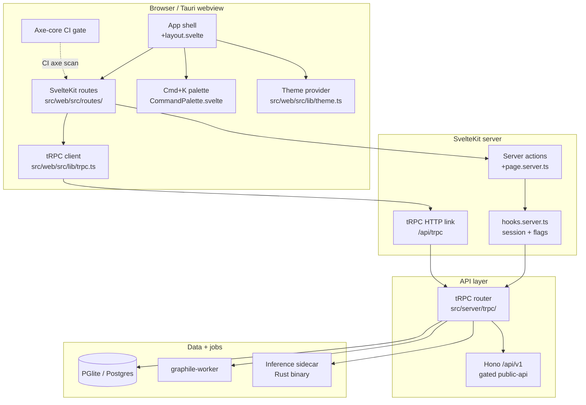
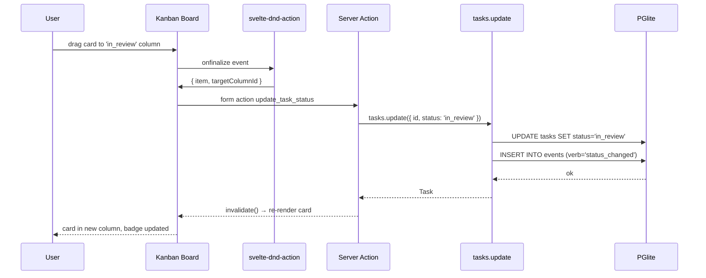
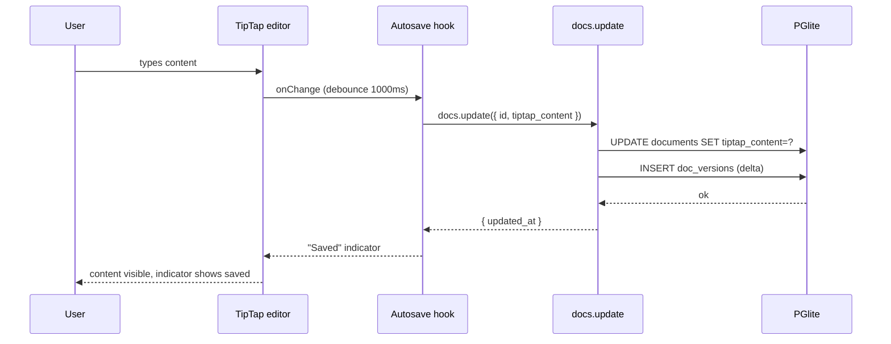
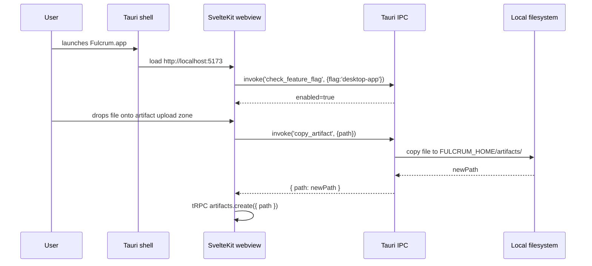

# PRD 16: Web Shell Rebuild

## Status
ready-for-plan-breakdown

## Linkage chain
- Vision: `.scratch/agent-os-vision/VISION-GAPS.md` — "Aim: top-10-class product, not v0 admin"; "editor experience bad"; "no task view or management"
- Requirements: `.scratch/agent-os-vision/REQUIREMENTS.md` — Pillar 16 section
- Decisions: Q38 (SvelteKit web-only first; Tauri/PWA gated), Q-cross-cut (theming, i18n, a11y, backup, telemetry), C4 (web primary), C5 (no OOS for gated features), C1 (online features gated), Q28 (tRPC internal; OpenAPI gated `public-api`), Q27 (search + cmd+K), Q21 (auth bootstrap), Q-permissions (Better-Auth org plugin)
- Docs: https://kit.svelte.dev/docs, https://ui.shadcn.com/docs/svelte, https://tailwindcss.com/docs, https://tiptap.dev/docs, https://paraglide.inlang.com/docs

---

## Vision

Replace the existing `src/web` v0 admin UI with a product-grade SvelteKit 2 shell: Jira+Confluence-class task management, block editor, reporting dashboards, memory browser, agent orchestration console, inference dashboard, full settings — all consuming the tRPC layer from Pillars 1–15. This is the primary surface (C4: Web+APIs first). Every domain pillar's data surfaces here. Routes, components, and accessibility comply with WCAG 2.1 AA. The rebuild deletes `src/web` and replaces it with a clean SvelteKit 2 app under `src/web/`.

User verbatim context: "imagine it a jira + confulance clone … interactive monitoring on kanban/scrum boards … burndown charts and reporting per project … preserves and provide memory and context management … full accounts/multi-user/collaboration even saas, but default mode and run mode is local only for now."

---

## Out-of-scope (per C5)

C5 carve-out (2) — owned by another pillar:
- **Pillar 7 (Docs):** TipTap engine, editor extension set, block types, frontmatter form, version history engine. This pillar mounts TipTap inside routes; it does not own the editor. Doc routes import from `$lib/editor/`.
- **Pillar 6 (Tasks):** Sprint planning business logic, burndown formula, custom-field engine, saved-view AST. This pillar renders them.
- **Pillar 8 (Memory):** Context assembly logic, retrieval ranking. This pillar renders the bundle preview.
- **Pillar 3 (Orchestration):** Symphony orchestration state machine. This pillar renders the dashboard.
- **Pillar 2 (Inference):** Sidecar lifecycle. This pillar renders the inference dashboard.
- **Pillar 13 (API):** OpenAPI spec generation. This pillar mounts the `/api/v1` Hono adapter.
- **Pillar 14 (CLI):** Keybindings schema. Web reads the same shared schema file.
- **Pillar 15 (TUI):** Terminal surface. Web and TUI are parallel; no code sharing of UI components.

C5 carve-out (1) — genuinely not in user's verbatim ask and not in any locked decision:
- **Mobile app (React Native / Capacitor)** — listed as "Open Follow-Up Streams" in REQUIREMENTS; not locked; excluded from this pillar.
- **Video streaming / screen recording** — not mentioned.
- **AI auto-labelling UI** — Q5b exclusion; no labelling UI shipped until user requests it.

---

## Always-on features

Ships unconditionally on Web surface.

### App shell + auth

SvelteKit 2 app with Svelte 5 runes. `src/web/src/` root. Better-Auth session in `event.locals.session` via `src/web/src/hooks.server.ts`. Auto-redirect unauthenticated requests to `/auth/login` (except `/auth/*` and `/api/*`). Local-mode: `fulcrum init` seeds `admin@local` — web app skips login screen; `event.locals.session` populated automatically.

Layout hierarchy:
```
+layout.svelte         ← app shell (sidebar nav, topbar, cmd+K portal, toast provider, theme vars)
  +layout.server.ts    ← session + flag hydration
  /auth/*              ← public routes, no shell
  /doctor              ← shell, no sidebar
  /* all others        ← full shell
```

### Route inventory (full)

All routes are always-on unless explicitly gated. `[id]` = UUID path param. `*` = wildcard sub-routes.

| Route | Component purpose |
|---|---|
| `/` | Dashboard: project tiles, open tasks counter, recent runs, bell badge |
| `/projects` | Project list + create dialog |
| `/projects/[id]` | Project overview: task counts, recent activity, quick-nav |
| `/projects/[id]/board` | Kanban (svelte-dnd-action); swimlane toggle; sprint filter header |
| `/projects/[id]/backlog` | TanStack Table backlog + sprint planning side panel |
| `/projects/[id]/sprints` | Sprint list (planned/active/completed) + velocity sparklines |
| `/projects/[id]/sprint/[sid]` | Active sprint Kanban; days-remaining header; quick-add inline |
| `/projects/[id]/reports` | Reports hub: burndown / velocity / cycle-time / throughput / WIP / CFD (LayerChart) |
| `/projects/[id]/repos` | Project-scoped repo list |
| `/projects/[id]/docs` | Project doc tree + reader |
| `/projects/[id]/settings/fields` | Custom field CRUD |
| `/projects/[id]/settings/statuses` | Status config |
| `/projects/[id]/settings/views` | Saved views management |
| `/projects/[id]/settings/connectors` | Per-connector config (gated per connector) |
| `/tasks/[id]` | Task full-page detail (modal + full-page patterns) |
| `/docs` | Global doc tree landing |
| `/docs/global` | Global docs list |
| `/docs/[id]` | Doc reader (TipTap read-only render) |
| `/docs/[id]/edit` | Doc editor (TipTap editable, frontmatter form) |
| `/docs/[id]/history` | Version timeline + diff/restore |
| `/memory` | Memory browser: list + filter |
| `/memory/[id]` | Memory detail + edit (importance, global toggle, tags) |
| `/context/preview` | Context bundle preview: 4 slices for selected project + task |
| `/runs` | Agent run list + dispatch button |
| `/runs/[id]` | Run detail: log stream, status, artifacts, cancel |
| `/repos` | Global repos list |
| `/repos/[id]` | Repo detail: branch status, recent commits |
| `/repos/[id]/files` | File tree browser + viewer |
| `/repos/[id]/commits` | Commit log |
| `/artifacts` | Artifact browser: filter by run/task/project, preview |
| `/artifacts/[id]` | Artifact detail: inline preview (text/image), download, delete |
| `/search` | Full-page search: left-rail facets + result list |
| `/inbox` | Notifications: "For you" + "My activity" tabs |
| `/audit` | Audit log viewer + export |
| `/agents` | Agent registry: list registered CLI agents + capabilities |
| `/orchestration` | Orchestration dashboard: live run list, claim states, symphony status |
| `/inference` | Inference dashboard: sidecar status, model list, backend config |
| `/settings/theme` | Theme builder: org + user CSS vars, presets, preview |
| `/settings/i18n` | Locale selection (gated `i18n`) |
| `/settings/routing` | Routing rules CRUD + rule tester |
| `/settings/skills` | Skills list, update, conflict resolution |
| `/settings/custom-fields` | Org-level custom field defaults |
| `/settings/saved-views` | Org-level saved views |
| `/settings/integrations` | Connector list + per-connector config |
| `/settings/secrets` | Encrypted secret CRUD + keyring status |
| `/settings/backups` | Backup/restore + scheduled backup config (gated `scheduled-backups`) |
| `/settings/feature-flags` | Feature flag toggle list + rollout percent (gated `experiments`) |
| `/settings/users` | Member list, invite, role management |
| `/settings/billing` | Billing placeholder (renders "billing not configured" unless `saas-auth` + billing provider gated) |
| `/auth/login` | Passkey + email/password; OAuth buttons when `saas-auth` ON |
| `/auth/signup` | Registration; active when `saas-auth` ON; local-mode auto-redirects |
| `/auth/invite/[token]` | Invitation accept |
| `/doctor` | Doctor dashboard: per-subsystem health rows |

### Component library

shadcn-svelte (MIT) component baseline: Button, Input, Textarea, Select, Checkbox, Switch, Badge, Avatar, Card, Sheet (slide-over), Dialog, Alert, Separator, Tabs, Table, DropdownMenu, ContextMenu, Tooltip, Popover, ScrollArea, Skeleton, Toast (svelte-sonner), Command (cmd+K), Calendar, DatePicker, Progress.

All components use Svelte 5 runes (`$state`, `$derived`, `$effect`). No class-based component patterns.

### Cmd+K palette (global)

`+layout.svelte` mounts `<CommandPalette>` as a Svelte 5 portal to `<body>`. Triggered by `⌘K` / `Ctrl+K` via `on:keydown` on `<svelte:window>`. Bits UI `Command` component (shadcn-svelte). Modes: search (default) + command (`>` prefix). Quick-filter tokens: `kind:doc`, `project:<slug>`, `assignee:me`, `status:open`, `tag:<x>`. Shared keybindings schema from `src/keybindings/schema.ts` (Pillar 14). Keyboard: `↑↓` navigate, `Enter` open, `Esc` close, `Tab` cycle kind group.

### Keyboard shortcut registry (Web)

`src/web/src/lib/keybindings.ts` reads `src/keybindings/schema.ts` + `default-web.ts` bindings. In-layout `<svelte:window on:keydown>` dispatcher. Scope: global (palette, search, navigate back) + per-route (task board: `h`/`l` move status; doc editor: `⌘S` save; sprint planning: `m` move task). Settings → Keyboard Shortcuts page lists all bindings; user override written to `tenant_settings(user_id, key='keybindings.overrides', value=json)`.

### Theme system

`src/web/src/lib/theme.ts` reads `tenant_settings(org_id, user_id)` for theme vars. Generates CSS custom properties injected into `:root` on every page load via SvelteKit `+layout.server.ts`. Vars: `--color-primary`, `--color-primary-fg`, `--color-bg`, `--color-surface`, `--color-border`, `--color-muted`, `--color-success`, `--color-warning`, `--color-destructive`, `--font-sans`, `--font-mono`, `--radius`, `--spacing-unit`. Dark/light mode via `mode-watcher` (sets `data-mode` attribute). Settings → Theme: org-level picker (logo + accent + surface colours) + user-level prefs (font size, animation speed, compact mode). CSS-var contract shared with TUI palette mapping (Pillar 15).

### Accessibility (WCAG 2.1 AA)

- Skip link `<a href="#main-content">` first element on every page.
- Focus traps in modals (shadcn-svelte Dialog) and Sheet components.
- `aria-live` regions: toast container, bell badge count, run log stream.
- All interactive elements keyboard-reachable; no mouse-only patterns.
- Colour contrast ≥ 4.5:1 (text/bg) and ≥ 3:1 (UI components) enforced by axe-core in CI.
- `aria-label` / `aria-labelledby` on all icon-only buttons.
- Semantic HTML: `<nav>`, `<main id="main-content">`, `<header>`, `<aside>`, `<article>` for doc reader.
- All form inputs have associated `<label>`.
- Playwright `@axe-core/playwright` run on every major route in e2e suite.

### Real-time bell (always-on 60s poll)

`/inbox` bell badge polls `notify.unreadCount` every 60s via SvelteKit `invalidate()`. Count shown in `<StatusBar>`. Click opens `/inbox`. WebSocket upgrade (sub 2s) gated behind `real-time-collab-server`.

### v0 admin teardown

`src/web/src/routes/` existing v0 routes are deleted during this pillar's first issue (`T16-01`). New directory structure built from scratch alongside the deletion. Migration guide document at `docs/web-v0-migration.md` (deleted routes → new equivalents).

---

## Gated features

All shipped + tested; OFF by default; flip individual flag to enable.

| Feature | Gate flag | What it does |
|---|---|---|
| Real-time collab + presence | `FULCRUM_FEATURES=real-time-collab-server` | Hocuspocus WebSocket provider connected in TipTap (doc + task description); collab cursor overlay; presence avatars in header; bell badge updates <2s |
| Tauri desktop wrapper | `FULCRUM_FEATURES=desktop-app` | `src-tauri/` Tauri v2 workspace wrapping the SvelteKit app; native OS window; auto-update via Tauri updater; native drag-drop for artifact upload; macOS/Linux/Windows builds in release pipeline |
| PWA offline mode | `FULCRUM_FEATURES=pwa-offline` | Vite PWA plugin; service worker caches app shell + recent routes; background sync queue for mutations made offline; `/offline` fallback page; install prompt banner |
| i18n / l10n | `FULCRUM_FEATURES=i18n` | paraglide-js message catalog; locale selection in Settings → i18n; RTL CSS flips (`dir="rtl"` on `<html>`, logical CSS properties); date/number locale formatting via `Intl`; translation JSON extraction CI gate (`bun run i18n:extract`) |
| SaaS auth providers | `FULCRUM_FEATURES=saas-auth` | OAuth buttons on `/auth/login` (Google, GitHub); magic-link; email OTP; `/auth/signup` active; billing placeholder in settings |
| Public REST API | `FULCRUM_FEATURES=public-api` | Hono mount at `/api/v1`; Settings → API page shows base URL + copy-token; OpenAPI spec viewer at `/api/v1/openapi.json` linked from settings |
| Outbound webhooks | `FULCRUM_FEATURES=outbound-webhooks` | Settings → Integrations → Webhooks: create subscription (URL + event pattern + signing secret); delivery log |
| Semantic search | `FULCRUM_FEATURES=embeddings` | `/search` shows "Semantic" toggle; `search.query` hybrid score endpoint |
| LLM sprint narrative | `FULCRUM_FEATURES=report-llm-narration` | Sprint close modal appends LLM-narrated summary to retro doc |
| Casbin ABAC | `FULCRUM_FEATURES=casbin-policies` | Settings → Permissions rule editor; permission gates on field create/delete and saved-view org-share |
| Feature flag A/B | `FULCRUM_FEATURES=experiments` | Settings → Feature Flags shows rollout % slider and cohort rules |
| Telemetry remote | `FULCRUM_FEATURES=telemetry-remote` | Settings → Privacy shows opt-in toggle for remote aggregation |
| Scheduled backups | `FULCRUM_FEATURES=scheduled-backups` | Settings → Backups shows cron schedule builder + remote storage config |
| Vault integration | `FULCRUM_FEATURES=vault-integration` | Settings → Secrets → Vault tab: HashiCorp / AWS Secrets Manager endpoint config |
| Email notifications | `FULCRUM_FEATURES=notify-email` | Settings → Notifications → Channels → Email: verify + enable |
| Webhook notifications | `FULCRUM_FEATURES=notify-webhook` | Same panel; webhook channel config |
| Slack notifications | `FULCRUM_FEATURES=notify-slack` | Same panel; Slack webhook URL |
| Jira connector | `FULCRUM_FEATURES=connector-jira` | Settings → Integrations → Jira: host/email/token form; manual sync button; sync log |
| Linear connector | `FULCRUM_FEATURES=connector-linear` | Same pattern; Linear API key |
| GitHub Issues connector | `FULCRUM_FEATURES=connector-github-issues` | Same pattern; GitHub token + repo |
| Skill marketplace | `FULCRUM_FEATURES=skill-marketplace` | Settings → Skills → Marketplace tab: browse + install upstream skills |
| CSV import/export | `FULCRUM_FEATURES=import-csv,export-csv` | Settings → Import/Export: CSV upload form + export button |
| Linear import | `FULCRUM_FEATURES=import-linear` | Import wizard: authenticate Linear, select team, map fields, import |
| Jira import | `FULCRUM_FEATURES=import-jira` | Import wizard: Jira project picker + field mapping |

---

## Tech stack

| Layer | Pick | License | Failure gate → action | 2nd | 3rd |
|---|---|---|---|---|---|
| Web framework | SvelteKit 2 + Svelte 5 | MIT | Breaking rune change blocks compilation → pin Svelte minor; open bug upstream | — | committed |
| CSS | Tailwind v4 (CSS-first config) | MIT | v4 PostCSS plugin incompatible with Bun bundler → downgrade Tailwind v3 (utility-first, same classes) | Tailwind v3 | UnoCSS (MIT) |
| Component kit | shadcn-svelte (Bits UI) | MIT | Bits UI breaking change → audit changed components; patch locally; `bits-ui` version pin | Melt UI (MIT) | Headless UI Svelte (MIT) |
| Dark/light mode | `mode-watcher` | MIT | Theme flicker on SSR → manual cookie-based class injection in `hooks.server.ts` | Manual class cookie | — |
| Toasts | `svelte-sonner` | MIT | API change → `svelte-french-toast` (MIT) | `svelte-french-toast` | — |
| Kanban DnD | `svelte-dnd-action` | MIT | Svelte 5 `onconsider`/`onfinalize` API breakage → `pragmatic-drag-and-drop` (Apache-2.0) wrapper | pragmatic-dnd | SortableJS (MIT) |
| Gantt | `svelte-gantt` | MIT | Abandoned / no a11y → `vis-timeline` (Apache/MIT) imperative wrapper | vis-timeline | SVAR Svelte Gantt (MIT) |
| Charts | `LayerChart` | MIT | Missing chart type / SSR break → `Chart.js` (MIT) | Chart.js | Apache ECharts (Apache-2.0) |
| Table | `TanStack Table v8` + `TanStack Virtual` | MIT | v9 breaking → audit changed API; pin v8 with patch | AG Grid Community (MIT) | — |
| Block editor | TipTap v2 (MIT May 2026) via `Tipex` / `svelte-tiptap` | MIT | ProseMirror DOM breaks Svelte 5 → use `on:mount` portal pattern | Milkdown (MIT) | svelte-lexical (MIT) |
| CRDT collab | Yjs + Hocuspocus v4 (gated) | MIT | Hocuspocus memory leak on >100 concurrent docs → Y-WebRTC P2P (MIT, peer-to-peer, no server) | Y-WebRTC | Automerge 3 (MIT) |
| Cmd+K | `shadcn-svelte Command` (Bits UI) | MIT | Performance lag >1000 items → `ninja-keys` (MIT) | ninja-keys | — |
| i18n | `paraglide-js` (gated) | MIT | Message extraction breaks → `svelte-i18n` (MIT) fallback | svelte-i18n | — |
| Tauri (gated) | Tauri v2 | MIT | Tauri build fails on target → web-only fallback; Tauri lane removed from release | Electron (MIT, larger bundle) | — |
| PWA (gated) | `vite-plugin-pwa` | MIT | Service worker cache invalidation bugs → `workbox` manual setup | workbox | — |
| A11y testing | `@axe-core/playwright` | MPL 2.0 (testing only, not bundled) | CI axe violation → fix component, no fallback | — | — |
| e2e | Playwright | Apache-2.0 | — | — | — |
| Unit | Vitest | MIT | — | — | — |
| Type check | `svelte-check` | MIT | — | — | — |

---

## Schema changes

No new schema tables — this pillar consumes Pillars 1–15 schema. SvelteKit server actions and tRPC calls only.

Additions to `tenant_settings` (no DDL change; existing KV table from Pillar 1):
- `key='web.theme.<var>'` — per CSS var override (org or user scope)
- `key='web.keybindings.overrides'` — JSON of user keybinding overrides
- `key='web.locale'` — chosen locale (when `i18n` flag ON)
- `key='web.compact_mode'` — boolean user pref
- `key='web.animation_speed'` — 'normal'|'reduced'|'off'

---

## Surfaces

**Web (SvelteKit)** — primary and only surface for this pillar.

**CLI integration** — `fulcrum web [--port <n>] [--host <host>]` starts the SvelteKit server (entrypoint in Pillar 14). `fulcrum doctor web` checks build artifact presence + dev-server reachability.

**Doctor** — `fulcrum doctor --json` includes `web` subsystem (see Doctor integration).

---

## Technical design

### Architecture diagram



### Sequence diagram — kanban task move



### Sequence diagram — doc edit + autosave



### Sequence diagram — Tauri desktop wrapper (gated)



### ERD (new relationships this pillar introduces)

None — this pillar consumes existing schema. Key relationships consumed:

```
projects ─1──n─ tasks ─n──1─ sprints
projects ─1──n─ documents ─1──n─ doc_versions
projects ─1──n─ agent_runs ─1──n─ artifacts
users ─n──n─ org_members ─n──1─ orgs
tasks ─n──n─ edges ─n──n─ (artifact|doc|memory)
```

### Error model

- tRPC FORBIDDEN → `svelte-sonner` error toast "Permission denied"; no crash.
- tRPC NOT_FOUND → inline "Not found" state within the route; `<a href="/">` home link.
- Network error (tRPC timeout / fetch fail) → toast "Connection lost, retrying…"; SvelteKit `error()` boundary for SSR failures renders `/error.svelte` with support link.
- Form validation (Zod) → inline field error messages via shadcn-svelte FormMessage.
- Unhandled client exception → `window.onerror` writes to `local_telemetry` + optionally to `~/.fulcrum/state/errors/YYYY-MM-DD.jsonl` (via tRPC `telemetry.recordError`); toast with "Report" link.
- Gated feature not enabled → route renders `<FeatureGate flag="x">` wrapper showing "Enable this feature in Settings → Feature Flags" callout instead of content; no hard error.

### Observability

- `local_telemetry` table rows: `page_load_ms`, `trpc_call_ms` (via `beforeSend` hook in tRPC client), `axe_violations` count (CI only).
- `perf.measure` marks on every route navigation; p95 page load reported by `fulcrum doctor web`.
- `FULCRUM_WEB_DEBUG=1`: SvelteKit verbose server logging + tRPC request log to stdout.
- Playwright e2e: `--reporter=html` for local; JUnit XML in CI.

### Performance budgets

| Metric | Target | Gate |
|---|---|---|
| SSR first-byte (p95) | < 100ms | Doctor check via `fulcrum doctor web` |
| Client hydration (p95) | < 300ms | Lighthouse CI in e2e suite |
| Page navigation (SPA, p95) | < 100ms | `perf.measure` in `afterNavigate` hook |
| Kanban 200 tasks × 7 columns cold load | < 300ms | Playwright perf assertion |
| Table/backlog 1000 tasks (TanStack Virtual) | no blank rows | Playwright scroll assertion |
| Cmd+K open | < 50ms | `performance.mark` in palette open handler |
| Doc editor autosave round-trip | < 200ms | Vitest tRPC stub |
| Web build (`bun run build`) | < 60s | CI timeout gate |
| Lighthouse performance score | ≥ 85 | CI Lighthouse assertion |

---

## Doctor integration

`fulcrum doctor --json` subsystem `web`:

```json
{
  "subsystem": "web",
  "checks": [
    {
      "name": "web.build_artifact",
      "description": "SvelteKit build output present in .svelte-kit/output/",
      "status": "ok|fail",
      "recovery": "run: bun run build"
    },
    {
      "name": "web.dev_server_reachable",
      "description": "HTTP GET localhost:<PORT>/ returns 200",
      "status": "ok|warn|fail",
      "value": "<response_ms>ms",
      "recovery": "run: fulcrum web --port 5173"
    },
    {
      "name": "web.page_load_p95_ms",
      "description": "p95 page load from local_telemetry last 7d",
      "status": "ok (<300ms)|warn (300-1000ms)|fail (>1000ms)",
      "value": "<ms>",
      "recovery": "check TanStack Virtual list row count; check tRPC query performance"
    },
    {
      "name": "web.axe_violations",
      "description": "axe-core violations count on last CI run",
      "status": "ok (0)|warn (1-3)|fail (>3)",
      "value": "<count>",
      "recovery": "run: bun run test:e2e --reporter=html; open playwright-report/"
    },
    {
      "name": "web.svelte_check",
      "description": "svelte-check type errors count",
      "status": "ok (0)|fail (>0)",
      "value": "<count>",
      "recovery": "run: bun run check"
    },
    {
      "name": "web.trpc_routes_reachable",
      "description": "tRPC /api/trpc/health returns 200",
      "status": "ok|fail",
      "recovery": "check Pillar 1 tRPC router mount in hooks.server.ts"
    },
    {
      "name": "web.tauri_build",
      "description": "Tauri binary present (only checked when desktop-app flag ON)",
      "status": "ok|skip|fail",
      "recovery": "run: bun run tauri build"
    },
    {
      "name": "web.pwa_sw",
      "description": "Service worker registered (only checked when pwa-offline flag ON)",
      "status": "ok|skip|fail",
      "recovery": "check vite-plugin-pwa config in vite.config.ts"
    }
  ]
}
```

Zod schema: `WebDoctorCheck` with same shape as `TuiDoctorCheck` (Pillar 15).

---

## Dependencies

| Depends on | What we need |
|---|---|
| **Pillar 1** | Auth + session + flag registry + `tenant_settings` + tRPC context + synthetic seed |
| **Pillar 2 (Inference)** | Inference dashboard consumes `inference.*` tRPC procedures |
| **Pillar 3 (Orchestration)** | Orchestration dashboard consumes `orchestration.*` procedures |
| **Pillar 4 (Sandcastle)** | Run dispatch form uses `runs.dispatch` |
| **Pillar 5 (Router)** | Routing rules settings page uses `router.*` procedures |
| **Pillar 6 (Tasks)** | All task/sprint/report/custom-field/saved-view routes |
| **Pillar 7 (Docs)** | Doc editor (TipTap instance), tree, history, backlinks |
| **Pillar 8 (Memory)** | Memory browser + context bundle preview |
| **Pillar 9 (Repos)** | Repos browser + file viewer + commit log |
| **Pillar 10 (Artifacts)** | Artifact browser + preview + retention settings |
| **Pillar 11 (Search)** | `/search` route + cmd+K palette backend |
| **Pillar 12 (Notifications)** | `/inbox` + `/audit` + bell badge + activity feeds |
| **Pillar 13 (API)** | tRPC procedure signatures; Hono mount for gated `public-api` |
| **Pillar 14 (CLI)** | Keybindings schema; `fulcrum web` entrypoint |

All domain pillars (2–14) must be functionally complete before this pillar's acceptance criteria can be verified end-to-end (per C4).

---

## Issues breakdown (TDD-numbered)

**Foundation (migration off v0)**
- `T16-01` Delete existing `src/web/src/routes/` v0 routes; scaffold new SvelteKit 2 app structure; update `bun run ci` to point to new build path. Tests: `bun run build` exits 0; no old route files present.
- `T16-02` App shell `+layout.svelte` + `+layout.server.ts` — session hydration, flag hydration, sidebar nav, topbar, theme vars injection. Tests: SSR renders shell; `event.locals.session` populated; auth redirect for unauthenticated user.
- `T16-03` Better-Auth `hooks.server.ts` integration — session + `event.locals.user` + flag list. Tests: valid session → user in locals; invalid → redirect `/auth/login`.
- `T16-04` tRPC client `src/web/src/lib/trpc.ts` — `@trpc/client` SvelteKit link; `createTRPCClient`; typed router. Tests: `tasks.list` returns typed payload from mocked tRPC.
- `T16-05` Theming engine — `tenant_settings` reads → CSS vars injection → `mode-watcher` dark/light. Tests: dark mode cookie persists across navigation; CSS var overrides applied to `:root`.
- `T16-06` Keybindings dispatcher — shared schema + web defaults + user overrides. Tests: `⌘K` opens palette; `Esc` closes; no duplicate in same context.
- `T16-07` Cmd+K palette — Bits UI Command; search mode + command mode + quick-filter. Tests: open <50ms; `>create-task` dispatches modal; `kind:doc` applied to query.
- `T16-08` Error boundary — `+error.svelte`; `window.onerror` → `local_telemetry`; `<FeatureGate>` component. Tests: thrown tRPC error → error boundary renders; feature gate callout renders when flag OFF.
- `T16-09` `bun run ci` web gates — `svelte-check`, `bun run build`, Vitest, Playwright (headless). Tests: pipeline green on clean repo.

**Auth routes**
- `T16-10` `/auth/login` — passkey + email/password; local-mode auto-redirect. Tests: Playwright: login → dashboard; bad password → error; local-mode skip.
- `T16-11` `/auth/signup` — active when `saas-auth` ON; hidden otherwise. Tests: OFF → 404; ON → form renders, submit creates user.
- `T16-12` `/auth/invite/[token]` — token validate → accept → redirect. Tests: valid token → member created; expired → error.
- `T16-13` `/auth/logout` — POST invalidates session, redirect `/auth/login`. Tests: logged-out user → login redirect.

**Dashboard + Projects**
- `T16-14` `/` Dashboard — project tiles, task counters, recent runs, bell badge. Tests: SSR renders; tiles link to `/projects/[id]`.
- `T16-15` `/projects` — list + create dialog (name, description, sprint model). Tests: Playwright: create → list shows new project.
- `T16-16` `/projects/[id]` — overview, quick-nav tabs. Tests: nav to board, list, sprints, reports, repos, docs all resolve.
- `T16-17` `/projects/[id]/board` — Kanban (svelte-dnd-action), sprint filter, swimlane toggle. Tests: drag card → status updates; swimlane toggle re-groups.
- `T16-18` `/projects/[id]/backlog` — TanStack Table + sprint planning side panel. Tests: 50 tasks, sort by priority, drag to sprint panel.
- `T16-19` `/projects/[id]/sprints` — sprint list + velocity sparklines. Tests: create sprint, start, complete.
- `T16-20` `/projects/[id]/sprint/[sid]` — active sprint Kanban + capacity header. Tests: scoped to sprint_id, quick-add inline.
- `T16-21` `/projects/[id]/reports` — reports hub: burndown/velocity/cycle-time/throughput/WIP/CFD (LayerChart). Tests: burndown ideal+actual from metrics_cache; velocity 3-sprint; CFD stacked.

**Task detail**
- `T16-22` `/tasks/[id]` full-page route + modal router modal. Tests: URL updates on card click; Esc closes modal; direct URL renders full-page.
- `T16-23` Task detail — all sections: TipTap description, subtasks, deps, assignees, due/estimate/priority/labels/sprint/custom fields, comments, activity feed, attachments, watchers. Tests: all sections render; autosave description.
- `T16-24` Task keyboard shortcuts — `e` title, `a` assign, `s` status picker, `p` priority, `d` due, `l` labels. Tests: each key triggers expected overlay; `Esc` closes.
- `T16-25` Bulk operation bar — shift+click range, bulk status/assign/sprint/delete. Tests: 5 tasks selected; bulk status → all updated.
- `T16-26` Task board view options: `view=table` (TanStack Table), `view=calendar`, `view=timeline` (svelte-gantt). Tests: each renders; table sort; calendar drag-to-reschedule; Gantt dependency arrows.
- `T16-27` Saved views filter builder — chip composer, save dialog, load persists state. Tests: build filter, save, refresh → state restored.

**Doc routes**
- `T16-28` `/docs` + `/docs/global` — tree navigation (project + global). Tests: tree expand/collapse; breadcrumb; new doc button.
- `T16-29` `/docs/[id]` reader — TipTap read-only + frontmatter header + backlinks sidebar. Tests: headings/code/math render; wikilinks clickable.
- `T16-30` `/docs/[id]/edit` — TipTap editable + frontmatter form + raw YAML toggle + autosave. Tests: type → debounced save → `doc_versions` row; frontmatter form round-trips YAML.
- `T16-31` `/docs/[id]/history` — version timeline + diff view + restore. Tests: 5 versions, diff shows delta, restore reverts to snapshot.

**Memory + Context**
- `T16-32` `/memory` — list + filter (scope/project/importance/tags) + create. Tests: filter by project, toggle global, search.
- `T16-33` `/memory/[id]` — detail + edit (body, importance, global toggle, tags). Tests: save round-trips; global toggle writes `scope='global'`.
- `T16-34` `/context/preview` — 4 slice panes (memories / docs / transcripts / repo state) for selected project + task. Tests: slice count, token budget display, each slice has content.

**Runs + Artifacts**
- `T16-35` `/runs` — list with status badges + dispatch button. Tests: dispatch modal opens; list sorts by created_at.
- `T16-36` `/runs/[id]` — log stream (EventSource / subscription), status, artifacts list, cancel button. Tests: log lines append; status badge updates; cancel → `runs.cancel` tRPC.
- `T16-37` `/artifacts` — browser with kind/project/run filter + inline preview. Tests: PNG preview renders; text preview renders; download link correct.
- `T16-38` `/artifacts/[id]` — detail: preview + download + delete + retention info. Tests: delete → `artifacts.delete`; retention days shown.

**Repos**
- `T16-39` `/repos` — global list + sync button. Tests: `repos.sync` called; list updates.
- `T16-40` `/repos/[id]` — branch status, recent commits, tasks linked. Tests: branch list; commit count.
- `T16-41` `/repos/[id]/files` — file tree + viewer. Tests: expand folder, click file → content pane.
- `T16-42` `/repos/[id]/commits` — commit log. Tests: SHA/message/author list, pagination.

**Search + Notifications + Audit**
- `T16-43` `/search` — left-rail facets + kind-grouped results + saved searches. Tests: FTS query returns ≥3 kinds; facet narrows count; save search round-trips.
- `T16-44` `/inbox` — "For you" + "My activity" tabs + bell overlay. Tests: mark read, tab switch, bell count clears on visit.
- `T16-45` `/audit` — filter toolbar + paginated table + CSV/JSON export. Tests: filter by `kind=task`; export downloads file.

**Agents + Orchestration + Inference**
- `T16-46` `/agents` — registry: CLI agents, capabilities, dispatch button. Tests: list renders; dispatch form submits.
- `T16-47` `/orchestration` — live run list (subscription poll), claim state badges, symphony status. Tests: run state updates; filter by project.
- `T16-48` `/inference` — sidecar status, model list, backend config, start/stop. Tests: status badge; `inference.start` called on button; model list renders.

**Settings pages**
- `T16-49` Settings layout — nav tabs (all settings routes). Tests: all tabs reachable; unauthorized tabs hidden by role.
- `T16-50` `/settings/theme` — org + user CSS var pickers, preset selector, live preview. Tests: pick accent → CSS var updates; save → `tenant_settings` written.
- `T16-51` `/settings/routing` — rules CRUD + tester (simulate task → route output). Tests: create rule, test fires rules-engine, shows matched agent.
- `T16-52` `/settings/skills` — list, update, conflicts resolution UI. Tests: conflict row shows upstream vs local; keep-local writes lock.
- `T16-53` `/settings/custom-fields` — org-level defaults CRUD. Tests: create select field, archive, values preserved.
- `T16-54` `/settings/saved-views` — org-scope saved views list. Tests: set default, share, delete.
- `T16-55` `/settings/integrations` — connector list + per-connector config + manual sync. Tests: connector toggle, sync button calls `connectors.sync`.
- `T16-56` `/settings/secrets` — masked list, add (masked input), delete, keyring status. Tests: add → `secrets.create`; display masked; delete.
- `T16-57` `/settings/backups` — backup now, restore, last backup time. Tests: backup → file written; restore form validates path.
- `T16-58` `/settings/feature-flags` — toggle list + description. Tests: toggle ON → `flags.set` called; page re-renders with flag state.
- `T16-59` `/settings/users` — member list, invite, role picker, remove. Tests: invite → invitation row; role change → `orgs.members.updateRole`.
- `T16-60` `/doctor` — per-subsystem rows, status badges, recovery text. Tests: all subsystems listed; failed subsystem shows recovery action.

**Accessibility audit**
- `T16-61` axe-core Playwright scan — all major routes (`/`, `/projects`, `/tasks`, `/docs/[id]/edit`, `/search`, `/inbox`, `/auth/login`). Tests: zero violations on each.
- `T16-62` Keyboard nav audit — tab through dashboard; all interactive elements reachable; no keyboard trap outside modal. Tests: Playwright keyboard nav sequence.
- `T16-63` Skip link. Tests: `Tab` on page load focuses skip link; `Enter` skips to `#main-content`.
- `T16-64` Focus trap in Dialog + Sheet. Tests: `Tab` cycles within modal; `Esc` closes; focus returns to trigger.

**Gated**
- `T16-65` `real-time-collab-server` — Yjs+Hocuspocus in TipTap (doc + task desc); collab cursor; presence avatars; bell WebSocket. Tests: OFF → standalone TipTap; ON → two tabs converge, cursor visible.
- `T16-66` `desktop-app` (Tauri) — `src-tauri/` Tauri v2 workspace; native window; file drag-drop artifact upload; auto-update check. Tests: OFF → no `src-tauri/`; ON → `tauri build` succeeds; drag-drop creates artifact.
- `T16-67` `pwa-offline` — service worker; cache shell; background sync; `/offline` fallback. Tests: OFF → no SW; ON → SW registered, `/offline` reachable when server down.
- `T16-68` `i18n` — paraglide-js messages; locale selector; RTL CSS flips; `Intl` date formatting. Tests: OFF → no locale UI; ON → locale selector saves; RTL locale flips `dir="rtl"`.
- `T16-69` `saas-auth` — OAuth buttons on login; signup route active; magic-link; email OTP. Tests: OFF → OAuth buttons hidden, signup 404; ON → OAuth buttons render, signup works.
- `T16-70` `public-api` — Settings → API page + OpenAPI viewer at `/api/v1/openapi.json`. Tests: OFF → page hidden; ON → spec renders, base URL correct.
- `T16-71` `report-llm-narration` — sprint close modal LLM narrative in retro doc. Tests: OFF → no LLM section; ON → narrative block in doc.
- `T16-72` Connector UI: `connector-jira`, `connector-linear`, `connector-github-issues` (Settings → Integrations). Tests: OFF → connector hidden; ON → config form + sync log.
- `T16-73` Import/export UI: `import-csv`, `export-csv`, `import-linear`, `import-jira`. Tests: OFF → Import/Export menu hidden; ON → wizard renders, submit calls connector tRPC.
- `T16-74` `skill-marketplace` — Settings → Skills → Marketplace tab. Tests: OFF → tab hidden; ON → upstream skill list renders, install calls `skills.install`.
- `T16-75` `experiments` — Settings → Feature Flags rollout %, cohort rules. Tests: OFF → sliders hidden; ON → rollout % saves to `feature_flags.rollout_percent`.
- `T16-76` `notify-email` / `notify-slack` / `notify-discord` / `notify-push` — Settings → Notifications → Channels sub-tabs. Tests: OFF → each sub-tab hidden; ON → config form saves.
- `T16-77` `vault-integration` — Settings → Secrets → Vault tab. Tests: OFF → tab hidden; ON → endpoint form + auth test.
- `T16-78` `scheduled-backups` — Settings → Backups → Schedule tab + cron builder. Tests: OFF → tab hidden; ON → cron expression saves.
- `T16-79` `casbin-policies` — Settings → Permissions rule editor. Tests: OFF → hidden; ON → rule editor renders, saves casbin rule.

---

## Failure gates

| Gate condition | Action |
|---|---|
| `svelte-dnd-action` breaks on Svelte 5 runes `onconsider`/`onfinalize` | Replace with `pragmatic-drag-and-drop` Apache-2.0 wrapper (~1 day) |
| `svelte-gantt` abandoned or no keyboard a11y | `vis-timeline` imperative wrapper; same API surface to calling routes |
| TipTap v2 ProseMirror DOM breaks Svelte 5 portal pattern | Mount via `onMount` + `import('$lib/editor')` dynamic; test on Svelte 5 RC before final |
| Hocuspocus memory leak at >100 concurrent docs | Y-WebRTC P2P (MIT); no server required; CRDT sync peer-to-peer |
| Tailwind v4 PostCSS incompatible with `bun build` | Downgrade Tailwind v3; class names identical; migration ~1h find-replace |
| Bits UI breaking change in shadcn-svelte | Audit changed components; pin `bits-ui` version; patch locally |
| Tauri v2 build fails on target platform | Remove that platform from release matrix; web-only fallback for that platform |
| `@axe-core/playwright` MPL 2.0 concern in CI | Use `axe-playwright` MIT fork OR run axe in browser via `evaluate()` |
| Lighthouse performance <85 after full data load | TanStack Virtual on all long lists; SSR prefetch + deferred client hydration |

---

## Acceptance criteria

All criteria must pass for pillar to be marked done (C4).

**v0 teardown** — no file from the old `src/web/src/routes/` v0 admin remains; `bun run build` exits 0 on new structure; `docs/web-v0-migration.md` present.

**Route coverage** — every route in the route inventory resolves (no 404/500) on a seeded local instance with sample data across all domain pillars.

**Playwright e2e suite passes** — create-project → create-task → kanban-move → create-doc → search → burndown render → sprint create+close → invite user → feature-flag toggle. All assertions green.

**Accessibility** — axe-core: zero violations on all major routes; skip link present; keyboard tab reaches all interactive elements; focus trap in all modals; all icon buttons have `aria-label`.

**Theme** — dark/light mode toggle persists via cookie; CSS var override (accent colour) applied globally; compact mode reduces spacing; `Settings → Theme` live preview updates `:root`.

**Performance** — SSR first-byte p95 <100ms; page navigation p95 <100ms; kanban 200 tasks <300ms cold; table 1000 tasks no blank rows; cmd+K open <50ms; Lighthouse ≥85.

**Cmd+K** — opens on `⌘K`/`Ctrl+K`; debounced 150ms; `>create-task` opens task create dialog; `kind:doc` filter applied; `Esc` closes.

**Doctor** — `fulcrum doctor --json` includes `web` subsystem; all 8 checks report `ok` on healthy system; build artifact check fails correctly when build missing.

**Three surfaces parity** — for each domain: Web performs CRUD; CLI `--json` matches same tRPC schema; TUI (Pillar 15) reflects same data. Verified by shared integration test fixture that seeds data via CLI and asserts Web renders it.

**Gated (both OFF and ON both tested):**
- `real-time-collab-server` OFF → TipTap standalone; ON → two browser tabs converge edits, cursor visible.
- `desktop-app` OFF → `src-tauri/` not present in build; ON → Tauri binary produced, drag-drop artifact works.
- `pwa-offline` OFF → no service worker; ON → SW registered, offline page reachable.
- `i18n` OFF → no locale UI; ON → locale selector present, RTL locale flips `dir`.
- `saas-auth` OFF → OAuth hidden, signup 404; ON → OAuth buttons render.
- `public-api` OFF → `/api/v1` 404; ON → OpenAPI spec valid, auth enforced.
- `connector-jira` OFF → connector hidden; ON → config form + sync log present.
