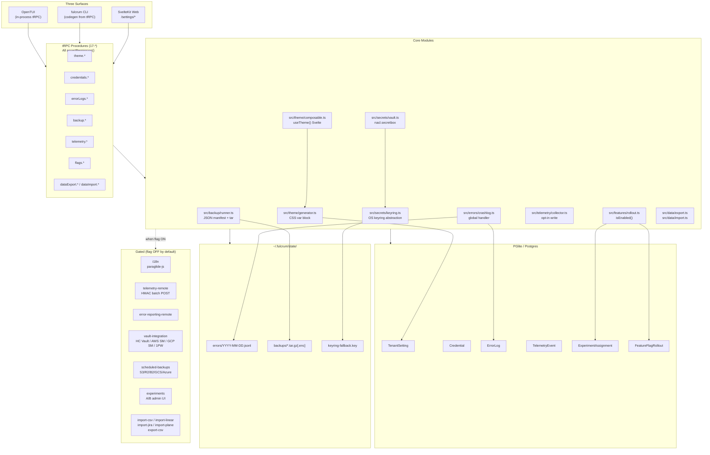
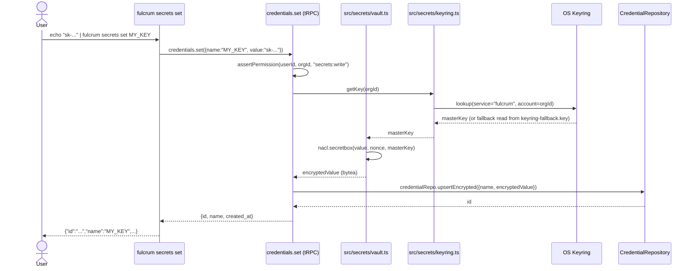

# PRD 17: Cross-Cutting Platform Concerns

## Status: ready-for-plan-breakdown

---

## Linkage chain

- **DECISIONS.md** → Q-cross-cut (theme engine, error crashlog, secrets, backup, telemetry, feature-flag rollout, JSON import/export); Q-governance (GOVERNANCE.md, SECURITY.md, CODE_OF_CONDUCT.md, VERSIONING.md); auto-locks A1 (toolchain SLA, Pillar 1 owns) + A2 (fulcrum doctor, every pillar adds subsection) + A4 (audit log retention, Pillar 12 extended).
- **REQUIREMENTS.md** → Cross-Cutting Requirements (TDD-first; three surfaces parity; no MVP language; online paths gated; all deps MIT/Apache/BSD; `bun run ci` green; `fulcrum doctor` covers all subsystems; `assertPermission()` lint rule; conventional commits).
- **EXTRA-GAPS.md** → Section B (B1 i18n, B3 theming, B5 telemetry, B6 error reporting, B7 backup/restore, B8 import/export, B9 secret management, B10 feature-flag rollout/A/B) + Section C (C6 governance, C7 versioning).
- **C5 compliance** → every feature either always-on or gated; "out-of-scope" section restricted to items not in any verbatim ask or cross-references to another pillar.

---

## Vision

Fulcrum grows across 16 domain pillars, each owned by a dedicated PRD. This pillar consolidates the capabilities that cut across all of them: the theme engine every surface uses, the crash logger that catches every unhandled exception, the secret store every feature reads, the backup/restore command every operator relies on, the telemetry pipeline every event flows through, the feature-flag rollout system every gate queries, the import/export layer every connector needs, and the governance files every contributor reads on day one.

None of these belong exclusively to one domain pillar. All are required before any pillar marks itself done. All three surfaces (Web + APIs primary, full CLI second, fully featured TUI last) reach feature parity by release. No surface owns business logic — every operation lands behind a tRPC procedure. Every feature that touches external services ships behind a `FULCRUM_FEATURES` flag and is OFF by default; the always-on fallback is deterministic and local.

---

## Out-of-scope

C5 carve-out (2) — owned by another pillar:

- **Pillar 1:** `FeatureFlag`, `TenantSetting`, `FULCRUM_FEATURES` env-var parser, `assertPermission()`, auth + tenancy context injected into tRPC. This pillar adds `FeatureFlagRollout` / `ExperimentAssignment` application-layer behaviour; it does not re-create base entities.
- **Pillar 12:** `Event` entity, audit-log query/retention surface (`audit.query` tRPC, `/audit` web route, `fulcrum audit-log` CLI, `EventRetentionPolicy` entity). This pillar emits events from backup, secrets, and telemetry flows; Pillar 12 owns the audit viewer.
- **Pillar 13:** connector framework for external importers (Linear, Jira, Plane). This pillar ships the `import-linear`, `import-jira`, `import-plane` feature-flag stubs and parser skeletons; Pillar 13 owns the connector protocol, rate-limit handling, and API client plumbing.
- **Pillar 14:** CLI codegen pipeline. This pillar defines the tRPC procedures; Pillar 14 auto-generates the `fulcrum <domain> <verb>` bindings from them.
- **Pillar 15:** TUI framework selection (OpenTUI / ratatui fallback). This pillar ships TUI screens for themes, secrets, backups, flags, and errors; Pillar 15 owns the runtime.
- **Pillar 16:** CSS framework, shadcn-svelte kit, SvelteKit route shell. This pillar ships the `useTheme()` composable and CSS-var generation logic; Pillar 16 owns the surrounding layout.

C5 carve-out (1) — genuinely not in verbatim ask or any locked decision:

- **Time-tracking / time billing** — not mentioned.
- **Model fine-tuning or RLHF pipelines** — not mentioned.
- **Mobile (React Native / Capacitor)** — deferred to a future session; not in any locked decision.
- **Enterprise SSO (WorkOS / SAML / SCIM)** — not in verbatim ask; in REQUIREMENTS.md "Open Follow-Up Streams" only.

---

## Always-on features

Ships unconditionally, all surfaces.

### Theme engine

`TenantSetting` is `@Entity({ tableName: 'tenant_settings' })` with composite key `(org, user, key)` and `@Property({ type: 'json' }) value`. It stores per-org and per-user preferences. Key namespace: `theme.*` (accent color HEX, base hue, radius, font-family, font-size-scale, spacing-scale, animation-duration-scale, dark-mode-preference: `light | dark | auto`).

`src/theme/generator.ts` reads all `theme.*` settings with `tenantSettingsRepo.find({ org, key: { $like: 'theme.%' } })` plus user-scoped overrides (user wins on conflict) and emits a CSS custom-property block (`--fulcrum-accent`, `--fulcrum-radius`, `--fulcrum-font-family`, etc.). In Web: injected as a `<style>` tag in the SvelteKit root layout on every SSR render; updated client-side via reactive store on preference change.

`src/theme/composable.ts` — `useTheme()` Svelte composable. Returns reactive `{ accent, radius, fontFamily, darkMode }` derived from tRPC `theme.get` result; subscribes to `theme.onSettingsChange` subscription for live updates. Used by every themed component.

`theme.get` / `theme.update` tRPC procedures with `assertPermission()`.

TUI: theme preferences read through `tenantSettingsRepo.find({...})` behind tRPC at startup; OpenTUI primitives apply accent color to focused borders and selected items.

CLI: `fulcrum theme list --json` / `fulcrum theme set <key> <value>` / `fulcrum theme reset`.

### Local error crashlog

On any uncaught exception or unhandled promise rejection in the Bun process, a crashlog entry is written to `~/.fulcrum/state/errors/YYYY-MM-DD.jsonl` (one JSON line per crash). Each entry includes:

```jsonc
{
  "id": "<uuid>",
  "occurred_at": "<ISO8601>",
  "os": "darwin | linux | win32",
  "arch": "arm64 | x64",
  "bun_version": "1.x.y",
  "fulcrum_version": "0.x.y",
  "recent_cli_command": "fulcrum task list --json",
  "recent_trpc_procedure": "tasks.list",
  "error_message": "...",
  "stack_trace": "...",
  "context": {}
}
```

`ErrorLog` entity mirrors the JSONL for queryability. `src/errors/crashlog.ts` installs the global handler at process start (Pillar 1 calls it in `fulcrum init` and `fulcrum web`).

`errorLogs.list` / `.get(id)` / `.clear(before?)` tRPC procedures.

CLI: `fulcrum errors list [--limit <n>] [--since <ISO>] [--json]` / `fulcrum errors show <id>` / `fulcrum errors clear [--before <ISO>]`.

Web: `/settings/errors` — paginated crash log viewer, per-entry expandable stack trace, "clear all" action.

TUI: Settings → Errors tab, scrollable list, `Enter` expands, `D` deletes entry.

### Secret management + encryption-at-rest

`Credential(id, org_id, user_id, name, encrypted_value, algo, kdf, created_at, last_used_at, archived)` entity. `encrypted_value` is `nacl.secretbox` ciphertext (XSalsa20-Poly1305). Encryption key derived with Argon2id (`node:crypto` webcrypto + argon2 npm package) from a master key sourced in priority order:

1. **System keyring** — macOS: `node-keytar` → `Keychain`; Linux: `node-keytar` → Secret Service via D-Bus; Windows: `node-keytar` → Credential Manager.
2. **Fallback** — PBKDF2-derived key from a per-install salt stored in `~/.fulcrum/state/keyring-fallback.key` (mode 0600).

`src/secrets/keyring.ts` abstracts both paths behind `getKey(orgId) / setKey(orgId, key)`. The encryption layer in `src/secrets/vault.ts` uses `tweetnacl` (MIT, 100% in-TS, zero native deps) for `secretbox`.

`credentials.list(orgId, userId)` / `.set(name, value)` / `.get(name)` / `.remove(name)` / `.rotate(name, newValue)` tRPC procedures. `get` returns plaintext only in response body, never logs it. `assertPermission()` enforced; only owner or org-admin may read a credential.

CLI: `fulcrum secrets list [--json]` / `fulcrum secrets set <name>` (value from stdin or `--value`, never from positional arg) / `fulcrum secrets get <name>` / `fulcrum secrets rm <name>` / `fulcrum secrets rotate <name>`.

Web: `/settings/secrets` — credential list (masked values), add/edit/remove, "last used" timestamp.

TUI: Settings → Secrets tab, same CRUD, values masked by default, `U` to unmask briefly.

### Local backup + restore

`fulcrum backup [--output <path>] [--encrypt] [--no-artifacts]` — exports:

1. Fulcrum-native JSON manifest generated by repository snapshot readers, ordered by entity dependency.
2. Artifacts tarball (`~/.fulcrum/state/artifacts/**`) unless `--no-artifacts`.
3. `~/.fulcrum/state/errors/` JSONL files.
4. `fulcrum-backup-manifest.json` with schema version, Fulcrum version, export timestamp, entity counts.

When `--encrypt` passed (or when `FULCRUM_BACKUP_ENCRYPT=1`): re-encrypts the tarball using `nacl.secretbox` with a one-time key written to a `<backup-name>.key` file alongside the archive. The `.key` file is also stored in the system keyring under `fulcrum-backup-<timestamp>`.

`fulcrum restore --input <path> [--key <keyfile>] [--dry-run]` — reads manifest, checks schema version compatibility (warns on mismatch), detects collisions (UUID conflicts in `orgs`, `projects`, `tasks`), applies through repository `upsertFromManifest()` calls by default, reports counts.

`backup.create` / `backup.list` / `restore.preflight(path)` tRPC procedures. Backup files stored in `~/.fulcrum/state/backups/` by default; configurable via `TenantSetting` key `backup.output_dir`.

Web: `/settings/backup` — "Create Backup" button, download link, restore upload form.

TUI: Settings → Backup tab.

### Local telemetry collection

On first `fulcrum init` or first web-app load: one-time opt-in prompt (CLI: interactive Y/N; Web: banner with "Enable" / "No thanks" buttons; TUI: modal). Choice stored in `TenantSetting` key `telemetry.opted_in` with JSON boolean value.

When opted in: `TelemetryEvent(id, org_id, user_id, kind, payload, occurred_at)` receives one entity per significant user action (task created, doc saved, agent run dispatched, CLI command executed). Payload is stripped of all content (titles, bodies, file paths); only event kind + aggregate counts + duration metrics.

`telemetry.optIn` / `.optOut` / `.status` / `.purge` tRPC procedures.

Web: `/settings/telemetry` — opt-in toggle, "Purge local data" button.

CLI: `fulcrum telemetry status --json` / `fulcrum telemetry opt-in` / `fulcrum telemetry opt-out` / `fulcrum telemetry purge`.

TUI: Settings → Telemetry tab.

### Feature-flag rollout + cohorts + experiments

Adds `FeatureFlagRollout` entity owned by this pillar. It keeps rollout percentage, cohort rules, updater, and timestamps outside Pillar 1's base `FeatureFlag` entity.

`cohort_rules` JSON schema: `{ "include_user_ids"?: string[], "exclude_user_ids"?: string[], "org_plan"?: string[], "created_after"?: string }`.

`ExperimentAssignment(id, org_id, user_id, experiment_id, variant, assigned_at)` entity. Assignment is deterministic: `sha256(user_id + experiment_id) % 100 < rollout_percent`. Variant chosen from `FeatureFlagRollout.cohortRules.variants` array (index by assignment bucket).

`src/features/rollout.ts` — `isEnabled(flagName, orgId, userId): boolean` evaluates: base `enabled` → cohort rules → rollout percentage. Replaces Pillar 1's simple `enabled` check. Pillar 1 calls this module; no change to tRPC call sites.

`flags.list` / `.get(name)` / `.set(name, opts)` / `.experiments.list` / `.experiments.assign(userId, experimentId)` tRPC procedures.

CLI: `fulcrum flags list [--json]` / `fulcrum flags get <name>` / `fulcrum flags set <name> --enabled --rollout-percent <n>` / `fulcrum flags experiments list [--json]`.

Web: `/settings/feature-flags` — flag list with toggles, rollout-percent slider, cohort-rules JSON editor, experiment assignment viewer.

TUI: Settings → Feature Flags tab.

### Native JSON import/export

Full org dump and restore in Fulcrum-native JSON format. Same manifest family as local backup: human-readable, version-stamped, and useful for migration between Fulcrum instances.

`fulcrum export [--org <id>] [--output <path>] [--pretty] [--json]` — streams all org data (orgs, projects, tasks, docs, memories, sprints, agent_runs summary, repos, artifacts metadata, events summary) as a single JSON object. Large collections paged internally; output is one top-level JSON array per entity kind.

`fulcrum import --input <path> [--dry-run] [--on-conflict skip|update|error]` — reads the JSON manifest, validates Zod schemas per entity, and calls repository create/update methods.

`dataExport.create` / `dataImport.preflight(path)` / `dataImport.run(importId)` tRPC procedures.

Web: `/settings/data` — Export button (download JSON), Import upload form with preflight summary.

TUI: Settings → Data tab.

---

## Gated features

All shipped + implemented + tested; OFF by default. Flip the named flag to enable.

| Feature | Flag | What it does |
|---|---|---|
| i18n | `i18n` | paraglide-js + locale picker UI + per-locale translation JSON + RTL CSS flip for Arabic/Hebrew/Persian. CI gate: `bun run i18n:extract` must produce 0 untranslated keys before merge. |
| Remote telemetry | `telemetry-remote` | Batches `TelemetryEvent` entities and POSTs to a user-configured endpoint (env `FULCRUM_TELEMETRY_ENDPOINT`). Batch signed with HMAC-SHA256 (`FULCRUM_TELEMETRY_SECRET`). Retried with graphile-worker. |
| Remote error reports | `error-reporting-remote` | Sends crash entries from `ErrorLog` to a user-configured endpoint. Same signing as telemetry-remote. No PII included; stack traces scrubbed of absolute paths. |
| Vault integration | `vault-integration` | Fetch/store secrets from HashiCorp Vault (KV v2), AWS Secrets Manager, GCP Secret Manager, or 1Password Connect. `Credential.provider` property switches path. `src/secrets/vault-adapter.ts` per provider. |
| Scheduled backups | `scheduled-backups` | Cron-triggered (graphile-worker recurring task) backup + upload to remote storage. Providers: S3, Cloudflare R2, Backblaze B2, GCS, Azure Blob. Per-provider adapter in `src/backup/remotes/`. `FULCRUM_BACKUP_REMOTE_DSN` env var. |
| Experiments | `experiments` | Full A/B experiment tracking admin UI at `/settings/experiments`: create experiment, define variants, set rollout %, view assignment counts, view conversion metrics per variant. Backed by `ExperimentAssignment` entity. |
| CSV import | `import-csv` | Generic CSV → tasks or docs import. Column mapper UI (web), `--column-map` flag (CLI). Schema inferred from headers + user mapping. |
| CSV export | `export-csv` | Tasks, docs, or memories exported as CSV. `fulcrum export --format csv --entity tasks`. |
| Linear importer | `import-linear` | Reads Linear issues via Linear GraphQL API (user provides API key stored in `credentials`). Maps to Fulcrum tasks. Connector framework from Pillar 13. |
| Jira importer | `import-jira` | Reads Jira issues via Jira REST API v3. Maps to Fulcrum tasks. |
| Plane importer | `import-plane` | Reads Plane issues via Plane API. Maps to Fulcrum tasks. |
| macOS Keychain | `keyring-macos` | Enables `node-keytar` macOS Keychain path for master key storage. On by default on macOS when `node-keytar` native module builds successfully. |
| Linux Secret Service | `keyring-linux` | Enables `node-keytar` D-Bus Secret Service path. |
| Windows Credential Manager | `keyring-windows` | Enables `node-keytar` Windows Credential Manager path. |

---

## Tech stack

| Layer | Pick | License | Failure gate | 2nd |
|---|---|---|---|---|
| Symmetric encryption | `tweetnacl` (XSalsa20-Poly1305 secretbox) | MIT | If nacl primitives ever deprecated by IETF → `libsodium-wasm` (MIT, same API) | `@noble/ciphers` (MIT) AES-256-GCM |
| KDF | `argon2` npm pkg (Argon2id) | MIT | Native build fails on target → `node:crypto` PBKDF2-SHA256 (100k iter) | same |
| OS keyring | `node-keytar` | MIT | Native addon build fails or service unreachable → fallback to encrypted-file key at `~/.fulcrum/state/keyring-fallback.key` (0600) | `@napi-rs/keyring` (MIT) |
| i18n | `paraglide-js` (ParaglideJS) | MIT | If Svelte plugin breaks on rune update → `svelte-i18n` (MIT) | `@inlang/sdk` (MIT) |
| Backup tarball | `node:zlib` + `tar` (npm, MIT) | MIT | `tar` API drift → `node:stream` pipe to `zlib.createGzip()` raw | `archiver` (MIT) |
| Telemetry/error remote | `fetch` (Bun built-in) + `node:crypto` HMAC | — | Network unreachable → retry queue in `TelemetryOutbox` entity via graphile-worker | same |
| Remote backup storage | Per-adapter: `@aws-sdk/client-s3` / `@cloudflare/workers-types` R2 / `@google-cloud/storage` / `@azure/storage-blob` | MIT / Apache-2.0 | Adapter fails → local-only backup always works; remote silently disabled with doctor warning | — |
| CSS var generation | `src/theme/generator.ts` (pure TS, 100 LOC) | — | — | `postcss` plugin if complexity grows |
| TUI | OpenTUI (Bun-native TS) | MIT | Too immature → ratatui pane in Rust sidecar via Unix socket | — |

---

### Stack (DECISIONS.md C7-C9)
- C7: MikroORM v7 primary; `mikro-orm-pglite` local driver.
- C7: migrations are classes at `src/db/migrations/Migration<timestamp>.ts`.
- C8: services are `@Injectable()` classes resolved by needle-di.
- C9: entities live under `src/db/entities/platform/`.
- C9: repositories live under `src/db/repositories/platform/`.

---

## Entity changes

All entities carry composite `(org_id, …)` indexes mandatory (Q22). Migration class: `Migration<timestamp>` covering platform entities.

```ts
@Entity({ tableName: 'tenant_settings' })
@Unique({ properties: ['org', 'user', 'key'] })
@Index({ properties: ['org', 'key'] })
export class TenantSetting {
  @ManyToOne(() => Org, { primary: true, deleteRule: 'cascade' }) org!: Org;
  @ManyToOne(() => User, { primary: true, nullable: true, deleteRule: 'cascade' }) user?: User;
  @Property({ primary: true }) key!: string;
  @Property({ type: 'json' }) value!: unknown;
  @Property({ onUpdate: () => new Date() }) updatedAt = new Date();
}

@Entity({ tableName: 'credentials' })
@Unique({ properties: ['org', 'user', 'name'] })
@Index({ properties: ['org', 'user', 'lastUsedAt'] })
@Index({ properties: ['org', 'archived'] })
export class Credential {
  @PrimaryKey({ type: 'uuid' }) id = crypto.randomUUID();
  @ManyToOne(() => Org, { deleteRule: 'cascade' }) org!: Org;
  @ManyToOne(() => User, { deleteRule: 'cascade' }) user!: User;
  @Property() name!: string;
  @Property({ type: 'bytea' }) encryptedValue!: Uint8Array;
  @Property() algo = 'nacl-secretbox';
  @Property() kdf = 'argon2id';
  @Enum(() => CredentialProvider) provider = CredentialProvider.Local;
  @Property() createdAt = new Date();
  @Property({ nullable: true }) lastUsedAt?: Date;
  @Property() archived = false;
}

@Entity({ tableName: 'telemetry_events' })
@Index({ properties: ['org', 'occurredAt'] })
@Index({ properties: ['org', 'user', 'kind'] })
export class TelemetryEvent {
  @PrimaryKey({ type: 'uuid' }) id = crypto.randomUUID();
  @ManyToOne(() => Org, { deleteRule: 'cascade' }) org!: Org;
  @ManyToOne(() => User, { nullable: true, deleteRule: 'set null' }) user?: User;
  @Property() kind!: string;
  @Property({ type: 'json' }) payload: Record<string, unknown> = {};
  @Property() occurredAt = new Date();
}

@Entity({ tableName: 'error_logs' })
@Index({ properties: ['org', 'occurredAt'] })
export class ErrorLog {
  @PrimaryKey({ type: 'uuid' }) id = crypto.randomUUID();
  @ManyToOne(() => Org, { deleteRule: 'cascade' }) org!: Org;
  @ManyToOne(() => User, { nullable: true, deleteRule: 'set null' }) user?: User;
  @Property() occurredAt = new Date();
  @Property({ nullable: true }) os?: string;
  @Property({ nullable: true }) arch?: string;
  @Property({ nullable: true }) bunVersion?: string;
  @Property({ nullable: true }) fulcrumVersion?: string;
  @Property({ nullable: true }) recentCliCommand?: string;
  @Property({ nullable: true }) recentTrpcProcedure?: string;
  @Property() errorMessage!: string;
  @Property({ nullable: true }) stackTrace?: string;
  @Property({ type: 'json' }) context: Record<string, unknown> = {};
}

@Entity({ tableName: 'feature_flag_rollouts' })
@Unique({ properties: ['org', 'flag'] })
export class FeatureFlagRollout {
  @PrimaryKey({ type: 'uuid' }) id = crypto.randomUUID();
  @ManyToOne(() => Org, { deleteRule: 'cascade' }) org!: Org;
  @ManyToOne(() => FeatureFlag, { deleteRule: 'cascade' }) flag!: FeatureFlag;
  @Property() rolloutPercent = 100;
  @Property({ type: 'json' }) cohortRules: Record<string, unknown> = {};
  @ManyToOne(() => User, { nullable: true, deleteRule: 'set null' }) updatedBy?: User;
  @Property({ onUpdate: () => new Date() }) updatedAt = new Date();
}

@Entity({ tableName: 'experiment_assignment' })
@Unique({ properties: ['org', 'user', 'experimentId'] })
@Index({ properties: ['org', 'experimentId'] })
export class ExperimentAssignment {
  @PrimaryKey({ type: 'uuid' }) id = crypto.randomUUID();
  @ManyToOne(() => Org, { deleteRule: 'cascade' }) org!: Org;
  @ManyToOne(() => User, { deleteRule: 'cascade' }) user!: User;
  @Property() experimentId!: string;
  @Property() variant!: string;
  @Property() assignedAt = new Date();
}
```

---

## Surfaces

### Web (SvelteKit routes)

`/settings/theme` — accent-color picker (HSL wheel), radius slider, font-family selector, font-size-scale slider, spacing-scale, animation-duration toggle, dark/light/auto selector. Live preview panel. "Reset to defaults" button.

`/settings/secrets` — list of `Credential` entities (name, provider, last-used, archived toggle). Add-secret sheet (name + value; value field type=password, never echoed in logs). Rotate, archive, delete actions.

`/settings/errors` — paginated crash log (`ErrorLog` newest first); per-entry expandable stack trace + context JSON viewer. "Clear all before date" action.

`/settings/backup` — "Create Backup" button → polling job → download link. Backup history list. Restore upload form → preflight summary modal → confirm.

`/settings/telemetry` — opt-in toggle, "Purge local telemetry data" button, entity count badge, opt-out confirmation.

`/settings/feature-flags` — flag grid (name, enabled toggle, rollout-% slider, cohort-rules JSON editor, last updated). Experiment viewer sub-tab.

`/settings/data` — Export JSON (all / per entity kind), Import JSON upload + preflight.

`/settings/experiments` (gated `experiments`) — experiment CRUD, variant list, assignment counts chart, conversion metrics.

### CLI (`--json` on every command)

```
fulcrum theme list              [--json]
fulcrum theme get  <key>        [--json]
fulcrum theme set  <key> <val>
fulcrum theme reset

fulcrum secrets list            [--json]
fulcrum secrets set  <name>     # value from stdin; never positional
fulcrum secrets get  <name>     [--json]
fulcrum secrets rm   <name>
fulcrum secrets rotate <name>   # prompts for new value on stdin

fulcrum errors list  [--limit <n>] [--since <ISO>] [--json]
fulcrum errors show  <id>       [--json]
fulcrum errors clear [--before <ISO>]

fulcrum backup      [--output <path>] [--encrypt] [--no-artifacts]
fulcrum restore     --input <path> [--key <keyfile>] [--dry-run]

fulcrum telemetry status        [--json]
fulcrum telemetry opt-in
fulcrum telemetry opt-out
fulcrum telemetry purge

fulcrum flags list              [--json]
fulcrum flags get  <name>       [--json]
fulcrum flags set  <name>       --enabled | --disabled
                                [--rollout-percent <0-100>]
                                [--cohort-rules <json>]
fulcrum flags experiments list  [--json]

fulcrum export  [--org <id>] [--format json|csv] [--entity <kind>]
                [--output <path>] [--pretty]
fulcrum import  --input <path>  [--dry-run]
                                [--on-conflict skip|update|error]
```

### TUI (OpenTUI, Bun-native)

Settings screen → sub-tabs:

- **Theme** — color wheel (ANSI approximate), slider controls, live theme applied to TUI immediately.
- **Secrets** — list with masked values, `A` add, `Enter` show temporarily, `R` rotate, `D` delete.
- **Errors** — scrollable crash list, `Enter` expand, `D` delete entry, `C` clear all.
- **Backup** — `B` create backup (progress indicator), `R` restore (file picker), history list.
- **Telemetry** — toggle, `P` purge.
- **Feature Flags** — grid, `Space` toggle, `E` edit rollout %, `Enter` edit cohort rules.
- **Data** — `E` export JSON, `I` import JSON (file picker + preflight modal).

### API (tRPC always-on + gated OpenAPI via Pillar 13)

Always-on tRPC namespaces: `theme.*` / `credentials.*` / `errorLogs.*` / `backup.*` / `restore.*` / `telemetry.*` / `flags.*` / `flags.experiments.*` / `dataExport.*` / `dataImport.*`.

`FULCRUM_FEATURES=public-api` (Pillar 13) exposes matching REST routes at `/api/v1/theme`, `/api/v1/secrets`, `/api/v1/flags`, `/api/v1/export`, `/api/v1/import`.

---

## Technical design

### Architecture



### Sequence: secret set + get



### ERD (Pillar 17 entities only)

```mermaid
erDiagram
    orgs ||--o{ tenant_settings : "org_id"
    users ||--o{ tenant_settings : "user_id"
    tenant_settings {
        uuid org_id FK
        uuid user_id FK "NULL = org-wide"
        text key
        json value
    }

    orgs ||--o{ credentials : "org_id"
    users ||--o{ credentials : "user_id"
    credentials {
        uuid id PK
        uuid org_id FK
        uuid user_id FK
        text name
        bytea encrypted_value
        text algo
        text kdf
        text provider
        timestamptz created_at
        timestamptz last_used_at
        boolean archived
    }

    orgs ||--o{ telemetry_events : "org_id"
    users ||--o{ telemetry_events : "user_id (nullable)"
    telemetry_events {
        uuid id PK
        uuid org_id FK
        uuid user_id FK_nullable
        text kind
        jsonb payload
        timestamptz occurred_at
    }

    orgs ||--o{ error_logs : "org_id"
    error_logs {
        uuid id PK
        uuid org_id FK
        uuid user_id FK_nullable
        timestamptz occurred_at
        text os
        text arch
        text bun_version
        text fulcrum_version
        text recent_cli_command
        text error_message
        text stack_trace
        jsonb context
    }

    orgs ||--o{ experiment_assignment : "org_id"
    users ||--o{ experiment_assignment : "user_id"
    experiment_assignment {
        uuid id PK
        uuid org_id FK
        uuid user_id FK
        text experiment_id
        text variant
        timestamptz assigned_at
    }

    orgs ||--o{ feature_flag_rollouts : "org_id"
    feature_flags ||--o{ feature_flag_rollouts : "flag_id"
    feature_flag_rollouts {
        uuid id PK
        uuid org_id FK
        uuid flag_id FK
        int rollout_percent
        jsonb cohort_rules
        uuid updated_by FK_nullable
        timestamptz updated_at
    }
```

### Error model

| Error path | Behaviour |
|---|---|
| OS keyring unavailable at boot | Log warning to `~/.fulcrum/state/errors/YYYY-MM-DD.jsonl`; fall back to `keyring-fallback.key`. Doctor reports `keyring: degraded`. |
| `keyring-fallback.key` missing | First run: auto-generate random 32-byte key, write mode 0600. Subsequent: if file deleted while credentials exist → `credentials.get` returns `DECRYPTION_KEY_MISSING` error; user prompted to restore from backup. |
| `nacl.secretbox` decryption failure (wrong key or corruption) | Return `{ error: "DECRYPTION_FAILED" }` to caller; log to `ErrorLog`; never expose ciphertext. |
| Backup tar creation fails (disk full) | `backup.create` returns `{ error: "DISK_FULL", available_bytes: N }`. Partial archive deleted. |
| Backup restore collision detected | `restore.preflight` returns list of colliding UUIDs with entity types. `restore.run` proceeds only when `--on-conflict` specified. |
| Telemetry opt-in never answered | Default to opted-out. Prompt shown again on next major version or `fulcrum telemetry prompt`. |
| Remote backup upload fails | `scheduled-backups` job retries 3× with exponential backoff; on final failure writes `Event` kind `backup_upload_failed` and emails if `notify-email` on. |
| i18n translation key missing | Paraglide fallback to `en` locale silently; CI `i18n:extract` gate catches missing keys before merge. |

### Observability

Every tRPC procedure in this pillar emits an `Event` entity (consumed by Pillar 12) with:

```jsonc
{
  "subject_kind": "credential | backup | telemetry_event | feature_flag | experiment | error_log",
  "verb": "created | updated | deleted | rotated | archived | opted_in | opted_out | purged | enabled | disabled | exported | imported",
  "payload": { /* entity-type-specific fields; no plaintext secret values */ }
}
```

Metrics (Bun `performance.now()` spans, logged to `TelemetryEvent.payload.duration_ms` when opted in):

- `credentials.set` → encryption duration.
- `backup.create` → total duration, entity counts, artifact file count.
- `flags.set` → rollout evaluation duration.
- `dataExport.create` → entities-per-second throughput.

### Performance budgets

| Operation | Budget |
|---|---|
| `credentials.get` (decrypt) | < 5 ms p99 |
| `theme.get` (CSS var block, cold) | < 10 ms p99 |
| `flags.isEnabled()` (in-process, after warm cache) | < 1 ms p99 |
| `backup.create` (10k tasks, 1k docs, no artifacts) | < 30 s p99 |
| `dataExport.create` (full org, 50k entities total) | < 60 s p99 |
| `TelemetryEvent` write (single entity) | < 2 ms p99 |
| `/settings/secrets` cold load (20 credentials) | < 150 ms p99 |

---

## Doctor integration

`fulcrum doctor --json` checks added by this pillar (each check name prefixed `platform.`):

| Check | Pass condition | Failure recovery |
|---|---|---|
| `platform.theme` | `TenantSettingRepository` readable; `theme.accent` parseable HEX | Run `fulcrum theme reset` |
| `platform.keyring` | OS keyring reachable OR `keyring-fallback.key` exists (mode 0600) | If neither: `fulcrum secrets init-keyring` |
| `platform.keyring_mode` | If fallback key in use, warns `keyring: degraded` (not failure) | Install `node-keytar` native module or fix D-Bus / Keychain |
| `platform.credentials` | `Credential` metadata registered; at least one encryption round-trip succeeds | Run migration; check keyring |
| `platform.crashlog_dir` | `~/.fulcrum/state/errors/` exists and writable | `mkdir -p ~/.fulcrum/state/errors/` |
| `platform.backup_last_run` | Last backup < 7 days ago OR no backup policy set (info only, not failure) | Run `fulcrum backup` |
| `platform.telemetry` | `telemetry.opted_in` has a value (either true or false) | Run `fulcrum telemetry opt-in` or `opt-out` |
| `platform.flags_registry` | Feature-flag registry loads without error; count reported | Check `src/features/index.ts` for syntax errors |
| `platform.experiment_entity` | `ExperimentAssignment` metadata registered | Run migration |
| `platform.i18n` (when flag on) | All locale JSON files present; no missing keys vs. `en` | Run `bun run i18n:extract` |
| `platform.remote_backup` (when flag on) | Remote storage DSN reachable; test PUT succeeds | Check `FULCRUM_BACKUP_REMOTE_DSN`, credentials |

Doctor JSON shape per check:

```jsonc
{
  "name": "platform.keyring",
  "status": "pass | warn | fail",
  "message": "macOS Keychain reachable",
  "recovery": null,
  "checked_at": "2026-05-01T12:00:00Z"
}
```

---

## Dependencies

| Pillar | Need |
|---|---|
| 1 | `TenantSetting` base entity; `FeatureFlag` base entity; `FULCRUM_FEATURES` env-var parser; `assertPermission()`; `graphile-worker` for scheduled-backups + telemetry-remote retries; `Event` entity (this pillar emits audit events). |
| 12 | Audit-log viewer for events emitted by this pillar (backup events, secret rotation events, flag-change events). |
| 13 | Connector framework consumed by `import-linear` / `import-jira` / `import-plane` gated features. `public-api` flag exposes this pillar's tRPC procedures as REST. |
| 14 | CLI codegen auto-generates all `fulcrum theme/secrets/errors/backup/telemetry/flags/export/import` commands from tRPC schema. |
| 15 | OpenTUI (or ratatui fallback) runtime for Settings sub-tabs. |
| 16 | SvelteKit layout consumes `useTheme()` composable; `/settings/*` routes built here. |

---

## Governance assets

Per Q-governance, the following files ship as part of this pillar (authored by this PRD's issue breakdown, not auto-generated):

- **`GOVERNANCE.md`** at repo root — mission statement (local-first Agent OS, human+AI parity), single-author + open-contribution model, issue triage SLA (critical security: 24 h; bug: 7 d; feature request: triaged in next planning cycle), decision-making process (maintainer decision for architecture; community RFC for breaking changes), path to v1.0 (all 16 pillars shipped + 90-day bug-bash window).
- **`SECURITY.md`** at repo root — responsible disclosure email, vulnerability reporting flow (private GitHub advisory → maintainer patches → embargo ≤ 90 days → public disclosure), scope of security surface (auth, secrets, sandboxing, data-at-rest encryption).
- **`CODE_OF_CONDUCT.md`** at repo root — Contributor Covenant 2.1 verbatim; enforcement contact.
- **`VERSIONING.md`** at repo root — semver policy (0.x = breaking changes OK with CHANGELOG entry; 1.0 = all 16 pillars shipped + zero P0 bugs + 90-day bug-bash window), release cadence (target: monthly minor, on-demand patch, hotfix within 24 h for critical security), deprecation policy (one minor version warning before removal).

---

## Issues breakdown (TDD-numbered P17.x)

**Foundation — schema + encryption core**

- `P17-01` Migration class `Migration<timestamp>`: `Credential`, `TelemetryEvent`, `ErrorLog`, `ExperimentAssignment`, and `FeatureFlagRollout` entities. Tests: metadata correct; UNIQUE constraints; composite indexes; FK cascades; idempotent re-run.
- `P17-02` `src/secrets/keyring.ts` — OS keyring abstraction. Tests: macOS path (mocked `node-keytar`); Linux path; Windows path; fallback-file path; `chmod 0600` enforced; missing fallback → auto-generate.
- `P17-03` `src/secrets/vault.ts` — `nacl.secretbox` encrypt/decrypt. Tests: round-trip correct; wrong key → `DECRYPTION_FAILED`; corrupted ciphertext → `DECRYPTION_FAILED`; nonce unique per call.
- `P17-04` `credentials.*` tRPC procedures. Tests: `assertPermission` enforced; `set` stores ciphertext (plaintext never in persistence); `get` returns plaintext to authorized caller; `rotate` replaces encrypted value; `archive` soft-deletes; `list` excludes archived by default.
- `P17-05` `src/errors/crashlog.ts` — global handler + JSONL writer. Tests: uncaught exception → file written; unhandled rejection → file written; `ErrorLog` entity mirrored; stack trace included; no PII leak in path scrubbing.
- `P17-06` `errorLogs.*` tRPC procedures. Tests: `list` paginated; `get(id)` returns full entry; `clear(before)` deletes entities + JSONL files.

**Theme engine**

- `P17-07` `src/theme/generator.ts` — CSS-var block builder. Tests: all keys produce valid CSS custom properties; missing keys use defaults; accent color HEX validation; dark/light/auto modes produce correct `prefers-color-scheme` media block.
- `P17-08` `src/theme/composable.ts` — `useTheme()` Svelte composable. Tests: reactive refresh after `TenantSetting` change; SSR-safe (no window access during hydration); defaults applied when no setting entity exists.
- `P17-09` `theme.*` tRPC procedures. Tests: `get` returns flat key-value map; `update` validates types per key (HEX, number 0–2, enum); `reset` restores defaults.

**Backup + restore**

- `P17-10` `src/backup/runner.ts` — JSON manifest snapshot. Tests: all entity kinds included; dependency-ordered output; idempotent on re-import; entity counts match manifest.
- `P17-11` Artifact tarball + JSONL collection. Tests: all `~/.fulcrum/state/artifacts/**` included; `--no-artifacts` excludes; symlinks not followed.
- `P17-12` Backup encryption (`--encrypt`). Tests: `.enc` extension; decryptable with stored key; wrong key → error; key stored in keyring.
- `P17-13` `backup.*` / `restore.*` tRPC procedures. Tests: `backup.create` writes manifest; `restore.preflight` returns collision list; `restore.run` calls repository upserts; `--dry-run` reports changes without writing.
- `P17-14` `fulcrum backup` / `fulcrum restore` CLI integration. Tests: `--json` manifest output; `--encrypt --no-artifacts`; `--dry-run`; restore file-not-found error.

**Telemetry**

- `P17-15` `src/telemetry/collector.ts` — opt-in write gate. Tests: opted-out → no write; opted-in → entity written; payload strips content fields; `kind` enum validated.
- `P17-16` First-run opt-in prompt (CLI interactive + Web banner + TUI modal). Tests: CLI Y → `opted_in=true`; CLI N → `opted_in=false`; idempotent (no double-prompt); Web banner dismissed → `opted_in=false`.
- `P17-17` `telemetry.*` tRPC procedures. Tests: `status` returns `opted_in` + entity count; `purge` deletes all telemetry entities; `optIn`/`optOut` toggle.

**Feature-flag rollout + experiments**

- `P17-18` `src/features/rollout.ts` — `isEnabled(flagName, orgId, userId)`. Tests: `enabled=false` → always false; `rolloutPercent=0` → false; `rolloutPercent=100` → true; `rolloutPercent=50` → ~50% deterministic; cohort `include_user_ids` takes priority; assignment cached per request.
- `P17-19` `ExperimentAssignment` write path — deterministic SHA256 bucket assignment. Tests: same `(userId, experimentId)` always returns same variant; different users distributed per `rolloutPercent`; assignment idempotent.
- `P17-20` `flags.*` / `flags.experiments.*` tRPC procedures. Tests: `set` validates cohortRules JSON schema; `list` includes rolloutPercent; experiments list shows assignment counts.

**Import / export**

- `P17-21` `src/data/export.ts` — JSON org dump. Tests: all entity kinds included; UUIDs preserved; no credentials plaintext in export; manifest schema version stamped.
- `P17-22` `src/data/import.ts` — JSON import. Tests: `preflight` returns entity counts + collision list; `run --on-conflict update` succeeds; `run --on-conflict error` halts on first collision; `--dry-run` reports without write.
- `P17-23` `dataExport.*` / `dataImport.*` tRPC procedures. Tests: `create` returns download token; `preflight` round-trips; `run` polls progress.

**Governance files**

- `P17-24` Author `GOVERNANCE.md`. Tests (CI lint): headings match required structure; email contact present; v1.0 criteria listed.
- `P17-25` Author `SECURITY.md`. Tests (CI lint): disclosure email present; embargo timeline stated.
- `P17-26` Author `CODE_OF_CONDUCT.md`. Tests (CI lint): Contributor Covenant 2.1 text hash matches reference.
- `P17-27` Author `VERSIONING.md`. Tests (CI lint): semver policy section present; release cadence stated; v1.0 criteria listed.

**Web surfaces**

- `P17-28` `/settings/theme` route. Tests: all controls render; live preview updates CSS vars; save round-trips; reset restores defaults.
- `P17-29` `/settings/secrets` route. Tests: list shows 3 credentials; add sheet saves; value never exposed in DOM; rotate updates `lastUsedAt`; delete removes entity.
- `P17-30` `/settings/errors` route. Tests: crash list paginated; expand shows stack trace; clear deletes entities.
- `P17-31` `/settings/backup` route. Tests: create button triggers job; download link appears; restore upload + preflight modal + confirm.
- `P17-32` `/settings/telemetry` route. Tests: toggle persists; purge shows count before and after.
- `P17-33` `/settings/feature-flags` route. Tests: toggle changes `enabled`; rollout slider changes `rollout_percent`; cohort JSON editor validates.
- `P17-34` `/settings/data` route. Tests: export download triggers; import upload → preflight summary.
- `P17-35` `/settings/experiments` (gated `experiments`). Tests: flag OFF → route 404; flag ON → experiment CRUD; variant counts display.

**CLI surfaces**

- `P17-36` `fulcrum theme *` commands. Tests: `--json` round-trip; `reset` restores; invalid HEX rejected.
- `P17-37` `fulcrum secrets *` commands. Tests: `set` reads from stdin; `get` outputs JSON with masked value flag; `rm` 404 on unknown name.
- `P17-38` `fulcrum errors *` commands. Tests: `list --json`; `show <id> --json`; `clear --before`.
- `P17-39` `fulcrum backup` / `fulcrum restore` commands. Tests: `--encrypt`; `--no-artifacts`; `--dry-run`.
- `P17-40` `fulcrum telemetry *` commands. Tests: `status --json`; `opt-in`/`opt-out` toggle; `purge`.
- `P17-41` `fulcrum flags *` commands. Tests: `list --json`; `set --rollout-percent`; `experiments list --json`.
- `P17-42` `fulcrum export` / `fulcrum import` commands. Tests: `--format json`; `--on-conflict`; `--dry-run`.

**TUI surfaces**

- `P17-43` Settings → Theme tab. Tests: render; controls change theme applied to TUI.
- `P17-44` Settings → Secrets tab. Tests: list; add; `Enter` shows briefly; `R` rotate; `D` delete.
- `P17-45` Settings → Errors tab. Tests: scroll; `Enter` expand; `D` delete; `C` clear all.
- `P17-46` Settings → Backup tab. Tests: `B` create (progress); `R` restore; history list.
- `P17-47` Settings → Telemetry tab. Tests: toggle persists; `P` purge.
- `P17-48` Settings → Feature Flags tab. Tests: `Space` toggle; `E` edit rollout; `Enter` edit cohort.
- `P17-49` Settings → Data tab. Tests: `E` export; `I` import + preflight.

**Gated features**

- `P17-50` `i18n` flag: paraglide-js bootstrap, locale picker `/settings/language`, RTL CSS flip (`dir="rtl"` on `<html>`). Tests: flag OFF → no locale picker; flag ON → `en` default; switch to `ar` → RTL class applied; CI gate `bun run i18n:extract` fails on missing keys.
- `P17-51` `telemetry-remote` flag: HMAC batch POST job. Tests: flag OFF → no outbound; flag ON → batch of N telemetry entities POSTed; HMAC header valid; 4xx → retry; 5xx backoff; `TelemetryOutbox` drained after success.
- `P17-52` `error-reporting-remote` flag: crash POST on new `ErrorLog` entity. Tests: flag OFF → no POST; flag ON → POST after persist; stack trace scrubbed of absolute paths; HMAC valid.
- `P17-53` `vault-integration` flag: HashiCorp Vault KV v2 adapter. Tests: flag OFF → local path only; flag ON → `credentials.get` fetches from Vault; `credentials.set` writes to Vault; Vault unreachable → fall back to local with doctor warning.
- `P17-54` `vault-integration` flag: AWS Secrets Manager adapter. Tests: same pattern.
- `P17-55` `scheduled-backups` flag: graphile-worker recurring task + S3 upload adapter. Tests: flag OFF → no job; flag ON → job runs; S3 PUT succeeds; retry on failure; `Event` emitted on failure.
- `P17-56` `export-csv` flag: tasks CSV export. Tests: flag OFF → 404 on CSV endpoint; flag ON → CSV headers match task fields; all entities present.
- `P17-57` `import-csv` flag: column mapper + import. Tests: flag OFF → no CLI option; flag ON → `--column-map` JSON validated; entities imported; skipped entities reported.
- `P17-58` `import-linear` stub: Linear GraphQL client + task mapper. Tests: flag OFF → no option; flag ON → mock Linear response → tasks created; API key read from `credentials`.
- `P17-59` `import-jira` stub: Jira REST v3 client + issue mapper. Tests: same pattern.
- `P17-60` `import-plane` stub: Plane API client + issue mapper. Tests: same pattern.

**Doctor**

- `P17-61` All 11 doctor checks implemented. Tests: each check returns correct status for pass/warn/fail scenario; JSON schema validates per check; `fulcrum doctor --json` exit code 0 on all pass, 1 on any fail.

---

## Failure gates

- **`node-keytar` native build fails:** auto-detect at startup; fall back to encrypted-file key path; doctor reports `keyring: degraded` (not `fail`); full functionality preserved.
- **`tweetnacl` deprecated:** swap to `libsodium-wasm` (same API surface, MIT); `src/secrets/vault.ts` abstraction layer isolates the change to one file.
- **`argon2` native build fails:** KDF factory falls back to `node:crypto` PBKDF2 (100k iterations); log warning; doctor reports `kdf: degraded`.
- **`paraglide-js` Svelte plugin breaks on Svelte 5 rune update:** fall back to `svelte-i18n` (MIT); locale picker UI unchanged; CI gate catches missing keys in both cases.
- **`tar` npm API drift:** swap to `node:stream` + `node:zlib` pipe chain; `src/backup/archiver.ts` factory owns the swap.
- **OpenTUI too immature for Settings sub-tabs:** ratatui pane in Rust sidecar via same Unix socket/stdio RPC as inference sidecar (shared binary, separate command namespace).
- **Remote backup provider unavailable:** local backup always completes; remote upload retried by graphile-worker 3× exponential; on final failure emits `Event` + doctor warning; no data loss.

---

## Acceptance criteria

All three surfaces must pass every criterion before this pillar is marked done.

**Theme — all surfaces parity**

- Web `/settings/theme`: accent color saved → CSS var updated in next render → refreshed without page reload; dark/light/auto toggle persists across sessions; `fulcrum theme get accent --json` returns same value; TUI settings → theme tab applies accent to focused borders.
- `fulcrum theme reset --json` restores all defaults; web page reflects reset without manual refresh; TUI reflects reset.

**Secrets — all surfaces parity**

- `fulcrum secrets set MY_KEY` (value from stdin) → encrypted in `credentials`; `fulcrum secrets get MY_KEY --json` returns plaintext; web `/settings/secrets` shows `MY_KEY` (masked) + last-used; TUI Settings → Secrets shows same; `fulcrum secrets rotate MY_KEY` → new value decryptable; `fulcrum secrets rm MY_KEY` → 404 on next get.
- Plaintext never appears in `Credential.encryptedValue`; never appears in `Event.payload`; never appears in `ErrorLog`.

**Error crashlog — all surfaces parity**

- Trigger uncaught exception in a test harness → `~/.fulcrum/state/errors/YYYY-MM-DD.jsonl` entry written within 500ms; `ErrorLog` entity present; `fulcrum errors list --json` returns it; web `/settings/errors` shows it; TUI Settings → Errors shows it.
- `fulcrum errors clear` → JSONL file entries deleted + `ErrorLog` entities deleted.

**Backup + restore — all surfaces parity**

- `fulcrum backup --output /tmp/test.tar.gz` → manifest present; all entity kinds included; artifact files present; `fulcrum restore --input /tmp/test.tar.gz --dry-run` reports counts; `fulcrum restore --input /tmp/test.tar.gz` → task count matches pre-backup.
- Web `/settings/backup` → Create Backup → download link → restore upload → preflight modal → confirm → success toast.
- TUI Settings → Backup → `B` → progress → completes; `R` → file picker → preflight → confirm → success.
- `fulcrum backup --encrypt` → `.enc` file produced; `fulcrum restore --input /tmp/test.tar.gz.enc --key /tmp/test.key` → succeeds.

**Telemetry — all surfaces parity**

- First run shows prompt; `Y` → `telemetry.opted_in=true` → `TelemetryEvent` entities written; `N` → no entities; `fulcrum telemetry status --json` reports correct state; web `/settings/telemetry` toggle matches; TUI toggle matches.
- `fulcrum telemetry purge` → entity count goes to 0 on all surfaces.

**Feature-flag rollout — all surfaces parity**

- `fulcrum flags set my-feature --enabled --rollout-percent 0` → `isEnabled('my-feature', orgId, userId)` returns `false` for all users; `--rollout-percent 100` → `true` for all; `--rollout-percent 50` → roughly half users (statistical test over 100 synthetic userIds).
- Web `/settings/feature-flags` slider change persists; TUI `Space` toggle persists; all three read same repository value.

**JSON import/export — all surfaces parity**

- `fulcrum export --output /tmp/org.json` → valid JSON with all entity kinds; `fulcrum import --input /tmp/org.json --dry-run` reports entity counts; `fulcrum import --input /tmp/org.json --on-conflict update` imports all entities.
- Web `/settings/data` export download → same file; import upload → preflight → confirm → entity counts match.
- TUI Settings → Data → `E` exports; `I` imports.

**Governance files**

- `GOVERNANCE.md`, `SECURITY.md`, `CODE_OF_CONDUCT.md`, `VERSIONING.md` all present at repo root; CI lint gate (`bun run lint:docs`) passes; no placeholder text remaining.
- License-deps audit: ship `scripts/license-audit.ts` + CI gate that runs `bun run license-audit` and fails on any AGPL / SSPL / BSL / non-permissive license in the dep graph. Output report at `LICENSE-DEPS.md`.

**Gated (OFF + ON both tested):**

- `i18n` OFF → no locale picker; ON → `en` default; switch `ar` → RTL `dir="rtl"` on `<html>`; CI `bun run i18n:extract` 0 untranslated keys.
- `telemetry-remote` OFF → no outbound; ON → batch POSTed; HMAC valid; retry on failure.
- `error-reporting-remote` OFF → no POST; ON → POST on new crash; paths scrubbed.
- `vault-integration` OFF → local only; ON → Vault KV v2 roundtrip (mocked); unreachable → degraded not crash.
- `scheduled-backups` OFF → no job; ON → S3 PUT (mocked); retry on 5xx; `Event` on failure.
- `import-linear` OFF → CLI option absent; ON → mock Linear → tasks created; API key from `credentials`.
- `import-csv` OFF → no CLI option; ON → CSV imported; skipped entities reported.
- `export-csv` OFF → 404; ON → CSV headers + entities correct.

**Performance:**

- `credentials.get` decrypt < 5ms p99.
- `flags.isEnabled()` in-process warm < 1ms p99.
- `backup.create` (10k tasks, no artifacts) < 30s p99.
- `dataExport.create` (50k entities) < 60s p99.
- `/settings/secrets` cold load (20 credentials) < 150ms p99.
- `fulcrum doctor --json` (all checks) < 3s p99.
