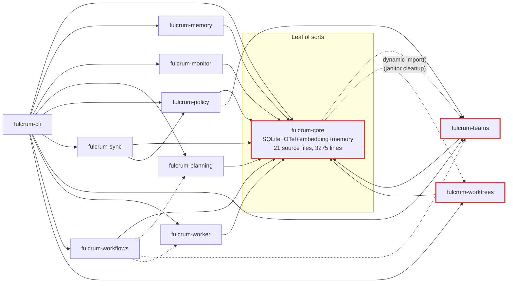

# F6 — Modular Architecture Audit

> Critical audit of Fulcrum's 11-package monorepo against R6 standards. The
> central user complaint: "each part to some extent can be used alone, but also
> can integrate tightly and seamlessly with other parts". Today's reality: no
> Fulcrum package can be `npm install`-ed and used alone. They all transitively
> pull in `better-sqlite3`, `kuzu`, `@huggingface/transformers`, OTel, and a
> mutable global `getDb()` singleton via `fulcrum-core`, and every `main`
> entry point is a raw `.ts` file that requires `tsx` at runtime.
>
> Target baseline: `docs/audit/research/r6-modular-architecture.md` §4 (dep
> patterns), §5 (cycle avoidance), §7 (config layering), §8 (testing), §10
> (anti-patterns), §11 (MUST / SHOULD / MAY checklist), §12 (recommended
> Fulcrum layout).
>
> Evidence cites `packages/<name>/package.json`, `packages/<name>/src/**` and
> `docs/audit/codebase/c1-inventory.md` §9 where applicable.

---

## 0. Executive summary

- Fulcrum's current modularisation is **cosmetic**. Packages are folders with
  `package.json` files, but they share a single mutable SQLite singleton
  (`_db` in `packages/core/src/db/client.ts:5`), and every feature package
  `import`s `getDb`, `FulcrumError`, `newId`, etc. from `fulcrum-core`.
  Remove `fulcrum-core` and every other package stops compiling.
- **Zero packages are publishable as-is.** `main`, `types`, and `exports` all
  point at `./src/index.ts`. There is no build step, no `dist/`, no `bin`
  field anywhere except `fulcrum-cli` (which also points at a `.ts` file).
  `pnpm -r build` is a no-op (C1 §10, lines 1463–1466).
- **One acknowledged cycle (core ↔ teams) and a second latent cycle
  (core ↔ worktrees)**, both resolved with dynamic `await import('fulcrum-*')`
  getters. A third contrived cycle lurks in policy tests (`policy` imports
  `L1_ROLES` from `teams`, which re-exports it from `core`) — the contract
  lives in core, the test reaches through teams.
- **No `fulcrum-kernel` exists.** R6 §12's single most important
  recommendation. Every package peer-depends (implicitly) on `fulcrum-core`'s
  runtime — SQLite migrations, `getDb()`, OTel, embeddings — instead of on a
  typed interfaces-only leaf.
- **`fulcrum-core` is a god package**: 21 top-level `.ts` files, ~3,275
  lines of source, 32 test files, 11,505 test lines (nearly half the
  codebase), and it owns persistence + embeddings + OTel + memory write/read
  + policy + handoffs + janitor + roles + cos-context + cos-parser +
  telemetry + agent profiles. R6 §10 #1.
- **Mutable module state is pervasive**: `_db` in `packages/core/src/db/client.ts`,
  `_embedder/_reranker` in `packages/core/src/embedding/registry.ts:10-12`
  (inferred — tests call `resetProviders`), and the worker adapter registry
  (`packages/worker/src/adapter.ts` — built-ins registered at module load via
  side-effect). R6 §10 #6 + #7.
- **Duplicate exports with the same name across packages**:
  `writeMemory` and `recallMemory` are exported **both** from `fulcrum-core`
  (via `packages/core/src/memory.ts:122, 211`) and from `fulcrum-memory`
  (`packages/memory/src/write.ts:16`, `recall.ts`). This is not just a smell
  — it is an ambiguous API. Which one is canonical?
- **No subpath exports, no `"sideEffects"` flag, no `"bin"` per package, no
  `"fulcrum"` manifest field, no Zod config schemas, no contract-test suites
  at package boundaries, no `test/dummy/` hosts.** Every item in R6 §11's
  MUST / SHOULD columns is failing.
- **CLI partially does the right thing.** `packages/cli/src/index.ts` uses
  `await import('fulcrum-*')` for most subcommands (lines 228, 348, 396,
  435, 554, 569, 1231, 1318, 1362, 1435, 1565 …). But its two **top-level**
  imports at lines 4–5 pull `fulcrum-memory` eagerly, defeating the lazy
  discovery story. And it hard-lists all 10 sibling packages as
  `dependencies` in `packages/cli/package.json:19-29`, so there is no
  optional-peer story.
- **Verdict**: the repo is currently a modular monolith masquerading as a
  library ecosystem. The minimum-viable fix is R6 §12's concrete migration.
  See §10 below for the refined plan and `F6-ISSUE-01..14` for the
  individual work items.

---

## 1. Conformance strengths

Not much, but not nothing.

- **Workspace layout is correct at the coarse level.** `pnpm-workspace.yaml`
  lists `packages/*` and pnpm resolves `workspace:*` properly. R6 §2.9.
- **`fulcrum-workflows` correctly declares its sibling deps as
  `peerDependencies` with `peerDependenciesMeta.optional = true`** for
  `fulcrum-planning`, `fulcrum-teams`, `fulcrum-worker`
  (`packages/workflows/package.json:29-38`). This is exactly the R6 §4.1
  optional-peer-dep pattern. It is also the **only** package in the repo
  that does it.
- **`fulcrum-core` declares `fulcrum-teams` as an optional peer dep** to
  break the static cycle (`packages/core/package.json:31-38`). The lazy
  `getTeamOps()` getter (`packages/core/src/index.ts:125-129`) is a
  reasonable R6 §5.2 "lazy getter / function ref" workaround, but it leaks
  typing — the return type is `Record<string, unknown>` (see the inline
  comment on lines 120–124), which defeats IDE intellisense for everything
  in `fulcrum-teams`.
- **`fulcrum-worker` uses a registry pattern** for agent adapters:
  `registerAgentAdapter(name, adapter)` + `getAgentAdapter(name)`
  (`packages/worker/src/adapter.ts`, exported via `index.ts:6-10`). R6 §4.1
  "registry pattern". This is the closest thing Fulcrum has to a plugin
  contribution point. Third-party adapters _can_ register at runtime.
- **Every feature package has a `README.md`** except `fulcrum-cli` and
  `fulcrum-worker` (confirmed by `ls packages/*/README.md`). R6 §11.2
  SHOULD item partially satisfied.
- **Test isolation via `setDb(inMemoryDb)`** is used consistently in the
  `tests/helpers.ts` pattern across core, memory, monitor, planning, policy,
  teams, workflows, worktrees, worker. This at least gives per-test
  isolation even though it is powered by a mutable module singleton (see §5
  anti-patterns).
- **Core's public API is centralised in one barrel** (`packages/core/src/index.ts`,
  129 lines). Small-ish, explicit re-exports, no `export *`. This is the
  best-behaved barrel in the repo.

---

## 2. Actual dependency graph (computed)

### 2.1 Raw `dependencies + peerDependencies` from each package.json

```
fulcrum-core
  runtime deps:       better-sqlite3, sqlite-vec, @huggingface/transformers,
                      ulid, @opentelemetry/api, @opentelemetry/sdk-trace-node,
                      @opentelemetry/resources,
                      @opentelemetry/semantic-conventions,
                      @opentelemetry/exporter-trace-otlp-http
  peer deps:          fulcrum-teams (optional)
  dev deps:           fulcrum-teams, @types/better-sqlite3, @types/node,
                      typescript, vitest
  sibling workspace:  teams (optional peer + dev)

fulcrum-memory
  runtime deps:       fulcrum-core, ulid, gray-matter, simple-git, chokidar,
                      kuzu
  dev deps:           better-sqlite3, @types/better-sqlite3, @types/node,
                      typescript, vitest
  sibling workspace:  core (hard)

fulcrum-monitor
  runtime deps:       fulcrum-core, ulidx, hono, @hono/node-server
  sibling workspace:  core (hard)

fulcrum-planning
  runtime deps:       fulcrum-core, ulid
  sibling workspace:  core (hard)

fulcrum-policy
  runtime deps:       fulcrum-core, fulcrum-teams, minimatch, ulid
  sibling workspace:  core (hard), teams (hard ← NEW cycle source)

fulcrum-sync
  runtime deps:       fulcrum-core, fulcrum-policy, ulidx
  sibling workspace:  core (hard), policy (hard)

fulcrum-teams
  runtime deps:       fulcrum-core, ulidx
  sibling workspace:  core (hard ← static cycle source)

fulcrum-worker
  runtime deps:       fulcrum-core
  sibling workspace:  core (hard)

fulcrum-workflows
  runtime deps:       fulcrum-core, ulidx
  peer deps:          fulcrum-planning, fulcrum-teams, fulcrum-worker
                      (all optional)
  sibling workspace:  core (hard), planning/teams/worker (optional peer)

fulcrum-worktrees
  runtime deps:       fulcrum-core, ulidx
  sibling workspace:  core (hard)
  dynamic import from core:  fulcrum-worktrees (lurking cycle — see §4)

fulcrum-cli
  runtime deps:       fulcrum-core, fulcrum-memory, fulcrum-monitor,
                      fulcrum-planning, fulcrum-policy, fulcrum-sync,
                      fulcrum-teams, fulcrum-worker, fulcrum-workflows,
                      fulcrum-worktrees, tsx
  sibling workspace:  ALL 10 siblings, hard deps
```

### 2.2 Mermaid diagram (current)



Dotted arrows are `peerDependenciesMeta.optional = true` or runtime
`await import()`. Solid arrows are hard runtime `dependencies`.

### 2.3 Graph facts

- **11 packages. Every non-cli package has at least one hard runtime
  dependency on `fulcrum-core`.** Core has no hard deps on any sibling —
  but it _does_ have two dynamic imports back into siblings (see §4).
- **`fulcrum-cli` has 10 hard `dependencies`**, one per sibling. R6 §12.6
  calls for dynamic imports here with _optional peer deps_. Today it is the
  opposite: eager deps + dynamic usage.
- **`fulcrum-policy` depends on `fulcrum-teams`** (`packages/policy/package.json:21`).
  The only thing it actually uses from teams is `L1_ROLES`, and teams itself
  re-exports that symbol from core (`packages/teams/src/types.ts:14` —
  `export { L1_ROLES } from 'fulcrum-core'`). This is a **fake dependency**
  — policy could import `L1_ROLES` directly from core and delete the teams
  edge entirely. The test at `packages/policy/src/tests/engine.test.ts:5`
  imports it via teams; that's the only consumer.
- **`fulcrum-sync` depends on `fulcrum-policy`** because `sync.ts:3` does
  `import { checkSecrets } from 'fulcrum-policy'`. Legitimate, but it
  chains the cycle potential: `sync → policy → teams → core`.

### 2.4 External dep bloat passed through `fulcrum-core`

Any package that imports `fulcrum-core` transitively gets:

- `better-sqlite3` (native) — C++ SQLite binding
- `sqlite-vec` — C extension
- `@huggingface/transformers` — ONNX runtime + tokenizers, ~100MB installed
- `kuzu` — C++ graph DB (but actually this comes via `fulcrum-memory`)
- 5 × `@opentelemetry/*` packages
- `ulid` (runtime)

A user who wants "just the policy engine" would install ~200 MB of native
modules and an embedding runtime. R6 §10 #3 anti-pattern (packages with no
standalone utility).

---

## 3. Per-package standalone usability

Key questions, R6 §11 checklist:

- `private`? — if true, cannot be published at all.
- `"main"` → TS? — if yes, cannot be consumed as an npm package without tsx.
- `"exports"` map? — if not, no subpath exports, no encapsulation.
- `"bin"`? — if not, no standalone CLI.
- `"sideEffects"`? — if not set, bundlers assume side effects everywhere.
- `"fulcrum"` manifest? — none have it.
- Workspace hard deps — which siblings are required?
- `README.md`? — present/absent.

### 3.1 Table

| Package | `private` | `main` → TS | `exports` map | `bin` | `sideEffects` | Workspace hard deps | Has README | Publishable today? | Useful standalone? |
|---|---|---|---|---|---|---|---|---|---|
| `fulcrum-core`      | (root only) | `./src/index.ts` | single `"."` → TS | — | — | teams (optional peer) | yes | NO | NO — god package, opinionated SQLite |
| `fulcrum-memory`    | (root only) | `./src/index.ts` | single `"."` → TS | — | — | core (hard) | yes | NO | only via core |
| `fulcrum-monitor`   | (root only) | `./src/index.ts` | single `"."` → TS | — | — | core (hard) | yes | NO | only via core |
| `fulcrum-planning`  | (root only) | `./src/index.ts` | single `"."` → TS | — | — | core (hard) | yes | NO | only via core |
| `fulcrum-policy`    | (root only) | `./src/index.ts` | single `"."` → TS | — | — | core (hard), teams (hard, fake) | yes | NO | only via core |
| `fulcrum-sync`      | (root only) | `./src/index.ts` | single `"."` → TS | — | — | core, policy (both hard) | yes | NO | only via core |
| `fulcrum-teams`     | (root only) | `./src/index.ts` | single `"."` → TS | — | — | core (hard; also cycle) | yes | NO | only via core |
| `fulcrum-worker`    | (root only) | `./src/index.ts` | single `"."` → TS | — | — | core (hard) | **NO** | NO | only via core |
| `fulcrum-workflows` | (root only) | `./src/index.ts` | single `"."` → TS | — | — | core (hard); planning/teams/worker (optional peer) | yes | NO | only via core |
| `fulcrum-worktrees` | (root only) | `./src/index.ts` | single `"."` → TS | — | — | core (hard) | yes | NO | only via core |
| `fulcrum-cli`       | (root only) | `./src/index.ts` | — | `./src/index.ts` (tsx) | — | all 10 siblings (hard) | **NO** | NO | NO — is the app |

> **Root `package.json`** is `"private": true`. Individual packages are not
> marked private, but because their `main` fields point at TypeScript
> source, they are functionally unpublishable. A user running `npm install
> fulcrum-memory` would import `./src/index.ts` and immediately fail
> because their project has no `tsx` loader. **R6 §10 #10 anti-pattern**.

### 3.2 Per-package notes

#### 3.2.1 `fulcrum-core`

**Role today**: one package containing persistence, migrations, tasks,
runs, roles, projects, workspaces, memory write/read (duplicated with
`fulcrum-memory`), policy (duplicated with `fulcrum-policy`), handoffs,
events, locks, telemetry, janitor, config, ids, constants, CoS context
builder, CoS parser, agent profiles, and embedding/reranker providers.

**Files** (`packages/core/src/*.ts`, 3,275 lines of non-test code):

```
agent-profiles.ts   161 LOC   DB
config.ts           82 LOC   — pure + env vars
constants.ts        32 LOC   — pure
cos-context.ts      94 LOC   DB + depends on tasks, status
cos-parser.ts       123 LOC  — pure (string → structured)
events.ts           43 LOC   DB
handoffs.ts         222 LOC  DB
ids.ts              66 LOC   — pure (ulid, counter)
index.ts            129 LOC  — barrel
janitor.ts          120 LOC  DB + dynamic import fulcrum-worktrees
locks.ts            117 LOC  DB
memory.ts           371 LOC  DB + embedding (duplicate of fulcrum-memory)
policy.ts           64 LOC   DB (duplicate of fulcrum-policy)
projects.ts         188 LOC  DB
roles.ts            60 LOC   — pure
runs.ts             441 LOC  DB
status-category.ts  24 LOC   — pure
status.ts           206 LOC  DB
tasks.ts            210 LOC  DB
types.ts            432 LOC  — pure types + enums
workspaces.ts       90 LOC   DB
db/client.ts        39 LOC   — singleton global
db/migrations.ts    ...      — SQL migrations
embedding/*.ts      ~130 LOC — transformers runtime
telemetry/*.ts      ~220 LOC — OTel SDK
```

**Pure files that belong in a kernel leaf** (zero runtime deps, no DB):

- `types.ts` — 432 lines of enums, interfaces, `FulcrumError` class. No imports.
- `ids.ts` — ulid wrapper + `nextDisplayId` (takes a db as arg).
- `constants.ts` — numeric + string constants only.
- `roles.ts` — `L1_ROLES` set, `isL1`, `roleCapabilities`, `canInvokeTeams`,
  `canMerge`, `canWriteCode`, `canEditFiles`. Pure map.
- `status-category.ts` — pure enum mapper.
- `cos-parser.ts` — pure string parsing.

Together: ~737 lines of pure code that every package in the repo needs,
none of which touch SQLite, OTel, or embeddings. **This is the de facto
`fulcrum-kernel`**, sitting inside the god package. R6 §12.2.

**Infrastructure files that could move to their own packages**:

- `db/*` + `tasks.ts` + `runs.ts` + `workspaces.ts` + `projects.ts` +
  `events.ts` + `handoffs.ts` + `locks.ts` + `agent-profiles.ts` + `status.ts`
  → `fulcrum-db` (the real persistence package, uses kernel's types).
- `embedding/*` → `fulcrum-embedding` (separate native-deps cost).
- `telemetry/*` → `fulcrum-telemetry` (separate OTel cost).
- `memory.ts` (the duplicate) → delete; keep the real one in `fulcrum-memory`.
- `policy.ts` (the duplicate) → delete; keep the real one in `fulcrum-policy`.
- `janitor.ts` → `fulcrum-runtime` (the auto-init + daemon orchestrator).
- `config.ts` → split between kernel (schema) and runtime (loader).

**Standalone usability**: zero. Installing `fulcrum-core` gives you SQLite
+ OTel + ONNX + Kuzu whether you want them or not, and its public API is
the god barrel.

#### 3.2.2 `fulcrum-memory`

- Depends on `getDb()` global singleton from core; cannot function without
  core's migrations having run first.
- Re-exports ~50 names from a single barrel (`packages/memory/src/index.ts`)
  covering vault (L0), FTS5, Kuzu, graph, scoring, dedup, extractors,
  setup. This is a candidate for **subpath exports**:
  `fulcrum-memory/vault`, `fulcrum-memory/kuzu`, `fulcrum-memory/graph`,
  `fulcrum-memory/search`, `fulcrum-memory/ingest`, `fulcrum-memory/setup`.
  All present as folders; none exposed as exports (R6 §3.4).
- **Name collision with core**: both export `writeMemory` and `recallMemory`.
  The `fulcrum-memory` version writes through the L0 vault first and then
  into SQLite; the `fulcrum-core` version writes directly to SQLite. A
  consumer that imports `writeMemory` from the wrong package gets subtly
  different semantics. R6 §10 #11 (private types leaking via public APIs)
  — here it's worse: **two competing canonical APIs with the same name**.
- Highest standalone value in the whole repo: local semantic notes.
  Should ship `fulcrum-memory ingest`, `fulcrum-memory search`,
  `fulcrum-memory gc`. R6 §12.4.
- `kuzu` is only used inside the package, but it's a hard dep, so a user
  who only wants L0+L1 pays the kuzu native-build cost.

#### 3.2.3 `fulcrum-monitor`

- HTTP metrics server. Uses hono + `@hono/node-server` on top of core's DB.
- All routes are in `server.ts`; metrics aggregation in `metrics.ts`.
- Could be meaningful as a standalone dashboard (`fulcrum-monitor tail`)
  that points at any Fulcrum-compatible SQLite file. R6 §12.5.
- Hard dep on core's SQLite schema and tables. If the monitor depended on
  a kernel `MetricsReader` port, it could run against any implementation.

#### 3.2.4 `fulcrum-planning`

- Epics, issues, PRDs, plans, task relations, code reviews. Pure CRUD over
  SQLite tables owned by core's migrations.
- **Cross-package DB access** (R6 §10 #9). Planning creates rows in tables
  declared by `fulcrum-core/db/migrations.ts`. Core could never migrate
  those tables without coordinating with planning. The "clean" fix: planning
  owns its tables and runs its own migrations (modular-monolith pattern,
  R6 §1.5). The "easy" fix: planning depends on kernel's `DbPort` and core
  registers a `DbPort` at init.
- Standalone value: `fulcrum-plan list`, `fulcrum-plan new` — yes, users
  could run planning against their own SQLite file.

#### 3.2.5 `fulcrum-policy`

- WIP limits, system invariants, secret guard, policy rules, audit log.
- **Fake dep on `fulcrum-teams`**. `package.json` lists it; only one test
  file imports `L1_ROLES` via teams (`packages/policy/src/tests/engine.test.ts:5`),
  and `L1_ROLES` originates in core. R6 §10 #9 + §11.1 MUST "no hard
  runtime dep on another sibling".
- **Redundancy with core**. `packages/core/src/policy.ts` has a `checkPolicy`
  function; `packages/policy/src/engine.ts` has `evaluatePolicy` and much
  more. Two policy engines, two names, both writing to the same audit log.
  Which is canonical?
- Has real standalone value: `fulcrum-policy check <file>` could run the
  secret scanner or the rule engine against any file system path.
- Registering rules (`createPolicyRule`) is side-effectful through the DB
  singleton — **R6 §10 #6**.

#### 3.2.6 `fulcrum-sync`

- Plane.so adapter, conflict detection, sync state.
- Depends on policy for `checkSecrets` (legit).
- Depends on core for DB.
- Standalone value: `fulcrum-sync push --plane-config plane.toml` —
  reasonable for users who want project-mgmt sync without the rest of
  Fulcrum.
- Currently untestable without core's migrations.

#### 3.2.7 `fulcrum-teams`

- Team templates, role slots, scheduler.
- **First half of the static cycle**: teams imports from core; core
  dynamic-imports teams via `getTeamOps()`.
- Trivial fix: move `L1_ROLES`, `AgentRole` enum, the `RoleCapabilities`
  type, and any "team template" _types_ into kernel. Teams then depends
  on kernel only. Core no longer needs to call into teams — the few
  places that did (MCP tool handlers) can depend on teams directly at the
  application edge.

#### 3.2.8 `fulcrum-worker`

- Worker adapters, lifecycle driver (`spawnAgent`), stub + subprocess
  built-in adapters.
- **Has the best plugin pattern in the repo**: `registerAgentAdapter(name, adapter)`.
  This is exactly R6 §1.6 contribution points, but ad-hoc and untyped.
- Missing `README.md`. R6 §11.2 SHOULD.
- Depends on core for `startAgentRun`, `heartbeatAgentRun`,
  `completeAgentRun`, `blockAgentRun`, `canInvokeTeams`, `FulcrumError`,
  `startSpan`, `endSpan` — none of which should live in core long-term.
  `startAgentRun`/`heartbeatAgentRun`/`completeAgentRun`/`blockAgentRun` are
  _runs domain_ and belong in a `fulcrum-runs` package. `canInvokeTeams`
  is a pure role capability and belongs in kernel. `FulcrumError` belongs
  in kernel. Telemetry belongs in `fulcrum-telemetry`.
- Standalone value: `fulcrum-worker run task.json` against a subprocess
  adapter.

#### 3.2.9 `fulcrum-workflows`

- Best-behaved package in the repo w.r.t. dep declarations: uses optional
  peer deps for planning/teams/worker.
- But still hard-depends on core.
- Subpath-export candidates: `fulcrum-workflows/engine`,
  `fulcrum-workflows/registry`, `fulcrum-workflows/runner`,
  `fulcrum-workflows/step-executor`.
- Its registry pattern (`registry.register(workflow)`) is another good
  plugin seam that is untyped and undiscoverable today.

#### 3.2.10 `fulcrum-worktrees`

- Git worktrees, artifact tracking.
- **Second half of a latent cycle**: `packages/core/src/janitor.ts:77-80`
  uses a dynamic `await import('fulcrum-worktrees').catch(() => null)` to
  call worktree cleanup. This cycle is not declared in package.json at all
  — it's a **hidden runtime dep** — which is worse than the declared
  core↔teams cycle. A user who installs `fulcrum-core` standalone will
  lose worktree cleanup silently.
- Standalone value: `fulcrum-worktree create`, `fulcrum-worktree gc`.
  Directly useful as a git helper.

#### 3.2.11 `fulcrum-cli`

- The composition package. Imports `fulcrum-memory` eagerly at lines 4–5
  to run two specific commands (`memory init`, `memory accelerate`), and
  then uses `await import(...)` for everything else — including
  `fulcrum-memory` again at lines 228, 229, 244, 245.
- **Has 10 hard `dependencies`** on siblings in `package.json:19-29`. R6
  §12.6 says these should be optional peer deps on everything except
  `fulcrum-kernel`. Today a user who installs `fulcrum-cli` installs the
  entire stack regardless of which subcommands they will run. Cold start
  is dominated by eager module resolution via pnpm.
- Also missing `README.md`.
- `"bin": { "fulcrum": "./src/index.ts" }` — unpublishable.

---

## 4. Cycles and near-cycles

### 4.1 Declared cycles

- **`fulcrum-core ↔ fulcrum-teams`**. Declared. Resolved via
  optional peer dep (`packages/core/package.json:31-38`) + lazy getter
  (`packages/core/src/index.ts:125-129`).
  - Typing is lost on the core side: `getTeamOps(): Promise<Record<string, unknown>>`.
  - Consumers must type-assert or cast.
  - The reason the cycle exists is because core wants to expose team
    operations through its barrel ("for MCP tool handlers"), even though
    teams is a higher-layer package. **Correct R6 fix**: invert the
    dependency. Move the contracts (`TeamInvoke`, `TeamStatus`, etc.) into
    kernel; teams depends on kernel; the MCP handlers (in cli or a
    dedicated `fulcrum-mcp` package) depend on teams directly.

### 4.2 Undeclared / lurking cycles

- **`fulcrum-core ↔ fulcrum-worktrees`**. Undeclared in package.json.
  `packages/core/src/janitor.ts:77-80` does
  `const mod = await import('fulcrum-worktrees').catch(() => null)`.
  - Worktrees declares `fulcrum-core` as a hard dep. Core declares
    nothing about worktrees. If `fulcrum-worktrees` ever tries to import
    core during its module load, and core is mid-import (e.g. during the
    janitor's first cycle), **you have an async import race** that Node
    may resolve to a partially-constructed module.
  - R6 §5.2 fix: extract a `WorktreePort` into kernel, let worktrees
    register at runtime via a `init(ctx)` hook; core's janitor calls
    `ctx.tryGet(WorktreePort).gc()`.

- **`fulcrum-policy → fulcrum-teams → fulcrum-core → fulcrum-teams`**
  Not a cycle per se (policy only depends on teams; core has _optional_
  peer on teams), but because `fulcrum-policy` hard-depends on
  `fulcrum-teams` to reach into `L1_ROLES`, any attempt to split policy
  from teams will fail until L1_ROLES moves to kernel.

- **`fulcrum-sync → fulcrum-policy → fulcrum-teams → fulcrum-core`**:
  four-deep chain for `checkSecrets`. Not a cycle, but the longest chain
  in the graph. If any of these has a publishing problem, sync cannot
  ship.

### 4.3 Tooling

- R6 §5.4 lists `madge --circular`, `dep-tree`, `eslint-plugin-import
  no-cycle`, TypeScript project references, Nx `enforce-module-boundaries`.
- Fulcrum uses **none** of these.
- There is **no CI check** for new cycles. The next cycle will be caught
  by a human when a test breaks with a strange TDZ error. **MUST** add
  `madge --circular packages/**/src` to CI. F6-ISSUE-07.

---

## 5. Anti-pattern scorecard (R6 §10)

| # | Anti-pattern | Status | Evidence |
|---|---|---|---|
| 1 | God package owning everything | **✗ fails hard** | `fulcrum-core` is 21 top-level source files, 3275 LOC, 32 test files, 11,505 test LOC; owns persistence + embedding + telemetry + roles + cos + memory + policy + events + locks + janitor + handoffs + agent-profiles. Every other package depends on it. R6 §12.2 wants this split into kernel/db/embedding/telemetry/runtime. |
| 2 | Barrel files importing half the monorepo | **⚠ partial** | `packages/core/src/index.ts` is 129 lines of explicit re-exports (not `export *`) — disciplined at the barrel level. BUT importing `{ newId }` from core also loads `db/client.ts` (which calls `require('sqlite-vec')` at module load), `embedding/registry.ts`, and everything else. No `sideEffects: false` anywhere. Teams, memory, workflows, sync, monitor, worktrees all use `export *` which pulls every type and every runtime export. |
| 3 | Packages with no standalone utility | **✗ fails** | 11/11 packages are unpublishable and unusable without sibling core. Every package fails R6 §11.1 MUST #2. |
| 4 | Hardcoded package names in `await import()` | **✗ fails** | `core/janitor.ts:80` `await import('fulcrum-worktrees')`; `core/index.ts:127` `await import('fulcrum-teams')`; `cli/index.ts` has 40+ hardcoded `await import('fulcrum-*')` calls. No `kernel.resolve('worktrees')` indirection. R6 §10 #4. |
| 5 | Untyped contribution points | **✗ fails** | `fulcrum-worker.adapter.registerAgentAdapter()` takes an `AgentAdapter` interface (`packages/worker/src/types.ts`) — typed — but there is no schema validation, no versioning, no activation event model. `fulcrum-workflows.registry` is a plain JS Map keyed by string. `L1_ROLES` and `roleCapabilities` are declared directly, not contribution points. No package-level manifest. R6 §1.7 + §10 #5. |
| 6 | Mutable module state | **✗ fails** | `_db: Database \| null = null` at `packages/core/src/db/client.ts:5`. The entire test suite depends on `setDb()` injecting a `:memory:` database into this singleton. Changes are visible to all importers process-wide, so two parallel Vitest workers must be file-isolated (which they are, by Vitest default, but at cost). Also: `packages/core/src/embedding/registry.ts` with `_textEmbedder`, `_codeEmbedder`, `_reranker` fields. Also: `packages/worker/src/adapter.ts` registers `stub` + `subprocess` at module load as a side effect. R6 §10 #6. |
| 7 | Relying on import order | **⚠ latent** | Same-file side effects at module load (embedding registry init, adapter registration) create implicit import-order requirements. Today nothing breaks because core is always imported first, but the next contributor who writes `import { subprocessAdapter } from 'fulcrum-worker'` directly will discover that the registration side effect fires in a different order. R6 §10 #7. |
| 8 | Publishing internal files | **⚠ latent** | No `"files"` field and no `exports` map beyond `"."`. If a package were published today, consumers could reach into `fulcrum-memory/src/vault/git.ts` with no restriction. R6 §10 #8. |
| 9 | Cross-package DB access | **✗ fails** | Every feature package calls `getDb()` and issues raw SQL against tables declared by `fulcrum-core/db/migrations.ts`. Memory writes to the `memory` table. Planning writes to `epics`, `issues`, `prds`, `plans`, `task_relations`, `reviews`. Policy writes to `policy_rules`, `audit_log`. Sync writes to `sync_state`. Teams writes to `team_templates`, `team_instances`. Workflows writes to `workflow_runs`. Worktrees writes to `worktrees`, `merge_queue`. **None of these tables are encapsulated by the owning package.** Core's migrations module knows about every table in the entire system. The modular-monolith "each module owns its schema" rule (R6 §1.5) is violated. R6 §10 #9. |
| 10 | `file:` / workspace-only protocol | **✗ fails** | `"dependencies": { "fulcrum-core": "workspace:*" }` everywhere. `workspace:*` does at least get rewritten by pnpm on publish, BUT because nothing is publishable, the rewrite never happens. R6 §10 #10. |
| 11 | Private types leaking through public APIs | **⚠ partial** | Core exports `_configureDb` (leading underscore is the TS convention for "internal"). `getDb`/`setDb` expose a raw `better-sqlite3.Database` instance through the API — consumers can prepare arbitrary SQL statements against any table, bypassing any owning package. R6 §10 #11. |
| 12 | Circular peer deps | **✓ ok** | Core declares teams as optional peer, teams declares core as hard dep. Not circular peer. |

**Score: 8 ✗, 2 ⚠, 2 ✓ / 12**. Most of the antipattern list is failing.

---

## 6. R6 MUST/SHOULD/MAY checklist (§11)

### 6.1 MUST

| # | Item | Pass |
|---|---|---|
| 1 | Every package has a single documented public API via `exports` | ✗ only `"."` root, no subpath, no conditional |
| 2 | Every package installable / runnable standalone without siblings except kernel | ✗ no package works without core at runtime |
| 3 | `fulcrum-kernel` exists and contains only contracts | ✗ does not exist |
| 4 | No hard runtime dep on sibling (use peer/optional/dynamic) | ✗ memory, monitor, planning, policy, sync, teams, worker, worktrees, workflows, cli all hard-dep core; policy hard-deps teams; sync hard-deps policy; cli hard-deps all 10 siblings |
| 5 | Every package ships a CLI wrapper (`bin`) or documents why not | ✗ only `fulcrum-cli` has `bin` and it points at TS |
| 6 | Dependency graph is acyclic; enforced by `madge --circular` in CI | ✗ one declared cycle, one latent cycle, no CI check |
| 7 | Every package passes contract tests against kernel ports it implements | ✗ no contract tests, no ports |
| 8 | Each package's tests run without installing siblings | ✗ every test helper imports `setDb`/`closeDb` etc. from `fulcrum-core` |
| 9 | Each package publishes a changelog and bumps semver | ✗ all at `0.0.1`, no changesets, no release script |
| 10 | `peerDependencies` + `peerDependenciesMeta` used correctly; `workspace:*` rewritten on publish | ✗ all deps are in `dependencies`, not peer |
| 11 | No mutable top-level state; state lives in Context | ✗ `_db`, embedding registry, worker adapter registry |
| 12 | Every contribution point is typed (Zod) and validated at load time | ✗ no manifest, no schema, no validation |

**12/12 MUST items fail.**

### 6.2 SHOULD

| # | Item | Pass |
|---|---|---|
| 1 | Zod config schemas per package | ✗ core uses plain TS types, no Zod |
| 2 | `"sideEffects": false` or narrowed | ✗ not set anywhere |
| 3 | Subpath exports for granular imports | ✗ none |
| 4 | Small barrel files | ⚠ core is OK; memory, teams, workflows use `export *` |
| 5 | Integration tests in dedicated `fulcrum-e2e` | ✗ integration tests live inside each package |
| 6 | `test/dummy/` or `examples/` showing standalone use | ✗ none |
| 7 | CLI discovers plugins by scanning `package.json` for `"fulcrum"` | ✗ no discovery |
| 8 | Plugin activation is lazy | ⚠ CLI uses dynamic import for most commands, but also has two eager top-level imports |
| 9 | README per package with standalone usage | ⚠ 9/11 packages have READMEs; but "standalone usage" sections would all be wrong (nothing is standalone) |

### 6.3 MAY

| # | Item | Pass |
|---|---|---|
| 1 | Optional peer deps for nice-to-have integration | ⚠ only workflows uses them correctly |
| 2 | Typed event bus in kernel | ✗ no event bus (there's an `events.ts` in core, but it's just SQL inserts) |
| 3 | Feature-flagged `unstable` exports | ✗ |
| 4 | `fulcrum-e2e` scenario runner | ✗ |
| 5 | Project-graph lint (Nx tags) | ✗ |
| 6 | Plugin-of-plugin | ✗ |

---

## 7. Configuration layering (R6 §7)

### 7.1 Current state

- Single file `.fulcrum.json` loaded by `packages/core/src/config.ts:39`.
- Merged with compiled-in defaults for `policy`, `embedding`, `reranker`,
  `vault`.
- Env var overrides: only `FULCRUM_WORKSPACE_ID`, `FULCRUM_PROJECT_ID`,
  `FULCRUM_PORT` are honoured by the loader itself. Other env vars
  (`FULCRUM_AGENT_ADAPTER`, `FULCRUM_VAULT_PATH`, `FULCRUM_AGENT_STUB_DIR`,
  `FULCRUM_AGENT_SUBPROCESS_CMD`, etc.) are read ad-hoc inside whichever
  package needs them.
- No Zod schema. `FulcrumConfig` is a plain TypeScript interface; malformed
  JSON silently falls back to defaults (`config.ts:50`).
- No per-package config file (no `.fulcrum-memory.json`). No per-module
  section inside `.fulcrum.json` beyond the ones core knows about
  (embedding, reranker, policy, vault).
- No CLI flag overrides beyond whatever argv parsing the CLI does ad hoc.

### 7.2 Gap vs R6 §7.3

R6 recommends:

```
defaults → global fulcrum.toml → per-module fulcrum-<mod>.toml
        → FULCRUM_<MOD>_<KEY> env → CLI flags
```

Fulcrum has steps 1 and 2 (partially) and steps 4 (ad hoc only) and 5 (ad
hoc per command). No per-module config, no Zod validation, no standalone
mode where a package loads its own config without the root file.

### 7.3 Recommendation

- F6-ISSUE-05: move `FulcrumConfig` to kernel as a Zod schema. Each feature
  package declares a Zod sub-schema registered with the kernel at init.
  Kernel validates `.fulcrum.toml` once at startup, rejects with a
  line-accurate error if a section fails its schema.
- When a package runs standalone (`fulcrum-memory search`), it looks for
  `./fulcrum-memory.toml`, `./.fulcrum.toml#memory`, then
  `FULCRUM_MEMORY_*`.
- Env var prefixes: `FULCRUM_MEMORY_*`, `FULCRUM_POLICY_*`,
  `FULCRUM_WORKER_*`, `FULCRUM_VAULT_*`. Replace the ad-hoc env reads.

---

## 8. Testing composability (R6 §8)

### 8.1 Current state

- Vitest is configured per package. All packages share `vitest@^1.4.0`.
- Per-package `tests/helpers.ts` files construct an in-memory DB, run
  migrations via `runMigrations` from core, and call `setDb()` to install
  it into the module singleton.
- **Every package's tests import at least `fulcrum-core`** (see grep in
  §2 data collection). No package's test suite can run without core
  installed in `node_modules/fulcrum-core`.
- **No contract tests.** `fulcrum-core` does not publish "a
  `MemoryStore` implementation must satisfy these N assertions". Every
  consumer is free to implement its own.
- **No `test/dummy/` hosts.** There is no minimal integration harness per
  package showing "here's how to exercise this package without the CLI".
- **Integration tests are scattered.** `packages/core/src/tests/integration.test.ts`
  exists. `packages/memory/src/tests/integration.test.ts` exists. No central
  `fulcrum-e2e` workspace. When R6 §8.3 says "integration tests live in a
  top-level workspace", we are the opposite.

### 8.2 Gap analysis

| R6 §8 item | Status |
|---|---|
| No cross-package imports in tests except kernel | ✗ every test imports core |
| Mock adapters via ports | ✗ no ports, nothing to mock |
| Explicit test-kernel fixture | ⚠ `setDb(inMemory)` approximates, but couples to core's singleton |
| Dummy host app per package | ✗ |
| Contract tests at interface boundaries | ✗ |
| Integration tests in dedicated workspace | ✗ |
| Fakes preferred over mocks | ✓ in-memory SQLite counts as a fake |

### 8.3 Recommendation

F6-ISSUE-08: add a `fulcrum-e2e` workspace package that depends on every
other package, owns the real-filesystem integration tests, and leaves the
per-package `src/tests/` for pure unit tests. Add a `fulcrum-kernel/test-kit`
entrypoint that publishes contract suites (`noteStoreContract(impl)`,
`policyGateContract(impl)`, `workerAdapterContract(impl)`) which each
package imports and runs against its concrete implementation.

---

## 9. Distribution, publishability, plugin discovery (R6 §3, §9)

### 9.1 Distribution

- **Nothing is publishable.** Every `main`/`types`/`exports` points at
  `./src/index.ts`. No `dist/`, no `build` script, no `prepublishOnly`,
  no `files` field, no `tsup`/`rollup`/`tsc --declaration` tooling.
- C1 §10 (lines 1458–1504) confirms this: "pnpm -r build" is a no-op;
  the CLI is installed via the `fulcrum` wrapper script that calls `tsx`
  against the TS source. There is no npm-bin install path.
- **R6 §3 says every package should be library + application from one
  codebase.** Fulcrum's current build emits neither: no library (no
  compiled output), no application binary (only a shell wrapper + tsx
  runtime).

### 9.2 Publishability plan

F6-ISSUE-03, 04:

1. Add `tsup`-based build producing `dist/esm/index.js`, `dist/cjs/index.js`
   (optional), `dist/types/index.d.ts`.
2. Change each package's `main`, `module`, `types`, `exports` to point at
   `dist/*`.
3. Move `.ts` entrypoints into `exports["./src"]` only for dev (or just
   drop them — consumers should not reach into source).
4. Add `"files": ["dist", "README.md", "CHANGELOG.md"]`.
5. Add `"prepublishOnly": "pnpm build && pnpm test"`.
6. Drop `"private": true` at the root (it's there today) **only for the
   subset of packages that make sense as libraries** — e.g. kernel,
   memory, policy, worktrees, sync, monitor. Keep `fulcrum-cli`
   publishable as a bin, not a library. Keep `fulcrum-core` NOT
   publishable until the god package is split.

### 9.3 Plugin discovery

- R6 §9 recommends: scan `node_modules` for packages with a `"fulcrum"`
  field in `package.json`; read their contribution table; activate on
  demand.
- Fulcrum has: `fulcrum-worker.adapter.registerAgentAdapter()` and
  `fulcrum-workflows.registry` — both imperative and both requiring an
  explicit `import` to trigger the side effect of registration.
- **No `package.json` field exists for contributing to Fulcrum.**
- **No activation event model.** Nothing can say "load me when the user
  runs `fulcrum memory *`".
- F6-ISSUE-06: add a `"fulcrum"` manifest schema (Zod) to the kernel. Each
  package declares what it contributes (`ports`, `commands`,
  `activationEvents`). CLI scans `node_modules` at startup, indexes the
  manifests, and activates packages on demand. Third-party plugins can
  live under `@acme/fulcrum-slack-notifier` and register via the same
  manifest — no core changes.

---

## 10. Proposed migration (R6 §12 refined for Fulcrum's actual code)

### 10.1 Target package layout

```
packages/
  kernel/           ← NEW   contracts, ports, zod schemas, service locator,
                            event bus, activation engine, plugin manifest schema
  db/               ← NEW   SQLite client, migrations, schema owner
  embedding/        ← NEW   transformers runtime, providers registry (port impl)
  telemetry/        ← NEW   OTel SDK bootstrap + spans (port impl)
  runtime/          ← NEW   auto-init, janitor, kernel wiring, lifecycle
  core/             ← KEEP  use cases only: tasks, runs, workspaces, projects,
                            events, handoffs, locks, agent-profiles, status,
                            cos-context, cos-parser. No DB, no OTel, no
                            embedding. Everything via kernel ports.
  memory/           ← KEEP  L0 vault + L1 FTS5 + L2 Kuzu/graph. Implements
                            kernel.NoteStore port. Owns its own tables.
  planning/         ← KEEP  Epics/issues/prds/plans. Owns its tables.
  policy/           ← KEEP  Engine, secret guard, audit. Implements kernel.PolicyGate.
  sync/             ← KEEP  Plane adapter. Implements kernel.SyncProvider.
  teams/            ← KEEP  Team templates + scheduler. Implements kernel.TeamOps.
  worker/           ← KEEP  Agent adapters + lifecycle. Ports: kernel.Worker.
  workflows/        ← KEEP  Engine + runner. Implements kernel.WorkflowEngine.
  worktrees/        ← KEEP  Git worktrees. Implements kernel.WorktreeMgr.
  monitor/          ← KEEP  HTTP dashboard. Consumes kernel.MetricsReader.
  cli/              ← KEEP  Thin composition binary, dynamic imports only
  e2e/              ← NEW   cross-package integration suite
```

### 10.2 `fulcrum-kernel` contents (pure leaf, zero runtime deps except zod)

Moved from `fulcrum-core`:

- `types.ts` (432 lines) — all enums, interfaces, `FulcrumError`.
- `ids.ts` (66 lines) — `newId`, prefixes, `nextDisplayId`.
- `constants.ts` (32 lines).
- `roles.ts` (60 lines) — `L1_ROLES`, `roleCapabilities`, `canInvokeTeams`,
  `canMerge`, `canWriteCode`, `canEditFiles`.
- `status-category.ts` (24 lines).
- `cos-parser.ts` (123 lines) — pure string parsing.
- **NEW**: `ports/*.ts` — `NoteStore`, `PolicyGate`, `WorkerAdapter`,
  `WorktreeMgr`, `TeamOps`, `SyncProvider`, `WorkflowEngine`, `Db`,
  `Embedder`, `Reranker`, `TelemetrySpan`, `EventBus`, `MetricsReader`,
  `DbMigrations`.
- **NEW**: `context.ts` — `Context` service locator with typed `portKey`.
- **NEW**: `bus.ts` — typed pub/sub with declared event map.
- **NEW**: `activation.ts` — `ActivationEngine` that reads manifests and
  dispatches activation events.
- **NEW**: `manifest.ts` — Zod schema for the `"fulcrum"` package.json field.
- **NEW**: `config.ts` — Zod primitives for root config.
- **NEW**: `test-kit/contracts/*.ts` — contract tests per port.

Kernel runtime deps: `zod` only. Size: ~1,500 LOC for source + ~500 for
test-kit.

### 10.3 `fulcrum-db` contents

- `client.ts` — SQLite connection factory **without** module singleton.
  `createDb(config)` returns a `Db` port implementation.
- `migrations.ts` — migration runner that takes an array of
  `PackageMigrations` provided by each owning package. Each package
  publishes its own migrations; db runs them in dependency order.
- Zero schema knowledge. Pure infrastructure.

Deps: `better-sqlite3`, `sqlite-vec`, kernel (peer).

### 10.4 `fulcrum-embedding` and `fulcrum-telemetry`

- Each owns its heavy native deps.
- Each exposes a `createEmbedder(config)` / `initOtel(config)` that returns
  a port implementation registered with the kernel `Context`.
- Consumers who don't want embeddings install only kernel + db.

### 10.5 `fulcrum-runtime`

- `bootstrap(config): Context` — the auto-init function that today lives
  implicitly inside core's module loads + `getDb`.
- Owns the janitor.
- Owns the lifecycle "start daemon / stop daemon" logic.
- `fulcrum-cli` depends on runtime (peer); so do tests that want a real
  integrated context.

### 10.6 Migration order (R6 §12.10 adapted to this repo's reality)

1. **Create `fulcrum-kernel`** as a new package. Copy `types.ts`, `ids.ts`,
   `constants.ts`, `roles.ts`, `status-category.ts`, `cos-parser.ts`
   verbatim. Add `zod`. Zero runtime code at this step; kernel is pure TS.
2. **Reroute every package to import those types/enums from
   `fulcrum-kernel` instead of `fulcrum-core`** via a codemod. Core
   re-exports them for one release as backwards compat.
3. **Extract `fulcrum-db`**. Move `packages/core/src/db/*`, migrations,
   `getDb`/`setDb`. Replace the module singleton with `createDb(config): Db`
   that returns a typed port. Update core to use the port.
4. **Delete duplicates**. Remove `packages/core/src/memory.ts` (duplicate of
   memory), `packages/core/src/policy.ts` (duplicate of policy). Update any
   import sites in core to call through the kernel port.
5. **Break the core ↔ teams cycle for real**. Remove `getTeamOps()` from
   core. Move `L1_ROLES` re-export out of `packages/teams/src/types.ts:14`.
   Policy tests import from kernel.
6. **Break the core ↔ worktrees latent cycle**. Remove the dynamic import in
   `janitor.ts`. Introduce a `WorktreeMgr` port in kernel; worktrees
   registers its implementation during `init(ctx)`; janitor calls through
   the port.
7. **Extract `fulcrum-embedding` and `fulcrum-telemetry`**. Each owns its
   native deps; each registers a port.
8. **Extract `fulcrum-runtime`**. Move janitor, bootstrap, and the lifecycle
   orchestration. Core becomes use-cases only.
9. **Convert every sibling dep to peer deps on kernel (+ optional peer on
   anything else).** Run `madge --circular` in CI; fix any remaining
   cycles.
10. **Add `tsup` build, `dist/`, `"exports"` maps, `"sideEffects": false`,
    `"bin"` where applicable, `"files"`, `"prepublishOnly"`**, per package.
11. **Add the `"fulcrum"` manifest field** to every package with contents
    validated against kernel's Zod schema.
12. **Add per-package `bin` CLIs** (`fulcrum-memory`, `fulcrum-policy`,
    `fulcrum-worktree`, `fulcrum-sync`, `fulcrum-worker`, `fulcrum-monitor`,
    `fulcrum-plan`, `fulcrum-teams`). Each is a thin wrapper (<50 LOC)
    over the package's public API.
13. **Publish kernel 1.0.0; publish memory, policy, worktrees, sync, monitor
    as 0.x**; keep core + runtime + cli on 0.x until stable.

### 10.7 What the user sees when it's done

```
# Standalone memory (no daemon)
npm install -g fulcrum-memory
fulcrum-memory ingest ./notes
fulcrum-memory search "agent handoff pattern"

# Full control plane
npm install -g fulcrum-cli
fulcrum memory init
fulcrum serve mcp

# Third-party plugin
npm install -g @acme/fulcrum-slack-notifier
fulcrum plugin list  # shows @acme/fulcrum-slack-notifier contributed an event listener
```

---

## 11. Findings

### 11.1 CRITICAL

- **F6-C1 — No `fulcrum-kernel`; every package transitively imports core's
  SQLite+OTel+embeddings runtime.** Consequence: zero packages are standalone.
  Root cause: no interface-only leaf exists. Fix: R6 §12.2 kernel extraction
  (F6-ISSUE-01). Evidence: every `import ... from 'fulcrum-core'` in §2
  grep; `packages/core/src/db/client.ts:5-20` global singleton; every
  package.json runtime deps list.

- **F6-C2 — Every package is unpublishable.** `main`, `types`, `exports` all
  point at raw `./src/index.ts`. `pnpm -r build` is a no-op. No `dist/`,
  no `tsup`, no `prepublishOnly`. Result: "library + application" story from
  R6 §3 is impossible today. Fix: F6-ISSUE-03 build step + F6-ISSUE-04
  publish plan. Evidence: all 11 `package.json` files; C1 §10 lines
  1458–1504.

- **F6-C3 — Duplicate canonical APIs across core and feature packages.**
  `writeMemory`/`recallMemory` are exported by **both** `fulcrum-core`
  (`packages/core/src/memory.ts:122,211`) and `fulcrum-memory`
  (`packages/memory/src/write.ts:16, recall.ts`). A consumer picking the
  wrong one gets subtly different behaviour (vault-backed vs direct SQLite).
  Similarly, `checkPolicy` in core vs `evaluatePolicy` in policy. Fix:
  pick one (F6-ISSUE-09 consolidation) and delete the other.

- **F6-C4 — Cross-package direct DB access through `getDb()`.** Every
  feature package issues raw SQL against tables declared by core's
  migrations module, breaking the modular-monolith "each module owns its
  schema" rule (R6 §1.5) and making core unable to migrate any table
  without breaking a sibling. Fix: each package owns its migrations and
  its tables (F6-ISSUE-10); cross-package reads go through kernel ports.

- **F6-C5 — Mutable module state (`_db`) is the single point through which
  tests and runtime share a database**, violating R6 §10 #6. The only
  reason unit tests work is that `setDb()` swaps the singleton in
  `beforeEach`. Fix: thread the `Db` port through kernel `Context`;
  remove the singleton (F6-ISSUE-11). This is disruptive — every existing
  function that calls `getDb()` directly must accept a `Db` parameter or
  pull one from `ctx`. ~3000 LOC touched.

### 11.2 HIGH

- **F6-H1 — Latent `core ↔ worktrees` cycle via dynamic import in
  janitor** (`packages/core/src/janitor.ts:77-80`). Undeclared in
  package.json. A change in worktrees module-load order could deadlock.
  Fix: extract a `WorktreeMgr` port to kernel; worktrees registers during
  init; janitor calls through port.

- **F6-H2 — `fulcrum-policy` fake hard-dep on `fulcrum-teams`.** Only for
  `L1_ROLES`, which originates in core. Policy should depend on kernel and
  import `L1_ROLES` from there. `packages/policy/package.json:21`,
  `packages/policy/src/tests/engine.test.ts:5`. Fix part of
  F6-ISSUE-01 kernel extraction.

- **F6-H3 — `fulcrum-cli` has 10 hard deps on siblings and two eager
  top-level imports** (`packages/cli/src/index.ts:4-5`). Defeats the
  partial lazy-import story. Fix: move to optional peer deps, convert the
  two eager imports to dynamic, and add `"fulcrum"` manifest discovery
  (F6-ISSUE-06).

- **F6-H4 — No `exports` map, no subpath exports, no encapsulation, no
  `sideEffects: false`.** Today any consumer that does `import { foo }
  from 'fulcrum-memory'` pulls in the entire barrel including
  `fulcrum-core` (and transitively SQLite, OTel, transformers). Fix: per
  R6 §3.4 add subpath exports per package and narrow barrels. F6-ISSUE-02.

- **F6-H5 — No CI cycle check.** The existing cycles were each found by
  human beings. The next one will be found by a failed import in
  production. Fix: `madge --circular` + `eslint-plugin-import/no-cycle`
  (F6-ISSUE-07).

- **F6-H6 — No contract tests at port boundaries.** Each package tests its
  implementation against its own assertions. A contract suite in
  `fulcrum-kernel/test-kit` would pin the semantics of `NoteStore`,
  `PolicyGate`, `WorkerAdapter`, etc. Fix: F6-ISSUE-08 contract test kit.

### 11.3 MEDIUM

- **F6-M1 — `export *` barrels in teams, memory (partial), workflows, sync,
  monitor, worktrees.** Pulls every export through the root barrel. R6 §6.3.
  Fix: enumerate exports explicitly.

- **F6-M2 — No Zod schema for config.** `loadConfig` silently falls back
  to defaults on any parse error. R6 §7 + §11.2. Fix: F6-ISSUE-05.

- **F6-M3 — Env var reads scattered across packages.** No prefix
  discipline (`FULCRUM_AGENT_ADAPTER`, `FULCRUM_VAULT_PATH`,
  `FULCRUM_AGENT_STUB_DIR`, etc. have inconsistent namespaces). Fix:
  adopt `FULCRUM_<MOD>_*` prefix per package, read via kernel config.

- **F6-M4 — `fulcrum-cli` missing `README.md`.** R6 §11.2.

- **F6-M5 — `fulcrum-worker` missing `README.md`.** R6 §11.2.

- **F6-M6 — `fulcrum-worker` built-in adapters registered as side effects
  at module load** (`packages/worker/src/adapter.ts` + `lifecycle.ts`
  comment lines 29–31). Creates implicit import-order requirement. Fix:
  explicit `init(ctx)` hook.

- **F6-M7 — Duplicate `ulid`/`ulidx` dependencies.** Some packages use
  `ulid@^2.3.0`, others `ulidx@^2.0.0` / `^2.3.0`. Two libraries doing the
  same thing, doubling install size. Fix: pick one (ulid) and pin it in
  kernel.

- **F6-M8 — `getDb()` returns a raw `better-sqlite3.Database` instance**,
  leaking a third-party type through the public API. Any bump of
  `better-sqlite3` major is a semver-break of every package that re-uses
  the type. Fix: define a `Db` port in kernel with a narrow interface.

### 11.4 LOW

- **F6-L1 — No changelog per package (CHANGELOG.md root only)**. R6 §6.1
  semver discipline. Fix: changesets once publishable.

- **F6-L2 — No `test/dummy/` host per package.** R6 §2.4. Fix:
  F6-ISSUE-12.

- **F6-L3 — No `fulcrum-e2e` workspace.** R6 §8.3. Fix: F6-ISSUE-13.

- **F6-L4 — `"keywords"` include `"fulcrum-plugin"` in none of the
  packages** — R6 §9.1 uses this for discovery. Fix: add keyword.

- **F6-L5 — Root `package.json` is `"private": true`** (correct for a
  monorepo root, but worth flagging so per-package publishability is
  clearly separated).

- **F6-L6 — No `"engines": { "node": ">=20" }` in package.jsons.** R6
  §9.4. Fix: add.

- **F6-L7 — `_configureDb` exported from core barrel with underscore
  prefix as the only "private" signal.** R6 §10 #11. Fix: move to
  `fulcrum-db/internal` and don't export from `fulcrum-db` root.

---

## 12. Issues to plan

Each issue below maps 1:1 with a follow-up plan doc under
`docs/audit/plans/`.

- **F6-ISSUE-01 — extract `fulcrum-kernel` leaf package.**
  Scope: create `packages/kernel`, move `types.ts`, `ids.ts`, `constants.ts`,
  `roles.ts`, `status-category.ts`, `cos-parser.ts`. Add ports directory
  with skeleton interfaces. Reroute every existing import of those symbols
  from `fulcrum-core` to `fulcrum-kernel` via codemod. Keep core as a
  temporary re-export shim for one release. Acceptance: `fulcrum-kernel`
  has zero runtime deps except `zod`; `madge --circular` reports zero
  cycles; all existing tests pass.

- **F6-ISSUE-02 — per-package `exports` map + subpath exports + `sideEffects`.**
  Scope: rewrite every package's `"exports"` to list root and subpaths
  (`./vault`, `./kuzu`, `./search`, etc. for memory; similar splits for
  others). Add `"sideEffects": false` and narrow as needed. Remove
  `"main"` + `"types"` in favour of `"exports"` only. Acceptance: every
  package has subpath exports; tree-shaking works in a sample consumer.

- **F6-ISSUE-03 — build step emitting `dist/`.**
  Scope: add `tsup` + `"build": "tsup"` + `"prepublishOnly"` to every
  package. `tsup` produces ESM + d.ts. Wire into `pnpm -r build`.
  Acceptance: `pnpm -r build` produces `dist/` in every package; `import
  'fulcrum-memory'` resolves to `dist/esm/index.js` when consumed from
  outside the workspace.

- **F6-ISSUE-04 — publish plan for library packages.**
  Scope: decide which packages are publishable as libraries (kernel,
  memory, policy, worktrees, sync, monitor — plus maybe db, embedding,
  telemetry, runtime once split). Decide which are private (core during
  transition). Set up npm org `@fulcrum`. Add changesets workflow.
  Acceptance: `changeset publish` can publish kernel + 1 feature package
  to an npm dry-run.

- **F6-ISSUE-05 — Zod config schemas + per-package config.**
  Scope: convert `FulcrumConfig` to a Zod schema in kernel. Each package
  declares its own sub-schema. Kernel's `loadConfig` validates once and
  fails fast on errors. Add per-package standalone config loader.
  Acceptance: malformed `.fulcrum.toml` rejected with a line-accurate
  error; `fulcrum-memory search` works with only `./fulcrum-memory.toml`.

- **F6-ISSUE-06 — plugin discovery via `"fulcrum"` manifest.**
  Scope: add Zod schema for `package.json#fulcrum` in kernel. Kernel's
  `ActivationEngine` scans `node_modules` at startup, reads manifests,
  indexes contribution points, activates packages on command. CLI replaces
  hardcoded `await import('fulcrum-*')` with
  `kernel.resolve(pkgId).activate()`. Acceptance: a dummy
  `@acme/fulcrum-hello` package can contribute a `hello.world` command
  and run via `fulcrum hello world` without core changes.

- **F6-ISSUE-07 — CI cycle check + module boundary lint.**
  Scope: add `madge --circular packages/**/src` to CI. Add
  `eslint-plugin-import` with `import/no-cycle`. Optionally add TS project
  references. Acceptance: CI fails on any new cycle.

- **F6-ISSUE-08 — `fulcrum-e2e` + contract test kit.**
  Scope: create `packages/e2e` workspace; move cross-package integration
  tests there. Create `fulcrum-kernel/test-kit/contracts/` with contract
  suites per port (`noteStoreContract`, `workerAdapterContract`, etc.).
  Each feature package imports the relevant contract suite in its test
  file. Acceptance: every port has a contract suite; every implementation
  runs it.

- **F6-ISSUE-09 — delete duplicate `writeMemory`/`recallMemory`/policy in
  core.** Scope: remove `packages/core/src/memory.ts` and
  `packages/core/src/policy.ts`. Update consumers (core's own index
  barrel, cli) to import from `fulcrum-memory` / `fulcrum-policy`
  directly. Acceptance: no duplicate exports in the workspace; tests
  pass.

- **F6-ISSUE-10 — modular-monolith schema ownership.**
  Scope: each feature package owns its own migrations. `fulcrum-db`
  provides a migration registry keyed by package id; each package
  registers its migrations during `init(ctx)`. Core stops owning
  `memory`, `epics`, `issues`, `prds`, `plans`, `task_relations`,
  `reviews`, `sync_state`, `team_templates`, `team_instances`,
  `workflow_runs`, `worktrees`, `merge_queue`, `policy_rules`, `audit_log`.
  Acceptance: `grep getDb packages/core/src` returns only core-owned
  tables (tasks, runs, agent_runs, workspaces, projects, events, handoffs,
  locks, agent_profiles).

- **F6-ISSUE-11 — thread `Db` port through Context; remove `getDb()`
  singleton.** Scope: introduce `Db` port in kernel. `createDb` (in
  `fulcrum-db`) returns an instance. Every function that calls
  `getDb()` is refactored to accept `(ctx: Context, ...)` or
  `(db: Db, ...)`. Remove `_db` global. Acceptance: no top-level mutable
  module state in any runtime package.

- **F6-ISSUE-12 — per-package `bin` CLIs.**
  Scope: add `fulcrum-memory`, `fulcrum-policy`, `fulcrum-worktree`,
  `fulcrum-sync`, `fulcrum-worker`, `fulcrum-monitor`, `fulcrum-plan`,
  `fulcrum-teams` bins. Each <50 LOC. Each wires up its own standalone
  config loader, instantiates the package directly, runs a single
  subcommand. Acceptance: `fulcrum-memory search ./notes "foo"` works
  against a plain SQLite file, no core daemon.

- **F6-ISSUE-13 — `test/dummy/` standalone host per package.**
  Scope: ship a minimal Node script under each package's `test/dummy/`
  showing "here's the smallest thing that demonstrates this package
  standalone". Rails-engine pattern. Acceptance: `node
  packages/memory/test/dummy/main.mjs` ingests and searches notes
  without importing anything from core.

- **F6-ISSUE-14 — barrel-file audit.**
  Scope: convert every `export *` barrel (teams, memory partially,
  workflows, sync, monitor, worktrees) to explicit named re-exports.
  Acceptance: `grep 'export \*' packages/*/src/index.ts` returns nothing.

- **F6-ISSUE-15 — READMEs for `fulcrum-cli` and `fulcrum-worker`.**
  Scope: write standalone usage docs for these two missing READMEs.

- **F6-ISSUE-16 — unify `ulid`/`ulidx`.**
  Scope: pick one library (`ulid`), pin it in kernel, remove the other.

---

## 13. Rebuild vs retrofit decision

### 13.1 The tension

- **Retrofit** means: keep the current code shape, add kernel incrementally,
  route new code through ports while old code still calls `getDb()`. Low
  risk, slow payoff, every step is reversible.
- **Rebuild** means: treat the current packages as a reference
  implementation, draft a new `packages/` layout around kernel from day 1,
  port the business logic across one package at a time, delete the old
  shell at the end. High risk of a big-bang migration that never lands.

### 13.2 Recommendation: **retrofit**, not rebuild

**Reasons**:

1. The pure code that belongs in kernel is already isolated in specific
   files (§3.2.1). Moving it is a single-day job; no business logic changes.
2. The mutable singleton `_db` is the one genuinely hard change. It touches
   ~3000 LOC of function signatures. That's a codemod, not a rebuild.
3. 454 passing tests in `fulcrum-core` alone are a net asset. A rebuild
   would throw them away and rewrite them, losing accumulated invariants
   (check-constraints tests, handoffs tests, migrations tests).
4. Every feature package already has a working internal API. The external
   shape is the problem, not the logic. R6 §12.10's 10-step migration is
   a retrofit by design.
5. The user has already invested in `fulcrum-workflows` doing the right
   thing (optional peer deps). That approach can be copied to every other
   package without rewriting the engine.

**Exceptions where rebuilding is the right call**:

- `packages/core/src/memory.ts` and `packages/core/src/policy.ts`. These
  are duplicates of the better-factored versions in `fulcrum-memory` and
  `fulcrum-policy`. Delete, don't retrofit. **F6-ISSUE-09**.
- The worker's built-in adapter registration side effect. Easier to
  rewrite as an explicit `init(ctx)` than to retrofit. **F6-M6**.
- The global `_db` singleton. Rewrite the client module from scratch as a
  factory returning a `Db` port. The old `getDb()` stays temporarily as a
  shim that pulls from a `Context` the host must supply. **F6-ISSUE-11**.

### 13.3 Order of operations

1. **Weeks 1–2**: F6-ISSUE-01 kernel extraction (low risk, no logic changes).
2. **Week 3**: F6-ISSUE-07 CI cycle check (guards all subsequent work).
3. **Weeks 3–4**: F6-ISSUE-09 duplicate deletion + F6-H2 fake dep fix.
4. **Weeks 4–6**: F6-ISSUE-11 `Db` port + singleton removal. Biggest
   disruption. Must be a single atomic PR per package.
5. **Weeks 6–7**: F6-ISSUE-02 per-package exports + subpath exports.
6. **Weeks 7–8**: F6-ISSUE-03 build step + F6-ISSUE-04 publish plan.
7. **Weeks 8–9**: F6-ISSUE-10 schema ownership split.
8. **Weeks 9–10**: F6-ISSUE-06 manifest discovery + F6-ISSUE-12 per-package
   bins.
9. **Weeks 10–11**: F6-ISSUE-05 Zod config + F6-ISSUE-08 contract tests +
   e2e.
10. **Week 12**: F6-ISSUE-13 test/dummy, F6-ISSUE-14 barrel audit,
    F6-ISSUE-15 READMEs, F6-ISSUE-16 ulid unify.

**Total effort**: ~12 weeks for one engineer, or ~4 weeks with three in
parallel (kernel/db/embedding can move in parallel once kernel lands).

### 13.4 What the user gets

- A user who wants local semantic notes runs
  `npm install -g fulcrum-memory && fulcrum-memory ingest ./notes`.
- A user who wants policy-as-a-library runs
  `npm install fulcrum-policy` in a project of their choice and calls
  `checkSecrets(file)` with no daemon.
- A user who wants the full control plane runs
  `npm install -g fulcrum-cli` and gets everything wired via manifest
  discovery.
- A contributor can ship a third-party
  `@acme/fulcrum-slack-notifier` that peer-depends on kernel, declares
  `"fulcrum": { "kind": "plugin", "contributes": { "events": [...] } }`,
  and lights up when a user installs it — zero core changes.
- Refactoring one feature package cannot break another as long as it does
  not change the kernel contract. Semver of kernel = semver of the
  ecosystem.

That is the "standalone + tight integration" outcome the user has been
asking for. The retrofit path is how we get there without rewriting the
repo.
