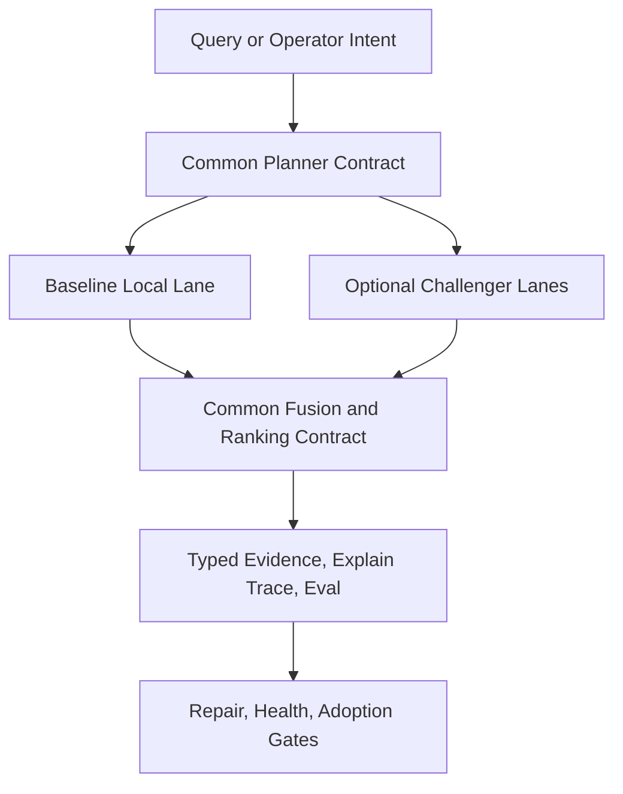

# Fulcrum RAG 10/10 Dual-Rail Requirements

## Problem Frame

Fulcrum now has broad RAG surface coverage: repair, health, unified search, code search, graph evidence, evals, traces, and optional runtime experiments. The remaining gap is not missing surface area. The gap is that retrieval quality, operational semantics, repair authority, and maintainability are uneven across those surfaces.

The current system is stronger as a RAG control plane than as a 10/10 retrieval engine. In particular:
- `search_code` is materially stronger than `search_context`.
- retrieval and telemetry are coupled on the main search path.
- repair planning is useful but not yet authoritative orchestration.
- several core RAG modules are too large to be a stable long-term base.

The target state is:
- default local-first Fulcrum is an honest high-confidence baseline, not a demo path.
- optional Python ML and Rust search/index lanes can raise the ceiling to true 10/10.
- agents and human operators use one coherent contract for search, explainability, repair, eval, and adoption.

## Requirements

**Common Retrieval Contract**
- R1. Fulcrum must expose one agent-preferred retrieval contract that plans across memory, file, code, task, decision, and graph evidence without requiring callers to know which lower-level surface to use.
- R2. The common retrieval contract must support both the default local lane and optional challenger lanes behind the same result, provenance, explanation, and evaluation shape.
- R3. The default retrieval path must be read-only by default. Trace persistence, result persistence, and context-pack persistence must be explicit opt-in behaviors or a separate asynchronous observability path.
- R4. Unified retrieval must perform genuine multi-stage hybrid retrieval when signals are available: lexical, semantic, metadata/freshness, and graph. A stage may degrade or skip, but the planner must report that truth clearly.
- R5. Unified retrieval must preserve focused compatibility tools such as `recall_knowledge` and `search_code`, while making the common planner the default route for general context gathering.

**Baseline and Challenger Lanes**
- R6. The local-first baseline lane must remain fully usable without optional sidecars or hosted services and must be strong enough to serve as the default operator and agent path.
- R7. Optional Python ML and Rust search/index lanes must remain disabled by default and must never weaken baseline availability, safety, or correctness.
- R8. Optional challenger lanes must compete under the same planner contract rather than introducing separate user-visible retrieval products or incompatible result formats.
- R9. A challenger lane may become authoritative for a stage or class of queries only after it passes the same quality, latency, rollback, local-first, agent/tool parity, and operational risk gates used elsewhere in the roadmap.

**Repair, Health, and Authority**
- R10. RAG repair must become a dependency-aware orchestration surface rather than only a health-summary-to-command translator.
- R11. Repair planning must be able to distinguish targeted repair from clean-slate rebuild for derived state domains and must explain why either path is required.
- R12. Repair outputs must provide executable, machine-readable plans for operators and agents, including sequencing, expected scope, blocking conditions, and verification expectations.
- R13. A rebuild or repair run must not be considered successful until post-run health and live evaluation gates show the relevant domains are no longer degraded.

**Explainability, Evaluation, and Adoption**
- R14. Search explanations must remain first-class across all lanes, including stage counts, stage scores, skipped/degraded reasons, freshness, provenance, graph contribution, and runtime truth.
- R15. Fulcrum must use one evaluation contract across baseline and challenger lanes so that retrieval improvements are judged on the same live and fixture evidence.
- R16. The default local lane must be capable of reaching a credible high-confidence target on live corpora before optional lanes are treated as necessary for everyday usage.
- R17. Optional lanes exist to raise the ceiling from strong default behavior to 10/10, not to mask weakness in the baseline or bypass live quality gates.

**Agent and Operator Experience**
- R18. Every important RAG operation needed by agents and operators must remain available through both CLI and MCP/action surfaces with stable machine-readable responses.
- R19. Read paths and mutating operator paths must be clearly separated so agents and humans can inspect state without accidentally mutating it.
- R20. Operator workflows must be able to answer four questions quickly: what is degraded, what exact repair is proposed, what ran, and why a lane is or is not trusted.

**Maintainability and Evolution**
- R21. The next RAG iteration must decompose oversized retrieval, health, eval, and repair modules into bounded stage- or concern-oriented units so that future changes can be reviewed and tested in isolation.
- R22. Maintainability work required to support long-term RAG quality is in scope for this effort, not an optional cleanup item.
- R23. The common planner contract must make it possible to add or remove retrieval stages and optional lanes without rewriting user-facing semantics, trace contracts, or evaluation logic.

## Success Criteria

- The default local lane is credible as the everyday path for both autonomous agents and human operators and no longer depends on optional lanes to avoid obvious quality failures.
- The common retrieval planner returns typed cross-domain evidence with real hybrid behavior, not only lexical heuristics plus observability.
- Search can run as a read path by default while still supporting explainable traces and persisted evidence when explicitly requested.
- Repair planning can produce authoritative, dependency-ordered plans and can distinguish targeted repair from clean-slate rebuild of derived state.
- Live evaluation and health gates are the acceptance bar for both baseline and challenger lanes.
- Optional Python ML and Rust lanes improve ceiling and throughput without fragmenting user workflows or introducing separate operator mental models.
- Core RAG modules are broken into smaller units with clearer ownership boundaries, reducing review risk and future regression probability.

## Scope Boundaries

- Not a rewrite of the full Fulcrum control plane in another language.
- Not a hosted-first or cloud-required RAG design.
- Not a removal of the focused compatibility tools already shipped.
- Not a permission to treat optional lanes as production defaults before gates pass.
- Not a broad product expansion beyond RAG quality, repair authority, explainability, and maintainability.

## Key Decisions

- Dual-rail model: Fulcrum should have one common planner contract with a strong local baseline lane and optional challenger lanes, rather than separate retrieval products.
- Baseline honesty first: the local path must become genuinely strong enough for daily use even while optional lanes are developed in parallel.
- Challenger lanes are experiments until proven: optional Python ML and Rust paths are allowed because they raise the ceiling, but they must earn trust under the same gates.
- Read/write split is a product requirement: search-by-default should not mutate state merely because observability exists.
- Maintainability is part of product quality here: module decomposition is required because oversized RAG files directly threaten correctness and operator trust.
- Equal priority for agents and operators: no design tradeoff may optimize one while degrading the other.

## Dependencies / Assumptions

- Existing roadmap context in `specs/001-rag-lifecycle-hardening/` and `specs/002-rag-roadmap-delivery/` remains the base contract to evolve rather than replace.
- Existing audit context in `docs/audit/2026-04-23-fulcrum-rag-10-roadmap-research.md` remains a valid input for planning sequence and ROI prioritization.
- Optional challenger lanes are acceptable only if baseline behavior remains local-first and disabled-by-default rules continue to hold.

## Outstanding Questions

### Resolve Before Planning

None.

### Deferred to Planning

- [Affects R4, R15][Technical] Define the exact retrieval-stage decomposition and the shared planner interfaces that replace the current large modules.
- [Affects R6, R16][Needs research] Set the quantitative threshold for a "credible high-confidence" baseline across live-rag, code-rag, and unified-context suites.
- [Affects R7, R8, R9][Technical] Decide the first concrete challenger-stage split between Python ML responsibilities and Rust search/index responsibilities.
- [Affects R10, R11, R12][Technical] Define the repair planner state model for targeted repair, clean-slate rebuild, and post-run verification.
- [Affects R21, R22][Technical] Choose the minimum safe decomposition plan for `search-context.ts`, `search-code.ts`, `rag-health.ts`, and `eval/roadmap.ts`.

## Next Steps

-> /ce:plan for structured implementation planning
