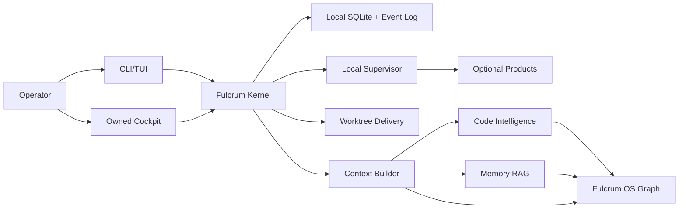

# Local-First Agent OS Full Product Delivery Requirements

## Problem Frame

Fulcrum must become a usable local-first CLI agent operating system, not a collection of architecture spikes. A user should install it on a normal developer machine, initialize projects, create and delegate tasks, watch agents work, inspect context and artifacts, index code, import markdown memory, recover state, and uninstall cleanly.

The product must use strong open-source projects where they cover whole capability areas, but Fulcrum must own canonical local state, task/run lifecycle, policy, graph refs, live events, and operator UX. External products are managed capabilities, not the product identity.

## Requirements

**Install And Local Runtime**

- R1. A user must be able to install Fulcrum with one documented command or downloadable release artifact on a normal Linux/macOS developer machine.
- R2. `fulcrum init` must create local config, data directories, a default workspace, local database, event store, and sidecar registry without requiring cloud services.
- R3. `fulcrum up`, `fulcrum down`, `fulcrum status`, and `fulcrum doctor` must manage and inspect the daemon and enabled local capabilities.
- R4. Fulcrum must degrade cleanly when optional products are missing; the `core` profile must boot without Plane, Windmill, LightRAG, Zoekt, or LanceDB.
- R5. Fulcrum must provide clean backup, restore, export, import, rebuild-index, reset, and uninstall flows.

**Core OS And Persistence**

- R6. Fulcrum must own canonical IDs and durable records for workspace, project, task, run, action, artifact, event, policy decision, graph ref, adapter ref, and index state.
- R7. State must be local, inspectable, recoverable, and migration-managed.
- R8. Event logs must be replayable enough to recover run history and diagnose state changes.
- R9. Policy decisions must be visible to the operator and attached to actions/runs they affected.

**Daily Operator Workflow**

- R10. The product must support a complete first-run workflow: create project, create task, start supervised run, stream progress, capture artifact, complete/block run, and update task state.
- R11. CLI and TUI command surfaces must cover daily work: task board, run list, live run view, context pack, memory import, code index, worktree state, review queue, health, backup, and repair.
- R12. The cockpit must show global and per-project tasks, active runs, blockers, dependencies, handoffs, artifacts, review/merge queues, policy decisions, sidecar health, and live events.
- R13. The cockpit must be owned by Fulcrum first; Plane can become an optional PM adapter only after passing certification gates.

**Agent Run And Worktree Delivery**

- R14. Fulcrum must own agent run lifecycle, task claiming, heartbeats, cancellation, completion, failure/blocking, artifacts, and event streaming.
- R15. Worktrees must be first-class: allocate, attach to task/run, detect dirty state, collect artifacts, review, merge, resolve conflicts, and cleanup.
- R16. The product must support at least one local supervised runner adapter before integrating specific CLI-agent plugins. The runner may be a generic subprocess/stub profile in early alpha.
- R17. External sync with GitHub/Jira/Linear/Plane must remain optional import/export work, not the core workflow.

**Context, Code Intelligence, Memory**

- R18. Fulcrum must build explainable context packs from task state, project docs, markdown memories, exact code hits, symbols/imports, semantic chunks, graph links, and provenance.
- R19. Code intelligence must use a layered approach: Tree-sitter for AST/symbol/import/chunks, Zoekt for lexical/path/regex search, LanceDB for local semantic/hybrid retrieval.
- R20. Code index updates must happen incrementally on file create/update/delete/rename; correctness must not depend on full rebuild.
- R21. Memory must support markdown docs and L0 memory docs first, with source IDs, provenance, update/delete, and graph-enhanced retrieval.
- R22. LightRAG is the first memory graph RAG candidate; RAG-Anything is deferred until PDF/Office/multimodal documents become in-scope.
- R23. Fulcrum OS graph must link memory, code, task, run, action, artifact, policy, and adapter refs while keeping LightRAG retrieval graph separate.

**Product Integrations And Capability Profiles**

- R24. Fulcrum must define capability profiles: `core`, `code`, `memory`, `actions`, and `full`.
- R25. External products must pass certification gates before promotion into a profile: install, health, offline boot, footprint, ID mapping, CRUD, update/delete semantics, provenance, backup/restore, and user workflow.
- R26. Windmill may own human-triggered workflows/actions only; Fulcrum must own agent lifecycle and live run state.
- R27. Plane may own PM surface features only after Fulcrum cockpit is usable and Plane local footprint/customization is acceptable.
- R28. Product adapters must never be the only source of Fulcrum canonical state.

**Security, Privacy, And Local Safety**

- R29. Default operation must not send project files, memories, or events to remote services.
- R30. Any remote model/provider/export/sync must require explicit opt-in and visible configuration.
- R31. Secrets must not be indexed or sent to memory/code retrieval by default; the product must have ignore rules and a secret-scan gate.
- R32. Local HTTP/Tauri endpoints must bind locally by default and require an explicit trust model before remote access.
- R33. Logs and artifacts must be redaction-aware and easy to purge.

**Release Quality**

- R34. Every milestone must define user-visible acceptance tests, not only unit tests.
- R35. Fulcrum must ship with smoke tests for install, init, daemon start/stop, first run, cockpit, code index, memory import, backup/restore, and uninstall.
- R36. Documentation must explain profiles, dependencies, local data locations, cleanup, troubleshooting, and privacy model.
- R37. A build is not "ready for user install" unless it passes a clean-machine validation script.

## Success Criteria

- A user can install Fulcrum, initialize a project, create a task, run a supervised local agent/action, see live events, and inspect artifacts within 10 minutes.
- State survives restart and can be backed up/restored.
- A repo can be indexed incrementally and queried through an explainable context pack.
- A markdown memory folder can be imported, updated, deleted, and recalled with provenance.
- Cockpit and CLI agree on task/run/health state.
- Optional integrations can be enabled/disabled without breaking core.
- A clean uninstall removes Fulcrum-managed processes, state, indexes, and sidecars unless the user chooses to preserve backups.

## Scope Boundaries

- No default cloud dependency.
- No enterprise/team deployment as the first target.
- No CLI-agent-specific marketplace/plugin work in the first product delivery plan.
- No PDF/Office/multimodal document pipeline in early or mid stages; markdown/code first.
- No Plane-first or Windmill-first product identity.
- No generic RAG replacement for code intelligence.

## Key Decisions

- Ship Fulcrum-owned cockpit before committing to Plane as primary PM UI: keeps product identity and local-first path.
- Use capability profiles: avoids all-or-nothing sidecar failure.
- Rust remains primary kernel/daemon/CLI language; TypeScript owns cockpit UI; Python remains sidecar-only for LightRAG.
- Treat context builder and worktree delivery as core product workflows, not later add-ons.
- Make product validation executable through `fulcrum validate`, `fulcrum doctor`, and clean-machine checks.

## Dependencies / Assumptions

- User machine has Git and a supported OS.
- Optional profiles may install or manage additional runtimes such as Python/uv, Go/Zoekt, or local embedding/model providers.
- The first shippable alpha can use a supervised subprocess/stub runner before specific CLI-agent integrations.
- External product licenses and footprints must be reviewed before bundling defaults.

## Outstanding Questions

### Resolve Before Planning

- None. Product decisions above are explicit enough to plan full delivery. Technical unknowns below are planning-owned and are resolved as explicit planning assumptions/gates, not blockers to writing the plan.

### Deferred to Planning

- [Affects R7][Technical] Exact local database crate and migration mechanism.
- [Affects R19][Needs research] Exact LanceDB Rust/TypeScript integration maturity and fallback.
- [Affects R21][Needs research] LightRAG local update/delete/provenance API shape.
- [Affects R25][Needs research] Plane and Windmill local footprint gates and profile placement.
- [Affects R31][Technical] Secret scanning and ignore-rule engine.

## System Relationship

## Next Steps

-> `ce:plan` for structured full product delivery planning.
