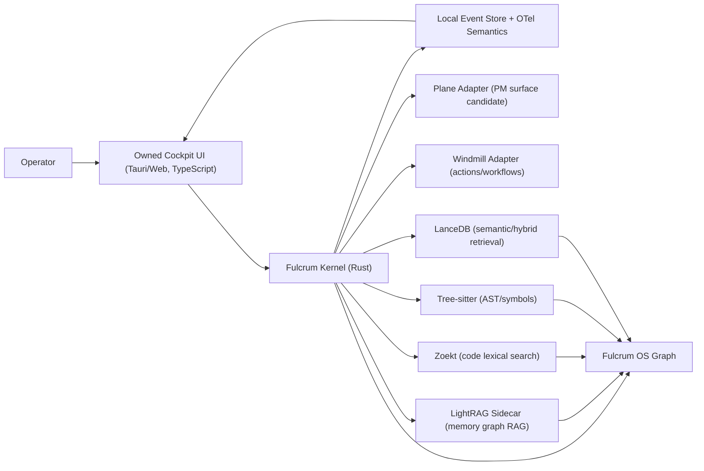

# Local-First CLI Agent OS Requirements

## Problem Frame

Fulcrum is being reframed from an implementation-heavy TypeScript monorepo into a new local-first CLI agent operating system. The goal is to keep the product's owned operating model while using mature open-source products for large capability areas.

The target user is an individual developer/operator on a normal workstation. The product must manage projects, tasks, agent runs, live actions, memory, code intelligence, retrieval, worktrees, reporting, and action orchestration without depending on cloud services or team-server infrastructure.

## Requirements

**Local OS Kernel**

- R1. Fulcrum must own canonical local identity for workspaces, projects, tasks, agent runs, artifacts, events, policies, context refs, and graph refs.
- R2. External products must be integrated through adapters and must not become the only source of truth for Fulcrum's operating model.
- R3. The default installation must run on a normal developer machine and must not require Kubernetes, remote databases, or cloud services.
- R4. State must be recoverable and inspectable from local files/databases.

**Owned PM And Orchestration**

- R5. Fulcrum must provide a global and per-project PM cockpit for tasks, agent queues, run state, blockers, dependencies, review queues, merge queues, handoffs, and artifacts.
- R6. Plane may be validated as the PM cockpit product, but Fulcrum must preserve an owned task/run model even if Plane is adopted.
- R7. External Jira/Linear/GitHub/Plane sync must be optional import/export work, not core workflow.
- R8. Windmill may own user-triggered actions, workflows, scripts, forms, webhooks, and logs, but Fulcrum must own agent run lifecycle, heartbeats, task claiming, and live event stream.

**Memory And Code Intelligence**

- R9. Memory must support markdown docs, L0 memory docs, provenance, incremental ingest/update/delete, and graph-enhanced retrieval.
- R10. LightRAG is the first memory graph RAG candidate, but it must pass local/offline, provenance, update/delete, and linkability gates.
- R11. Code search must be its own subsystem, not a generic RAG prompt over source files.
- R12. Code intelligence must combine lexical/path search, AST/symbol structure, semantic/hybrid retrieval, and result fusion.
- R13. Zoekt, Tree-sitter, and LanceDB are the first code intelligence candidate set.
- R14. The memory-code-PM graph must link memory refs, code files/symbols/chunks, plans, tasks, runs, artifacts, and policy/action events.
- R15. Graph updates must happen on change; correctness must not depend on full rebuilds.

**Observability And Operator Feedback**

- R16. Fulcrum must show live agent actions and system events while work is running.
- R17. OpenTelemetry semantic conventions should guide event/trace naming, but local event storage is mandatory and exporter backends are optional.
- R18. Health reporting must cover PM adapter, action runner, RAG engine, code indexes, graph links, local DBs, and sidecars.

**Language And Runtime**

- R19. Rust should be the primary implementation language for the local daemon, CLI, Tauri shell, file watching, indexing orchestration, adapter supervisor, and local persistence.
- R20. TypeScript should be used for UI and extension-facing code; Python should be isolated to RAG sidecars where required by LightRAG or similar products.
- R21. The system must avoid a single-language purity rule when a product dependency already owns a runtime. The boundary must be explicit and supervised.

## Success Criteria

- A new contributor can explain which product owns each capability and where Fulcrum remains canonical.
- The default design has one winner per capability type, with documented fallbacks.
- The system design links PM, actions, memory, code intelligence, graph, telemetry, and language choices into one coherent architecture.
- Every selected product has a validation gate before it becomes default.
- The plan can be implemented incrementally without recreating the old custom RAG/search stack first.

## Scope Boundaries

- No CLI-agent-specific integrations, plugins, or marketplace packaging in this phase.
- No cloud-only RAG, vector, workflow, or PM dependency as default.
- No enterprise/team-server-first deployment target.
- No duplicate vector stores unless an explicit validation gate proves non-overlap.
- No requirement to parse PDFs/Office docs in early or mid stages; markdown and code are primary.

## Key Decisions

- Fulcrum owns the OS kernel: prevents Plane/Windmill/LightRAG from defining product identity.
- Rust is primary: best fit for local-first daemon, CLI, Tauri, file watching, embedded state, and distribution.
- TypeScript stays in UI/adapters: best fit for cockpit UI and product integration speed.
- Python is sidecar-only: accepts LightRAG ecosystem without making Python the app core.
- Plane is candidate cockpit, not guaranteed default: validate weight and customizability first.
- Windmill is action/workflow product, not agent run kernel: avoids heartbeat/task lifecycle latency and model mismatch.
- LightRAG retrieval graph is distinct from Fulcrum OS graph: reduces conceptual duplication.
- Zoekt + Tree-sitter + LanceDB is code intelligence default candidate: each owns a different search layer.

## Dependencies / Assumptions

- Plane, Windmill, LightRAG, Zoekt, Tree-sitter, LanceDB, and OpenTelemetry remain actively maintained enough for validation.
- A local-first profile can run with sidecars started/stopped by Fulcrum, not manually managed by the user.
- Tauri is acceptable for desktop shell if a rich web cockpit is needed locally.

## Outstanding Questions

### Resolve Before Planning

- None. Continue with explicit validation gates.

### Deferred to Planning

- [Affects R6][Needs research] Plane local footprint and API/UI customization depth.
- [Affects R8][Needs research] Windmill minimum viable local deployment and whether embedded mode is possible.
- [Affects R10][Needs research] LightRAG delete/rename/provenance behavior in a live repository.
- [Affects R13][Needs research] LanceDB TypeScript/Rust maturity for local hybrid retrieval.
- [Affects R19][Technical] Exact Rust/TypeScript/Python process boundary and IPC protocol.

## System Relationship

## Next Steps

-> `ce:plan` for structured implementation planning.
