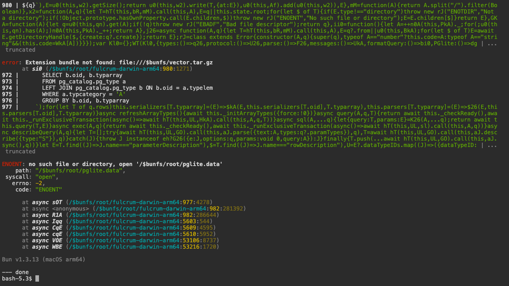

# CLI user manual (`fulcrum`)

The Fulcrum CLI is one Bun-compiled binary. Every subcommand accepts
`--help` (root help printed when no command-specific entry exists), and
every subcommand emits a canonical `fulcrum.cli.v1` envelope under
`--json` for machine consumers.

## Getting started

```bash
# install (per project)
fulcrum init                           # creates AGENTS.md, .claude/CLAUDE.md, .gitignore
fulcrum install --profile minimal      # splices rules + hooks + skills into each detected agent
fulcrum doctor                         # confirms everything is wired
```

## Top-level help

```bash
fulcrum --help        # root help (also: fulcrum, fulcrum help)
fulcrum --version     # 0.1.0
```


## doctor — system health

```bash
fulcrum doctor                        # human-readable envelope
fulcrum doctor --json                 # canonical fulcrum.cli.v1 envelope; pipe to jq
fulcrum doctor --checks               # detailed per-check breakdown
fulcrum doctor --subsystem <name>     # gate one subsystem (mcp / runs / skills / agents)
fulcrum doctor --probe                # active probes (network, ports, MCP handshakes)
```

  

Use the JSON form in CI; pipe into `jq '.result.checks[] | select(.status!="ok")'` to surface failures.

## hooks — recipe registration

```bash
fulcrum hooks                          # root help (also fulcrum hooks --help)
fulcrum hooks list                     # show every recipe + which agents have it
fulcrum hooks enable <name>            # register the recipe across detected agents
fulcrum hooks enable --help            # per-subcommand help
fulcrum hook <name> [args...]          # run one recipe; reads JSON envelope on stdin
```

Recipes: `format`, `lint-gate`, `pm-policy`, `test-on-edit`, `audit-log`, `index-check`, `index-rebuild`, `router`.

  

## skills — authored + upstream

```bash
fulcrum skills --help                  # subcommands
fulcrum skills list                    # authored skills the orchestrator can sync
fulcrum skills list --installed        # what's actually installed in each agent
fulcrum skills sync                    # mirror authored skills to each agent
fulcrum skills sync --help             # flags (codex-global, codex-project)
fulcrum skills upstream [--update-pins]  # mirror curated third-party skills
fulcrum skills upstream --help         # see all flags
fulcrum skills lint <path>             # validate a SKILL.md
```

    

## install — bootstrap the agent layer

`fulcrum install` splices rules, mounts hooks, syncs skills, installs caveman.

```bash
fulcrum install --help                 # all flags + profiles
fulcrum install --profile minimal      # rules + hooks (default)
fulcrum install --profile rules-only   # rules only, no hooks or skills
fulcrum install --profile full         # historical bootstrap (everything)
fulcrum install --with-project <dir>   # also drop rules/AGENTS.md into <dir>
fulcrum install --no-skills            # skip the skills sync step
fulcrum install --enable-all-mcps      # enable every builtin MCP across all agents
fulcrum install --dry-run              # preview without writing
```

Re-running `fulcrum install` is idempotent — the sentinel-block splice only replaces the previously-spliced block.


## init — bootstrap a project

```bash
fulcrum init                           # bootstrap current dir
fulcrum init <dir>                     # bootstrap <dir>
fulcrum init --help                    # see options
```

Writes `AGENTS.md`, `.claude/CLAUDE.md`, and `.gitignore`. Safe to re-run.


## uninstall — remove install artifacts

```bash
fulcrum uninstall --help
fulcrum uninstall --dry-run            # preview what would be removed
fulcrum uninstall --purge              # also remove caveman + upstream packs
fulcrum uninstall --include-caveman    # explicit caveman uninstall
```


## compress — caveman-compress markdown

```bash
fulcrum compress                       # compress default targets in-place
fulcrum compress --check               # CI: fail if anything would change
fulcrum compress <files...>            # compress specific files
fulcrum compress --help                # all flags
```

 

## Driving the CLI in a browser (ttyd)

For demos / docs / remote sessions:

```bash
brew install ttyd
ttyd -W -p 7681 -t titleFixed=fulcrum -t rendererType=dom \
  bash -lc 'fulcrum doctor; exec bash'
open http://localhost:7681/
```

Every screenshot in this manual was taken that way via `playwright-cli` in Microsoft Edge.

## Parity with the web manual

| Concern | CLI | Web |
|---|---|---|
| Health check | `fulcrum doctor` | `/<ws>/projects/<id>/operate/doctor` |
| Skills inventory | `fulcrum skills list --installed` | `/settings/skills` |
| MCP servers | `fulcrum doctor --subsystem mcp` | `/<ws>/projects/<id>/operate/mcp` |
| Recipes | `fulcrum hooks list` | n/a (operator-only) |
| Project bootstrap | `fulcrum init <dir>` | `/projects/new` |
| Install rules | `fulcrum install --profile minimal` | n/a (operator-only) |

## Troubleshooting

- A subcommand prints `unknown subcommand '--help'` — pre-`5f007f31` build. Rebuild: `bun run build && cp dist/fulcrum-darwin-arm64 ~/.local/bin/fulcrum`.
- `fulcrum doctor` red flags on `mcp` — re-run `fulcrum install --enable-all-mcps` or check the failing server's auth config.
- `fulcrum skills sync` writes to the wrong place — check the agent identification with `fulcrum doctor`. Each agent has its own folder (Claude → `~/.claude/plugins/cache/fulcrum/`, Codex → `~/.codex/skills/`, …).
- `fulcrum install` "already installed" — sentinel block already present; rerun is a no-op by design.
