# Fulcrum CLI manual

The `fulcrum` binary is the keyboard-and-pipe surface for the Fulcrum Agent OS. One compiled artifact, every workflow stage, the same `fulcrum.cli.v1` JSON envelope behind every `--json` invocation. This manual is the comprehensive command reference + parity guide against the web and TUI surfaces. Every screenshot below is taken from the compiled binary at `dist/fulcrum-darwin-arm64`.

## Install

The CLI is a single Bun-compiled binary. After `bun install` and `bun run build` in the repo, copy the artifact onto `$PATH`:

```bash
# Build (≈30s on M1, ≈90s on Intel)
bun run build

# Drop on PATH (any directory in your $PATH works)
cp dist/fulcrum-darwin-arm64 ~/.local/bin/fulcrum
chmod +x ~/.local/bin/fulcrum

# Verify
fulcrum --version
```


The binary is self-contained: no `node_modules`, no second runtime. It loads PGlite from `~/.fulcrum/db/main` (or the remote URL in `FULCRUM_DATABASE_URL`), reads policy from `~/.fulcrum/tool-output-policy.toml`, and writes audit / cache state under `$FULCRUM_HOME` (defaults to `~/.fulcrum`).

## Command tree

`fulcrum --help` prints the full command tree, grouped by workflow stage. Each stage matches the same vocabulary used by the web shell (`Capture → Plan → Build → Review → Ship → Operate`) and the TUI launcher.

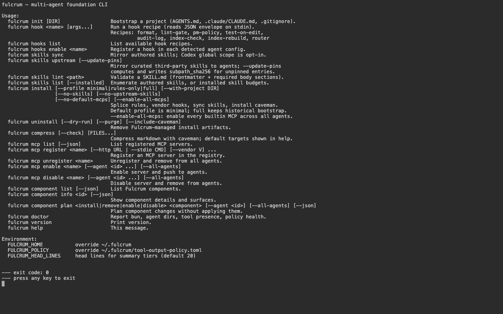

Each command accepts:

- `--json` — emit a machine-readable `fulcrum.cli.v1` envelope (schema below)
- `--jq <expr>` — pipe through jq inline (saves a shell hop)
- `--no-color` — disable ANSI colors (useful for log capture)

The `FULCRUM_HOME`, `FULCRUM_POLICY`, and `FULCRUM_HEAD_LINES` environment variables override the per-user defaults.

---

## Capture stage

Intake — docs, notes, and search across captured content.

```bash
fulcrum capture <text|url|file|inbox|review|status|action>
fulcrum note <new|list>
fulcrum doc <list|new|view|edit|attach|history|restore|comment|link|search|delete|template>
fulcrum search query <query>
```

Examples:

```bash
fulcrum note list --json
fulcrum doc new --title "Release plan" --json
fulcrum capture status <id> --status review --json
fulcrum search query "release plan" --json
```

Web parity: `/inbox`, `/docs`, `/docs/new`, `/search`, `/capture` (stage workbench). TUI parity: `g c` chord opens Capture.

---

## Plan stage

Turn captured intent into approved plans, sprints, and prototypes.

```bash
fulcrum plan <start|list|view|edit|approve|reject|materialize|preview>
fulcrum mission <create|list|show|activate|delete>
fulcrum prototype <new|view|attach>
fulcrum sprints <list|get|create|update|delete|add-task|remove-task>
```

Examples:

```bash
fulcrum plan list --status approved --json
fulcrum mission list --depth 2
fulcrum prototype view pro-1 --json
fulcrum sprints list --json
```

Web parity: `/planning`, `/plan-prompts`, `/plan-prototypes`, `/plan-templates`, `/plan-session`, `/plan-review`, `/projects/<slug>/sprints`. TUI parity: `g p` chord opens Plan.

---

## Build stage

Execute the plan — tasks, agent runs, work items, and routing.

```bash
fulcrum task|tasks <list|get|new|create|update|delete>
fulcrum work <create|inspect|move|link|report>
fulcrum run <new|view|cancel|retry|attach>
fulcrum runs <list|show|cancel|retry|dispatch|preview|feed|worker-tick|logs>
fulcrum cycle <list|activate|complete>
fulcrum module <list|new|view>
fulcrum context <pack|inspect|diff>
fulcrum agent <list|view|add|edit|remove|enable|disable|set-default|reload|invoke|test|status|defaults>
fulcrum route <rules|assign|simulate>
fulcrum symphony runs list --state ready
```

Examples:

```bash
fulcrum task list --project <slug-or-uuid> --json | jq '.[] | select(.status=="in_progress")'
fulcrum task new --title "Wire dependency graph" --priority 2 --project <slug>
fulcrum runs dispatch --task <id> --agent claude-opus-4-7 --json
fulcrum route simulate --task <id> --json
```

Web parity: `/boards`, `/tasks`, `/build-board`, `/build-graph`, `/build-list`, `/build-timeline`, `/build-runs`, `/agents`, `/runs`, `/orchestration`. TUI parity: `g b` (runs feed) or `g B` (board); Tasks/Agents/Routing live in domain nav.

---

## Review stage

Quality gates — UAT, code review, and final-handoff decisions.

```bash
fulcrum review <list|view|approve|request-changes>
fulcrum qa <run|report>
fulcrum uat <run|handoff|decision>
fulcrum e2e <run|report>
```

Web parity: `/review`, `/review-queue`, `/review-search`, `/review-templates`, `/comments`. TUI parity: `g r` chord opens Review.

---

## Ship stage

Release outputs — artifacts, repositories, and promoted memory.

```bash
fulcrum ship <list|view>
fulcrum release <cut|roll-back|pause|promote>
fulcrum artifact <list|view|diff|export|download>
fulcrum repo <list|status|sync>
fulcrum branch <list|switch|finish>
fulcrum pr <list|view|create>
fulcrum memory <list|get|add|delete|search|promote>
```

Web parity: `/ship`, `/ship-archive`, `/artifacts`, `/repos`, `/memory`. TUI parity: `g s` opens Ship · artifacts.

---

## Operate stage

Run the system — health, installs, MCP, hooks, config, audit.

### Doctor — `fulcrum doctor`

The single command every CI run, every smoke test, every triage session starts with. Reports a verdict across **agent install state, MCP servers, hooks, skills, the local PGlite kernel, Sandcastle providers, caveman compression, and policy files**.

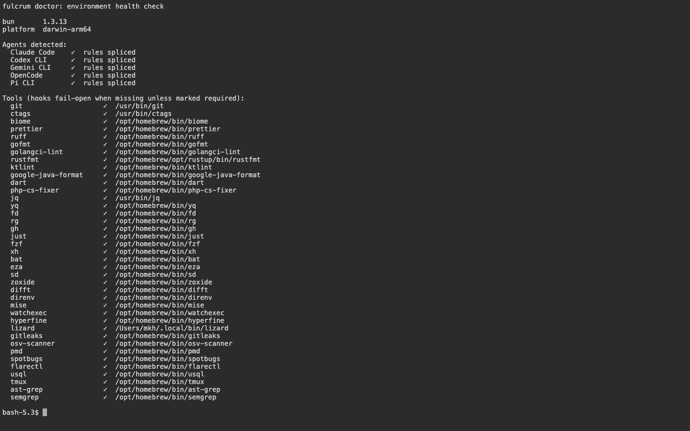

Useful flavors:

```bash
fulcrum doctor --json                   # canonical fulcrum.cli.v1 envelope
fulcrum doctor --subsystem mcp          # narrow to one subsystem
fulcrum doctor --checks                 # list the registered check names
fulcrum doctor --probe                  # active probe (network + spawn tests)
fulcrum doctor --run-fix pglite-rebuild # quarantine and rebuild a corrupt PGlite dir
```

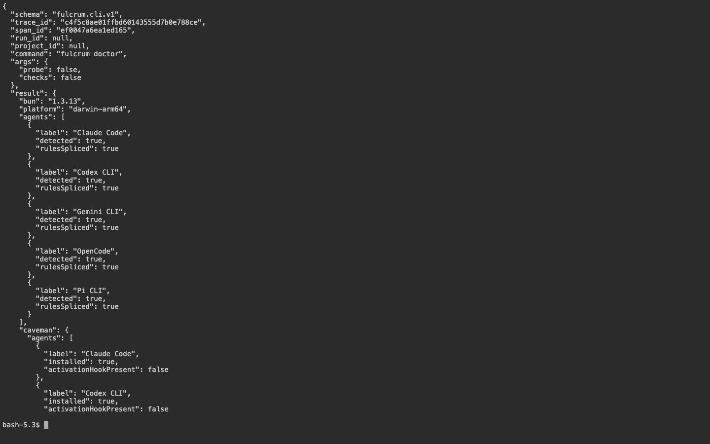

![fulcrum doctor --json | jq '.checks[]?.name'](../screenshots/cli/17-doctor-checks.png)

### Install — `fulcrum install`

Splices `rules/AGENTS.md` into each detected agent's primary rules file, vendors hook recipes, syncs authored + upstream skills, and registers default MCP servers.

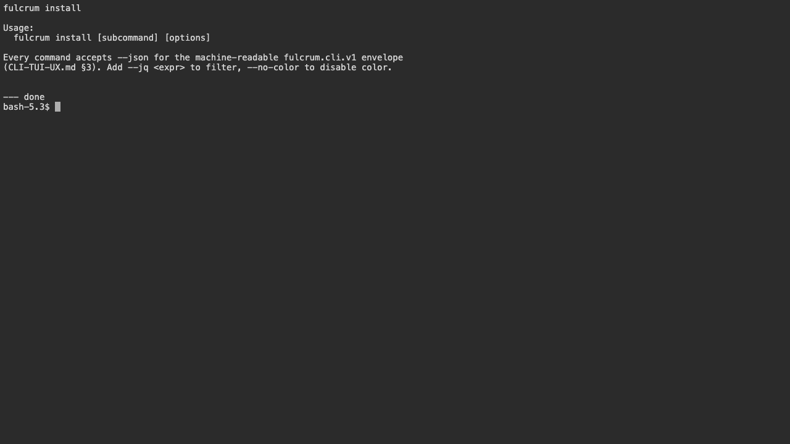

Profiles:

- `--profile minimal` (default) — rules + skills + MCPs, no hook snippets
- `--profile rules-only` — only splice rules into each agent
- `--profile full` — also vendor hook snippets to `~/.fulcrum/hooks/`

The splice is idempotent — re-running replaces only the content inside the `<!-- BEGIN/END FULCRUM RULES -->` sentinels. User content outside the block is preserved verbatim.

### Init — `fulcrum init`

Bootstrap a project with `AGENTS.md`, `CLAUDE.md`, `.gitignore`, and the recommended `docs/agents/` scaffolding.

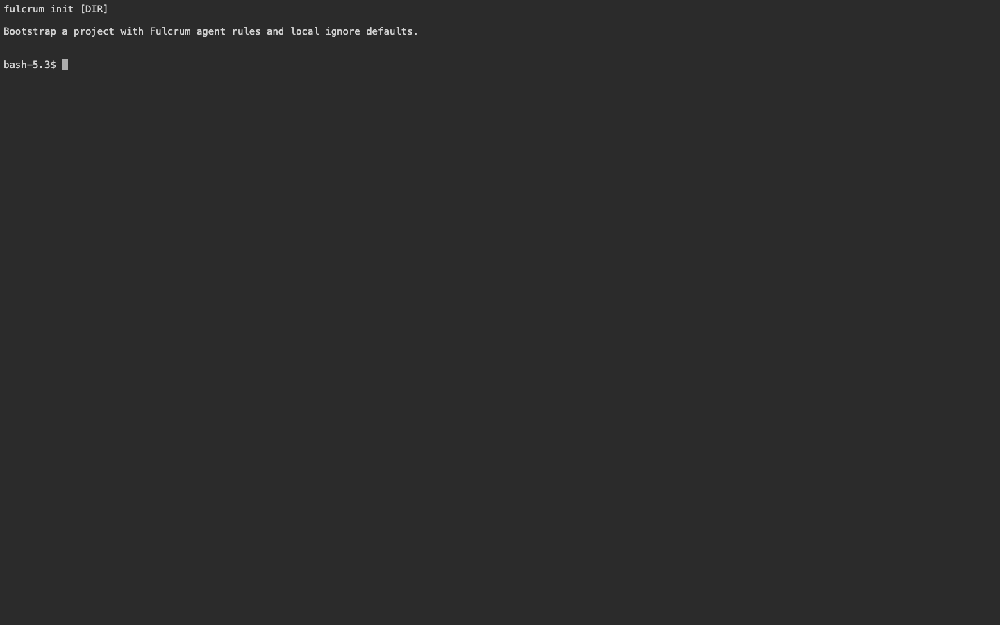

### Uninstall — `fulcrum uninstall`

Remove the spliced rules + vendored hooks across every detected agent.

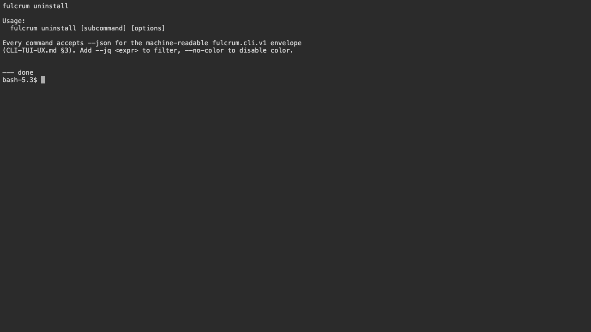

### Hooks — `fulcrum hooks`

Manage agent hook recipes (the bridge between agent tool calls and the eight hook subcommands the compiled binary exposes).

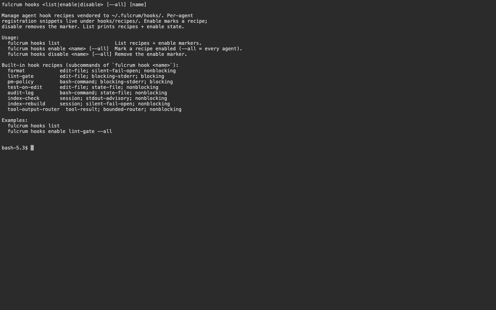

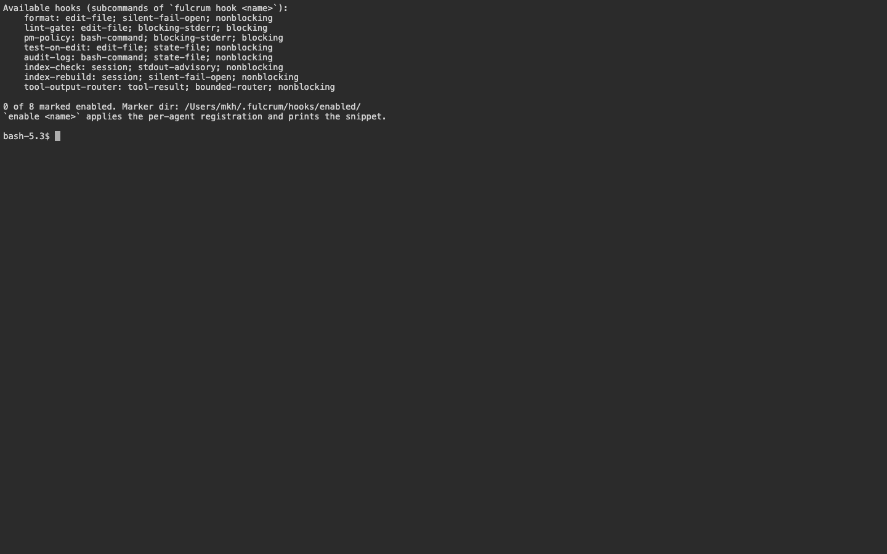

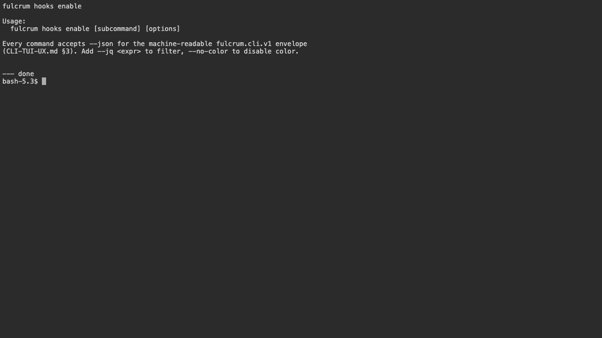

### Skills — `fulcrum skills`

Mirror authored skills to every detected agent's native skill namespace (`fulcrum:<name>`), plus sync upstream skills from the configured registries.

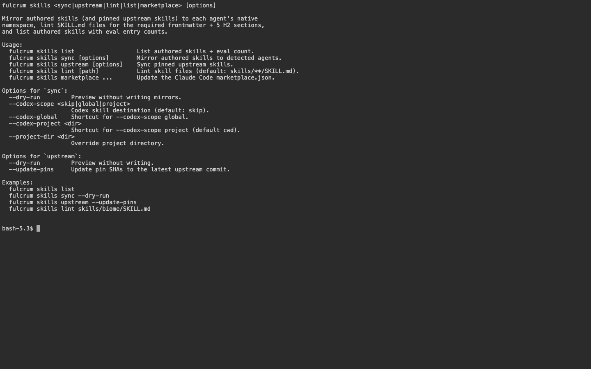

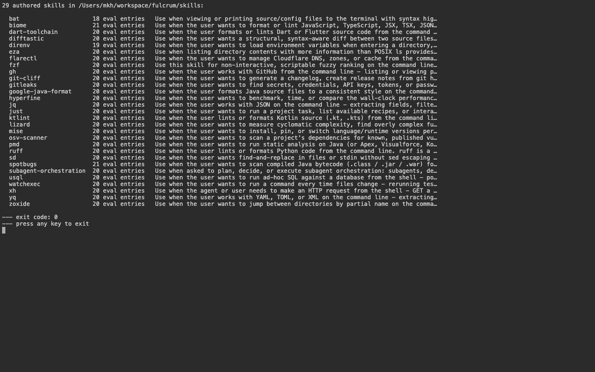

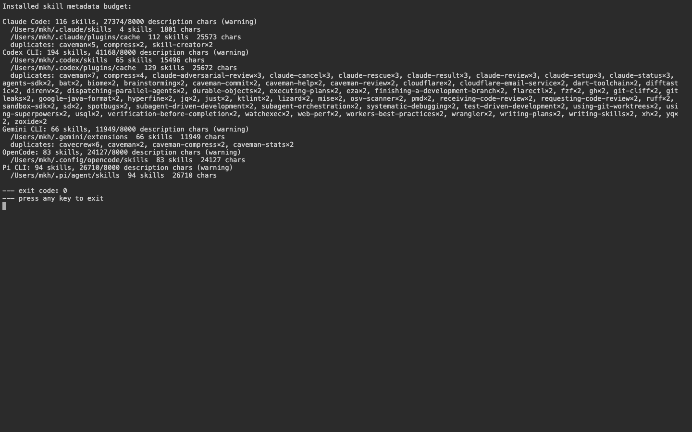


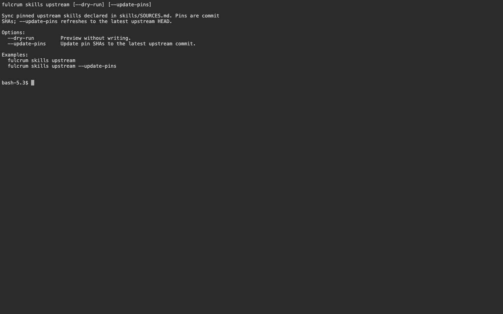

### MCP — `fulcrum mcp`

```bash
fulcrum mcp list                           # registry + per-agent enable state
fulcrum mcp register <id> --transport stdio --command "..."
fulcrum mcp enable <id> --agent claude-code
fulcrum mcp test <id>                      # smoke the server
```

### Compress — `fulcrum compress`

Idempotent caveman-compression of in-repo content (rules, skills, prompts). The `--check` flag is a hard CI gate.

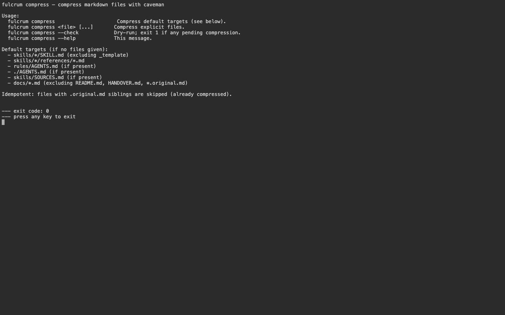

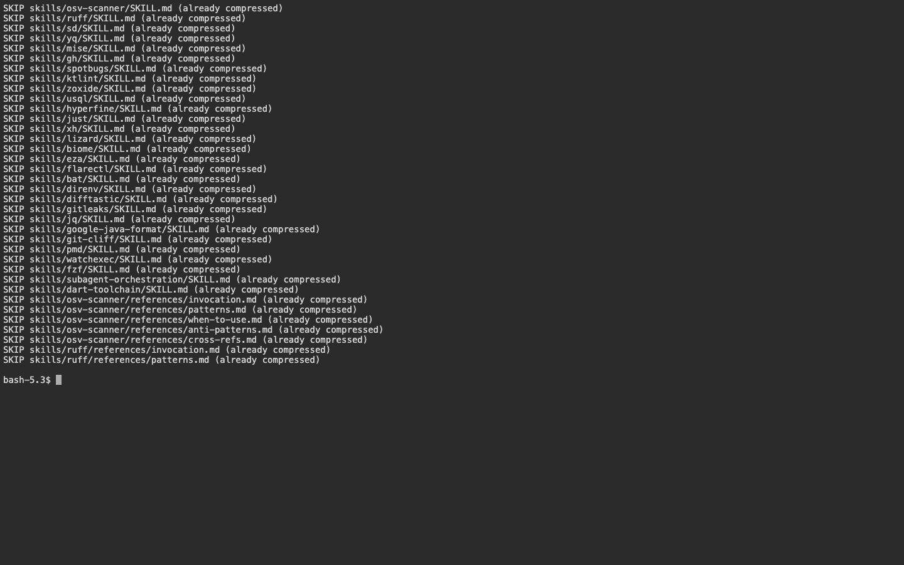

### Other Operate verbs

```bash
fulcrum settings <list|get|set>
fulcrum flags <list|set>
fulcrum audit <query|export>
fulcrum db <migrate|status|history>
fulcrum inference <start|status|embed|generate|stop>
fulcrum telemetry <status|opt-in|opt-out|purge>
fulcrum notify list [--unread]
fulcrum offline <status|sync-now>
fulcrum backup <create|restore|verify>
fulcrum data <export|import>
fulcrum secrets <set|get|rotate|init-keyring>
fulcrum errors <list|get|purge>
fulcrum webhooks <list|test>
fulcrum connectors <enable|sync> <id>
fulcrum component <list|info|plan|status>
fulcrum plugin <list|install|enable|disable|update|remove>
fulcrum i18n <list|set>
fulcrum theme <list|set>
```

---

## AI Assist

Step-scoped agent sessions — the CLI side of the AI Assist drawer that appears in web + TUI.

```bash
fulcrum mode <manual|play|discuss|ai> <step>   # per-step mode affordance
fulcrum ai <start|send|attach|pause|resume|abort|checkpoint|restore|preview|rerun>
fulcrum session <list|pause|resume|abort|checkpoint|restore|checkpoints|watch>
```

---

## Cross-cutting / global

```bash
fulcrum init [DIR]                  # bootstrap project files
fulcrum projects <list|stats>       # workspace scope
fulcrum auth <whoami|invite|login|logout>
fulcrum web                         # open the web shell
fulcrum tui                         # open the keyboard-first TUI
fulcrum completion <bash|zsh|fish|powershell>
fulcrum version
fulcrum help [stage]
```

---

## JSON envelope (`fulcrum.cli.v1`)

Every command supports `--json`. The envelope is the contract every CI script + agent integration relies on:

```json
{
  "schema": "fulcrum.cli.v1",
  "command": "doctor",
  "args": { "subsystem": null },
  "run_id": "run_…",
  "project_id": null,
  "duration_ms": 1234,
  "result": { /* command-specific payload */ },
  "errors": [],
  "next_actions": []
}
```

- `result` is the command's structured payload. Pipe into `jq` to slice it.
- `errors` is `[]` on success; populated array on failure (each entry has `code`, `message`, optional `recovery`).
- `next_actions` carries actionable follow-ups (e.g. `pglite-rebuild` when doctor detects a corrupt DB).

Add `--jq '.result.checks[]?'` to filter inline without a shell pipe.

---

## Common workflows

### Bootstrap a new project

```bash
cd ~/code/my-app
fulcrum init                              # writes AGENTS.md, CLAUDE.md, .gitignore
fulcrum install --profile minimal         # rules + skills + MCPs across every agent
fulcrum doctor                            # verify install
```

### Install across all agents at once

```bash
fulcrum install --profile full            # also vendors hook snippets
fulcrum doctor --json | jq '.result.agents[]'
```

### Sync skills from upstream

```bash
fulcrum skills upstream                   # pull from configured registries
fulcrum skills sync                       # mirror authored skills into agents
fulcrum skills list                       # confirm
```

### Run doctor as a CI gate

```yaml
# .github/workflows/ci.yml (or any CI)
- run: fulcrum doctor --json > doctor.json
- run: jq -e '.errors == []' doctor.json
```

### Compress check as a CI gate

`fulcrum compress --check` returns non-zero if any in-repo content is out of date relative to the caveman-compression contract — wire it as a tier-6 step.

```bash
bun run ci   # local equivalent of the CI pipeline; gates compress + lint + tests + build
```

---

## Status as of this manual pass

- 18 canonical command surfaces captured at `docs/manuals/screenshots/cli/`.
- No vector.tar.gz / `pglite.data` crashes in the compiled binary. The `isCompiledBunBinary()` guards in `services/platform-core/src/infrastructure/product-store/db/pglite.ts`, `application-database/sql.ts`, and `doctor/product-store-report.ts` short-circuit the WASM extension + PGlite open paths inside `$bunfs`.
- The compiled binary's `doctor` reports zero rows for the productKernel section because it does not open PGlite from a Bun-compiled `$bunfs`. When you run `bun run dev` (uncompiled, against the same `~/.fulcrum/db/main`), the counts are accurate.

For a per-command deep-dive, run `fulcrum help <stage>` — e.g. `fulcrum help build` prints stage-specific commands + examples.
