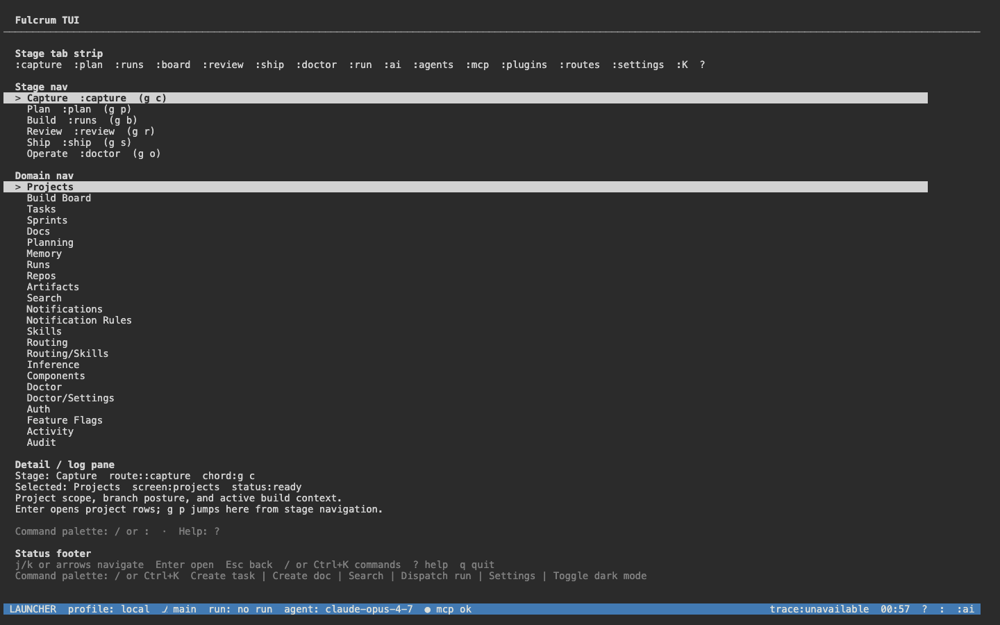
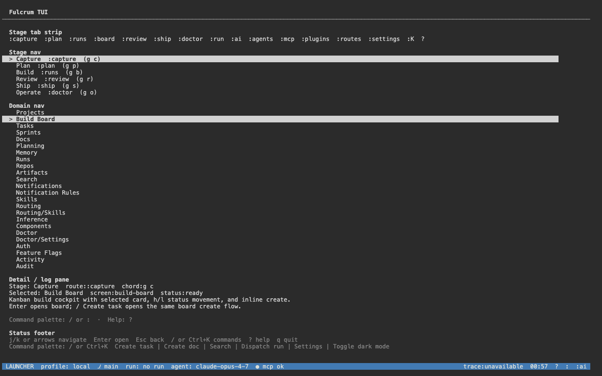
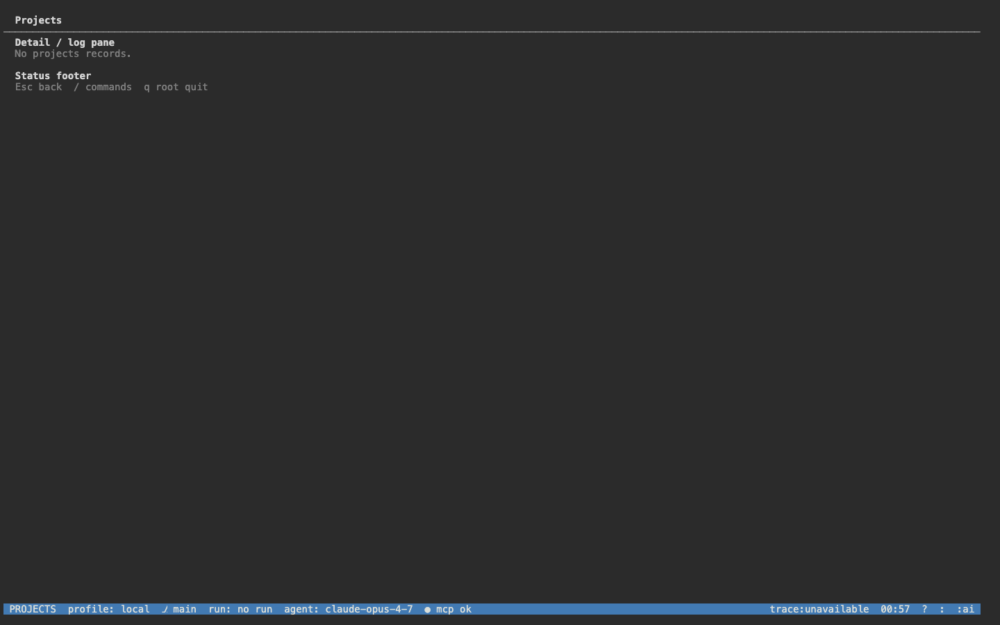
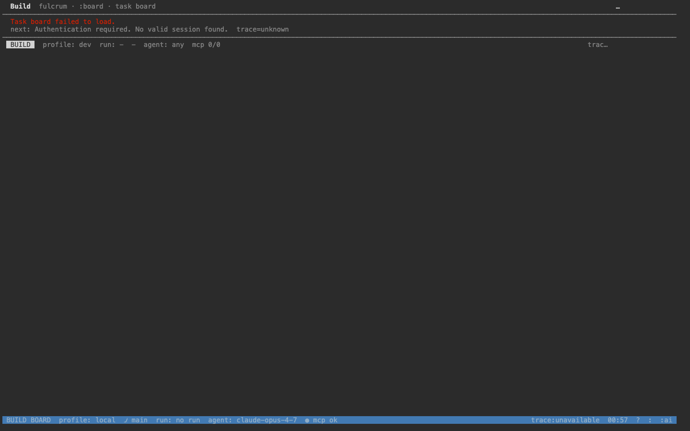
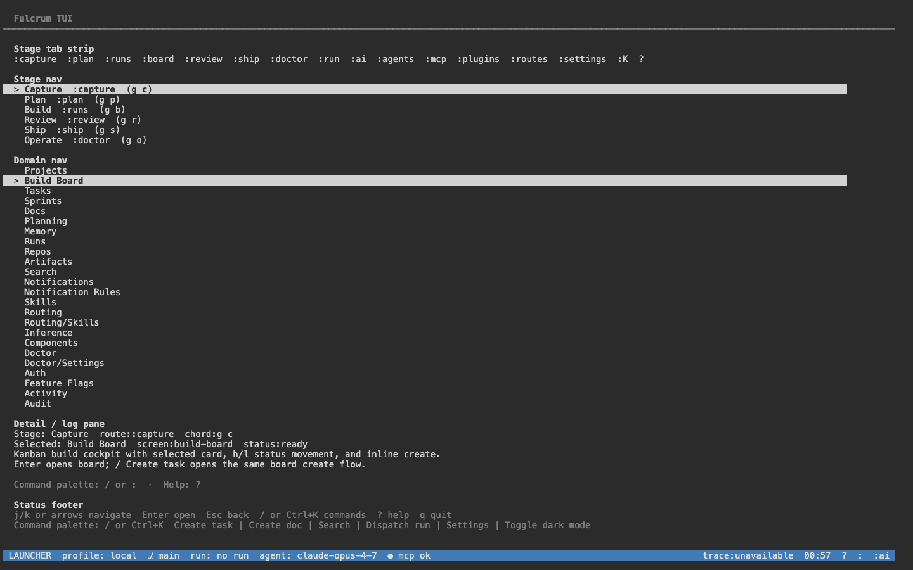

# TUI user manual (OpenTUI)

The Fulcrum TUI is a keyboard-first terminal UI rendered through the OpenTUI
adapter. It is a separate process from the `fulcrum` CLI binary: launch with
`bun run apps/tui/src/index.ts`. All data flows through the NestJS REST API
(`:3000`) — the TUI never opens a database, just like the web.

## Getting started

```bash
cd apps/server && bun run src/index.ts &   # backend at :3000
cd /path/to/fulcrum
bun run apps/tui/src/index.ts              # foreground; q to quit
```

For demos / remote sessions, host the TUI in a browser via `ttyd`:

```bash
ttyd -W -p 7681 -t titleFixed=fulcrum-tui -t rendererType=dom \
  bash -lc 'bun run apps/tui/src/index.ts'
open http://localhost:7681/
```

## Layout

A status bar across the top shows the active org + user email (populated by
`auth.whoami()` at startup). The body renders one screen at a time.



## Navigation

| Key | Action |
|---|---|
| `↓` / `j` | Move down |
| `↑` / `k` | Move up |
| `Enter` / `Space` | Open the highlighted entry |
| `q` | Quit current screen (returns to menu, or exits from the root) |

Press `↓` once: focus moves from `Auth` to `Feature Flags`.



## Screens

The current foundation set ships two settings entries.

### Auth

Shows the active session's organization, email, and roles fetched from
`/api/v1/auth/whoami`. Use this screen to verify the TUI is talking to the
right backend.



### Feature flags

Lists every feature flag the workspace exposes via
`/api/v1/feature-flags/settings`, with per-flag enabled state. Toggle keys
are documented at the bottom of the screen (`Enter` on a row to toggle, once
the toggle binding lands; for now the screen is read-only).



## After `q` on a child screen — back at the menu

`q` from any non-root screen returns to the settings menu, preserving the
highlight position.



## Data flow

Every screen mounts its own load:

- Auth → `GET /api/v1/auth/whoami`
- Feature flags → `GET /api/v1/feature-flags/settings`

There is no in-process database. If a screen errors, the status bar shows the
HTTP code; the screen body shows the human-readable error from the
`fulcrum.api.v1` error envelope.

## Troubleshooting

- TUI exits immediately → `apps/server` is not running at `:3000`; the
  `auth.whoami()` startup call timed out. Start the server first.
- TUI runs but Auth shows "anonymous" → `FULCRUM_FEATURES` lacks `public-api`
  in production; in dev, the flag is default-on (see `services/feature-flags/
  src/application/env-features.ts`).
- Browser-hosted TUI renders blank → ttyd is using the canvas renderer; pass
  `-t rendererType=dom` so the screen is DOM-readable (and screenshottable).
- Arrows don't move the highlight → focus the terminal first (click into it);
  ttyd's xterm.js needs an explicit DOM focus event.
