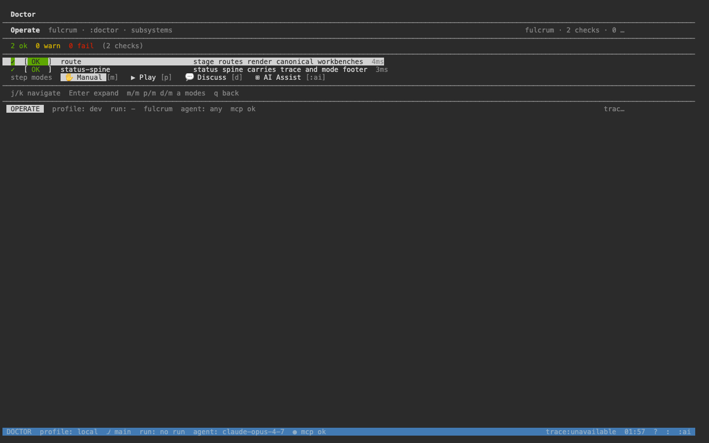
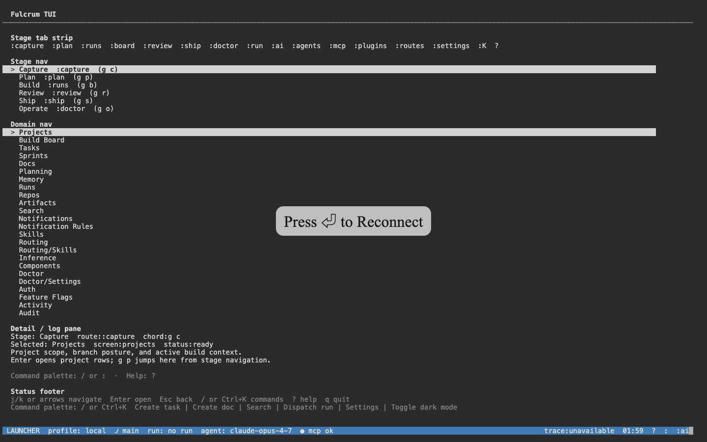
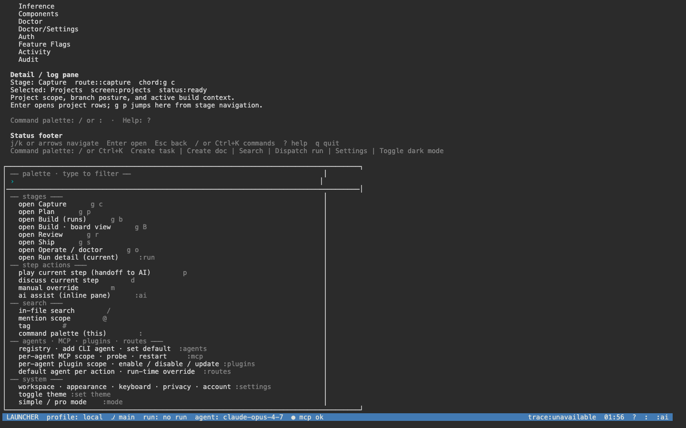

# TUI user manual (OpenTUI)

The Fulcrum TUI is a keyboard-first terminal UI rendered through the
OpenTUI adapter. It is a separate process from the `fulcrum` CLI binary:
launch with `bun run apps/tui/src/index.ts`. All data flows through the
NestJS public API (`:3000`) — the TUI never opens a database (parity
with the web).

## Getting started

```bash
cd apps/server && bun run src/index.ts &   # backend at :3000
cd /path/to/fulcrum
bun run apps/tui/src/index.ts              # foreground; q to quit
```

For demos / remote sessions, host the TUI in a browser via `ttyd`:

```bash
ttyd -W -p 7681 -t titleFixed=fulcrum-tui -t rendererType=dom \
  bash -lc 'bun run apps/tui/src/index.ts'
open http://localhost:7681/
```

## Launcher

A status bar across the top shows the active org + user. The body is the
Launcher — every reachable surface listed under three sections.


The Launcher splits into:

- **Stage tab strip** — `:capture :plan :runs :board :review :ship :doctor :run :ai :agents :mcp :plugins :routes :settings :K ?`
- **Stage nav** — Capture (`g c`), Plan (`g p`), Build (`g b`), Review (`g r`), Ship (`g s`), Operate (`g o`)
- **Domain nav** — Projects, Build Board, Tasks, Sprints, Docs, Planning, Memory, Runs, Repos, Artifacts, Search, Notifications, Notification Rules, Skills, Routing, Routing/Skills, Inference, Components, Doctor, Doctor/Settings, Auth, Feature Flags, Activity, Audit

## Navigation keys

| Key(s) | Action |
|---|---|
| `j` / `↓` | Move down |
| `k` / `↑` | Move up |
| `Enter` | Open the highlighted entry |
| `Esc` | Cancel current overlay / palette |
| `q` | Quit current screen (returns to Launcher) |
| `:` | Open the colon command palette |
| `/` | Open search |
| `?` | Help cheat-sheet |
| `Ctrl+K` | Open the command palette |
| `g <letter>` | Stage chord (e.g. `g b` → Build, `g r` → Review, `g o` → Operate) |
| `g <letter><letter>` | Sub-chord (e.g. `g p p` → Plan / Prompts) |
| `m / m` | Mode picker (Manual / Play / Discuss / AI Assist) |

The status footer always shows: `LAUNCHER · profile · branch · run · agent · mcp · trace · clock · ? · : · :ai`.

## Screens captured

### Settings: Auth

Shows the active session's organization, email, and roles fetched from
`/api/v1/auth/whoami`.


### Settings: Feature flags

Lists every feature flag the workspace exposes via
`/api/v1/feature-flags/settings`, with per-flag enabled state.


### Operate: Doctor

Same backend as `fulcrum doctor` + `/operate/doctor`: per-subsystem
status, modes (Manual / Play / Discuss / AI Assist), step navigation
(`m/m`, `p/m`, `d/m`, `a` modes; `q` back).



### Build / Review chords

`g b` → Build stage; `g r` → Review stage. The chord opens immediately;
no palette transition.



### Command palette

`:` opens the palette. Type a screen name (`tasks`, `doctor`, `runs`, …)
+ `Enter` to jump.



## Data flow

Every screen mounts its own load:

- Auth → `GET /api/v1/auth/whoami`
- Feature flags → `GET /api/v1/feature-flags/settings`
- Doctor → `GET /api/v1/doctor`
- Tasks / Sprints / Docs / Runs / Artifacts → respective `/api/v1/*` endpoints

No in-process database. The HTTP-client errors map to a status-bar
indicator; the screen body shows a human-readable message.

## Parity with web + CLI

| Workflow | TUI | Web | CLI |
|---|---|---|---|
| Health | `g o` → Doctor | `/<ws>/projects/<id>/operate/doctor` | `fulcrum doctor` |
| MCP servers | `:mcp` | `/<ws>/projects/<id>/operate/mcp` | `fulcrum doctor --subsystem mcp` |
| Routing rules | `:routes` | `/projects/<id>/routing` | n/a |
| Feature flags | `Feature Flags` (domain nav) | `/settings/feature-flags` | n/a |
| Auth | `Auth` (domain nav) | `/auth` | n/a (uses session cookie) |
| Open AI Assist | `:ai` | `⌘/` | n/a |
| Open palette | `:` or `Ctrl+K` | `⌘K` | n/a |
| Search | `/` | `/search` | n/a |

## Troubleshooting

- TUI exits immediately → `apps/server` isn't running at `:3000`; the startup `auth.whoami()` timed out. Start the server first.
- TUI shows "anonymous" in the status bar → `FULCRUM_FEATURES` lacks `public-api` in production; in dev the flag is default-on (see `services/feature-flags/src/application/env-features.ts`).
- Browser-hosted TUI renders blank → ttyd is using the canvas renderer; pass `-t rendererType=dom` so the screen is DOM-readable and screenshottable.
- Arrows don't move the highlight → focus the terminal first (click into it); ttyd's xterm.js needs an explicit DOM focus event.
- `Press ⏎ to Reconnect` overlay → the TUI process exited; press Enter in the terminal to re-spawn or restart ttyd with the launch command.
