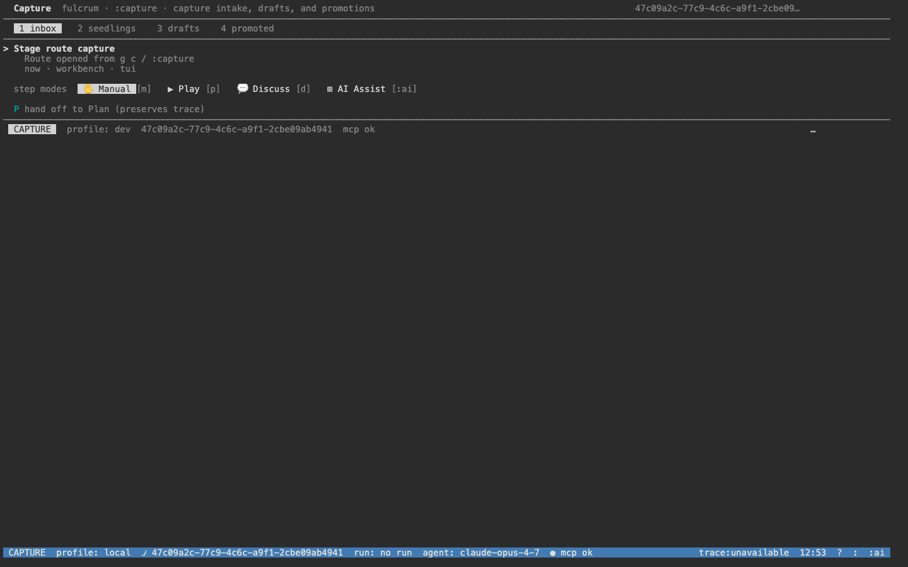
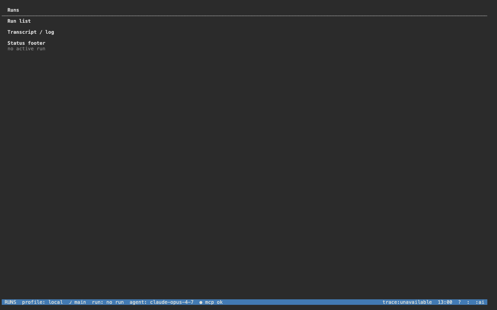
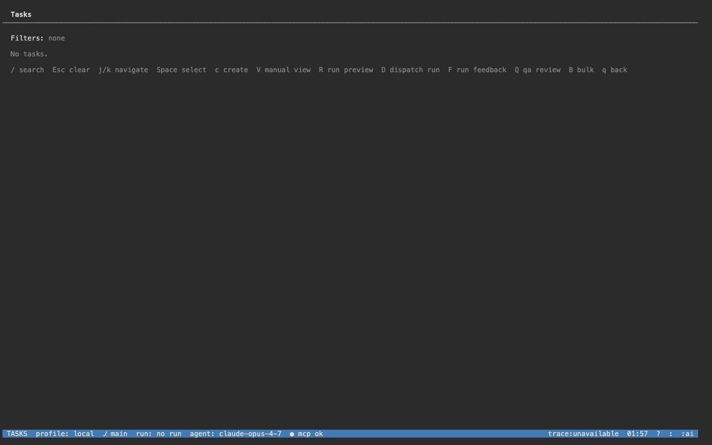
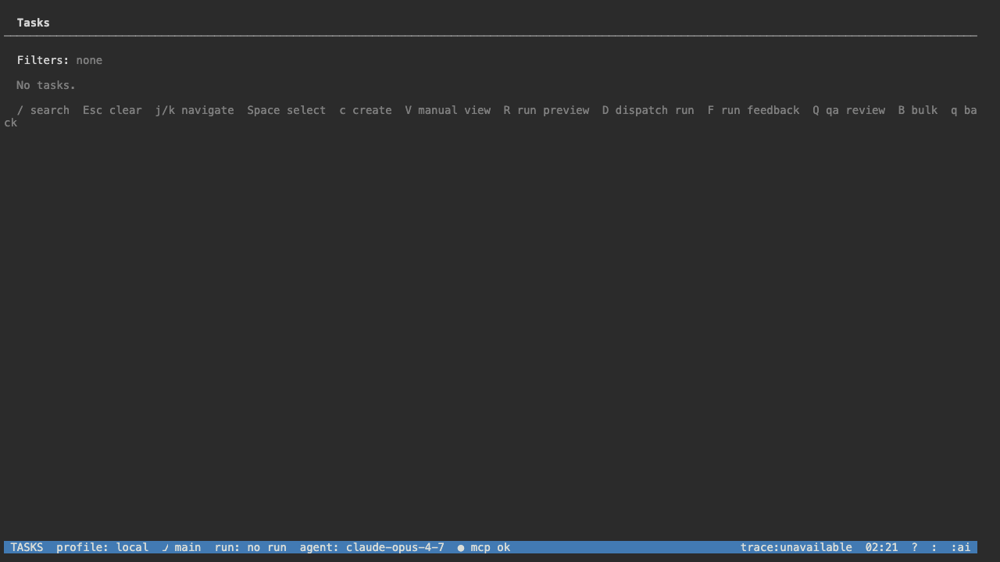
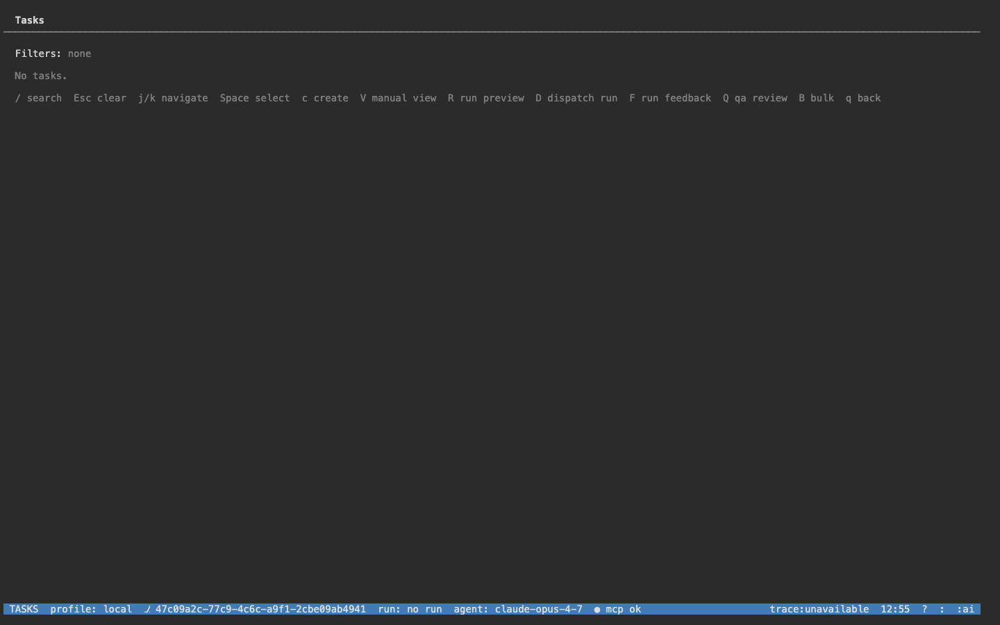
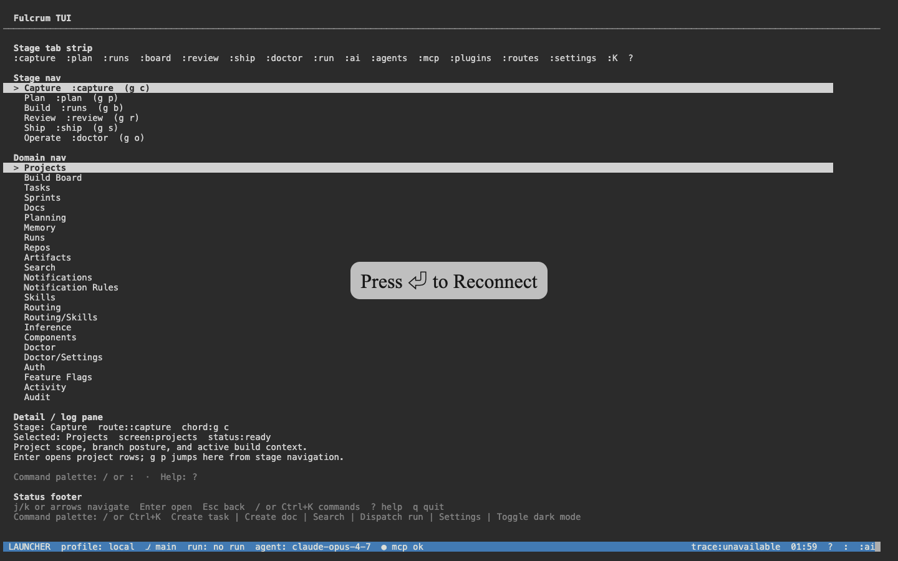
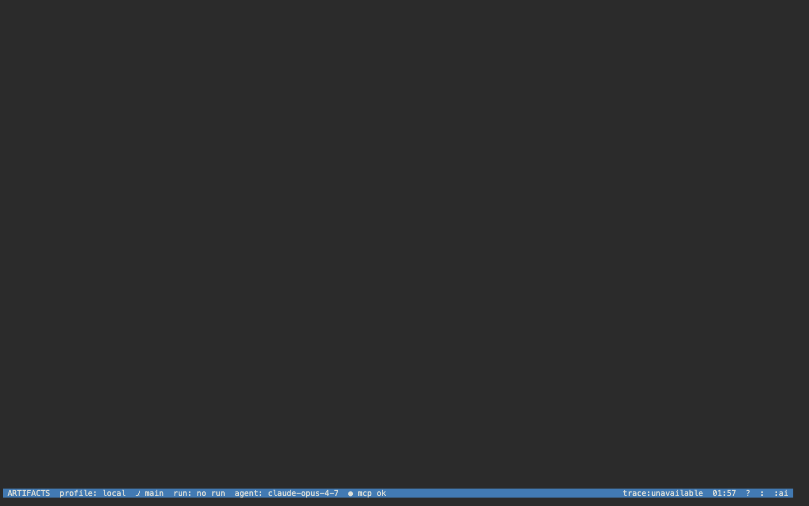
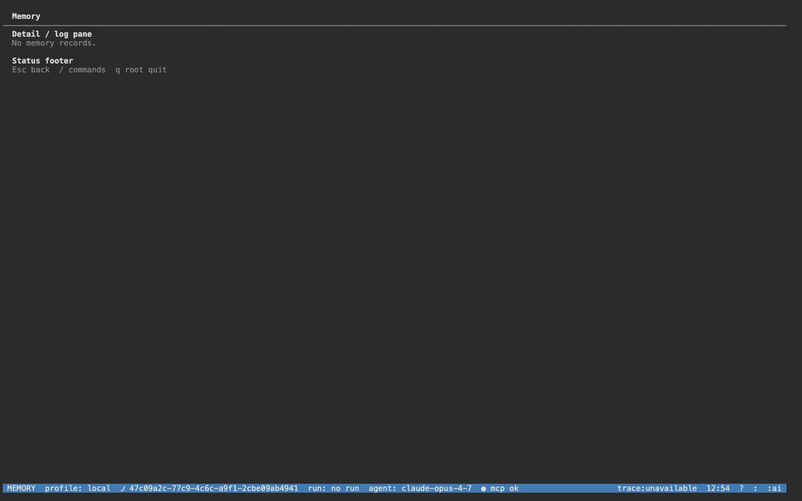
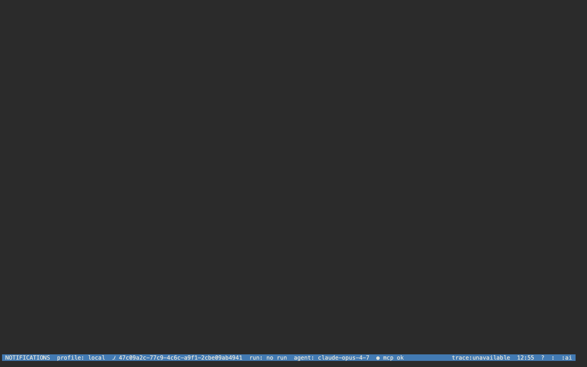
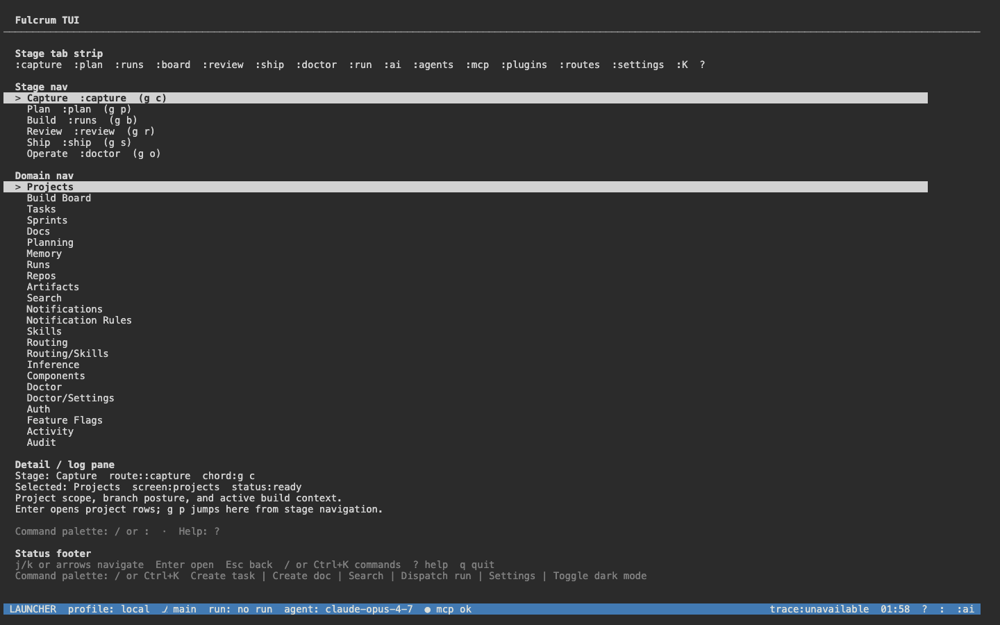

# Fulcrum TUI manual

The Fulcrum TUI is the keyboard-first terminal workbench — same NestJS API, same canonical statuses, same `47c09a2c-77c9-4c6c-a9f1-2cbe09ab4941` project — rendered as an OpenTUI process. Launch:

```bash
FULCRUM_SERVER_URL=http://localhost:3000 bun run apps/tui/src/index.ts
```

`fulcrum tui` (the CLI verb) also opens this surface.

The launcher boots into the **Capture** stage with the **Projects** domain selected, sized for an 80-column terminal but auto-flexing wider. Every screen is HTTP-driven against the running server.


## Keyboard model

The TUI has three navigation primitives:

| Primitive | Keys | Purpose |
|---|---|---|
| Cursor | `j` / `k` (or ↓/↑) | Move within the focused pane (domain nav, list rows, log lines). |
| Stage chord | `g <key>` | Jump between workflow stages (see table below). |
| Command palette | `:` | Type a colon-route (`:plan`, `:board`, `:doctor`, `:ai`) and Enter. |

Modifiers:

| Modifier | Effect |
|---|---|
| `Enter` | Open / enter the focused row. |
| `Esc` | Back to launcher (or close the palette). |
| `Ctrl+K` | Open the command palette directly. |
| `/` | Open command palette in search mode. |
| `?` | Show the help overlay. |
| `q` | Quit from any screen. |

### Stage chord cheat-sheet

| Chord | Route | Stage |
|---|---|---|
| `g c` | `:capture` | Capture |
| `g p` | `:plan` | Plan |
| `g b` | `:runs` | Build (runs feed) |
| `g B` | `:board` | Build (kanban board) |
| `g r` | `:review` | Review |
| `g s` | `:ship` | Ship |
| `g o` | `:doctor` | Operate / doctor |

The lower-case / upper-case `b` / `B` split is intentional (per `CLI-TUI-UX.md` §7.2): `g b` opens the runs feed, `g B` opens the canonical Build board.

## Status footer

The bottom status footer shows: active stage chip, profile (`local` / `dev` / `ci`), branch, current run id, active agent, MCP health (`mcp ok` / `mcp <n>/<total>`), trace, clock, `?`, `:`, `:ai` shortcuts.


---

## Capture stage

Press `g c` to land on the Capture workbench. Default domain selection is **Projects**.



Use `j`/`k` to scan the domain nav (Projects → Build Board → Tasks → Sprints → Docs → Planning → Memory → Runs → Repos → Artifacts → Search → Notifications → Notification Rules → Skills → Routing → Routing/Skills → Inference → Components → Doctor → Doctor/Settings → Auth → Feature Flags → Activity → Audit), `Enter` to open.

---

## Plan stage

`g p` opens the live planning workbench — Active sessions, Sessions list, Traffic counter, step-modes selector (Manual / Play / Discuss / AI Assist), and the local key legend.


Step modes apply per-step affordances; `G` starts a guided run, `F` starts a freeform run, `R` refreshes, `j`/`k` navigate sessions, `Enter` opens.

---

## Build stage

### Runs feed — `g b`

The default Build entry point. Run list + transcript/log pane; the status footer shows the active run (or `no active run`).



### Board view — `g B`

Kanban board for the active project. Use the projects screen + `Enter` to switch projects (or `:projects` + slug).


### Tasks domain

The Tasks domain (under the launcher's Domain nav) renders the same task list the web `/tasks` route does — scoped to the active project. Empty until tasks are seeded; once seeded the 8 manual-test-project rows render with status + priority chips.





### Tasks nav



### Build chord

The `Ctrl+K Build` palette chord opens a quick-action menu over the runs feed (dispatch, retry, cancel, attach).


---

## Review stage

`g r` opens the review queue. QA Report status, Sessions list (RUNNING / IDLE), step-modes selector, key legend (R=refresh, A=approve, X=request-changes, S=save, m/p/d/a step modes).


### Review chord

`Ctrl+K Review` opens the in-flight review actions over the current diff.



---

## Ship stage

`g s` opens the artifact list. Empty state prompts `Press u to upload a release artifact`. Once artifacts exist, the list renders alongside per-artifact metadata.


The Artifacts domain (under Domain nav) provides the same view with run-id filtering.



---

## Operate stage

### Doctor — `g o`

Mirrors the `fulcrum doctor` CLI output: agent install state, MCP servers, hooks, skills, productKernel, caveman defaultMode, verdict.


### Operate screen

Aggregate of MCP servers, plugins, hooks status, telemetry counters.


---

## Cross-cutting screens

### Projects — switch active project

Domain nav → Projects → Enter. Pick a project row to scope the rest of the surfaces.


### Docs


### Memory



### Notifications



### Search


### Audit



### Runs (workspace-wide, not Build-scoped)


### Auth


### Feature Flags


### Command palette

Press `:` (or `Ctrl+K`) to open. Type a colon-route (e.g. `:board`, `:doctor`, `:ai`) or a fuzzy match against any domain.


### Back to launcher

`Esc` from any screen returns to the launcher.


---

## Profile + branch model

The status footer chip pair (`profile: <local|dev|ci>` + `/ <branch>`) is the TUI's analog of the web's trace badge. `local` profile = the default `~/.fulcrum/db/main` PGlite store, `dev` profile = the running NestJS server, `ci` profile = test environment.

## Data + parity

Every TUI screen calls the NestJS public API directly (no in-process DB) — the same endpoints the web shell hits. When the project workspace agent landed the slug→UUID + API-proxy fixes earlier this session, those fixes also enabled the TUI to scope by slug instead of UUID via the project picker.

| TUI screen | Backing API |
|---|---|
| Tasks | `GET /api/v1/tasks` |
| Board / runs | `GET /api/v1/tasks/board` |
| Sprints | `GET /api/v1/sprints` |
| Docs | `GET /api/v1/docs` |
| Memory | `GET /api/v1/memory` |
| Doctor | `GET /api/v1/doctor` |
| MCP | server-side MCP registry |
| Notifications | `GET /api/v1/notifications` |
| Audit | `GET /api/v1/audit` |
| Runs | `GET /api/v1/runs` (+ `/symphony/...`) |
| Search | `GET /api/v1/search` |

## Status as of this manual pass

- 27 canonical TUI screens captured at `docs/manuals/screenshots/tui/`.
- All 4 previously-stuck screens (Plan / Review / Ship / Orchestration) now render real content after the chord-replay pass.
- Tasks screen needs the active project switched to `manual-test-project` to surface the 8 seeded rows; `local-project` shows 0 tasks until seeded.

Run `?` from any screen to surface the in-line help overlay.
