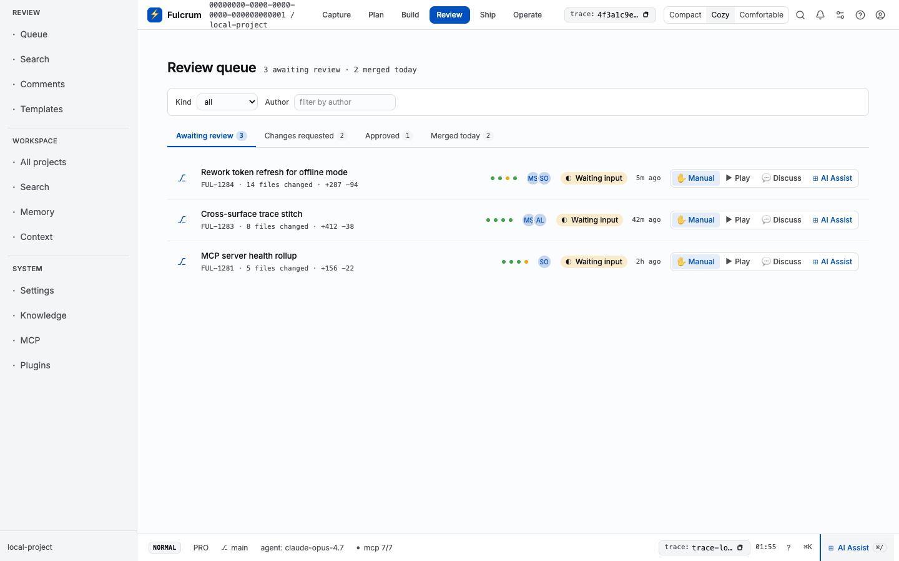
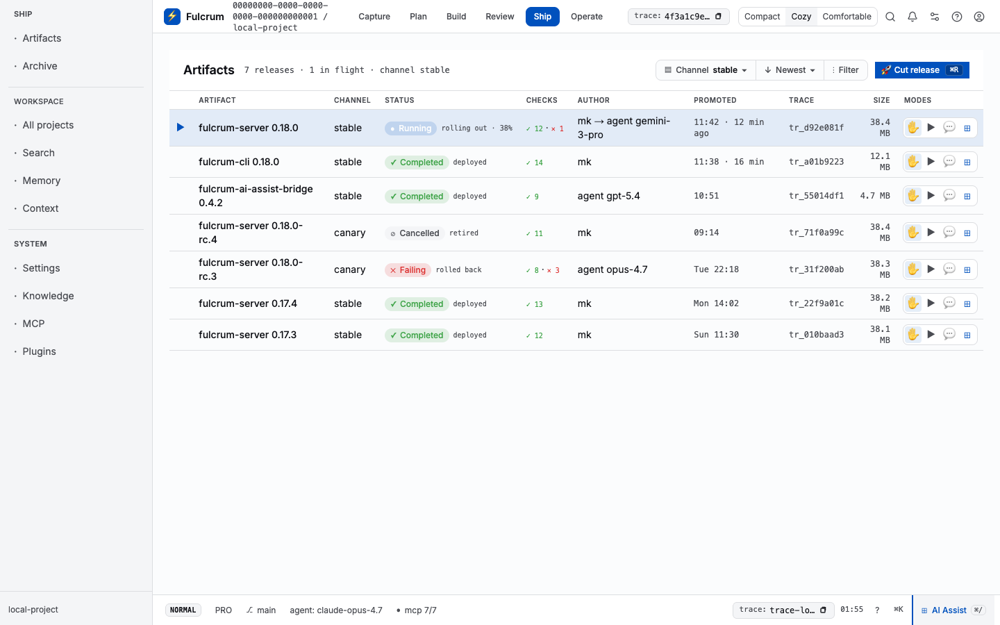

# Web user manual (SvelteKit, port 5173)

The Fulcrum web is a **pure invocation layer** over the NestJS public API:
every page load + form action calls `/api/v1/*` on the backend at `:3000`.
URLs are stable. Mobile / cross-cutting routes are state previews of the
canonical surfaces listed below.

## Getting started

```bash
cd apps/server && bun run src/index.ts &                              # backend
cd apps/web    && FULCRUM_SERVER_URL=http://localhost:3000 bun run dev # web
open http://localhost:5173/
```

The root path lands on the **Portfolio** — the workspace's project list.
Pick a project; URLs then become
`/<workspaceId>/projects/<projectSlug>/<stage>`.


## Workflow stages — `/<ws>/projects/<projId>/<stage>`

Six stages, one URL pattern. The header carries the StageRail tabs +
scope bar + trace identity.

### Capture — `…/capture`

Docs, drafts, promoted captures, inbox. Sub-views are `?view=docs|drafts|
promoted|inbox` projections — never standalone routes. Empty-state
primary action (`New document`) navigates to `/docs/new?project=<slug>`;
the Capture stage's project context preselects the owning project on the
doc-create wizard.


**Flow — create a doc from Capture:**
1. Click `New document` on the empty-state.
2. Pick a doc type from the wizard (ADR, meeting, wiki, runbook, …).
3. Click `Use template` → fill the title/labels/body → `Create document`.
4. Redirect to `/docs/<id>` showing the rendered doc.

### Plan — `…/plan`

AI-Assist planning workbench. Headline reads "AI Assist planning". Three
sub-views (`?view=prompts|prototypes|templates`) project the same plan
session.


### Build — `…/build`

Build board: tasks, dependency runs, manual workbench. Three view modes
(`?view=board|list|table`). Streams `tasks` + `manualWorkbench` from
`/api/v1/tasks` + `/api/v1/tasks/manual-workbench`. With the seeded data
the board renders 7 task cards (P3/P2/P1 across status columns).


### Review — `…/review`

Review queue: code review, QA, generated-e2e, final-QA workbenches. Each
review session is identified by `traceId`; persisted sessions load via
`/api/v1/workflows/review/workbench/session/load`.



### Ship — `…/ship`

Artifacts ready to ship: built docs, exported reports, release packages.
Read-model from `/api/v1/artifacts`. Sub-view `?view=artifacts`.



### Operate — `…/operate`

Doctor + MCP + Plugins + Alerts + Telemetry + Budgets. Six sub-routes,
each its own URL:

| Sub-route | Screenshot |
|---|---|
| `/operate/doctor` | `59-operate-doctor.png` |
| `/operate/mcp` | `60-operate-mcp.png` |
| `/operate/plugins` | `61-operate-plugins.png` |
| `/operate/alerts` | `62-operate-alerts.png` |
| `/operate/telemetry` | `63-operate-telemetry.png` |
| `/operate/budgets` | `64-operate-budgets.png` |

  

## Workspace routes (no project scope)

| Route | Purpose | Screenshot |
|---|---|---|
| `/projects` | All projects in the workspace; create / import / filter | `01-projects.png` |
| `/search` | Federated search across docs / tasks / runs / artifacts / memory | `02-search.png` |
| `/memory` | Persistent facts, decisions, references | `03-memory.png` |
| `/context/preview` | Inspect the context bundle for a project + task | `04-context-preview.png` |
| `/settings` | Account, workspace, secrets, feature flags, orchestration | `05-settings.png` |
| `/docs` | Global doc browser | `16-docs.png` |
| `/docs/new` | Doc creation wizard (preselects project via `?project=`) | `17-docs-new.png` |
| `/inbox` | Workspace inbox: notifications + handoffs | `15-inbox.png` |
| `/audit` | Audit log | `19-audit.png` |
| `/runs` | All agent runs across the workspace | `21-runs.png` |
| `/agents` | Agent profiles, sessions, dispatch | `20-agents.png` |
| `/boards` | Workspace-wide kanban across projects | `22-boards.png` |
| `/orchestration` | Orchestrator dashboard: dispatch / cancel / retry | `23-orchestration.png` |
| `/design-kit` | UI-kit primitive showcase | `24-design-kit.png` |
| `/doctor` | Workspace-level doctor | `26-doctor.png` |
| `/api-tokens` | API token management | `30-api-tokens.png` |
| `/members` | Workspace members | `31-members.png` |

## Settings sub-routes

| Route | Purpose |
|---|---|
| `/settings/secrets` | Credential vault entries |
| `/settings/feature-flags` | Toggle settings flags + rollout percent |
| `/settings/orchestration` | Workflow defs + orchestration config |
| `/settings/data` | Export / import workspace JSON |
| `/settings/backups` | Backup history + restore |
| `/settings/skills` | Installed skill packs (CLI parity: `fulcrum skills list --installed`) |
| `/settings/notifications` | Notification routing rules |
| `/settings/telemetry` | OpenTelemetry config |
| `/settings/ai-assist` | AI-Assist model + token defaults |

## Project-detail routes

`/projects/<slug>/{board,backlog,sprints,modules,intake,calendar,gantt,
repos,uat,review,reports,routing,e2e,updates,runs,settings/*}`.

Notable:
- **`/projects/<slug>`** — overview card with task counts + sprint days remaining (`70-proj-detail.png`).
- **`/projects/<slug>/backlog`** — backlog list + sprint panel; seeded sample shows 6 open tasks + Sprint 1 with 0/40 points (`72-proj-backlog.png`).
- **`/projects/<slug>/board`** — kanban with full task workbench (`71-proj-board.png`).
- **`/projects/<slug>/modules`** — module list (3 seeded: Capture & Plan, Build & Ship, Operate & Audit).
- **`/projects/<slug>/intake`** — intake queue (2 seeded: feedback, bug).

  

## Cross-cutting affordances

- **Trace identity** — every page header carries a copy-trace-id button (`tr_…`).
- **Command palette** — `⌘K` everywhere; jumps to any stage / project / run / doc.
- **AI Assist** — `⌘/` opens chat in the status footer.
- **Keyboard shortcuts** — `?` shows the cheat-sheet overlay.
- **Theme + density** — gear next to notifications, persists per-user.

## Troubleshooting

- Page renders but a section says "Project could not load" → the slug isn't in the NestJS DB. List with `curl /api/v1/projects?orgId=<org>`. Seed via `POST /api/v1/projects`.
- A `/settings/*` sub-route returns 500 → check the server log; missing tables (`project_statuses`, `project_connectors`) now return `[]` rather than 500 so the page renders empty-state.
- `/projects/<slug>/sprints` is empty → expected: sprint↔task model is being unified across `FulcrumTaskEntity` (no sprint_id) and the legacy `Task` entity (has sprint_id). See [findings.md](../findings.md) bug E.
- Web has stale data → restart the NestJS server first (`lsof -ti:3000 | xargs kill -9; cd apps/server && bun run src/index.ts`). PGlite is single-writer; the web doesn't open it directly, but the data behind it lives in `~/.fulcrum/db/main`.
