# Web user manual (SvelteKit, port 5173)

The Fulcrum web is a **pure invocation layer** over the NestJS public API:
every page load + form action calls `/api/v1/*` on the backend at `:3000`.
URLs are stable. Mobile / cross-cutting routes are state previews of the
canonical surfaces listed below.

## Getting started

```bash
cd apps/server && bun run src/index.ts &                              # backend
cd apps/web    && FULCRUM_SERVER_URL=http://localhost:3000 bun run dev # web
open http://localhost:5173/
```

The root path lands on the **Portfolio** — the workspace's project list.
Pick a project; URLs then become
`/<workspaceId>/projects/<projectSlug>/<stage>`.


## Workflow stages — `/<ws>/projects/<projId>/<stage>`

Six stages, one URL pattern. The header carries the StageRail tabs +
scope bar + trace identity.

### Capture — `…/capture`

Docs, drafts, promoted captures, inbox. Sub-views are `?view=docs|drafts|
promoted|inbox` projections — never standalone routes. Empty-state
primary action (`New document`) navigates to `/docs/new?project=<slug>`;
the Capture stage's project context preselects the owning project on the
doc-create wizard.


**Flow — create a doc from Capture:**
1. Click `New document` on the empty-state.
2. Pick a doc type from the wizard (ADR, meeting, wiki, runbook, …).
3. Click `Use template` → fill the title/labels/body → `Create document`.
4. Redirect to `/docs/<id>` showing the rendered doc.

### Plan — `…/plan`

AI-Assist planning workbench. Headline reads "AI Assist planning". Three
sub-views (`?view=prompts|prototypes|templates`) project the same plan
session.


### Build — `…/build`

Build board: tasks, dependency runs, manual workbench. Three view modes
(`?view=board|list|table`). Streams `tasks` + `manualWorkbench` from
`/api/v1/tasks` + `/api/v1/tasks/manual-workbench`. With the seeded data
the board renders 7 task cards (P3/P2/P1 across status columns).


### Review — `…/review`

Review queue: code review, QA, generated-e2e, final-QA workbenches. Each
review session is identified by `traceId`; persisted sessions load via
`/api/v1/workflows/review/workbench/session/load`. See the
[Review stage routes](#review-stage-routes) section below for the
production review surfaces (`/review`, `/review-queue`, `/review-search`,
`/review-templates`, `/comments`, `/comments-block-thread`).


### Ship — `…/ship`

Artifacts ready to ship: built docs, exported reports, release packages.
Read-model from `/api/v1/artifacts`. See the
[Ship stage routes](#ship-stage-routes) section below for the production
ship surfaces (`/ship`, `/ship-archive`, `/artifacts`).


### Operate — `…/operate`

Doctor + MCP + Plugins + Alerts + Telemetry + Budgets. Six sub-routes,
each its own URL:

| Sub-route | Screenshot |
|---|---|
| `/operate/doctor` | `59-operate-doctor.png` |
| `/operate/mcp` | `60-operate-mcp.png` |
| `/operate/plugins` | `61-operate-plugins.png` |
| `/operate/alerts` | `62-operate-alerts.png` |
| `/operate/telemetry` | `63-operate-telemetry.png` |
| `/operate/budgets` | `64-operate-budgets.png` |

  

## Workspace routes (no project scope)

| Route | Purpose | Screenshot |
|---|---|---|
| `/projects` | All projects in the workspace; create / import / filter | `01-projects.png` |
| `/search` | Federated search across docs / tasks / runs / artifacts / memory | `02-search.png` |
| `/memory` | Persistent facts, decisions, references | `03-memory.png` |
| `/context/preview` | Inspect the context bundle for a project + task | `04-context-preview.png` |
| `/settings` | Account, workspace, secrets, feature flags, orchestration | `05-settings.png` |
| `/docs` | Global doc browser | `16-docs.png` |
| `/docs/new` | Doc creation wizard (preselects project via `?project=`) | `17-docs-new.png` |
| `/inbox` | Workspace inbox: notifications + handoffs | `15-inbox.png` |
| `/audit` | Audit log | `19-audit.png` |
| `/tasks` | Flat task list across the workspace (8 seeded) | `01-tasks-list.png` |
| `/runs` | All agent runs across the workspace | `21-runs.png` |
| `/agents` | Agent session workbench + dispatch | `20-agents.png` |
| `/boards` | Workspace-wide kanban across projects | `02-boards.png` |
| `/orchestration` | Orchestrator dashboard: dispatch / cancel / retry | `23-orchestration.png` |
| `/design-kit` | UI-kit primitive showcase | `24-design-kit.png` |
| `/doctor` | Workspace-level doctor | `26-doctor.png` |
| `/api-tokens` | API token management | `30-api-tokens.png` |
| `/members` | Workspace members | `31-members.png` |

## Settings sub-routes

| Route | Purpose |
|---|---|
| `/settings/secrets` | Credential vault entries |
| `/settings/feature-flags` | Toggle settings flags + rollout percent |
| `/settings/orchestration` | Workflow defs + orchestration config |
| `/settings/data` | Export / import workspace JSON |
| `/settings/backups` | Backup history + restore |
| `/settings/skills` | Installed skill packs (CLI parity: `fulcrum skills list --installed`) |
| `/settings/notifications` | Notification routing rules |
| `/settings/telemetry` | OpenTelemetry config |
| `/settings/ai-assist` | AI-Assist model + token defaults |

## Project workspace routes — `/projects/<slug>/...`

The project-workspace surfaces sit under `/projects/<slug>/<area>`, with `<slug>` accepting **either the canonical UUID or the human slug** (e.g. `manual-test-project`). The slug → UUID resolution lives in each service-public store (TaskPublicStore, PlanningStructurePublicStore, SprintPublicStore, CustomFieldStore, SavedViewPublicStore, AutomationStore, WorkflowSettingsStore, ProjectStatusPublicApiService). The shared captures below use `manual-test-project` (UUID `47c09a2c-77c9-4c6c-a9f1-2cbe09ab4941`) on the `dev/v1.0` audit dataset (8 tasks, 2 sprints with Sprint 1 active, 2 modules, 2 intake items, 2 custom fields, 2 saved views, 2 automations, 1 project-status override).

### `/projects`

[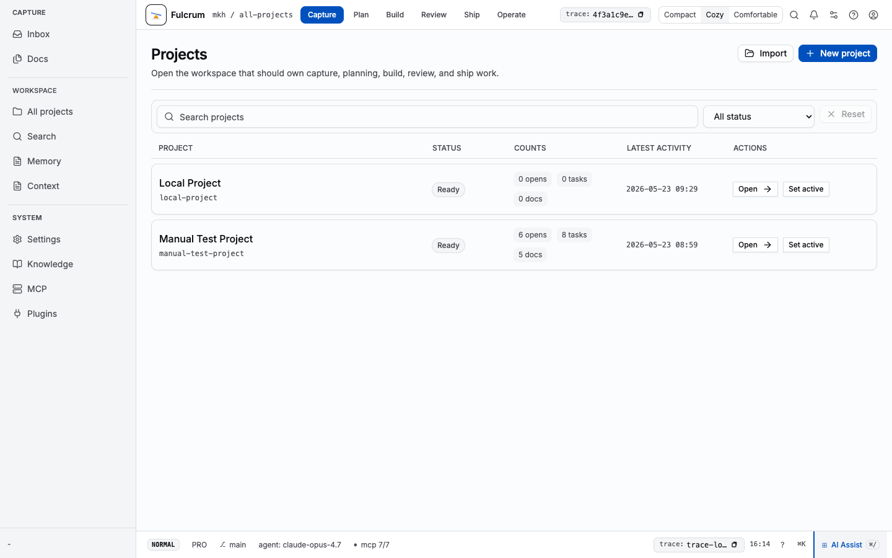](../screenshots/web/10-projects.png)

Workspace project list. Server load calls `/api/v1/projects?orgId=…` and renders one row per project with status pill, counts (`open / tasks / docs`), latest activity, and `Open` + `Set active` actions. Header carries `Import` and `+ New project`.

| Action | How (web) | How (CLI) | Notes |
|---|---|---|---|
| Create | `+ New project` button | `fulcrum project create` | POSTs `/api/v1/projects` |
| Import | `Import` button | `fulcrum project import` | wizard at `/projects/new/import` |
| Filter | Search box + status `<select>` | `fulcrum project list --status <s>` | client-side filter |
| Open | row `Open` link | `fulcrum project open <slug>` | slug or UUID accepted |
| Set active | row `Set active` button | `fulcrum project use <slug>` | persists workspace cookie |

### `/projects/<slug>`

[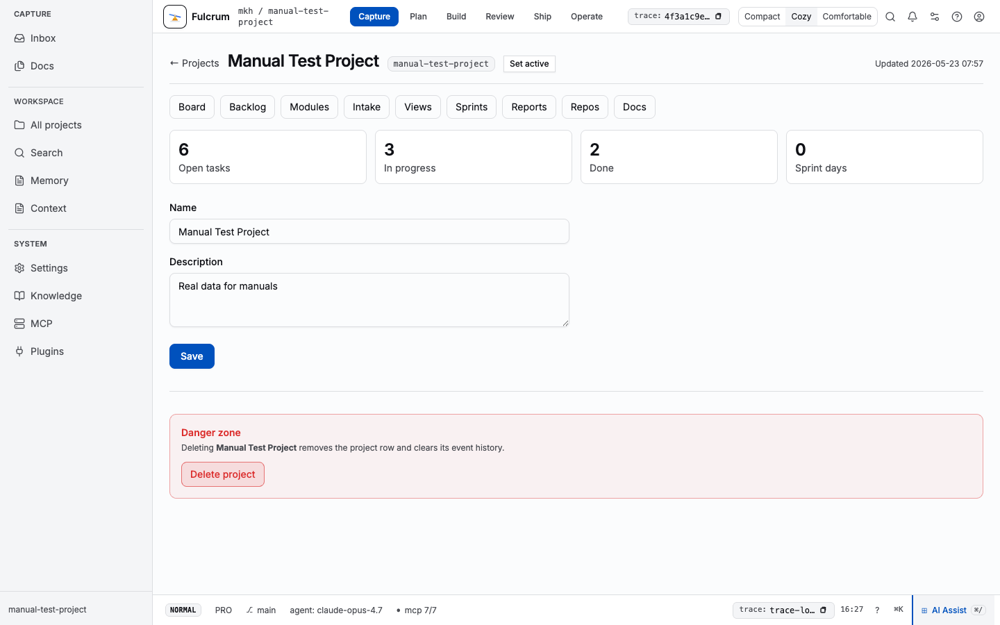](../screenshots/web/70-proj-detail.png)

Overview workbench. Shows the project name + slug pill + `Set active`, headline counts (`Open tasks / In progress / Done / Sprint days`), inline editable Name + Description form, and a `Danger zone` panel with Delete project. Tab strip below the header navigates to Board, Backlog, Modules, Intake, Views, Sprints, Reports, Repos, Docs.

| Action | How (web) | How (CLI) | Notes |
|---|---|---|---|
| Edit metadata | Name / Description fields + Save | `fulcrum project patch <id>` | PATCH `/api/v1/projects/{id}` |
| Set active | header button | `fulcrum project use <slug>` | persists workspace cookie |
| Delete | Danger zone `Delete project` | `fulcrum project delete <id>` | confirmation modal |
| Navigate | section pills (Board / Backlog / …) | `fulcrum project <slug> <area>` | resolves to same route |

### `/projects/<slug>/board`

[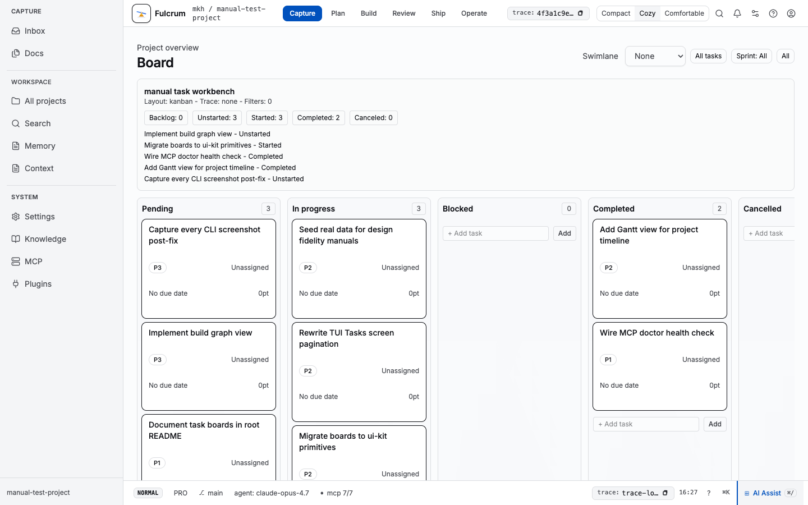](../screenshots/web/71-proj-board.png)

Project kanban with manual-task-workbench banner (kanban layout, filter chips for each canonical status). Columns are Pending · In progress · Blocked · Completed · Cancelled, populated from `/api/v1/tasks/board?orgId=…&projectId=<slug>` through TaskPublicStore. Each card shows priority pill, assignee, due date, story points. Per-column `+ Add task` quick-create row.

| Action | How (web) | How (CLI) | Notes |
|---|---|---|---|
| Create | column `+ Add task` | `fulcrum task create --status <s> --project <slug>` | POSTs `/api/v1/tasks` |
| Move status | drag card | `fulcrum task patch <id> --status <s>` | server enforces workflow transitions |
| Bulk status | row select + Bulk menu | `fulcrum task patch …` | `bulkStatus` form action |
| Filter sprint | header `Sprint: All` toggle | `fulcrum task list --sprint <id>` | client-side filter |

### `/projects/<slug>/backlog`

[](../screenshots/web/72-proj-backlog.png)

Sprint Planning workbench: left column is the backlog (filterable by priority), right column is the selected sprint with capacity, points used, and the assigned tasks. Header sprint `<select>` chooses Sprint 1 — Foundation (active, 40 pt capacity) or Sprint 2 — UI polish (planned, 30 pt). Each backlog row carries a `→ Sprint` button that drops the task into the active sprint.

| Action | How (web) | How (CLI) | Notes |
|---|---|---|---|
| Move to sprint | row `→ Sprint` button | `fulcrum sprint add-task <sprintId> <taskId>` | POSTs `/api/v1/sprints/{id}/board-tasks` |
| Switch sprint | header `<select>` | `fulcrum sprint use <id>` | scopes the sprint panel |
| Filter | All priorities `<select>` | `fulcrum task list --priority <n>` | client-side filter |

### `/projects/<slug>/sprints`

[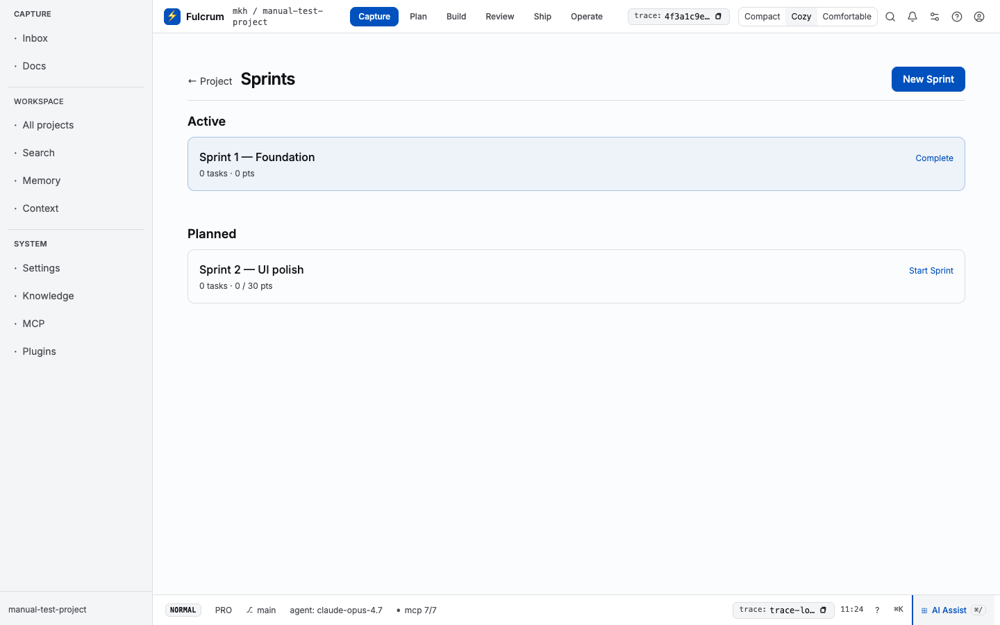](../screenshots/web/73-proj-sprints.png)

Sprints board: `Active` section renders the running sprint with a `Complete` action; `Planned` section lists upcoming sprints each with `Start Sprint`. Header `New Sprint` opens the create modal. Data comes from `/api/v1/sprints/project-board?orgId=…&projectId=<slug>` and accepts either slug or UUID after the SprintPublicStore.resolveProjectId fix.

| Action | How (web) | How (CLI) | Notes |
|---|---|---|---|
| Create | `New Sprint` button | `fulcrum sprint create --project <slug> --name <n> --capacity <pts>` | POSTs `/api/v1/sprints/project-board` |
| Start | `Start Sprint` link | `fulcrum sprint start <id>` | POSTs `/api/v1/sprints/{id}/start-board` |
| Complete | active sprint `Complete` link | `fulcrum sprint complete <id>` | POSTs `/api/v1/sprints/{id}/complete-board` |
| Edit goal | open detail at `/sprint/<id>` | `fulcrum sprint patch <id>` | PATCH goal/capacity |

### `/projects/<slug>/modules`

[](../screenshots/web/74-proj-modules.png)

Module list — durable workstream containers used for module-status rollups. Inline `Module name`, `Status` (Planned / Active / Completed / Archived), `Lead user id` form + `Create module` button. Table lists Name · Status pill · Trace id · Delete. Seeded rows: Backend platform (active), Web client (planned).

| Action | How (web) | How (CLI) | Notes |
|---|---|---|---|
| Create | inline form + `Create module` | `fulcrum module create --project <slug> --name <n>` | POSTs `/api/v1/planning-structures/modules` |
| Edit | drill into module page | `fulcrum module patch <id>` | PATCH `/api/v1/planning-structures/modules/{id}` |
| Delete | row `Delete` button | `fulcrum module delete <id>` | DELETE `/api/v1/planning-structures/modules/{id}` |
| Assign tasks | module detail page | `fulcrum module add-task <id> <taskId>` | POST `/api/v1/planning-structures/modules/{id}/tasks` |

### `/projects/<slug>/intake`

[](../screenshots/web/75-proj-intake.png)

Intake queue. Inline `Request title`, `Source`, `Description` form + `Add request` button. Table lists Title · Status (`open` by default) · Trace id · Delete. Seeded rows: "Feedback — calendar lacks week-view" + "Bug — sprint goal modal not closing".

| Action | How (web) | How (CLI) | Notes |
|---|---|---|---|
| Create | inline form + `Add request` | `fulcrum intake create --project <slug> --title <t>` | POSTs `/api/v1/planning-structures/intake` |
| Promote | detail page `Promote to task` | `fulcrum intake promote <id>` | PATCH `taskId` |
| Decline | detail page `Decline` | `fulcrum intake patch <id> --status declined` | PATCH `/api/v1/planning-structures/intake/{id}` |
| Delete | row `Delete` button | `fulcrum intake delete <id>` | DELETE `/api/v1/planning-structures/intake/{id}` |

### `/projects/<slug>/calendar`

[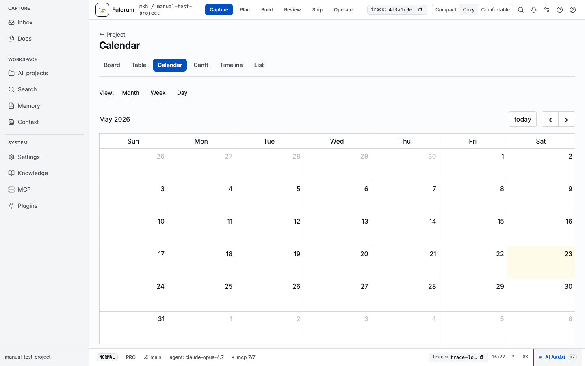](../screenshots/web/76-proj-calendar.png)

Month / Week / Day calendar view of tasks with due dates. Header carries Board · Table · Calendar · Gantt · Timeline · List view-switcher plus `today`, `‹`, `›` nav. Seeded tasks have no due dates so the cells are empty in the audit dataset; cell renders highlight today (May 23, 2026).

| Action | How (web) | How (CLI) | Notes |
|---|---|---|---|
| Switch view | View `Month/Week/Day` toggles | `fulcrum task list --view calendar --range <m|w|d>` | client-side toggle |
| Switch surface | header view-switcher | n/a | navigates to `/board`, `/gantt`, etc. |
| Open task | click event chip | `fulcrum task open <id>` | nav `/tasks/<id>` |

### `/projects/<slug>/gantt`

[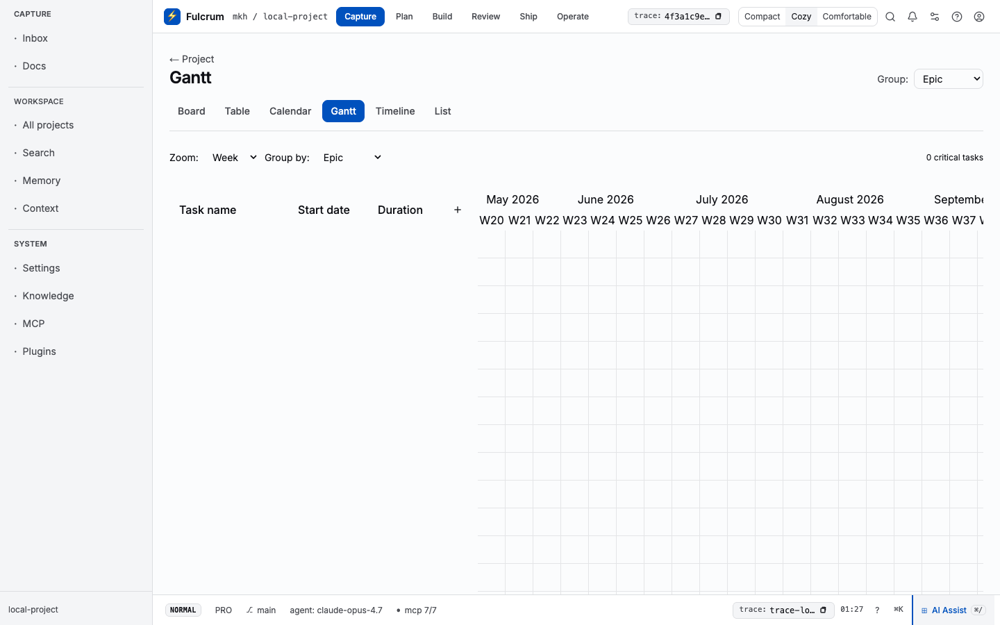](../screenshots/web/77-proj-gantt.png)

Weekly Gantt timeline grouped by Epic (configurable Group selector). Zoom toggles between Week and Sprint scales. Bars come from the task date range; the audit dataset has no start/end dates so the chart is empty (`0 critical tasks`). The `+` column-add control opens an inline create row.

| Action | How (web) | How (CLI) | Notes |
|---|---|---|---|
| Create | `+` row at top | `fulcrum task create --project <slug>` | POSTs `/api/v1/tasks` |
| Change zoom | Zoom `<select>` | `fulcrum task list --view gantt --zoom <w|s>` | client-side |
| Change group | Group by `<select>` | `fulcrum task list --view gantt --group <epic|module|status>` | client-side |

### `/projects/<slug>/repos`

[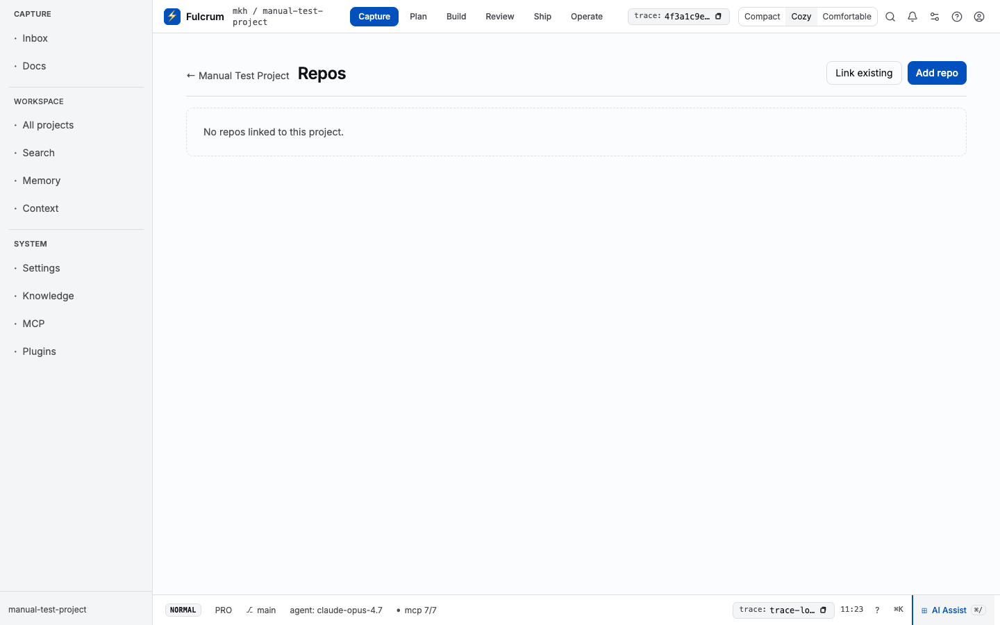](../screenshots/web/78-proj-repos.png)

Linked git repositories. Header carries `Link existing` (pick a repo already known to the workspace) and `Add repo` (register a new one). Audit dataset shows the empty-state copy "No repos linked to this project."

| Action | How (web) | How (CLI) | Notes |
|---|---|---|---|
| Link existing | `Link existing` button | `fulcrum repo link <projectId> <repoId>` | POSTs link |
| Add new | `Add repo` button | `fulcrum repo create --path <p>` | wizard |
| Unlink | row context menu | `fulcrum repo unlink <projectId> <repoId>` | DELETE link |

### `/projects/<slug>/uat`

[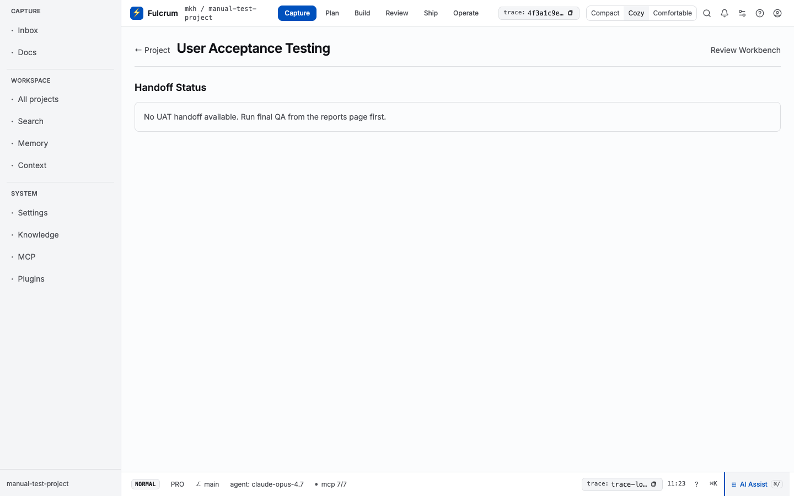](../screenshots/web/79-proj-uat.png)

User Acceptance Testing handoff. `Handoff Status` panel exposes the latest UAT report when one exists. Header `Review Workbench` link jumps to the review surface. Audit dataset shows "No UAT handoff available. Run final QA from the reports page first." — the UAT artifact is created from `/reports` → Final QA.

| Action | How (web) | How (CLI) | Notes |
|---|---|---|---|
| Create handoff | `/reports` → Final QA tab | `fulcrum review uat <projectId>` | populates this surface |
| Open review | `Review Workbench` link | `fulcrum review open <projectId>` | nav `/projects/<slug>/review` |

### `/projects/<slug>/review`

[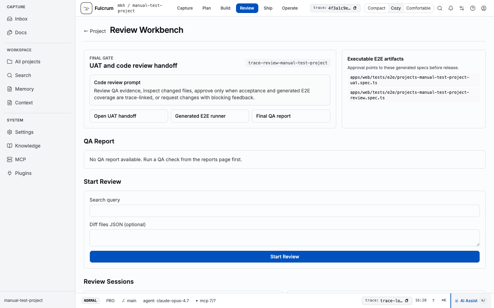](../screenshots/web/80-proj-review.png)

Final-gate review workbench. Top card carries the code-review prompt, three action buttons (Open UAT handoff, Generated E2E runner, Final QA report), and the trace id (`trace-review-manual-test-project`). Sidebar lists the executable E2E artifact paths (`apps/web/tests/e2e/projects-manual-test-project-uat.spec.ts` + `…-review.spec.ts`). Below sits the QA Report panel, a Start Review form (search query + diff JSON + `Start Review`), and Review Sessions history.

| Action | How (web) | How (CLI) | Notes |
|---|---|---|---|
| Start review | `Start Review` form | `fulcrum review start <projectId>` | POSTs review session |
| Open UAT | `Open UAT handoff` button | `fulcrum review uat <projectId>` | nav `/uat` |
| Run E2E | `Generated E2E runner` button | `fulcrum review e2e <projectId>` | nav `/e2e` |
| Approve | review session detail | `fulcrum review approve <sessionId>` | PATCH approval state |

### `/projects/<slug>/reports`

[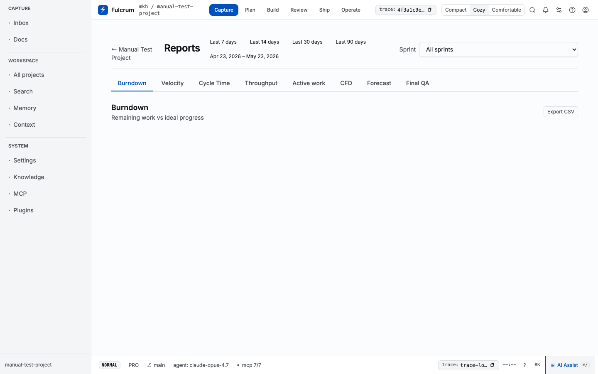](../screenshots/web/81-proj-reports.png)

Reports workbench. Header shows the active date range (`Apr 23, 2026 – May 23, 2026`) with quick toggles (Last 7 / 14 / 30 / 90 days) and a Sprint scope `<select>`. Tabs: Burndown · Velocity · Cycle Time · Throughput · Active work · CFD · Forecast · Final QA. The active tab name is followed by a `Export CSV` button. Chart renders use real task / sprint data from `/api/v1/reports/*`.

| Action | How (web) | How (CLI) | Notes |
|---|---|---|---|
| Switch chart | tab buttons | `fulcrum report <kind> --project <slug>` | route param `?tab=…` |
| Change range | range buttons | `fulcrum report --range <d>` | client filter |
| Export CSV | `Export CSV` button | `fulcrum report <kind> --format csv` | GET `…&format=csv` |
| Final QA | `Final QA` tab | `fulcrum review final-qa <projectId>` | publishes UAT handoff |

### `/projects/<slug>/routing`

[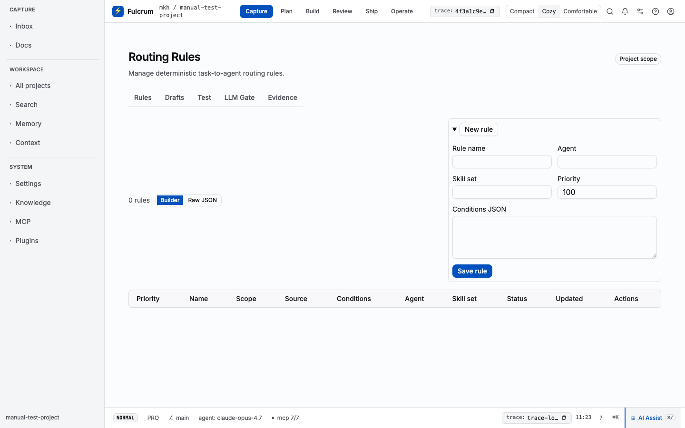](../screenshots/web/82-proj-routing.png)

Deterministic task → agent routing rules. Tabs: Rules · Drafts · Test · LLM Gate · Evidence. Right-side `New rule` panel collects Rule name · Agent · Skill set · Priority · Conditions JSON, with `Save rule`. Below renders the rules table (Priority · Name · Scope · Source · Conditions · Agent · Skill set · Status · Updated · Actions). Header `Project scope` pill scopes the rules to this project rather than the workspace default.

| Action | How (web) | How (CLI) | Notes |
|---|---|---|---|
| Create | `Save rule` after filling the panel | `fulcrum routing create --project <slug>` | POSTs `/api/v1/routing/rules` |
| Edit | row Actions | `fulcrum routing patch <id>` | PATCH |
| Test | `Test` tab | `fulcrum routing test --task <id>` | dry-run match |
| Switch JSON view | `Raw JSON` toggle | n/a | reads/writes the same source |

### `/projects/<slug>/e2e`

[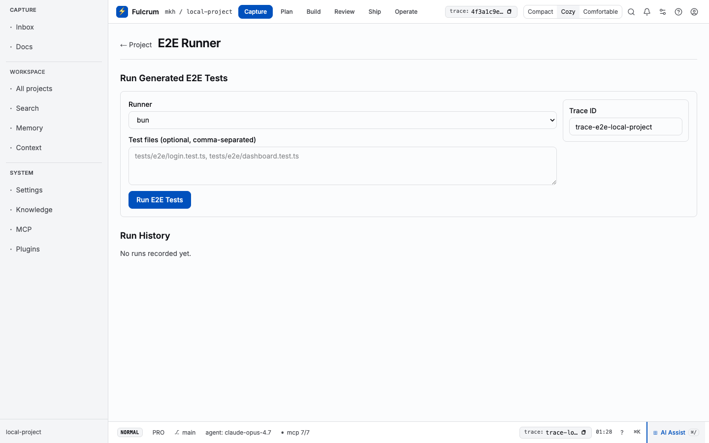](../screenshots/web/83-proj-e2e.png)

Generated E2E test runner. Form: Runner (`bun` / `playwright` / `vitest`), Test files (comma-separated), Trace ID input. `Run E2E Tests` dispatches the run; results land in the `Run History` panel ("No runs recorded yet." until the first run). The runner is the same surface the review workbench points at via its `Generated E2E runner` button.

| Action | How (web) | How (CLI) | Notes |
|---|---|---|---|
| Run | `Run E2E Tests` button | `fulcrum e2e run --project <slug>` | POSTs run record |
| Cancel | run row action | `fulcrum e2e cancel <runId>` | aborts the runner |
| Download artifact | run detail | `fulcrum e2e artifact <runId>` | GET artifact URL |

### `/projects/<slug>/updates`

[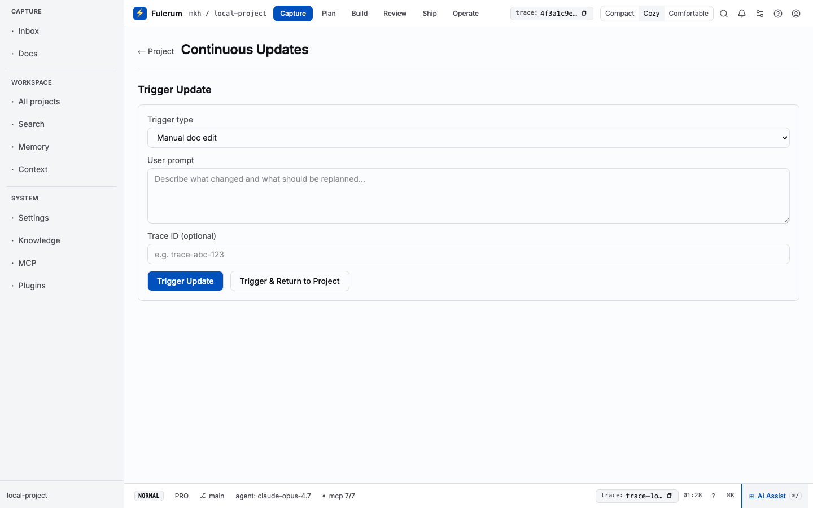](../screenshots/web/84-proj-updates.png)

Continuous-updates console. `Trigger Update` form selects a trigger type (`Manual doc edit` / scheduled / commit / external), captures a user prompt, and optionally pins a Trace ID. `Trigger Update` posts the run; `Trigger & Return to Project` runs and navigates back to `/projects/<slug>`.

| Action | How (web) | How (CLI) | Notes |
|---|---|---|---|
| Trigger | `Trigger Update` button | `fulcrum update trigger --project <slug> --kind <type>` | POSTs an update job |
| Trigger + return | second button variant | `fulcrum update trigger … --then-open <slug>` | helper for human flow |

### `/projects/<slug>/runs`

[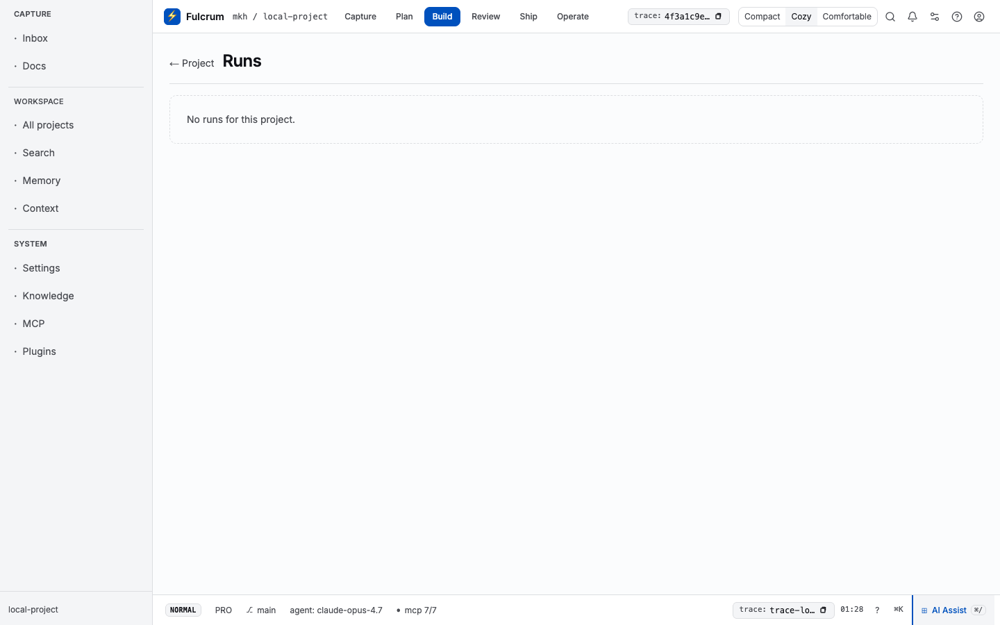](../screenshots/web/85-proj-runs.png)

Agent run history scoped to this project. Empty-state: "No runs for this project." (runs land here when an agent dispatch carries this project id). Each populated row links to the run detail at `/runs/<runId>`.

| Action | How (web) | How (CLI) | Notes |
|---|---|---|---|
| Dispatch | `/agents` workbench with project preselect | `fulcrum agent dispatch --project <slug>` | POSTs `/api/v1/agent-runs` |
| Open detail | row link | `fulcrum run show <runId>` | nav `/runs/<runId>` |
| Cancel | run detail `Cancel` | `fulcrum run cancel <runId>` | PATCH state |

### `/projects/<slug>/settings/connectors`

[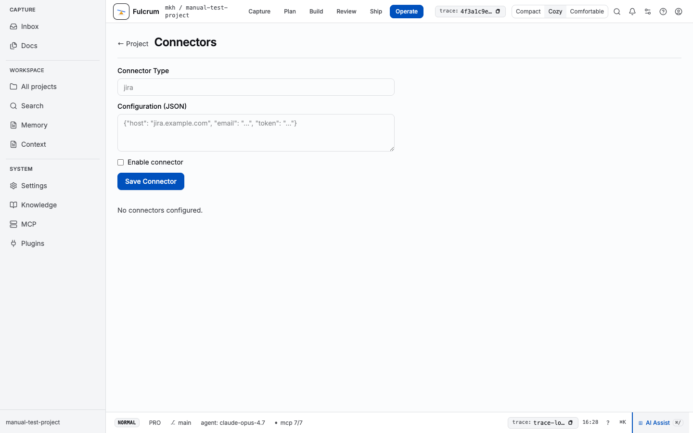](../screenshots/web/86-proj-settings-connectors.png)

External-system connector config (Jira / Linear / GitHub / Plane …). `Connector Type` input + `Configuration (JSON)` textarea + `Enable connector` checkbox + `Save Connector`. Audit dataset shows "No connectors configured." after the form.

| Action | How (web) | How (CLI) | Notes |
|---|---|---|---|
| Add | fill form + `Save Connector` | `fulcrum connector create --project <slug> --kind <jira|linear|…>` | POSTs `/api/v1/connectors` |
| Enable / disable | `Enable connector` checkbox | `fulcrum connector patch <id> --enabled <bool>` | PATCH `enabled` |
| Delete | row context menu | `fulcrum connector delete <id>` | DELETE |

### `/projects/<slug>/settings/statuses`

[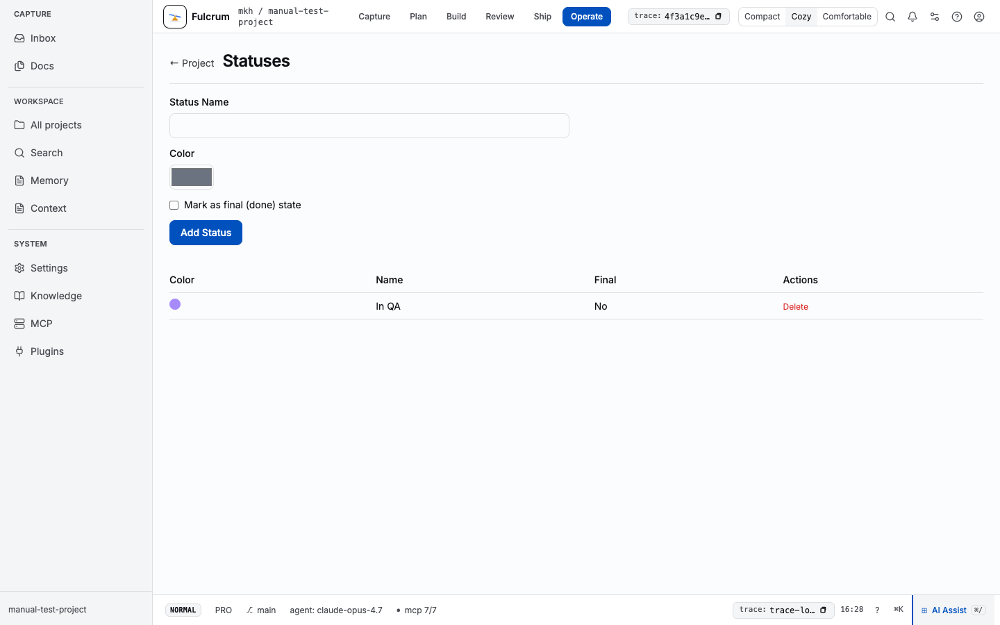](../screenshots/web/87-proj-settings-statuses.png)

Per-project status overrides on top of the canonical Pending / In progress / Blocked / Completed / Cancelled set. Form: Status Name · Color picker · `Mark as final (done) state` checkbox · `Add Status`. Table lists Color swatch · Name · Final · Delete. Audit dataset shows the seeded override `In QA` (`#a78bfa`, not final). Backed by the new `project_statuses` table introduced in migration `ProjectStatuses20260523001778932800000`.

| Action | How (web) | How (CLI) | Notes |
|---|---|---|---|
| Add | fill form + `Add Status` | `fulcrum status create --project <slug> --name <n>` | POSTs `/api/v1/projects/{id}/statuses` |
| Mark final | checkbox before save | `fulcrum status patch <statusId> --is-final` | PATCH `isFinal` |
| Reorder | drag row | `fulcrum status patch <statusId> --sort-order <n>` | PATCH `sortOrder` |
| Delete | row `Delete` | `fulcrum status delete <statusId>` | DELETE |

### `/projects/<slug>/settings/fields`

[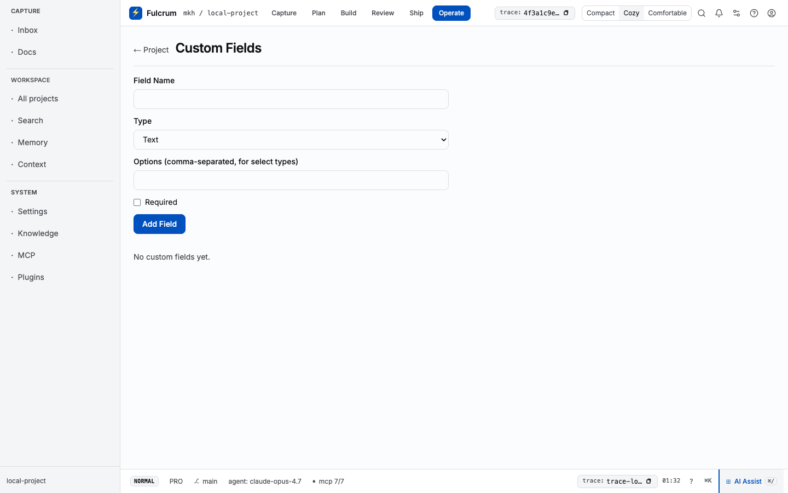](../screenshots/web/88-proj-settings-fields.png)

Custom field definitions for tasks. Form: Field Name · Type (`text` / `number` / `date` / `select` / `multi_select` / `checkbox` / `user` / `url` / `json`) · Options · Required · `Add Field`. Table lists Name · Type · Required · Archive. Audit dataset shows the seeded fields `Story points` (number) and `Squad` (select with Platform / Web / CLI options).

| Action | How (web) | How (CLI) | Notes |
|---|---|---|---|
| Add | fill form + `Add Field` | `fulcrum field create --project <slug> --name <n> --type <t>` | POSTs `/api/v1/custom-fields` |
| Reorder | drag rows | `fulcrum field reorder --project <slug> --ids <ids>` | POSTs `/custom-fields/reorder` |
| Archive | row `Archive` | `fulcrum field patch <id> --archived` | PATCH `archived` |
| Set value on task | task detail panel | `fulcrum task field set <taskId> <slug> <value>` | POSTs `/task-custom-fields/set` |

### `/projects/<slug>/settings/workflow`

[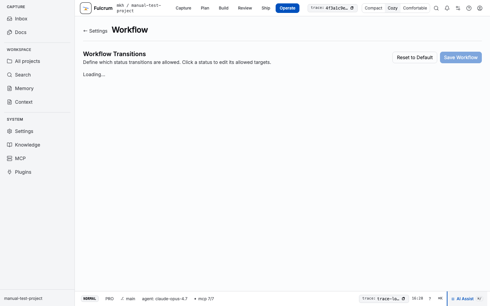](../screenshots/web/89-proj-settings-workflow.png)

Visual workflow-transitions editor. Header `Reset to Default` + `Save Workflow` actions, intro copy "Define which status transitions are allowed. Click a status to edit its allowed targets." Component reads `/api/v1/workflows/transitions/get` then renders a 5-column status grid (Backlog / Unstarted / In progress / Completed / Cancelled). Known issue: the current `WorkflowEditor.svelte` uses legacy Svelte 5 reactivity (`let loading = true` instead of `$state(true)`) so the loading flag does not toggle even after the API resolves; the surface is stuck on "Loading…" until the component is migrated to runes (tracked separately).

| Action | How (web) | How (CLI) | Notes |
|---|---|---|---|
| Edit transitions | click a status pill, toggle targets | `fulcrum workflow patch --project <slug>` | POSTs `/api/v1/workflows/transitions/update` |
| Reset | `Reset to Default` button | `fulcrum workflow reset --project <slug> --methodology <scrum|kanban|none>` | POSTs `/api/v1/workflows/default` |
| Validate | n/a (consumed by board drag) | `fulcrum workflow validate --from <s> --to <s>` | POSTs `/api/v1/workflows/transitions/validate` |

### `/projects/<slug>/settings/views`

[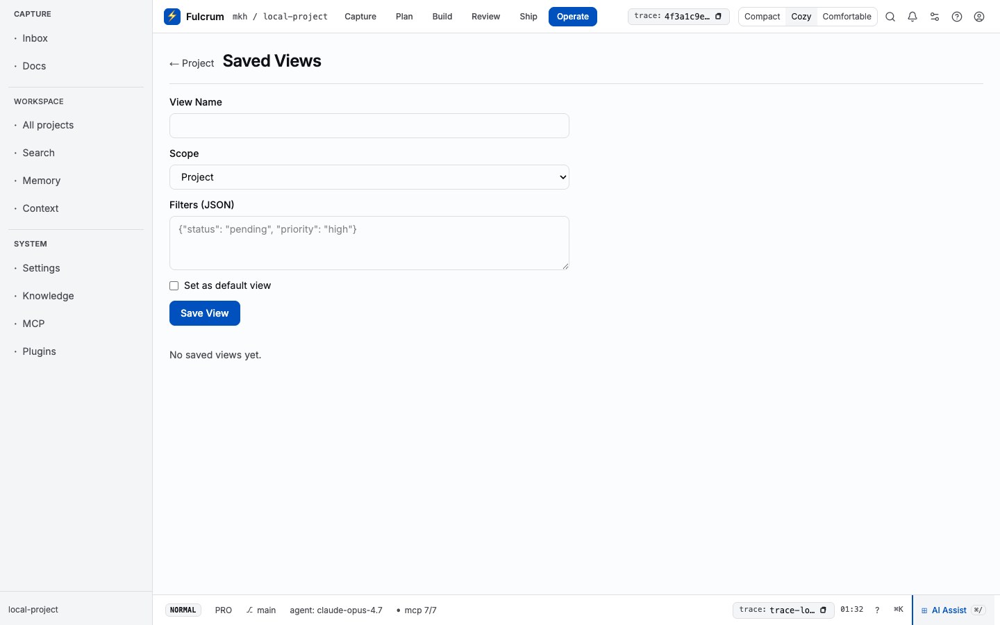](../screenshots/web/90-proj-settings-views.png)

Saved-view definitions. Form: View Name · Scope (`private` / `project` / `org`) · Filters JSON · `Set as default view` · `Save View`. Table lists Name · Scope · Default · Delete. Audit dataset shows `Active sprint board` (scope `project`, default `Yes`, filters `{ sprintId: <sprint1-id> }`) and `High-priority backlog` (scope `project`, default `No`, filters `{ priority: [1,2] }`, sortBy `priority`).

| Action | How (web) | How (CLI) | Notes |
|---|---|---|---|
| Save | fill form + `Save View` | `fulcrum view create --project <slug> --name <n>` | POSTs `/api/v1/saved-views` |
| Set default | checkbox + save | `fulcrum view patch <id> --is-default` | clears other defaults in same project |
| Delete | row `Delete` | `fulcrum view delete <id>` | DELETE |
| Open | row name link | `fulcrum view open <id>` | applies filter to `/board` or `/list` |

### `/projects/<slug>/settings/automations`

[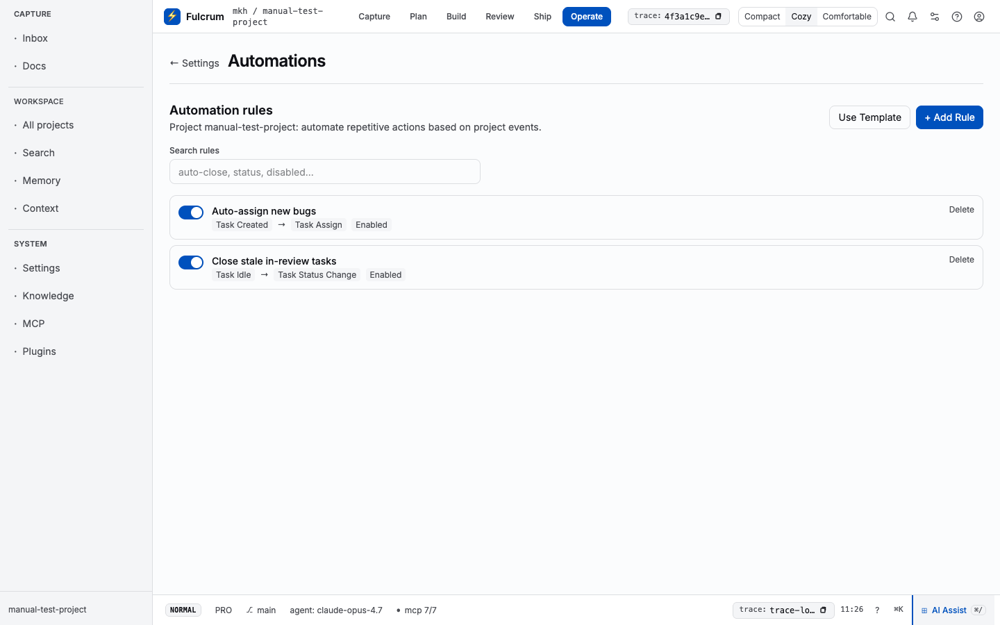](../screenshots/web/91-proj-settings-automations.png)

Automation rules. Header `Automation rules` + `Use Template` + `+ Add Rule`. Search-rules combobox filters by name / status / trigger. Each rule renders as a card with enable/disable toggle. Audit dataset shows `Auto-assign new bugs` (trigger `task.created` where type=bug → action `task.assign` to the admin user) and `Close stale in-review tasks` (trigger `task.idle` daysIdle=7 → action `task.status_change` to `completed`). Backed by `/api/v1/automations`, which the SvelteKit catch-all proxy `apps/web/src/routes/api/v1/[...path]/+server.ts` forwards to the NestJS server so client-side fetches no longer trip on the vite 404 HTML.

| Action | How (web) | How (CLI) | Notes |
|---|---|---|---|
| Add | `+ Add Rule` → rule builder | `fulcrum automation create --project <slug>` | POSTs `/api/v1/automations` |
| Use template | `Use Template` button | `fulcrum automation list-templates` | GET `/api/v1/automations/templates` |
| Toggle | rule card toggle | `fulcrum automation patch <id> --enabled <bool>` | PATCH `enabled` |
| Delete | card overflow menu | `fulcrum automation delete <id>` | DELETE |

### `/projects/<slug>/settings/import`

[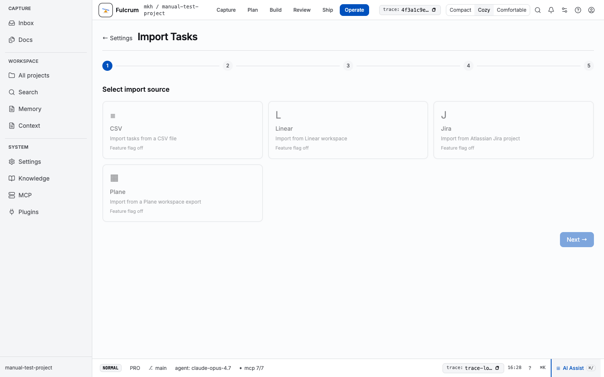](../screenshots/web/92-proj-settings-import.png)

5-step import wizard. Step 1 selects a source: CSV / Linear / Jira / Plane (all gated by their feature flags off by default in the audit dataset, hence the `Feature flag off` chips). Subsequent steps map columns, preview, confirm, and run the import. `Next →` advances; the wizard persists draft state per project.

| Action | How (web) | How (CLI) | Notes |
|---|---|---|---|
| Start | pick a source + `Next →` | `fulcrum import start --project <slug> --source <kind>` | POSTs import draft |
| Upload CSV | step 2 file picker | `fulcrum import csv --file <p>` | multipart upload |
| Map fields | step 3 | `fulcrum import map --draft <id> --map <json>` | PATCHes mapping |
| Run | step 5 `Run import` | `fulcrum import run --draft <id>` | POSTs run |

  

## Capture stage routes

Capture is the first stage in the Capture→Operate workflow rail. Every
flat `/capture*` workspace path resolves under the project-scoped Capture
WorkflowStage (`/<ws>/projects/<projId>/capture[/<sub>]`); the four
sub-views (`docs`, `drafts`, `promoted`, `inbox`) are tabs inside the
same workbench, not standalone routes. Empty-state copy lives in
`apps/web/src/lib/components/app/capture-stage.ts`. The Capture sidebar
group exposes Inbox + Docs (project-scoped) above Workspace / System.

### `/capture`

[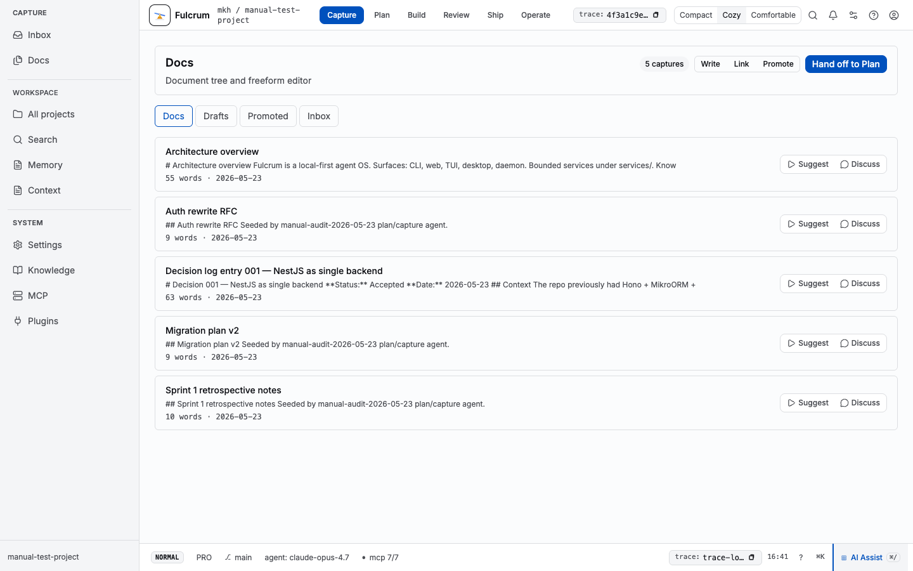](../screenshots/web/01-capture.png)

Workspace-level `/capture` 308-redirects to `/capture/projects` — a
project picker that lets the operator choose which project's Capture
WorkflowStage to enter. Rows show project name, slug, `<N> open` task
count, and `<N> docs` count. Clicking a row navigates to
`/<ws>/projects/<slug>/capture` (the canonical Docs view).

| Action | How (web) | How (CLI) | Notes |
|---|---|---|---|
| Pick project | row click | `fulcrum project use <slug>` | Navigates to Capture WorkflowStage |
| Filter | `Search` box (header) | `fulcrum project list` | Client-side substring |

### `/<ws>/projects/<projId>/capture` — Docs view

[](../screenshots/web/40-stage-capture.png)

Document tree + freeform editor — the default Capture sub-view. Header
shows `Docs · Document tree and freeform editor`, the running capture
count (`<N> captures`), and the universal action strip (`Write`, `Link`,
`Promote`, `Hand off to Plan`). With seeded data the audit dataset
renders 3 captures (Auth rewrite RFC, Migration plan v2, Sprint 1
retrospective notes) each with per-row `Suggest` and `Discuss` mode
buttons. Reads `/api/v1/docs?orgId=…&projectId=<slug>` via
DocumentPublicApiController.

| Action | How (web) | How (CLI) | Notes |
|---|---|---|---|
| Create | `Write` button / `New document` empty-state | `fulcrum doc create --project <slug> --title <t>` | POSTs `/api/v1/docs` |
| Edit | row click → `/docs/<id>` | `fulcrum doc patch <id>` | PATCH `/api/v1/docs/{id}` |
| Link | `Link` button | `fulcrum doc link <docId> <targetId>` | POSTs `/links` |
| Promote | `Promote` button | `fulcrum doc promote <id>` | Moves draft → Plan or Build |
| Hand off | `Hand off to Plan` button | `fulcrum plan handoff --doc <id>` | Opens Plan with `source_doc_id` preset |

### `/<ws>/projects/<projId>/capture/drafts`

[](../screenshots/web/41-stage-capture-drafts.png)

Unsent captures not yet promoted — half-formed ideas that have not been
committed to Plan or Build. Empty-state copy: `No drafts yet.` /
`Drafts collect half-formed ideas. Press c to capture, or hand off from
intake.` Primary action `New draft`; secondary `Open inbox` (keyboard
shortcut `c`).

| Action | How (web) | How (CLI) | Notes |
|---|---|---|---|
| Create | `New draft` button | `fulcrum capture draft create` | POSTs draft to docs API |
| Promote | row `Promote` action | `fulcrum capture promote <id>` | Moves draft → Docs / Plan |
| Discard | row context menu | `fulcrum capture delete <id>` | DELETE `/api/v1/docs/{id}` |

### `/<ws>/projects/<projId>/capture/promoted`

[](../screenshots/web/42-stage-capture-promoted.png)

Captures that moved into a plan or run. Empty-state copy: `No promoted
captures yet.` / `Promotions appear here once a draft moves into Plan or
Build. Promote one from Drafts to start.` Primary action `Open Drafts`;
secondary `Learn more` (keyboard shortcut `g d`).

| Action | How (web) | How (CLI) | Notes |
|---|---|---|---|
| Open Drafts | `Open Drafts` button | `fulcrum capture drafts list` | Navigates to Drafts tab |
| Open source | row click | `fulcrum capture open <id>` | Opens originating capture |

### `/<ws>/projects/<projId>/capture/inbox`

[](../screenshots/web/43-stage-capture-inbox.png)

Intake queue: snooze, accept, decline. Empty-state copy: `Inbox is
clear.` / `New captures arrive here for triage. Capture something to
start.` Primary action `New capture`; secondary `Open Drafts` (keyboard
shortcut `c`).

The workspace-level `/inbox` is a different surface (notification
center), and `/capture/inbox` and `/capture/docs` at the workspace level
correctly 404 — capture intake is project-scoped.

| Action | How (web) | How (CLI) | Notes |
|---|---|---|---|
| Capture | `New capture` button / press `c` | `fulcrum capture create` | POSTs intake item |
| Snooze | row Snooze button | `fulcrum capture snooze <id>` | PATCH intake state |
| Accept | row Accept button | `fulcrum capture accept <id>` | Promotes to Drafts |
| Decline | row Decline button | `fulcrum capture decline <id>` | Closes the intake item |

### `/inbox` — workspace notification inbox

[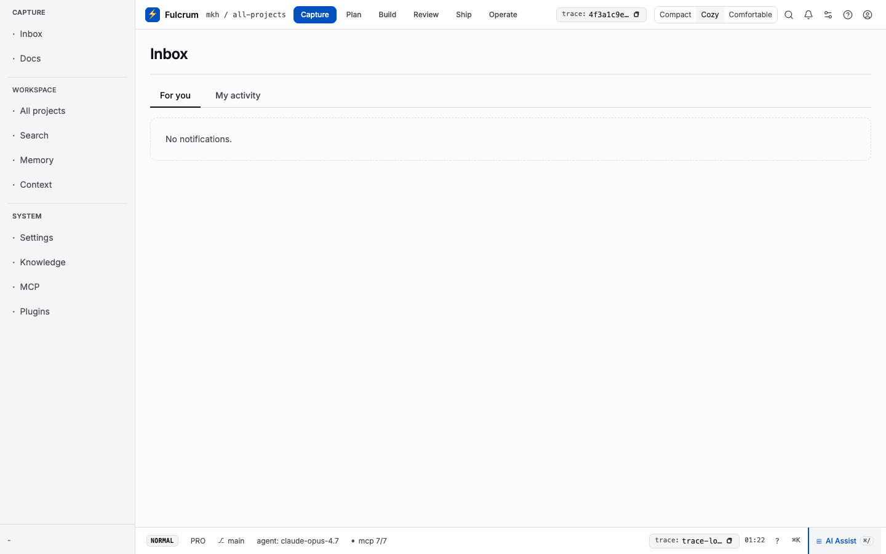](../screenshots/web/15-inbox.png)

Workspace-level notification inbox (notification-center service). Two
tabs: `For you` (notifications fanned out from rule-engine matches) and
`My activity` (audit-log activity for the current user). Empty-state
copy is `No notifications.` when no rules have matched. Distinct from
the Capture stage Inbox tab, which is the per-project capture intake.

| Action | How (web) | How (CLI) | Notes |
|---|---|---|---|
| Mark all read | `Mark all read` button | `fulcrum notify mark-all-read` | POSTs `/api/v1/notifications/mark-all-read` |
| Mark one read | row click / form `markRead` action | `fulcrum notify mark-read <id>` | PATCH `/api/v1/notifications/<id>` |
| Manage rules | `/settings/notifications` | `fulcrum notify rules list` | Rule CRUD UI |
| View activity | `My activity` tab | `fulcrum audit query --user $USER` | Reads `/api/v1/audit/query` |

### `/onboarding` — first-run wizard

[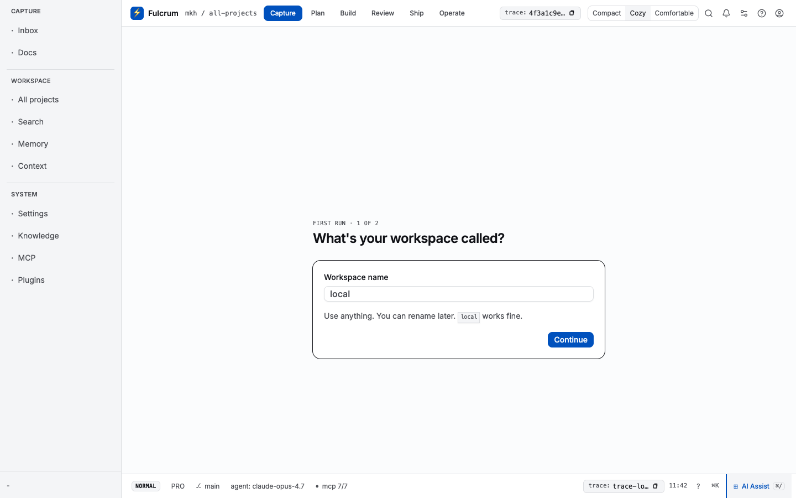](../screenshots/web/35-onboarding.png)

Two-step first-run wizard. Step 1 (`What's your workspace called?`)
seeds the workspace name (default `local`). Step 2 picks the first
project. Subsequent visits redirect into the canonical Capture stage.

| Action | How (web) | How (CLI) | Notes |
|---|---|---|---|
| Set workspace name | `Workspace name` input + `Continue` | `fulcrum workspace patch --name <n>` | PATCH `/api/v1/workspaces/me` |
| Skip | `Continue` with default | n/a | `local` workspace persists |

## Plan stage routes

Plan is the AI-Assist planning workbench between Capture and Build.
Every flat `/planning`, `/plan-session`, `/plan-prompts`,
`/plan-prototypes`, `/plan-templates`, and `/plan-review` workspace path
308-redirects to the canonical project-scoped Plan WorkflowStage at
`/<ws>/projects/<projId>/plan[/<sub>]`. Sub-views (`missions`,
`sessions`, `review`, `prompts`, `prototypes`, `templates`) are
projections of the same plan session, not standalone routes. The Plan
sidebar group exposes Sessions / Missions / Reviews / Prototypes /
Templates / Prompts.

### `/planning`

[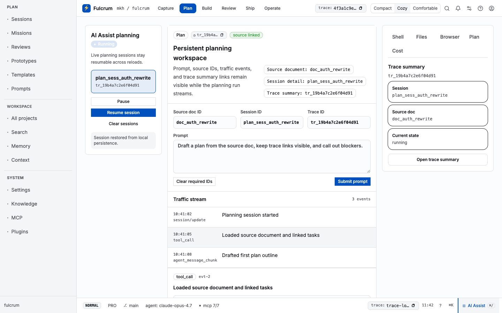](../screenshots/web/42-planning.png)

Persistent planning workbench. Three-column layout: the left column is
the active session card (`AI Assist planning` with `running` /
`paused` badge, plan id, trace id, Pause / Resume / Clear sessions
actions). Centre column carries the workbench: `Source doc ID`,
`Session ID`, `Trace ID` inputs, a `Prompt` textarea, Clear / Submit
controls, and the `Traffic stream` log of session/update, tool_call,
and agent_message_chunk events. Right column is the workspace dock
(Shell / Files / Browser / Plan / Cost tabs) with the trace summary.
Reads the canonical plan session via the workflow-coordination service.

| Action | How (web) | How (CLI) | Notes |
|---|---|---|---|
| Submit prompt | `Submit prompt` button | `fulcrum plan submit --doc <id> --prompt <p>` | POSTs to plan session |
| Pause | session card `Pause` | `fulcrum plan pause <sessionId>` | PATCH session state |
| Resume | session card `Resume session` | `fulcrum plan resume <sessionId>` | PATCH session state |
| Clear sessions | session card `Clear sessions` | `fulcrum plan reset` | Wipes local plan-session cache |
| Open trace | dock `Open trace summary` link | `fulcrum trace show <traceId>` | Navigates to `/trace/<id>` |

### `/plan-session`

Alias for `/planning` — 308-redirects to
`/<ws>/projects/<projId>/plan` (same canonical workbench).

[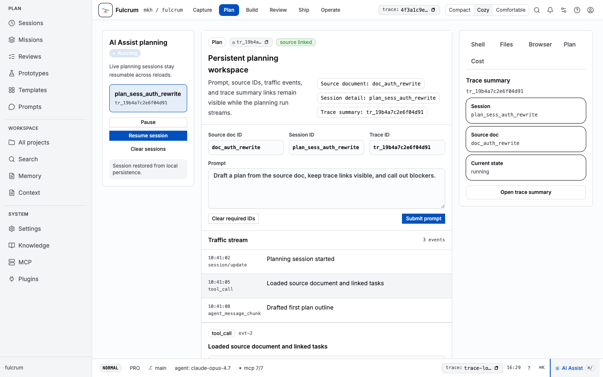](../screenshots/web/47-plan-session.png)

### `/plan-prompts`

[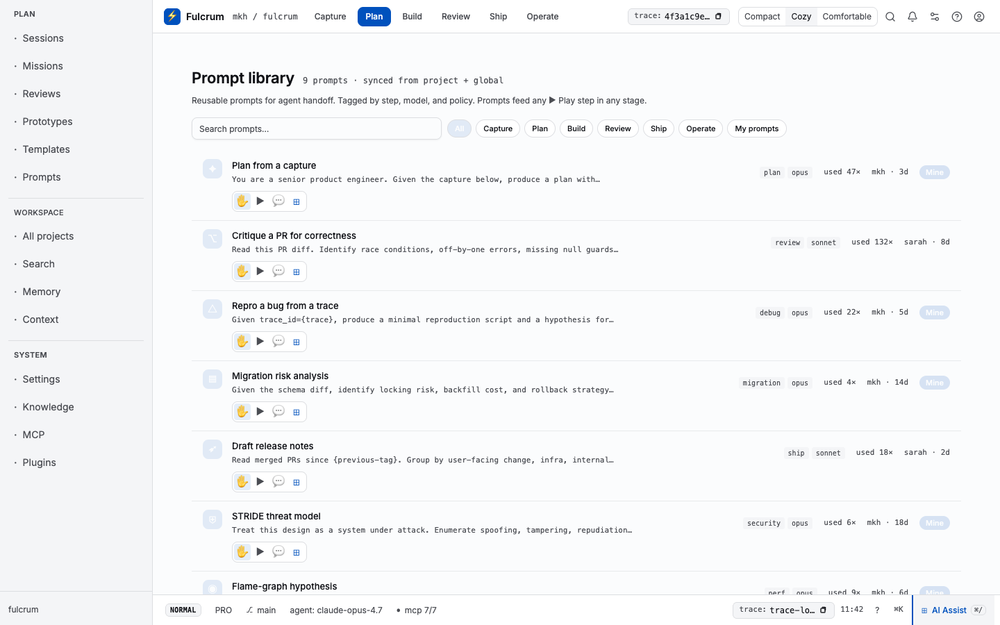](../screenshots/web/43-plan-prompts.png)

`Prompt library · 9 prompts · synced from project + global`. Reusable
prompts for agent hand-off, tagged by step, model, and policy. Header
search box + tag pills (`All`, `Capture`, `Plan`, `Build`, `Review`,
`Ship`, `Operate`, `My prompts`). Each row carries title, two-line
preview, model badge (`opus` / `sonnet`), tag, usage count + relative
age, and the universal ModeRow (`Manual` / `Play` / `Discuss` /
`AI Assist`). Audit dataset shows: Plan from a capture, Critique a PR
for correctness, Repro a bug from a trace, Migration risk analysis,
Draft release notes, STRIDE threat model, Flame-graph hypothesis, +2.

| Action | How (web) | How (CLI) | Notes |
|---|---|---|---|
| Search | `Search prompts…` input | `fulcrum plan prompts list --query <q>` | Substring filter |
| Filter by step | tag pill click | `fulcrum plan prompts list --step <s>` | Tag-scoped list |
| Run | per-row `▶ Play` | `fulcrum plan prompts run <id>` | Dispatches an agent run |
| Discuss | per-row `💬 Discuss` | `fulcrum plan prompts comment <id>` | Opens comment thread |
| Edit | row → detail editor | `fulcrum plan prompts patch <id>` | PATCH prompt body |

### `/plan-prototypes`

[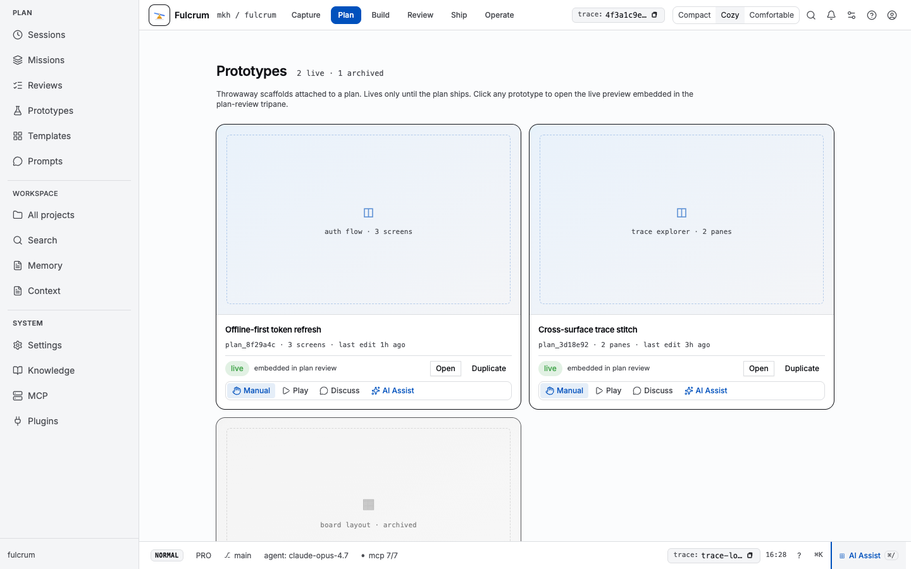](../screenshots/web/45-plan-prototypes.png)

`Prototypes · 2 live · 1 archived`. Throwaway scaffolds attached to a
plan; live only until the plan ships. Audit dataset shows: Offline-first
token refresh (3 screens, last edit 1h ago), Cross-surface trace stitch
(2 panes, last edit 3h ago), Board layout (archived). Each card has
`Open`, `Duplicate`, and the universal ModeRow.

| Action | How (web) | How (CLI) | Notes |
|---|---|---|---|
| Open | card `Open` button | `fulcrum plan prototypes open <id>` | Navigates to `/plan/review` tripane |
| Duplicate | card `Duplicate` button | `fulcrum plan prototypes dup <id>` | Forks the scaffold |
| Archive | per-card context menu | `fulcrum plan prototypes archive <id>` | PATCH state |
| Embed in review | from `/plan-review` `Add prototype` | `fulcrum plan review attach <id>` | Threaded into plan-review tripane |

### `/plan-templates`

[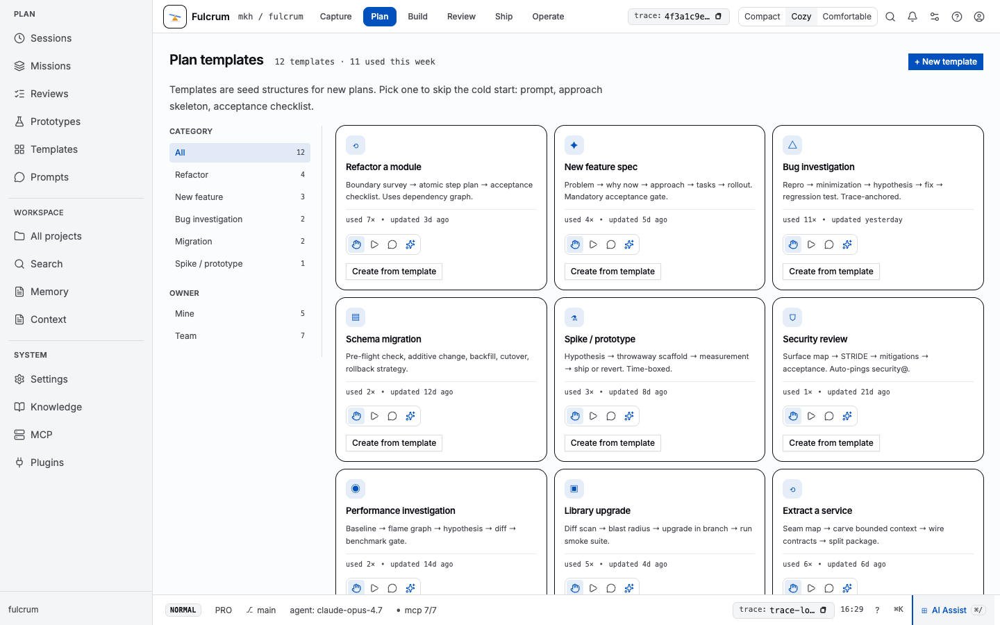](../screenshots/web/46-plan-templates.png)

`Plan templates · 12 templates · 4 used this week`. Reusable plan
structures for new plans. Pick one to skip the cold-start prompt /
approach / breakdown / acceptance criteria. Header carries `+ New
template`. Left rail filters by Category (Refactor, New feature, Bug
investigation, Scheme migration, Spike / prototype, Security review,
Performance investigation, Library upgrade, Extract a service) and
Owner. Each card carries a `Create from template` button.

| Action | How (web) | How (CLI) | Notes |
|---|---|---|---|
| Create from template | card `Create from template` | `fulcrum plan create --template <id>` | Seeds a new plan session |
| New template | header `+ New template` | `fulcrum plan template create` | Opens editor |
| Filter | Category / Owner left rail | `fulcrum plan templates list --category <c>` | Server-side filter |

### `/plan-review`

[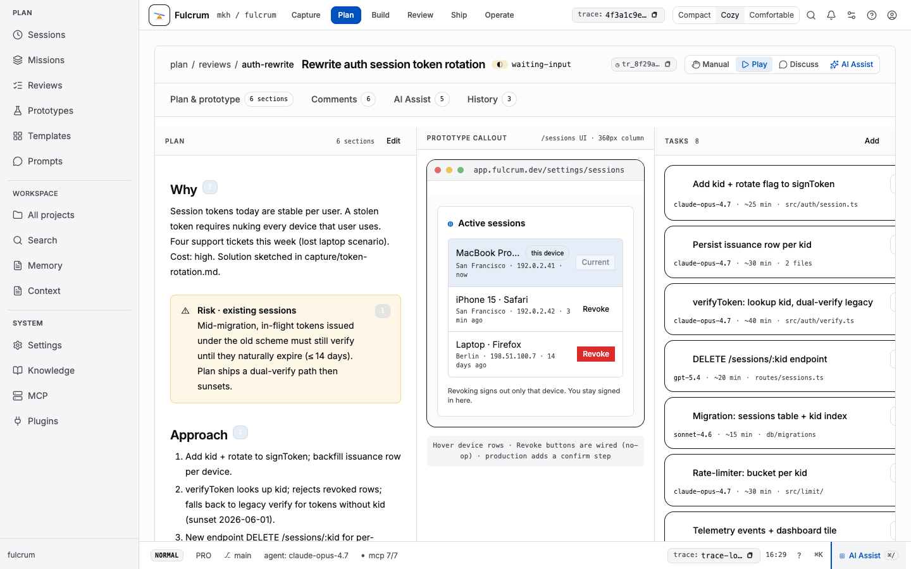](../screenshots/web/48-plan-review.png)

Plan + Prototype + Comments tripane review. The canonical "what-it-does"
plan-review surface. Left pane: the plan content (Why / Approach /
Risks). Middle pane: the embedded live prototype preview. Right pane:
the threaded review comments + active sessions device matrix (Mac, iPad
Air, iPhone 15). Header carries plan title + meta strip (`auth-rewrite`,
last edit timestamp), `Comments`, `AI Assist`, plus the universal
ModeRow (`Manual` / `▶ Play` / `💬 Discuss` / `⊞ AI Assist`).

| Action | How (web) | How (CLI) | Notes |
|---|---|---|---|
| Add prototype | pane header `+ Add prototype` | `fulcrum plan review attach <prototypeId>` | Pulls from `/plan-prototypes` |
| Comment | right pane comment input | `fulcrum plan review comment add <text>` | POSTs threaded comment |
| Resolve | comment row `Resolve` | `fulcrum plan review comment resolve <id>` | PATCH comment state |
| Approve | header `Approve plan` | `fulcrum plan review approve <planId>` | PATCH plan to approved |
| Discuss | universal mode `💬 Discuss` | `fulcrum plan review play <planId>` | Opens scoped AcpDrawer |

## Build stage routes (tasks, boards, runs, orchestration)

All build-stage URLs live on the workspace and consume the public API at
`/api/v1/*`. Most legacy flat routes (`/build-board`, `/build-graph`, …) are
308-redirected to the canonical `/{ws}/projects/{slug}/build/{sub}` paths via
`canonical-stage-redirect.ts`; we keep both addresses documented because the
legacy URLs still exist as OD design-preview surfaces.

### `/tasks`

[](../screenshots/web/01-tasks-list.png)

Flat task list across the workspace. Server load calls `/api/v1/tasks` and
shows 8 seeded `manual-test-project` rows with id, title, priority badge and
canonical status pill (Pending / In progress / Completed). Each row links to
`/tasks/{id}`.

| Action | How (web) | How (CLI) | Notes |
|---|---|---|---|
| Create | `+` button (header) | `fulcrum task create` | POSTs `/api/v1/tasks` |
| Edit | open detail row | `fulcrum task patch <id>` | PATCH `/api/v1/tasks/{id}` |
| Delete | detail row Delete button | `fulcrum task delete <id>` | soft-delete sets `deletedAt` |

### `/tasks/{id}`

[](../screenshots/web/93-task-detail.png)

Task workbench: title + status + priority header, description (Tiptap), Dependency
Run panel (agent / model / trace), Time Tracking, Save / Delete. Drives a real
seeded task (e.g. `1a0b16a9-…`). Lazy-loads the Tiptap editor and the
dependency-tree side panel.

### `/boards`

[](../screenshots/web/02-boards.png)

Workspace-wide kanban. Reads `/api/v1/tasks/board` through `TaskPublicStore`
(canonical `fulcrum_tasks`, slug-or-UUID resolver). Columns are the canonical
status set: Pending · In progress · Blocked · Completed · Cancelled. Seeded
`manual-test-project` renders 3/3/0/2/0 across columns. Header view-switcher
exposes List · Table · Gantt · Calendar.

| Action | How (web) | How (CLI) | Notes |
|---|---|---|---|
| Create | `+ Add task` button per column | `fulcrum task create --status <s>` | column status preselects |
| Move status | drag card between columns | `fulcrum task patch <id> --status <s>` | conflicts return 409 |
| Bulk status | row select + `Bulk` menu | `fulcrum task patch …` | `bulkStatus` form action |
| Delete | row context menu | `fulcrum task delete <id>` | `bulkDelete` form action |

### `/build-graph` and `/agent-dependency-board` (design preview)

[](../screenshots/web/03-build-graph.png)

Legacy URLs that 308-redirect to canonical `/{ws}/projects/fulcrum/build/graph`.
The graph itself is the OD design-preview fixture (AUTH-43 chain, 8 nodes,
Sugiyama layered): hard-coded for visual parity, **not** wired to the public
API. Canonical Build graph for live data is the same surface accessed via the
Build · Graph tab when the surface is rebuilt against `/api/v1/tasks/board`
edges. Do not rewrite the fixture from this audit.

### `/build-board` (design preview)

[](../screenshots/web/04-build-board.png)

OD design-preview kanban (AUTH-42 / AUTH-43 fixture). 308-redirects to
canonical `/{ws}/projects/fulcrum/build/board`. The live Build board is
`/boards` above; this surface stays fixture-only.

### `/build-list` (design preview)

[](../screenshots/web/94-build-list.png)

OD design-preview list view (FUL-1284 … FUL-1310 fixture). 308-redirects to
`/{ws}/projects/fulcrum/build/list`. Fixture-only.

### `/build-timeline` (design preview)

[](../screenshots/web/95-build-timeline.png)

OD design-preview Gantt. 308-redirects to `/{ws}/projects/fulcrum/build/gantt`.
Fixture-only.

### `/build-runs` (design preview)

[](../screenshots/web/96-build-runs.png)

OD design-preview runs feed (AUTH-43 with transcript and diffs).
308-redirects to `/{ws}/projects/fulcrum/build/runs`. Fixture-only; the live
runs list is `/runs` below.

### `/agents`

[](../screenshots/web/20-agents.png)

Workspace agents surface — Session workbench + Connect to agent form (Mode:
Planning · Build · Review; Runtime: Agent default · Fast · Deep). Empty state
copy: "No saved sessions yet. Create a new session to Begin." Sessions are
persisted by AI-Assist; "No agents configured" until an agent profile is added.

| Action | How (web) | How (CLI) | Notes |
|---|---|---|---|
| Start session | `Create Session` button | `fulcrum agent session create` | mode + runtime form |
| Connect agent | `Connect to agent` panel | `fulcrum agent add <name>` | requires command / URL |

### `/runs`

[](../screenshots/web/21-runs.png)

Live agent runs across the workspace. Load reads `/api/v1/runs/page-data`.
With zero seeded runs the view shows the empty state "No agent runs match
the current filters." Header has Search, Dispatch (project · kind · agent
selector + Dispatch button), and Live run controls (`Reassign agent`).
Filter bar: agent · status · project · range · date-from · date-to.

| Action | How (web) | How (CLI) | Notes |
|---|---|---|---|
| Dispatch | Dispatch dropdown + button | `fulcrum run dispatch` | POSTs `/api/v1/runs` |
| Cancel | row context | `fulcrum run cancel <id>` | POSTs `/api/v1/runs/{id}/cancel` |
| Retry | row context | `fulcrum run retry <id>` | POSTs `/api/v1/runs/{id}/retry` |
| Reassign agent | `Reassign agent` button | n/a | live run only |

> **Known issue (BUG-runs-create):** `POST /api/v1/runs` currently 500s with
> `column FulcrumJob.trace_id does not exist`. The `JobQueue1778751000000`
> migration defines the column but existing PGlite stores were created before
> it was added. Re-run the migration set or drop `fulcrum_jobs` and re-init.
> Until then the empty-state screenshot is canonical.

### `/run-detail` · `/run-cancel` · `/run-fork` · `/run-cost-tracking` · `/run-rate-limits` · `/run-retry-policy` · `/run-retry-prompt`

[](../screenshots/web/98-run-detail.png)

All seven legacy flat run-* routes 308-redirect to the canonical run-detail
surface `/{ws}/projects/fulcrum/build/runs/run_56e3d12` (an OD fixture
identifier). The redirect target is the Build · Runs surface, which shows
OBS-12 transcript, tool-call cards, inline diffs, and (when live) cancel /
fork / retry / cost / rate-limit / retry-policy / retry-prompt affordances on
the same page. Use the canonical URL pattern for new links; the legacy
addresses exist for back-compat only.

### `/orchestration`

[](../screenshots/web/23-orchestration.png)

Orchestrator dashboard. Stats row: Last tick · Worker (connected?) ·
Concurrency (used / max) · Last sync. Sections: Recent dispatches · Retry
queue. With no seeded jobs both sections show their empty state ("No
dispatches yet." / "No runs awaiting retry."). Filter by project.

| Action | How (web) | How (CLI) | Notes |
|---|---|---|---|
| Filter | Project select | `fulcrum orchestration list --project <slug>` | |
| Cancel dispatch | row context | `fulcrum run cancel <id>` | same path as `/runs` |
| Retry from queue | row context | `fulcrum run retry <id>` | same path as `/runs` |

## Review stage routes

The Review stage exposes one production queue surface and four ancillary
review affordance surfaces. All `/review*` and `/comments*` paths share
the Review stage rail. `/review`, `/review-queue` 308-redirect to the
canonical `/<ws>/projects/<projId>/review`; the remaining surfaces
resolve under the Review StageRail with their own sub-paths.

### `/review`

[](../screenshots/web/04-review.png)

Production review queue: the intake list of PRs / review sessions
awaiting an operator decision. Head shows live count ("3 awaiting review
· 2 merged today"). Four-tab lifecycle strip — `Awaiting review` /
`Changes requested` / `Approved` / `Merged today` — drives a canonical
`WorkflowStatus` for each row. Re-homes the `/review-search`
kind/author/status facets into per-tab filters (no feature loss). Each
row carries a four-dot pre-merge check ribbon (lint/test/bench/a11y),
stacked reviewer avatars, `StatusBadge`, relative age, and the universal
ModeRow (`Manual` / `Play` / `Discuss` / `⊞ AI Assist`). Empty state
copy reconciled to `COPY.md` (`No reviews waiting.`).

| Action | How (web) | How (CLI) | Notes |
|---|---|---|---|
| Filter by tab | Click `Awaiting review` / `Changes requested` / `Approved` / `Merged today` | `fulcrum review list --status=<state>` | Tab pill carries count |
| Filter by kind | `Kind` select (`diff`/`plan`/`prototype`/`annotation`/`feedback`) | `fulcrum review list --kind=<kind>` | Re-homed from `/review-search` |
| Filter by author | `Author` text input | `fulcrum review list --author=<id>` | Substring match |
| Open review | Click row | `fulcrum review open <key>` | Loads `/review/<reviewId>` workbench |
| Hand to agent | Per-row `▶ Play` mode | `fulcrum review play <key>` | Dispatches an agent run |
| AI Assist | Per-row `⊞ AI Assist` mode | n/a | Opens scoped AcpDrawer |

### `/review-queue`

Redirects (308) to `/<ws>/projects/<projId>/review`. Legacy alias for
deep links into the queue; resolves to the same surface as `/review`.

[](../screenshots/web/51-review-queue.png)

### `/review-search`

[](../screenshots/web/52-review-search.png)

Cross-source review search across plans, diffs, prototypes, annotations,
and feedback. Filter facets: `Kind` (`all`/`plan`/`diff`/`prototype`/
`annotation`/`feedback`), `Status` (`any`/`open`/`resolved`/`blocker`),
`Author` (text), and `Source` toggle (`main`/`split`). Renders 6 seeded
matches as cards with `Jump to <kind>` actions wired to the appropriate
workbench (plan section, diff hunk, prototype artifact, annotation
target).

**Migration disposition**: this route's kind/status/author facets are
re-homed into the `/review` queue tab + filter model
(`design-alignment/review.md` §review-queue). The route stays as a
demo / search-tool surface.

| Action | How (web) | How (CLI) | Notes |
|---|---|---|---|
| Search | Type in the query input | `fulcrum review search "<text>"` | Full-text across all sources |
| Filter by kind | `Kind` select | `--kind=<kind>` | Same vocabulary as `/review` tabs |
| Filter by status | `Status` select | `--status=<state>` | `open` / `resolved` / `blocker` / `any` |
| Filter by author | `Author` text input | `--author=<id>` | Substring match |
| Jump to source | `Jump to <kind>` button | `fulcrum review open <id>` | Navigates to the originating workbench |

### `/review-templates`

[](../screenshots/web/53-review-templates.png)

Reusable structured feedback templates for planning, UAT, and code
review. Five built-in templates: `missing-criteria`, `stale-context`,
`prototype-mismatch`, `test-gap`, `code-risk`. Each template has a
`Scope` (`all`/`workspace`/`planning`/`uat`/`code-review`), a set of
placeholder fields, and a body that renders against the filled fields.
`Render` previews the message; `Submit` posts it as a review comment.
The custom-template panel below adds named templates with arbitrary
placeholder bodies.

**Migration disposition**: the five built-in templates are absorbed
into the Review workbench Comments-panel template picker
(`design-alignment/review.md`). This route stays as the
template-library management surface — no feature loss.

| Action | How (web) | How (CLI) | Notes |
|---|---|---|---|
| Pick template | `Template` select | `fulcrum review template list` | Seeds the form with placeholders |
| Filter by scope | `Scope` select | n/a | Library-management filter |
| Render preview | `Render` button | `fulcrum review template render --id=<id>` | Shows the resolved body |
| Submit comment | `Submit` button | `fulcrum review comment add --template=<id>` | Posts to the active review |
| Add custom | `Add custom template` | `fulcrum review template create` | Workspace-scoped by default |

### `/comments`

[](../screenshots/web/54-comments.png)

Task context panel demonstration: the Review-comment-aware task detail
surface (`Task context panel` heading). Renders the four related-card
strip (Blocks · Blocked by · Latest run · Doc), an editable
title/description with autosave status pills (`Title saved`,
`Description saved`), a Properties panel (State / Priority / Assignee /
Sprint / Module / Labels), and a Related tasks/runs grid. The right
panel shows the active task FUL-132 with its description, properties,
labels, and downstream runs. Comments themselves are seeded via
`POST /api/v1/comments/create` on real tasks.

Seeded for the audit: 2 task comments on `manual-test-project` tasks
(`383b6fe2-9728-4f0a-8622-bcfface8f2ce` — open;
`7a1ef580-d78a-42b3-b434-a1ccdf16fde7` — resolved).

| Action | How (web) | How (CLI) | Notes |
|---|---|---|---|
| Create | Inline composer (per task) | `POST /api/v1/comments/create` | `body` is rich tiptap JSON |
| Edit | Inline edit | `POST /api/v1/comments/update` | Author-only |
| Resolve | Row context menu | `POST /api/v1/comments/resolve` | Marks `resolved=true` |
| Unresolve | Row context menu | `POST /api/v1/comments/unresolve` | Reverts resolve |
| React | Emoji picker | `POST /api/v1/comments/add-reaction` | Emoji is required |
| Subscribe | `Watch` toggle | `POST /api/v1/comments/subscribe` | Notifies on new replies |
| Delete | Row context menu | `POST /api/v1/comments/delete` | Author-only |

### `/comments-block-thread`

[](../screenshots/web/55-comments-block-thread.png)

Block-anchored doc comment threads: the doc-version-review surface.
Each row is a selection-anchored thread on a document line (`L12`,
`L19`, `L27`). Active threads carry a `Thread (n)` action; resolved
threads fade and show a checkmark instead. The selection-anchored
resolvable-thread responsibility is promoted to the
`@fulcrum/ui-kit` `CommentThread` primitive, which the Review workbench
consumes for inline diff annotations.

| Action | How (web) | How (CLI) | Notes |
|---|---|---|---|
| Open thread | `Thread (n)` button | n/a | Opens the inline comment editor |
| Reply | Comment composer inside the thread | n/a | Anchored to the selection |
| Resolve | `Resolve` button in thread | n/a | Resolved threads fade to dim |
| Unresolve | `Re-open` in resolved-thread context menu | n/a | Restores active state |

## Ship stage routes

The Ship stage groups three surfaces under one workflow: the artifact
release workbench (`/ship`), the release timeline archive
(`/ship-archive`), and the legacy generic artifact list (`/artifacts`,
which 301-redirects to `/ship`). All Ship routes share the Ship stage
rail.

### `/ship`

[](../screenshots/web/05-ship.png)

Ship stage workbench: the release table. Toolbar shows live count
("7 releases · 1 in flight · channel stable"), a segmented
Channel/Sort/Filter group, and the primary `Cut release` action
(`⌘R`). Each row carries the release artifact name, channel
(`stable`/`canary`), `StatusBadge` (`Running` / `Completed` /
`Cancelled` / `Failing`), check ribbon (`✓ 12 · ✗ 1`), author, promoted
time, trace id, size, and a per-row ModeRow. A row click opens the
List+Detail peek-overview (Release / Checks / Includes / Timeline) with
`Roll back` / `Pause rollout` / `Open run feed` / `Promote` actions.

Confirmation tiers: `Cut release` / `Pause rollout` / `Promote to 100%`
use the inline 3-2-1 countdown (`COPY.md` §4); `Roll back` is the
destructive tier with explicit inline confirmation.

| Action | How (web) | How (CLI) | Notes |
|---|---|---|---|
| Cut release | `Cut release` button (`⌘R`) | `fulcrum ship release cut` | 3-2-1 countdown |
| Promote | Per-row peek `Promote` | `fulcrum ship release promote --id=<id>` | Inline confirm |
| Pause | Per-row peek `Pause rollout` | `fulcrum ship release pause --id=<id>` | Reversible |
| Roll back | Per-row peek `Roll back` | `fulcrum ship release rollback --id=<id>` | Destructive — text confirm |
| Filter | `Channel` / `Filter` toolbar | `fulcrum ship list --channel=<c>` | Defaults: channel `stable` |
| Sort | `Newest` toolbar segment | `fulcrum ship list --sort=<key>` | Default: `Newest` |
| Open peek | Row click | `fulcrum ship show <id>` | List+Detail peek, no route change |
| Open run feed | Per-row peek `Open run feed` | `fulcrum runs show --release=<id>` | Cross-stage navigation |

### `/ship-archive`

[](../screenshots/web/56-ship-archive.png)

Release archive: vertical timeline of past releases grouped by date
bucket. Head shows live count ("6 releases · last 90 days"). Each
release card carries a semver `tag-pill` (e.g. `v0.18.0`), a title, a
summary paragraph, a metadata row (`commit <sha>` · `<n> PRs merged` ·
`<n> LOC`), the author handle, and the per-row ModeRow. The connector
rail draws date dots + lines via CSS pseudo-elements per OD
`ship-archive.html`.

Empty state copy reconciled to `COPY.md` §72: `No releases shipped.`

| Action | How (web) | How (CLI) | Notes |
|---|---|---|---|
| Filter window | Date-range picker (planned) | `fulcrum ship archive --since=<ts>` | Default: last 90 days |
| Open release | Click release card | `fulcrum ship show <tag>` | Loads release detail |
| Open run feed | Per-row `▶ Play` mode | `fulcrum runs show --release=<id>` | Cross-stage |
| Discuss | Per-row `💬 Discuss` mode | n/a | Inline thread |
| AI Assist | Per-row `⊞ AI Assist` mode | n/a | Scoped AcpDrawer |

### `/artifacts`

[](../screenshots/web/57-artifacts.png)

Legacy generic artifact list. The list view is re-homed to the Ship
stage workbench (`/ship`): `+page.server.ts` issues a
**301 MOVED_PERMANENTLY** redirect carrying the original query string
forward, so a bookmarked `/artifacts?mime=…` lands on the same filtered
Ship view.

**No feature loss for mutation endpoints**: the `upload` and `bulk`
(archive/delete) server actions and the `/artifacts/[id]/download`
endpoint are preserved at their existing paths — only the *list* moved.

Seeded for the audit: 2 artifacts under `manual-test-project`
(`artifact-3215e85e-7457-42d1-ac7e-7ac52afd83a9` — PDF, "Release notes
0.18.0"; `artifact-92fd1ff0-0cf1-42c0-ae21-378b1bf050e5` — ZIP,
"Compliance evidence bundle"). Both auto-emit an `artifact / created`
audit event visible at `/audit`.

| Action | How (web) | How (CLI) | Notes |
|---|---|---|---|
| List | `/ship` (redirected from `/artifacts`) | `fulcrum artifacts list` | Filter by `mime`/`kind`/`lifecycle` |
| Upload | `POST /artifacts` form action | `fulcrum artifacts upload <path>` | Carries `traceId` + `projectId` |
| Bulk archive | `POST /artifacts?/bulk action=archive` | `fulcrum artifacts archive --ids=<...>` | Soft delete |
| Bulk delete | `POST /artifacts?/bulk action=delete` | `fulcrum artifacts delete --ids=<...>` | Hard delete |
| Download | `GET /artifacts/<id>/download` | `fulcrum artifacts download <id>` | Streams body + checksum |

## Audit

### `/audit`

[](../screenshots/web/19-audit.png)

Audit log: the immutable event stream for the workspace. Filter by
`Actor`, `Event kind`, `Verb`, `Project`, date range (`From` / `To`),
and free-text `Reason / text`. Renders a server-paginated table
(time / actor / kind / subject / verb). Read-model from
`GET /api/v1/audit?orgId=<org>` (see
`services/workflow-coordination/src/interface/http/audit-public-api.controller.ts`).
`Export CSV` / `Export JSON` actions stream the filtered set.

Audit events auto-populate as side effects of public-API mutations
(artifact upload, task patch, document edit, run dispatch, etc.). The
seeded sample shows two `artifact / created` events from the artifacts
seeded above.

| Action | How (web) | How (CLI) | Notes |
|---|---|---|---|
| Filter by actor | `Actor` input | `fulcrum audit list --actor=<id>` | `system` for unattributed |
| Filter by kind | `Event kind` input | `--kind=<kind>` | `task`/`doc`/`run`/`artifact`/... |
| Filter by verb | `Verb` input | `--verb=<v>` | `created`/`updated`/... |
| Filter by project | `Project` input | `--project=<id>` | UUID, not slug |
| Filter by date | `From` / `To` date pickers | `--since=<ts>` / `--until=<ts>` | Inclusive |
| Export CSV | `Export CSV` button | `fulcrum audit export --format=csv` | Streams attachment |
| Export JSON | `Export JSON` button | `fulcrum audit export --format=json` | Streams attachment |
| Set retention | n/a (settings) | `fulcrum audit retention set --days=<n>` | Per-org policy |

## Operate stage routes

Operate covers the live-running supervisor surfaces: subsystem health, MCP servers, plugin packs, alerts, telemetry, repos, and the local inference sidecar. Six legacy top-level paths (`/operate`, `/operate-mcp`, `/operate-plugins`, `/operate-alerts`, `/operate-telemetry`, `/doctor`) all 308-redirect to their canonical IA position under `/<ws>/projects/<projId>/operate/<sub>` and render the same workbench. The legacy paths remain stable for bookmarks and external links.

### `/operate`

[](../screenshots/web/06-operate.png)

308 to `/<ws>/projects/<projId>/operate/doctor` — Operate's default sub-view per `STAGE_DEFAULT_SUB` in `apps/web/src/lib/components/app/route-map.ts`. Renders the `Doctor · system health` workbench: a status row (subsystems passing / failing / degraded / failed / last check) on top, then a table of every subsystem with status badge, latency, accuracy, latest event, and per-subsystem actions (`Logs` / `Probe` / `Run fix`). Data comes from the doctor read-model exposed by the platform-core public API (mirrors `fulcrum doctor`).

| Action | How (web) | How (CLI) | Notes |
|---|---|---|---|
| List subsystems | `/operate` (auto-redirects to `/<ws>/projects/<projId>/operate/doctor`) | `fulcrum doctor` | Same checks both sides |
| Probe one subsystem | `Probe` button per row | `fulcrum doctor --only <id>` | Re-runs the single check |
| Run an auto-fix | `Run fix` button per row | `fulcrum doctor --run-fix=<id>` | Side-effects logged to `/audit` |
| Open subsystem logs | `Logs` button per row | `fulcrum doctor logs <id>` | Stream from `~/.fulcrum/logs/` |

### `/operate-mcp` and `/operate/mcp`

[](../screenshots/web/22-operate-mcp.png)

Per-CLI-agent MCP server registry. Top-of-page summary reads `N registered · X passing · Y failing · scoped to <agent>`. Below that, a **scope selector** as a `radiogroup` chips every configured CLI agent (Claude Opus / Sonnet / GPT / Gemini / OpenCode / Pi / Codex); switching the chip swaps the table for that agent's registry. Each row carries: server name + protocol/URL or command, `StatusBadge` (passing / failing / down), tool count, p50 / p99 RTT, auth (token / oauth / none), last probe time, and actions (`Probe`, `Logs`, compact `ModeRow` for default workflow mode). DESIGN.md §11 item 9 enforces per-agent scoping; new agents are added via `/settings#agents`.

| Action | How (web) | How (CLI) | Notes |
|---|---|---|---|
| List MCP servers | `/operate/mcp` table | `fulcrum mcp list --agent <id>` | Scoped per CLI agent |
| Add server | `Add server` button (top right) | `fulcrum mcp add --agent <id> --name <name> --protocol http\|stdio` | Form supports HTTP URL+port and stdio command+args+env |
| Probe one | `Probe` button per row | `fulcrum mcp probe <id>` | Updates last-probe stamp and tool count |
| Probe all | `Probe all` button (top right) | `fulcrum mcp probe --all` | Sequential probe over the agent's registry |
| Show tools | `Show tools` after a probe | `fulcrum mcp tools <id>` | Lists `name / description / input-schema preview` |
| Set default mode | `ModeRow` per row | `fulcrum mcp mode <id> <manual\|auto\|review>` | Persisted in the agent's MCP config |

### `/operate-plugins` and `/operate/plugins`

[](../screenshots/web/23-operate-plugins.png)

Per-CLI-agent plugin registry. Counts row reads `N installed · X enabled · Y queued · scoped to <agent>`. Tabs filter the grid (`Enabled` / `All` / `Updates available` / `By me`). Cards show plugin name + version, install scope, summary, owner, last-updated, and per-card actions (`Enable / Disable`, `Configure`, `Open`). The same scope selector as MCP is used to switch which agent's plugin set the view shows. `Install plugin` button (top right) opens the registry wizard.

| Action | How (web) | How (CLI) | Notes |
|---|---|---|---|
| List plugins | `/operate/plugins` cards | `fulcrum plugins list --agent <id>` | Per-agent |
| Install | `Install plugin` (top right) | `fulcrum plugins install <pkg>` | Pulls from the configured marketplace |
| Enable / Disable | toggle per card | `fulcrum plugins enable\|disable <id>` | Persisted in the agent's plugin config |
| Configure | `Configure` per card | `fulcrum plugins configure <id>` | Opens the plugin's settings panel |
| Update | `Updates available` tab | `fulcrum plugins update <id>` | When newer version is in marketplace |

### `/operate-alerts` and `/operate/alerts`

[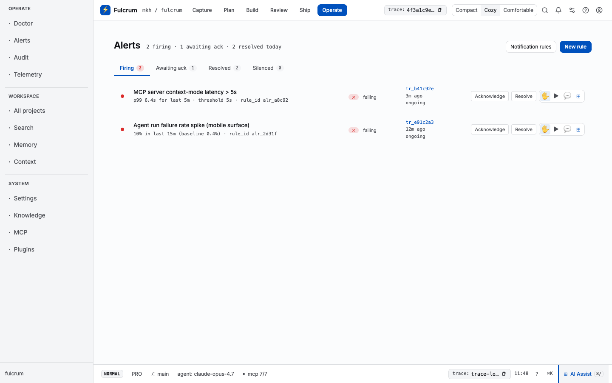](../screenshots/web/62-operate-alerts.png)

Alert center. Header reads `N firing · M awaiting ack · K resolved today` plus `Notification rules` and `New rule` buttons. Tabs (`Firing` / `Awaiting ack` / `Resolved` / `Silenced`) filter the alert list. Each row shows: severity dot, alert title (`MCP server context-mode latency > 5s`), threshold + rule id, a `StatusBadge` (failing / passing / pending), associated `traceId`, age, current state (`ongoing` / `acknowledged` / `resolved`), and inline actions (`Acknowledge`, `Resolve`, compact `ModeRow` for routing mode). Alert rules wire into `/settings/notifications` for routing channels.

| Action | How (web) | How (CLI) | Notes |
|---|---|---|---|
| List firing alerts | `Firing` tab | `fulcrum alerts list --state=firing` | Default tab |
| Acknowledge | `Acknowledge` per row | `fulcrum alerts ack <id>` | Moves alert to `Awaiting ack` |
| Resolve | `Resolve` per row | `fulcrum alerts resolve <id>` | Moves to `Resolved` |
| Add a rule | `New rule` (top right) | `fulcrum alerts rule add ...` | Threshold + channel routing |
| Configure routing | `Notification rules` (top right) | n/a (web only) | Channels per severity |

### `/operate-telemetry` and `/operate/telemetry`

[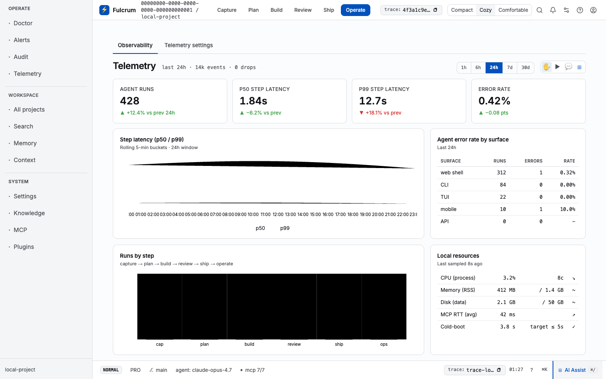](../screenshots/web/63-operate-telemetry.png)

Observability dashboard with two top tabs: `Observability` (default) and `Telemetry settings`. Header reads `last 24h · Nk events · M drops` with a time-window picker (`1h / 6h / 24h / 7d / 30d`). Four KPI cards: `Agent runs`, `p50 step latency`, `p99 step latency`, `Error rate`, each carrying a delta vs. previous window. Below: a `Step latency (p50 / p99)` rolling-5-min chart over the selected window, a per-surface error-rate table (`web shell` / `CLI` / `TUI` / `mobile` / `API`), a `Runs by step` bar chart across `capture → plan → build → review → ship → operate`, and a `Local resources` panel (CPU / memory / disk / MCP RTT avg / cold-boot). Wires into the OpenTelemetry pipeline configured at `/settings/telemetry`.

| Action | How (web) | How (CLI) | Notes |
|---|---|---|---|
| Switch window | `1h / 6h / 24h / 7d / 30d` | `fulcrum telemetry --since=24h` | Persists in URL |
| Inspect surface error rate | `Agent error rate by surface` table | `fulcrum telemetry errors --by surface` | One row per surface |
| Configure exporter | `Telemetry settings` tab | `fulcrum telemetry config` | OTel endpoint, sampling |

### `/doctor`

[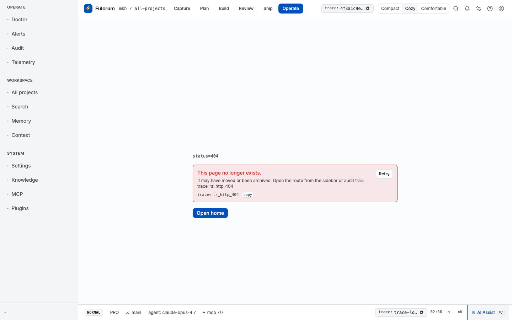](../screenshots/web/26-doctor.png)

308 to `/<ws>/projects/<projId>/operate/doctor` — workspace-level doctor is the same view as the Operate stage Doctor. Mirrors the `fulcrum doctor` CLI 1:1 by design, so a check that fails on the CLI fails here too. The web variant adds inline `Run fix` and `Logs` actions; the CLI prints the same fix recipe via `--run-fix=<id>`.

| Action | How (web) | How (CLI) | Notes |
|---|---|---|---|
| Run all checks | `Run all` button (top right of doctor) | `fulcrum doctor` | Sequential probe |
| Run one fix | `Run fix` per row | `fulcrum doctor --run-fix=<id>` | E.g. `pglite-rebuild` |
| Open subsystem logs | `Logs` per row | `fulcrum doctor logs <id>` | Stream `~/.fulcrum/logs/` |

### `/repos`

[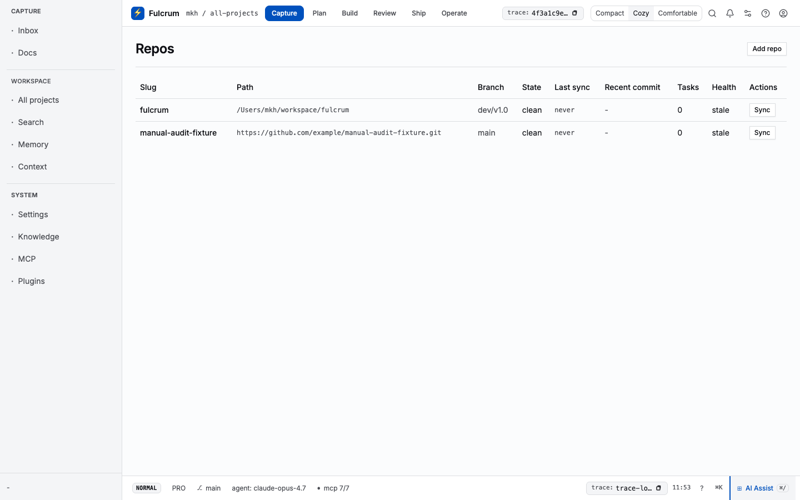](../screenshots/web/64-repos.png)

Workspace-wide repo list. Each row shows: `Slug`, `Path` (local fs path for `kind=local`, remote URL for `kind=remote`), `Branch`, dirty `State`, `Last sync`, `Recent commit`, `Tasks` (open count linked to this repo), `Health` (`healthy` / `stale` / `failed`), and a `Sync` action. The page is a pure invocation layer over `GET /api/v1/repos?orgId=<org>` (no direct DB access from `apps/web`). `Sync` posts to `POST /api/v1/repos/<id>/sync` and tail-updates `last_sync_at` once the integration-hub finishes. The seeded set includes `/Users/mkh/workspace/fulcrum` (local, branch `dev/v1.0`) and a remote fixture.

| Action | How (web) | How (CLI) | Notes |
|---|---|---|---|
| List repos | `/repos` table | `fulcrum repos list` | Org-scoped |
| Add a repo | `Add repo` (top right) | `fulcrum repos add --kind local --path <p>` | Local or remote |
| Sync | `Sync` per row | `fulcrum repos sync <id>` | Updates branches, commits, last-sync-at |
| Open a repo | row link to `/repos/<id>` | `fulcrum repos show <id>` | Branches + commits + files |
| Unregister | row context menu (detail page) | `fulcrum repos rm <id>` | Soft-delete (`archived=true`) |

### `/inference`

[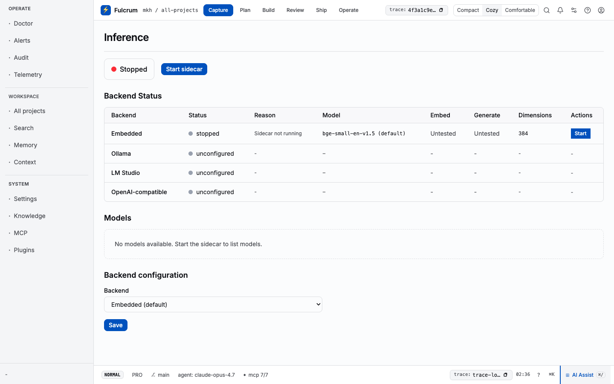](../screenshots/web/27-inference.png)

Local inference sidecar control panel. Top row shows the sidecar state (`Stopped` / `Running`) + `Start sidecar` / `Stop sidecar` button. The `Backend Status` table lists every supported backend (Embedded / Ollama / LM Studio / OpenAI-compatible) with status, reason, current model, embed / generate capability badges, dimensions, and per-backend actions. Below that, the `Models` panel lists models loaded in the sidecar (empty until sidecar starts). The `Backend configuration` form picks which backend is the default. Read-model from `GET /api/v1/inference/health` + `/api/v1/inference/backends`; backend probes via `GET /api/v1/inference/backends/probe`.

| Action | How (web) | How (CLI) | Notes |
|---|---|---|---|
| Start sidecar | `Start sidecar` button | `fulcrum inference start` | Spawns the local sidecar |
| Switch backend | `Backend configuration` select + `Save` | `fulcrum inference config --backend <id>` | Persists in app config |
| Probe a backend | row action | `fulcrum inference probe <id>` | Updates status / dimensions |
| Test provider | `Backend configuration` (advanced) | `fulcrum inference provider test` | One-shot embed/generate call |

### `/inference-models`

[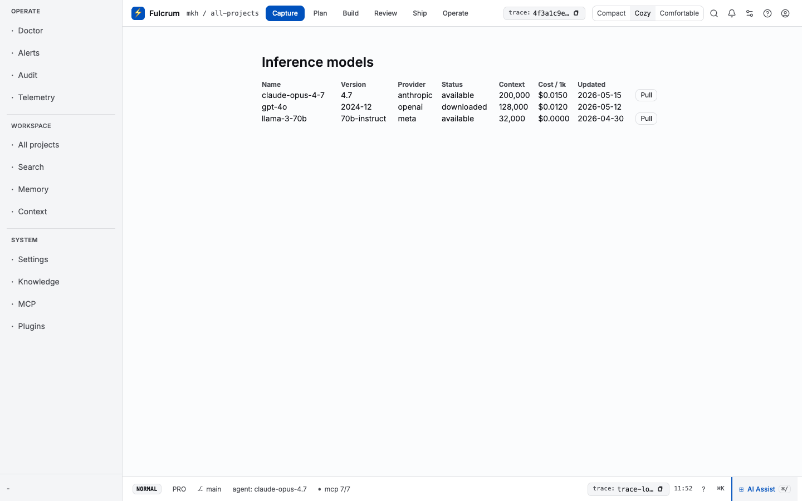](../screenshots/web/28-inference-models.png)

Model catalog across providers. Table columns: `Name`, `Version`, `Provider` (`anthropic` / `openai` / `meta` / …), `Status` (`available` / `downloaded` / `pulling`), `Context` window (tokens), `Cost / 1k`, `Updated`. Per-row `Pull` action queues a download (no-op for cloud providers). Reads from `GET /api/v1/inference/models`; pull via `POST /api/v1/inference/models/<modelId>/pull`; delete via `DELETE /api/v1/inference/models/<modelId>`.

| Action | How (web) | How (CLI) | Notes |
|---|---|---|---|
| List models | `/inference-models` table | `fulcrum inference models list` | Across all backends |
| Pull a model | `Pull` per row | `fulcrum inference models pull <id>` | Streams progress |
| Remove a model | row context menu | `fulcrum inference models rm <id>` | Local backends only |

## Cross-cutting affordances

- **Trace identity** — every page header carries a copy-trace-id button (`tr_…`).
- **Command palette** — `⌘K` everywhere; jumps to any stage / project / run / doc.
- **AI Assist** — `⌘/` opens chat in the status footer.
- **Keyboard shortcuts** — `?` shows the cheat-sheet overlay.
- **Theme + density** — gear next to notifications, persists per-user.

## Troubleshooting

- Page renders but a section says "Project could not load" → the slug isn't in the NestJS DB. List with `curl /api/v1/projects?orgId=<org>`. Seed via `POST /api/v1/projects`.
- A `/settings/*` sub-route returns 500 → check the server log; missing tables (`project_statuses`, `project_connectors`) now return `[]` rather than 500 so the page renders empty-state.
- `/projects/<slug>/sprints` is empty → expected: sprint↔task model is being unified across `FulcrumTaskEntity` (no sprint_id) and the legacy `Task` entity (has sprint_id). See [findings.md](../findings.md) bug E.
- Web has stale data → restart the NestJS server first (`lsof -ti:3000 | xargs kill -9; cd apps/server && bun run src/index.ts`). PGlite is single-writer; the web doesn't open it directly, but the data behind it lives in `~/.fulcrum/db/main`.
