# Web user manual (SvelteKit, port 5173)

The Fulcrum web is a **pure invocation layer** over the NestJS public API:
every page load + form action calls `/api/v1/*` on the backend at `:3000`.
URLs are stable. Mobile / cross-cutting routes are state previews of the
canonical surfaces listed below.

## Getting started

```bash
cd apps/server && bun run src/index.ts &                              # backend
cd apps/web    && FULCRUM_SERVER_URL=http://localhost:3000 bun run dev # web
open http://localhost:5173/
```

The root path lands on the **Portfolio** — the workspace's project list.
Pick a project; URLs then become
`/<workspaceId>/projects/<projectSlug>/<stage>`.

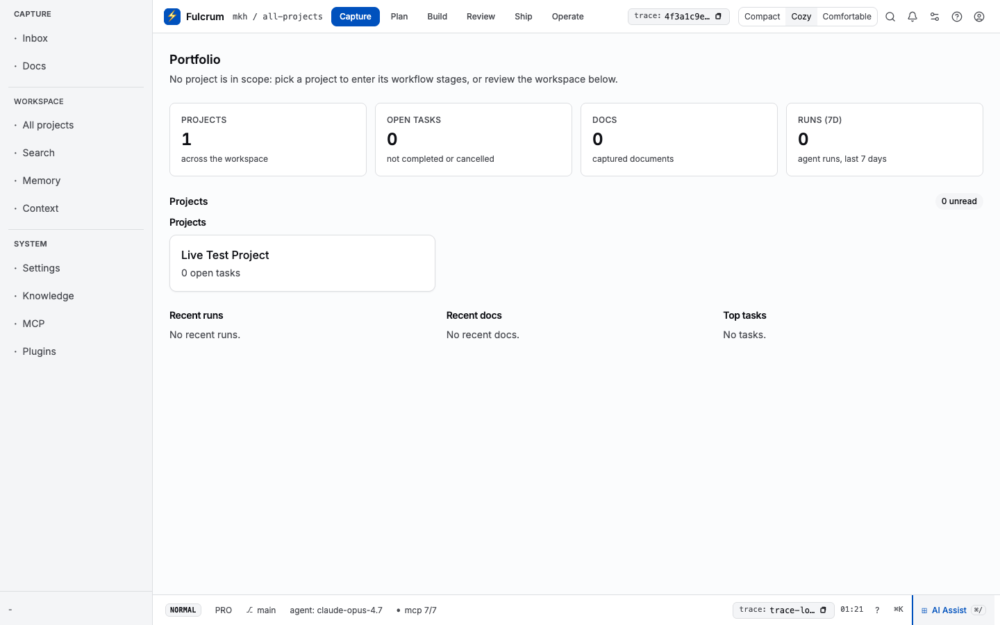

## Workflow stages — `/<ws>/projects/<projId>/<stage>`

Six stages, one URL pattern. The header carries the StageRail tabs +
scope bar + trace identity.

### Capture — `…/capture`

Docs, drafts, promoted captures, inbox. Sub-views are `?view=docs|drafts|
promoted|inbox` projections — never standalone routes. Empty-state
primary action (`New document`) navigates to `/docs/new?project=<slug>`;
the Capture stage's project context preselects the owning project on the
doc-create wizard.

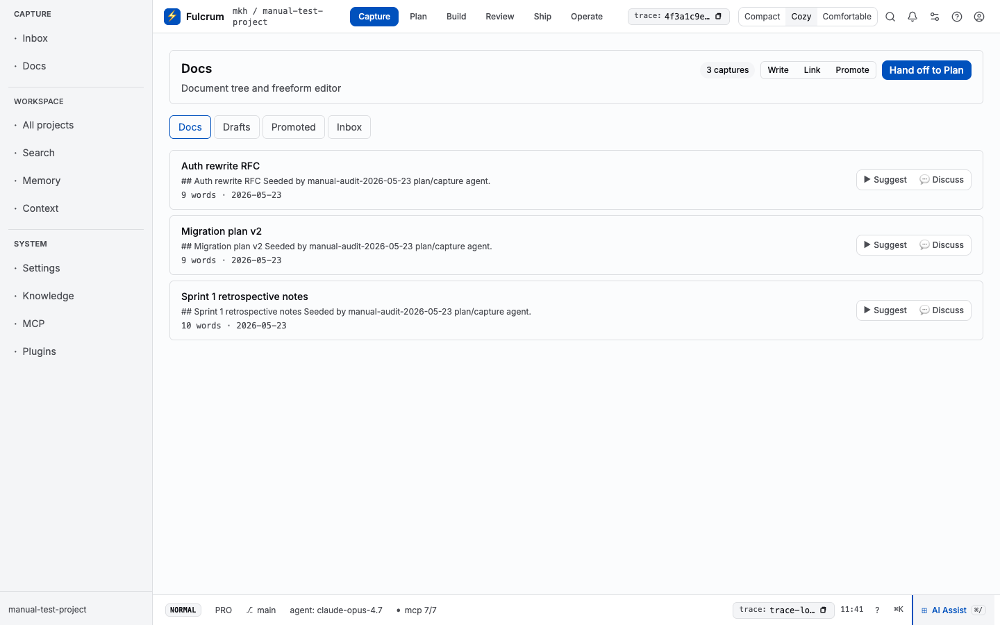
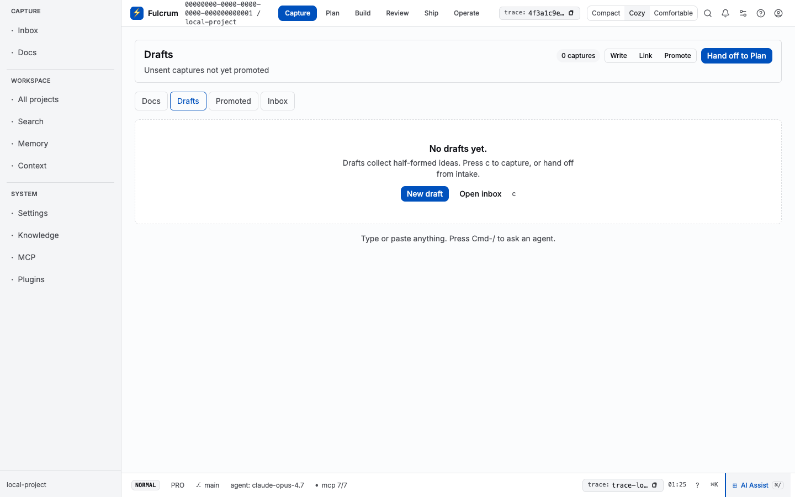
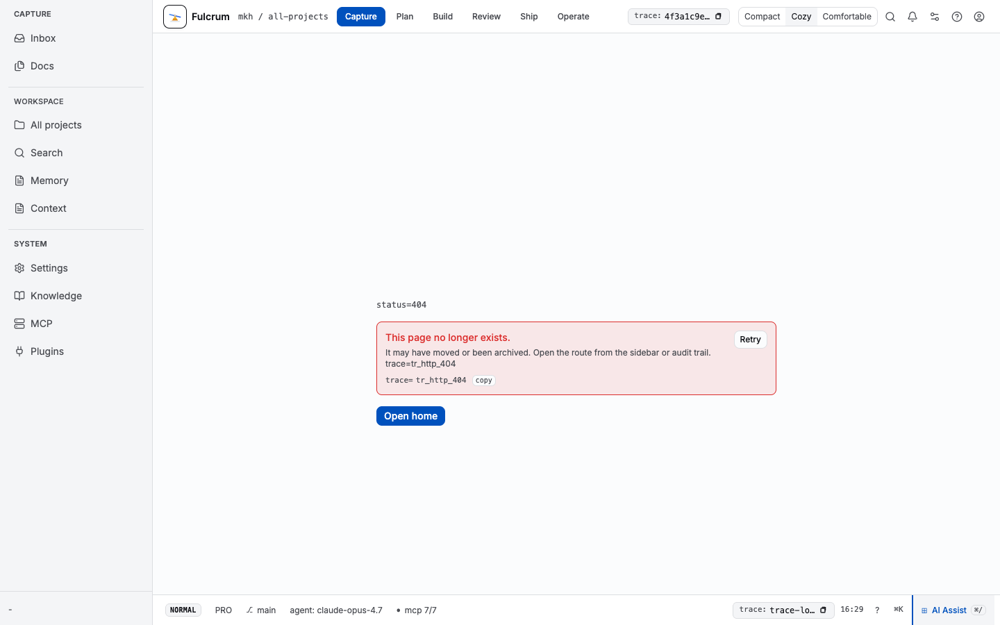
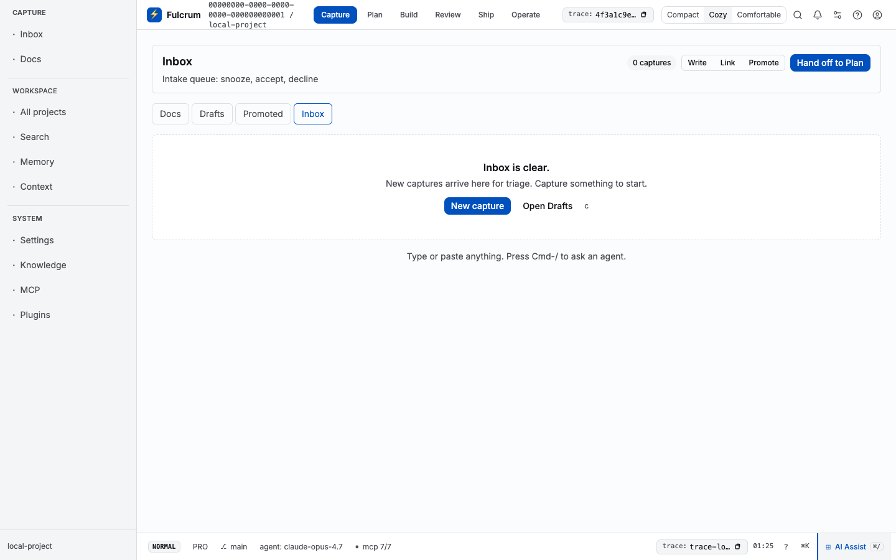

**Flow — create a doc from Capture:**
1. Click `New document` on the empty-state.
2. Pick a doc type from the wizard (ADR, meeting, wiki, runbook, …).
3. Click `Use template` → fill the title/labels/body → `Create document`.
4. Redirect to `/docs/<id>` showing the rendered doc.

### Plan — `…/plan`

AI-Assist planning workbench. Headline reads "AI Assist planning". Three
sub-views (`?view=prompts|prototypes|templates`) project the same plan
session.

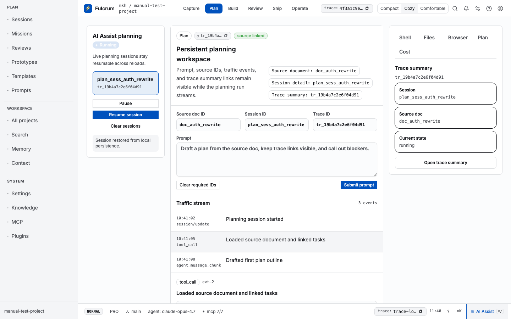

### Build — `…/build`

Build board: tasks, dependency runs, manual workbench. Three view modes
(`?view=board|list|table`). Streams `tasks` + `manualWorkbench` from
`/api/v1/tasks` + `/api/v1/tasks/manual-workbench`. With the seeded data
the board renders 7 task cards (P3/P2/P1 across status columns).

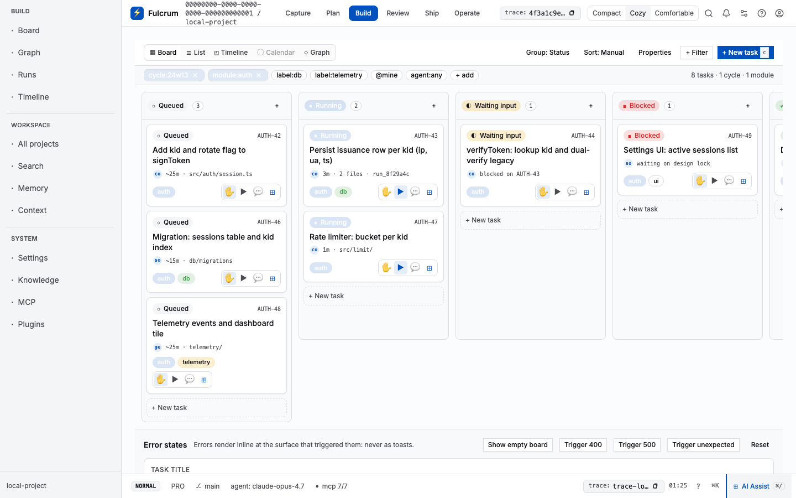

### Review — `…/review`

Review queue: code review, QA, generated-e2e, final-QA workbenches. Each
review session is identified by `traceId`; persisted sessions load via
`/api/v1/workflows/review/workbench/session/load`. See the
[Review stage routes](#review-stage-routes) section below for the
production review surfaces (`/review`, `/review-queue`, `/review-search`,
`/review-templates`, `/comments`, `/comments-block-thread`).

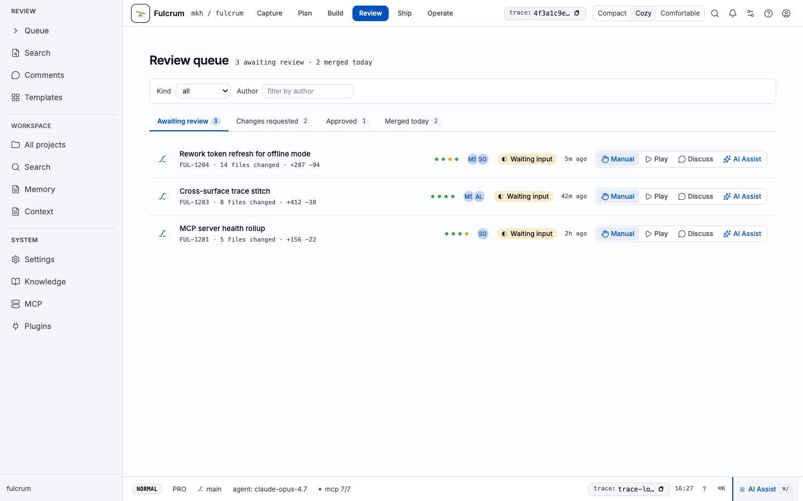

### Ship — `…/ship`

Artifacts ready to ship: built docs, exported reports, release packages.
Read-model from `/api/v1/artifacts`. See the
[Ship stage routes](#ship-stage-routes) section below for the production
ship surfaces (`/ship`, `/ship-archive`, `/artifacts`).


### Operate — `…/operate`

Doctor + MCP + Plugins + Alerts + Telemetry + Budgets. Six sub-routes,
each its own URL:

| Sub-route | Screenshot |
|---|---|
| `/operate/doctor` | `59-operate-doctor.png` |
| `/operate/mcp` | `60-operate-mcp.png` |
| `/operate/plugins` | `61-operate-plugins.png` |
| `/operate/alerts` | `62-operate-alerts.png` |
| `/operate/telemetry` | `63-operate-telemetry.png` |
| `/operate/budgets` | `64-operate-budgets.png` |

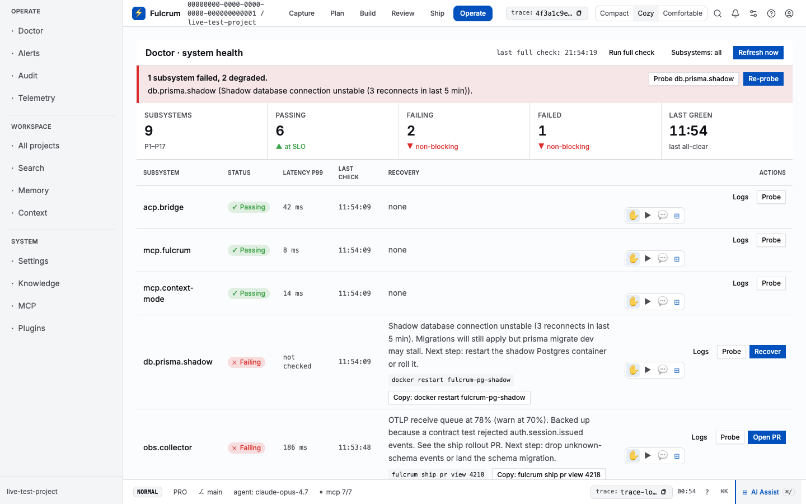 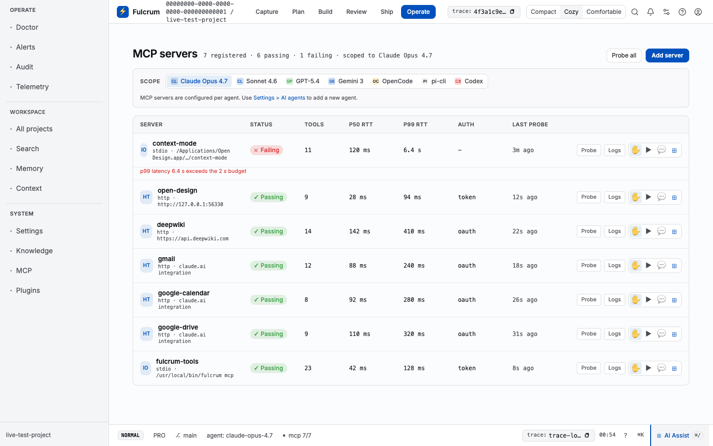 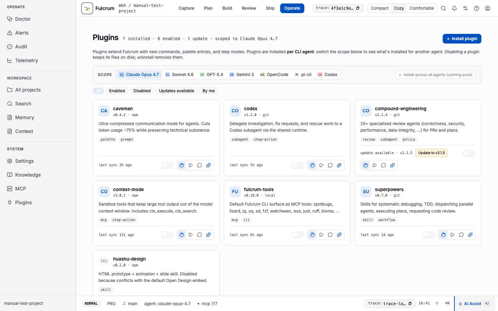

## Workspace routes (no project scope)

| Route | Purpose | Screenshot |
|---|---|---|
| `/projects` | All projects in the workspace; create / import / filter | `01-projects.png` |
| `/search` | Federated search across docs / tasks / runs / artifacts / memory | `02-search.png` |
| `/memory` | Persistent facts, decisions, references | `03-memory.png` |
| `/context/preview` | Inspect the context bundle for a project + task | `04-context-preview.png` |
| `/settings` | Account, workspace, secrets, feature flags, orchestration | `05-settings.png` |
| `/docs` | Global doc browser | `16-docs.png` |
| `/docs/new` | Doc creation wizard (preselects project via `?project=`) | `17-docs-new.png` |
| `/inbox` | Workspace inbox: notifications + handoffs | `15-inbox.png` |
| `/audit` | Audit log | `19-audit.png` |
| `/tasks` | Flat task list across the workspace (8 seeded) | `01-tasks-list.png` |
| `/runs` | All agent runs across the workspace | `21-runs.png` |
| `/agents` | Agent session workbench + dispatch | `20-agents.png` |
| `/boards` | Workspace-wide kanban across projects | `02-boards.png` |
| `/orchestration` | Orchestrator dashboard: dispatch / cancel / retry | `23-orchestration.png` |
| `/design-kit` | UI-kit primitive showcase | `24-design-kit.png` |
| `/doctor` | Workspace-level doctor | `26-doctor.png` |
| `/api-tokens` | API token management | `30-api-tokens.png` |
| `/members` | Workspace members | `31-members.png` |

## Settings sub-routes

| Route | Purpose |
|---|---|
| `/settings/secrets` | Credential vault entries |
| `/settings/feature-flags` | Toggle settings flags + rollout percent |
| `/settings/orchestration` | Workflow defs + orchestration config |
| `/settings/data` | Export / import workspace JSON |
| `/settings/backups` | Backup history + restore |
| `/settings/skills` | Installed skill packs (CLI parity: `fulcrum skills list --installed`) |
| `/settings/notifications` | Notification routing rules |
| `/settings/telemetry` | OpenTelemetry config |
| `/settings/ai-assist` | AI-Assist model + token defaults |

## Project-detail routes

`/projects/<slug>/{board,backlog,sprints,modules,intake,calendar,gantt,
repos,uat,review,reports,routing,e2e,updates,runs,settings/*}`.

Notable:
- **`/projects/<slug>`** — overview card with task counts + sprint days remaining (`70-proj-detail.png`).
- **`/projects/<slug>/backlog`** — backlog list + sprint panel; seeded sample shows 6 open tasks + Sprint 1 with 0/40 points (`72-proj-backlog.png`).
- **`/projects/<slug>/board`** — kanban with full task workbench (`71-proj-board.png`).
- **`/projects/<slug>/modules`** — module list (3 seeded: Capture & Plan, Build & Ship, Operate & Audit).
- **`/projects/<slug>/intake`** — intake queue (2 seeded: feedback, bug).

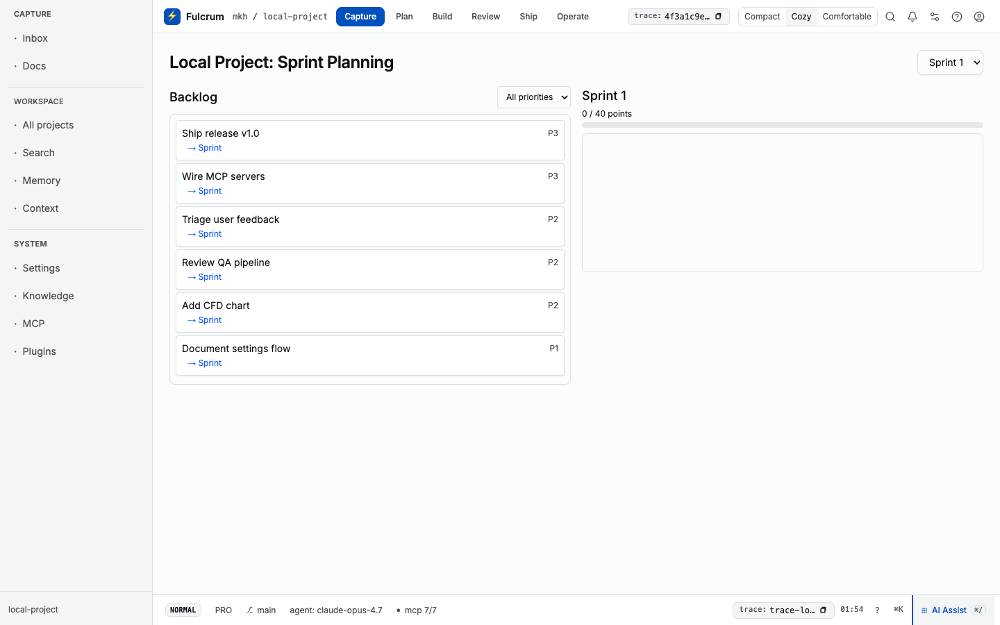 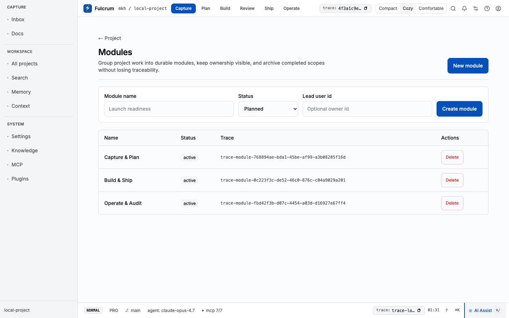 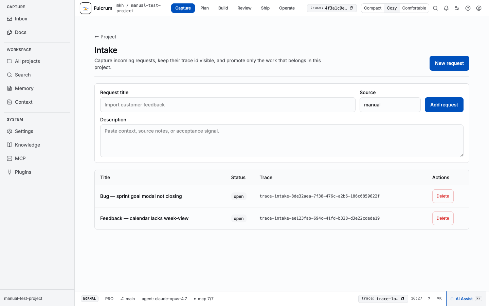

## Build stage routes (tasks, boards, runs, orchestration)

All build-stage URLs live on the workspace and consume the public API at
`/api/v1/*`. Most legacy flat routes (`/build-board`, `/build-graph`, …) are
308-redirected to the canonical `/{ws}/projects/{slug}/build/{sub}` paths via
`canonical-stage-redirect.ts`; we keep both addresses documented because the
legacy URLs still exist as OD design-preview surfaces.

### `/tasks`

[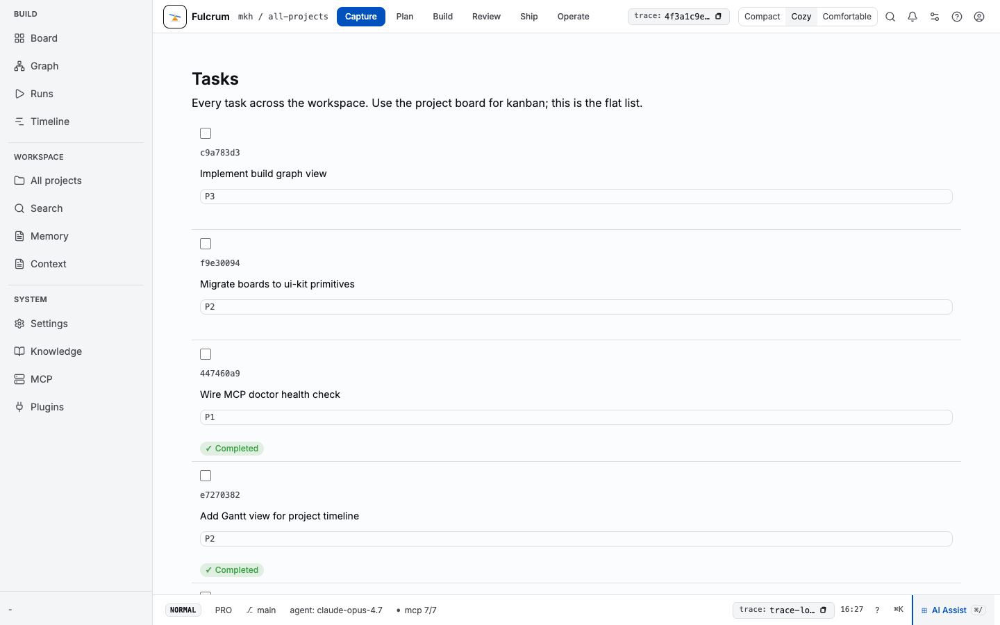](../screenshots/web/01-tasks-list.png)

Flat task list across the workspace. Server load calls `/api/v1/tasks` and
shows 8 seeded `manual-test-project` rows with id, title, priority badge and
canonical status pill (Pending / In progress / Completed). Each row links to
`/tasks/{id}`.

| Action | How (web) | How (CLI) | Notes |
|---|---|---|---|
| Create | `+` button (header) | `fulcrum task create` | POSTs `/api/v1/tasks` |
| Edit | open detail row | `fulcrum task patch <id>` | PATCH `/api/v1/tasks/{id}` |
| Delete | detail row Delete button | `fulcrum task delete <id>` | soft-delete sets `deletedAt` |

### `/tasks/{id}`

[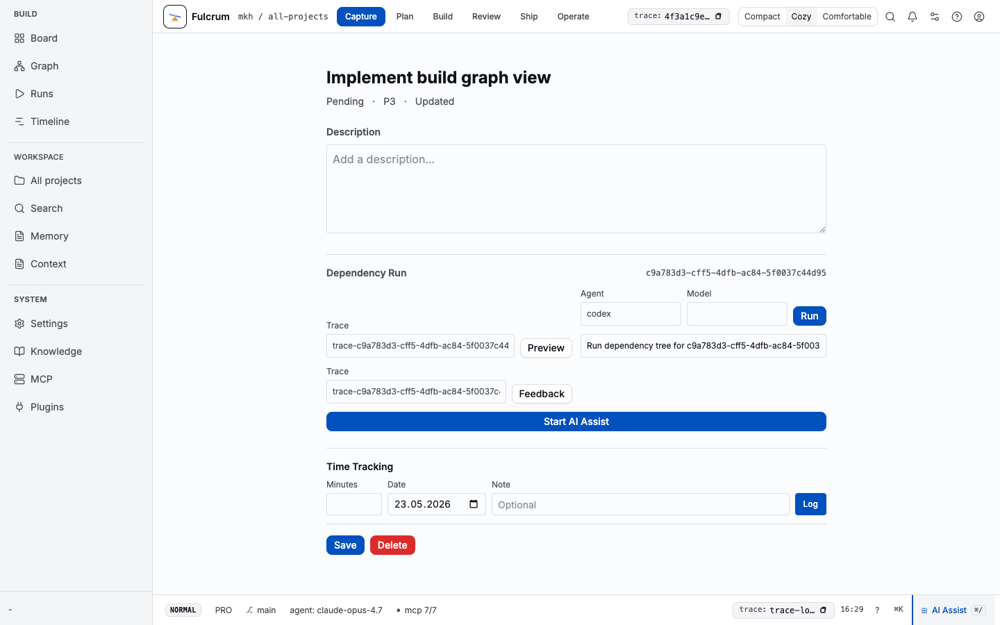](../screenshots/web/93-task-detail.png)

Task workbench: title + status + priority header, description (Tiptap), Dependency
Run panel (agent / model / trace), Time Tracking, Save / Delete. Drives a real
seeded task (e.g. `1a0b16a9-…`). Lazy-loads the Tiptap editor and the
dependency-tree side panel.

### `/boards`

[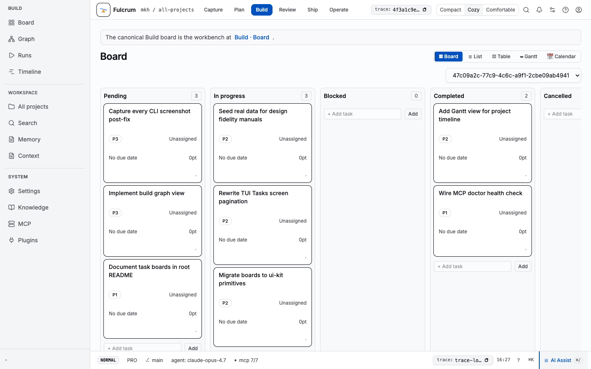](../screenshots/web/02-boards.png)

Workspace-wide kanban. Reads `/api/v1/tasks/board` through `TaskPublicStore`
(canonical `fulcrum_tasks`, slug-or-UUID resolver). Columns are the canonical
status set: Pending · In progress · Blocked · Completed · Cancelled. Seeded
`manual-test-project` renders 3/3/0/2/0 across columns. Header view-switcher
exposes List · Table · Gantt · Calendar.

| Action | How (web) | How (CLI) | Notes |
|---|---|---|---|
| Create | `+ Add task` button per column | `fulcrum task create --status <s>` | column status preselects |
| Move status | drag card between columns | `fulcrum task patch <id> --status <s>` | conflicts return 409 |
| Bulk status | row select + `Bulk` menu | `fulcrum task patch …` | `bulkStatus` form action |
| Delete | row context menu | `fulcrum task delete <id>` | `bulkDelete` form action |

### `/build-graph` and `/agent-dependency-board` (design preview)

[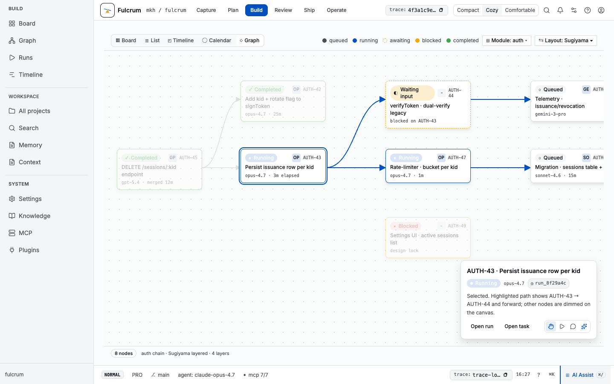](../screenshots/web/03-build-graph.png)

Legacy URLs that 308-redirect to canonical `/{ws}/projects/fulcrum/build/graph`.
The graph itself is the OD design-preview fixture (AUTH-43 chain, 8 nodes,
Sugiyama layered): hard-coded for visual parity, **not** wired to the public
API. Canonical Build graph for live data is the same surface accessed via the
Build · Graph tab when the surface is rebuilt against `/api/v1/tasks/board`
edges. Do not rewrite the fixture from this audit.

### `/build-board` (design preview)

[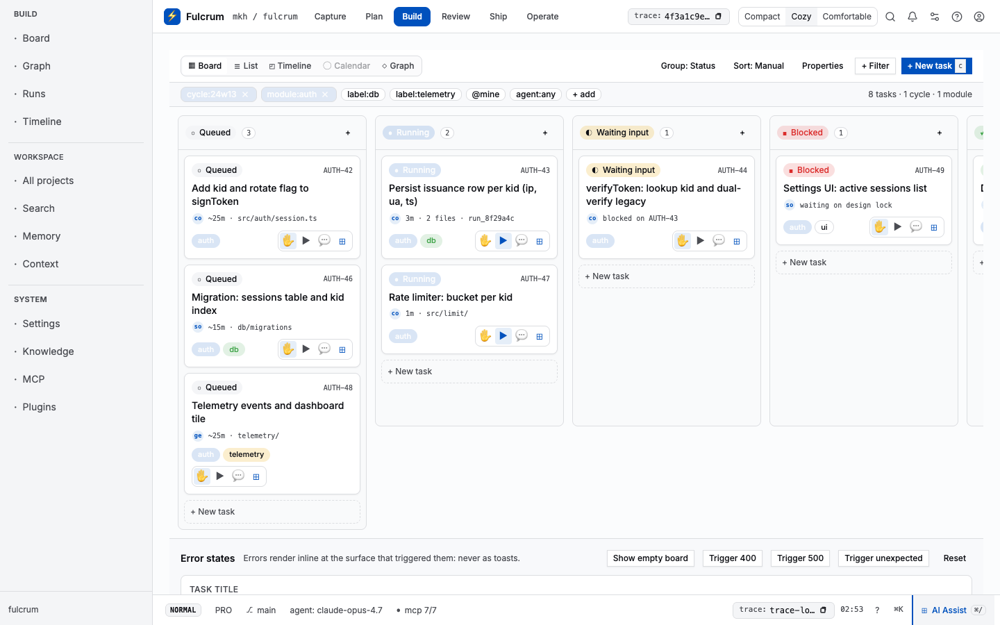](../screenshots/web/04-build-board.png)

OD design-preview kanban (AUTH-42 / AUTH-43 fixture). 308-redirects to
canonical `/{ws}/projects/fulcrum/build/board`. The live Build board is
`/boards` above; this surface stays fixture-only.

### `/build-list` (design preview)

[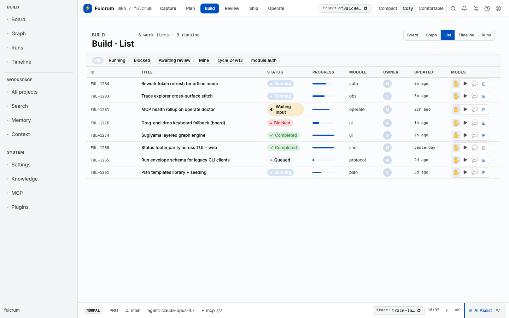](../screenshots/web/94-build-list.png)

OD design-preview list view (FUL-1284 … FUL-1310 fixture). 308-redirects to
`/{ws}/projects/fulcrum/build/list`. Fixture-only.

### `/build-timeline` (design preview)

[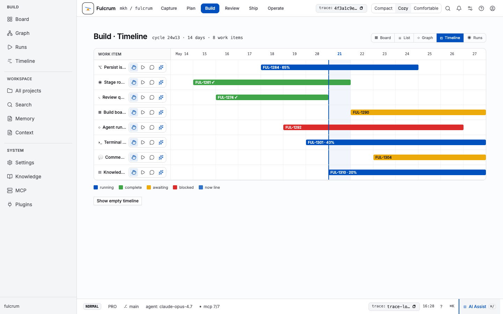](../screenshots/web/95-build-timeline.png)

OD design-preview Gantt. 308-redirects to `/{ws}/projects/fulcrum/build/gantt`.
Fixture-only.

### `/build-runs` (design preview)

[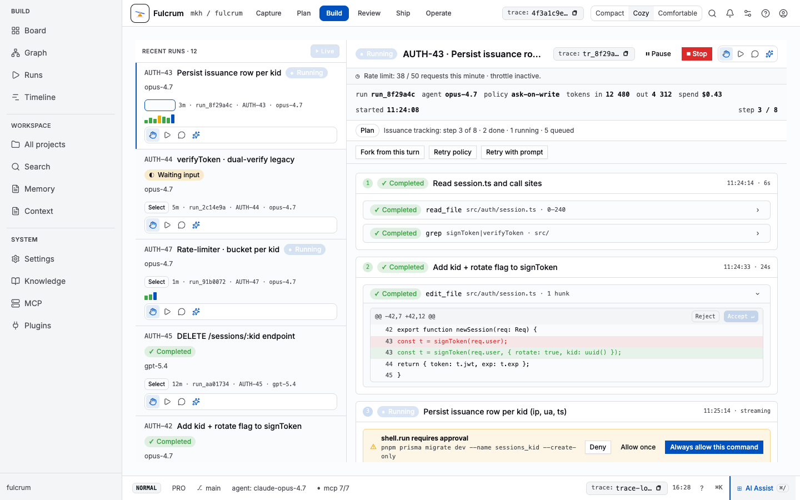](../screenshots/web/96-build-runs.png)

OD design-preview runs feed (AUTH-43 with transcript and diffs).
308-redirects to `/{ws}/projects/fulcrum/build/runs`. Fixture-only; the live
runs list is `/runs` below.

### `/agents`

[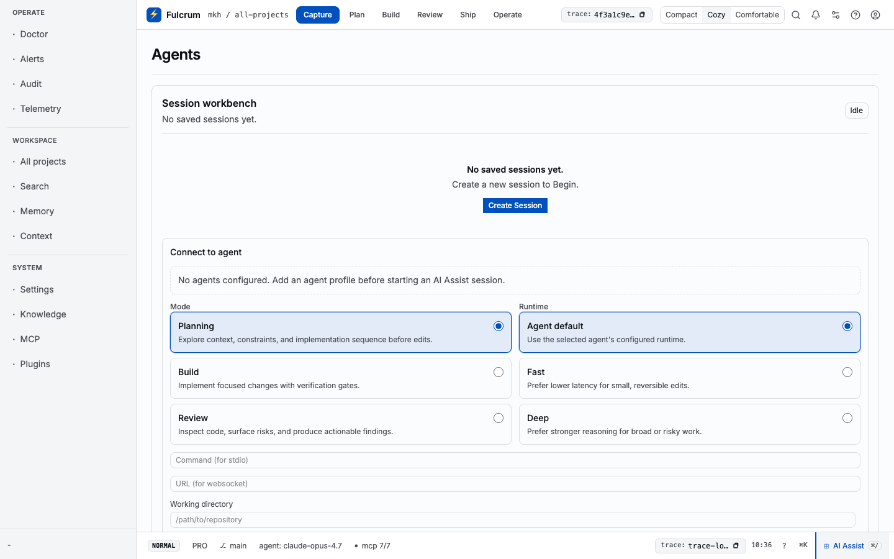](../screenshots/web/20-agents.png)

Workspace agents surface — Session workbench + Connect to agent form (Mode:
Planning · Build · Review; Runtime: Agent default · Fast · Deep). Empty state
copy: "No saved sessions yet. Create a new session to Begin." Sessions are
persisted by AI-Assist; "No agents configured" until an agent profile is added.

| Action | How (web) | How (CLI) | Notes |
|---|---|---|---|
| Start session | `Create Session` button | `fulcrum agent session create` | mode + runtime form |
| Connect agent | `Connect to agent` panel | `fulcrum agent add <name>` | requires command / URL |

### `/runs`

[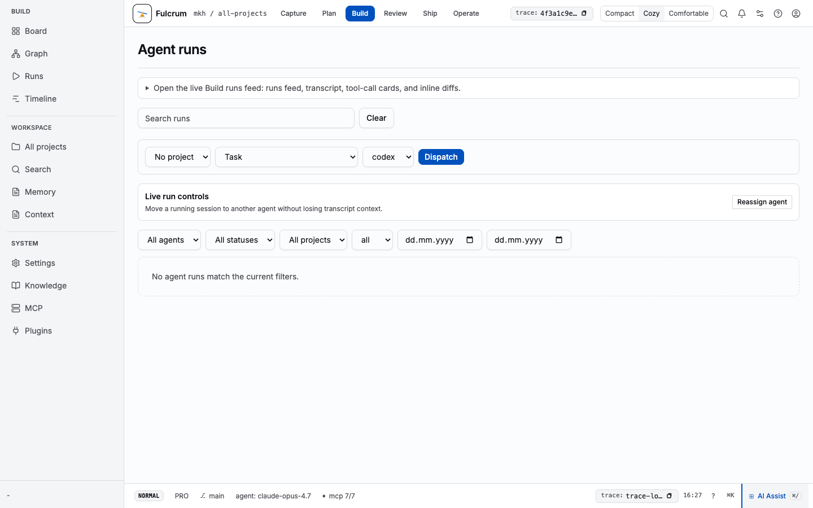](../screenshots/web/21-runs.png)

Live agent runs across the workspace. Load reads `/api/v1/runs/page-data`.
With zero seeded runs the view shows the empty state "No agent runs match
the current filters." Header has Search, Dispatch (project · kind · agent
selector + Dispatch button), and Live run controls (`Reassign agent`).
Filter bar: agent · status · project · range · date-from · date-to.

| Action | How (web) | How (CLI) | Notes |
|---|---|---|---|
| Dispatch | Dispatch dropdown + button | `fulcrum run dispatch` | POSTs `/api/v1/runs` |
| Cancel | row context | `fulcrum run cancel <id>` | POSTs `/api/v1/runs/{id}/cancel` |
| Retry | row context | `fulcrum run retry <id>` | POSTs `/api/v1/runs/{id}/retry` |
| Reassign agent | `Reassign agent` button | n/a | live run only |

> **Known issue (BUG-runs-create):** `POST /api/v1/runs` currently 500s with
> `column FulcrumJob.trace_id does not exist`. The `JobQueue1778751000000`
> migration defines the column but existing PGlite stores were created before
> it was added. Re-run the migration set or drop `fulcrum_jobs` and re-init.
> Until then the empty-state screenshot is canonical.

### `/run-detail` · `/run-cancel` · `/run-fork` · `/run-cost-tracking` · `/run-rate-limits` · `/run-retry-policy` · `/run-retry-prompt`

[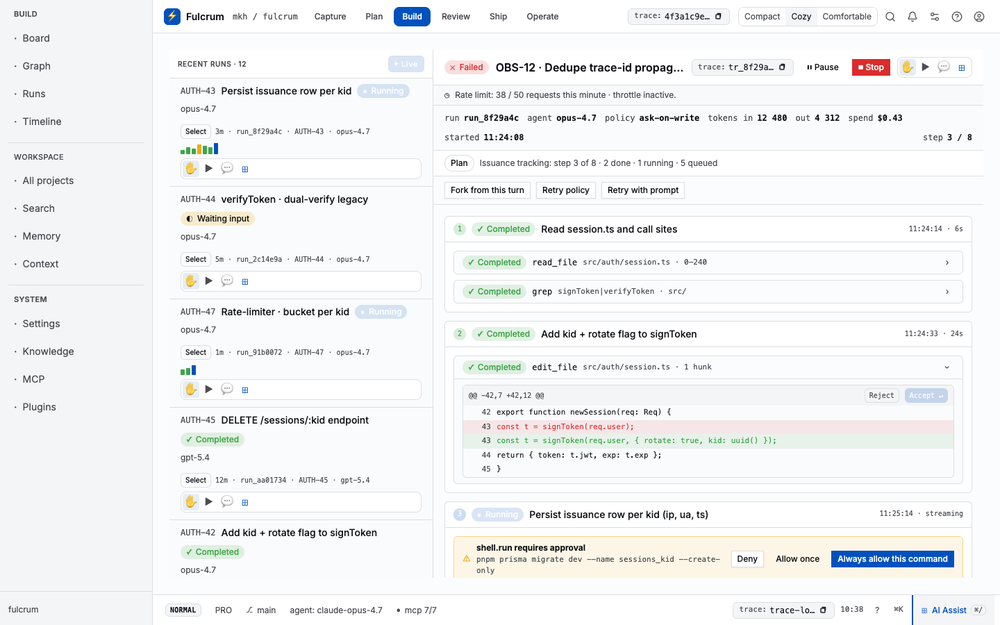](../screenshots/web/98-run-detail.png)

All seven legacy flat run-* routes 308-redirect to the canonical run-detail
surface `/{ws}/projects/fulcrum/build/runs/run_56e3d12` (an OD fixture
identifier). The redirect target is the Build · Runs surface, which shows
OBS-12 transcript, tool-call cards, inline diffs, and (when live) cancel /
fork / retry / cost / rate-limit / retry-policy / retry-prompt affordances on
the same page. Use the canonical URL pattern for new links; the legacy
addresses exist for back-compat only.

### `/orchestration`

[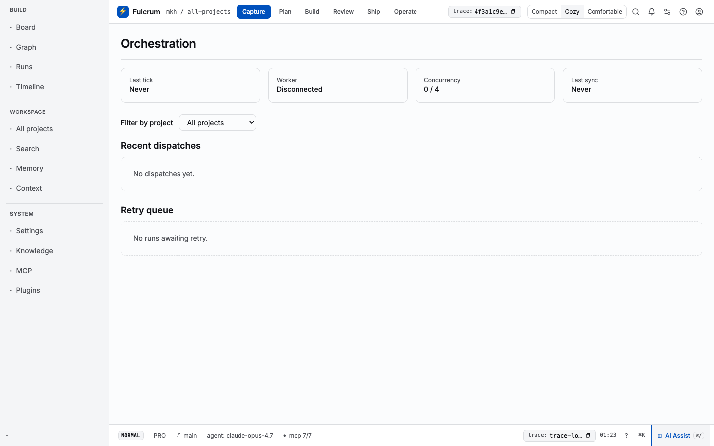](../screenshots/web/23-orchestration.png)

Orchestrator dashboard. Stats row: Last tick · Worker (connected?) ·
Concurrency (used / max) · Last sync. Sections: Recent dispatches · Retry
queue. With no seeded jobs both sections show their empty state ("No
dispatches yet." / "No runs awaiting retry."). Filter by project.

| Action | How (web) | How (CLI) | Notes |
|---|---|---|---|
| Filter | Project select | `fulcrum orchestration list --project <slug>` | |
| Cancel dispatch | row context | `fulcrum run cancel <id>` | same path as `/runs` |
| Retry from queue | row context | `fulcrum run retry <id>` | same path as `/runs` |

## Review stage routes

The Review stage exposes one production queue surface and four ancillary
review affordance surfaces. All `/review*` and `/comments*` paths share
the Review stage rail. `/review`, `/review-queue` 308-redirect to the
canonical `/<ws>/projects/<projId>/review`; the remaining surfaces
resolve under the Review StageRail with their own sub-paths.

### `/review`

[](../screenshots/web/04-review.png)

Production review queue: the intake list of PRs / review sessions
awaiting an operator decision. Head shows live count ("3 awaiting review
· 2 merged today"). Four-tab lifecycle strip — `Awaiting review` /
`Changes requested` / `Approved` / `Merged today` — drives a canonical
`WorkflowStatus` for each row. Re-homes the `/review-search`
kind/author/status facets into per-tab filters (no feature loss). Each
row carries a four-dot pre-merge check ribbon (lint/test/bench/a11y),
stacked reviewer avatars, `StatusBadge`, relative age, and the universal
ModeRow (`Manual` / `Play` / `Discuss` / `⊞ AI Assist`). Empty state
copy reconciled to `COPY.md` (`No reviews waiting.`).

| Action | How (web) | How (CLI) | Notes |
|---|---|---|---|
| Filter by tab | Click `Awaiting review` / `Changes requested` / `Approved` / `Merged today` | `fulcrum review list --status=<state>` | Tab pill carries count |
| Filter by kind | `Kind` select (`diff`/`plan`/`prototype`/`annotation`/`feedback`) | `fulcrum review list --kind=<kind>` | Re-homed from `/review-search` |
| Filter by author | `Author` text input | `fulcrum review list --author=<id>` | Substring match |
| Open review | Click row | `fulcrum review open <key>` | Loads `/review/<reviewId>` workbench |
| Hand to agent | Per-row `▶ Play` mode | `fulcrum review play <key>` | Dispatches an agent run |
| AI Assist | Per-row `⊞ AI Assist` mode | n/a | Opens scoped AcpDrawer |

### `/review-queue`

Redirects (308) to `/<ws>/projects/<projId>/review`. Legacy alias for
deep links into the queue; resolves to the same surface as `/review`.

[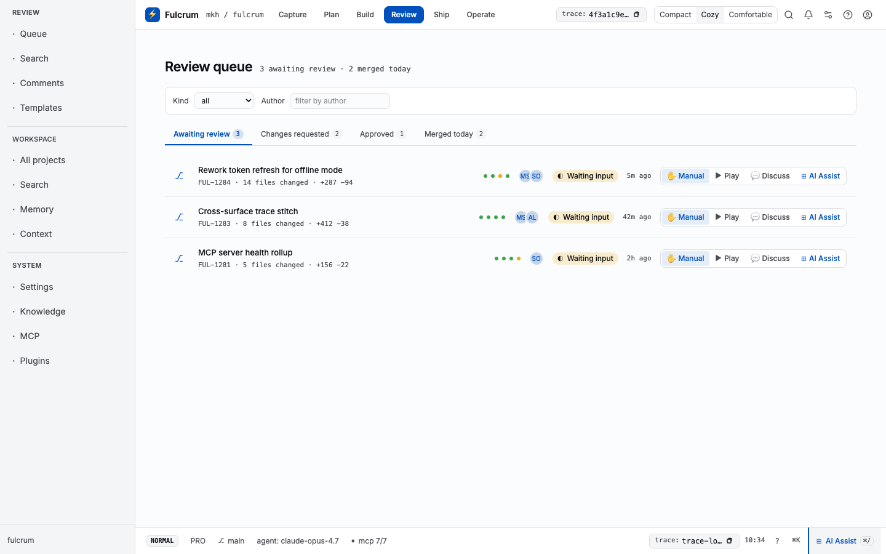](../screenshots/web/51-review-queue.png)

### `/review-search`

[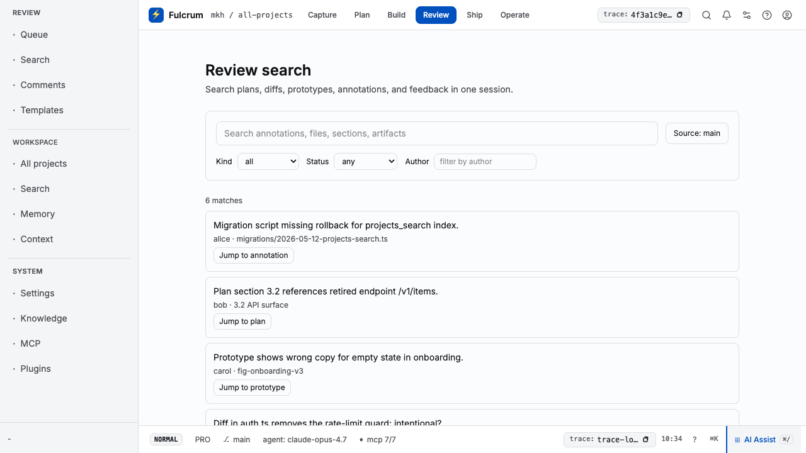](../screenshots/web/52-review-search.png)

Cross-source review search across plans, diffs, prototypes, annotations,
and feedback. Filter facets: `Kind` (`all`/`plan`/`diff`/`prototype`/
`annotation`/`feedback`), `Status` (`any`/`open`/`resolved`/`blocker`),
`Author` (text), and `Source` toggle (`main`/`split`). Renders 6 seeded
matches as cards with `Jump to <kind>` actions wired to the appropriate
workbench (plan section, diff hunk, prototype artifact, annotation
target).

**Migration disposition**: this route's kind/status/author facets are
re-homed into the `/review` queue tab + filter model
(`design-alignment/review.md` §review-queue). The route stays as a
demo / search-tool surface.

| Action | How (web) | How (CLI) | Notes |
|---|---|---|---|
| Search | Type in the query input | `fulcrum review search "<text>"` | Full-text across all sources |
| Filter by kind | `Kind` select | `--kind=<kind>` | Same vocabulary as `/review` tabs |
| Filter by status | `Status` select | `--status=<state>` | `open` / `resolved` / `blocker` / `any` |
| Filter by author | `Author` text input | `--author=<id>` | Substring match |
| Jump to source | `Jump to <kind>` button | `fulcrum review open <id>` | Navigates to the originating workbench |

### `/review-templates`

[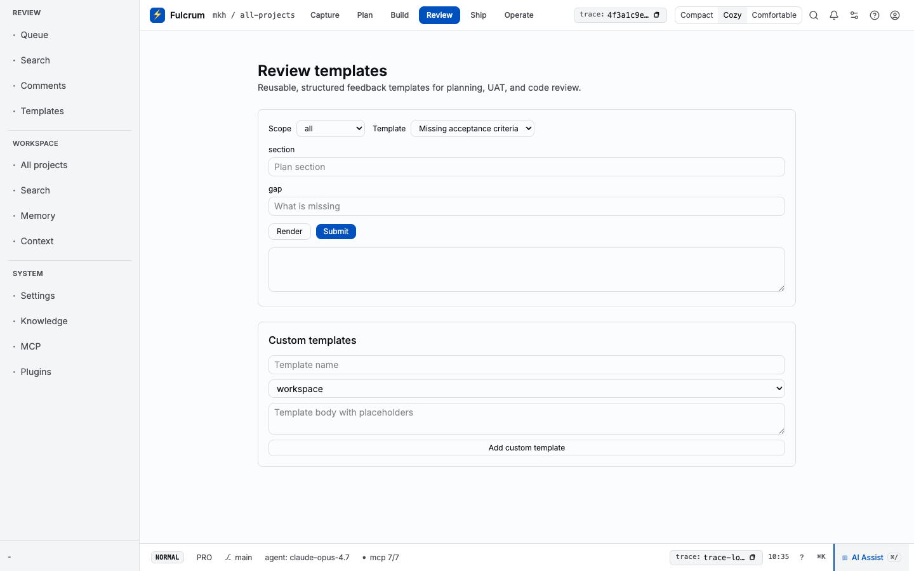](../screenshots/web/53-review-templates.png)

Reusable structured feedback templates for planning, UAT, and code
review. Five built-in templates: `missing-criteria`, `stale-context`,
`prototype-mismatch`, `test-gap`, `code-risk`. Each template has a
`Scope` (`all`/`workspace`/`planning`/`uat`/`code-review`), a set of
placeholder fields, and a body that renders against the filled fields.
`Render` previews the message; `Submit` posts it as a review comment.
The custom-template panel below adds named templates with arbitrary
placeholder bodies.

**Migration disposition**: the five built-in templates are absorbed
into the Review workbench Comments-panel template picker
(`design-alignment/review.md`). This route stays as the
template-library management surface — no feature loss.

| Action | How (web) | How (CLI) | Notes |
|---|---|---|---|
| Pick template | `Template` select | `fulcrum review template list` | Seeds the form with placeholders |
| Filter by scope | `Scope` select | n/a | Library-management filter |
| Render preview | `Render` button | `fulcrum review template render --id=<id>` | Shows the resolved body |
| Submit comment | `Submit` button | `fulcrum review comment add --template=<id>` | Posts to the active review |
| Add custom | `Add custom template` | `fulcrum review template create` | Workspace-scoped by default |

### `/comments`

[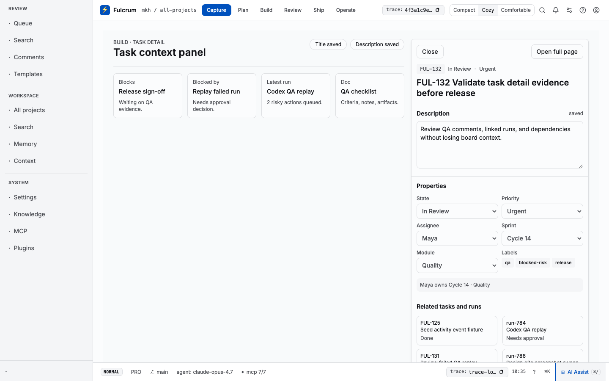](../screenshots/web/54-comments.png)

Task context panel demonstration: the Review-comment-aware task detail
surface (`Task context panel` heading). Renders the four related-card
strip (Blocks · Blocked by · Latest run · Doc), an editable
title/description with autosave status pills (`Title saved`,
`Description saved`), a Properties panel (State / Priority / Assignee /
Sprint / Module / Labels), and a Related tasks/runs grid. The right
panel shows the active task FUL-132 with its description, properties,
labels, and downstream runs. Comments themselves are seeded via
`POST /api/v1/comments/create` on real tasks.

Seeded for the audit: 2 task comments on `manual-test-project` tasks
(`383b6fe2-9728-4f0a-8622-bcfface8f2ce` — open;
`7a1ef580-d78a-42b3-b434-a1ccdf16fde7` — resolved).

| Action | How (web) | How (CLI) | Notes |
|---|---|---|---|
| Create | Inline composer (per task) | `POST /api/v1/comments/create` | `body` is rich tiptap JSON |
| Edit | Inline edit | `POST /api/v1/comments/update` | Author-only |
| Resolve | Row context menu | `POST /api/v1/comments/resolve` | Marks `resolved=true` |
| Unresolve | Row context menu | `POST /api/v1/comments/unresolve` | Reverts resolve |
| React | Emoji picker | `POST /api/v1/comments/add-reaction` | Emoji is required |
| Subscribe | `Watch` toggle | `POST /api/v1/comments/subscribe` | Notifies on new replies |
| Delete | Row context menu | `POST /api/v1/comments/delete` | Author-only |

### `/comments-block-thread`

[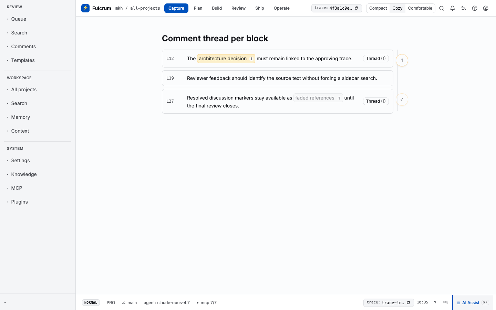](../screenshots/web/55-comments-block-thread.png)

Block-anchored doc comment threads: the doc-version-review surface.
Each row is a selection-anchored thread on a document line (`L12`,
`L19`, `L27`). Active threads carry a `Thread (n)` action; resolved
threads fade and show a checkmark instead. The selection-anchored
resolvable-thread responsibility is promoted to the
`@fulcrum/ui-kit` `CommentThread` primitive, which the Review workbench
consumes for inline diff annotations.

| Action | How (web) | How (CLI) | Notes |
|---|---|---|---|
| Open thread | `Thread (n)` button | n/a | Opens the inline comment editor |
| Reply | Comment composer inside the thread | n/a | Anchored to the selection |
| Resolve | `Resolve` button in thread | n/a | Resolved threads fade to dim |
| Unresolve | `Re-open` in resolved-thread context menu | n/a | Restores active state |

## Ship stage routes

The Ship stage groups three surfaces under one workflow: the artifact
release workbench (`/ship`), the release timeline archive
(`/ship-archive`), and the legacy generic artifact list (`/artifacts`,
which 301-redirects to `/ship`). All Ship routes share the Ship stage
rail.

### `/ship`

[](../screenshots/web/05-ship.png)

Ship stage workbench: the release table. Toolbar shows live count
("7 releases · 1 in flight · channel stable"), a segmented
Channel/Sort/Filter group, and the primary `Cut release` action
(`⌘R`). Each row carries the release artifact name, channel
(`stable`/`canary`), `StatusBadge` (`Running` / `Completed` /
`Cancelled` / `Failing`), check ribbon (`✓ 12 · ✗ 1`), author, promoted
time, trace id, size, and a per-row ModeRow. A row click opens the
List+Detail peek-overview (Release / Checks / Includes / Timeline) with
`Roll back` / `Pause rollout` / `Open run feed` / `Promote` actions.

Confirmation tiers: `Cut release` / `Pause rollout` / `Promote to 100%`
use the inline 3-2-1 countdown (`COPY.md` §4); `Roll back` is the
destructive tier with explicit inline confirmation.

| Action | How (web) | How (CLI) | Notes |
|---|---|---|---|
| Cut release | `Cut release` button (`⌘R`) | `fulcrum ship release cut` | 3-2-1 countdown |
| Promote | Per-row peek `Promote` | `fulcrum ship release promote --id=<id>` | Inline confirm |
| Pause | Per-row peek `Pause rollout` | `fulcrum ship release pause --id=<id>` | Reversible |
| Roll back | Per-row peek `Roll back` | `fulcrum ship release rollback --id=<id>` | Destructive — text confirm |
| Filter | `Channel` / `Filter` toolbar | `fulcrum ship list --channel=<c>` | Defaults: channel `stable` |
| Sort | `Newest` toolbar segment | `fulcrum ship list --sort=<key>` | Default: `Newest` |
| Open peek | Row click | `fulcrum ship show <id>` | List+Detail peek, no route change |
| Open run feed | Per-row peek `Open run feed` | `fulcrum runs show --release=<id>` | Cross-stage navigation |

### `/ship-archive`

[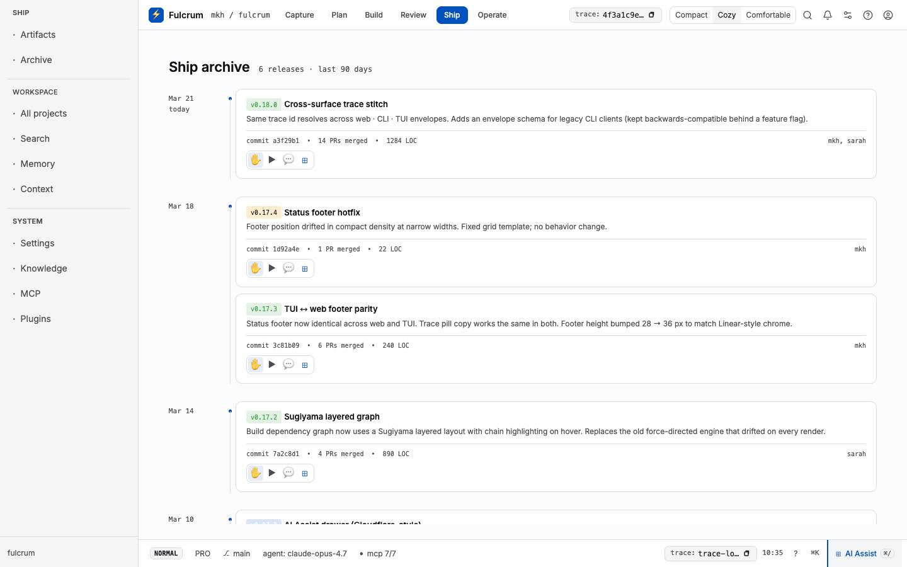](../screenshots/web/56-ship-archive.png)

Release archive: vertical timeline of past releases grouped by date
bucket. Head shows live count ("6 releases · last 90 days"). Each
release card carries a semver `tag-pill` (e.g. `v0.18.0`), a title, a
summary paragraph, a metadata row (`commit <sha>` · `<n> PRs merged` ·
`<n> LOC`), the author handle, and the per-row ModeRow. The connector
rail draws date dots + lines via CSS pseudo-elements per OD
`ship-archive.html`.

Empty state copy reconciled to `COPY.md` §72: `No releases shipped.`

| Action | How (web) | How (CLI) | Notes |
|---|---|---|---|
| Filter window | Date-range picker (planned) | `fulcrum ship archive --since=<ts>` | Default: last 90 days |
| Open release | Click release card | `fulcrum ship show <tag>` | Loads release detail |
| Open run feed | Per-row `▶ Play` mode | `fulcrum runs show --release=<id>` | Cross-stage |
| Discuss | Per-row `💬 Discuss` mode | n/a | Inline thread |
| AI Assist | Per-row `⊞ AI Assist` mode | n/a | Scoped AcpDrawer |

### `/artifacts`

[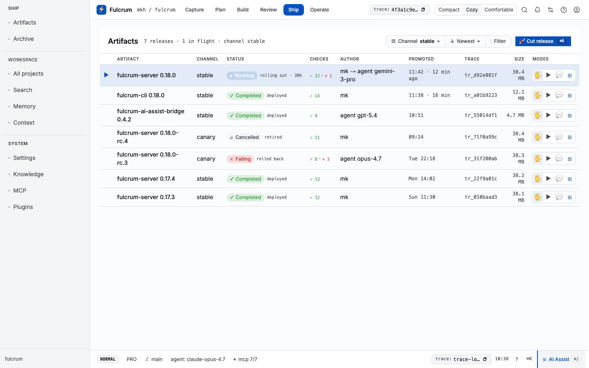](../screenshots/web/57-artifacts.png)

Legacy generic artifact list. The list view is re-homed to the Ship
stage workbench (`/ship`): `+page.server.ts` issues a
**301 MOVED_PERMANENTLY** redirect carrying the original query string
forward, so a bookmarked `/artifacts?mime=…` lands on the same filtered
Ship view.

**No feature loss for mutation endpoints**: the `upload` and `bulk`
(archive/delete) server actions and the `/artifacts/[id]/download`
endpoint are preserved at their existing paths — only the *list* moved.

Seeded for the audit: 2 artifacts under `manual-test-project`
(`artifact-3215e85e-7457-42d1-ac7e-7ac52afd83a9` — PDF, "Release notes
0.18.0"; `artifact-92fd1ff0-0cf1-42c0-ae21-378b1bf050e5` — ZIP,
"Compliance evidence bundle"). Both auto-emit an `artifact / created`
audit event visible at `/audit`.

| Action | How (web) | How (CLI) | Notes |
|---|---|---|---|
| List | `/ship` (redirected from `/artifacts`) | `fulcrum artifacts list` | Filter by `mime`/`kind`/`lifecycle` |
| Upload | `POST /artifacts` form action | `fulcrum artifacts upload <path>` | Carries `traceId` + `projectId` |
| Bulk archive | `POST /artifacts?/bulk action=archive` | `fulcrum artifacts archive --ids=<...>` | Soft delete |
| Bulk delete | `POST /artifacts?/bulk action=delete` | `fulcrum artifacts delete --ids=<...>` | Hard delete |
| Download | `GET /artifacts/<id>/download` | `fulcrum artifacts download <id>` | Streams body + checksum |

## Audit

### `/audit`

[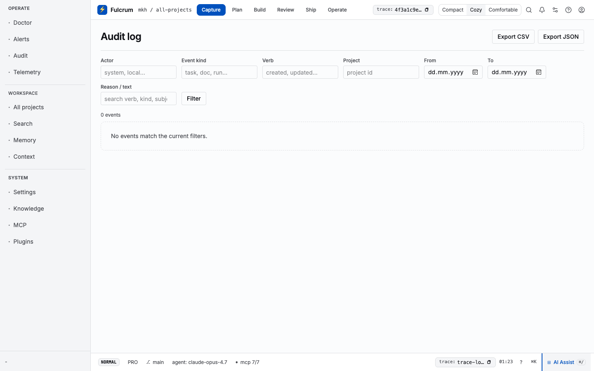](../screenshots/web/19-audit.png)

Audit log: the immutable event stream for the workspace. Filter by
`Actor`, `Event kind`, `Verb`, `Project`, date range (`From` / `To`),
and free-text `Reason / text`. Renders a server-paginated table
(time / actor / kind / subject / verb). Read-model from
`GET /api/v1/audit?orgId=<org>` (see
`services/workflow-coordination/src/interface/http/audit-public-api.controller.ts`).
`Export CSV` / `Export JSON` actions stream the filtered set.

Audit events auto-populate as side effects of public-API mutations
(artifact upload, task patch, document edit, run dispatch, etc.). The
seeded sample shows two `artifact / created` events from the artifacts
seeded above.

| Action | How (web) | How (CLI) | Notes |
|---|---|---|---|
| Filter by actor | `Actor` input | `fulcrum audit list --actor=<id>` | `system` for unattributed |
| Filter by kind | `Event kind` input | `--kind=<kind>` | `task`/`doc`/`run`/`artifact`/... |
| Filter by verb | `Verb` input | `--verb=<v>` | `created`/`updated`/... |
| Filter by project | `Project` input | `--project=<id>` | UUID, not slug |
| Filter by date | `From` / `To` date pickers | `--since=<ts>` / `--until=<ts>` | Inclusive |
| Export CSV | `Export CSV` button | `fulcrum audit export --format=csv` | Streams attachment |
| Export JSON | `Export JSON` button | `fulcrum audit export --format=json` | Streams attachment |
| Set retention | n/a (settings) | `fulcrum audit retention set --days=<n>` | Per-org policy |

## Cross-cutting affordances

- **Trace identity** — every page header carries a copy-trace-id button (`tr_…`).
- **Command palette** — `⌘K` everywhere; jumps to any stage / project / run / doc.
- **AI Assist** — `⌘/` opens chat in the status footer.
- **Keyboard shortcuts** — `?` shows the cheat-sheet overlay.
- **Theme + density** — gear next to notifications, persists per-user.

## Troubleshooting

- Page renders but a section says "Project could not load" → the slug isn't in the NestJS DB. List with `curl /api/v1/projects?orgId=<org>`. Seed via `POST /api/v1/projects`.
- A `/settings/*` sub-route returns 500 → check the server log; missing tables (`project_statuses`, `project_connectors`) now return `[]` rather than 500 so the page renders empty-state.
- `/projects/<slug>/sprints` is empty → expected: sprint↔task model is being unified across `FulcrumTaskEntity` (no sprint_id) and the legacy `Task` entity (has sprint_id). See [findings.md](../findings.md) bug E.
- Web has stale data → restart the NestJS server first (`lsof -ti:3000 | xargs kill -9; cd apps/server && bun run src/index.ts`). PGlite is single-writer; the web doesn't open it directly, but the data behind it lives in `~/.fulcrum/db/main`.
