# Web user manual (SvelteKit, port 5173)

The Fulcrum web is a pure invocation layer over the NestJS public API: every
load + form action calls `/api/v1/*` on the server at `:3000`. The web process
itself never opens a database. URLs are stable; mobile / cross-cutting routes
are state previews of the canonical ones below.

## Getting started

```bash
cd apps/server && bun run src/index.ts &   # port 3000
cd apps/web    && bun run dev              # port 5173
open http://localhost:5173/
```

The root path lands on the **Portfolio**: a list of every project the active
workspace owns. Pick a project; from there the URL becomes
`/<workspaceId>/projects/<projectSlug>/<stage>` and every surface below hangs
off that scope.

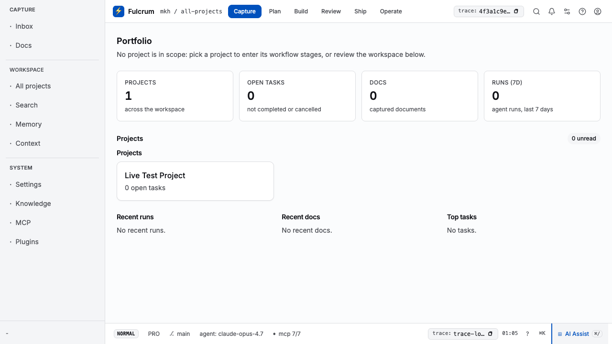

## WorkflowStages — `/<ws>/projects/<projId>/<stage>`

Six stages, one URL pattern. Each is a workbench: a header, a stage-scoped
ScopeBar with the six tabs, the StageRail nav on the left, and a content area
that renders the stage's own primitives.

### Capture — `…/capture`

Rough input lands here: docs, drafts, promoted captures, inbox. The
empty-state primary action (`New document`) routes through `/docs/new` with
the project preselected; the `Write` block-action does the same. Sub-views
are `?view=docs|drafts|promoted|inbox` projections, not standalone routes.


Hand off to Plan via the trailing button — the trace id is preserved across
the link so the next stage opens in the same session.

### Plan — `…/plan`

The AI-Assist planning surface: prompts, plan templates, agent-assisted
breakdown. Headline reads "AI Assist planning".

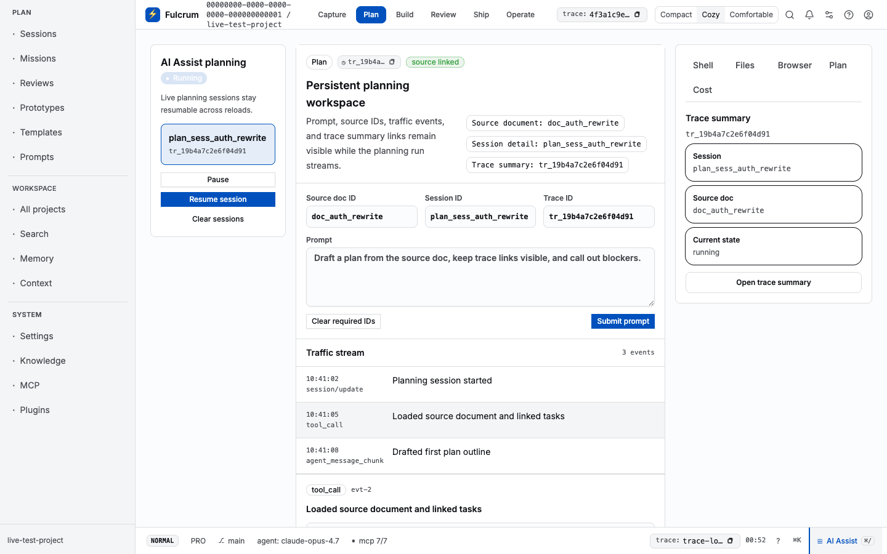

### Build — `…/build`

Build board: tasks, dependency runs, manual workbench in `board` / `list` /
`table` view modes. Filters: status, state-group, labels, assignees, cycles,
modules, priorities. The route streams `tasks` + `manualWorkbench` from
`/api/v1/tasks` + `/api/v1/tasks/manual-workbench`.


### Review — `…/review`

Review queue: code review, QA, generated-e2e, final-QA workbenches. Each
review session is identified by `traceId`; persisted sessions load via
`/api/v1/workflows/review/workbench/session/load`.


### Ship — `…/ship`

Artifacts ready to ship: built docs, exported reports, release packages.
Read-model from `/api/v1/artifacts`.


### Operate — `…/operate`

Doctor + MCP servers + Plugins + telemetry. Three sub-routes:
- `/operate/doctor` — system health (see also CLI `fulcrum doctor`).
- `/operate/mcp` — registered MCP servers + their tool counts.
- `/operate/plugins` — installed Claude / Codex / Pi / Gemini / OpenCode plugins.

   

## Capture sub-views

`?view=` projections of the Capture stage — never standalone routes. The
sub-view strip carries `aria-current` for assistive tech.

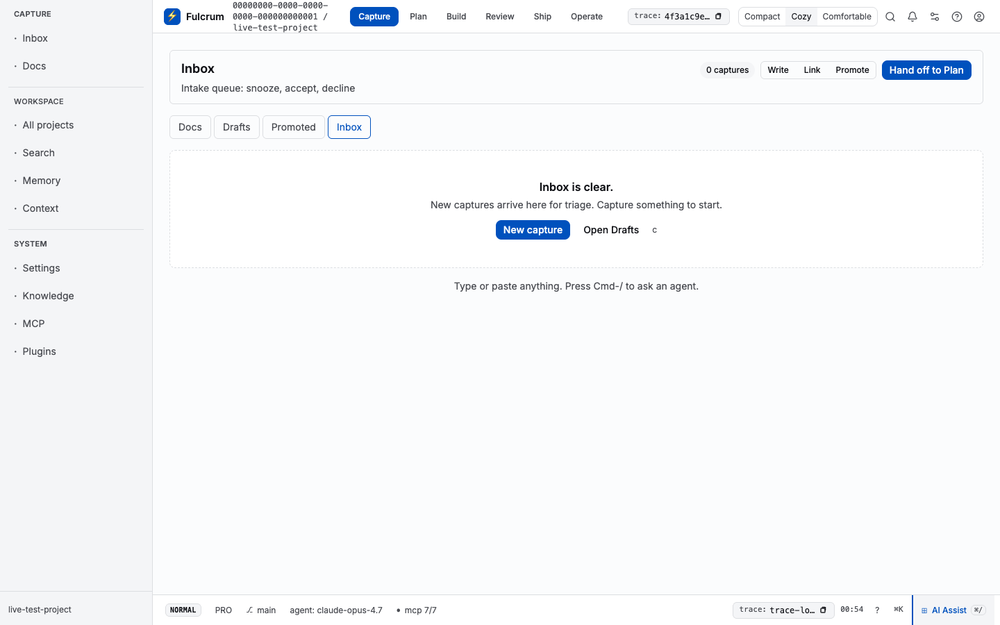 

## Workspace routes (no project scope)

| Route | Purpose | Screenshot |
|---|---|---|
| `/projects` | All projects in the workspace; create / import / filter | `10-projects.png` |
| `/search` | Federated search across docs, tasks, runs, artifacts, memory | `11-search.png` |
| `/memory` | Persistent facts, decisions, references | `12-memory.png` |
| `/context/preview` | Inspect the context bundle that would be assembled for a project + task | `13-context.png` |
| `/settings` | Account, workspace, secrets, feature flags, orchestration | `14-settings.png` |
| `/docs` | Global doc browser (per-project Docs live under `…/capture`) | `15-docs.png` |
| `/inbox` | Workspace inbox: notifications + handoffs | `16-inbox.png` |
| `/runs` | All agent runs across the workspace | `17-runs.png` |
| `/agents` | Agent profiles, sessions, dispatch | `18-agents.png` |
| `/boards` | Workspace-wide kanban across projects | `19-boards.png` |
| `/orchestration` | Orchestrator dashboard: dispatch / cancel / retry | `20-orchestration.png` |
| `/design-kit` | UI-kit primitive showcase (developer reference) | `21-design-kit.png` |

 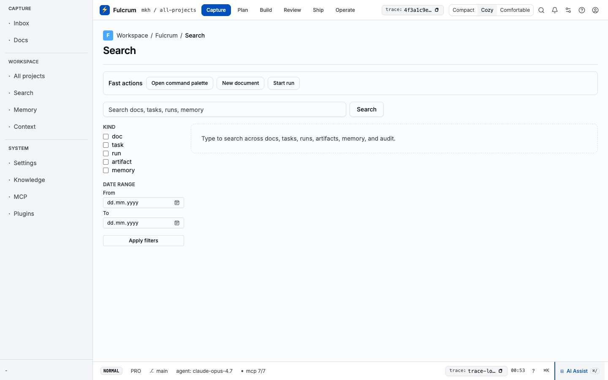 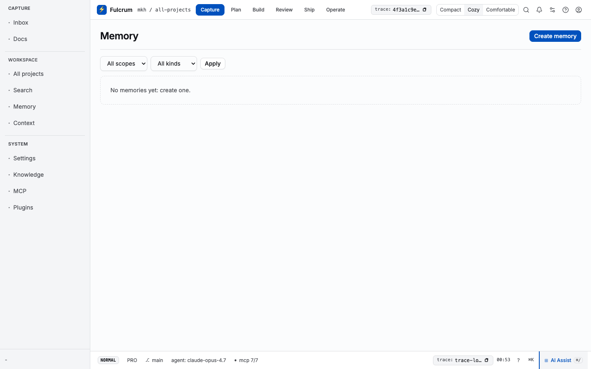 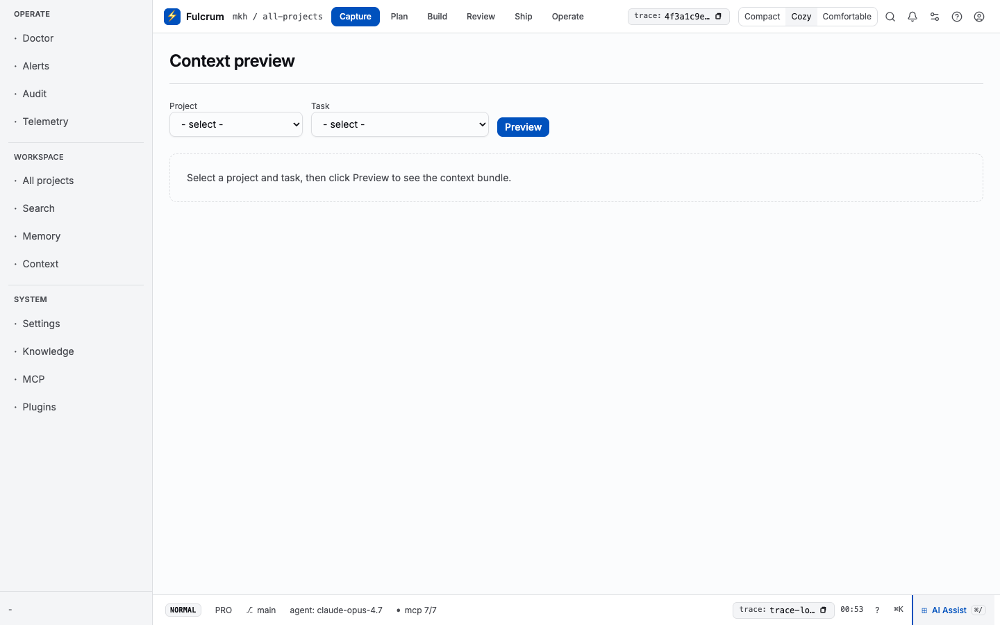 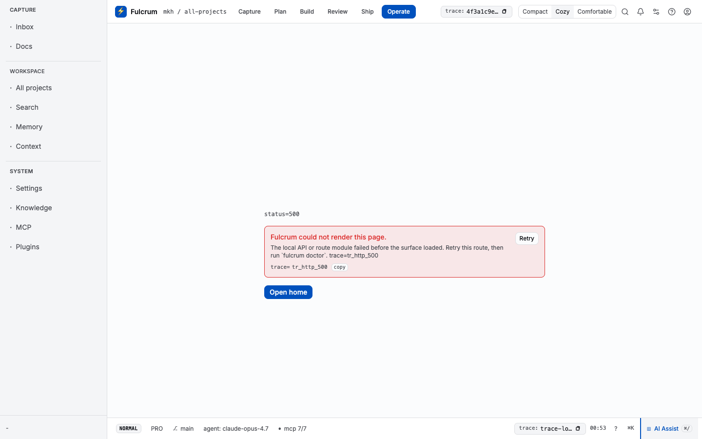 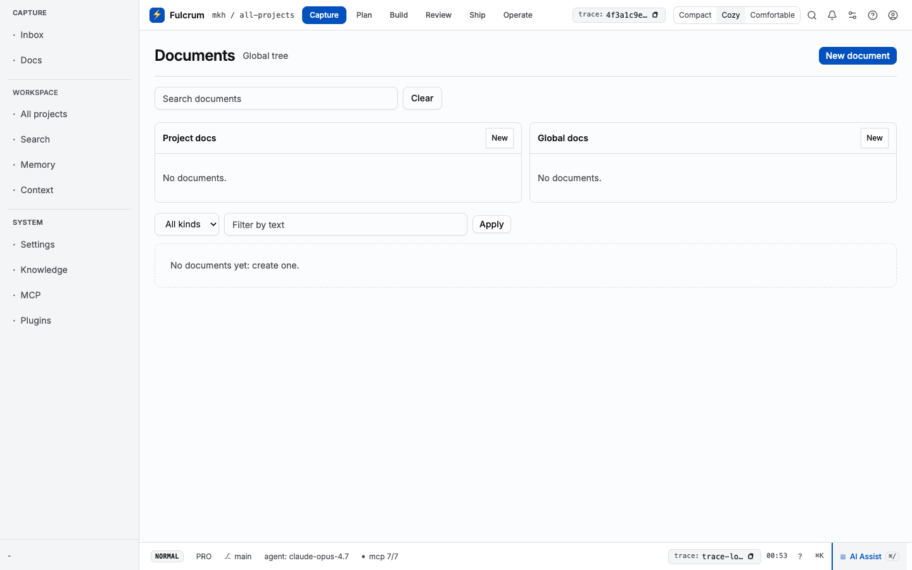  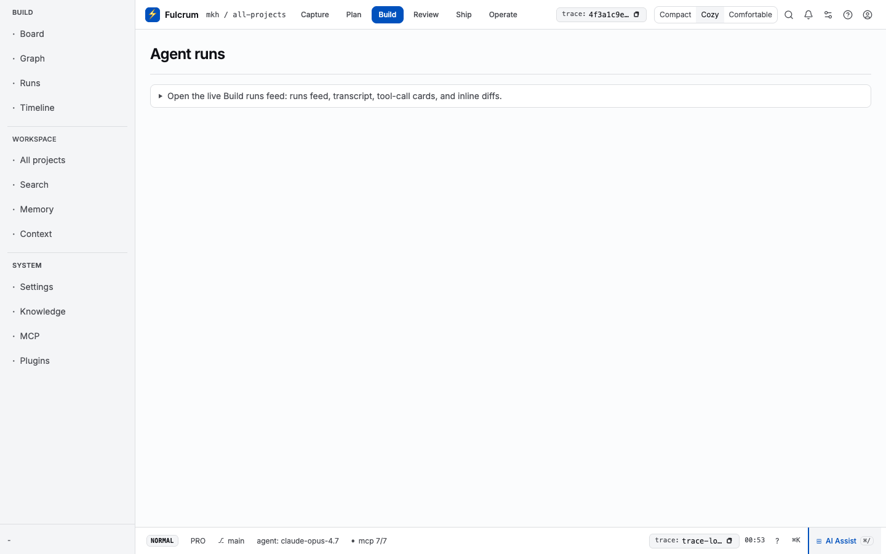 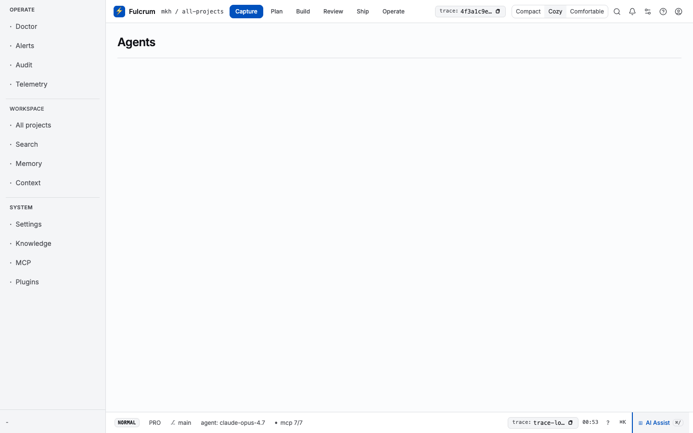  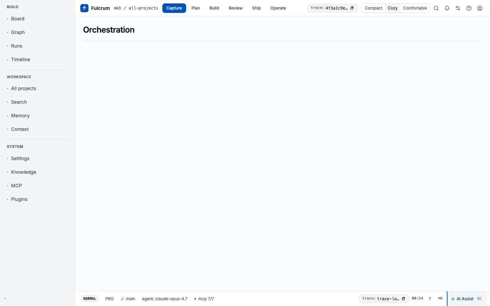 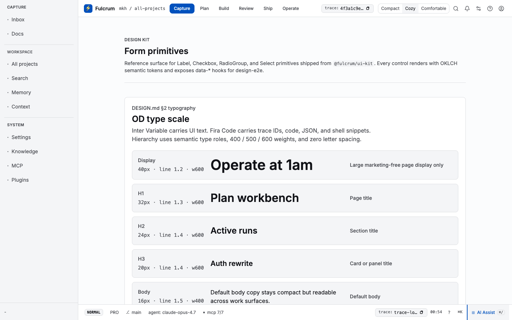

## Cross-cutting affordances

- **Trace identity** — every page header carries a copy-trace-id button (`tr_…`).
- **Command palette** — `⌘K` on every page; jumps to any stage / project / run / doc.
- **AI Assist** — `⌘/` opens the chat surface in the status footer.
- **Keyboard shortcuts** — `?` shows the cheat-sheet overlay.
- **Notifications** — `alt+T` toasts.
- **Theme + density** — gear next to notifications, persists per-user.

## Troubleshooting

- Web route loads but data is stale → restart the NestJS server; PGlite is
  single-writer.
- Doc-create from Capture 500s → confirm the project exists in the NestJS DB
  (`curl /api/v1/projects?orgId=…`); the store now resolves slug or uuid.
- `/operate/doctor` shows red flags → run `fulcrum doctor` in a terminal for
  the canonical envelope (the web mirrors that doctor exactly).
