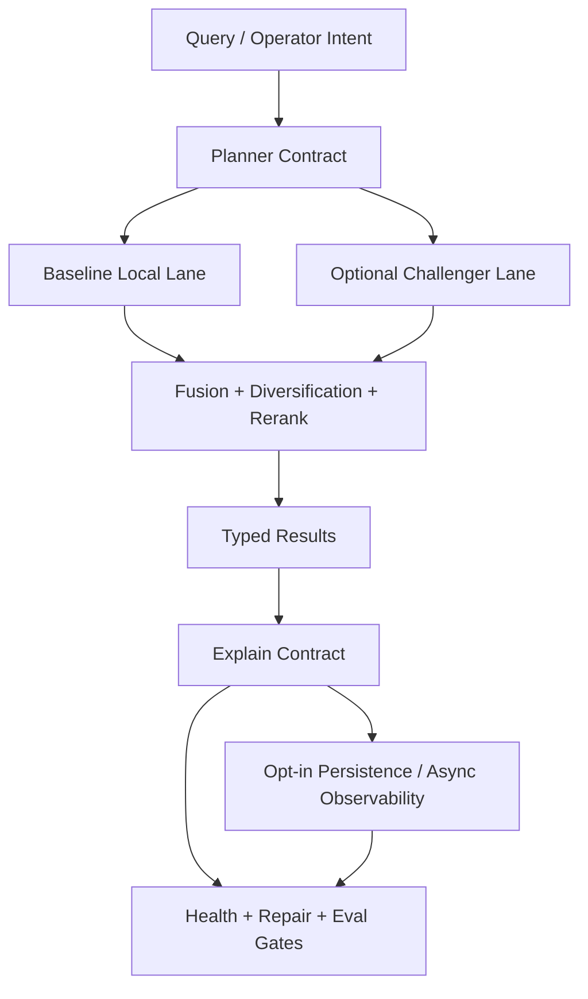

# Fulcrum RAG dual-rail architecture

## Overview

Fulcrum needs a second RAG pass that changes the center of gravity from "broadly instrumented RAG surfaces" to "one coherent retrieval and repair system with an honest local baseline plus optional challenger lanes." The plan keeps the current local-first model, preserves existing focused tools, and introduces a common planner contract that baseline and optional Python/Rust lanes must both satisfy.

This plan does not chase a rewrite. It upgrades the default local lane into a credible everyday path, separates read-only retrieval from telemetry persistence, turns repair into real orchestration, unifies eval/adoption gating, and then lets optional challenger lanes compete under the same contract.

## Problem Frame

The current codebase already has most of the right nouns: `searchContext()`, `searchCode()`, query traces, health, repair plans, live evals, graph evidence, and optional runtime experiments. The remaining problem is that quality and authority are uneven across those surfaces.

The main gaps, carried forward from the origin requirements doc, are:
- unified retrieval is not yet planner-grade hybrid retrieval across baseline and challenger lanes.
- read-path search is coupled to persistence and observability.
- repair planning is still command synthesis from health output instead of dependency-aware orchestration.
- evaluation and runtime experiments exist, but they do not yet define one acceptance contract for baseline and optional lanes.
- core RAG modules are too large to remain stable under continued feature growth.

This plan converts those gaps into one execution model that satisfies both agent and operator needs without giving up local-first defaults. See origin: `docs/brainstorms/2026-04-23-fulcrum-rag-10-dual-rail-requirements.md`.

## Requirements Trace

- R1-R5. Deliver one agent-preferred retrieval contract, keep focused compatibility tools, make retrieval read-only by default, and provide true hybrid retrieval semantics.
- R6-R9. Preserve a strong local baseline while letting optional Python ML and Rust lanes compete under the same planner and adoption gates.
- R10-R13. Turn repair into dependency-aware orchestration with explicit targeted-vs-clean-slate reasoning and post-run verification.
- R14-R17. Keep explainability first-class and enforce one evaluation/adoption contract across baseline and challenger lanes.
- R18-R20. Preserve CLI and MCP/action parity with clear read/write separation for agents and operators.
- R21-R23. Decompose large modules into bounded concerns so new stages and lanes do not keep inflating monolith files.

## Scope Boundaries

- No rewrite of Fulcrum’s full control plane in Rust, Python, or another language.
- No hosted-first or cloud-required retrieval path.
- No removal of `recall_knowledge`, `search_code`, or other focused compatibility surfaces.
- No adoption of optional challenger lanes as defaults before gates pass.
- No attempt to solve all future multi-language code intelligence in this pass.

### Deferred to Separate Tasks

- Multi-language parser/index expansion beyond the current immediate code-RAG needs.
- Hosted or remote-store rollout paths for optional challenger lanes.
- Full performance tuning of Python/Rust challengers after functional parity and eval gates exist.

## Context & Research

### Relevant Code and Patterns

- `packages/memory/src/retrieval/search-context.ts` — current unified retrieval surface; strongest signal of where planner, scoring, persistence, and graph logic are still coupled.
- `packages/memory/src/retrieval/search-code.ts` — current code retrieval surface; already has stronger hybrid shape than `search-context.ts`.
- `packages/memory/src/retrieval/query-trace.ts` — current redacted trace persistence contract.
- `packages/memory/src/setup/rag-health.ts` — current health model and profile manifest logic.
- `packages/memory/src/setup/rag-repair.ts` — current repair plan generator; useful baseline but not orchestration-grade yet.
- `packages/memory/src/eval/roadmap.ts` — current live/fixture eval orchestration and readiness logic.
- `packages/memory/src/runtime/experiments.ts` and `packages/memory/src/runtime/adapters.ts` — current optional-lane adoption and adapter vocabulary.
- `packages/cli/src/tool-registry.ts`, `packages/cli/src/mcp-tools.ts`, and `packages/monitor/src/server.ts` — current parity surfaces for readouts, search, eval, and runtime experiments.
- `specs/001-rag-lifecycle-hardening/` and `specs/002-rag-roadmap-delivery/` — existing roadmap contracts and boundaries to preserve and evolve.
- `docs/audit/2026-04-23-fulcrum-rag-10-roadmap-research.md` — most relevant internal audit and sequence guidance.

### Institutional Learnings

- No `docs/solutions/` directory exists in the repo today, so there are no packaged institutional learnings to reuse from that path.
- The strongest local learning source for this plan is the April 2026 RAG audit and the already-landed roadmap/spec artifacts rather than a separate solutions corpus.
- Repo invariants from `AGENTS.md` materially shape this plan: local-first defaults, CLI/MCP parity, in-memory SQLite tests, `.js` ESM imports, `newId(<type>)`, capability helpers for role checks, and persisted enum/CHECK parity.

### External References

- None used for this planning pass. Local repo context is strong enough, and the key decisions are architectural/sequencing questions rather than vendor-API questions.

## Key Technical Decisions

- **One planner contract, many lanes:** Retrieval should converge on a common planner contract rather than separate user-facing products for baseline and challenger paths.
- **Read path first, observability second:** Search defaults to read-only semantics; persistence becomes explicit opt-in or asynchronous side-channel work.
- **Baseline must become honestly strong:** Optional lanes may raise the ceiling, but the default local path must become credible for everyday agent and operator use.
- **Repair is an orchestrator, not only a translator:** Health output remains input, but repair planning must own dependency ordering, clean-slate decisions, and post-run verification.
- **Eval is the trust gate for every lane:** Baseline and challenger lanes both live or die on the same live and fixture acceptance contract.
- **Decomposition before growth:** Split large RAG modules along planner, lane, observability, repair, and eval boundaries before adding more retrieval weight.

## Open Questions

### Resolved During Planning

- **Should this be baseline-only or sidecar-first?** Use a dual-rail plan: strong local baseline plus optional challenger lanes, with one shared planner contract.
- **Should the plan optimize for agents or operators first?** No tradeoff accepted; the same contract must serve both.
- **Should external best-practice research drive this plan?** No. The main work is repo architecture and sequencing, and the existing repo/audit context is sufficient for a credible plan.
- **Should search remain stateful by default?** No. Read/write separation is a product requirement, not an implementation detail.

### Deferred to Implementation

- Exact quantitative thresholds for a “credible high-confidence” baseline across `live-rag`, `code-rag`, and `unified-context`.
- Exact boundary between Python ML responsibilities and Rust search/index responsibilities for the first challenger-lane increment.
- Exact method/file split once the decomposition starts and existing tests expose the safest module boundaries.
- Whether some current planner-stage names should remain public or become internal aliases behind a cleaner trace contract.

## Output Structure

```text
packages/memory/src/
  retrieval/
    planner/
      contract.ts
      planner.ts
      baseline-lane.ts
      lane-selection.ts
      fusion.ts
      observability.ts
    search-context.ts
    search-code.ts
    query-trace.ts
  setup/
    repair/
      contract.ts
      dependency-graph.ts
      actions.ts
      verification.ts
    rag-health.ts
    rag-repair.ts
  eval/
    roadmap/
      contract.ts
      runner.ts
      gates.ts
      lane-comparison.ts
    roadmap.ts
  runtime/
    challengers/
      contract.ts
      python-ml.ts
      rust-search.ts
    experiments.ts
  tests/
    search-planner-readonly.test.ts
    search-planner-lanes.test.ts
    rag-repair-orchestrator.test.ts
    rag-eval-lane-gates.test.ts
    rag-challenger-contract.test.ts
packages/cli/src/
  commands/
    memory-search-context.ts
    memory-rag-health.ts
    memory-rag-eval.ts
    memory-runtime-experiments.ts
  tool-registry.ts
  mcp-tools.ts
packages/monitor/src/
  server.ts
docs/guides/
  cli-reference.md
  mcp-tools.md
  rag-runtime-experiments.md
```

## High-Level Technical Design

> *This illustrates the intended approach and is directional guidance for review, not implementation specification. The implementing agent should treat it as context, not code to reproduce.*



The intended shape is:
- planner owns intent, lane selection, shared stage contract, and result contract.
- lanes own candidate generation, lane-specific runtime truth, and degradation/skipped reporting.
- fusion owns ranking and source-diversity decisions rather than lane-specific ad hoc math.
- explain contract owns what users and tests can inspect.
- persistence is downstream of explain, not fused into the main read path.
- health/repair/eval consume planner and observability outputs but do not redefine their semantics.

## Phased Delivery

### Phase 1 — Contract and baseline semantics
- carve planner/read-write split
- upgrade baseline unified retrieval
- stabilize repair planning boundaries

### Phase 2 — Trust and comparison
- unify eval and acceptance gates
- attach optional challenger lanes to the common contract

### Phase 3 — Structural hardening
- decompose oversized modules
- finish parity/documentation cleanup

## Implementation Units

- [x] **Unit 1: Planner contract and read/write split**

**Goal:** Create the common retrieval planner contract and separate read-only retrieval from persisted observability.

**Requirements:** R1-R5, R14, R18-R19, R21-R23

**Dependencies:** None

**Files:**
- Create: `packages/memory/src/retrieval/planner/contract.ts`
- Create: `packages/memory/src/retrieval/planner/planner.ts`
- Create: `packages/memory/src/retrieval/planner/observability.ts`
- Modify: `packages/memory/src/retrieval/search-context.ts`
- Modify: `packages/memory/src/retrieval/search-code.ts`
- Modify: `packages/memory/src/retrieval/query-trace.ts`
- Modify: `packages/cli/src/commands/memory-search-context.ts`
- Modify: `packages/cli/src/tool-registry.ts`
- Modify: `packages/cli/src/mcp-tools.ts`
- Test: `packages/memory/src/tests/search-planner-readonly.test.ts`
- Test: `packages/memory/src/tests/search-context-contract.test.ts`
- Test: `packages/cli/src/tests/search-context-contract.test.ts`

**Approach:**
- Introduce one planner-facing request/result contract shared by `searchContext()` and `searchCode()`.
- Move persistence decisions behind explicit planner options or a separate observability sink so retrieval can remain non-mutating by default.
- Preserve current CLI/MCP surfaces, but make their mutating behavior opt-in rather than ambient.
- Keep current redaction and workspace/project scoping rules as non-negotiable invariants.

**Execution note:** Start with failing contract tests that prove search does not write trace/result/context-pack rows unless explicitly requested.

**Patterns to follow:**
- `packages/memory/src/retrieval/query-trace.ts`
- `packages/cli/src/tool-registry.ts`
- `packages/memory/src/tests/search-context-contract.test.ts`

**Test scenarios:**
- Happy path: a unified search request returns typed results and explanation data without creating `rag_query_traces`, `rag_context_results`, or `context_packs` rows by default.
- Happy path: an explicit persist/explain mode writes the expected trace and result rows with redacted fields and stable IDs.
- Edge case: a query with graph disabled still returns deterministic results and reports graph stages as skipped rather than missing.
- Error path: a caller requests persistence without required scoping fields and receives a scoped validation failure rather than partial writes.
- Integration: CLI `search_context` capability metadata reflects the new read-by-default semantics while preserving a non-destructive opt-in persistence path.

**Verification:**
- Retrieval semantics can be described as read-only by default without hand-waving, and the CLI/MCP capability model matches actual behavior.

- [x] **Unit 2: Baseline local lane upgrade**

**Goal:** Make the default local unified retrieval lane genuinely hybrid and strong enough to serve as the everyday path.

**Requirements:** R1-R6, R14-R17

**Dependencies:** Unit 1

**Files:**
- Create: `packages/memory/src/retrieval/planner/baseline-lane.ts`
- Create: `packages/memory/src/retrieval/planner/fusion.ts`
- Modify: `packages/memory/src/retrieval/search-context.ts`
- Modify: `packages/memory/src/retrieval/search-code.ts`
- Modify: `packages/memory/src/retrieval/context-pack.ts`
- Modify: `packages/memory/src/eval/roadmap.ts`
- Test: `packages/memory/src/tests/search-planner-lanes.test.ts`
- Test: `packages/memory/src/tests/search-context-ranking.test.ts`
- Test: `packages/memory/src/tests/search-code-vector.test.ts`
- Test: `packages/memory/src/tests/context-pack.test.ts`

**Approach:**
- Reuse the strongest parts of current local retrieval: lexical recall, current code-vector retrieval, freshness signals, graph evidence, and source-diverse context packing.
- Replace the current `search_context` semantic placeholder behavior with real candidate generation and bounded lane-level scoring.
- Keep skipped/degraded stage reporting explicit so a weak baseline never masquerades as a strong one.
- Ensure the local lane stays local-first and works without optional challenger infrastructure.

**Execution note:** Implement new ranking behavior test-first with fixture data that proves semantic candidates change ranking outcomes.

**Patterns to follow:**
- `packages/memory/src/retrieval/search-code.ts`
- `packages/memory/src/retrieval/v3-search.ts`
- `packages/memory/src/tests/search-context-ranking.test.ts`

**Test scenarios:**
- Happy path: a unified search query that needs semantic recall returns the relevant memory/code evidence even when lexical overlap is weak.
- Happy path: graph evidence changes ranking and that contribution is reflected in explanation output.
- Edge case: no current vectors available causes semantic stages to degrade cleanly while lexical/contextual results still return.
- Edge case: source-diversity caps prevent one file or one memory family from dominating the packed context.
- Error path: lane-internal vector or graph failures are reported as degraded/skipped stages without leaking secrets or absolute paths.
- Integration: live eval calls through the baseline lane see the same result/explain contract that interactive search uses.

**Verification:**
- `search_context` no longer behaves like lexical heuristics plus observability; baseline retrieval quality moves materially toward the live-eval acceptance bar.

- [x] **Unit 3: Repair planner becomes orchestration**

**Goal:** Upgrade repair from domain-status command synthesis into dependency-aware orchestration with explicit verification.

**Requirements:** R10-R13, R19-R20, R21-R22

**Dependencies:** Unit 1

**Files:**
- Create: `packages/memory/src/setup/repair/contract.ts`
- Create: `packages/memory/src/setup/repair/dependency-graph.ts`
- Create: `packages/memory/src/setup/repair/actions.ts`
- Create: `packages/memory/src/setup/repair/verification.ts`
- Modify: `packages/memory/src/setup/rag-repair.ts`
- Modify: `packages/memory/src/setup/rag-lifecycle.ts`
- Modify: `packages/memory/src/setup/rag-health.ts`
- Modify: `packages/cli/src/commands/memory-rag-health.ts`
- Test: `packages/memory/src/tests/rag-repair-orchestrator.test.ts`
- Test: `packages/memory/src/tests/rag-health.test.ts`
- Test: `packages/cli/src/tests/rag-health-readonly.test.ts`

**Approach:**
- Introduce a repair state model that distinguishes targeted repair, clean-slate rebuild of derived state, blocking conditions, and post-run verification.
- Keep health as the detector and reporter, but let repair own sequencing and acceptance.
- Preserve local-first safety: canonical sources remain immutable; only derived/operational domains are repaired or rebuilt.
- Ensure operators and agents can inspect the proposed plan without triggering mutation.

**Execution note:** Start with failing orchestration tests that prove targeted repair and clean-slate rebuild are distinguishable outcomes.

**Patterns to follow:**
- `packages/memory/src/setup/rag-repair.ts`
- `packages/memory/src/setup/rag-lifecycle.ts`
- `specs/002-rag-roadmap-delivery/spec.md`

**Test scenarios:**
- Happy path: degraded vector/code/graph domains produce an ordered repair plan with explicit dependencies and verification steps.
- Happy path: a post-run verification pass marks the repair successful only when health and eval gates clear.
- Edge case: a domain with unrecoverable profile/runtime constraints becomes a blocking condition rather than a misleading executable action.
- Edge case: targeted repair is selected when only one derived domain is stale while other domains remain current.
- Error path: repair planning never proposes mutation of canonical L0/L1 sources.
- Integration: CLI and lifecycle surfaces return the same repair plan semantics and do not silently diverge.

**Verification:**
- `buildRagRepairPlan()` can be described as an orchestrator with explicit reasoning, not only a health-to-command formatter.

- [x] **Unit 4: Unified evaluation and trust gates**

**Goal:** Make baseline and challenger lanes live under one eval, readiness, and acceptance contract.

**Requirements:** R9, R14-R17, R20

**Dependencies:** Units 1-3

**Files:**
- Create: `packages/memory/src/eval/roadmap/contract.ts`
- Create: `packages/memory/src/eval/roadmap/gates.ts`
- Create: `packages/memory/src/eval/roadmap/lane-comparison.ts`
- Modify: `packages/memory/src/eval/roadmap.ts`
- Modify: `packages/memory/src/eval/live-rag/runner.ts`
- Modify: `packages/cli/src/commands/memory-rag-eval.ts`
- Modify: `packages/monitor/src/server.ts`
- Test: `packages/memory/src/tests/rag-eval-lane-gates.test.ts`
- Test: `packages/memory/src/eval/live-rag/runner.test.ts`
- Test: `packages/monitor/src/tests/rag-roadmap-readouts.test.ts`

**Approach:**
- Add lane identity and lane comparison to the roadmap eval model so baseline and challengers can be judged on the same cases and thresholds.
- Keep fixture and live eval separation, but make both feed the same acceptance story.
- Expose the exact reason a lane is trusted, degraded, or rejected in machine-readable form.
- Preserve opt-in behavior for model-heavy and accelerator-heavy evaluation paths.

**Execution note:** Add failing lane-comparison and gate tests before reshaping eval result schemas.

**Patterns to follow:**
- `packages/memory/src/eval/roadmap.ts`
- `packages/memory/src/runtime/experiments.ts`
- `packages/monitor/src/server.ts`

**Test scenarios:**
- Happy path: baseline and challenger lanes can both run on the same eval suite and produce comparable metrics under one result contract.
- Happy path: a challenger with better quality but unacceptable latency or missing rollback proof is rejected by gates.
- Edge case: live coverage degraded in one required domain marks the lane degraded even if fixture cases pass.
- Error path: missing or malformed lane metadata fails closed rather than implicitly treating the lane as trusted.
- Integration: monitor readouts and CLI eval commands expose lane trust and degradation without schema drift.

**Verification:**
- There is one answer to “why is this lane trusted?” and that answer is visible in both CLI and monitor outputs.

- [x] **Unit 5: Optional challenger lanes under the common contract**

**Goal:** Introduce optional Python ML and Rust search/index lanes as challengers rather than parallel products.

**Requirements:** R2, R7-R9, R15-R20, R23

**Dependencies:** Units 1-4

**Files:**
- Create: `packages/memory/src/runtime/challengers/contract.ts`
- Create: `packages/memory/src/runtime/challengers/python-ml.ts`
- Create: `packages/memory/src/runtime/challengers/rust-search.ts`
- Modify: `packages/memory/src/runtime/adapters.ts`
- Modify: `packages/memory/src/runtime/experiments.ts`
- Modify: `packages/cli/src/commands/memory-runtime-experiments.ts`
- Modify: `packages/cli/src/tool-registry.ts`
- Modify: `packages/cli/src/mcp-tools.ts`
- Modify: `docs/guides/rag-runtime-experiments.md`
- Test: `packages/memory/src/tests/rag-challenger-contract.test.ts`
- Test: `packages/memory/src/tests/rag-runtime-adoption-gates.test.ts`
- Test: `packages/cli/src/tests/rag-runtime-experiment-contract.test.ts`

**Approach:**
- Define challenger lanes as stage-capable contracts that plug into the same planner, explain, and eval model as the baseline.
- Keep them disabled by default and separately report availability, readiness, and adoption state.
- Make “challenger lane” mean “candidate implementation of planner stages,” not “separate search product.”
- Defer exact Python vs Rust ownership splits to implementation, but lock the shared contract and trust model in this unit.

**Execution note:** Start with failing contract tests that prove challengers cannot bypass baseline trust gates or mutate default behavior when disabled.

**Patterns to follow:**
- `packages/memory/src/runtime/adapters.ts`
- `packages/memory/src/runtime/experiments.ts`
- `docs/guides/rag-runtime-experiments.md`

**Test scenarios:**
- Happy path: a disabled challenger lane is visible for reporting/comparison but does not affect default retrieval.
- Happy path: a challenger lane can provide stage results through the common planner contract and surface runtime truth in the shared explain model.
- Edge case: an unavailable challenger adapter reports out-of-scope/disabled cleanly without poisoning baseline health.
- Error path: adoption is denied when any required gate is missing, failed, or unverifiable.
- Integration: CLI runtime-experiment reporting and adoption commands reflect the same lane contract the planner and eval runner use.

**Verification:**
- Optional lanes raise the ceiling without changing the user’s mental model of retrieval, explain, or trust.

- [x] **Unit 6: Module decomposition and parity hardening**

**Goal:** Split the oversized RAG modules into bounded units and finish cross-surface parity/documentation cleanup.

**Requirements:** R18-R23

**Dependencies:** Units 1-5

**Files:**
- Modify: `packages/memory/src/retrieval/search-context.ts`
- Modify: `packages/memory/src/retrieval/search-code.ts`
- Modify: `packages/memory/src/setup/rag-health.ts`
- Modify: `packages/memory/src/setup/rag-repair.ts`
- Modify: `packages/memory/src/eval/roadmap.ts`
- Modify: `packages/memory/src/index.ts`
- Modify: `packages/cli/src/tool-registry.ts`
- Modify: `packages/monitor/src/server.ts`
- Modify: `docs/guides/cli-reference.md`
- Modify: `docs/guides/mcp-tools.md`
- Test: `packages/memory/src/tests/search-context-contract.test.ts`
- Test: `packages/memory/src/tests/search-code-ranking.test.ts`
- Test: `packages/monitor/src/tests/rag-health-endpoint.test.ts`
- Test: `packages/cli/src/tests/rag-roadmap-mcp-tools.test.ts`

**Approach:**
- Move planner, repair, eval, and lane logic behind smaller concern-oriented modules while preserving public exports and contracts.
- Use parity tests and documentation to lock the external behavior after the internal split.
- Treat this as feature-hardening work, not cleanup-only work; each move must preserve or tighten test coverage.
- Keep source file moves aligned with ownership boundaries so future planner/lane additions do not re-form new monoliths.

**Execution note:** Add characterization coverage before moving behavior out of the current large files.

**Patterns to follow:**
- Existing package index re-export style in `packages/memory/src/index.ts`
- Current CLI/monitor contract tests for RAG surfaces
- Repo import conventions from `AGENTS.md`

**Test scenarios:**
- Happy path: public CLI/MCP/monitor contracts remain stable after internal module moves.
- Edge case: workspace/project scoping remains intact across moved retrieval, health, repair, and eval logic.
- Error path: module extraction does not reintroduce raw path or secret leakage into traces, reports, or readouts.
- Integration: end-to-end RAG readouts still compose health, eval, jobs, and query traces correctly after the refactor.

**Verification:**
- The main RAG files are materially smaller, ownership boundaries are clearer, and external behavior remains stable under the existing contract tests.

## System-Wide Impact

- **Interaction graph:** planner, repair, eval, runtime experiments, CLI registry, MCP schemas, and monitor readouts will all consume a more explicit shared contract.
- **Error propagation:** lane failures and degradation states must flow into explain/eval/health without collapsing the whole request path or fabricating healthy output.
- **State lifecycle risks:** read/write split changes the persistence lifecycle for search; explicit persistence flags and async sinks must avoid duplicate traces and partial writes.
- **API surface parity:** `search_context`, `search_code`, health, repair, eval, runtime-experiment, and monitor endpoints all need coordinated contract updates.
- **Integration coverage:** planner read semantics, repair verification semantics, and challenger-lane trust gates all require integration-style tests in addition to unit tests.
- **Unchanged invariants:** local-first defaults, disabled-by-default optional lanes, path/secret redaction, scoped workspace/project access, SQLite-backed in-memory tests, and compatibility tools remain intact.

## Success Metrics

- Default local retrieval is accepted as the everyday path for both agents and operators without requiring optional lanes for obvious quality fixes.
- Search defaults to read-only semantics while preserving explicit explain/persist workflows.
- Repair plans can express targeted repair vs clean-slate rebuild with verification-aware outcomes.
- Baseline and challenger lanes can be compared through one explain/eval/trust contract.
- The largest RAG files shrink materially and stop acting as all-in-one feature buckets.

## Alternative Approaches Considered

- **Baseline-only hardening:** rejected because it would leave no clear contract for optional lanes and would force another architectural pass later.
- **Sidecar-first ceiling chase:** rejected because it would keep the default local lane second-class and fragment operator/agent semantics.
- **Full rewrite around new stores/services:** rejected because it would violate the current local-first posture and over-rotate from the immediate 10/10 gaps.

## Risks & Dependencies

| Risk | Mitigation |
|------|------------|
| Planner extraction breaks existing contracts while trying to improve semantics | Lock external behavior with characterization tests before moving logic and use compatibility wrappers during the transition |
| Read/write separation creates hidden observability regressions | Introduce explicit persistence modes, test default non-mutation, and preserve an async/explicit sink path |
| Baseline lane still underperforms and sidecars become de facto required | Make baseline eval thresholds explicit and require them before declaring challenger lanes necessary for routine usage |
| Challenger-lane contract becomes too abstract and hides real operational differences | Keep lane contract narrow: candidate generation, runtime truth, degradation, and trust gates only |
| Repair orchestration grows into a second monolith | Split contract, dependency graph, actions, and verification early rather than extending `rag-repair.ts` in place |

## Documentation / Operational Notes

- Update operator-facing docs only after the planner/read-write split and repair semantics are stable enough to avoid churn.
- Preserve language in docs that optional runtime/store/model paths remain disabled by default.
- Monitor readouts should reflect lane trust state and read/write semantics without introducing new mutable monitor behavior.

## Sources & References

- **Origin document:** `docs/brainstorms/2026-04-23-fulcrum-rag-10-dual-rail-requirements.md`
- Related plan/spec: `specs/001-rag-lifecycle-hardening/plan.md`
- Related plan/spec: `specs/002-rag-roadmap-delivery/plan.md`
- Related audit: `docs/audit/2026-04-23-fulcrum-rag-10-roadmap-research.md`
- Related code: `packages/memory/src/retrieval/search-context.ts`
- Related code: `packages/memory/src/retrieval/search-code.ts`
- Related code: `packages/memory/src/setup/rag-repair.ts`
- Related code: `packages/memory/src/eval/roadmap.ts`
